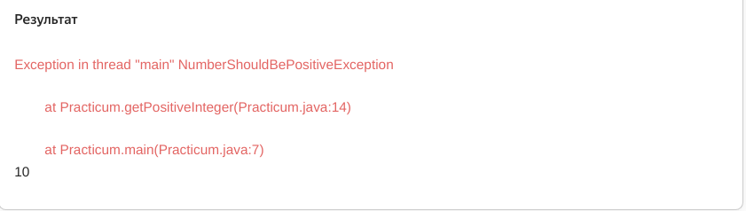
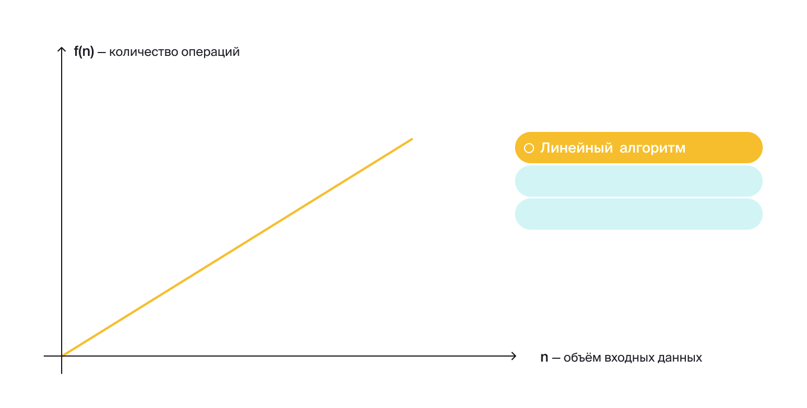
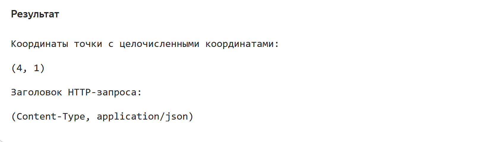
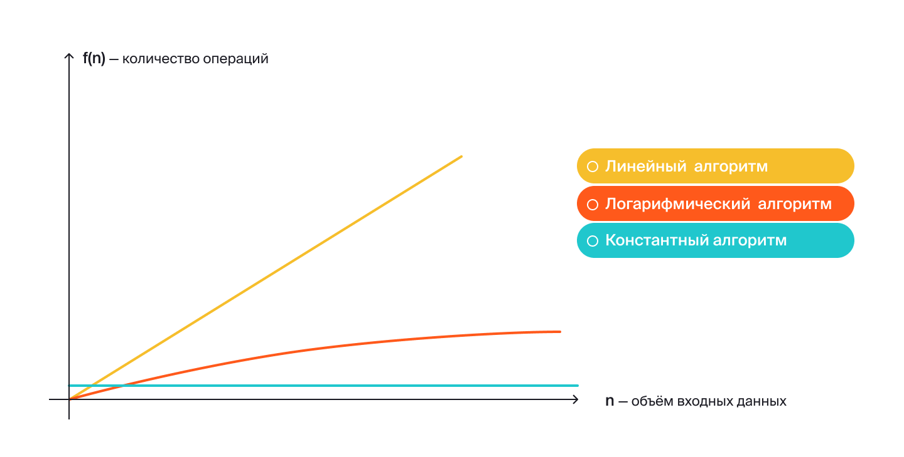
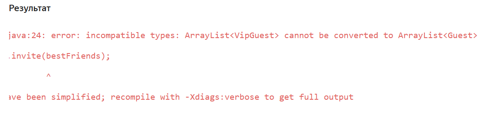
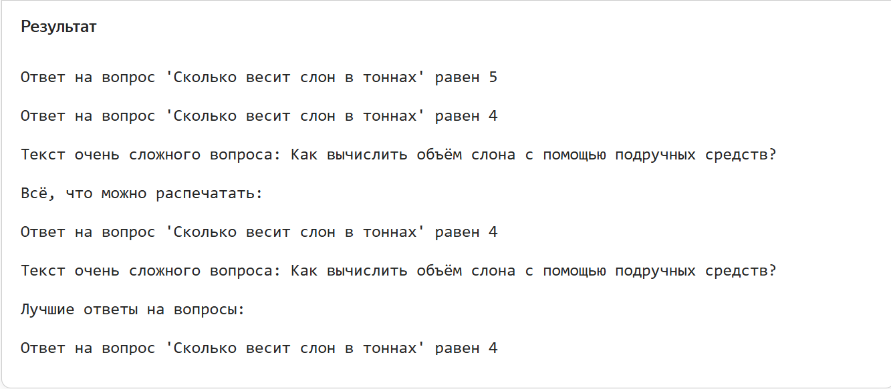

# Урок 10. Дженерики в Java

# Требования к сдаче работы

Задание выполняется в среде программирования Idea. Результат надо разместить в своем репозитории на GitHub.
Прислать в гугл-формы(размещенная на моем сайте) ссылку на репозиторий.

***Критерии оценивания***

* Оценка 5 - надо сделать все пять заданий.
* Оценка 4 - надо сделать любые три задания.
* Оценка 3 - надо сделать одно любое задание.

1. [Введение в тему](#введение-в-тему)
2. [Параметризированные методы](#параметризированные-методы)
3. [Задание 1](#задание-1)
4. [Параметризированные классы](#параметризированные-классы)

<details>
<summary>Введение в тему</summary>

# Введение в тему

Вы уже познакомились с двумя видами полиморфизма: полиморфизмом подтипов и ad-hoc полиморфизмом. В новой теме вы
рассмотрите третий, заключительный вид полиморфизма — параметрический полиморфизм.

Вы узнаете:

* Как можно писать методы, работающие одинаково с разными типами данных, используя параметризованные методы.
* Что такое параметр типа и что общего у него с обычным параметром метода.
* Для чего используются параметризованные классы и при чём здесь стандартные коллекции Java.
* В чём может быть сложность, когда нужно совместно использовать разные виды полиморфизма.
* С помощью каких инструментов можно писать код, работающий с ограниченным множеством типов данных.

* Вы примените новые знания, помогая агентству праздников разобраться со списком гостей. А также разработаете свою
  усложнённую версию универсальной хеш-таблицы. Навстречу новым приключениям!

</details>

<details>

<summary>Параметризированные методы</summary>

# Параметризированные методы

В прошлой теме вы познакомились с последним, четвёртым принципом ООП — полиморфизмом.
Вы изучили два его вида: полиморфизм подтипов и ad-hoc полиморфизм.

> Полиморфизм подтипов — способность программы одинаково работать с объектами, если они имеют одинаковый интерфейс.

> Ad-hoc полиморфизм — возможность написать разные реализации для одного и того же метода в зависимости от типов
> аргументов.

Ad-hoc полиморфизм считается «мнимым».
При его использовании нельзя один раз написать метод, который бы сразу же работал со множеством типов.
Вместо этого для каждого случая нужно делать специальную реализацию (перегружать метод).
В этом уроке вы узнаете о **параметрическом полиморфизме**.
Он считается «истинным» и наряду с сабтайпингом относится к универсальному полиморфизму. Параметрический полиморфизм
позволяет написать одну реализацию, которая будет универсально работать со множеством типов.
Но прежде чем погрузиться в новый материал, выполните небольшое задание.

## Параметры метода

Для начала вспомним, что такое параметры метода и для чего они используются. Допустим, вам нужно реализовать метод,
который выводит на экран стройные строфы стихотворения А.С. Пушкина. Метод может выглядеть следующим образом:

```java
static void printSpringDaysPoem(){
        System.out.println("\t\t\t\t\t ***");
        System.out.println("\t В беспечных радостях, в живом очарованье,");
        System.out.println("\t О дни весны моей, вы скоро утекли.");
        System.out.println("\t Теките медленней в моем воспоминанье.");
        } 
```

Строка `***` обозначает начало стихотворения. Символ табуляции (`\t`) в каждой строке нужен,
чтобы строки отображались с отступом от края экрана. Вывод будет таким:


Следующая задача — вывести на экран стихотворение «Узник». В этом случае вы можете пойти аналогичным путём: создать
новый метод с соответствующим названием,
например printPrisonerPoem(), и заменить строки на нужные.

Но можно поступить и по-другому. Так как оба метода работают одинаково,
логичнее вместо двух методов создать один. Назовём его printPoem(). Строки стихотворения передадим в него параметром.
Получим:

```java
static void printPoem(ArrayList<String> poemLines){
        System.out.println("\t\t\t\t\t ***");
        for(String line:poemLines){
        System.out.println("\t "+line);
        }
        } 
```

Теперь передадим строки стихотворения при вызове метода:

```java
public static void main(String[]args){
        ArrayList<String> prisonerLines=new ArrayList<>();
        prisonerLines.add("Сижу за решеткой в темнице сырой.");
        prisonerLines.add("Вскормленный в неволе орел молодой,");
        prisonerLines.add("Мой грустный товарищ, махая крылом,");
        prisonerLines.add("Кровавую пищу клюет под окном,");

        printPoem(prisonerLines);
        }
```

Этот подход позволил избежать дублирования кода. Вместо множества однотипных методов использовали один. А вариативную
часть передали в качестве параметра.

## Параметр типа

Теперь представьте, что ваша программа для вывода стихотворений стала очень популярна.
Агентство «Праздник Экспресс» даже захотело себе такое же приложение!
Вас попросили сделать аналогичную программу, которая бы вместо стихотворений выводила список гостей.
За основу можно взять код, над которым вы работали.

Но проблема пришла откуда не ждали: список гостей у агентства представлен как объект `ArrayList<Guest>`,
где `Guest` — специальный класс, описывающий гостя.
Класс `Guest` выглядит так:

```java
public class Guest {

    String name;
    String surname;

    public Guest(String name, String surname) {
        this.name = name;
        this.surname = surname;
    }

    @Override
    public String toString() {
        return name + " " + surname;
    }
}
```

Один из способов решить проблему — создать ещё одну версию метода, которая будет работать с объектами класса `Guest`, а
не со строками.
Но у нового метода будет такой же код, как и у метода `printPoem()`. Это решение не самое оптимальное: оно приведёт к
дублированию.

На выручку придёт **параметрический полиморфизм**. С его помощью можно описать реализацию метода или класса, которая
будет работать со множеством типов данных.

То есть вы можете реализовать один метод — назовём его `printSmart()`, — и он будет выводить на экран список объектов
любого типа данных!

> 💡 Если передать объект класса Guest в метод System.out.println,
> у него будет автоматически вызван метод toString().
> В таком случае на экран выведется имя и фамилия гостя, как и ожидалось.


При этом принцип такой же, как если бы вы передавали текст стихотворения в качестве параметра метода.
Разница лишь в том, что теперь потребуется особый вид параметра — параметр типа.
В него и будем передавать тип входных данных.

Рассмотрим пример кода:

```java
static<T> void printSmart(ArrayList<T> items){
        System.out.println("\t\t\t\t\t ***");
        for(T item:items){
        System.out.println("\t "+item);
        }
        } 
```

Разберём, что к чему. При объявлении метода имя параметра типа указывается в угловых скобках — `<>`.
Оно должно находиться перед типом возвращаемого значения. В примере объявили метод как `static <T> void printSmart`.
То есть указали, что в методе будет использоваться параметр типа с именем `T`.

Далее указываем, что параметром метода будет список объектов типа `T`. Внутри метода можно работать с этим списком
обобщённо.
То есть независимо от того, что скрывается за типом `T`: это может быть строка, число или объект класса `Guest`.

Вызов метода будет полностью аналогичен вызову метода `printPoem()`. Запустите этот код и убедитесь, что
метод `printSmart()`
работает одинаково и с гостями, и со стихотворениями.

```java
import java.util.ArrayList;

public class GenericMethodExample {
    public static void main(String[] args) {
        ArrayList<Guest> guests = new ArrayList<>();
        guests.add(new Guest("Николай", "Петров"));
        guests.add(new Guest("Екатерина", "Майская"));

        // передаём список объектов Guest
        printSmart(guests);

        ArrayList<String> poem = new ArrayList<>();
        poem.add("В беспечных радостях, в живом очарованье,");
        poem.add("О дни весны моей, вы скоро утекли.");
        poem.add("Теките медленней в моем воспоминанье.");

        // передаём список строк
        printSmart(poem);
    }

    // <T> — указали, что метод будет использовать параметр типа с именем T
    // ArrayList<T> items — использовали ранее объявленный параметр типа — T, чтобы
    // указать, что передаваемый в метод список может содержать элементы
    // любого типа, который будет подставлен вместо T во время вызова метода
    static <T> void printSmart(ArrayList<T> items) {
        System.out.println("\t\t\t\t\t ***");
        // обходим в цикле элементы списка и для обозначения типа элементов
        // опять используем ранее объявленный параметр типа — T
        for (T item : items) {
            System.out.println("\t " + item);
        }
    }
}

class Guest {
    String name;
    String surname;

    public Guest(String name, String surname) {
        this.name = name;
        this.surname = surname;
    }

    @Override
    public String toString() {
        return name + " " + surname;
    }
}
```

```
Результат
					 ***

	 Николай Петров

	 Екатерина Майская

					 ***

	 В беспечных радостях, в живом очарованье,

	 О дни весны моей, вы скоро утекли.

	 Теките медленней в моем воспоминанье.
```

Обратите внимание: хотя у метода `printSmart()` есть параметр типа, при вызове этот параметр никак не передаётся.
Это происходит потому, что Java умеет определять значение параметра типа самостоятельно, исходя из типа аргумента.
В конкретном случае, так как в метод `printSmart()` передаётся значение типа `ArrayList<Guest>`,
компилятор автоматически определит значение типа `T` как `Guest`.
> Процесс, во время которого компилятор определяет требуемый тип, называется автоматическим выводом типов.

## Параметр типа в возвращаемом значении

Параметризовать можно не только тип аргумента, но и тип возвращаемого значения метода. Например:

```java
public class GenericMethodExample {
    public static void main(String[] args) {
        String name = null;
        String nameOrDefault = ifNull(name, "Unknown");
        System.out.println(nameOrDefault);

        Integer numberOrDefault = ifNull(4, 1);
        System.out.println(numberOrDefault);
    }

    //метод возвращает значение типа T
    public static <T> T ifNull(T value, T defaultValue) {
        return value == null ? defaultValue : value;
    }

}
```

Здесь метод `ifNull()` проверяет переданное значение на `null`. Если оно равно `null`, возвращает некоторое значение по
умолчанию.
Тип возвращаемого значения в этом случае будет таким же, как у аргументов метода: если вызвать метод `ifNull()` для
строк, он вернёт строку.
Если для чисел — число.

## Как использовать параметры типа

Неслучайно в этом уроке имя параметра — T. Это стандартный вариант для имени параметра, поскольку T — это первая буква
английского слова type — «тип».
Для названия можно использовать любую другую букву и даже слово.

> 💡 Обычно для имени параметров типа используют одну заглавную букву. Так имя параметра типа будет легче отличить от
> классов.
> Также часто используют следующие названия: E (англ. element — «элемент»),
> K (англ. key — «ключ»), V (англ. value — «значение»), N (англ. number — «число»), S, U и далее по алфавиту.


С параметром типа можно работать как с любым обычным типом данных. Например, можно использовать
цикл `for (T item: items)`,
подразумевая, что каждый элемент в списке `items` будет иметь тип `T`. Можно использовать тип `T` в аргументах метода
или создавать
переменные этого типа. Но существуют ограничения:

* Нельзя создавать новые объекты типа `T`. Это связано с особенностями реализации параметров типа в Java. Запись
  вида `new T()` вызовет ошибку компиляции.
* Тип обязательно должен быть ссылочным. Нельзя использовать примитивные типы.

Если примитивный тип данных нужен в качестве параметра типа, следует использовать класс-обёртку.
Например, можно передать в качестве параметра в printSmart список `ArrayList<Integer>`.
Методы, которые содержат параметр типа, называют дженерик-методами, а весь механизм работы с параметрами типов —
дженериками (англ. generics — «обобщения»).
Дженерики в Java позволяют классу или методу одинаково или обобщённо работать со значениями различных типов. То есть вы
пишете универсальный код,
а Java самостоятельно подставляет нужный тип данных вместо имени параметра типа.

Обобщать можно не только методы, но и целые классы. С некоторыми из таких параметризированных классов вы уже
сталкивались.
Например, `ArrayList` — обобщённый, или, другими словами, параметризованный класс. В контексте, принятом в
Java, `ArrayList` — это дженерик.

</details>


<details>

<summary>Задание 1</summary>

# Задание 1

Напишите обобщённый метод `size`, который принимает в качестве параметра список элементов любого типа и возвращает их
количество.
Для подсчёта элементов используйте цикл `for each`.

```java
import java.util.ArrayList;

class ArrayUtils {
    public static void main(String[] args) {
        ArrayList<Double> list1 = new ArrayList<>();
        list1.add(1.0);
        list1.add(2.0);
        list1.add(3.0);

        System.out.println("В первом списке " + size(list1) + " элементов");

        ArrayList<String> list2 = new ArrayList<>();
        list2.add("uno");
        list2.add("dos");
        list2.add("tres");
        list2.add("cuatro");
        list2.add("cinco");

        System.out.println("Во втором списке " + size(list2) + " элементов");
    }

    // Допишите реализацию обобщённого метода size
    ...

    size(...list) {
        ...
    }


}

```

## Подсказки

* Ожидается, что метод `size` будет возвращать целое число.
* Параметром метода `size` может быть список элементов любого типа.
  Поэтому нужно использовать параметр типа `Т`. Укажите его в угловых скобках в объявлении метода перед типом
  возвращаемого значения.
* Внутри метода `size` для того, чтобы посчитать количество элементов в списке, нужно пройтись в цикле по каждому из
  них.
  При этом каждый элемент списка будет иметь тип `Т`.

## Результат

```
Результат

    В первом списке 3 элементов

    Во втором списке 5 элементов
```

</details>


<details>

<summary>Параметризированные классы</summary>

# Параметризированные классы

В прошлом уроке вы познакомились с параметризированными методами.
Вы узнали, что можно создать один метод, который будет работать с различными типами объектов.
Подобный подход применим и к классам. В этом уроке вы разберётесь, как это сделать.

## Универсальный класс на основе класса Object

Представьте, что вы разрабатываете игру с открытым миром, где игрок перемещается по карте.
> Игра с открытым миром — это жанр видеоигр, где игроки свободно исследуют большой открытый мир, не ограниченный
> уровнями и рамками сюжета.

Вам необходимо описать класс, чтобы создать пару из двух значений:
в ней будут храниться координаты локации, в которой игрок находится прямо сейчас.


Значения координат задаются целыми числами. Код выглядит так:

```java
class Pair {
    public final Integer value1;
    public final Integer value2;

    public Pair(Integer value1, Integer value2) {
        this.value1 = value1;
        this.value2 = value2;
    }

    public void print() {
        System.out.printf("(%s, %s)", value1, value2);
    }

    public Integer getValue1() {
        return value1;
    }

    public Integer getValue2() {
        return value2;
    }
}

public class Practicum {

    public static void main(String[] args) {
        Pair pair = new Pair(4, 1);
        System.out.println("Координаты игрока на карте:");
        pair.print();
        Integer x = pair.getValue1();
        Integer y = pair.getValue2();
    }
}

```



Получившийся класс `Pair` может хранить любую пару целых чисел. Но ваши планы внезапно изменились:
теперь в программе нужен аналогичный класс, но для другой цели. В новом классе будет храниться пара,
состоящая из имени игрока и применённого им чит-кода.

Для этого можно продублировать уже имеющийся класс `Pair` и заменить типы его параметров с `Integer` на `String`:

```java
public class StringPair {
    public final String value1;
    public final String value2;

    public StringPair(String value1, String value2) {
        this.value1 = value1;
        this.value2 = value2;
    }

    public void print() {
        System.out.printf("(%s, %s)", value1, value2);
    }

    public String getValue1() {
        return value1;
    }

    public String getValue2() {
        return value2;
    }
}
```

Допустим, вам снова понадобится аналогичный класс, который будет хранить в себе пару значений для другого типа.
Снова дублировать код — не вариант. Нужна универсальная пара,
принимающая значения любого типа. В таком случае применять класс можно будет и в других задачах.

Попробуем воспользоваться полиморфизмом подтипов. Для полей класса `Pair` используем класс,
который будет общим интерфейсом или суперклассом `String` и `Integer`. Таким общим суперклассом будет класс `Object`.
Код универсального класса `Pair` при этом будет выглядеть так:

```java
class Pair {
    public final Object value1;
    public final Object value2;

    public Pair(Object value1, Object value2) {
        this.value1 = value1;
        this.value2 = value2;
    }

    public void print() {
        System.out.printf("(%s, %s)", value1, value2);
    }

    public Object getValue1() {
        return value1;
    }

    public Object getValue2() {
        return value2;
    }
}

public class Practicum {

    public static void main(String[] args) {
        Pair pair = new Pair(3, 1);
        System.out.println("Координаты игрока на карте:");
        pair.print();
        Integer x = (Integer) pair.getValue1();
        Integer y = (Integer) pair.getValue2();

        System.out.println();

        Pair stringPair = new Pair("username", "qwerty");
        System.out.println("Чит-код пользователя:");
        stringPair.print();
        String user = (String) stringPair.getValue1();
        String cheatCode = (String) stringPair.getValue2();
    }

}

```



Теперь класс `Pair` может хранить значения любых классов.

В Java подобный подход до определённого момента был единственным вариантом реализации «универсальных» классов.
Например, именно так был изначально реализован класс `ArrayList`. Но у этого подхода есть существенные проблемы.
Такой код допускает большую вероятность ошибок.

Вернёмся к примеру. Раньше класс принимал только значения одного заданного типа — `String` либо `Integer`, — с которым
вы потом взаимодействовали.
Теперь в одну пару можно положить значения разных типов. Например, можно случайно передать строку вместо координаты и
попытаться работать с
ней как с числом, что приведёт к ошибке.

К тому же в коде появится явное приведение типов. При вызове методов `getValue1()` и `getValue2()` потребуется явно
указывать,
значения какого типа нужно получить. Это тоже может привести к ошибке в коде.

## Параметризированные классы

Вернёмся к примеру с кодом игры. Вам по-прежнему нужно реализовать класс, аналогичный тому, который был в начале урока.
Вы выяснили, что использовать полиморфизм подтипов в этой ситуации — не самое оптимальное решение.

Современные версии Java и параметрический полиморфизм помогут решить проблему! Ведь у вас есть мощный инструмент —
дженерики.
Как и в случае с методами, в класс передаётся дополнительный параметр типа.
Теперь этот параметр типа будет использоваться не внутри одного метода, а во всём классе целиком.

Посмотрите, как будет выглядеть класс Pair, реализованный с использованием дженерик-параметра.

```java

public class Pair<T> {

    public final T value1;
    public final T value2;

    public Pair(T value1, T value2) {
        this.value1 = value1;
        this.value2 = value2;
    }

    public void print() {
        System.out.printf("(%s, %s)", value1, value2);
    }

    public T getValue1() {
        return value1;
    }

    public T getValue2() {
        return value2;
    }
}
```

Имя параметра типа указывается в угловых скобках после имени класса: `Pair<T>`.
В дальнейшем вы можете использовать имя параметра типа в полях и методах класса. Например,
запись `public final T value1` говорит,
что в поле `value1` будет храниться значение типа `T`.

Использование объектов нового класса `Pair` будет выглядеть следующим образом:

```java

public class Practicum {

    public static void main(String[] args) {
        Pair<Integer> pair = new Pair<>(4, 1);
        System.out.println("Координаты точки с целочисленными координатами:");
        pair.print();
        Integer x = pair.getValue1();
        Integer y = pair.getValue2();

        System.out.println();

        Pair<String> stringPair = new Pair<>("Content-Type", "application/json");
        System.out.println("Заголовок HTTP-запроса:");
        stringPair.print();
        String header = stringPair.getValue1();
        String headerValue = stringPair.getValue2();
    }

}

class Pair<T> {

    public final T value1;
    public final T value2;

    public Pair(T value1, T value2) {
        this.value1 = value1;
        this.value2 = value2;
    }

    public void print() {
        System.out.printf("(%s, %s)", value1, value2);
    }

    public T getValue1() {
        return value1;
    }

    public T getValue2() {
        return value2;
    }
}
```



При создании объекта параметризированного класса нужно указать значение параметра типа.
То есть конкретный тип значений, с которыми будет работать этот объект класса.
Значение параметра типа указывается в угловых скобках после имени класса.
Так, в примере создаются два объекта класса Pair.
Первый соответствует типу данных «пара целых чисел» `Pair<Integer>`,
а второй — «пара строк» `Pair<String>`.

Соответственно, в первом объекте поле `value1` будет иметь тип данных `Integer`. А во втором то же поле будет
типа `String`.

При использовании конструктора можно не заключать название типа в угловые скобки и оставить их пустыми.
Такой синтаксис называют `diamond notation` или просто `diamond` (англ. «алмаз»),
потому что пустые угловые скобки напоминают драгоценный камень: `new Pair<>`.

Один класс может быть параметризован несколькими типами данных.
Для этого при объявлении класса необходимо через запятую в угловых скобках перечислить все параметры типа,
которые будут использоваться в классе.
Выглядит это так: `SomeClass<T, E>`.

Доработаем класс `Pair` так, чтобы в одной паре можно было хранить два значения различных типов:

```java
public class Pair<T1, T2> {

    public final T1 value1;
    public final T2 value2;

    public Pair(T1 value1, T2 value2) {
        this.value1 = value1;
        this.value2 = value2;
    }

    public void print() {
        System.out.printf("(%s, %s)", value1, value2);
    }

    public T1 getValue1() {
        return value1;
    }

    public T2 getValue2() {
        return value2;
    }
} 
```

Теперь можно сохранить в одном объекте `Pair` два значения разных типов данных, например строку и число:

```java
public class Practicum {

    public static void main(String[] args) {
        Pair<String, Integer> pair = new Pair<>("Земля", 3);
        System.out.println("Номер планеты от Солнца:");
        pair.print();
        String name = pair.getValue1();
        Integer number = pair.getValue2();
    }
}

class Pair<T1, T2> {

    public final T1 value1;
    public final T2 value2;

    public Pair(T1 value1, T2 value2) {
        this.value1 = value1;
        this.value2 = value2;
    }

    public void print() {
        System.out.printf("(%s, %s)", value1, value2);
    }

    public T1 getValue1() {
        return value1;
    }

    public T2 getValue2() {
        return value2;
    }
}
```



## Дженерики и стандартные коллекции

Все коллекции в стандартной библиотеке Java используют дженерики.
Ранее вы уже работали с ними — например, при использовании коллекции `ArrayList` вы указывали тип элементов, которые
будут в нём храниться. Какой бы конкретный тип для списка вы ни указали, его поведение не изменится. Методам добавления
или удаления элемента из списка всё равно, что удалять — экземпляр строки или целого числа.
Эти операции работают совершенно одинаково для любого типа.

```java
ArrayList<String> listOfStrings=new ArrayList<>();
        listOfStrings.add("Привет"); // добавить строку в список строк ArrayList<String> 

        ArrayList<Integer> listOfIntegers=new ArrayList<>();
        listOfIntegers.add(1); // добавить целое число в список целых чисел
```

```java

ArrayList<String> listOfStrings=new ArrayList<>();
        ArrayList<Integer> listOfIntegers=new ArrayList<>();

        listOfStrings.add("Привет"); // строку в список строк добавить можно
// listOfStrings.add(1); // а вот целое число нельзя — будет ошибка

        listOfIntegers.add(1); // число можно добавить в список чисел
// listOfIntegers.add("Как дела?"); // строку в список чисел добавить не получится
```

Разные коллекции могут принимать разное количество параметров типа.
Это зависит от того, сколько значений может хранить один элемент коллекции.
Например, в списках в одном элементе коллекции хранится только одно значение заданного типа: `String`, `Integer` или
другое.

Хеш-таблицы в качестве одного элемента коллекции хранят пару «ключ-значение»,
поэтому принимают сразу два параметра типа: для типа ключа таблицы и её значения.
Поэтому при создании экземпляра хеш-таблицы в угловых скобках нужно указывать сразу два типа:

```java
import java.util.HashMap;

public class Practicum {

    public static void main(String[] args) {
        HashMap<String, Double> catsWithWeight = new HashMap<>();
        catsWithWeight.put("Пиксель", 4.6);
        catsWithWeight.put("Космонавт", 5.0);
        catsWithWeight.put("Потата", 3.2);
        catsWithWeight.put("Байтик", 2.4);

        for (String cat : catsWithWeight.keySet()) {
            System.out.printf("Котик %s весит %f", cat, catsWithWeight.get(cat));
            System.out.println();
        }
    }

}
```


## Создание коллекций без указания параметра типа

Синтаксически Java допускает не указывать значение параметра типа при создании объекта.
Например, можно создать ArrayList общего вида:

```java
ArrayList someList=new ArrayList();
```

Такой список будет иметь тип элементов Object,
а логика его работы будет аналогична варианту с использованием полиморфизма подтипов.
Такой вариант существует в Java с целью сохранения обратной совместимости: чтобы программы,
написанные до появления дженериков, продолжали корректно работать.
Однако использовать такой синтаксис крайне не рекомендуется — вы потеряете все преимущества от механизма дженериков.

</details>

<details>

<summary>Задание 2</summary>

# Задание 2

Ваша команда разрабатывает приложение, которое помогает пользователю заполнить заявку на ипотеку.
Пользователь вводит данные для покупки квартиры: фамилию, имя и отчество, возраст,
сумму ипотеки и указывает свой статус по трудоустройству.
Задача вашего приложения — проверить данные, которые заполнил пользователь,
и показать предварительный ответ банка.

Вам необходимо написать валидацию данных пользователя, используя типизированные классы.
Ипотека может быть выдана только людям 18 лет и старше,
минимальная сумма ипотеки — 1 000 000,
а максимальная — 10 000 000,
человек обязательно должен быть трудоустроенным.

`Practicum`

```java

import java.util.Scanner;

public class Practicum {

    public static void main(String[] args) {
        Scanner scanner = new Scanner(System.in);

        System.out.println("Заполните данные для ипотечной заявки и узнайте статус одобрения");
        System.out.println("Введите ФИО:");
        String name = scanner.nextLine();

        System.out.println("Ваш возраст:");
        byte age = scanner.nextByte();

        System.out.println("Планируемая сумма ипотеки:");
        int mortgageAmount = scanner.nextInt();

        scanner.nextLine();
        System.out.println("Трудоустроены ли вы сейчас? (д/н)");
        String employedString = scanner.nextLine();
        boolean employed = employedString.equalsIgnoreCase("д");

        MortgageRequest mortgageRequest = new MortgageRequest(name, age, mortgageAmount, employed);
        mortgageRequest.validate();

    }

}
```

`ValidationRule`

```java
// Дополните базовый класс для всех правил валидации
public abstract class ValidationRule {
    protected final ...value;
    private final String errorMessage;

    protected ValidationRule(...value, String errorMessage) {
        this.value = value;
        this.errorMessage = errorMessage;
    }

    public abstract boolean isValid();

    public String getErrorMessage() {
        return errorMessage;
    }
}
```

`AgeValidationRule`

```java
// Дополните класс для проверки возраста пользователя
public class AgeValidationRule ...{

public AgeValidationRule(Byte age){
        super(age,"Возраст для подачи на ипотеку должен быть старше 18 лет");
        }

@Override
public boolean isValid(){
        return value>=18;
        }

        }
```

`EmploymentValidationRule`

```java
// Дополните класс для проверки трудоустроенности пользователя
public class EmploymentValidationRule ...{

public EmploymentValidationRule(Boolean value){
        super(value,"Ипотека выдается только трудоустроенным");
        }

@Override
public boolean isValid(){
        return value;
        }
        }
```

`MortgageAmountValidationRule`

```java

// Дополните класс для проверки суммы ипотеки пользователя
public class MortgageAmountValidationRule ...{

public MortgageAmountValidationRule(Integer value){
        super(value,"Минимальный размер ипотеки - 1.000.000, а максимальный - 10.000.000");
        }

        // Объявите и реализуйте метод для проверки суммы ипотеки ниже
        ...

        }
```

`MortgageRequest`

```java
public class MortgageRequest {

    private final String name;
    private final byte age;
    private final int amount;
    private final boolean employed;

    public MortgageRequest(String name, byte age, int amount, boolean employed) {
        this.name = name;
        this.age = age;
        this.amount = amount;
        this.employed = employed;
    }

    public void validate() {
        System.out.println("Проверка заявки...");

        boolean result = true;

        AgeValidationRule ageValidationRule = new AgeValidationRule(age);
        if (!ageValidationRule.isValid()) {
            result = false;
            System.out.println(ageValidationRule.getErrorMessage());
        }

        MortgageAmountValidationRule amountValidationRule = new MortgageAmountValidationRule(amount);
        if (!amountValidationRule.isValid()) {
            result = false;
            System.out.println(amountValidationRule.getErrorMessage());
        }

        EmploymentValidationRule employmentValidationRule = new EmploymentValidationRule(employed);
        if (!employmentValidationRule.isValid()) {
            result = false;
            System.out.println(employmentValidationRule.getErrorMessage());
        }

        if (result) {
            System.out.println(name + ", вам одобрена заявка на ипотеку!");
        } else {
            System.out.println(name + ", ваша заявка отклонена");
        }
    }
}
```
</details>

<details>

<summary>Дженерики и наследование</summary>

# Дженерики и наследование

Вы познакомились с базовыми сценариями использования дженериков.
Вы рассмотрели ситуации, в которых дженерики используются для создания универсального кода,
который работает с объектами любых классов. Но иногда работа с дженериками может оказаться не очень тривиальной.
Особенно когда необходимо одновременно использовать дженерики и наследование.
То есть сочетать полиморфизм подтипов и параметрический полиморфизм.

## Дженерики и иерархия наследования

Рассмотрим пример. Допустим, вы продолжаете работать над приложением для агентства праздников.
Нужно реализовать класс, который будет хранить список приглашённых гостей.
Используем для этого знакомый вам класс `Guest`, в котором будут храниться данные гостя.

```java
public class Guest {

    String name;
    String surname;

    public Guest(String name, String surname) {
        this.name = name;
        this.surname = surname;
    }

    public String getGuestDescription() {
        return "Гость: " + name + " " + surname;
    }
}
```

Добавим код класса для хранения списка гостей. Он может выглядеть так:

```java
import java.util.ArrayList;

public class GuestsList {

    ArrayList<Guest> guests = new ArrayList<>();

    public void invite(ArrayList<Guest> guestsToInvite) {
        for (Guest guest : guestsToInvite) {
            guests.add(guest);
        }
    }

    public void printAllGuests() {
        for (Guest guest : guests) {
            System.out.println(guest.getGuestDescription());
        }
    }
}
```

Список приглашённых гостей хранится в поле `guests`.
Для него использован параметризованный класс `ArrayList` с параметром типа `Guest`,
то есть список объектов класса `Guest`.

Теперь добавим нескольких участников праздника в наш гостевой список.
Для этого используем метод `invite`. В него передаётся `ArrayList` с объектами класса `Guest`.
Эти данные добавляются во внутренний список `guests`.

```java
import java.util.ArrayList;

public class Practicum {

    public static void main(String[] args) {
        Guest guest1 = new Guest("Николай", "Яблонев");
        Guest guest2 = new Guest("Екатерина", "Майская");

        ArrayList<Guest> guests = new ArrayList<>();
        guests.add(guest1);
        guests.add(guest2);

        GuestsList guestsList = new GuestsList();
        guestsList.invite(guests);

        guestsList.printAllGuests();
    }
}

class Guest {

    String name;
    String surname;

    public Guest(String name, String surname) {
        this.name = name;
        this.surname = surname;
    }

    public String getGuestDescription() {
        return "Гость: " + name + " " + surname;
    }
}

class GuestsList {

    ArrayList<Guest> guests = new ArrayList<>();

    public void invite(ArrayList<Guest> guestsToInvite) {
        for (Guest guest : guestsToInvite) {
            guests.add(guest);
        }
    }

    public void printAllGuests() {
        for (Guest guest : guests) {
            System.out.println(guest.getGuestDescription());
        }
    }
}

```

Идём дальше. Агентство просит выделить VIP-гостей, которых пригласят на праздник. Опишем их классом `VipGuest`.

```java
public class VipGuest extends Guest {

    public VipGuest(String name, String surname) {
        super(name, surname);
    }

    @Override
    public String getGuestDescription() {
        return "VIP-гость: " + name + " " + surname;
    }
} 
```

Класс `VipGuest` — наследник класса `Guest`.
Следуя принципам полиморфизма, можно использовать объекты класса `VipGuest` везде,
где требуются объекты класса `Guest`. В частности, среди объектов, которые мы передаём в метод `invite`.
Использование списка `GuestsList` при этом может выглядеть следующим образом:

```java
    Guest guest1=new Guest("Николай","Яблонев");
        Guest guest2=new Guest("Екатерина","Майская");
        VipGuest guest3=new VipGuest("Иван","Комаров");

        ArrayList<Guest> allGuests=new ArrayList<>();
        allGuests.add(guest1);
        allGuests.add(guest2);
        allGuests.add(guest3);

        GuestsList allGuestsList=new GuestsList();
        allGuestsList.invite(allGuests);
        allGuestsList.printAllGuests();
```

В список `allGuests` входят как обычные, так и VIP-гости.

Теперь агентству требуется отдельный список VIP-гостей,
чтобы организовать зону зала с VIP-столиками.
Используем для этого всё тот же класс `GuestsList`.
Создадим новый список, содержащий только имена VIP-гостей,
и попробуем передать его в метод `invite`:

```java
import java.util.ArrayList;

public class Practicum {

    public static void main(String[] args) {
        Guest guest1 = new Guest("Николай", "Яблонев");
        Guest guest2 = new Guest("Екатерина", "Майская");
        VipGuest guest3 = new VipGuest("Иван", "Комаров");

        //создаём список объектов VipGuest
        ArrayList<VipGuest> vipGuests = new ArrayList<>();
        vipGuests.add(guest3);

        GuestsList vipGuestsList = new GuestsList();
        vipGuestsList.invite(vipGuests);
        vipGuestsList.printAllGuests();
    }
}

class Guest {

    String name;
    String surname;

    public Guest(String name, String surname) {
        this.name = name;
        this.surname = surname;
    }

    public String getGuestDescription() {
        return "Гость: " + name + " " + surname;
    }
}

class VipGuest extends Guest {

    public VipGuest(String name, String surname) {
        super(name, surname);
    }

    @Override
    public String getGuestDescription() {
        return "VIP-гость: " + name + " " + surname;
    }
}

class GuestsList {

    ArrayList<Guest> guests = new ArrayList<>();

    public void invite(ArrayList<Guest> guestsToInvite) {
        for (Guest guest : guestsToInvite) {
            guests.add(guest);
        }
    }

    public void printAllGuests() {
        for (Guest guest : guests) {
            System.out.println(guest.getGuestDescription());
        }
    }
}
```


Однако, если скомпилировать этот код, получим ошибку:
`java: incompatible types: java.util.ArrayList<VipGuest> cannot be converted to java.util.ArrayList<Guest>`.
Переведём текст ошибки: «несовместимые типы: тип `java.util.ArrayList<VipGuest>` не может быть конвертирован
в тип `java.util.ArrayList<Guest>`».
Эта ошибка произошла, потому что тип `VipGuest` — наследник типа Guest, но тип `ArrayList<VipGuest>` не
наследник `ArrayList<Guest>`. Единственным общим предком для классов ArrayList<VipGuest> и ArrayList<Guest> будет класс
Object.
То же самое относится ко всем ситуациям, когда классы, связанные отношениями наследования,
становятся параметрами обобщённых классов. Если связанные наследованием классы A и B (например, Number и Integer)
станут параметрами для SomeClass<A> и SomeClass<B>, иерархия наследования нарушится.
Единственным общим предком для них будет класс Object.


Для этого есть объяснение. Представьте, что код скомпилировался и вы смогли передать в метод invite
список vipGuests. Метод invite считает, что у его аргумента тип ArrayList<Guest>,
и может работать с этим списком как со списком обычных гостей.
Например, случайно добавить в него нового не-VIP-гостя:

```java
public void invite(ArrayList<Guest> guestsToInvite){
        //злобный код
        guestsToInvite.add(new Guest("Тест","Тестович"));
        } 
```

После вызова метода `invite` в списке `vipGuests` с
типом `ArrayList<VipGuest>` оказался бы обычный гость, что нарушает всю логику программы.

> 💡 Изменять внутри метода его входные аргументы, особенно если вызывающий метод этого не ожидает, — плохая практика.
> Это делает код непредсказуемым, что затрудняет работу с ним.
> Однако гарантии, что другие программисты не будут такое практиковать, нет.

Чтобы избежать подобных ошибок, в Java реализована такая особенность иерархии наследования параметризированных классов.

Как же создать отдельный список для VIP-гостей?
Простым решением было бы объявление `vipGuests` как `ArrayList<Guest>`.
При этом неявно предполагая, что добавляться в него будут только VIP-гости.

```
//добавляйте сюда только VIP-гостей!
ArrayList<Guest> vipGuests = new ArrayList<>();
```

Но в этом случае нельзя гарантировать, что в список VIP-гостей не попадёт случайно обычный гость.
Такой вариант лишит код преимуществ, которые дают дженерики.

## Верхняя граница типа

Можно сделать класс со списком гостей параметризованным, передавая в качестве параметра типа тип гостя:
обычный гость или VIP-гость.

При этом важно, чтобы в списке хранились только гости.
Например, чтобы не создать список гостей, который будет хранить обычные строки или числа.
Для этого можно использовать ограничение на **верхнюю границу дженерика** (англ. _generic upper bound_).
Его суть в следующем. В качестве значения для параметра типа можно использовать только те типы,
которые наследуются от типа, указанного в качестве верхней границы. Рассмотрим, как это работает.

Чтобы задать верхнюю границу **дженерика**, необходимо в угловых скобках указать:

* имя параметра типа T,
* ключевое слово extends,
* имя класса, который будет задавать верхнюю границу дженерика.

Выглядеть код будет так:

```java
import java.util.ArrayList;

public class GuestsList<T extends Guest> {

    ArrayList<T> guests = new ArrayList<>();

    public void invite(ArrayList<T> guestsToInvite) {
        for (T guest : guestsToInvite) {
            guests.add(guest);
        }
    }

    public void printAllGuests() {
        for (T guest : guests) {
            System.out.println(guest.getGuestDescription());
        }
    }
}
```

Запись `T extends Guest` можно прочитать так: «Любой тип `T`, который наследуется от класса `Guest`».
Теперь при создании списка гостей можно явно указать,
будет ли это список любых гостей (то есть передать в `T` значение `Guest`)
либо определённого типа гостей (если `T` будет равно `VipGuest`).

Внутри класса `GuestsList` можно вызывать у объектов типа `T` все методы того типа,
который указан как его верхняя граница, то есть класса `Guest`. Вызовем метод `getGuestDescription()`:

```java
for(T guest:guests){
        //метод getGuestDescription определён в классе Guest
        System.out.println(guest.getGuestDescription());
        } 
```

Если бы параметр `T` не имел ограничения, можно было бы вызывать у него только методы класса `Object`.
Работа с `GuestsList` теперь будет выглядеть следующим образом:

```java
import java.util.ArrayList;

public class Practicum {

    public static void main(String[] args) {
        Guest guest1 = new Guest("Николай", "Яблонев");
        Guest guest2 = new Guest("Екатерина", "Майская");
        VipGuest guest3 = new VipGuest("Иван", "Комаров");

        ArrayList<Guest> allGuests = new ArrayList<>();
        allGuests.add(guest1);
        allGuests.add(guest2);
        allGuests.add(guest3);

        ArrayList<VipGuest> vipGuests = new ArrayList<>();
        vipGuests.add(guest3);

        //создаём список любых гостей
        GuestsList<Guest> allGuestsList = new GuestsList<>();
        allGuestsList.invite(allGuests);
        allGuestsList.printAllGuests();

        //создаём список VIP-гостей
        GuestsList<VipGuest> vipGuestsList = new GuestsList<>();
        //добавить можно только ArrayList из VIP-гостей
        vipGuestsList.invite(vipGuests);
        vipGuestsList.printAllGuests();

    }
}

class Guest {

    String name;
    String surname;

    public Guest(String name, String surname) {
        this.name = name;
        this.surname = surname;
    }

    public String getGuestDescription() {
        return "Гость: " + name + " " + surname;
    }
}

class VipGuest extends Guest {

    public VipGuest(String name, String surname) {
        super(name, surname);
    }

    @Override
    public String getGuestDescription() {
        return "VIP-гость: " + name + " " + surname;
    }
}

class GuestsList<T extends Guest> {

    ArrayList<T> guests = new ArrayList<>();

    public void invite(ArrayList<T> guestsToInvite) {
        for (T guest : guestsToInvite) {
            guests.add(guest);
        }
    }

    public void printAllGuests() {
        for (T guest : guests) {
            System.out.println(guest.getGuestDescription());
        }
    }
}

```

Теперь при создании экземпляра `GuestsList` можно указать,
какой именно тип гостей будет храниться в этом списке. Очень удобно!

## Интерфейсы как верхняя граница типа

В качестве верхней границы типа можно использовать не только конкретные классы, но и интерфейсы.
Укажем, что класс `MusicPlayer` (от англ. «музыкальный плеер») будет работать с любым типом данных,
который можно воспроизвести. Для этого типу достаточно реализовывать интерфейс `Playable`, который содержит
метод `play()`.

```java
public class MusicPlayer<T extends Playable> {
    ...

    //метод для воспроизведения случайного трека
    public void playRandom() {
        T track = getRandomTrack();
        track.play();
    }
}
```

При этом в качестве класса `T` может выступать и MP3-трек, и видеофайл, и даже радиостанция.
MusicPlayer будет работать с ними одинаково.
Главное, чтобы эти классы реализовывали интерфейс `Playable`.

## Wildcard-символы

Рассмотрим ещё один сценарий использования.

Представьте, что вы создали обычный список для хранения гостей — `GuestsList<Guest> allGuestsList`.
Гостей в этот список добавляют, вызывая метод `invite()`, разные люди.
Организаторы праздника передают в `invite()` обычный список гостей `ArrayList<Guest> guests`.
А вот заказчик торжества может добавить в свой особый список лучших друзей — `ArrayList<VipGuest> bestFriends`.

Если представить этот сценарий в виде кода, он не будет работать. Запустите этот код. Убедитесь, что возникла ошибка
компиляции.

```java
import java.util.ArrayList;

public class Practicum {

    public static void main(String[] args) {
        Guest guest1 = new Guest("Николай", "Яблонев");
        Guest guest2 = new Guest("Екатерина", "Майская");
        VipGuest guest3 = new VipGuest("Иван", "Комаров");

        ArrayList<Guest> guests = new ArrayList<>();
        guests.add(guest1);
        guests.add(guest2);

        ArrayList<VipGuest> bestFriends = new ArrayList<>();
        bestFriends.add(guest3);

        //создаём список гостей общего вида
        GuestsList<Guest> allGuestsList = new GuestsList<>();

        //приглашаем обычных гостей
        allGuestsList.invite(guests);
        //пытаемся пригласить лучших друзей
        //так не получится
        allGuestsList.invite(bestFriends);

        allGuestsList.printAllGuests();
    }
}

class Guest {

    String name;
    String surname;

    public Guest(String name, String surname) {
        this.name = name;
        this.surname = surname;
    }

    public String getGuestDescription() {
        return "Гость: " + name + " " + surname;
    }
}

class VipGuest extends Guest {

    public VipGuest(String name, String surname) {
        super(name, surname);
    }

    @Override
    public String getGuestDescription() {
        return "VIP-гость: " + name + " " + surname;
    }
}

class GuestsList<T extends Guest> {

    ArrayList<T> guests = new ArrayList<>();

    public void invite(ArrayList<T> guestsToInvite) {
        for (T guest : guestsToInvite) {
            guests.add(guest);
        }
    }

    public void printAllGuests() {
        for (T guest : guests) {
            System.out.println(guest.getGuestDescription());
        }
    }
}
```



Ошибка компиляции возникла из-за того, что метод `invite()` ожидает получить на вход список `ArrayList<Guest>`,
а получает `ArrayList<VipGuest>`. Но тип `ArrayList<VipGuest>` не наследник типа `ArrayList<Guest>`.

Поэтому есть два варианта. Первый — объявить `allGuestsList` как `GuestsList<VipGuest>`,
но лишиться возможности хранить в нём обычных гостей. Второй — хранить лучших друзей в списке` ArrayList<Guest>`,
но потерять гарантии, что все лучшие друзья будут VIP-гостями.

В Java есть способ решить и эту проблему.
Для этого используются **wildcard-символы** (от англ. «подстановочный символ»).
Wildcard-символ обозначается знаком вопроса и может соответствовать любому типу данных.
Wildcard-символы часто используются вместе с верхней границей типа:
именно такой вариант подойдёт в нашем случае.
Решение будет выглядеть следующим образом:

```java
import java.util.ArrayList;

public class GuestsList<T extends Guest> {
    ArrayList<T> guests = new ArrayList<>();

    public void invite(ArrayList<? extends T> guestsToInvite) {
        for (T guest : guestsToInvite) {
            guests.add(guest);
        }
    }

    public void printAllGuests() {
        for (T guest : guests) {
            System.out.println(guest.getGuestDescription());
        }
    }
}
```

Теперь метод `invite()` принимает на вход не `ArrayList<T>`, `а ArrayList<? extends T>`.
То есть список объектов такого типа, который наследуется от типа `T`. Символ `?` здесь — **wildcard**.
Он соответствует любому типу, который будет наследником типа `T`.

Wildcard-символ `?` можно использовать не только с ограничением на верхнюю границу типа,
но и с ограничением на нижнюю границу. Так, запись `ArrayList<? super T>`
означает список объектов, которые принадлежат любому из родительских классов класса `T`.
То есть такие объекты расположены выше класса `T` в его иерархии наследования.

Теперь, если `GuestsList` объявлен как `GuestsList<Guest>`, в метод `invite()` можно передать как список
обычных гостей `ArrayList<Guest>`, так и список лучших друзей `ArrayList<VipGuest>`.
А вот если объявить `GuestsList<VipGuest>`, метод `invite()` будет принимать только `ArrayList<VipGuest>`.

```java

import java.awt.print.PrinterGraphics;
import java.util.ArrayList;
import java.util.HashMap;

public class Practicum {

    public static void main(String[] args) {
        AnswerHolder<Number> elephantAnswer = new AnswerHolder<>("Сколько весит слон в тоннах", 5);
        elephantAnswer.printSmart();

        HashMap<String, Double> bigRussianEncyclopedia = new HashMap<>();
        bigRussianEncyclopedia.put("Сколько часов в сутках", (double) 24);
        bigRussianEncyclopedia.put("Сколько весит слон в тоннах", 4.3);

        elephantAnswer.replaceAnswer(bigRussianEncyclopedia);
        elephantAnswer.printSmart();

        HardQuestion elephantVolumeQuestion = new HardQuestion("Как вычислить объём слона с помощью подручных средств?");
        elephantVolumeQuestion.printSmart();

        ArrayList<SmartPrintable> printables = new ArrayList<>();
        printables.add(elephantAnswer);
        printables.add(elephantVolumeQuestion);
        System.out.println("Всё, что можно распечатать: ");
        print(printables);

        ArrayList<AnswerHolder<Number>> answers = new ArrayList<>();
        answers.add(elephantAnswer);
        System.out.println("Лучшие ответы на вопросы: ");
        print(answers);
    }


    public static void print(ArrayList<? extends SmartPrintable> values) {
        for (SmartPrintable value : values)
            value.printSmart();
    }
}

interface SmartPrintable {
    void printSmart();
}

class AnswerHolder<T extends Number> implements SmartPrintable {
    String question;
    T answer;

    public AnswerHolder(String question, T answer) {
        this.question = question;
        this.answer = answer;
    }

    public void replaceAnswer(HashMap<String, ? extends T> answer) {
        //метод должен замещать значение answer значением, полученным из аргумента - хеш-таблицы, для данного вопроса
        this.answer = answer.get(this.question);
    }

    @Override
    public void printSmart() {
        System.out.println("Ответ на вопрос '" + question + "' равен " + answer.intValue());
    }
}

class HardQuestion implements SmartPrintable {
    String questionText;

    public HardQuestion(String questionText) {
        this.questionText = questionText;
    }

    @Override
    public void printSmart() {
        System.out.println("Текст очень сложного вопроса: " + questionText);
    }
}

```



С помощью wildcard-символов, а также верхней и нижней границ дженерика можно создать достаточно сложные конструкции из
типов.
Такие конструкции позволяют писать одновременно универсальный и безопасный код, работающий только с тем множеством
классов,
для которого он имеет смысл.
Хотя использование дженериков и наследования —
полезный инструмент в программировании, им нужно пользоваться с осторожностью. Код может стать нечитаемым и сложным.
</details>


<details>

<summary>Задание 3</summary>

# Задание 3


Каждый декабрь одно и то же: перед Новым годом люди в предпраздничной суете
ищут оригинальные поздравления для друзей и родственников. Чтобы помочь им в этом непростом деле,
вам предстоит разработать приложение `NewYearReminder`.

Его идея заключается в следующем.
Пользователю достаточно указать имя человека `<contact>` — приложение само генерирует индивидуальное поздравление.
Оно работает с телефонной книгой в смартфоне, по тегам создаёт четыре списка контактов `ContactBook`.

Допишите код приложения так, чтобы пользователи могли
поздравить любого человека из списка контактов, просто указав его имя.

`Practicum`

```java
import java.util.Scanner;

public class Practicum {

    // Дополните объявление поля friendsContactBook, которое будет хранить в себе список номеров телефонов друзей
    private static ContactBook...friendsContactBook =...
            // Напишите объявления полей colleaguesContactBook, classmatesContactBook и relativesContactBook,
            // которые будут хранить списки электронных адресов, соцсетей и почтовых адресов соответственно
            ...


    public static void main(String[] args) {
        fillBooks();

        Scanner scanner = new Scanner(System.in);

        while (true) {
            System.out.println("Сегодня Новый Год! 1 - Отправить поздравление, 0 - Напомнить позднее");
            int mainCommand = scanner.nextInt();
            if (mainCommand == 1) {
                System.out.println("Какую книгу контактов открыть?");
                System.out.println("1 - Друзья, 2 - Коллеги, 3 - Одногруппники, 4 - Родственники");

                int bookIndex = scanner.nextInt();
                if (bookIndex == 1) {
                    friendsContactBook.printList();
                } else if (bookIndex == 2) {
                    colleaguesContactBook.printList();
                } else if (bookIndex == 3) {
                    classmatesContactBook.printList();
                } else if (bookIndex == 4) {
                    relativesContactBook.printList();
                }

                System.out.println("Кого вы хотите поздравить? Введите имя:");
                String name = scanner.next();
                if (bookIndex == 1) {
                    friendsContactBook.congratulate(name);
                } else if (bookIndex == 2) {
                    colleaguesContactBook.congratulate(name);
                } else if (bookIndex == 3) {
                    classmatesContactBook.congratulate(name);
                } else if (bookIndex == 4) {
                    relativesContactBook.congratulate(name);
                }
            } else if (mainCommand == 0) {
                break;
            }
        }
    }

    private static void fillBooks() {
        friendsContactBook.addContact(new Phone("Иван", "+7-909-000-11-22"));
        friendsContactBook.addContact(new Phone("Маша", "+7-999-555-11-22"));
        friendsContactBook.addContact(new Phone("Кирилл", "+7-979-698-00-22"));

        colleaguesContactBook.addContact(new Email("Александр", "sasha@sasha.ru"));
        colleaguesContactBook.addContact(new Email("Павел", "pasha@pasha.ru"));
        colleaguesContactBook.addContact(new Email("Олег", "oleg@oleg.ru"));

        classmatesContactBook.addContact(new SocialNetworkContact("Оля", "НаСвязи", "olya"));
        classmatesContactBook.addContact(new SocialNetworkContact("Женя", "Фотопризма", "zhenya"));

        relativesContactBook.addContact(new Address("Бабуля", "Москва", "Тверская, д.8"));
        relativesContactBook.addContact(new Address("Дедуля", "Воронеж", "Ленина, д.10"));
    }

}

```

`Address`

```java
// Унаследуйте класс от базового класса, описывающего контакт Contact
public class Address ...{
private final String city;
private final String address;

public Address(String name,String city,String address){
        ...
        this.city=city;
        this.address=address;
        }

public String getCity(){
        return city;
        }

public String getAddress(){
        return address;
        }

        // Метод sendMessage переопределяет метод базового класса
        ...
public void sendMessage(){
        System.out.println("Отправим открытку в город "+city+" по адресу: "+address);
        }

        ...
public void print(){
        System.out.println("Город: "+getCity());
        System.out.println("Адрес: "+getAddress());
        }

        }
```

`Contact`

```java
// Дополните объявление класса Contact
public ...Contact{
        // Класс должен содержать одно полe - имя пользователя name
        ...

        // И два метода - sendMessage() для отправки сообщения и print() для печати информации о контакте
        ...
        }
```

```java

`ContactBook`

// Ограничьте класс ContactBook так, чтобы он могу хранить в себе только список контактов
public class ContactBook ...{
        // Объявите поле класса contacts - список контактов книги
        ...

public void addContact(...contact){
        contacts.add(contact);
        }

public void printList(){
        // Выведите на экран весь список контактов книги
        ...
        System.out.println("Имя: "+contact.getName());
        contact.print();
        }

public void congratulate(String name){
        boolean contactPresented=false; //проверяем есть ли контакт в базе
        // Найдите контакт в книге по имени, и отправьте ему сообщение с помощью метода sendMessage()
        ...
        System.out.println("Поздравим с Новым годом ваш контакт из записной книжки: "+name);
        contact.sendMessage();

        // Если контакт не найден, выведите соответствующее сообщение
        System.out.println("Не найден контакт с указанным именем.");
        }

        }
```

`Email`

```java
// Унаследуйте класс от базового класса, описывающего контакт Contact
public class Email ...{
private final String email;

public Email(String name,String email){
        ...
        this.email=email;
        }

public String getEmail(){
        return email;
        }

        // Метод sendMessage переопределяет метод базового класса
        ...
public void sendMessage(){
        System.out.println("Отправим новогоднюю картинку коллеге на электронную почту "+email);
        }

        ...
public void print(){
        System.out.println("Email: "+getEmail());
        }
        }
```

`Phone`

```java
// Унаследуйте класс от базового класса, описывающего контакт Contact
public class Phone ...{
private final String phoneNumber;

public Phone(String name,String phoneNumber){
        ...
        this.phoneNumber=phoneNumber;
        }

public String getPhoneNumber(){
        return phoneNumber;
        }

        // Метод sendMessage переопределяет метод базового класса
        ...
public void sendMessage(){
        System.out.println("Звоним другу по номеру "+phoneNumber+" и зовем на кофе.");
        }

        ...
public void print(){
        System.out.println("Номер телефона: "+getPhoneNumber());
        }
        }
```

`SocialNetworkContact`

```java
// Унаследуйте класс от базового класса, описывающего контакт Contact
public class SocialNetworkContact ...{
private final String socialNetwork;
private final String username;

public SocialNetworkContact(String name,String socialNetwork,String username){
        ...
        this.socialNetwork=socialNetwork;
        this.username=username;
        }

public String getSocialNetwork(){
        return socialNetwork;
        }

public String getUsername(){
        return username;
        }

        // Метод sendMessage переопределяет метод базового класса
        ...
public void sendMessage(){
        System.out.println("Отправим забавный стикер одногруппнику в соцсети "+socialNetwork+", имя пользователя "+username);
        }

        ...
public void print(){
        System.out.println("Социальная сеть: "+socialNetwork);
        System.out.println("Имя пользователя: "+username);
        }
        }

```


## Подсказки

* В программе не требуется использовать объекты класса `Contact` — только его наследники, поэтому класс `Contact`
  можно объявить абстрактным: `abstract class Contact`.
* Реализации методов `sendMessage` и `print` будут различаться для каждого конкретного типа контакта, поэтому в базовом
  классе `Contact` эти методы нужно объявить абстрактными.
* Чтобы унаследовать класс от абстрактного, воспользуйтесь ключевым
  словом `extends`: `public class Address extends Contact`.
* Чтобы обратиться к конструктору суперкласса, используйте ключевое слово ``super`: super(name)`.
* Чтобы класс `ContactBook`
  мог хранить в себе только определённый тип контактов, его необходимо сделать
  типизированным с ограничением на тип: `class ContactBook<T extends Contact>`.
* Для вывода на экран списка контактов воспользуйтесь циклом `for: for (T contact : contacts) { … }`.


</details>