Предыдущее занятие |         &nbsp;          | Следующее занятие
:----------------:|:-----------------------:|:----------------:
[Урок 11](LESSON11.MD) | [Содержание](README.MD) | [Урок 13](LESSON13.md)

# Урок 12. Списки

# Требования к сдаче работы

Задание выполняется в среде программирования Idea. Результат надо разместить в своем репозитории на GitHub.
Прислать в гугл-формы(размещенная на моем сайте) ссылку на репозиторий.

***Критерии оценивания***

* Оценка 5 - надо сделать все пять заданий.
* Оценка 4 - надо сделать любые три задания.
* Оценка 3 - надо сделать два любых задания.

# Оглавление

1. [Введение в тему](#введение-в-тему)
2. [Асимптотическая сложность](#асимптотическая-сложность)
   * [Разные виды сложности](#разные-виды-сложности)
   * [Обозначение асимптотической сложности](#обозначение-асимптотической-сложности)
   * [Сложность алгоритма и код](#сложность-алгоритма-и-код)
3. [Коллекции в Java](#коллекции-в-java)
   * [Java Collections Framework](#java-collections-framework)
   * [Иерархия коллекций](#иерархия-коллекций)
   * [Методы Collection<T>](#методы-collectiont)
4. [Интерфейс List](#интерфейс-list)
   * [Методы List<T>](#методы-listt)
   * [От массива к списку](#от-массива-к-списку)
   * [Обратное преобразование](#обратное-преобразование)
5. [Задание 1](#задание-1)
6. [ArrayList — устройство и сложность операций](#arraylist--устройство-и-сложность-операций)
   * [Размер и вместимость](#размер-и-вместимость)
   * [Оценка сложности операций в ArrayList<T>](#оценка-сложности-операций-в-arraylistt)
7. [Задание 2](#задание-2)
8. [LinkedList](#linkedlist)
   * [Создаём односвязный список](#создаём-односвязный-список)
   * [Превращаем односвязный список в двусвязный](#превращаем-односвязный-список-в-двусвязный)
   * [Методы LinkedList<T> и их сложность](#методы-linkedlistt-и-их-сложность)
9. [Задание 3](#задание-3)
10. [ArrayList против LinkedList](#arraylist-против-linkedlist)
    * [Причины выбрать ArrayList<T>](#причины-выбрать-arraylistt)
    * [Причины выбрать LinkedList<T>](#причины-выбрать-linkedlistt)
    * [Подтверждаем теорию расчётами](#подтверждаем-теорию-расчётами)
11. [Интерфейс Comparator и сортировка коллекций](#интерфейс-comparator-и-сортировка-коллекций)
    * [Пишем компаратор](#пишем-компаратор)
    * [Готовые решения](#готовые-решения)
    * [Метод reversed()](#метод-reversed)
12. [Задание 4](#задание-4)
13. [Класс-помощник Collections](#класс-помощник-collections)
    * [Быстрые списки](#быстрые-списки)
    * [Замена всех элементов списка](#замена-всех-элементов-списка)
    * [Копирование элементов одного списка в другой](#копирование-элементов-одного-списка-в-другой)
    * [Сортировка через Collections](#сортировка-через-collections)
    * [Поиск минимума и максимума](#поиск-минимума-и-максимума)
    * [Утилитарные классы](#утилитарные-классы)
14. [Кратко об уроке](#кратко-об-уроке)


<details>
<summary>Введение в тему</summary>

# Введение в тему

У большинства языков программирования есть готовые инструменты для создания основных структур данных.
В Java за это отвечают коллекции — часть стандартной библиотеки JDK. Именно о коллекциях пойдёт речь в этой и следующей темах.

Коллекции значительно упрощают процесс разработки.
Это происходит за счёт того, что с ними не нужно реализовать ключевые структуры данных вручную. 
Также коллекции улучшают производительность программ и помогают разработчикам быстрее читать и понимать код.

Эту тему начнём с подробного разбора того, как устроена иерархия коллекций в Java и какие задачи они решают. 
Затем перейдём к той части коллекций, которая посвящена спискам, и расскажем:
* что такое интерфейс List и какие возможности он даёт для реализации списков;
* что представляют собой ArrayList и LinkedList и какой из этих классов лучше выбрать в зависимости от ситуации;
* для чего нужен интерфейс Comparator;
* что такое утилитарные классы и чем полезен класс-помощник Collections.

</details>

<details>

<summary>Асимптотическая сложность</summary>

# Асимптотическая сложность

[Оглавление](#оглавление)

Объёмы данных, с которыми работают современные программы,
постоянно растут, и алгоритмы должны уметь справляться с ними за адекватное время. 
Чтобы оценить, насколько быстро тот или иной алгоритм будет работать с данными большого размера,
нужно узнать его асимптотическую сложность. 

**Асимптотическая сложность** (англ. _asymptotic complexity_) алгоритма показывает,
как количество операций, выполняемых алгоритмом, будет меняться в зависимости от объёма входных данных.

## Разные виды сложности

Представьте мешок, в котором лежит сто шаров: девяносто девять чёрных и один белый. Нужно найти белый шар.
При этом доставать из мешка можно только по одному шару за раз. 
Единственный способ решить эту задачу — вытаскивать шары один за другим до тех пор, 
пока не попадётся белый. Алгоритм будет таким:

1. Вынимаем из мешка шар.
2. Если шар белый, завершаем поиск.
3. Если шар чёрный, возвращаемся к пункту 1

Асимптотическая сложность этого алгоритма будет линейной, потому что количество операций для его
выполнения растёт линейно — в зависимости от количества шаров. 
Чтобы найти белый шар среди ста шаров, может понадобиться от 1 до 100 операций (в лучшем случае его вынут первым, 
в худшем — последним). Если шаров будет тысяча, то может понадобиться от 1 до 1000 операций. 
А для **n** шаров — от 1 до n.

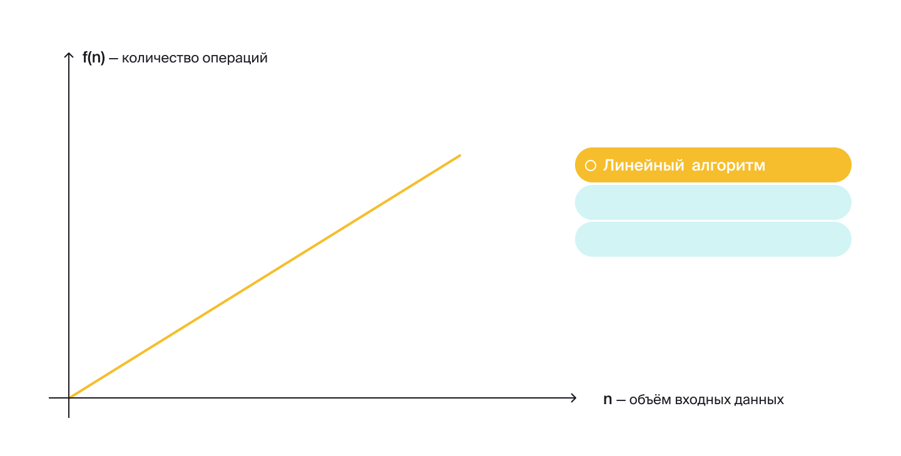

Другой пример — поиск слова в толковом словаре. Так как словарные статьи располагаются в алфавитном порядке, 
можно открыть издание на произвольной странице и, если там нет искомого слова, 
продолжить поиск в левой или правой части словаря. Допустим, мы ищем слово «программист». 
Алгоритм может быть таким:

1. Заглядываем в середину области поиска.
2. Если искомое слово есть на текущей странице, завершаем поиск.
3. Если искомого слова нет на текущей странице и по алфавиту оно должно находиться раньше, 
отбрасываем правую половину страниц и возвращаемся к пункту 1, продолжая поиск в левой части.
4. Если искомого слова нет на текущей странице и по алфавиту оно должно находиться дальше, 
отбрасываем левую половину страниц и возвращаемся к пункту 1, продолжая поиск в правой части.

Таким образом на каждой итерации область поиска будет сокращаться в два раза: сначала это будет
весь словарь, потом — его половина, четверть и так далее. 
Поэтому асимптотическая сложность такого поиска называется **логарифмической**

> Логарифм — это функция, обратная функции возведения в степень. К примеру, если 2 в степени 3 равно 8, 
> то логарифм от 8 по основанию 2 будет равен 3.

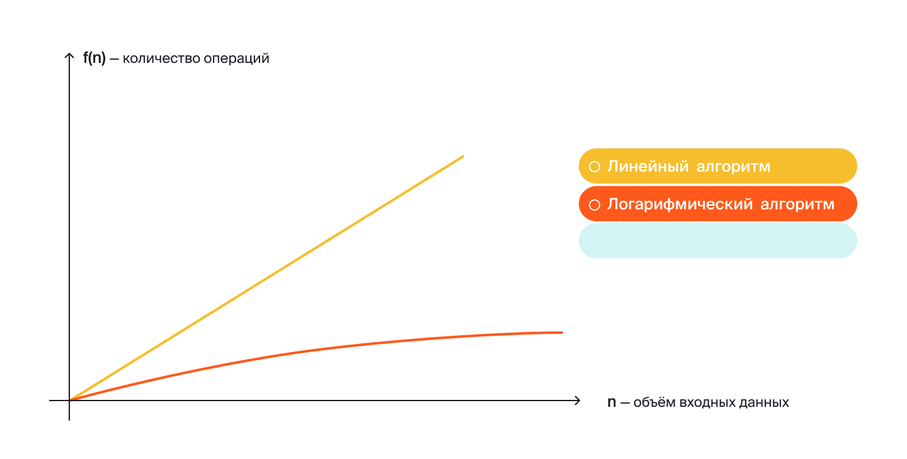

Логарифмические алгоритмы хороши тем, что при увеличении объёма входных данных количество операций 
в них растёт очень медленно. Например, для поиска по словарю, в котором один миллион слов, 
в худшем случае вам понадобится провести всего 20 сравнений. А если слов будет один миллиард,
то есть в тысячу раз больше, максимальное количество сравнений возрастёт всего лишь до 30.


Ещё один пример алгоритма — поиск книг в библиотеке. Посетителю достаточно подойти к
библиотекарю и сообщить ему название книги и имя автора. Если такая книга есть в каталоге, 
библиотекарь довольно быстро подскажет, в каком разделе и на какой полке её можно найти. Выглядеть это будет так:
1. Спрашиваем у библиотекаря, где найти нужную книгу.
2. Если искомая книга в библиотеке есть, библиотекарь даст точную информацию о её местоположении. Поиск завершается.
3. Если искомой книги нет, поиск завершается.

Асимптотическая сложность такого поиска будет константной, то есть постоянной, 
так как скорость работы алгоритма не зависит от объёма входных данных.
Не важно, сколько книг хранится в библиотеке — благодаря каталогу библиотекарь знает, где стоит каждая из них. 

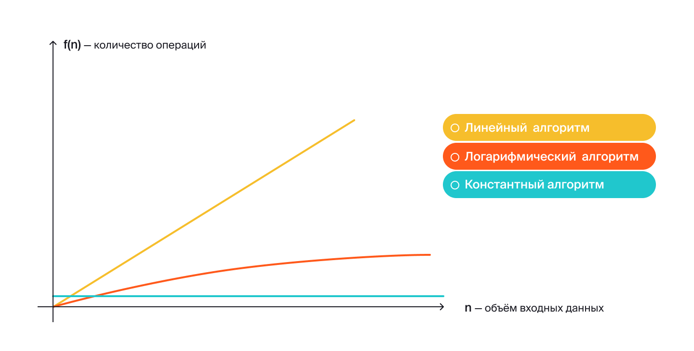

Помимо алгоритмов с линейной, логарифмической и константной сложностью, 
есть и другие: всего выделяют около двадцати видов сложностей. Важная разница между ними 
— зависимость количества операций от объёма данных. 

Как правило, при выборе одного из двух и более алгоритмов с разными асимптотическими сложностями,
предпочтение отдаётся наиболее быстрому. Но в некоторых случаях медленный алгоритм будет лучше,
поскольку он, к примеру, не использует дополнительную память.

## Обозначение асимптотической сложности

В математике и программировании асимптотическая сложность записывается с использованием «О»-нотации. 
Её ещё в 1894 году ввёл немецкий математик Пауль Бахман. 

У «О»-нотации есть три уровня оценки асимптотической сложности алгоритма, 
которые показывают, какое количество операций может потребоваться для решения задачи: 

* **нижняя оценка**, или **лучший случай** (англ. _best case scenario_) — минимальное количество операций;
* **верхняя оценка**, или **худший случай** (англ. _worst case scenario_) — максимальное количество операций;
* **средняя**, или **средний случай** (англ. _average-case complexity_) — среднее количество операций.


Представьте, что перед вами стоит десять разноцветных коробочек.
В одной из них лежит сюрприз, остальные пустые. Вам нужно найти сюрприз. 
При этом за один раз можно открывать только одну коробку. 
Нижняя оценка такого поиска будет равна 1, ведь в **лучшем случае** вы найдёте сюрприз в первой же проверенной вами коробке.
В **худшем случае** — и это будет верхней оценкой — придётся открыть все 10 коробок, а в **среднем** — около 5. 

На практике для упрощения часто используют только верхнюю оценку сложности. 
Логика здесь такая: если у алгоритма приемлемая скорость работы в худшем случае,
то и при других сценариях он будет достаточно быстрым. 

В зависимости от типа асимптотической сложности алгоритмы разделяются на группы.
Вот некоторые из них, которые применяются наиболее часто. 
Мы расположили их в порядке от самых быстрых к самым медленным:

* **Алгоритмы с константной сложностью** (обозначаются O(1)). 
Они выполняются всегда за одно и то же время — вне зависимости от объёма входных данных.
Как правило, константное время выполнения операций подразумевает, что данные хранятся определённым образом.
Например, как книги — в библиотечном каталоге. 
Это идеальные алгоритмы, потому что на практике они работают не просто быстро, а мгновенно.
К сожалению, для многих задач — к примеру, для задачи сортировки — не существует алгоритмов, работающих за константу.

* **Алгоритмы с логарифмической сложностью** (обозначаются O(log(n)), где `n` — объём данных).
Количество операций в них растёт очень медленно и сравнимо со степенями двойки. К примеру, для 1024 элементов таким 
алгоритмам понадобится всего 10 операций, так как 2<sup>10</sup> = 1024. Для миллиона — приблизительно
20 операций, так как 2<sup>20</sup> = 1048576. Логарифмические алгоритмы основаны на принципе
«разделяй и властвуй» — входные данные можно разделить по некоторому признаку и отбросить половину из них как неподходящую.

* **Алгоритмы с линейной сложностью** (обозначаются O(n), где n — объём данных). 
Сложность в них растёт пропорционально росту входных данных. 
Например, алгоритм поиска минимума в неотсортированном массиве. 
Чтобы найти минимальный элемент, придётся перебрать их все, 
то есть сложность будет `O(n)`, где `n` — количество элементов в массиве.

* **Алгоритмы с квадратичной сложностью** (обозначаются O(n<sup>2</sup>), где n — объём данных).
Их сложность растёт сравнимо с квадратом входных данных. 
К примеру, для ста элементов таким алгоритмам потребуется 100<sup>2</sup> = 10000 операций. 
Эти алгоритмы лучше применять только на маленьких объёмах данных — или когда более быстрых аналогов не существует.

## Сложность алгоритма и код

Теперь разберёмся, как по коду определить сложность алгоритма. Здесь, как правило, всё дело в практике. 
Но есть вещи, на которые нужно обращать пристальное внимание: 
наличие циклов и вызов функций с известной асимптотической сложностью.
Например, функция из стандартной библиотеки Java `Arrays.sort(..)` работает за 
O(n∗log(n)), о чём говорится в документации к ней.

Перед вами код, который высчитывает сумму всех элементов в массиве:

```java
public class Practicum {

    public static void main(String[] args) {
        int[] array = new int[] {1, 5, 3, 2, 9, 1, 2, 3, 4, 1, 10};

        int sum = 0;
        for (int i = 0; i < array.length; i++) {
            sum += array[i];
        }

        System.out.println(sum);
    }

}
```

Переменная `i` проходится по всем элементам массива, значит, алгоритм выполняет
n операций. Если перевести эту фразу на язык математики, 
то получится вот что: «При линейном росте числа элементов в массиве, 
количество итераций будет расти также линейно». 
Поэтому сложность такого алгоритма будет равна O(n). 

Усложним задачу. Теперь нужно найти повторы элемента в массиве.
Самый простой способ это сделать — сравнивать каждый элемент с каждым.
Для этого подойдёт следующий алгоритм:
1. Запоминаем первый элемент массива.
2. Сравниваем его со всеми другими элементами.
3. Если обнаружен повтор — выходим из цикла, иначе — запоминаем следующий элемент массива и переходим к пункту 2.

Код выглядит следующим образом:

```java
public class Practicum {

    public static void main(String[] args) {
        int[] array = new int[] {1, 5, 999, 2, 9, 10, 552, 3, 4, 14, 10};

        boolean duplicateFound = false;
        for (int i = 0; i < array.length && !duplicateFound; i++) {
            for (int j = 0; j < array.length; j++) {

								// пропускаем одинаковый индекс, чтобы не сравнить элемент с самим собой
                if (j == i) continue;
                if (array[i] == array[j]) {
                    duplicateFound = true;
                    break;
                }
            }
        }

        System.out.println("Дубликат найден: " + duplicateFound);
    }

}
```

За первый цикл выполнится
n операций, за следующий тоже
n  — и так далее. В худшем случае алгоритму понадобится совершить
n∗n=n<sup>2</sup> операций. Значит, сложность такого алгоритма
будет квадратичной, или O(n<sup>2</sup>).

</details>

<details>
<summary>Коллекции в Java</summary>

# Коллекции в Java

[Оглавление](#оглавление)

Один из важнейших аспектов работы программиста — преобразование одних данных в другие. 
Данные бывают разные — числа, строки, объекты. Они могут быть примитивными или бесконечно сложными.
Правила, с помощью которых данные взаимодействуют друг с другом, задаются **структурами данных** (англ. _data structures_). 
Вместе с алгоритмами структуры данных образуют фундамент, на котором строится практически любая программа. 

## Java Collections Framework

Структура данных — это совокупность трёх компонентов:
набора данных, отношений между ними, а также всех методов по управлению этими данными.
Например, массив — простейшая структура данных. Он хранит элементы одного типа,
каждому из которых присваивается индекс, начиная с нуля, не умеет самостоятельно менять 
размер и обладает только одним свойством — длиной length. Список — более сложная структура данных.
Он может увеличиваться в размере при добавлении новых элементов. 

Большинство современных языков программирования предоставляют 
готовые инструменты для создания структур данных. 
В Java за это отвечают **коллекции**, или **Java Collections Framework**  (англ. «_фреймворк коллекций в Java_»).
Это набор интерфейсов и классов, которые реализуют основные структуры данных на Java. 

Коллекции в Java решают такие задачи:

* Унифицируют подход к работе с данными. Java Collections Framework — часть стандартной библиотеки JDK,
поэтому все Java-разработчики могут его использовать.
* Упрощают процесс разработки. Коллекции предоставляют многие базовые структуры данных,
поэтому их не нужно реализовать самостоятельно.
* Улучшают производительность программ. Коллекции постоянно оптимизируются, 
повышая эффективность работы с данными.
* Сокращают время на чтение кода и понимание программ. Изучить, как работают коллекции,
нужно один раз, но встречать их вы будете постоянно!

## Иерархия коллекций

> Интерфейс — это совокупность методов, у которых определены имена, возвращаемый тип и типы аргументов. При этом их реализация происходит в классах-наследниках и может отличаться.

Иерархия коллекций в Java состоит из двух частей.
Вершина первой — **интерфейс** `Iterable<T>` (от англ. _iterate_ — «повторять», «перебирать»). 
Он предоставляет инструменты для того, чтобы «обходить», перебирать элементы — итерировать коллекцию. 

💡 Обратите внимание, `Iterable`, как и прочие интерфейсы и классы фреймворка коллекций, 
использует **дженерик-тип** `<T>`.
Это значит, что структуры данных, 
представленные в коллекциях, работают для любого типа, которые определён в программе.
При создании коллекции нужно обязательно указать её тип, чтобы компилятор мог проверить корректность использования.

```java
// указываем конкретный тип для дженерик-параметра списка ArrayList
ArrayList<String> strings = new ArrayList<String>();

// тип можно указать один раз, а в правой части заменить его на Diamond Notation <>
ArrayList<Integer> ints = new ArrayList<>(); 
```

Вершина второй части коллекций — **интерфейс** `Map<K,V>`. 
С английского **map** переводится не только как существительное «карта», но и как глагол «сопоставить».

`Map<K,V>` позволяет работать со структурами данных, 
где ключ с типом K сопоставляется со значением типа `V` — например, хеш-таблицами `HashMap<K,V>`. 
В отличие от `Iterable<T>`, интерфейс `Map<K,V>` задаёт между элементами однозначную одностороннюю связь.
В результате по определённому **ключу-идентификатору** можно найти значение. Например, по ИНН — ФИО, номер телефона или адрес. 

В этой теме мы подробно расскажем о той части иерархии, которая посвящена итерации данных. 
Прямой наследник `Iterable<T>` — **интерфейс** `Collection<T>` (от англ. _collection_ — «коллекция», «подборка»). 
Он предоставляет методы для добавления и удаления элементов, вычисления размера коллекции, поиска внутри неё.

От `Collection<T>` наследуют сразу три интерфейса:
- **Интерфейс** `Set<T>` (от англ. _set_ — «множество») позволяет реализовать структуры данных, 
где каждый элемент уникален — может встречаться только один раз.
- **Интерфейс** `Queue<T>` (от англ. _queue_ — «очередь») описывает структуры данных,
 где элементы располагаются один за другим согласно очерёдности. 
Если элемент добавлен первым, то и удалён он должен быть в первую очередь.
- **Интерфейс** `List<T>` (от англ. _list_ — «список») нужен для создания списков.
В них элементы могут повторяться и располагаться в произвольном порядке.
Кроме того, списки при необходимости могут расширяться в размере и поддерживают операции сортировки.
В отдельных уроках изучим подробнее две реализации интерфейса `List<T>` — уже знакомый вам, основанный на массиве список `ArrayList<T>` и двунаправленный список `LinkedList<T>`.

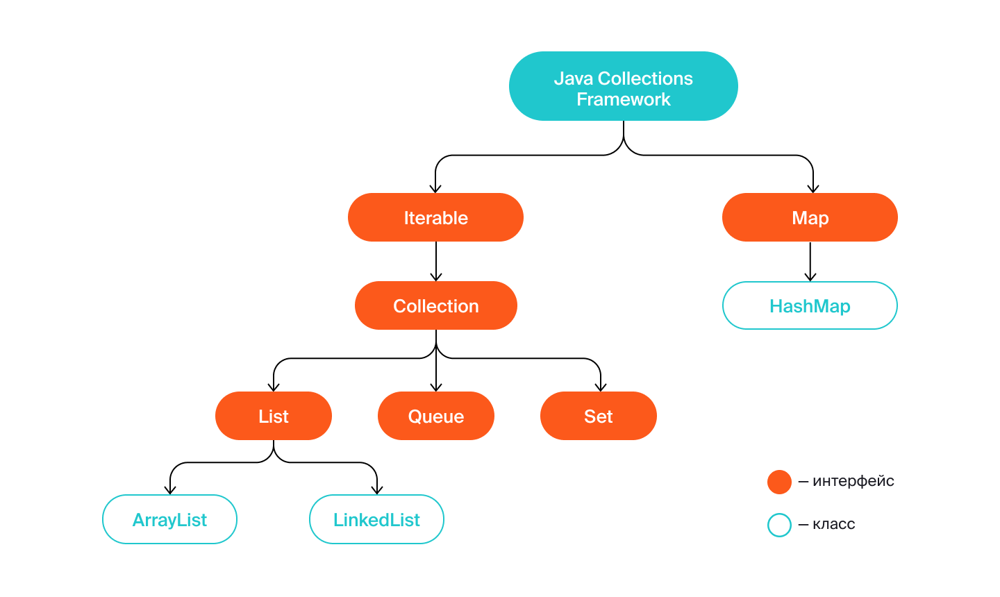

Это только часть иерархии коллекций — в неё входят ещё множество классов и интерфейсов, в том числе и классы, которые практически вышли из обихода.

Интерфейс `Iterable<T>` означает, что по коллекции можно итерироваться — 
обходить элемент в заранее заданной последовательности.
Обычно слева направо. В результате обхода коллекции можно, например, увеличить каждый элемент или
сделать с ним что-то ещё. `Iterable<T>` предоставляет два основных способа пройтись по всем элементам коллекции.

* **Цикл forEach**

Проще всего обходить коллекцию с помощью короткой формы цикла `for` — `for-each`-цикла. Мы уже не раз его использовали:

```java
import java.util.ArrayList;

public class Practicum {

    public static void main(String[] args) {
        final ArrayList<String> list = new ArrayList<>();
        list.add("Hello");
        list.add(" ");
        list.add("World!");

        for (String element : list) { // обходим все элементы в цикле forEach
            System.out.print(element);
        }
    }
}
```

Чтобы такая форма обхода коллекции была возможна, в `Iterable<T>` есть метод `forEach(Consumer<? super T> action)`. 
В нём описана логика итерирования элементов, и программист на выходе получает готовый инструмент в виде цикла.
В этом и есть преимущество использования коллекций: не нужно знать,
как они устроены изнутри — достаточно научиться пользоваться ими. 

* **Метод** `iterator()`

Ещё один способ обойти коллекцию — с помощью **итератора**. 
Это объект класса `Iterator<T>`, который реализован для всех коллекций стандартной библиотеки Java. 
У него есть методы `hasNext()` и `next()`, с помощью которых можно в цикле обойти элементы коллекции. 

Чтобы получить доступ к итератору, воспользуйтесь методом `iterator()` в интерфейсе `Iterable<T>`. 
Обход коллекции через итератор обычно происходит через цикл `while` — в условии вызывается `hasNext()`.
Метод `hasNext()` проверяет, есть ли значение для обхода или нет и возвращает ответ — значение типа `boolean`.
Если следующий элемент найден, то его можно вернуть через метод `next()`.

```java
import java.util.ArrayList;
import java.util.Iterator;

public class Practicum {

    public static void main(String[] args) {
        final ArrayList<String> list = new ArrayList<>();
        list.add("Hello");
        list.add(" ");
        list.add("World!");

        final Iterator<String> iterator; // объявили объект iterator
        iterator = list.iterator(); // проинициализировали iterator через метод iterator()

        while (iterator.hasNext()) { // проверяем, есть ли следующий элемент в коллекции
            final String element = iterator.next();  // возвращаем элемент
            System.out.print(element);
        }
    }
}
```

Добавьте элементы в список с помощью метода `add(String)` и запустите код повторно. 
Итератор снова обойдёт все значения, включая новые. 

Для обхода коллекции лучше всё-таки всегда использовать цикл `forEach` — так код получается более понятным.
Если ввести код с итератором в IDEA, то среда разработки сама предложит заменить его на `forEach`. Попробуйте это сделать.

Механизм обхода элементов — это главное, что предоставляет интерфейс `Iterable<T>`. 

## Методы `Collection<T>`

`Collection<T>`наследует `Iterable<T>` и предоставляет основной набор методов для работы с коллекциями.
Это метод `add(E e)` для добавления элемента, `contains(Object o)` для проверки наличия элемента, `remove(Object o)` 
для удаления элемента. `Collection<T>` также задаёт метод `size()` для подсчёта количества элементов 
в коллекции и вспомогательный `isEmpty()` для проверки, есть ли в коллекции элементы.

Например, этот код полностью написан с помощью методов интерфейса `Collection<T>`:

```java
import java.util.ArrayList;
import java.util.Collection; // импортируем интерфейс Collection

public class Practicum {

    public static void main(String[] args) {
        final Collection<String> colors = new ArrayList<>();
        colors.add("Жёлтый");
        colors.add("Красный");
        colors.add("Зелёный");

        System.out.println("Список содержит Зелёный: " + colors.contains("Зелёный"));

        colors.remove("Жёлтый");
        System.out.println(colors);

        System.out.println("Оставшееся количество элементов: " + colors.size());
        System.out.println("Коллекция пустая? " + colors.isEmpty());
    }
}
```

Интерфейс `Collection<T>` также поддерживает операции по добавлению, удалению и проверке сразу нескольких элементов.
За это отвечают методы `addAll(Collection c)`, `removeAll(Collection c)` и `containsAll(Collection c)`.

```java
import java.util.ArrayList;
import java.util.Collection;

public class Practicum {

    public static void main(String[] args) {
        final Collection<String> colors = new ArrayList<>();
        colors.add("Жёлтый");
        colors.add("Красный");

        final Collection<String> colorsAdditional = new ArrayList<>();
        colorsAdditional.add("Зелёный");
        colorsAdditional.add("Жёлтый");

        colors.addAll(colorsAdditional);
        System.out.println(colors);

        final Collection<String> greenAndRed = new ArrayList<>();
        greenAndRed.add("Зелёный");
        greenAndRed.add("Красный");
        System.out.println("Список содержит Зелёный и Красный: " + colors.containsAll(greenAndRed));

        final Collection<String> yellowOnly = new ArrayList<>();
        yellowOnly.add("Жёлтый");
        colors.removeAll(yellowOnly);

        System.out.println(colors);
    }
}
```

В интерфейсе Collection<T> есть и другие полезные методы,
например метод clear() для удаления всех элементов коллекции или метод по преобразованию коллекции в массив toArray(). 
Все они подробно описаны в [документации](https://docs.oracle.com/en/java/javase/21/docs/api/java.base/java/util/Collection.html).

</details>

<details>
<summary>Интерфейс List</summary>

# Интерфейс List

[Оглавление](#оглавление)

Интерфейс `List<T>` — прямой наследник интерфейса `Collection<T>`. 
В этом уроке разберём, какие дополнительные возможности он предоставляет для реализации таких коллекций, как списки. 
А также как с его помощью преобразовать массив или набор значений в список и обратно. 

## Методы `List<T>`

Главное, что даёт `List<T>`, — это возможности контролировать процесс добавления нового элемента в список,
организовать поиск и вносить изменения. Для этого он предоставляет следующие методы: 

* Методы для добавления нового элемента в определённое место в списке:
  * В конец списка — `add(E e)`
  * В любое место — `add(int index, E e)`, где `int index` означает индекс позиции, на которую нужно добавить элемент. 
  При добавлении с помощью индекса, элементы с индексами больше `int index` сдвигаются на одну позицию вправо.

* Методы для поиска элементов в списке и доступа к ним:
  * Для получения элемента по индексу — `get(int index)`.
  * Для замены элемента по индексу — `set(int index, E e)`. С помощью этого метода можно поменять только существующий элемент.
  * Для удаления элемента по индексу `remove(int index)`.
  * Для удаления элемента по значению `remove(E e)`. Если в списке есть несколько одинаковых элементов,
  то метод удаляет первый найденный — с наименьшим индексом.

Реализация всех этих методов происходит уже в подклассах.
В коде ниже, например, будут вызываться методы интерфейса `List`, реализованные в классе-наследнике `ArrayList`:


```java
import java.util.ArrayList;
import java.util.List;

public class Practicum {

    public static void main(String[] args) {

        List<Long> list = new ArrayList<>(); // создание списка

        // добавление элементов в конец:
        list.add(0L);
        list.add(1L);
        list.add(2L);
        System.out.println(list);  // список выглядит так - [0, 1, 2]

        // добавление элемента по индексу
        list.add(2, 22L);  // 2L сдвигается вправо, и на его месте появится 22L
        System.out.println(list); // список стал таким - [0, 1, 22, 2]

        // вставка элемента в конец списка
        list.add(4, 4L);
        System.out.println(list); // обновлённый список - [0, 1, 22, 2, 4]

        // удаление элемента
        list.remove(4); // по индексу
        list.remove(2L); //  по значению
        System.out.println(list); // получился список - [0, 1, 22]

        // получение и вывод элемента по индексу
        System.out.println(list.get(2)); // напечатали 22

        // замена элемента по индексу
        list.set(2, 33L);
        System.out.println(list); // последняя версия списка - [0, 1, 33]

    }
}
```

`List<T>` поддерживает не только эти методы, но и множество других. Их полный список можно посмотреть в [документации](https://docs.oracle.com/en/java/javase/21/docs/api/java.base/java/util/List.html).

## От массива к списку

Умение работать с фреймворком коллекций Java позволяет выбрать оптимальную структуру данных под каждую задачу. 
Например, иногда может быть удобнее работать со списками, чем с массивами или просто набором значений. 
Интерфейс `List<T>` предоставляет два способа для преобразования массива или набора случайных элементов в список. 

* **Метод `Arrays.asList(...)`**

С помощью вызова `Arrays.asList()` можно создать и заполнить небольшой список одним выражением. 
Проинициализируем список `cities` массивом из названий городов:

```java
String[] citiesArray = {"Воронеж", "Южно-Сахалинск", "Иркутск"};
List<String> cities = Arrays.asList(citiesArray);
```

Также можно создать список из набора значений:

```java
List<String> cities = Arrays.asList("Воронеж", "Южно-Сахалинск", "Иркутск");
```

* **Метод `List.of(..)`**

Ещё один способ быстрого создания списков появился в Java 11
Процесс здесь аналогичен: вызываем статический метод `List.of()`,
передаём в него элементы, результат сохраняем в переменную-список. 
`List.of(..)` тоже может принимать как массив, так и набор значений.

```java
import java.util.List;

public class Practicum {

    public static void main(String[] args) {

        String[] citiesArray = {"Воронеж", "Южно-Сахалинск", "Иркутск"};

        // Создание и заполнение списка из массива:
        List<String> cities = List.of(citiesArray);
        System.out.println(cities);

        // Создание и заполнение списка из набора значений:
        List<String> otherCities = List.of("Амстердам", "Токио", "Рим");
        System.out.println(otherCities);
    }
}
```

> Важное замечание: списки, созданные с помощью `List.of()` или `Arrays.asList()`, относятся к особой категории 
> — считаются неизменяемыми. Они не поддерживают операции удаления и добавления элементов. 
> При работе со списком `Arrays.asList()` 
> можно заменить элемент с помощью `set(int, T)`, но для списка `List.of()` даже эта операция приведёт к ошибке.

Дело в том, что оба метода возвращают внутренние реализации интерфейса `List<T>`. 
Классы, описывающие их, находятся внутри стандартных классов `Java`, и у программиста нет к ним доступа.
Но названия этих внутренних классов можно посмотреть с помощью метода `getClass()` класса `Object`:

```java
import java.util.ArrayList;
import java.util.Arrays;
import java.util.List;

public class Practicum {

    public static void main(String[] args) {

        List<String> cities = List.of("Воронеж", "Южно-Сахалинск", "Иркутск");
        List<String> cities2 = Arrays.asList("Воронеж", "Южно-Сахалинск", "Иркутск");
        List<String> cities3 = new ArrayList<>();
        System.out.println(cities.getClass());   
        System.out.println(cities2.getClass());  
        System.out.println(cities3.getClass());  
    }
}
```

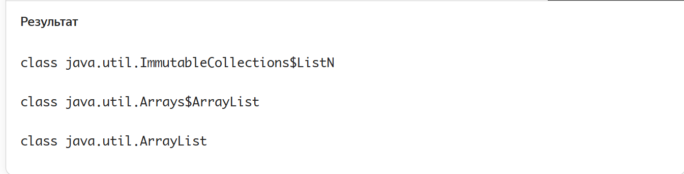

В результате вызова `getClass()` можно увидеть, что `cities` относится к классу 
`ImmutableCollections$ListN`, `cities2` — к классу `Arrays$ArrayList`, 
а `cities3` — к `ArrayList`. Хотя названия классов `Arrays$ArrayList` и
`ArrayList` частично совпадают — это разные классы. И чаще всего 
вам предстоит работать именно со вторым `ArrayList`.

Пример преобразования набора напитков на основе кофе в список coffeeList.

```java
import java.util.List;

public class Practicum {

    public static void main(String[] args) {

        final String[] coffeeArray = {"Латте", "Капучино", "Эспрессо"};

        for (String c : coffeeArray) {
            System.out.print(c + ", ");
        }
        System.out.println();

        final List<String> coffeeList = List.of(coffeeArray); // тут массив должен стать списком

        System.out.println(coffeeList);
    }
}
```

## Обратное преобразование

Преобразование в обратную сторону
(из списка в массив) можно осуществить с помощью метода **toArray(T[])**. Это выглядит так:

```java
import java.util.Arrays;
import java.util.List;

public class Practicum {

    public static void main(String[] args) {

        // создание и заполнение списка
        List<String> cities = Arrays.asList("Воронеж", "Южно-Сахалинск", "Иркутск");

        String[] citiesArray = cities.toArray(new String[]{}); // преобразование списка в массив

        System.out.println(cities); // напечатали список

        for (String city: citiesArray) { // напечатали массив
            System.out.print(city + ", ");
        }
    }
}
```

Метод `toArray(T[])` уникален тем, что, с одной стороны, возвращает массив,
а с другой — его аргументом также является массив. 
То есть аргумент и возвращаемое значение метода взаимозаменяемы.
Поэтому тип массива-аргумента `T[]` в `toArray()` должен совпадать с типом возвращаемого массива. 

> 💡 Правило о том, чтобы возвращаемый тип и тип передаваемого массива в `toArray()`
> были одинаковыми, придумали для защиты от багов с типами данных.
> Иначе можно было бы преобразовать списки с любыми объектами в массивы случайных типов,
> что приводило бы к сбоям в работе программы.

Соответствие возвращаемого и передаваемого типов также требуется, 
если не создавать новый массив c помощью `new`, а передать его извне:

```java
String[] someStringArray = new String[]{}; // где-то создан массив типа String[]
...
// преобразуем список cities в массив someStringArray и сохраняем его в массив с типом String[]
String[] citiesArray = cities.toArray(someStringArray); 
```

Благодаря своей способности принимать и возвращать массив метод `toArray(..)` 
позволяет экономить место в памяти компьютера. Не нужно создавать новый массив, если размер массива, 
передаваемого в качестве аргумента, равен или больше списка, у которого вызывается метод.

```java
import java.util.Arrays;
import java.util.List;

public class Practicum {

    public static void main(String[] args) {

        List<String> cities = Arrays.asList("Воронеж", "Южно-Сахалинск", "Иркутск");

				// создаём массив, равный размеру списку cities
        String[] citiesArray = new String[3];

        // результат метода записывается одновременно и в otherCities, и в citiesArray
        String[] otherCities = cities.toArray(citiesArray);

        for (String city: citiesArray) { // печатаем citiesArray
            System.out.print(city + ", ");
        }

        System.out.println();

        for (String city: otherCities) {  // печатаем otherCities
            System.out.print(city + ", ");
        }
    }
}
```

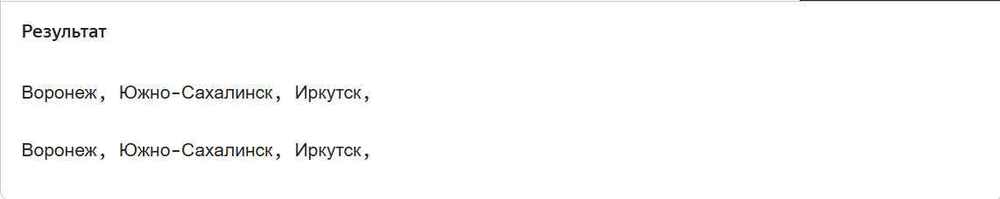

</details>

<details>

<summary>Задание 1</summary>

# Задание 1

[Оглавление](#оглавление)

Допишите код приложения для случайных встреч с незнакомцами — `Random Coffee`. 
Основная программа представлена в классах `RandomCoffee` и `PairGenerator`.
Информация об одном незнакомце находится в классе `Stranger`.
Ваша задача — дописать методы `splitByPairs` и `getRandomPair`,
чтобы программа могла разбить незнакомцев по парам.

`RandomCoffee.java`

```java
import java.util.ArrayList;
import java.util.List;

public class RandomCoffee {

    public static void main(String[] args) {

        List<Stranger> strangers = new ArrayList<>(List.of(
            new Stranger("Анна", 29),
            new Stranger("Иван", 25),
            new Stranger("Мария", 25),
            new Stranger("Павел", 26),
            new Stranger("Святослав", 27),
            new Stranger("Екатерина", 28)
        ));
        PairGenerator pairGenerator = new PairGenerator();

        System.out.println("На этой неделе в Random Coffee участвуют: " + strangers);

        List<List<Stranger>> splitByPairs = pairGenerator.splitByPairs(strangers);

        System.out.println("Генератор случайных чисел составил пары: " + splitByPairs);
    }
}
```

`PairGenerator.java`

```java
import java.util.ArrayList;
import java.util.List;
import java.util.Random;

public class PairGenerator {

    // Random — класс в Java, отвечающий за генерацию случайных элементов.
    private static final Random rnd = new Random();

    /**
     * Разбивает список незнакомцев по парам.
     */

    // Укажите правильный тип, возвращаемый этой функцией. Вам нужно преобразовать список незнакомцев в 
    // набор пар, т.е. в список, состоящий из других списков.
    public ... splitByPairs(List<Stranger> strangers) {

        // Укажите тип ещё раз.
        ... pairs = new ArrayList<>();
        while (!strangers.isEmpty()) {

            List<Stranger> pair = getRandomPair(strangers);
            // Добавьте новый элемент в набор пар.
        }

        return pairs;
    }

    /**
     * Возвращает одну пару и удаляет её из списка strangers
     */
    private List<Stranger> getRandomPair(List<Stranger> strangers) {

        // Генерируем два случайных индекса в пределах списка
        int p1Index = rnd.nextInt(strangers.size());
        int p2Index = rnd.nextInt(strangers.size());
        while (p2Index == p1Index) {
            p2Index = rnd.nextInt(strangers.size());
        }

        // Получаем элементы по сгенерированным индексам
        Stranger strangerOne = strangers.get(p1Index);
        Stranger strangerTwo = strangers.get(p2Index);

        /* Осталось только удалить двух найденных незнакомцев из списка strangers, 
           а затем вернуть их в качестве результата! */
        ...
    }
}
```

```java
public class Stranger {
    public final String name;
    public final int age;

    public Stranger(String name, int age) {
        this.name = name;
        this.age = age;
    }

    @Override
    public String toString() {
        return "Participant{" +
            "name='" + name + '\'' +
            ", age=" + age +
            '}';
    }
}
```


## Подсказки

* Список пар — это список, состоящий из списков. Он имеет тип `List<List<Stranger>>.`
* Добавить новый элемент в список можно при помощи метода `add(..)`
* Для удаления сразу нескольких элементов списка есть метод `removeAll(Collection)`.
* Чтобы создать список из двух элементов, удобно воспользоваться методом `List.of(strangerOne, strangerTwo)`.

</details>


<details>

<summary>ArrayList — устройство и сложность операций</summary>

# ArrayList — устройство и сложность операций

[Оглавление](#оглавление)

Первая реализация интерфейса `List<T>`, которую мы разберём, — список `ArrayList<T>`.
Он относится к самым часто используемым коллекциям `Java` — и вы уже немного с ним поработали.
Подробнее посмотрим его структуру и узнаем **асимптотическую сложность** операций. 

`ArrayList<T>` не только реализует интерфейс `List<T>`, но и наследует класс `AbstractList<T>`. 
В свою очередь `AbstractList<T>` также реализует `List<T>` и ещё наследует класс `AbstractCollection<T>`, 
где представлены методы по поиску и удалению элементов. Такое наследование абсолютно легально с точки зрения Java. 
Вот так выглядит та часть иерархии коллекций, где показаны классы и интерфейсы, ведущие к `ArrayList<T>`:

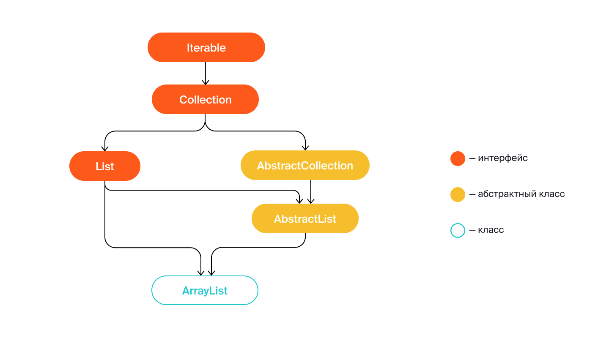

## Размер и вместимость

`ArrayList<T>` — это реализация в Java структуры данных **динамический массив** (англ. _dynamic array_).
В теме о списках мы говорили, что если массив — это обычный шкаф, то `ArrayList<T>` — это шкаф, 
к которому применено расширяющее заклинание.

За основу `ArrayList<T>` взят самый обычный массив. Он называется `elementData`, и сначала элементы хранятся в нём. 
Когда он полностью заполняется (достигает определённого значения элементов), 
то создаётся массив большего размера, в который всё переносится. 
Эти действия происходят автоматически — в этом и есть прелесть работы с готовой структурой данных. 
То есть динамический массив — это массив, который может автоматически меняться в размере прямо во время исполнения программы.

У динамического массива `ArrayList<T>` два основных параметра — это **размер** (англ. _size_) и **вместимость** (англ. _capacity_).
* Размер — это текущее фактическое количество элементов в списке.
* Вместимость — это число элементов, какие потенциально могут храниться в массиве elementData, который служит его основой. 
Вместимость автоматически увеличивается (англ. resizing), когда становится равной размеру.

Например, когда список только создан, его размер равен нулю — в нём нет элементов. 
При этом вместимость `ArrayList<T>` в Java по умолчанию равна **10**.
Как только добавлен первый элемент, размер становится равен 1, но вместимость остаётся прежней — 10. После добавления
11-го элемента произойдёт автоматическое увеличение вместимости.

Увеличение вместимости происходит не случайным образом — оно составляет `+50%` к текущей. То есть если список вмещал
9 элементов, после расширения станет вмещать 13 (округляем в меньшую сторону). 
Вместимость 100 увеличится до 150. 

Например, вот так будут меняться размер и вместимость списка, изначально готового принять два элемента: 

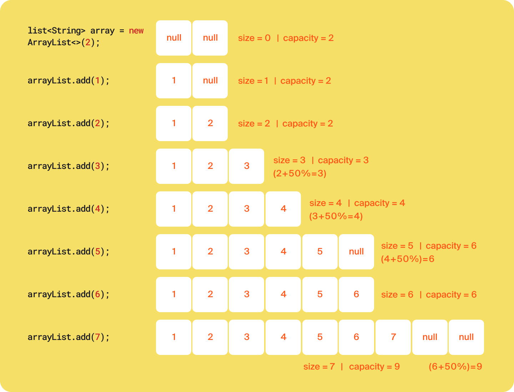

Из примера видно, что при небольшом начальном значении вместимости списку приходится расширяться достаточно часто. 
Именно поэтому вместимость по умолчанию равна 10. 
Это число достаточно маленькое, чтобы новый список не занимал лишнего места, 
и достаточно большое, чтобы вместимость не увеличивалась слишком часто.
Если финальный размер списка известен, то лучше задать вместимость заранее — передать значение типа `int`
в конструктор класса с соответствующим параметром `ArrayList(int initialCapacity)`:

```java
import java.util.ArrayList;

public class Practicum {

    public static void main(String[] args) {

        // начальная вместимость 10 элементов:
        ArrayList<String> arrayListWithDefaultCapacity = new ArrayList<>();

        // начальная вместимость 33 элемента:
        ArrayList<String> arrayListWithSetCapacity = new ArrayList<>(33); // передали 33 в конструктор

        // фактический размер обоих списков — 0:
        System.out.println(arrayListWithDefaultCapacity.size());
        System.out.println(arrayListWithSetCapacity.size());
    }
}
```


## Оценка сложности операций в `ArrayList<T>`

Чтобы понять, подходит ли класс `ArrayList<T>` как структура данных для решения той или иной задачи, 
нужно уметь оценивать асимптотическую сложность его операций. 
* **Добавление элемента в конец списка — `add(T)`**

При оценке асимптотической сложности операции, которая добавляет элемент в конец списка, нужно учитывать, требуется ли увеличивать вместимость.
Вставка в незаполненный список — это простая операция со сложностью `O(1)`, так как нужно просто добавить элемент в массив.

Если список заполнен, то перед вставкой элемента он должен увеличиться в размере.
При расширении фактически происходит создание нового внутреннего массива большего размера,
куда копируются все элементы (всего их **n**) старого массива. 
Поэтому сложность здесь — `O(n)`. Таким образом, операция add(T) в лучшем случае может оцениваться как
`O(1)`, но в худшем случае доходит до `O(n)`. 

Однако чем больше массив, тем реже происходит его увеличение.
Для больших списков количество расширений ничтожно мало по сравнению с количеством вставок.
В связи с этим принято говорить об **амортизированной асимптотической сложности** — она означает оценку в среднем, 
а не только в худшем или лучшем случае. 
Амортизированная асимптотическая сложность добавления элемента в конец условно большого списка равна `O(1)`.

* **Вставка элемента по индексу` add(int, T)`, простое удаление элемента `remove(T)` и удаление по индексу `remove(int)`**

Например, при добавлении элемента с помощью add(int, T) все элементы после нового должны переместиться на один правее.
Чем дальше от правого конца списка происходит вставка, 
тем больше элементов нужно передвинуть. 
Поэтому в качестве сложности указывают худшую оценку `O(n)`.

Разберём на примере.
Список `list` состоит из символов `a`, `b` и `c`. Нам нужно добавить `k` между `a` и `b`. 
Эта операция будет происходить в два шага. Сначала символы `b` и `c` переместятся на одну позицию правее, 
затем на освободившееся место с индексом 1 встанет элемент `k`. Схематически это выглядит так: 

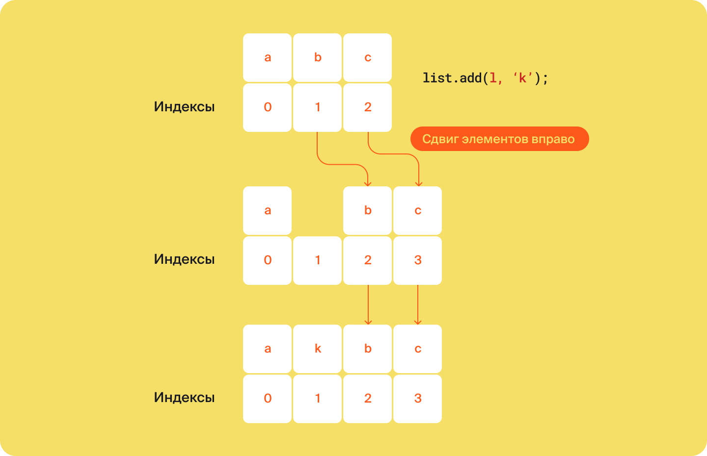

Если список будет заполнен на момент вставки, то он дополнительно должен будет расшириться тоже за `O(n)`. 

Аналогичная ситуация с удалением элемента `remove(T)` или удалением по индексу `remove(int)`, 
только в ходе этих операций элементы справа должны сдвинуться на место удалённого. 
Сложность здесь зависит от количества элементов, которые нужно переместить.
Поэтому она также указывается как `O(n)`. 

Возьмём тот же список `list` из символов `a`, `b` и `c` и удалим из него элемент под индексом 0. 
После удаления a остальные элементы сдвинутся на одну позицию влево. Это будет выглядеть так:

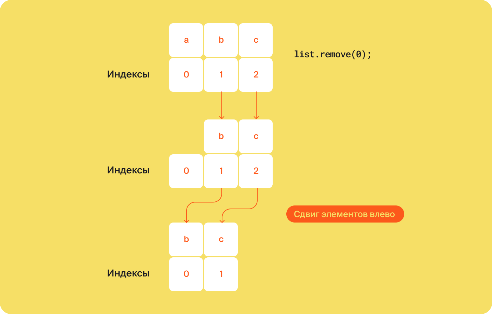

* **Получение элемента по индексу `get(int)` и замена элемента по индексу `set(int, T)`**

С операциями `get(int)` и `set(int, T)`, которые также поддерживает `ArrayList<T>`, всё проще. Они всегда выполняются за `O(1)`.

</details>

<details>

<summary>Задание 2</summary>

# Задание 2

[Оглавление](#оглавление)

Попробуйте самостоятельно реализовать `ArrayList<T>`. 
Часть класса `HandMadeArrayList` уже написана. Вам нужно дописать реализацию двух методов.
Так, `grow()` должен отвечать за увеличение вместительности массива на `50%`, а `add(T)` добавлять очередной элемент в список.

`HandMadeArrayList.java`

```java
public class HandMadeArrayList<T> {

    private int size = 0;
    private Object[] elements;

    public HandMadeArrayList() {
        this.elements = new Object[10];
    }

    /**
     * Сначала проверяем, достиг ли размер массива вместимости.
     * Если достиг — увеличиваем вместимость, иначе сразу добавляем элемент
     */
    public void add(T newElement) {
				// Допишите проверку
        if (... == ...) {
            grow();
        }

        /* Допишите код, который добавит очередной элемент в массив 
           и увеличит размер массива на единицу.*/
    }

    public T get(int index) {
        if (index < 0 || index >= size) {
            throw new ArrayIndexOutOfBoundsException("Element with index " + index + " does not exist");
        }
        return (T) this.elements[index];
    }

    /**
     * Заменяем текущий массив элементов elements на новый с вместимостью +50%
     */
    private void grow() {
        // Новый массив
        Object[] newArray = new Object[elements.length + elements.length / 2];

		// Допишите цикл, который копирует все элементы из массива elements в новый массив newArray
        // Копируем элементы из старого массива в новый
	       

        // Возвращаемый новый массив
        this.elements = newArray;
    }

    public static void main(String[] args) {
        final var ar = new HandMadeArrayList<Integer>();
        for (int i = 0; i < 2000; i++) {
            ar.add(i);
        }
		System.out.println(ar.size);
    }
}
```

## Подсказки

* Размер списка достигает своей вместимости, когда `size == elements.length.`
* Добавить новый элемент и увеличить размер массива можно при помощи двух присваиваний:
`elements[size] = newElement` и `size = size + 1`.
* Чтобы копировать элементы одно массива в другой можно использовать обычный 
цикл for — `for (int i = 0; i < elements.length; i++) {newArray[i] = elements[i];}`.

</details>

<details>
<summary>LinkedList</summary>

# LinkedList

[Оглавление](#оглавление)

Класс `LinkedList<T>` — второй по популярности наследник интерфейса `List`.
Он отвечает за реализацию **двунаправленного связного списка** (англ. _doubly linked list_). 
В этом уроке разберём, что представляет собой эта структура данных, 
а также изучим асимптотическую сложность операций `LinkedList<T>`. 


## Создаём односвязный список

Чтобы понять логику двусвязного списка, разберём для начала более простую структуру данных — **односвязный список** 
(англ. _singly linked list_). Каждый элемент такого списка содержит не только **данные** (англ. _data_), 
но и **ссылку** (англ. _link_) на следующий элемент. 
В результате между элементами образуется связь. У неё одно направление — **от начала к концу списка**.
Последний элемент ни на что не ссылается.

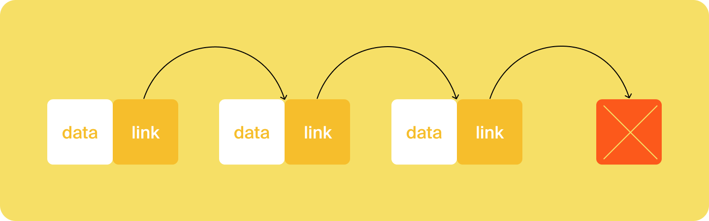


Связка из данных и ссылки называется **узлом** (англ. _node_), а первый элемент списка — **головой** (англ. _head_). 

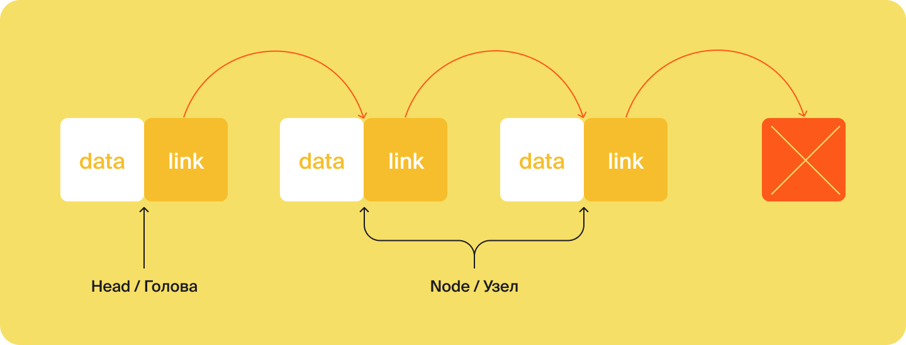

Односвязный список достаточно просто реализовать в коде самостоятельно. 
Сделаем это. Для элементов-узлов создадим класс `Node<T>`, где `T` будет обозначать тип данных внутри списка.
У `Node<T>` будет два поля. Для данных внутри элемента — `T data` и для ссылки — `Node<T> next`.
Для самого списка — класс `SinglyLinkedList<T>`. 
У него также будет два поля. Для головного элемента — `Node<T> head` и для длины списка — `int size`. Готово!

```java
public class SinglyLinkedList<T> {
    public Node<T> head;
    private int size = 0;
}

class Node <T> {

    public T data;
    public Node<T> next;

    public Node(T data) {
        this.data = data;
        this.next = null;
    }
} 
```


## Превращаем односвязный список в двусвязный


Двунаправленный связный список отличается от односвязного тем, 
что каждый узел ссылается не только на следующий, но и на предыдущий.
Помимо головы выделяют **хвост** (англ. _tail_) — последний узел списка. 
У головы нет ссылки на **предыдущий элемент** (англ. _previous_, сокращённо _prev_),
а у хвоста нет ссылки **на следующий** (англ. _next_).

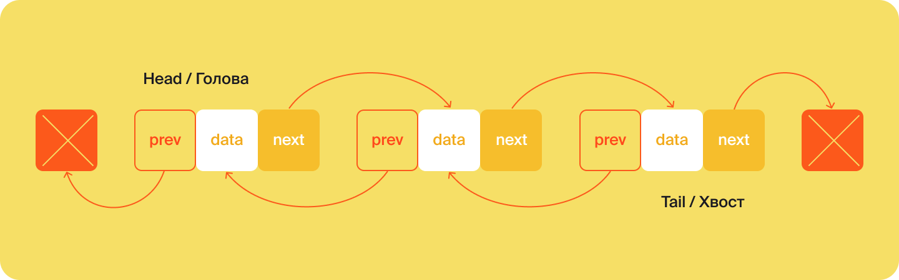

Каждый узел двусвязного списка содержит три ссылки — на предыдущий элемент,
на следующий и на данные. 

Чтобы реализовать двусвязный список, нужно добавить в класс элемента `Node<T>` 
поле для ссылки на предыдущий узел — `Node<T> prev`, 
а в класс списка `DoublyLinkedList<T>` поле для хвоста — `Node<T> tail`. 

```java
public class DoublyLinkedList<T> {
    public Node<T> head;
    public Node<T> tail;
    private int size = 0;
}

class Node <T> {

    public T data;
    public Node<T> next;
    public Node<T> prev;

    public Node(T data) {
        this.data = data;
        this.next = null;
        this.prev = null;
    }
}
```

Класс `DoublyLinkedList<T>` практически полная копия класса `LinkedList<T>` из фреймворка коллекций `Java`. 
Разница в том, что `LinkedList<T>` не даёт разработчику доступ к классу `Node<T>` и реализует множество методов
интерфейсов `Collection<T>` и `List<T>`. 

На этом примере хорошо видно, что любую коллекцию, как и любой алгоритм, 
тоже можно реализовать самостоятельно. Однако преимущество использования готовых фреймворков 
и библиотек очевидно — код написан, методы реализованы, проверена совместимость с другими классами, исключены ошибки.

## Методы `LinkedList<T>` и их сложность

По сравнению с `ArrayList<T>`, список `LinkedList<T>` дополнительно наследует 
от абстрактного класса `AbstractSequentialList<T>`. Этот класс отвечает за реализацию списка,
где элементы хранятся в определённой последовательности. `LinkedList<T>` наследует основной способ 
использования `AbstractSequentialList<T>` — последовательный обход элементов друг за другом. 
Поскольку `LinkedList<T>` двунаправленный список — его операции могут применяться с двух сторон — с начала или с конца. 

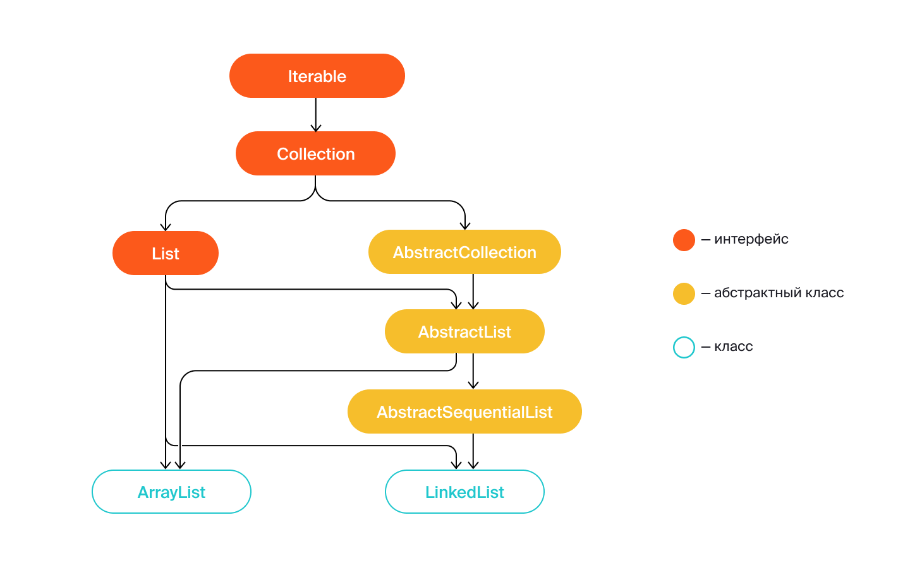

* **Методы `addFirst(T)` и `addLast(T)`**

Метод `addFirst(T)` добавляет элементы в начало списка, а метод `addLast(T)` — в конец.
Обе операции представляют собой перемещение двух ссылок. 
При добавлении в начало с помощью `addFirst(T)` экс-головной узел начинает ссылаться на новую голову,
а в поле head записывается ссылка на новый элемент. То же самое происходит при добавлении элемента в конец через `addLast(T)`,
только в этом случае меняется ссылка в `tail`. Наглядно это показано на рисунке-схеме. 

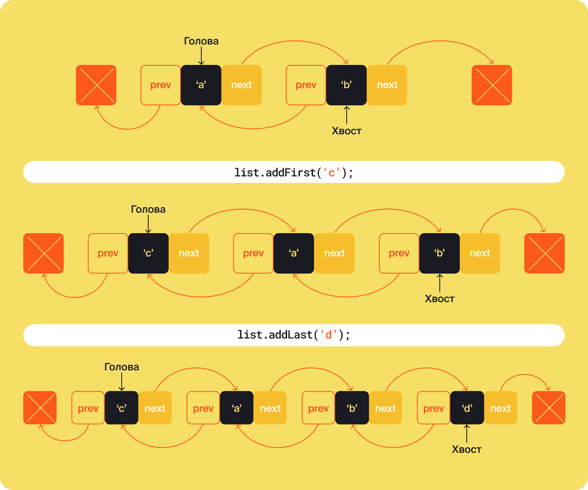

Обе операции `addFirst(T)` и `addLast(T)` работают за константное время `O(1)`. 

> 💡 Многие методы интерфейса `List<T>` транслируются в методы `LinkedList<T>`. 
> Например, метод по добавлению элемента в конец `add(T)` вызывает метод `addLast(T)`.

* **Методы `removeFirst()` и `removeLast()`**

За операцию удаления из начала списка отвечает метод `removeFirst()`, из конца — `removeLast()`.
Их результатом также становится перемещение ссылок. Сложность этих операций — `O(1)`.

* **Методы `getFirst()` и `getLast()`**

Получить первый элемент списка `LinkedList<T>` можно 
с помощью метода `getFirst()`, последний — с помощью `getLast()`. Они также работают за константу `O(1)`. 

* **Методы `add(int, T)`, `remove(int)` и `get(int)`**

`LinkedList<T>` также поддерживает добавление, удаление и получение элемента по индексу. 
За это отвечают методы `add(int, T)`, `remove(int)` и `get(int)`. 
Все эти операции начинаются с поиска элемента с указанным индексом. 
При добавлении и удалении также происходит перепривязка ссылок двух соседних элементов.
Например, на картинке-схеме показано, 
что происходит при вставке в середину двусвязного списка из элементов `a` и `b` нового элемента `c`. 

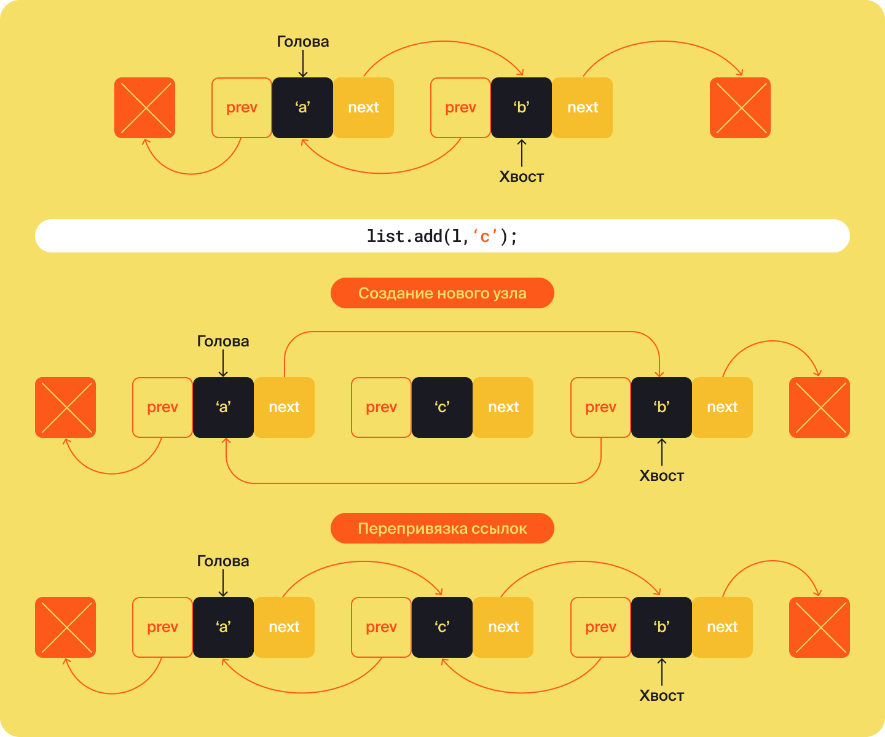

Сложность операций `add(int, T)`, `remove(int)` и `get(int)` будет зависеть от расположения элемента.
Чем ближе его индекс к центру, тем дольше будет происходить поиск. Например, если в связном списке
20 элементов, а нужно найти 15, то считать ближе с хвоста. Для этого нужно пройти по элементам —
`20 → 19 → 18 → 17 → 16 → 15`. Поэтому асимптотическая сложность варьируется от `O(1)` в лучшем случае, 
когда искомый элемент находится в начале или в конце, до `O(n)` в худшем случае, 
если в ходе поиска требуется дойти до середины списка. 

* **Подсчёт элементов `size()`**

У `LinkedList<T>` есть встроенная приватная переменная `size`, 
которая увеличивается при вставке нового элемента и уменьшается при удалении. 
Поэтому подсчёт элементов с помощью метода `size()` из интерфейса `Collection<T>` — константная операция для двусвязного списка.
Она всегда выполняется за `O(1)`.


</details>

<details>

<summary>Задание 3</summary>

# Задание 3

[Оглавление](#оглавление)

В пиратской версии языка Java, которую скачал ваш коллега, 
забыли добавить класс `LinkedList<T>`! Вам нужно реализовать его самостоятельно.

Часть кода уже представлена в классе `HandMadeLinkedList<T>`. 
Например, здесь уже есть структура `Node<T>`, представляющая один элемент в двусвязном списке, 
а также методы для добавления элемента в начало `addFirst<T>`, взятия элемента из начала `getFirst()`, 
а также метод, возвращающий количество элементов в двусвязном списке `size()`.

Реализуйте ещё два метода — добавление элемента в конец `addLast<T>` и получение последнего элемента — `getLast()`.


```java
import java.util.NoSuchElementException;

public class HandMadeLinkedList<T> {

    class Node<E> {
        public E data;
        public Node<E> next;
        public Node<E> prev;

        public Node(Node<E> prev, E data, Node<E> next) {
            this.data = data;
            this.next = next;
            this.prev = prev;
        }
    }


    /**
     * Указатель на первый элемент списка. Он же first
     */
    private Node<T> head;

    /**
     * Указатель на последний элемент списка. Он же last
     */
    private Node<T> tail;

    private int size = 0;

    public void addFirst(T element) {
        final Node<T> oldHead = head;
        final Node<T> newNode = new Node<>(null, element, oldHead);
        head = newNode;
        if (oldHead == null)
            tail = newNode;
        else
            oldHead.prev = newNode;
        size++;
    }

    public T getFirst() {
        final Node<T> curHead = head;
        if (curHead == null)
            throw new NoSuchElementException();
        return head.data;
    }

    public void addLast(T element) {
			// Реализуйте метод
    }

    public T getLast() {
			// Реализуйте метод
    }
    
    public int size() {
        return this.size;
    }

    public static void main(String[] args) {
        HandMadeLinkedList<Integer> integers = new HandMadeLinkedList<>();

        integers.addFirst(1);
        integers.addFirst(2);
        integers.addFirst(3);
        integers.addLast(4);
        integers.addLast(5);
        integers.addFirst(1);
      
        System.out.println(integers.getFirst());
        System.out.println(integers.size());
        System.out.println(integers.getLast());
        System.out.println(integers.size());
    }
}
```

## Подсказки

* Метод `getLast()` является полной копией метода `getFirst()` с той лишь разницей, 
что здесь работа идёт с хвостом `tail`, а не с головой `head` списка.

* Двусвязные списки можно легко отобразить на бумаге в виде связанных блоков. 
Нарисуйте, как меняются ссылки внутри двусвязного списка при выполнении метода `addFirst(T)`. 
Это поможет вам реализовать `addLast(T)`.

* Реализация метода `addLast(T)` состоит из нескольких шагов.
Сначала запоминается ссылка на хвост и создаётся новый элемент. 
Этот новый элемент не будет иметь следующего, но его предыдущим будет текущий хвост.
Таким образом новый элемент можно создать при помощи вызова конструктора `new Node<>(tail, element, null);`.

* После создания элемента, необходимо проверить, существовал ли раньше хвост списка.
Если да — предыдущий хвост начинает ссылаться на новый элемент `oldTail.next = newNode`. 
Иначе, создаётся не только хвост, но и голова списка `head = newNode`.

</details>

<details>

<summary>ArrayList против LinkedList</summary>

# ArrayList против LinkedList

[Оглавление](#оглавление)

О том, что лучше выбрать — `ArrayList<T>` или `LinkedList<T>`, любят спрашивать на собеседованиях.
Ответ на этот вопрос неочевиден, ведь `LinkedList<T>` простая в реализации структура данных. 
Однако в подавляющем большинстве задач лучше выбрать `ArrayList<T>`, и для этого есть ряд причин.


## Причины выбрать `ArrayList<T>`

* **Каждый новый элемент в `LinkedList<T>` занимает в памяти больше места, чем новый элемент в `ArrayList<T>`.**

Дело в том, что при добавлении нового элемента в `LinkedList<T>` создаётся минимум два объекта. 
Один для представления данных внутри списка — `T data` и второй, отвечающий за сам узел и ссылки в нём — `Node<T>`. 
Кроме того, каждый узел содержит сразу три ссылки: _на следующий элемент, 
на предыдущий и на данные_. Новый элемент в `ArrayList<T>` требует меньше места.

* **Узлы в `LinkedList<T>` могут храниться в оперативной памяти хаотично, 
а массив внутри `ArrayList<T>`, как правило, расположен в памяти компьютера последовательно.**

Поскольку узлы в `LinkedList<T>` — это полноценные объекты, они могут располагаться в памяти хаотично.
Например, один в начале массива оперативной памяти, другой в середине, а третий в конце. 
Из-за особенностей работы операционной системы, это может привести к снижению производительности. 
В то же время массив элементов внутри `ArrayList<T>` в подавляющем большинстве случаев хранится последовательно. 

* **Даже самые медленные операции в `ArrayList<T>` на практике работают быстрее, чем может показаться**

Такие операции в `ArrayList<T>`, как добавление и удаление из середины или изменение размера массива по 
сути представляют собой копирование одного массива в другой. А это настолько частая операция в дизайне операционных систем, 
что её иногда оптимизируют на аппаратном уровне. В итоге условно медленные операции в `ArrayList<T>` 
могут работать в реальности быстрее, чем простое копирование элементов из одного массива в другой.

## Причины выбрать `LinkedList<T>`

Иногда `LinkedList<T>` может быть эффективнее, чем Arr`ayList<T>`. Вот эти случаи:

* **Задачи, где нужно часто вставлять элементы в начало или в середину списка или удалять их оттуда.**

При вставке непоследнего элемента в `ArrayList<T>` происходит сдвиг всех оставшихся элементов вправо,
а в случае с `LinkedList<T>` за счёт методов `removeFirst()` и `addFirst(T)` 
можно гарантировать константное время выполнения O(1)`. 

* **Задачи, где критически важно, чтобы вставка в конец работала всегда за константное время `O(1)`.**

Из-за изменения размера `ArrayList<T>` не может дать такую гарантию.

## Подтверждаем теорию расчётами

Разница в скорости и производительности может быть практически незаметной на небольшом объёме данных,
однако на больших данных она хорошо видна.
Чтобы проиллюстрировать это, мы провели замеры производительности операций на двух списках.

Рассмотрим для начала операцию по добавлению 1 млн элементов в начало списка.
Для `ArrayList<T>` используется метод `add(0, T)`, для `LinkedList<T>` — метод `addFirst(T)`.
Результаты получились такими:
* ArrayList<T> — 66600 мс.
* LinkedList<T> — 870 мс.

Этот результат сходится с теорией. 
Действительно, добавление элемента в начало `LinkedList<T>` — это простая операция по изменению ссылки на голову,
в то время как для `ArrayList<T>` добавление элемента в начало — это две операции: 
сначала сдвиг всех элементов вправо (с возможным увеличением вместимости),
и лишь затем добавление элемента.  

В случае с добавлением элемента в конец результаты получаются такими:
* ArrayList<T> — 650 мс.
* LinkedList<T> — 810 мс.

Оба списка показывают практически одинаковое время выполнения, 
потому что у каждого из них операция добавления элемента в конец происходит за `O(1)`.
Для `LinkedList` вставка элемента в конец списка гарантированно работает за константное время. 
Для `ArrayList` возможны два варианта:
* в первом расширения структур внутри списка не происходит, и вставка нового элемента занимает минимальное время;
* во втором время тратится на операции, связанные с расширением внутренней структуры списка,
при этом некоторые операции вставки займут больше времени.

А вот так будет выглядеть соотношение времени выполнения операций `get` и `remove` по произвольному индексу:


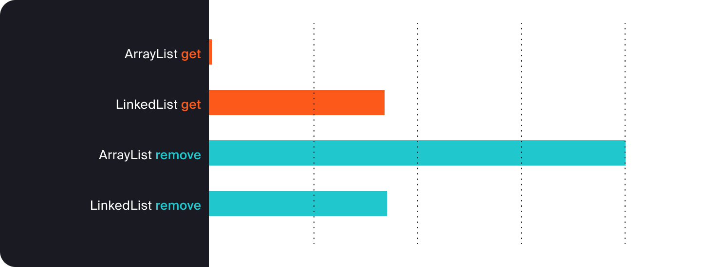

Эти результаты объясняются особенностями устройства коллекции. 
Поскольку `LinkedList<T>` хранит только указатели на голову и хвост списка, получение элемента по индексу 
в нём работает неэффективно — через поиск элемента от начала или конца. 
Точно так же, прежде чем удалить элемент в `LinkedList<T>`, его нужно сначала найти. 
Поэтому графики с `LinkedList get` и `LinkedList remove` показывают практически одинаковое время.

В случае с операциями в `ArrayList<T>` всё так же объяснимо.
При удалении элемента по индексу из `ArrayList<T>` поиск происходит за `O(1)`,
но операция удаления включает в себя сдвиг всех элементов справа на место удалённого. 
Для больших списков сдвиг массива очень затратная операция. Этим и объясняется отставание `ArrayList<T>` 
при удалении произвольного элемента.

</details>

<details>
<summary>Интерфейс Comparator и сортировка коллекций</summary>

# Интерфейс Comparator и сортировка коллекций

[Оглавление](#оглавление)

Списки — это коллекции, которые поддерживают операцию сортировки, то есть элементы в них можно расположить
в определённом порядке. Задавать правила сортировки произвольных классов позволяет 
**интерфейс** `Comparator<T>` (от англ. _compare_ — «сравнивать»). В этом уроке разберём, 
как его реализовать и встроить в программу.

Сложность сортировки объектов состоит в том, что нет заранее известного порядка, 
в котором их надо расположить. Например, список целых чисел легко сортируется как по возрастанию, 
так и по убыванию, потому что три всегда больше, чем два, а шесть меньше десяти.
А вот товары в интернет-магазине сортировать не так просто: нужно выбрать какой-то из критериев — название, 
стоимость, популярность или любой другой. 

## Пишем компаратор

Интерфейс `Comparator<T>` помогает организовать сортировку объектов. 
Для этого он предоставляет ряд методов. Главный из них — метод для сравнения двух объектов `int compare(T, T)`.
При наследовании интерфейса его нужно переопределить.
Этот метод принимает два экземпляра одного типа и возвращает целое число. 

В зависимости от результата определяется порядок между двумя объектами:
* если результат меньше нуля, первый объект меньше второго;
* если равен нулю, то объекты равны;
* если больше нуля, первый объект больше второго.

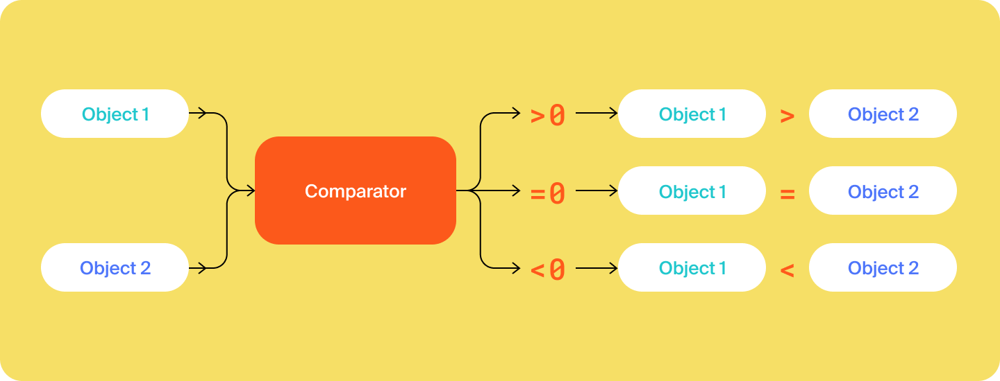

Рассмотрим, как использовать интерфейс `Comparator<T>` на конкретном примере.
Пусть в программе интернет-магазина товар задаётся классом `Item`.
У него есть поля: название, цена и рейтинг популярности в виде целого числа:

```java
public class Item {
    
    public final String name; // название товара
    public final int price; // цена
    public final int popularity; // популярность

    public Item(String name, int price, int popularity) {
        this.name = name;
        this.price = price;
        this.popularity = popularity;
    }
    
    // сразу переопределим toString(), чтобы потом выводить содержание списка
        @Override
    public String toString() { 
        return "Item{" +
            "name='" + name + '\'' +
            ", price=" + price +
            ", popularity=" + popularity +
            '}';
    }
} 
```

Организуем несколько вариантов сортировки — по названию в алфавитном порядке,
по стоимости и по популярности. Для каждого варианта нужно написать **компаратор** — класс, 
который будет наследовать интерфейс `Comparator<T>` и переопределять метод `int compare(T, T)`. 

Например, компаратор, который сравнивает цены товаров, назовём ItemPriceComparator. 
При наследовании Comparator<T> нужно указать на месте параметра T класс Item. 
Внутри переопределим метод compare(Item, Item). Нужно, чтобы более дешёвый товар отображался перед более дорогим.
Для этого будем сравнивать цены между собой и возвращать 1, если цена выше; −1, если цена ниже; 0 — если цены равны. 

```java
import java.util.Comparator;

public class ItemPriceComparator implements Comparator<Item> { // на месте T - класс Item

    @Override
    public int compare(Item item1, Item item2) {

                // сравниваем товары — более дорогой должен быть дальше в списке
        if (item1.price > item2.price) {
            return 1;

                // более дешёвый — ближе к началу списка
        } else if (item1.price < item2.price) {
            return -1;

                // если стоимость равна, нужно вернуть 0
        } else {
            return 0;
        }
    }
}
```

Теперь осталось самое главное — применить созданный компаратор цен `ItemPriceComparator`
для сортировки списка товаров. Для этого в главном классе создаём **объект-компаратор** и затем передаём его в
качестве параметра в метод сортировки `void <имя_списка>.sort(Comparator<? super T> c)` интерфейса `List<T>`.

```java
import java.util.ArrayList;
import java.util.Comparator;
import java.util.List;

public class Practicum {

    public static void main(String[] args) {

        // создаём список товаров
        List<Item> items = new ArrayList<>();
        items.add(new Item("Рубашка", 4500, 37));
        items.add(new Item("Носки", 55, 8));
        items.add(new Item("Толстовка", 1399, 74));
        items.add(new Item("Носки", 169, 19));

        System.out.println("До сортировки:");
        System.out.println(items);

        // создаём объект-компаратор по цене
        ItemPriceComparator itemPriceComparator = new ItemPriceComparator();

        // применяем компаратор
        items.sort(itemPriceComparator);

        System.out.println("После сортировки:");
        System.out.println(items);
    }


    static class Item {

        public final String name;
        public final int price;
        public final int popularity;

        public Item(String name, int price, int popularity) {
            this.name = name;
            this.price = price;
            this.popularity = popularity;
        }

        @Override
        public String toString() {
            return "Item{" +
                "name='" + name + '\'' +
                ", price=" + price +
                ", popularity=" + popularity +
                '}';
        }
    }

    static class ItemPriceComparator implements Comparator<Item> {

        @Override
        public int compare(Item item1, Item item2) {

            if (item1.price > item2.price) {
                return 1;

            } else if (item1.price < item2.price) {
                return -1;

            } else {
                return 0;
            }
        }
    }
}
```

```commandline
Результат

До сортировки:

[Item{name='Рубашка', price=4500, popularity=37}, Item{name='Носки', price=55, popularity=8}, Item{name='Толстовка', price=1399, popularity=74}, Item{name='Носки', price=169, popularity=19}]

После сортировки:

[Item{name='Носки', price=55, popularity=8}, Item{name='Носки', price=169, popularity=19}, Item{name='Толстовка', price=13
```

Получилось! Теперь товары отсортированы по цене в порядке возрастания!

Небольшой лайфхак: при реализации `int compare(T,T)` важен только знак возвращаемого целого числа.
Другими словами, `-20` и `-1` интерпретируются одинаково. 
В нашем примере это значит, что если цена первого товара больше второго, то результат их вычитания 
будет положительным числом, если меньше — отрицательным, 
если цены равны — нулём. Зная это, код переопределяемого метода можно значительно упростить:

```java
import java.util.Comparator;

public class ItemPriceComparator implements Comparator<Item> {

    @Override
    public int compare(Item item1, Item item2) {
        return item1.price - item2.price;
        /* Если положительный результат => первый товар дороже второго.
        Если ноль => цены равны.
        Если отрицательный результат => первый товар дешевле второго. */
    }
}
```

Аналогичным образом напишем компаратор для сравнения товаров по популярности ItemPopularityComparator.
Учитываем, что товарам присваивается рейтинг в диапазоне от 1 до 100, где 1 — самый непопулярный товар, а 100 — самый популярный.

```java
import java.util.Comparator;

public class ItemPopularityComparator implements Comparator<Item> {
  
    @Override
    public int compare(Item item1, Item item2) {
		return item1.popularity - item2.popularity;
    }

}
```

## Готовые решения

Для некоторых стандартных типов есть готовые решения, которые помогают при сортировке. 
Например, для лексикографической сортировки слов без учёта регистра можно использовать статическую переменную 
`CASE_INSENSITIVE_ORDER` класса `String`, которая хранит в себе `Comparator<String>`, сортирующий строки без учёта регистра. 

Создадим компаратор `ItemStringInSensitiveNameComparator` и отсортируем список товаров в лексикографической 
последовательности с помощью `String.CASE_INSENSITIVE_ORDER`.

```java
import java.util.ArrayList;
import java.util.Comparator;
import java.util.List;

public class Practicum {

    public static void main(String[] args) {

        // создаём список товаров
        List<Item> items = new ArrayList<>();
        items.add(new Item("Рубашка", 4500, 37));
        items.add(new Item("Носки", 55, 8));
        items.add(new Item("Толстовка", 1399, 74));
        items.add(new Item("Носки", 169, 19));


        System.out.println("До сортировки:");
        System.out.println(items);

        // создаём объект-компаратор лексикограической сортировки
        ItemStringInSensitiveNameComparator comparator = new ItemStringInSensitiveNameComparator();

        // применяем компаратор
        items.sort(comparator);

        System.out.println("После сортировки:");
        System.out.println(items);
    }

    static class Item {

        public final String name;
        public final int price;
        public final int popularity;

        public Item(String name, int price, int popularity) {
            this.name = name;
            this.price = price;
            this.popularity = popularity;
        }

        @Override
        public String toString() {
            return "Item{" +
                "name='" + name + '\'' +
                ", price=" + price +
                ", popularity=" + popularity +
                '}';
        }
    }

    static class ItemStringInSensitiveNameComparator implements Comparator<Item> {

        /*
         String.CASE_INSENSITIVE_ORDER принимает строки в качестве аргументов,
         поэтому передадим названия товаров в его метод .compare(...)
         */
        @Override
        public int compare(Item item1, Item item2) {
            return String.CASE_INSENSITIVE_ORDER.compare(item1.name, item2.name);
        }
    }
}
```

```commandline
Результат

До сортировки:

[Item{name='Рубашка', price=4500, popularity=37}, Item{name='Носки', price=55, popularity=8}, Item{name='Толстовка', price=1399, popularity=74}, Item{name='Носки', price=169, popularity=19}]

После сортировки:

[Item{name='Носки', price=55, popularity=8}, Item{name='Носки', price=169, popularity=19}, Item{name='Рубашка', 
```

Пример сортировки списка фруктов в лексикографическом порядке.

```java
import java.util.ArrayList;

public class Practicum {
    public static void main(String[] args) {
        ArrayList<String> fruits = new ArrayList<>();
        fruits.add("Банан");
        fruits.add("Апельсин");
        fruits.add("Яблоко");
        fruits.add("Груша");

        System.out.println(fruits); // [Банан, Апельсин, Яблоко, Груша]

        // применяем компаратор
        fruits.sort(String.CASE_INSENSITIVE_ORDER);

        System.out.println(fruits); // [Апельсин, Банан, Груша, Яблоко]
    }
}
```

Классы-обёртки, такие как `Integer` или `Double`, не реализуют компараторы, 
но содержат статические методы `compare(...)`, которые можно использовать. 
Если воспользоваться методом `Integer.compare(Integer, Integer)`, код нашего компаратора цен 
товаров ItemPriceComparator можно переписать так:

```java
import java.util.Comparator;

public class ItemPriceComparator implements Comparator<Item> {

    @Override
    public int compare(Item item1, Item item2) {

        // используем статический метод compare(Integer, Integer) из класса Integer
        return Integer.compare(item1.price, item2.price);
    }
}
```

## Метод `reversed()`

Ещё у интерфейса `Comparator<T>` есть полезный метод `reversed()` (от англ _reverse_ — «обратить, перевернуть»). 
Его задача — отсортировать коллекцию в обратном порядке. Если основной компаратор сортирует по убыванию, 
то `reversed()` компаратор — по возрастанию. 
Это сильно упрощает реализацию двухсторонних сортировок — достаточно реализовать сортировку
только в одном направлении, противоположную всегда можно получить через вызов `reversed()`.
Например, на сайтах интернет-магазинов отсортировать товары всегда можно как по возрастанию цены, так и по её убыванию.

Воспользуемся `reversed()` для компаратора цен товаров `ItemPriceComparator`.
Нужно получить сортировку от самого дорогого товара к самому дешёвому.

```java
import java.util.ArrayList;
import java.util.Comparator;
import java.util.List;

public class Practicum {

    public static void main(String[] args) {

        List<Item> items = new ArrayList<>();
        items.add(new Item("Рубашка", 4500, 37));
        items.add(new Item("Носки", 55, 8));
        items.add(new Item("Толстовка", 1399, 74));
        items.add(new Item("Носки", 169, 19));

        System.out.println("До сортировки:");
        System.out.println(items);

        // компаратор по цене от дешёвого к дорогому
        ItemPriceComparator itemPriceComparator = new ItemPriceComparator();

        // применяем его
        items.sort(itemPriceComparator);

        System.out.println("После сортировки по возрастанию цены:");
        System.out.println(items);

        // создаём обратный компаратор цен
        Comparator<Item> reversedItemPriceComparator = itemPriceComparator.reversed();

        // применяем его
        items.sort(reversedItemPriceComparator);
        System.out.println("После сортировки по убыванию цены:");
        System.out.println(items);
    }

    static class Item {

        // Наименование товара.
        public final String name;

        // Цена товара.
        public final int price;

        // Популярность товара.
        public final int popularity;

        public Item(String name, int price, int popularity) {
            this.name = name;
            this.price = price;
            this.popularity = popularity;
        }

        @Override
        public String toString() {
            return "Item{" +
                "name='" + name + '\'' +
                ", price=" + price +
                ", popularity=" + popularity +
                '}';
        }
    }

    static class ItemPriceComparator implements Comparator<Item> {

        @Override
        public int compare(Item item1, Item item2) {
            return Integer.compare(item1.price, item2.price);
        }
    }
}
```

```commandline

Результат

До сортировки:

[Item{name='Рубашка', price=4500, popularity=37}, Item{name='Носки', price=55, popularity=8}, Item{name='Толстовка', price=1399, popularity=74}, Item{name='Носки', price=169, popularity=19}]

После сортировки по возрастанию цены:

[Item{name='Носки', price=55, popularity=8}, Item{name='Носки', price=169, popularity=19}, Item{name='Толстовка', price=1399, popularity=74}, Item{name='Рубашка', price=4500, popularity=37}]

После сортировки по убыванию цены:

[Item{name='Рубашка', price=4500, popularity=37}, Item{name='Толстовка', price=1399, popularity=74}, Item{n
```

</details>


<details>

<summary>Задание 4</summary>

# Задание 4

[Оглавление](#оглавление)

В приложении по прокату фильмов обнаружилась уязвимость! 
Для класса, представляющего дату проката фильма `DateTime`,
неправильно реализован интерфейс `Comparator<T>`. Из-за этого любой зритель может брать фильм в прокат на целый год.

Измените имплементацию интерфейса `Comparator<DateTime>` — `DateTimeComparator` таким образом,
чтобы она сравнивала две даты по всем полям, а не только по году. 
Взятый в прокат фильм представлен классом `RentedFilm`. Запустите код класса `Practicum`,
чтобы проверить корректность вашей реализации компаратора.

`Practicum.java`

```java
public class Practicum {

    public static void main(String[] args) {
        RentedFilm film1 = new RentedFilm(
            "Терминатор",
            new DateTime(20, 11, 2021, 10, 0, 0),
            new DateTime(27, 11, 2021, 23, 58, 58)
        );
        System.out.println("Фильм Терминатор взят в аренду: " + film1.getTimeOfRent());
        System.out.println("Фильм должен быть вернут до: " + film1.getTimeOfReturn());


        DateTime today = new DateTime(27, 11, 2021, 23, 58, 59);

        System.out.println("Сегодняшнее число: " + today);

        DateTimeComparator comparator = new DateTimeComparator();
        boolean shouldAlreadyBeReturned = comparator.compare(today, film1.getTimeOfReturn()) > 0;

        System.out.println("Прошло ли время возврата? " + (shouldAlreadyBeReturned ? "Да!" : "Нет!"));
    }
}
```

`DateTime.java`

```java
public class DateTime {
    public final int day;
    public final int month;
    public final int year;

    public final int hours;
    public final int minutes;
    public final int seconds;

    public DateTime(int day, int month, int year, int hours, int minutes, int seconds) {
        this.day = day;
        this.month = month;
        this.year = year;
        this.seconds = seconds;
        this.minutes = minutes;
        this.hours = hours;
    }

    @Override
    public String toString() {
        return "DateTime{" +
            "day=" + day +
            ", month=" + month +
            ", year=" + year +
            ", hours=" + hours +
            ", minutes=" + minutes +
            ", seconds=" + seconds +
            '}';
    }
}
```

`RentedFilm.java`

```java
public class RentedFilm {
    private final String name;
    private final DateTime timeOfRent;
    private final DateTime timeOfReturn;

    public RentedFilm(String name, DateTime timeOfRent, DateTime timeOfReturn) {
        this.name = name;
        this.timeOfRent = timeOfRent;
        this.timeOfReturn = timeOfReturn;
    }

    public String getName() {
        return name;
    }

    public DateTime getTimeOfRent() {
        return timeOfRent;
    }

    public DateTime getTimeOfReturn() {
        return timeOfReturn;
    }
}
```

`DateTimeComparator.java`

```java
import java.util.Comparator;

public class DateTimeComparator implements Comparator<DateTime> {

		@Override
    public int compare(DateTime dt1, DateTime dt2) {
        return Integer.compare(dt1.year, dt2.year);
    }
}
```

## Подсказки

* Сравнение нужно провести по всем параметрам даты (год, месяц, день) и времени (час, минута, секунда).
* Как только найден параметр, по которому есть расхождение — необходимо вернуть результат
`Integer.compare(.., ..)` в качестве результата компаратора.


</details>


<details>

<summary>Класс-помощник Collections</summary>

# Класс-помощник Collections

[Оглавление](#оглавление)

Во фреймворк коллекций Java входят не только реализации основных структур данных, 
но и ряд вспомогательных, или **утилитарных** (от англ. _utility_ — «полезный») классов.
Их задача — упростить работу с другими классами в приложении. 
Утилитарные классы используются часто, их можно встретить в любой большой программе.
В этом уроке поговорим об одном из них — классе-помощнике `Collections`.

Класс `Collections` предоставляет более 20 методов для работы с разными структурами данных. 
Здесь мы рассмотрим только те, которые касаются работы со списками.

## Быстрые списки

Несколько методов `Collections` позволяют быстро создавать неизменяемые списки нужного размера:
* `Collections.emptyList()` создаёт пустой список;
* `Collections.singletonList(T)` создаёт список из единственного элемента;
* `Collections.nCopies(int, T)` создаёт список, где элемент `T` повторён `n` раз.

```java
import java.util.Collections;
import java.util.List;

public class Practicum {

    public static void main(String[] args) {
        final List<String> emptyList = Collections.emptyList();
        final List<String> singletonList = Collections.singletonList("Привет, мир!");
        final List<String> nCopiesList = Collections.nCopies(5, "Java");

        System.out.println(emptyList);
        System.out.println(singletonList);
        System.out.println(nCopiesList);
    }
}
```

```
Результат

[]

[Привет, мир!]

[Java, Java, Java, Java, Java]
```

Создавать и сразу использовать такие маленькие списки нужно, например, для передачи данных в методы или конструкторы классов.
Добавить новые элементы ни в один из них не получится. Неизменяемость — это удобное свойство: не нужно переживать, 
что ссылка на список попадёт в другую часть программы, и в него будут внесены изменения. 
Чем более ограниченные структуры данных вы используете, тем меньше багов появится в программе. 

Неизменяемый список всегда можно превратить в изменяемый `ArrayList`. 
Это может понадобиться, если элементы нужно отсортировать. Сортировка, как правило, 
включает перемещения элементов из одного конца списка в другой, а неизменяемые структуры данных 
запрещают менять порядок элементов. Чтобы создать изменяемый список,
нужно передать неизменяемый список (созданный с помощью `List.of(..)` 
или `Collections.emptyList/singletonList/nCopies)` в конструктор `ArrayList`: 

```java
// immutableList — неизменяемый список
final List<String> immutableList = List.of("Ёж", "Медведь", "Лиса");

// mutableList уже можно изменить
final ArrayList<String> mutableList = new ArrayList<>(immutableList);
```

## Замена всех элементов списка

Метод `Collections.fill(List<T>, T)` позволяет присвоить всем элементам списка `List<T>` 
единое значение `T`. Запустите этот код и посмотрите на результат:

```java
import java.util.ArrayList;
import java.util.Collections;
import java.util.List;

public class Practicum {

    public static void main(String[] args) {
        List<Long> listOfLongs = new ArrayList<>();
        listOfLongs.add(157478403L);
        listOfLongs.add(2450033L);
        listOfLongs.add(32039458858604L);

        System.out.println(listOfLongs);

        Collections.fill(listOfLongs, 5555555L);
        System.out.println(listOfLongs);
    }
}
```
```
Результат

[157478403, 2450033, 32039458858604]

[5555555, 5555555, 5555555]

```
Одно из частых применений этого метода — подготовка данных для тестов в программе. 

## Копирование элементов одного списка в другой

Скопировать все элементы из одного списка в другой позволяет метод `Collections.copy(List<T>, List<T>)`. 
Список, из которого копируются элементы, указывается вторым. Например,
если нужно скопировать список больших чисел в список той же длины, 
где хранятся маленькие числа, это будет выглядеть так:

```java
import java.util.ArrayList;
import java.util.Collections;
import java.util.List;

public class Practicum {

    public static void main(String[] args) {
        List<Long> listOfSmallLongs = new ArrayList<>();
        listOfSmallLongs.add(1L);
        listOfSmallLongs.add(2L);
        listOfSmallLongs.add(3L);

        List<Long> listOfBigLongs = new ArrayList<>();
        listOfBigLongs.add(10000000000L);
        listOfBigLongs.add(20000000000L);
        listOfBigLongs.add(30000000000L);

        System.out.println(listOfSmallLongs);
        System.out.println(listOfBigLongs);

        Collections.copy(listOfSmallLongs, listOfBigLongs);

        System.out.println(listOfSmallLongs);
        System.out.println(listOfBigLongs);
    }
}
```
```
Результат

[1, 2, 3]

[10000000000, 20000000000, 30000000000]

[10000000000, 20000000000, 30000000000]

[10000000000, 20000000000, 30000000000]
```

Список, куда происходит копирование, должен быть не меньше списка, из которого копируются элементы.
В противном случае произойдёт ошибка.
Использование copy(List<T>, List<T>) требует гораздо меньше ресурсов, чем пересоздание списка, если списки очень большие.

## Сортировка через Collections

С помощью `Collections` можно сортировать списки точно так же, 
как и с помощью метода `.sort(Comparator<T>)` в `List<T>`. 
Это делается через метод `Collections.sort(List<T>, Comparator<T>)`.

```java
import java.util.ArrayList;
import java.util.Collections;

public class PracticumA {
    public static void main(String[] args) {
        ArrayList<String> fruits = new ArrayList<>();
        fruits.add("Банан");
        fruits.add("Апельсин");
        fruits.add("Яблоко");
        fruits.add("Груша");

        System.out.println(fruits);

        Collections.sort(fruits, String.CASE_INSENSITIVE_ORDER);

        System.out.println(fruits);
    }
}
```
```
Результат

[Банан, Апельсин, Яблоко, Груша]

[Апельсин, Банан, Груша, Яблоко]
```

Методы `Collections.sort(List, Comparator)` 
и `List.sort(Comparator)` ведут себя одинаково. Можете выбирать любой из них. 

## Поиск минимума и максимума

К наиболее часто используемым методам `Collections` относятся 
методы поиска минимума `Collections.min(Collection<T>)` и максимума `Collections.max(Collection<T>)`. 
Чтобы они сработали корректно, необходимо, чтобы тип `T` реализовывал интерфейс `Comparable<T>`.
Хоть название `Comparable<T>` и похоже на `Comparator<T>` — это два разных интерфейса и их нельзя путать.

Задача `Comparable<T>` — задать естественную сортировку для класса объектов. 
Он предоставляет единственный метод `int compareTo(T)`, который ведёт себя аналогично методу `compare(T, T)`
из `Comparator<T>`. Если `compareTo` возвращает число меньше нуля — текущий элемент (доступный через `this`) 
меньше второго элемента (то есть аргумента); если больше нуля — текущий элемент больше аргумента; 
если ноль — элементы равны.

Наследовать `Comparable<T>` в отличие от `Comparator<T>` можно только один раз.

```java
import java.util.ArrayList;
import java.util.Collections;
import java.util.List;


// класс может наследовать Comparable<T> только один раз
public class Student implements Comparable<Student> {
    private final String name;
    private final int age;

    public Student(String name, int age) {
        this.name = name;
        this.age = age;
    }

    // переопределяем compareTo - студенты будут сравниваться по имени и по возрасту
    @Override
    public int compareTo(Student o) {
        final int nameComparison = String.CASE_INSENSITIVE_ORDER.compare(this.name, o.name);
        if (nameComparison != 0) {
            return nameComparison;
        } else {
            return Integer.compare(this.age, o.age);
        }
    }

    @Override
    public String toString() {
        return "Student{" +
            "name='" + name + '\'' +
            ", age=" + age +
            '}';
    }

    public static void main(String[] args) {
        final var a = new Student("aaa", 30);
        final var b = new Student("aaa", 27);
        final var c = new Student("ccc", 33);

        final var d = new Student("ddd", 21);

        // создаём изменяемый список из неизменяемого List.of(..)
        final var list = new ArrayList<>(List.of(a, b, c, d));
        Collections.sort(list);
        System.out.println(list);

        // выводим минимальный элемент в соответствии с правилами сортировки Comparable<Student>
        // так как список предварительно отсортирован, минимальным будет первый элемент
        System.out.println(Collections.min(list));

        // теперь напечатаем максимальный элемент
        System.out.println(Collections.max(list));
    }
}
```

```
[Student{name='aaa', age=27}, Student{name='aaa', age=30}, Student{name='ccc', age=33}, Student{name='ddd', age=21}]

Student{name='aaa', age=27}

Student{name='ddd', age=21}
```

`Comparable<T>` подходит, если у класса может быть единственный верный способ сортировки. 
Например, такой есть у целых чисел — от меньшего к большему. 
Поэтому класс `Integer` реализует `Comparable<Integer>`. С объектами всё сложнее — товары в 
интернет-магазине иногда нужно сортировать по цене, а иногда по популярности.
Реализовать `Comparable<T>` имеет смысл только для достаточно простых классов. 
Для всех остальных лучше создать отдельный класс, реализующий интерфейс `Comparator<T>`.

`Comparator<T>` также можно использовать для поиска минимума и максимума с 
помощью методов `Collections` — `Collections.min(Collection, Comparator<T>)`
и `Collections.max(Collection, Comparator<T>)`. Оба принимают экземпляры `Comparator<T>` в качестве второго аргумента.

Запустите сниппет и посмотрите на результат. 
Попробуйте вызвать методы `min/max` для списка `List<Puppy>`,
не передавая в качестве второго аргумента компаратор.
Такие вызовы завершатся ошибкой,
поскольку `Puppy` не реализует интерфейс `Comparable<T>`.

```java
import java.util.ArrayList;
import java.util.Collections;
import java.util.Comparator;
import java.util.List;

public class Practicum {

    public static class Puppy {
        public final String name;
        public final int age;

        public Puppy(String name, int age) {
            this.name = name;
            this.age = age;
        }

        @Override
        public String toString() {
            return "Puppy{" +
                "name='" + name + '\'' +
                ", age=" + age +
                '}';
        }
    }

    public static class PuppyNameComparator implements Comparator<Puppy> {

        @Override
        public int compare(Puppy puppy1, Puppy puppy2) {
            return String.CASE_INSENSITIVE_ORDER.compare(puppy1.name, puppy2.name);
        }
    }


    public static void main(String[] args) {
        List<Integer> listOfIntegers = new ArrayList<>();
        listOfIntegers.add(1);
        listOfIntegers.add(3);
        listOfIntegers.add(2);

        // класс Integer реализует Comparable
        System.out.println(Collections.max(listOfIntegers));
        System.out.println(Collections.min(listOfIntegers));

        /* Класс Puppy не реализует Comparable, 
        поэтому для поиска минимума и максимума необходимо передать Comparator. */
        List<Puppy> puppies = new ArrayList<>();
        puppies.add(new Puppy("Борис", 2));
        puppies.add(new Puppy("Гаф", 3));
        puppies.add(new Puppy("Изольда", 4));

        PuppyNameComparator comparator = new PuppyNameComparator();
        System.out.println(Collections.max(puppies, comparator));
        System.out.println(Collections.min(puppies, comparator));
    }
}
```

```
Результат

3

1

Puppy{name='Изольда', age=4}

Puppy{name='Борис', age=2}
```

Подробнее об остальных методах Collections можно прочитать в [документации](https://docs.oracle.com/en/java/javase/21/docs/api/java.base/java/util/Collections.html).

## Утилитарные классы

Как правило, программисты создают такие классы, как `Collections`,
чтобы объединить в одном классе набор статических методов или констант, 
которые нужны сразу во многих местах в программе. Эти классы необязательно должны быть в стандартной библиотеке, 
их можно написать и самостоятельно. Классы-помощники нужны, например, для организации работы с файлами и 
определения формата вывода данных на экран.  

Ещё в утилитарные классы часто выносят некоторую «общую» функциональность.
Например, метод `Collections.min(Collection)` мог бы находиться и в интерфейсе `Collection`, 
но тогда всем его наследникам надо было бы его реализовать. В этом нет смысла, поскольку поиск минимума 
(или максимума) выполняется идентичным образом для любой коллекции. 

Важно запомнить, что любой утилитарный класс обладает двумя важными характеристиками:

* **Нет публичных конструкторов.** В них нет смысла, поскольку все методы утилитарного класса статические либо приватные, то есть доступны без создания экземпляра класса. Это же справедливо для констант — они все статические и неизменяемые.

  Чтобы сделать класс без доступных публичных конструкторов, нужно переопределить конструктор по умолчанию с модификатором private. Вот так выглядит конструктор класса-помощника Collections:
```java
    public class Collections {
  
      // приватный класс перезапишет «конструктор по умолчанию», но вызвать его не получится
      private Collections() {
      }
  }
  
 ```
* **Нет изменяемых внутренних полей** (за редким исключением). Утилитарный класс можно использовать в любом месте программы, поэтому его методы должны работать всегда вне зависимости от состояния внутренних полей. Лучший вариант, когда таких полей нет совсем.
 
</details>

<details>

<summary>Задание 5</summary>

# Задание 5

В лаборатории высокотехнологичного агрохолдинга разработали уникальную методику селекции картошки. 
Каждой картофелине из нового урожая присваивается её уникальный идентификатор,
а также измеряются основные характеристики — масса, длина и ширина. 
Затем для каждой картофелины вычисляется альфа-характеристика, равная 50% от массы, 65% от длины и 80% от ширины. 

После этого, выбираются две картошки с самым большим показателям
альфа-характеристик и две с самым маленьким. Именно они отправляются на главное испытание,
по которому производится вывод, поступит ли этот сорт картошки в продажу или нет.

Вам необходимо реализовать для класса картошки `Potato` интерфейс `Comparable<Potato>`, 
который сравнит две картофелины по их альфа-характеристикам. 

После этого допишите метод `findPotatoesForExperiment` класса `PotatoLaboratory`,
чтобы он находил две самые большие и две самые маленькие по альфа-характеристикам картошки. 
Результат выведите в порядке от меньшего к большему.

`PotatoLaboratory.java`

```java
import java.util.ArrayList;
import java.util.Collections;
import java.util.List;

public class PotatoLaboratory {

    public static void main(String[] args) {
        List<Potato> potatoes = List.of(
            new Potato(1, 30, 30, 30),
            new Potato(2, 35, 31, 35),
            new Potato(3, 40, 35, 44),
            new Potato(4, 28, 44, 41),
            new Potato(5, 33, 23, 30),
            new Potato(6, 35, 33, 33),
            new Potato(7, 38, 41, 24)
        );

        List<Potato> fourUnderExperiment = findPotatoesForExperiment(potatoes);

        System.out.println("Картофелины для эксперимента: " + fourUnderExperiment);
    }

    private static List<Potato> findPotatoesForExperiment(List<Potato> potatoes) {
				/* Вычислите две самые большие и две самые маленькие картофелины, 
           а затем выведите их в порядке от самых маленьких до самых больших.*/
				return null;
    }
}
```

`Potato.java`

```java
import java.util.Objects;

public class Potato implements Comparable<Potato> {

    public final int id;

    /**
     * Масса
     */
    public final int weight;

    /**
     * Длина
     */
    public final int length;

    /**
     * Ширина
     */
    public final int girth;

    public Potato(int id, int weight, int length, int girth) {
        this.id = id;
        this.weight = weight;
        this.length = length;
        this.girth = girth;
    }

    @Override
    public int compareTo(Potato o) {
			// Сравните картофелины по альфа характеристике
    }

    @Override
    public boolean equals(Object o) {
        if (this == o) return true;
        if (o == null || getClass() != o.getClass()) return false;
        Potato potato = (Potato) o;
        return id == potato.id;
    }

    @Override
    public int hashCode() {
        return Objects.hash(id);
    }

    @Override
    public String toString() {
        return "Potato{" +
            "id=" + id +
            ", weight=" + weight +
            ", length=" + length +
            ", girth=" + girth +
            '}';
    }
}
```


## Подсказки

* Чтобы вычислить альфа-характеристику картофеля, 
удобно использовать вспомогательный метод `public int calculateAlpha(Potato o)`. 
Его тело будет таким — `{return (int) (o.weight * 0.5 + o.length * 0.65 + o.girth * 0.80);}`.

* Для нахождения минимальной и максимальной картошки можно использовать такой способ:
взять сначала минимальный и максимальный элемент при помощи методов `Collections.max()` и `Collections.min()`,
удалить их из списка, а затем взять ещё раз. 
Помните, что для начала надо сделать изменяемую копию списка при помощи `new ArrayList<>(potatoes)`.

* Есть и второй способ по получению двух максимальных и минимальных элементов. 
Сначала отсортируйте весь картофель при помощи `Collections.sort(..)`, а затем возьмите элементы с правильными индексами.

</details>

<details>

<summary>Кратко об уроке</summary>

# Кратко об уроке

[Оглавление](#оглавление)

**Java Collections Framework** — набор интерфейсов и классов, 
которые реализуют основные структуры данных на **Java**. Иерархия коллекций состоит из двух частей — **Iterable** и **Map**.


В этой теме мы сосредоточились на той части иерархии, вершина которой — `Iterable`.
Этот интерфейс позволяет перебирать элементы коллекции один за другим.

Интерфейс `Collection` предоставляет методы для добавления и удаления элементов,
вычисления размера коллекции и поиска внутри неё.

Интерфейс `List` нужен для создания списков. В них элементы могут повторяться и располагаться 
в произвольном порядке. Кроме того, списки при необходимости могут расширяться в размере и поддерживают операции сортировки.

Две реализации `List` — `ArrayList` и `LinkedList`.
* `ArrayList` — реализация на Java динамического массива;
* `LinkedList` отвечает за реализацию двунаправленного связного списка.

В подавляющем большинстве задач лучше выбрать `ArrayList`. Но иногда `LinkedList` может быть эффективнее. 
Это следующие задачи:
* в которых нужно часто вставлять элементы в начало списка или удалять их оттуда;
* с большим количеством вставок в середину списка и удалений оттуда;
* в которых критически важно, чтобы вставка в конец работала всегда за константное время `O(1)`.

Интерфейс `Comparator` помогает задавать правила **сортировки** произвольных классов.
Компаратор — класс, который наследует интерфейс `Comparator`. Компараторы позволяют создать разные сортировки 
для одного класса и могут работать с любыми объектами.

Задача утилитарных классов — упростить работу с другими классами в приложении. 
Один из них — класс-помощник `Collections`, который предоставляет более 20 методов для работы с различными структурами данных.

</details>


Предыдущее занятие |         &nbsp;          | Следующее занятие
:----------------:|:-----------------------:|:----------------:
[Урок 11](LESSON11.MD) | [Содержание](README.MD) | [Урок 13](LESSON13.MD)