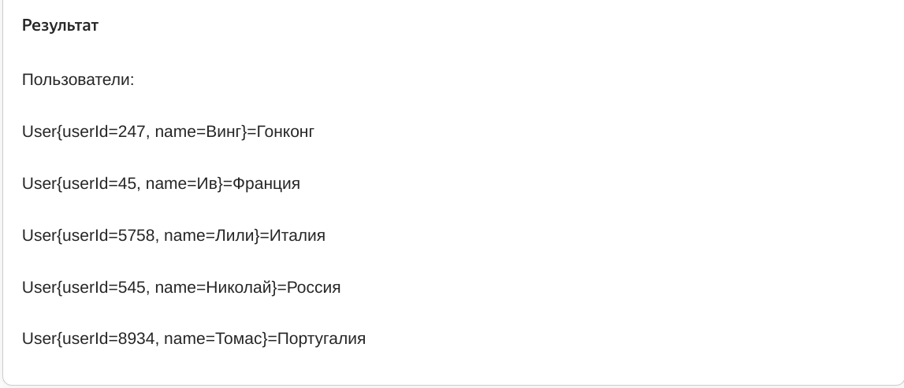

Предыдущее занятие |         &nbsp;          | Следующее занятие
:----------------:|:-----------------------:|:----------------:
[Урок 14](LESSON14.MD) | [Содержание](README.MD) | [Урок 16](LESSON16.md)

# Урок 15. Множество Set

# Требования к сдаче работы

Задание выполняется в среде программирования Idea. Результат надо разместить в своем репозитории на GitHub.
Прислать в гугл-формы(размещенная на моем сайте) ссылку на репозиторий.

***Критерии оценивания***

* Оценка 5 - надо сделать все пять заданий.
* Оценка 4 - надо сделать любые четыре задания.
* Оценка 3 - надо сделать два любых задания.

<details>
<summary>
Оглавление
</summary>

# Оглавление

1. [Устройство хеш-таблицы. Реализация HashMap](#устройство-хеш-таблицы-реализация-hashmap)
   

</details>

<details>
<summary>Что такое множество</summary>

# Что такое множество

Для решения некоторых задач бывает важно, чтобы в наборе данных не содержалось 
повторяющихся элементов.

Представьте себе рассеянного коллекционера книг, который частенько забывает, 
что у него уже есть какое-то 
издание, и покупает точно такое же ещё раз. Если ему понадобится узнать,
сколько уникальных книг, без дубликатов,
хранится в его библиотеке, то с этим ему поможет особая структура данных, 
которая называется множество, или `Set`.


В этом уроке мы расскажем, 
как устроены множества, какие проблемы они решают и чем отличаются от списков.


## Что такое множество

**Множество** (анл. _set_) — это коллекция, в которой содержатся неупорядоченные
уникальные элементы. 

Иерархия классов, относящихся к множеству, устроена по принципу, 
похожему на другие коллекции в Java: есть базовый интерфейс `Set` 
и несколько его реализаций — `HashSet`, `LinkedHashSet` и `TreeSet`. 


Реализация `HashSet` работает быстрее других и на практике применяется чаще. 
Её возможностей вполне достаточно для решения большинства задач, а в более специфических 
случаях используются другие реализации. Мы подробно расскажем о каждой из них.

Множество очень похоже на список: оно реализует интерфейс `Collection`, 
в нём тоже можно хранить объекты любых типов и выполнять по ним итерацию. 
Но есть и несколько отличий:
* Множество может содержать в себе только уникальные объекты. 
Добавить в него несколько **одинаковых**(Объекты считаются одинаковыми, если вызов метода `equals()` для них возвращает `true`.) элементов не получится.
А вот в список один и тот же объект можно добавить несколько раз: 
он будет сохранён в новой ячейке с новым индексом.
* Элементы, хранящиеся в множестве, не упорядочены. 
Хотя некоторые реализации интерфейса `Set` позволяют задавать порядок объектов, 
в классическом множестве этого нет. Списки же устроены иначе: элементы внутри них упорядочены, 
и у каждого есть свой индекс.

Благодаря этим свойствам множества оказываются очень удобны, когда важно гарантировать, 
что в наборе данных нет дубликатов. При этом упорядоченность этих данных не важна.

Например, номера всех существующих банковских карт удобно хранить в множестве. 
При выпуске новой карты, компьютерная система сгенерирует её номер автоматически, 
а затем проверит, не совпадает ли он с одним из тех, которые уже лежат в множестве. 
Если нет — значит, его можно присвоить новой карте.


Перед вами простой алгоритм на основе множества, который гарантирует, что не будет выпущено двух карт с одним и тем же номером.

```java
import java.util.HashSet;
import java.util.Set;

public class Practicum {
    // здесь хранятся номера всех выпущенных карт
    private static Set<String> issuedCards = new HashSet<>();

    public static void main(String[] args) {
        issuedCards.add("3688 2836 2367 0847");
        issuedCards.add("9522 4377 2788 9805");
        issuedCards.add("1278 6724 0988 4714");
        issuedCards.add("9142 7356 9815 9066");
        issuedCards.add("1168 9734 4967 2984");

        String newCard = generateNewCard();

        // проверим, свободен ли этот номер карты
        System.out.println("Номер карты " + newCard + " свободен? " + !issuedCards.contains(newCard));
    }

    public static String generateNewCard() {
        return "9734 3477 3844 3702";
    }
}
```
```
Результат

Номер карты 9734 3477 3844 3702 свободен? true
```

Эту задачу можно решить и с помощью списка. Тогда перед добавлением нового объекта нужно 
проверить методом `contains()`, есть ли он уже в списке или нет. 

Но такое решение более медленное: каждый раз вызов `contains()` будет перебирать все элементы 
в списке. Сложность такого алгоритма — O(n). Если у вас всего десять элементов — 
это не критично. А вот итерация по списку с миллионом объектов сильно замедлит работу программы.

Множество же выполняет эту задачу почти мгновенно, за константное время — O(1). Дело в том, 
что оно хранит данные по тому же принципу, что и хеш-таблицы. 
При добавлении, удалении или поиске данные не перебираются: множество заранее знает,
где находится нужный элемент.

## Основные методы

В интерфейсе `Set` перечислены базовые операции, которые должна выполнять 
каждая из его реализаций.

Многие операции над множествами, списками и хеш-таблицами совпадают. 
Это делает работу со всеми основными коллекциями единообразной и удобной.

### Метод add(E e)

Добавляет новый элемент в множество. Метод возвращает `boolean`: 
если `true` — значит, элемент успешно добавлен; если `false` — значит, 
элемент уже есть в множестве и не может быть добавлен ещё раз.

### addAll(Collection<? extends E> c)

Делает то же, что и `add(E e)`, но позволяет добавить несколько элементов сразу.
Этот метод принимает на вход объект типа `Collection`, что делает его универсальным — 
можно передать как список, так и множество. А затем он возвращает `boolean`. 
Если хотя бы один из элементов был успешно добавлен в множество, вернётся `true`. 
А если все элементы в множестве уже содержатся и после вызова метода `addAll` 
множество никак не изменилось, то вернётся `false`.

Перед вами программа, которая считает размер двух коллекций — списка и множества. 
Результат подсчёта выводится на консоль. Множество заполняется на основе списка,
для этого вызывается метод `addAll()`.

Попробуйте добавить в список новые имена или удалить из него те,
что там есть. Обратите внимание, как при этом меняется результат.

```java
import java.util.ArrayList;
import java.util.HashSet;
import java.util.List;
import java.util.Set;

public class Practicum {
    public static void main(String[] args) {
        List<String> allNames = new ArrayList<>();
        allNames.add("Марья");
        allNames.add("Пётр");
        allNames.add("Светлана");
        allNames.add("Кристина");
        allNames.add("Иван");
        allNames.add("Макс");
        allNames.add("Светлана");
        allNames.add("Иван");

        Set<String> uniqueNames = new HashSet<>();
        uniqueNames.addAll(allNames);

        System.out.println("Количество имён в списке allNames: " + allNames.size());
        System.out.println("Количество имён в множестве uniqueNames: " + uniqueNames.size());
    }
}

```

```
Результат

Количество имён в списке allNames: 8

Количество имён в множестве uniqueNames: 6
```

### Метод contains(Object o)

Поможет выяснить, хранится ли в множестве переданный объект. 
Этот метод возвращает тип `boolean`: `true` — положительный ответ, `false` — отрицательный.

### Метод remove(Object o)

Удаляет объект из множества. Если такого объекта в множестве нет, 
то никаких действий выполнено не будет. Исключения тоже не возникнет, и программа продолжит работу.

В этом коде метод `remove()` вызывается два раза. 
Первый его вызов удалит из множества число 198. Второй вызов, который должен удалить число 
984, ничего не сделает, потому что такого элемента в множестве нет.

```java
import java.util.HashSet;
import java.util.Set;

public class Practicum {
    public static void main(String[] args) {
        Set<Integer> numbers = new HashSet<>();

        numbers.add(178);
        numbers.add(346);
        numbers.add(894);
        numbers.add(973);
        numbers.add(198);
        System.out.println("В множестве numbers " + numbers.size() + " элементов.");

        numbers.remove(198);
        numbers.remove(984);
        System.out.println("Теперь в множестве numbers " + numbers.size() + " элемента.");
    }
}
```

```
Результат

В множестве numbers 5 элементов.

Теперь в множестве numbers 4 элемента.
```

### Метод isEmpty()

Проверяет, есть ли в множестве хотя бы один элемент. 
Если множество пустое — вернётся `true`, иначе — `false`.

Запустите этот код и посмотрите, как меняется результат вызова метода `isEmpty()` 
для пустого и не пустого множества.

```java
import java.util.HashSet;
import java.util.Set;

public class Practicum {
    public static void main(String[] args) {
       Set<String> animals = new HashSet<>();

       System.out.println("Множество animals пустое? " + animals.isEmpty());

       animals.add("Зебра");
       animals.add("Слон");

       System.out.println("Множество animals пустое? " + animals.isEmpty());        
    }
}
```
### Метод size()

Позволяет узнать, сколько элементов хранится в множестве в данный момент. 
Метод возвращает число типа `int`.

Запустите этот код и посмотрите, что возвращает метод `size()` до добавления блюд, 
и что возвращает после их добавления. Можете добавить ещё больше блюд в множество `food`, 
и вы увидите что метод `size()` теперь возвращает другое значение.

```java
import java.util.HashSet;
import java.util.Set;

public class Practicum {
    public static void main(String[] args) {
       Set<String> food = new HashSet<>();

       System.out.println("В множестве food " + food.size() + " элементов");

       food.add("Паста");
       food.add("Пицца");

       System.out.println("В множестве food " + food.size() + " элемента");
    }
}
```

Ещё одна ситуация, когда множества очень удобны, — подсчёт статистики.
В примере ниже рассчитывается статистика посещаемости сайта. 

```java
import java.util.ArrayList;
import java.util.HashSet;
import java.util.List;
import java.util.Set;

public class Practicum {
    public static void main(String[] args) {
        // список пользователей (логинов) которые посещали сайт за сегодняшний день
        List<String> siteVisitsList = new ArrayList<>();

        // посещения идут в хронологическом порядке
        // (некоторые логины появляются несколько раз,
        // это значит, что пользователь посещал сайт несколько раз в разное время)
        siteVisitsList.add("legioner");
        siteVisitsList.add("hanna7");
        siteVisitsList.add("lono_sun");
        siteVisitsList.add("hurocan");
        siteVisitsList.add("indie_woker");
        siteVisitsList.add("sonya2035");
        siteVisitsList.add("lono_sun");
        siteVisitsList.add("legioner");
        siteVisitsList.add("hanna7");
        siteVisitsList.add("futur100");
        siteVisitsList.add("legioner");

        // выведем статистику посещения сайта на консоль
        System.out.println("Все визиты: " + siteVisitsList);
        System.out.println("Всего визитов: " + siteVisitsList.size() + System.lineSeparator());

        // превратим список в множество — вызовем конструктор HashSet
        // и передадим в него список, который создали ранее
        Set<String> siteVisitsSet = new HashSet<>(siteVisitsList);

        // выведем статистику уникальных посещений сайта на консоль
        System.out.println("Уникальные визиты: " + siteVisitsSet);
        System.out.println("Всего уникальных визитов: " + siteVisitsSet.size());

        // проверим, заходили ли на сайт сегодня конкретные пользователи
        System.out.println("Заходил ли пользователь 'futur100' сегодня на сайт? Ответ: " + siteVisitsSet.contains("futur100"));
        System.out.println("Заходил ли пользователь 'lucky_kitten' сегодня на сайт? Ответ: " + siteVisitsSet.contains("lucky_kitten"));
    }
}
```

</details>

<details>

<summary>HashSet</summary>
</details>

<details>

<summary>Задание 1</summary>

# Задание 1

Запустите этот код. Вы увидите, что в консоли выводится вопрос `Есть ли в множестве Москва?`.
Измените код таким образом, 
чтобы на следующей строчке в консоли, сразу после вопроса, выводилось true.

```java
import java.util.HashSet;
import java.util.Set;

public class Practicum {
    public static void main(String[] args) {
        Set<String> cities = new HashSet<>();
        cities.add("Москва");

        System.out.println("Есть ли в множестве Москва?");
        System.out.println(...);
    }
}
```

## Подсказка

Добавьте во второй вызов метода println такой код: cities.contains("Москва").

## Ожидаемый результат

```
Результат

Есть ли в множестве Москва?

true
```


</details>

<details>

<summary>Задание 2</summary>

# Задание 2

Работа у программистов весьма разнообразна, и сегодня ваш новый проект — приложение для ведения списка покупок! 
Часть кода уже написана, вам нужно дописать недостающие части. 

В переменной `allPurchases` хранятся все покупки, которые семья сделала за последний месяц. 
Некоторые товары были приобретены несколько раз. Вам нужно выявить уникальные товары, 
которые покупала семья. Для этого реализуйте 
метод `findUniquePurchases(List<String> allPurchases)` и допишите недостающие части кода. 
Также посчитайте, сколько уникальных товаров приобретено за последний месяц, и выведите эту информацию на консоль.

```java
import java.util.List;
import java.util.Set;

class Practicum {
    private static List<String> allPurchases = List.of(
        "яблоки",
        "молоко",
        "колбаса",
        "огурцы",
        "сок",
        "хлеб",
        "виноград",
        "молоко",
        "йогурт",
        "хлеб",
        "пельмени"
    );    

    public static void main(String[] args) {
        // переменная uniquePurchases должна содержать множество уникальных товаров
        ... uniquePurchases = ...

        // допишите вывод количества уникальных товаров
        System.out.println( "За месяц было куплено " + ... + " уникальных товаров.");
    }
  
    // реализуйте этот метод
    public static ... findUniquePurchases(List<String> allPurchases) {
        ...
    }
}
```

## Подсказка

* Для переменной `uniquePurchases` лучше всего подойдёт тип данных `Set<String>`.
* У множества есть метод `size()`, он поможет посчитать количество уникальных товаров.
* В методе `findUniquePurchases` создайте новое множество типа `HashSet` на основе 
входного списка `allPurchases`.
* `HashSet` находится в пакете `java.util.HashSet`. Не забудьте сделать импорт.

## Ожидаемый результат



</details>


Предыдущее занятие |         &nbsp;          | Следующее занятие
:----------------:|:-----------------------:|:----------------:
[Урок 14](LESSON14.MD) | [Содержание](README.MD) | [Урок 16](LESSON16.MD)