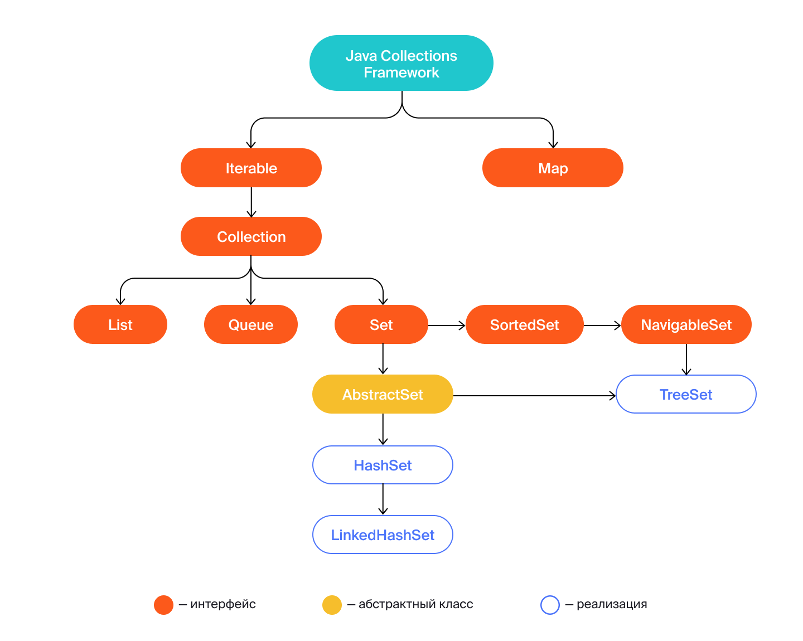
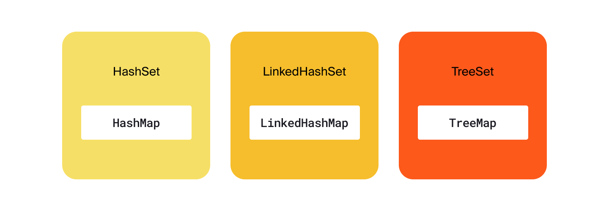

Предыдущее занятие |         &nbsp;          | Следующее занятие
:----------------:|:-----------------------:|:----------------:
[Урок 14](LESSON14.MD) | [Содержание](README.MD) | [Урок 16](LESSON16.MD)

# Урок 15. Множество Set

# Требования к сдаче работы

Задание выполняется в среде программирования Idea. Результат надо разместить в своем репозитории на GitHub.
Прислать в гугл-формы(размещенная на моем сайте) ссылку на репозиторий.

***Критерии оценивания***

* Оценка 5 - надо сделать все шесть заданий.
* Оценка 4 - надо сделать любые пять заданий.
* Оценка 3 - надо сделать четыре любых задания.

<details>
<summary>
Оглавление
</summary>

# Оглавление

1. [Что такое множеств](#что-такое-множество)
   * [Основные методы](#основные-методы)
     * [add(E e)](#метод-adde-e)
     * [addAll(Collection<? extends E> c)](#addallcollection-extends-e-c)
     * [contains(Object o)](#метод-containsobject-o)
     * [remove(Object o)](#метод-removeobject-o)
     * [isEmpty()](#метод-isempty)
     * [size()](#метод-size)
2. [Какие множества бывают](#какие-множества-бывают)
   * [Как устроено множество](#как-устроено-множество)
   * [HashSet](#множество-hashset-на-основе-хеш-таблицы-hashmap)
   * [Конструкторы HashSet](#конструкторы-hashset)
     * [public HashSet()](#public-hashset)
     * [public HashSet(Collection<? extends E> c)](#public-hashsetcollection-extends-e-c)
     * [public HashSet(int initialCapacity, float loadFactor)](#public-hashsetint-initialcapacity-float-loadfactor)
   * [LinkedHashSet](#множество-linkedhashset-на-основе-хеш-таблицы-linkedhashmap)
   * [Конструкторы LinkedHashSet](#конструкторы-linkedhashset)
     * [public LinkedHashSet()](#public-linkedhashset)
     * [public LinkedHashSet(Collection<? extends E> c)](#public-linkedhashsetcollection-extends-e-c)
     * [public LinkedHashSet(int initialCapacity, float loadFactor)](#public-linkedhashsetint-initialcapacity-float-loadfactor)
   * [TreeSet](#множество-treeset-на-основе-хеш-таблицы-treemap)
   * [Конструкторы TreeSet](#конструкторы-treeset)
     * [public TreeSet()](#public-treeset)
     * [public TreeSet(Comparator<? super E> comparator)](#public-treesetcomparator-super-e-comparator)
     * [public TreeSet(Collection<? extends E> c)](#public-treesetcollection-extends-e-c)
     * [public TreeSet(SortedSet<E> s)](#public-treesetsortedsete-s)
3. [Задание 1](#задание-1)
4. [Задание 2](#задание-2)
5. [Задание 3](#задание-3)
6. [Задание 4](#задание-4)
7. [Задание 5](#задание-5)
8. [Задание 6](#задание-6)
   

</details>

<details>
<summary>Что такое множество</summary>

# Что такое множество

Для решения некоторых задач бывает важно, чтобы в наборе данных не содержалось 
повторяющихся элементов.

Представьте себе рассеянного коллекционера книг, который частенько забывает, 
что у него уже есть какое-то 
издание, и покупает точно такое же ещё раз. Если ему понадобится узнать,
сколько уникальных книг, без дубликатов,
хранится в его библиотеке, то с этим ему поможет особая структура данных, 
которая называется множество, или `Set`.


В этом уроке мы расскажем, 
как устроены множества, какие проблемы они решают и чем отличаются от списков.


## Что такое множество

**Множество** (анл. _set_) — это коллекция, в которой содержатся неупорядоченные
уникальные элементы. 

Иерархия классов, относящихся к множеству, устроена по принципу, 
похожему на другие коллекции в Java: есть базовый интерфейс `Set` 
и несколько его реализаций — `HashSet`, `LinkedHashSet` и `TreeSet`. 



Реализация `HashSet` работает быстрее других и на практике применяется чаще. 
Её возможностей вполне достаточно для решения большинства задач, а в более специфических 
случаях используются другие реализации. Мы подробно расскажем о каждой из них.

Множество очень похоже на список: оно реализует интерфейс `Collection`, 
в нём тоже можно хранить объекты любых типов и выполнять по ним итерацию. 
Но есть и несколько отличий:
* Множество может содержать в себе только уникальные объекты. 
Добавить в него несколько **одинаковых**(Объекты считаются одинаковыми, если вызов метода `equals()` для них возвращает `true`.) элементов не получится.
А вот в список один и тот же объект можно добавить несколько раз: 
он будет сохранён в новой ячейке с новым индексом.
* Элементы, хранящиеся в множестве, не упорядочены. 
Хотя некоторые реализации интерфейса `Set` позволяют задавать порядок объектов, 
в классическом множестве этого нет. Списки же устроены иначе: элементы внутри них упорядочены, 
и у каждого есть свой индекс.

Благодаря этим свойствам множества оказываются очень удобны, когда важно гарантировать, 
что в наборе данных нет дубликатов. При этом упорядоченность этих данных не важна.

Например, номера всех существующих банковских карт удобно хранить в множестве. 
При выпуске новой карты, компьютерная система сгенерирует её номер автоматически, 
а затем проверит, не совпадает ли он с одним из тех, которые уже лежат в множестве. 
Если нет — значит, его можно присвоить новой карте.


Перед вами простой алгоритм на основе множества, который гарантирует, что не будет выпущено двух карт с одним и тем же номером.

```java
import java.util.HashSet;
import java.util.Set;

public class Practicum {
    // здесь хранятся номера всех выпущенных карт
    private static Set<String> issuedCards = new HashSet<>();

    public static void main(String[] args) {
        issuedCards.add("3688 2836 2367 0847");
        issuedCards.add("9522 4377 2788 9805");
        issuedCards.add("1278 6724 0988 4714");
        issuedCards.add("9142 7356 9815 9066");
        issuedCards.add("1168 9734 4967 2984");

        String newCard = generateNewCard();

        // проверим, свободен ли этот номер карты
        System.out.println("Номер карты " + newCard + " свободен? " + !issuedCards.contains(newCard));
    }

    public static String generateNewCard() {
        return "9734 3477 3844 3702";
    }
}
```
```
Результат

Номер карты 9734 3477 3844 3702 свободен? true
```

Эту задачу можно решить и с помощью списка. Тогда перед добавлением нового объекта нужно 
проверить методом `contains()`, есть ли он уже в списке или нет. 

Но такое решение более медленное: каждый раз вызов `contains()` будет перебирать все элементы 
в списке. Сложность такого алгоритма — O(n). Если у вас всего десять элементов — 
это не критично. А вот итерация по списку с миллионом объектов сильно замедлит работу программы.

Множество же выполняет эту задачу почти мгновенно, за константное время — O(1). Дело в том, 
что оно хранит данные по тому же принципу, что и хеш-таблицы. 
При добавлении, удалении или поиске данные не перебираются: множество заранее знает,
где находится нужный элемент.

## Основные методы

В интерфейсе `Set` перечислены базовые операции, которые должна выполнять 
каждая из его реализаций.

Многие операции над множествами, списками и хеш-таблицами совпадают. 
Это делает работу со всеми основными коллекциями единообразной и удобной.

### Метод add(E e)

Добавляет новый элемент в множество. Метод возвращает `boolean`: 
если `true` — значит, элемент успешно добавлен; если `false` — значит, 
элемент уже есть в множестве и не может быть добавлен ещё раз.

### addAll(Collection<? extends E> c)

Делает то же, что и `add(E e)`, но позволяет добавить несколько элементов сразу.
Этот метод принимает на вход объект типа `Collection`, что делает его универсальным — 
можно передать как список, так и множество. А затем он возвращает `boolean`. 
Если хотя бы один из элементов был успешно добавлен в множество, вернётся `true`. 
А если все элементы в множестве уже содержатся и после вызова метода `addAll` 
множество никак не изменилось, то вернётся `false`.

Перед вами программа, которая считает размер двух коллекций — списка и множества. 
Результат подсчёта выводится на консоль. Множество заполняется на основе списка,
для этого вызывается метод `addAll()`.

Попробуйте добавить в список новые имена или удалить из него те,
что там есть. Обратите внимание, как при этом меняется результат.

```java
import java.util.ArrayList;
import java.util.HashSet;
import java.util.List;
import java.util.Set;

public class Practicum {
    public static void main(String[] args) {
        List<String> allNames = new ArrayList<>();
        allNames.add("Марья");
        allNames.add("Пётр");
        allNames.add("Светлана");
        allNames.add("Кристина");
        allNames.add("Иван");
        allNames.add("Макс");
        allNames.add("Светлана");
        allNames.add("Иван");

        Set<String> uniqueNames = new HashSet<>();
        uniqueNames.addAll(allNames);

        System.out.println("Количество имён в списке allNames: " + allNames.size());
        System.out.println("Количество имён в множестве uniqueNames: " + uniqueNames.size());
    }
}

```

```
Результат

Количество имён в списке allNames: 8

Количество имён в множестве uniqueNames: 6
```

### Метод contains(Object o)

Поможет выяснить, хранится ли в множестве переданный объект. 
Этот метод возвращает тип `boolean`: `true` — положительный ответ, `false` — отрицательный.

### Метод remove(Object o)

Удаляет объект из множества. Если такого объекта в множестве нет, 
то никаких действий выполнено не будет. Исключения тоже не возникнет, и программа продолжит работу.

В этом коде метод `remove()` вызывается два раза. 
Первый его вызов удалит из множества число 198. Второй вызов, который должен удалить число 
984, ничего не сделает, потому что такого элемента в множестве нет.

```java
import java.util.HashSet;
import java.util.Set;

public class Practicum {
    public static void main(String[] args) {
        Set<Integer> numbers = new HashSet<>();

        numbers.add(178);
        numbers.add(346);
        numbers.add(894);
        numbers.add(973);
        numbers.add(198);
        System.out.println("В множестве numbers " + numbers.size() + " элементов.");

        numbers.remove(198);
        numbers.remove(984);
        System.out.println("Теперь в множестве numbers " + numbers.size() + " элемента.");
    }
}
```

```
Результат

В множестве numbers 5 элементов.

Теперь в множестве numbers 4 элемента.
```

### Метод isEmpty()

Проверяет, есть ли в множестве хотя бы один элемент. 
Если множество пустое — вернётся `true`, иначе — `false`.

Запустите этот код и посмотрите, как меняется результат вызова метода `isEmpty()` 
для пустого и не пустого множества.

```java
import java.util.HashSet;
import java.util.Set;

public class Practicum {
    public static void main(String[] args) {
       Set<String> animals = new HashSet<>();

       System.out.println("Множество animals пустое? " + animals.isEmpty());

       animals.add("Зебра");
       animals.add("Слон");

       System.out.println("Множество animals пустое? " + animals.isEmpty());        
    }
}
```
### Метод size()

Позволяет узнать, сколько элементов хранится в множестве в данный момент. 
Метод возвращает число типа `int`.

Запустите этот код и посмотрите, что возвращает метод `size()` до добавления блюд, 
и что возвращает после их добавления. Можете добавить ещё больше блюд в множество `food`, 
и вы увидите что метод `size()` теперь возвращает другое значение.

```java
import java.util.HashSet;
import java.util.Set;

public class Practicum {
    public static void main(String[] args) {
       Set<String> food = new HashSet<>();

       System.out.println("В множестве food " + food.size() + " элементов");

       food.add("Паста");
       food.add("Пицца");

       System.out.println("В множестве food " + food.size() + " элемента");
    }
}
```

Ещё одна ситуация, когда множества очень удобны, — подсчёт статистики.
В примере ниже рассчитывается статистика посещаемости сайта. 

```java
import java.util.ArrayList;
import java.util.HashSet;
import java.util.List;
import java.util.Set;

public class Practicum {
    public static void main(String[] args) {
        // список пользователей (логинов) которые посещали сайт за сегодняшний день
        List<String> siteVisitsList = new ArrayList<>();

        // посещения идут в хронологическом порядке
        // (некоторые логины появляются несколько раз,
        // это значит, что пользователь посещал сайт несколько раз в разное время)
        siteVisitsList.add("legioner");
        siteVisitsList.add("hanna7");
        siteVisitsList.add("lono_sun");
        siteVisitsList.add("hurocan");
        siteVisitsList.add("indie_woker");
        siteVisitsList.add("sonya2035");
        siteVisitsList.add("lono_sun");
        siteVisitsList.add("legioner");
        siteVisitsList.add("hanna7");
        siteVisitsList.add("futur100");
        siteVisitsList.add("legioner");

        // выведем статистику посещения сайта на консоль
        System.out.println("Все визиты: " + siteVisitsList);
        System.out.println("Всего визитов: " + siteVisitsList.size() + System.lineSeparator());

        // превратим список в множество — вызовем конструктор HashSet
        // и передадим в него список, который создали ранее
        Set<String> siteVisitsSet = new HashSet<>(siteVisitsList);

        // выведем статистику уникальных посещений сайта на консоль
        System.out.println("Уникальные визиты: " + siteVisitsSet);
        System.out.println("Всего уникальных визитов: " + siteVisitsSet.size());

        // проверим, заходили ли на сайт сегодня конкретные пользователи
        System.out.println("Заходил ли пользователь 'futur100' сегодня на сайт? Ответ: " + siteVisitsSet.contains("futur100"));
        System.out.println("Заходил ли пользователь 'lucky_kitten' сегодня на сайт? Ответ: " + siteVisitsSet.contains("lucky_kitten"));
    }
}
```

</details>

<details>

<summary>Какие множества бывают</summary>


# Какие множества бывают

В основе всех реализаций интерфейса `Set`, в том числе множеств `HashSet`, `LinkedHashSet`, `TreeSet`, 
находятся хеш-таблицы соответствующего типа. Именно в них и хранятся данные.



Дело в том, что у хеш-таблиц уже есть механизм защиты от дубликатов. 
Поэтому создатели Java решили переиспользовать его, вместо того чтобы писать сложный алгоритм ещё раз.

## Как устроено множество

При создании нового множества внутри него автоматически появляется хеш-таблица. 
А внутри хеш-таблицы, как вы уже знаете, сразу же создаётся небольшое количество пустых ячеек — чтобы у хеш-функции было пространство
для распределения ключей. Добавляемые в множество элементы хранятся во внутренней хеш-таблице как ключи. 
Значения при этом никак не используются. 

Из-за такого устройства множества обладают многими свойствами, характерными для хеш-таблиц.
Например, сложности операций у них такие же, как у реализаций хеш-таблиц, которые лежат в их основе.

## Множество HashSet на основе хеш-таблицы HashMap

Программисты часто выбирают именно эту реализацию множества для решения своих задач, потому что она работает быстрее других. 
Все основные операции (добавление, удаление и поиск элемента) выполняются в ней за константное время O(1). 
Но элементы внутри `HashSet` хранятся хаотично, без какого-либо порядка.

Если множество используется только для того, чтобы в наборе данных не было дубликатов, то `HashSet` станет отличным выбором. 
Например, при регистрации нового пользователя нужно удостовериться, что номер телефона не занят кем-то другим. Для этого подойдёт `HashSet`.

Если же важно не только обеспечить уникальность данных, но и сохранить относительный порядок элементов, 
то для таких задач подойдут другие реализации. О них мы расскажем дальше.

### Конструкторы HashSet

У HashSet есть несколько конструкторов для разных задач и сценариев использования.

#### public HashSet()

Чтобы создать новое пустое множество, нужно вызвать конструктор без каких-либо параметров.

#### public HashSet(Collection<? extends E> c)

Этот конструктор пригодится, если вам нужно создать множество на основе уже имеющегося списка или другого множества. 
Передайте в него список, в котором некоторые элементы повторяются, и в созданном множестве останутся только уникальные элементы.

#### public HashSet(int initialCapacity, float loadFactor)

В этот конструктор можно передать уже знакомые вам параметры initialCapacity и loadFactor. 
Они определяют, сколько ячеек будет создано во внутренней хеш-таблице и коэффициент её заполнения. 

## Множество LinkedHashSet на основе хеш-таблицы LinkedHashMap

Эта реализация умеет сохранять определённый порядок объектов. 
При итерации он будет предсказуемым — таким же,
в каком элементы были добавлены в множество.

`LinkedHashSet` удобно использовать в тех случаях,
когда нужно гарантировать отсутствие дубликатов и 
при этом сохранить изначальный порядок элементов.

Такая задача может возникнуть, например, при написании плеера. Предположим, в течение дня пользователь слушает разные треки, 
некоторые по нескольку раз. И вы хотите показать ему статистику — какие песни он сегодня прослушал,
без дубликатов. Для этой задачи хорошо подойдёт `LinkedHashSet`.

Сложность операций у множества `LinkedHashSet` совпадает с `HashSet`. 
Все основные операции выполняются за константное время O(1).

### Конструкторы LinkedHashSet

Набор конструкторов у `LinkedHashSet` такой же, как у `HashSet`.

#### public LinkedHashSet()

Конструктор без параметров, который создаёт множество.

#### public LinkedHashSet(Collection<? extends E> c)

Конструктор, который на вход принимает объект типа `Collection`. Создаёт множество на основе списка другого множества.

#### public LinkedHashSet(int initialCapacity, float loadFactor)

Конструктор принимает на вход параметры `initialCapacity` и `loadFactor` — количество ячеек во внутренней хеш-таблице и коэффициент её заполнения. 

## Множество TreeSet на основе хеш-таблицы TreeMap
Эта реализация позволяет гибко настраивать правила сортировки элементов внутри множества. 
Для этого используется принцип, который вам уже знаком по `TreeMap`: элементы должны реализовать интерфейс `Comparable` или при создании `TreeMap` 
в конструктор нужно передать объект типа `Comparator`, в котором будет описана логика сортировки.

Например, допустим есть класс `Film` с полем `rating`. В этом поле хранится рейтинг фильма (от 1 до 10), который формируется на базе всех оценок пользователей.

```java
public class Film {
    public String title;
    public String directorName;
    public int rating;
} 
```

Отсортировать фильмы по рейтингу можно двумя способами:
1. Реализовать интерфейс `Comparable` в классе `Film`.

```java
public class Film implements Comparable<Film> {
    public String title;
    public String directorName;
    public int rating;

    @Override
    public int compareTo(Film film) {
        return this.rating - film.rating;
    }
}
```

2. Передать `Comparator` в конструктор в момент создания `TreeSet`.

```java
Comparator<Film> comparator = new Comparator<Film>() {
    @Override
    public int compare(Film o1, Film o2) {
        return o1.rating - o2.rating;
    }
};

Set<Film> film = new TreeSet<>(comparator);
```

### Конструкторы TreeSet
У `TreeSet`, как и у других реализаций множества, есть несколько конструкторов для различных ситуаций.

#### public TreeSet()

Используя конструктор без параметров, можно создать пустое множество.

#### public TreeSet(Comparator<? super E> comparator)

Для того чтобы передать желаемый порядок сортировки элементов, есть отдельный конструктор. Он принимает на вход объект типа `Comparator`.

#### public TreeSet(Collection<? extends E> c)

`TreeSet` можно создать на основе любого списка или множества. 
Реализация исходного списка или множества при этом не имеет значения, 
потому что конструктор принимает на вход интерфейс `Collection`.

#### public TreeSet(SortedSet<E> s)

Этот конструктор принимает на вход `SortedSet` и создаёт новое множество на основе другого, уже отсортированного множества.  

`TreeSet` работает немного медленнее других реализаций. Сложность операций добавления, удаления и поиска элемента — O(logn). 
Поэтому будьте аккуратны при выборе реализации множества для своего алгоритма. 

Если порядок элементов для вас не имеет значения, лучше использовать `HashSet`, 
эта реализация будет работать гораздо быстрее.

> Вы узнали, какие виды хеш-таблиц и множеств есть в Java и разобрались, как с ними работать.

> Реализация `HashMap` — самая быстрая, но ключи в этой хеш-таблице лежат без определённого порядка. 
> В `LinkedHashMap` ключи хранятся либо в порядке последнего к ним обращения, 
> либо в порядке добавления. А `TreeMap` позволяет очень гибко настраивать правила сортировки, но работает медленнее.

> Множества `HashSet`, `LinkedHashSet` и `TreeSet` построены на основе соответствующих хеш-таблиц и обладают их свойствами.


</details>

<details>

<summary>Задание 1</summary>

# Задание 1

Запустите этот код. Вы увидите, что в консоли выводится вопрос `Есть ли в множестве Москва?`.
Измените код таким образом, 
чтобы на следующей строчке в консоли, сразу после вопроса, выводилось true.

```java
import java.util.HashSet;
import java.util.Set;

public class Practicum {
    public static void main(String[] args) {
        Set<String> cities = new HashSet<>();
        cities.add("Москва");

        System.out.println("Есть ли в множестве Москва?");
        System.out.println(...);
    }
}
```

## Подсказка

Добавьте во второй вызов метода println такой код: cities.contains("Москва").

## Ожидаемый результат

```
Результат

Есть ли в множестве Москва?

true
```


</details>

<details>

<summary>Задание 2</summary>

# Задание 2

Этот код выводит в консоль информацию о том, сколько всего имён хранится в списке names.
Доработайте код так, чтобы он показывал ещё и количество уникальных имён.

```java
import java.util.ArrayList;
import java.util.List;

public class Practicum {
    public static void main(String[] args) {
        List<String> names = new ArrayList<>();
        fillNames(names);
        System.out.println("Общее количество имён: " + names.size());

        ...
        System.out.println("Количество уникальных имён: " + ...);
    }

    private static void fillNames(List<String> names) {
        names.add("Максим");
        names.add("Светлана");
        names.add("Иван");
        names.add("Ольга");
        names.add("Максим");
        names.add("Пётр");
        names.add("Олег");
        names.add("Иван");
        names.add("Ольга");
        names.add("Ирина");
    }
}
```

## Подсказка

* Создайте множество, которое будет содержать только уникальные имена: `Set<String> uniqueNames = new HashSet<>(names);`.
* Для подсчёта количества имён в множестве используйте метод `size()`


## Ожидаемый результат

```
Результат

Общее количество имён: 10

Количество уникальных имён: 7
```

</details>

<details>

<summary>Задание 3</summary>

# Задание 3

Перед вами код плеера, который показывает список прослушанных за день песен.
Некоторые из них проигрывались несколько раз.

Измените код так, чтобы в консоль не выводились дубликаты одной и той же песни, если её слушали больше одного раза. 
Также нужно сохранить изначальный порядок прослушивания.

```java
import java.util.ArrayList;
import java.util.List;

public class Practicum {
    public static void main(String[] args) {
        List<String> songs = new ArrayList<>();
        fillSongs(songs);

        System.out.println("Количество песен: " + songs.size());

        System.out.println("Песни:");
        for (String song : songs) {
            System.out.println("  * " + song);
        }

    }

    private static void fillSongs(List<String> songs) {
        songs.add("Sting – Shape Of My Heart");
        songs.add("Gorillaz – Clint Eastwood");
        songs.add("Lady Gaga – Bad Romance");
        songs.add("Taylor Swift – Wildest Dreams");
        songs.add("Ariana Grande – 7 rings");
        songs.add("Depeche Mode – Personal Jesus");
        songs.add("Gorillaz – Clint Eastwood");
        songs.add("Lady Gaga – Bad Romance");
        songs.add("Bruno Mars – Talking To The Moon");
        songs.add("Taylor Swift – Wildest Dreams");
    }
}
```

## Подсказка

*  Замените типы структур данных, которые используются в коде: `ArrayList` на `LinkedHashSet`, `List` на `Set`.


## Ожидаемый результат

```
Количество песен: 7

Песни:

  * Sting – Shape Of My Heart

  * Gorillaz – Clint Eastwood

  * Lady Gaga – Bad Romance

  * Taylor Swift – Wildest Dreams

  * Ariana Grande – 7 rings

  * Depeche Mode – Personal Jesus

  * Bruno Mars – Talking To The Moon
```


</details>


<details>

<summary>Задание 4</summary>

# Задание 4

Перед вами программа, которая хранит доступные авиабилеты и цены на них.
Измените код таким образом, чтобы билеты хранились в упорядоченном виде — от самых дешёвых к более дорогим.

```java
import java.util.HashSet;
import java.util.Set;

public class Practicum {
    public static void main(String[] args) {
        Set<Ticket> tickets = new HashSet<>();
        fillTickets(tickets);

        System.out.println("Доступные билеты: ");
        for (Ticket ticket : tickets) {
            System.out.println("  * " + ticket);
        }
    }

    private static void fillTickets(Set<Ticket> tickets) {
        tickets.add(new Ticket("Лондон", "Париж", 376));
        tickets.add(new Ticket("Милан", "Москва", 298));
        tickets.add(new Ticket("Берлин", "Бостон", 1273));
        tickets.add(new Ticket("Пекин", "Рим", 846));
        tickets.add(new Ticket("Санкт-Петербург", "Афины", 284));
        tickets.add(new Ticket("Сидней", "Токио", 1738));
        tickets.add(new Ticket("Мюнхен", "Дубай", 974));
    }

    public static class Ticket {
        public String from;
        public String to;
        public int priceInUsd;

        public Ticket(String from, String to, int priceInUsd) {
            this.from = from;
            this.to = to;
            this.priceInUsd = priceInUsd;
        }

        @Override
        public boolean equals(Object o) {
            if (this == o) return true;
            if (o == null || getClass() != o.getClass()) return false;

            Ticket ticket = (Ticket) o;

            if (priceInUsd != ticket.priceInUsd) return false;
            if (!from.equals(ticket.from)) return false;
            if (!to.equals(ticket.to)) return false;

            return true;
        }

        @Override
        public int hashCode() {
            int result = from.hashCode();
            result = 31 * result + to.hashCode();
            result = 31 * result + priceInUsd;
            return result;
        }

        @Override
        public String toString() {
            return "Ticket{from=" + from + ", to=" + to + ", priceInUsd=" + priceInUsd + '}';
        }
    }
}
```

## Подсказка

*  Замените реализацию множества в коде с `HashSet` на `TreeSet`.
*  Создайте объект `Comparator`, который будет сортировать билеты от самых дешёвых к самым дорогим.
```java
 Comparator<Ticket> comparator = new Comparator<Ticket>() {
    @Override
    public int compare(Ticket o1, Ticket o2) {
        return o1.priceInUsd - o2.priceInUsd;
    }
};
```
* При конструировании объекта TreeSet не забудьте применить `Comparator` к множеству.

```java
Set<Ticket> tickets = new TreeSet<>(comparator);
```

## Ожидаемый результат

```
Результат

Доступные билеты: 

  * Ticket{from=Санкт-Петербург, to=Афины, priceInUsd=284}

  * Ticket{from=Милан, to=Москва, priceInUsd=298}

  * Ticket{from=Лондон, to=Париж, priceInUsd=376}

  * Ticket{from=Пекин, to=Рим, priceInUsd=846}

  * Ticket{from=Мюнхен, to=Дубай, priceInUsd=974}

  * Ticket{from=Берлин, to=Бостон, priceInUsd=1273}

  * Ticket{from=Сидней, to=Токио, priceInUsd=1738}
```


</details>


<details>

<summary>Задание 5</summary>

# Задание 5

Работа у программистов весьма разнообразна, и сегодня ваш новый проект — приложение для ведения списка покупок! 
Часть кода уже написана, вам нужно дописать недостающие части. 

В переменной `allPurchases` хранятся все покупки, которые семья сделала за последний месяц. 
Некоторые товары были приобретены несколько раз. Вам нужно выявить уникальные товары, 
которые покупала семья. Для этого реализуйте 
метод `findUniquePurchases(List<String> allPurchases)` и допишите недостающие части кода. 
Также посчитайте, сколько уникальных товаров приобретено за последний месяц, и выведите эту информацию на консоль.

```java
import java.util.List;
import java.util.Set;

class Practicum {
    private static List<String> allPurchases = List.of(
        "яблоки",
        "молоко",
        "колбаса",
        "огурцы",
        "сок",
        "хлеб",
        "виноград",
        "молоко",
        "йогурт",
        "хлеб",
        "пельмени"
    );    

    public static void main(String[] args) {
        // переменная uniquePurchases должна содержать множество уникальных товаров
        ... uniquePurchases = ...

        // допишите вывод количества уникальных товаров
        System.out.println( "За месяц было куплено " + ... + " уникальных товаров.");
    }
  
    // реализуйте этот метод
    public static ... findUniquePurchases(List<String> allPurchases) {
        ...
    }
}
```

## Подсказка

* Для переменной `uniquePurchases` лучше всего подойдёт тип данных `Set<String>`.
* У множества есть метод `size()`, он поможет посчитать количество уникальных товаров.
* В методе `findUniquePurchases` создайте новое множество типа `HashSet` на основе 
входного списка `allPurchases`.
* `HashSet` находится в пакете `java.util.HashSet`. Не забудьте сделать импорт.

</details>

<details>

<summary>Задание 6</summary>

# Задание 6

Представьте, что вы работаете в крупной компании над программой для учёта всей 
входящей корреспонденции. В эту систему попадает информация о каждом письме, которое поступает в компанию. 
Письма хранятся в порядке занесения информации о них в систему. 
Вам нужно добавить новую функцию `printOrderedByDateReceived` — возможность отсортировать письма по дате их получения (от ранних к поздним).
Используйте тот же формат вывода на консоль, что уже используется в программе.

```java
import java.time.LocalDate;
import java.util.LinkedHashSet;
import java.util.Set;

public class Practicum {
    private static Set<Letter> letters = new LinkedHashSet<>();

    public static void main(String[] args) {
        // информация о письмах (в порядке занесения в систему)
        letters.add(new Letter("Джон Смит", LocalDate.of(2021, 7, 7), "текст письма №1 ..."));
        letters.add(new Letter("Аманда Линс", LocalDate.of(2021, 6, 17), "текст письма №2 ..."));
        letters.add(new Letter("Джо Кью", LocalDate.of(2021, 7, 5), "текст письма №3 ..."));
        letters.add(new Letter("Мишель Фернандес", LocalDate.of(2021, 8, 23), "текст письма №4 ..."));

        printOrderedById(letters);
        printOrderedByDateReceived(letters);
    }

    private static void printOrderedById(Set<Letter> letters) {
        System.out.println("Все письма с сортировкой по ID: ");

        for (Letter letter : letters) {
            System.out.println("    * Письмо от " + letter.authorName + " поступило " + letter.dateReceived);
        }
    }

    private static void printOrderedByDateReceived(Set<Letter> letters) {
        System.out.println("Все письма с сортировкой по дате получения: ");

        // реализуйте этот метод
        ...
    }
      
    static class Letter {
        public String authorName;      // имя отправителя
        public LocalDate dateReceived; // дата получения письма
        public String text;            // текст письма

        public Letter(String senderName, LocalDate dateReceived, String text) {
            this.authorName = senderName;
            this.dateReceived = dateReceived;
            this.text = text;
        }
    }
}
```

## Подсказка

* Создайте новый объект `TreeSet` и передайте ему в конструктор компаратор.
* `TreeSet` и `Comparator` находятся в пакете `java.util`. Не забудьте про импорт.
* Самый простой способ создать компаратор: `Comparator.comparing(l -> l.dateReceived)`.
* После создания `TreeSet` новое множество нужно заполнить данными `.addAll`.

</details>


Предыдущее занятие |         &nbsp;          | Следующее занятие
:----------------:|:-----------------------:|:----------------:
[Урок 14](LESSON14.MD) | [Содержание](README.MD) | [Урок 16](LESSON16.MD)