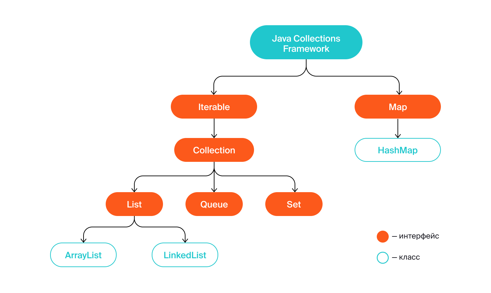
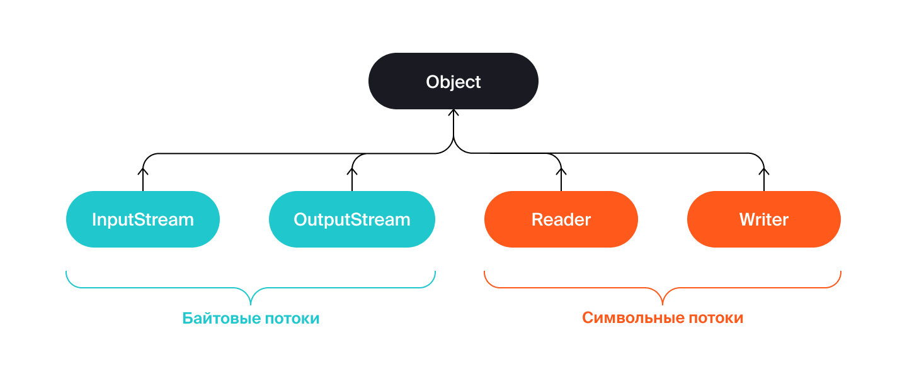

Предыдущее занятие |         &nbsp;          | Следующее занятие
:----------------:|:-----------------------:|:----------------:
[Урок 15](LESSON15.MD) | [Содержание](README.MD) | [Урок 17](LESSON17.md)

# Урок 16. String

# Требования к сдаче работы

Задание выполняется в среде программирования Idea. Результат надо разместить в своем репозитории на GitHub.
Прислать в гугл-формы(размещенная на моем сайте) ссылку на репозиторий.

***Критерии оценивания***

* Оценка 5 - надо сделать все шесть заданий.
* Оценка 4 - надо сделать любые пять заданий.
* Оценка 3 - надо сделать четыре любых задания.

<details>
<summary>
Оглавление
</summary>

# Оглавление

1. [Класс String](#класс-string)
   * [Строковый литерал](#строковый-литерал)
   * [Пул строк и методы `Object`](#пул-строк-и-методы-object)
   * [Полезные методы `String`](#полезные-методы-string)
2. [Подстроки и внутристроковая нумерация](#подстроки-и-внутристроковая-нумерация)
   * [Нумерация символов внутри строки](#нумерация-символов-внутри-строки)
   * [Получение символа по индексу](#получение-символа-по-индексу)
   * [Составляем простой алгоритм на основе стандартных методов](#составляем-простой-алгоритм-на-основе-стандартных-методов)
3. [Задание 1](#задание-1)
4. [Задание 2](#задание-2)
5. [Задание 3](#задание-3)
6. [Задание 4](#задание-4)
7. [Задание 5](#задание-5)
8. [Задание 6](#задание-6)
   

</details>

<details>
<summary>Класс String</summary>

# Класс String

Строки в программировании встречаются повсеместно. 
Любое сообщение в браузере, текст для ввода и вывода, время, даты — всё это строки. 

Его объект представляет собой набор символов — **строку** (англ. _string_). Например, текст урока, который вы сейчас читаете, —
это множество объектов `String`. 

Класс `String` — самый популярный в любой программе на `Java`, даже если в коде нет ни одного его экземпляра.
Без строк не обойтись при записи метаинформации, такой как имена классов и импортов. 
Также `String` даёт возможность проводить множество манипуляций со строками: 
проверять их размер и содержание, приводить к нужному регистру.

## Строковый литерал

Поскольку строки являются объектами, их можно создавать через ключевое слово `new`:
```java
String myString = new String("Привет!");
```
 
Однако гораздо проще и удобнее создавать так, как вы делали во всех предыдущих уроках: 
```java
String myString = "Привет!";  
```
При такой записи объект-строка создаётся через строковый **литерал** (англ. _string literal_).
**Литералы** — это заранее определённые константные значения в программе.
Их не могут создать программисты, и они всегда обозначают одно и то же. 
Например, символ `1` — это значение, всегда равное единице, а запись `"кот"` всегда обозначает пушистого домашнего питомца. 
В нашем примере литералом будет запись `"Привет!"`. 

Литералы используются практически во всех языках программирования для создания значений примитивных типов: 

```java
int age = 23; // 23 — числовой литерал
String name = "Байт"; // "Байт" — строковый литерал
boolean isJavaAwesome = true; // true — булев литерал  
```

По возможности всегда создавайте строки через литерал. 
Во-первых, такая запись короче и привычнее для большинства разработчиков. 
Во-вторых, она позволяет JVM использовать специальные оптимизации для строк. 

## Пул строк и методы `Object`

Строки — неизменяемые объекты. Это значит, что вы не сможете подменить символы внутри после инициализации. 
Поэтому для экономии места в оперативной памяти строки с одинаковым значением на уровне JVM могут ссылаться на один и тот же объект. 
При создании строк с помощью литерала они попадают в особое хранилище —  **пул строк** (англ. `string pool`). 
Если строка находится в пуле и вы попытаетесь создать строку с таким же значением,
то она не будет создаваться второй раз. Вместо этого вернётся ссылка на уже существующую. 
Подробнее о пуле строк можно почитать [здесь](https://ru.stackoverflow.com/questions/714949/%D0%A1%D1%80%D0%B0%D0%B2%D0%BD%D0%B5%D0%BD%D0%B8%D0%B5-%D1%81%D1%82%D1%80%D0%BE%D0%BA-%D0%B2-java-%D0%BF%D0%BE-%D1%81%D1%81%D1%8B%D0%BB%D0%BA%D0%B5)
или в [официальной документации](https://docs.oracle.com/en/java/javase/21/docs/api/java.base/java/lang/String.html). 

Важно запомнить, что строки, которые создаются через new, не попадают в пул. 
Это нужно учитывать при сравнении строк между собой. Вместо оператора == нужно всегда использовать `equals()`. 
Этот метод вместе с `toString()` и `hashCode()` уже корректно переопределены для `String` — как одного из основных классов стандартной библиотеки. 
Вот что произойдёт при сравнении строк через `==`, а не через `equals()`:

```java
public class Practicum {
    public static void main(String[] args) {
        String one = "привет"; // строка попала в пул
        String two = "привет"; // вместо создания новой строки берётся ссылка на уже существующую
        String three = new String("привет"); // создаётся новый объект

        System.out.println(one==two); // вернёт true
        System.out.println(one==three); // вернёт false
    }
}
```

```
Результат

true

false
```

Хотя все три строки одинаковые, у них отличается способ создания, 
и их сравнение через `==` вернёт как `true`, так и `false`.

Если бы строки сравнивались через `equals()`, 
то результат был бы корректным (поскольку происходит сравнение значений, а не ссылок).

```java
public class Practicum {
    public static void main(String[] args) {
        String one = "привет";
        String two = "привет";
        String three = new String("привет");

        System.out.println(one.equals(two)); // вернёт true
        System.out.println(one.equals(three)); // вернёт true
    }
}
```

```
Результат

true

true
```

Другой метод класса `Object` — `toString()`, который обычно используется, чтобы создать строковое представление объекта, при вызове для строк просто возвращает их самих.

## Полезные методы `String`

Класс `String` содержит несколько десятков методов. Знать все необязательно, но некоторые стоит запомнить. 
Например, узнать, сколько символов в строке, можно с помощью метода `length()`. Метод `isEmpty()` возвращает ответ, 
является ли строка пустой или нет. Если использовать их вместе, 
то можно заглянуть в содержание строки. Допустим, нужно проверить, есть ли в строке нужное количество символов:

```java
public class PasswordChecker {
    public boolean checkPassword(String password) {
        if (password.isEmpty()) { // проверяем, не является ли строка пустой
            System.out.println("Пароль отсутствует.");
            return false;
        } else if (password.length() < 8) { // размер строки не должен быть меньше 8 символов
            System.out.println("Пароль слишком короткий.");
            return false;
        }
        System.out.println("Подходящий пароль.");
        return true;
    }

    public static void main(String[] args) {
        PasswordChecker checker = new PasswordChecker();

        System.out.println(checker.checkPassword(""));           // false
        System.out.println(checker.checkPassword("S34fd1265Jd")); // true
        System.out.println(checker.checkPassword("          "));  // true
        System.out.println(checker.checkPassword("shortpw"));    // false
    }
}
```
```
Результат

Пароль отсутствует.

false

Подходящий пароль.

true

Подходящий пароль.

true

Пароль слишком короткий.

false

```

В этом коде методы `isEmpty()` и `length()` отвечают за то, чтобы пароль содержал не меньше восьми символов и не был пустым. 
Поменяйте значение строк и посмотрите, как изменится результат. 

Обратите внимание на «пустую» строку `"          "` (англ. _string blank_).
Она состоит только из пробелов. Да, пробелы — это тоже символы! Такие строки
из пробелов встречаются очень часто, и для их обработки тоже есть методы. `isBlank()` 
вернёт `true`, если строка действительно пустая (`""`) или содержит только пробельные символы. 
Метод `trim()` (англ. «обрезать») возвращает строку, из которой удалены пробельные символы в начале и в конце.

```java
public class Practicum {
    public static void main(String[] args) {
        String blank = "   ";
        String notBlank = "Тут пробелы или строка?!";
        System.out.println(blank.isBlank()); // true
        System.out.println(notBlank.isBlank()); // false

        String withBlanks = "  Привет, у меня тут лишние пробелы!";
        String trimmed = withBlanks.trim();
        System.out.println(trimmed);
    }
}
```
```
Результат

true

false

Привет, у меня тут лишние пробелы!
```


Строки могут состоять как из строчных, так и из прописных букв. 
Поэтому класс String предоставляет методы `toUpperCase()` и `toLowerCase()` для перевода строки в верхний и нижний регистры:

```java
public class Practicum {
    public static void main(String[] args) {
        String text = "Привет, я Java!";
        System.out.println(text.toUpperCase()); // выведет "ПРИВЕТ, Я JAVA!"
        System.out.println(text.toLowerCase()); // выведет "привет, я java!"
    }
}
```
```
Результат

ПРИВЕТ, Я JAVA!

привет, я java!
```

</details>

<details>
<summary>Подстроки и внутристроковая нумерация</summary>

# Подстроки и внутристроковая нумерация

При работе со строками часто нужно найти и потом изменить некоторые слова или отдельные символы. 
Это может понадобиться, например, для исправления орфографических ошибок в текстовом редакторе или 
чтобы найти нужную информацию в браузере. Для обработки этих и подобных задач используются подстроки. 
О них и поговорим в этом уроке. 

**Подстрока** (англ. _substring_) — это непрерывный набор символов внутри строки.
Например, «**обед**» — подстрока для «п**обед**а», а словосочетание «**упала на лапу**» содержится в строке «А роза **упала на лапу** Азора». 
А вот «**саёт**» не будет подстрокой для «**са**мол**ёт**» — так как тут нарушена последовательность символов. 

Строка также всегда будет подстрокой и для самой себя. 
Однако важно запомнить, что подстроки чувствительны к регистру. 
К примеру, «**чай**» будет подстрокой для «**чай**», 
но не будет для «**Чай**», а «**Кар**» не входит в «**картошка**», но входит в «**Карлсон**».



## Нумерация символов внутри строки

Ориентироваться внутри строк и искать подстроки позволяет внутренняя нумерация символов. 
Она ничем не отличается от нумерации в массиве и тоже начинается с **нуля**. Свой номер есть у каждого «символа»,
будь это цифра, символ алфавита, пробел или даже спецсимвол. Например, 
в строке `"Java"` символ `"v"` находится на второй позиции, а символ `"J"` на нулевой. 


Для манипуляций с подстроками в классе `String` предусмотрены свои методы. Например, с помощью `indexOf(String str)` и `lastIndexOf(String str)` 
можно найти индекс начала подстроки. Разница методов в том, что `indexOf` ищет слева направо, а `lastIndexOf` — справа налево. Если подстрока не найдена, вернётся `-1`.

```java
public class Practicum {
    public static void main(String[] args) {
        String start = "Hello, world!";
        System.out.println(start.indexOf("world"));
    }
}
```
Будет напечатано `7`. Это индекс элемента `"w"`, с которого начинается подстрока `"world"`. 


Методы `indexOf()` и `lastIndexOf()` также могут принимать в качестве второго аргумента индекс, с которого нужно начать поиск. 
В этом случае их сигнатура будет такой — `indexOf(String str, int fromIndex)` и `lastIndexOf(String str,int fromIndex)`. 
Искать, начиная от конкретного символа, полезно, когда вы точно знаете, где 
находится искомая подстрока. Однако если начать поиск не с того элемента, то можно вообще её не найти:

```java
public class Practicum {
    public static void main(String[] args) {
        String start = "Hello, world!";
        System.out.println(start.indexOf("world", 10));
    }
}
```
Метод вернёт -1, так как с позиции 10 при движении слева направо подстроку "world" обнаружить не получилось. 



## Получение символа по индексу

Получить элемент можно с помощью метода `charAt(int index)`.
Его, к слову, удобно использовать в циклах для прохода по всем элементам строки. 
В качестве аргумента в метод передаётся индекс:

```java
public class Practicum {
    public static void main(String[] args) {
        String soManyMethods = "Опять много новых методов!";
        System.out.println(soManyMethods.charAt(5)); // выведет пробел
        System.out.println(soManyMethods.charAt(14)); // выведет 'в'
        System.out.println(soManyMethods.charAt(54)); // выдаст исключение
    }
}
```

```
Результат

Exception in thread "main" java.lang.StringIndexOutOfBoundsException: index 54,length 26

	at java.base/java.lang.String.checkIndex(String.java:3278)

	at java.base/java.lang.StringUTF16.checkIndex(StringUTF16.java:1470)

	at java.base/java.lang.StringUTF16.charAt(StringUTF16.java:1267)

	at java.base/java.lang.String.charAt(String.java:695)

	at Practicum.main(Practicum.java:6)
в
```
Символ по индексу обязательно должен существовать, иначе программа выбросит исключение `StringIndexOutOfBoundsException` (англ. «**индекс находится за границами строки**»). 

## Составляем простой алгоритм на основе стандартных методов

Методы стандартной библиотеки — полезные инструменты. Но нужно не только знать их, но и уметь объединять в новые. Допустим, вам нужно написать метод, 
который будет проверять, что какая-то подстрока встречается в строке только один раз. Назовём его, например, `boolean onlySingleSubstring(String initialString, String substring)`. 

```java
onlySingleSubstring("раз два три",      "раз", ); // тут метод должен вернуть true
onlySingleSubstring("раз два, раз два", "раз", ); // а тут false
```

Можно придумать несколько решений, но самое простое — проверить, 
что искомая подстрока входит слева направо (`indexOf(...)`) и справа налево (`lastIndexOf()`) с одинаковым индексом.

```java
public class OnlySubstring {
    public boolean onlySingleSubstring(String initialString, String substring) {
        return initialString.indexOf(substring) == initialString.lastIndexOf(substring);
    }

    public static void main(String[] args) {
        var os = new OnlySubstring();
        System.out.println(os.onlySingleSubstring("раз два, раз два", "раз"));
        System.out.println(os.onlySingleSubstring("раз два", "раз"));
    }
}
```

```
Результат

false

true
```

Если индексы при поиске подстроки не совпадают, значит, методы обнаруживали несколько повторов. 
Чтобы придумать даже такой простой алгоритм, нужно хорошо знать стандартные методы. 

</details>


<details>

<summary>Задание 1</summary>

# Задание 1

Пользователи веб-сайта часто вставляют лишние пробелы в поля ввода. 
Напишите метод `fixString()` для обрезки ненужных пробелов. 
Он должен возвращать текст "Вы ничего не ввели!", 
если входная строка пустая или состоит из пробельных символов.

```java

public class CleanInput {
    public String fixString(String str) {
        
    }
}

```

## Подсказка

* Для того чтобы проверить, пустая строка или нет, нужен метод isBlank().
* Отчистить строку от лишних пробелов в начале и конце можно с помощью trim().
* Для оформления метода вам понадобится условная конструкция if () {} else {}.

</details>


<details>

<summary>Задание 2</summary>

# Задание 2

Реализуйте методы `capsLock()` и `print()`. 
Первый устанавливает флаг `isCapsLock` в `true` или `false`.
Второй выводит строку в верхнем или оставляет регистр как есть в зависимости от этого флаг

```java
public class TextEditor {

    private boolean isCapsLock = false;

    public void capsLock() {
        // Здесь нужно изменить значение флага isCapsLock на противоположное
    }

    public void print(String str) {
		// а здесь нужно распечатать строку или в верхнем регистре, или без изменений, учитывая флаг
    }
}


```

## Подсказка

* Для изменения значения флага на противоположное можно взять его логическое отрицание `true == !false`.
* Чтобы выбрать, в каком регистре выводить строку, можно использовать условную конструкцию `if (...) {} else {}`.

</details>

<details>

<summary>Задание 3</summary>

# Задание 3

В отделах кадров часто требуется искать работников по первым буквам фамилии.
От перебора бумажных картотек уже отказались — все персональные данные загружены в электронную базу. 
Вам нужно реализовать метод `boolean startsWith(String initial, String other)`,
который возвращает `true`, если фамилия работника `initial` начинается с подстроки `other`, иначе `false`.

```java
public class SubstringFunctions {
    public boolean startsWith(String initial, String other) {
        ... // реализуйте метод
    }
}

```

## Подсказка

* Чтобы проверить содержание подстроки в строке нужно вызвать для `initial метод indexOf()`, в который передать other.
* Если вызов `indexOf()` вернёт значение `0`, то метод вернёт `true`, иначе `false` — это нам и нужно.

</details>


<details>

<summary>Задание 4</summary>

# Задание 4

Теперь вам нужно реализовать метод `boolean endsWith(String initial, String other)` — для поиска не по началу слова, а по окончанию. 
Метод должен возвращать true, если строка `initial` заканчивается на строку `other`, иначе `false`.
Например, для сочетания «жираф» и «раф», результат должен быть `true`, так как строка «жираф» заканчивается на слово «раф», 
а вот для сочетания «кошка» и «каша» должно вернуться `false`.

```java
public class SubstringFunctions {
    public boolean endsWith(String initial, String other) {
        ... // реализуйте метод
    }
}

```

## Подсказка

* Чтобы написать алгоритм, возьмите конкретный пример. Допустим, у вас есть строки «ик» и «котик». 
Для начала определить, начиная с какой позиции первое входит во второе. 
Индекс вхождения `other` в `initial` определим через `initial.lastIndexOf(other)`. Получили `3`.
* Обратите внимание на то, каким образом соотносятся длины строк initial и other. Сколько нужно прибавить к 3, чтобы получилась длина строки «котик», то есть 5? 
Это значение всегда будет равно длине строки `other`.
* Остаётся только сравнить сумму найденного индекса и длины окончания с длиной начальной строки `initial.length()`.

</details>


Предыдущее занятие |         &nbsp;          | Следующее занятие
:----------------:|:-----------------------:|:----------------:
[Урок 15](LESSON15.MD) | [Содержание](README.MD) | [Урок 17](LESSON17.MD)