   Предыдущее занятие   |         &nbsp;          |   Следующее занятие    
:----------------------:|:-----------------------:|:----------------------:
 [Урок 17](LESSON17.MD) | [Содержание](README.MD) | [Урок 19](LESSON19.MD) 

# Урок 18. Исключения

# Требования к сдаче работы

Задание выполняется в среде программирования Idea. Результат надо разместить в своем репозитории на GitHub.
Прислать в гугл-формы(размещенная на моем сайте) ссылку на репозиторий.

***Критерии оценивания***

* Оценка 5 - надо сделать все задания.
* Оценка 4 - надо сделать любые четыре заданий.
* Оценка 3 - надо сделать любые три задания.

## Оглавление

1. [Введение в тему](#введение-в-тему)
2. [Иерархия исключений](#иерархия-исключений)
   * [Наследники Throwable](#наследники-throwable)
   * [Проверяемые и непроверяемые](#проверяемые-и-непроверяемые)
   * [Самые распространённые исключения в Java](#самые-распространённые-исключения-в-java)
     * [Непроверяемые исключения, которые наследуют от Error.](#непроверяемые-исключения-которые-наследуют-от-error)
     * [Проверяемые исключения, которые наследуют от Exception.](#проверяемые-исключения-которые-наследуют-от-exception)
     * [Непроверяемые исключения, которые унаследованы от RuntimeException.](#непроверяемые-исключения-которые-унаследованы-от-runtimeexception)
3. [Анатомия стек-трейса](#анатомия-стек-трейса)
   * [Внутри стек-трейса](#внутри-стек-трейса)
4. [Обработка исключений](#обработка-исключений)
   * [Когда нужна обработка исключений](#когда-нужна-обработка-исключений) 
   * [Конструкция try — catch](#конструкция-try--catch)
   * [Множественный catch](#множественный-catch)
   * [Порядок обработки исключений](#порядок-обработки-исключений)
   * [Объединение исключений с одинаковым выводом](#объединение-исключений-с-одинаковым-выводом)
5. [Получаем информацию об исключении в блоке catch](#получаем-информацию-об-исключении-в-блоке-catch)
   * [Методы printStackTrace()](#методы-printstacktrace)
   * [Метод getMessage()](#метод-getmessage)
   * [getStackTrace() и методы StackTraceElement](#getstacktrace-и-методы-stacktraceelement)
6. [Создаём своё исключение](#создаём-своё-исключение)
   * [Как написать своё исключение](#как-написать-своё-исключение) 
   * [Ключевое слово throw](#ключевое-слово-throw)
   * [Добавляем в код своё исключение и настраиваем его обработку](#добавляем-в-код-своё-исключение-и-настраиваем-его-обработку)
   * [Прокачиваем своё исключение](#прокачиваем-своё-исключение)
7. [Ключевое слово-предупреждение throws](#ключевое-слово-предупреждение-throws)
   * [throws в коде](#throws-в-коде)
   * [throws и обработка исключений](#throws-и-обработка-исключений)
8. [finally — продвинутая обработка исключений](#finally--продвинутая-обработка-исключений)
   * [Принцип работы finally](#принцип-работы-finally)
   * [finally без catch](#finally-без-catch)
9. [Задание 1](#задание-1)
10. [Задание 2](#задание-2)
11. [Задание 3](#задание-3)
12. [Задание 4](#задание-4)
13. [Задание 5](#задание-5)

## Введение в тему

Исключения — это способ Java сообщить разработчику и программе,
что что-то пошло не так во время выполнения кода.

В этой теме научим вас не бояться исключений: разберём, из-за чего они происходят,
как их обрабатывать и избегать. А ещё:

* какие исключения бывают и что такое «иерархия исключений»;
* как научить ваш код правильно реагировать на ошибки;
* как предотвратить сбои в программе из-за непредвиденных проблем;
* как гарантировать, что определённые действия всё равно будут выполнены — даже если что-то пошло не так;
* как создавать собственные исключения, чтобы ещё эффективнее управлять программой и возможными ошибками.

В качестве практики вы потренируетесь отлавливать исключения.
Это подготовит вас к нештатным ситуациям, с которыми вы можете столкнуться
в профессиональной разработке.

<details>

<summary>Иерархия исключений</summary>

## Иерархия исключений

В ходе работы программ постоянно происходят сбои: в метод передано значение неподходящего типа,
произошёл выход за границы массива, закончилась память на компьютере или возникли неполадки
у провайдера при передаче данных.
Эти и другие ошибки и нештатные ситуации в программировании называют **исключениями** (англ. _exception_).

### Наследники Throwable

Исключения — это те ошибки и сбои, которые возникают, когда программа уже запустилась,
начала работать, но вдруг что-то пошло не так.
В стандартной библиотеке Java описано множество исключений.
Кроме того, разработчики могут создавать их сами.

Все исключения наследуют от одного класса — `Throwable` (англ. «выбрасываемый»).
Только экземпляры `Throwable` или его подклассов могут быть использованы
для генерации исключений. Кроме того, класс `Throwable` содержит все основные методы
для получения информации о произошедшей ошибке.

От `Throwable` наследуют две больших группы классов.
Вершина первой — подкласс `Exception`(англ. «исключение»), а второй `Error` (англ. «ошибка»).

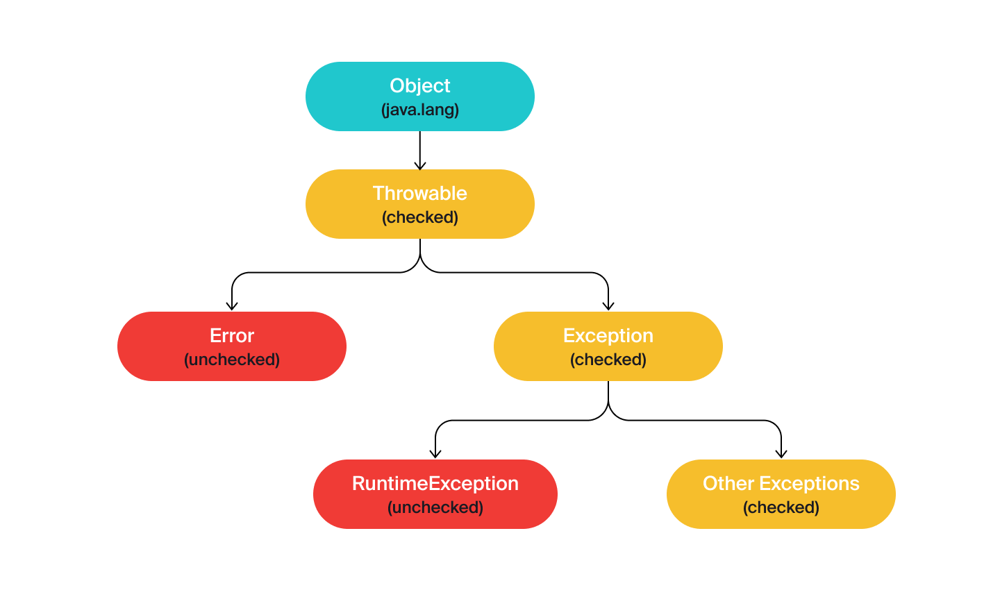

Группа `Exception` охватывает основную часть исключений. В неё входят ошибки при работе
с файлами и сетью, сбои взаимодействия с базами данных и другие.
Кроме того, от `Exception` идёт ветвь исключений с особым поведением — `RuntimeException`
(от англ. _runtime_ — «выполнение, исполнение»). К ним относятся выход за пределы массива
или неверно переданные данные в метод, ошибки при арифметических операциях
(например, деление на ноль) и обращения к неинициализированным объектам.

Группа `Error` — это классы, описывающие критические ошибки, которые в большинстве случаев
создают аварийную ситуацию и требуют перезапуска программы. Именно в результате исключений
`Error` пользователь сталкивается с сообщением типа «Извините, произошла непредвиденная ошибка!!!».
Это могут быть сбои из-за нехватки памяти —
`OutOfMemoryError` (от англ. _out of memory_ — «за пределами памяти») или проблемы
с JVM — `VirtualMachineError`.

### Проверяемые и непроверяемые

Все исключения делятся на два типа: **проверяемые** (англ. _checked_) и **непроверяемые** (англ. _unchecked_).

**Проверяемые исключения** — это исключения, обработка которых обязательна и
является частью логики приложения. К примеру, программист может предусмотреть,
что вместо числа будет передана строка, и настроить повторный запрос данных для такого случая.
Или же пользователь введёт некорректный адрес интернет-ресурса и система не может его распознать.

> К проверяемым относятся исключения, наследуемые напрямую от `Throwable`,
> а также исключения класса `Exception` и его наследников,
> кроме ветви `RuntimeException`.
> Исключения `RuntimeException` ведут себя по-другому и относятся к непроверяемым.

Таким образом, проверяемые исключения — это те, **которые ожидаемо могут случиться**:
программист эту вероятность должен учесть и написать код, который их обрабатывает.
Если не настроить обработку проверяемых исключений, то программа не скомпилируется.

```java
public class Practicum {
    public static void main(String[] args) {
        parseUrl("httpasdas");
    }

    public static java.net.URL parseUrl(final String input) {

        /* Код не скомпилируется, потому что конструктор класса генерирует 
        проверяемое исключение MalformedURLException. */

        return new java.net.URL(input);
    }
}
```

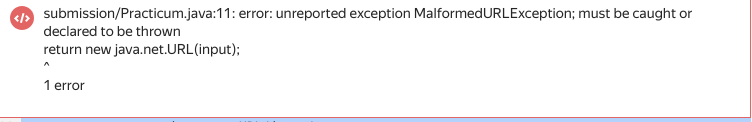

Сообщение об ошибке будет примерно таким — `java: unreported exception
java.net.MalformedURLException; must be caught or declared to be thrown.`
Компилятор сообщает, что исключение `MalformedURLException`
должно быть «отловлено или объявлено выброшенным».

> К непроверяемым исключениям относятся те ошибки и нештатные ситуации,
> которые не были предусмотрены логикой
> программы и их обработка необязательна. Это исключения `Error` и ветвь `RuntimeException`.

В большинстве случаев при непроверяемых исключениях работа программы немедленно прекращается.
Например, разработчик так написал код, что программа начала бесконечно вызывать какой-то метод и переполнила стек
вызовов. Или забыл
создать объект, но попытался вывести его состояние на экран — в итоге ошибка заблокирует
работу приложения.

Поскольку разработчики заранее не обрабатывают непроверяемые исключения, если программа их выбросит, то пользователь
может увидеть какое-то странное сообщение.
Код с непроверяемым исключением успешно скомпилируется, но при выполнении упадёт с ошибкой:

```java
public class Practicum {
    public static void main(String[] args) {
        print(null);
    }

    private static void print(final Object object) {
        // Код скомпилируется, но непроверяемое исключение NullPointerException нарушит его работу.
        System.out.println(object.toString());
    }
}
```

К слову, `NullPointerException` — это, наверное, наиболее часто встречающееся исключение.
`NullPointerException` вездесуще и обязательно настигнет вас.

Определить, к какому из типов относится то или иное исключение, можно либо по иерархии классов,
либо по их поведению в коде. Главное запомнить, что проверяемые обязательны к обработке,
а непроверяемые
можно как обрабатывать за счёт добавления новой логики,
так и нет — решать проблемы по мере поступления.

### Самые распространённые исключения в Java

Типов исключений очень много.


#### Непроверяемые исключения, которые наследуют от Error.

| Название            | Описание                                                                                                                          |
|---------------------|-----------------------------------------------------------------------------------------------------------------------------------|
| VirtualMachineError | Базовые ошибки JVM, связанные с тем, что исчерпаны ресурсы или обнаружены повреждения.                                            |
| OutOfMemoryError	   | Производный класс от VirtualMachineError, который показывает ошибки из-за нехватки памяти.                                        |
| StackOverflowError  | Производный класс от VirtualMachineError, показывает переполнение стека из-за того, что метод слишком много раз вызывал сам себя. |
| AssertionError      | Ошибка утверждения.                                                                                                               |
| IOError             | Исключение, которое происходит при серьёзных ошибках ввода-вывода.                                                                |
| ThreadDeath         | Возникает при вызове метода Thread.stop() у потока.                                                                               |

#### Проверяемые исключения, которые наследуют от Exception.

| Название              | Описание                                                                                                                                         |
|-----------------------|--------------------------------------------------------------------------------------------------------------------------------------------------|
| IOException           | Это базовый класс проверяемых исключений ввода-вывода.                                                                                           | 
| EOFException          | Исключение, которое сигнализирует о внезапном достижении конца файла или потока.                                                                 | 
| FileNotFoundException | Файл по указанному пути не существует.                                                                                                           | 
| FileSystemException   | Базовый класс для исключений файловой системы, таких как ошибка доступа, попытка создать уже существующий файл или удалить не пустую директорию. | 
| MalformedURLException | Неверный синтаксис при создании класса ссылки из строки.                                                                                         | 
| SocketException       | Ошибки при создании/обрыве соединения по сокету.                                                                                                 | 
| UnknownHostException	 | Невозможность определить IP-адрес узла по доменному имени.                                                                                       | 
| SQLException          | Ошибки при работе с базой данных.                                                                                                                | 
| TimeoutException	     | Исключение — происходит у методов, у которых ограничено выполнение по времени.                                                                   | 
| URISyntaxException    | Неверный формат универсального идентификатора ресурсов.                                                                                          | 

#### Непроверяемые исключения, которые унаследованы от RuntimeException.

| Название                      | Описание                                                                                    |
|-------------------------------|---------------------------------------------------------------------------------------------|
| ArithmeticException           | Исключения при арифметических операциях, например деление на 0.                             |
| IllegalArgumentException      | Возникает при неверно переданных в метод или конструктор параметрах.                        |
| IndexOutOfBoundsException     | Исключение при выходе за заданный диапазон.                                                 |
| NoSuchElementException        | Данного элемента больше не существует в перечислении.                                       |
| NullPointerException          | Приложение пытается использовать null в том месте, где требуется инициализированный объект. |
| UnsupportedOperationException | Операция не поддерживается вызываемым объектом.                                             |
| ClassCastException            | Невозможность привести объект к заданному типу.                                             |


</details>

<details>

<summary>Анатомия стек-трейса</summary>

## Анатомия стек-трейса

Если в программе не настроена обработка исключений, то в результате сбоя в терминале появится 
длинное сообщение об ошибке. В нём содержится ключевая информация, что за исключение произошло, 
где и почему. Такое сообщение называется **stack trace** (англ. «след стека») — или **стек-трейс**. 
В этом уроке расскажем, из чего состоят стек-трейсы и как их читать. 


Что такое стек

**Стек** — это структура данных, которая реализована по принципу **_lаst in, first out**_ 
(англ. «последний зашёл, первый вышел») или сокращённо **LIFO**. Это означает, что элемент, 
который добавлен в стек последним, будет взят первым. 

Посмотрим на примере. Представьте, посетители читального зала перед уходом должны вернуть взятую книгу 
— положить на стол библиотекарю. В итоге образуется стопка книг. 
Выше всего в этой стопке будет лежать книга того, кто ушёл последним, и именно её библиотекарь
первой поставит на место. 
А вот книга, сданная первой, наоборот, вернётся на свою полку последней. Именно так работает стек. 


### Внутри стек-трейса

Последовательность действий при выполнении программы обрабатывается внутри 
JVM как раз в виде стека. Каждый вызов метода при выполнении программы записывается 
как элемент класса `StackTraceElement`. Когда выполнение метода завершается, информация о нём удаляется из стека.

Если исключение прерывает работу программы, то один или несколько методов  
не могут завершиться и информация о них остаётся в памяти JVM в виде массива `StackTraceElement[]`. 
Перед тем как завершить программу, JVM печатает содержимое этого массива. 
Посмотрим, как это происходит на примере. Запустите такой код.

```java
public class Practicum {
    public static void main(String[] args) { // вызов main
        calculate1(); // вызов calculate1() 
    }

    public static void calculate1() {
        calculate2();  // вызов calculate2()
    }

    public static void calculate2() {
        calculate3(); // вызов calculate3()
    }

    public static void calculate3() {
        calculate4(); // вызов calculate4()
    }

    public static void calculate4() {
        System.out.println(10 / 0); // исключение - методы не могут завершить работу
    }
}
```

Из-за деления на ноль в методе `calculate4()` произошло исключение. В терминале мы видим его стек-трейс.

```java
Exception in thread "main" java.lang.ArithmeticException: / by zero
    at Practicum.calculate4(Practicum.java:19)
    at Practicum.calculate3(Practicum.java:15)
    at Practicum.calculate2(Practicum.java:11)
    at Practicum.calculate1(Practicum.java:7)
    at Practicum.main(Practicum.java:3) 
```

В первой строке стек-трейса сообщается базовая информация. 
О том, что исключение произошло в главном потоке — `Exception in thread "main"`, 
его тип `ArithmeticException` и описание / `by zero` — «деление на ноль». 

Затем в обратном порядке (так как мы имеем дело со стеком) идёт история вызовов методов — первым будет идти метод, 
где завершилось выполнение программы. При этом указывается класс каждого метода, его файл и местоположение в нём.

В нашем примере, перед тем, как произошла ошибка, был вызван метод `calculate4()` в классе `Practicum` на строке 
19 в файле `Practicum.java`, перед ним `calculate3()` в классе `Practicum` на строке 
15 также в файле `Practicum.java` и так далее. Первым был запущен метод `main` — информация о нём, 
соответственно, на последней строке.

</details>


<details>

<summary>Обработка исключений</summary>

## Обработка исключений

Чтобы контролировать реакцию программы на ошибки в ходе её выполнения,
нужно настроить в коде **обработку исключений**. В этом уроке научим вас, как это сделать. 


### Когда нужна обработка исключений

Изучите следующий код. Сейчас он отработает без ошибок.

```java
class IntegerConverter {
    public static int convert(final String input) {
        return Integer.parseInt(input, 10);
    }
}

public class Practicum {
    public static void main(String[] args) {
        System.out.println(IntegerConverter.convert("10"));
    }
}
```

Но если передать в метод `convert(final String input)` некорректную строку — возникнет исключение.

```java
class IntegerConverter {
    public static int convert(final String input) {
        return Integer.parseInt(input, 10);
    }
}

public class Practicum {
    public static void main(String[] args) {
        System.out.println(IntegerConverter.convert("10"));
        System.out.println(IntegerConverter.convert("abc10"));
    }
}

```

В терминале появится стек-трейс: `Exception in thread "main" java.lang.NumberFormatException: 
For input string: "abc10"` — англ. «Исключение в потоке `"main"` типа `NumberFormatException` 
для входной строки: `"abc10"`». 
Ошибка произошла, так как переданная строка `"abc10"` содержит не только цифры, но и буквы.
Перед нами **непроверяемое исключение** — компилятор заранее не подскажет, 
что тут может случиться ошибка. Однако можно добавить в код его обработку. 

### Конструкция try — catch

Для обработки исключений существует специальная конструкция из ключевых слов `try` (англ. «пробовать, пытаться») 
и `catch` (англ. «ловить»). В `try` передаётся код, из-за которого может произойти исключение. 
В `catch` в качестве аргумента — тип ошибки, а в тело — код, 
который выполнится, если произойдёт исключение, указанное в `try`. В коде `try` — `catch` выглядит так:

```java
try {
    ... // код, из-за которого может произойти исключение
} catch (Throwable throwable) { // параметр - тип возможного исключения
    // код, который выполнится, если произойдёт исключение указанного типа
}
```

Обработка исключения настраивается исходя из логики программы. Например, её можно добавить в тело метода. 
В случае ошибки при этом можно настроить возврат какого-то значения по умолчанию.

```java
class IntegerConverter {
    public static int convert(final String input) {
        try {
            return Integer.parseInt(input, 10); // если исключения нет - вернётся число
        } catch (Throwable exception) { 
            return 0; // если поймано исключение - вернётся 0
        }
    }
}

public class Practicum {
    public static void main(String[] args) {
        System.out.println(IntegerConverter.convert("10"));
        System.out.println(IntegerConverter.convert("abc10"));
    }
}

```

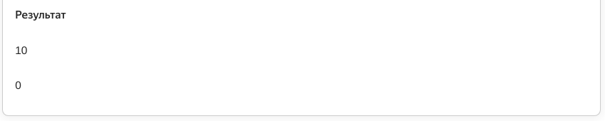

Плюс такого подхода в том, что в любом случае вернётся значение, 
с которым можно работать. Минус в том, что не получится определить, 
где нулевое значение возникло в результате исключения, а где было передано в метод. 

Другой вариант — добавить обработку исключения в тот метод, 
который вызывает код, где оно может произойти. Например, в метод `main`.


```java
class IntegerConverter {
    public static int convert(final String input) { 
        return Integer.parseInt(input, 10);
    }
}

public class Practicum {
    public static void main(String[] args) { 
        try {
            System.out.println(IntegerConverter.convert("10")); // печатаем число
        } catch (Throwable exception) {
            // или выводим сообщение об ошибке
            System.out.println("Строка для преобразования не является целым числом.");
        }
        try {
            System.out.println(IntegerConverter.convert("abc10"));
        } catch (Throwable exception) {
            System.out.println("Строка для преобразования не является целым числом.");
        }
    }
}
```

Нельзя сказать, что тот или иной вариант лучше или хуже. 
Поэтому логика обработки исключений через блок `try — catch` остаётся на выбор разработчика. 

Какой код будет внутри блоков `catch` — тоже решает сам разработчик.
Можно уведомить пользователя об ошибке, попросить его подождать, 
повторить попытку или выйти. Чаще всего с помощью `catch` принято отображать 
или сохранять информацию об ошибке. 

### Множественный catch

До этого момента мы использовали в `catch` тип параметра `Throwable`. Это позволяло нам сразу обрабатывать 
все исключения, производные от него.
То есть `catch` ловил все ошибки, которые могли бы произойти в `try`, включая ошибки `JVM`. Кажется, 
что так можно создать универсальный обработчик исключений. Однако запустим код с такой обработкой ещё раз.

```java
import java.net.URI;

public class Practicum {
    public static void main(String[] args) {
        System.out.println(parseStringToUri("https://ya.ru"));
        System.out.println(parseStringToUri(null));
        System.out.println(parseStringToUri(":/"));
    }

    public static URI parseStringToUri(final String input) {
        try {
            return new URI(input);
        } catch (Throwable exception) {
            System.out.println("Произошла ошибка!");
        }
        return null;
    }
}
```

При любом исключении мы теперь всегда видим одно и то же сообщение — `Произошла ошибка!`, 
однако ошибки при этом могут отличаться.
К примеру, в первом случае возникает исключение `NullPointerException` — строка не инициализирована, 
а во втором `URISyntaxException` — строка не может быть преобразована в идентификатор. 
Однако при использовании общей обработки с типом `Throwable` не получится узнать, что конкретно 
пошло не так и как это можно исправить.

Чтобы обрабатывать разные типы исключений, которые может сгенерировать метод или конструктор,
нужно добавить несколько блоков `catch`. Каждый из них будет отвечать за конкретное исключение 
и выдавать соответствующий ответ для него.

```java
import java.net.URI;
import java.net.URISyntaxException;

public class Practicum {
    public static void main(String[] args) {
        System.out.println(parseStringToUri("https://ya.ru"));
        System.out.println(parseStringToUri(null));
        System.out.println(parseStringToUri(":/"));
    }

    public static URI parseStringToUri(final String input) {
        try {
            return new URI(input);
        } catch (URISyntaxException exp) { // ловим исключение URISyntaxException
            System.out.println("Ошибка: неверный синтаксис URI!");
        } catch (NullPointerException exp) { // ловим исключение NullPointerException
            System.out.println("Ошибка: передан неинициализированный объект!");
        }
        return null;
    }
}
```

Теперь гораздо понятнее, где какая произошла ошибка. Это позволит быстрее исправить её. 
Если же отлавливать исключения по параметру `Throwable` 
или даже `Exception` — то придётся перебирать множество вариантов — от неправильного ввода до переполненной памяти.

--- 

Даже такая простая операция, как добавление нового элемента в хеш-таблицу может сгенерировать исключение. 
Чтобы было понятно, что пошло не так — добавим обработку конкретных исключений.
Для NullPointerException выведите текст — «Реализация не поддерживает неинициализированные объекты.».
Для UnsupportedOperationException — сообщение «Реализация не поддерживает добавление новых объектов.».

```java
import java.util.HashMap;
import java.util.Map;
import java.util.TreeMap;

public class Practicum {
    public static void main(String[] args) {
        System.out.println(addToMap(new HashMap<>(), "test", "test"));
        System.out.println(addToMap(new HashMap<>(), null, null));

        System.out.println(addToMap(new TreeMap<>(), "test", "test"));
        System.out.println(addToMap(new TreeMap<>(), null, null));

        System.out.println(addToMap(Map.of(), "test", "test"));
    }

    public static Map<String, Object> addToMap(final Map<String, Object> storage, 
                                               final String key, final Object value) {
        
       try {
            storage.put(key, value);
            
        } catch (NullPointerException exp) { // ловим исключение URISyntaxException
            System.out.println("Реализация не поддерживает неинициализированные объекты.");
        } catch (UnsupportedOperationException exp) { // ловим исключение NullPointerException
            System.out.println("Реализация не поддерживает добавление новых объектов.");
        }
        catch (Throwable exception) {
            return null;
        }
      return storage;
    }
}
```

### Порядок обработки исключений

При обработке исключений важно соблюдать правильную последовательность. 
Сначала обрабатываются исключения в классах-наследниках,
а только потом родительские. 

Например, исключение `ClassCastException` является дочерним от `RuntimeException`, 
который наследуется от базового Exception. В таком порядке их и нужно поместить 
в блоки catch. Код, где нарушен порядок обработки исключений, не будет скомпилирован.

```java

class Practicum {
    public static void main(String[] args) {
        System.out.println(convertToString(0));
    }

    private static String convertToString(Object x) {
        try {
            return (String) x;
        } catch (Exception e) {
            System.out.println("Произошла неизвестная ошибка");
        } catch (RuntimeException e) {
            System.out.println("Ошибка во время выполнения");
        } catch (ClassCastException e) {
            System.out.println("Некорректное приведение типов");
        }
        return null;
    }
}
```

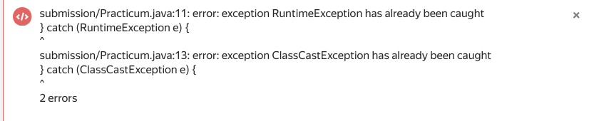

д
Корректный порядок будет таким — сначала `ClassCastException`, потом — `RuntimeException`, в конце – `Exception`.

```java
class Practicum {
    public static void main(String[] args) {
        System.out.println(convertToString(0));
    }

    private static String convertToString(Object x) {
        try {
            return (String) x;
        } catch (ClassCastException e) {
            System.out.println("Некорректное приведение типов");
        } catch (RuntimeException e) {
            System.out.println("Ошибка во время выполнения");
        } catch (Exception e) {
            System.out.println("Произошла неизвестная ошибка");
        }
        return null;
    }
}

```

### Объединение исключений с одинаковым выводом

Часто требуется совместить два типа исключений, если инструкции для них являются одинаковыми. 
Сделать это можно в блоке catch с помощью символа `|`.
Например, вот такой код:

```java
import java.util.ArrayList;

public class Practicum {
    public static void main(String[] args) {
        try {
            new ArrayList<String>().add("1");
        } catch (UnsupportedOperationException exception) {
            System.out.println("Возникла ошибка, свяжитесь с нами!");
        } catch (IllegalArgumentException exception) {
            System.out.println("Возникла ошибка, свяжитесь с нами!");
        }
    }
}
```

Можно оптимизировать так:

```java
import java.util.ArrayList;

public class Practicum {
    public static void main(String[] args) {
        try {
            new ArrayList<String>().add("1");
        } catch (UnsupportedOperationException | IllegalArgumentException exception) {
            System.out.println("Возникла ошибка, свяжитесь с нами!");
        }
    }
} 
```

</details>

<details>

## Получаем информацию об исключении в блоке catch

Стек-трейс появляется, если в коде не настроена обработка исключений. Если же ошибка поймана 
с помощью блока `try — catch`, то выполнится код в блоке `catch` и никакой информации об ошибке
в терминале не будет. В этом случае, чтобы найти ошибку и внести правки в код, нужно самостоятельно 
получить информацию об исключении. Это можно сделать с помощью методов классов 
`Throwable` и `StackTraceElement`. 

### Методы printStackTrace()

Самый простой способ получить сразу всю информацию об ошибке — 
вызвать метод `printStackTrace()` класса `Throwable`. 
Допустим, в коде настроена такая обработка ошибок.


```java
public class PrintStackTraceExample {
    public static void main(String[] args) {
        try {
            calculate();
        } catch (ArithmeticException exception) {
            System.out.println("Произошла ошибка!"); // непонятно, что за ошибка и где
        }
    }

    public static int calculate() {
        return 10 / 0;
    }
}
```
Из вывода в блоке catch непонятно, что произошло. 
Заменим печать на вызов метода `printStackTrace()`.

```java
public class PrintStackTraceExample {
    public static void main(String[] args) {
        try {
            calculate();
        } catch (ArithmeticException exception) {
            exception.printStackTrace(); // будет выведен стек-трейс ошибки
        }
    }

    public static int calculate() {
        return 10 / 0;
    }
}
```

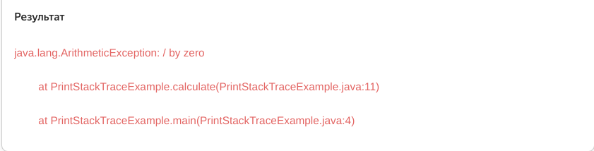

Теперь на экран будет выведена информация об обработанной ошибке. 
Так исключение будет легче найти и исправить.

### Метод getMessage()

Можно также получить в `catch` короткое сообщение с описанием ошибки, 
например такое — `/ by zero`. Для этого понадобится другой метод `Throwable` — `getMessage()`.

```java
public class GetMessageExample {
   public static void main(String[] args) {
        try {
            calculate();
        } catch (ArithmeticException exception) {
            System.out.println(exception.getMessage());
        }
    }

    public static int calculate() {
        return 10 / 0;
    }
}
```

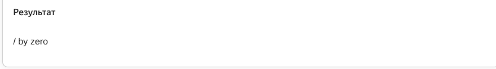

Из такого вывода `catch` можно понять, что за ошибка произошла, но не видно её причину и местоположение. 

Использовать вызов `getMessage()` можно, только если при генерации 
исключений были использованы конструкторы `Throwable` с параметром `String message`. 
То есть в исключение была передана короткая информация `message` с его описанием. 
Если такого сообщения нет — то вызов `getMessage()` вернёт `null`. 
Поэтому лучше не использовать результат `getMessage()`, например для сравнения с помощью `equals()`.
Иначе можно получить ещё одно исключение, на этот раз `NullPointerException`.

```java
class GetMessageExampleEqualsException {
    public static void main(String[] args) {
        try {
            System.out.println(parseIntegerWithOffset("19"));
        } catch (Exception exception) {
            if (exception.getMessage().equals("out of bounds")) { // getMessage возвращает null
                System.out.println("Произошёл выход за границы!");
            }
        }
    }

    public static int parseIntegerWithOffset(String input) {
        return Integer.parseInt(input, 10, 12, 10);
    }
}
```

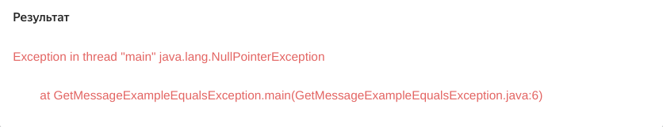

В исключении `IndexOutOfBoundsException` нет короткого описания ошибки `message`, 
поэтому вызов `getMessage()` для него возвращает `null`. В итоге при сравнении с помощью `equals()` 
выбрасывается `NullPointerException`. 
Лучше избегать такого использования `getMessage()` и по возможности обрабатывать конкретное исключение.

### getStackTrace() и методы StackTraceElement

Доступ к информации, которую выводит на экран `printStackTrace()`, предоставляет другой метод 
класса `Throwable` — `getStackTrace()`. В частности, `getStackTrace()` 
возвращает массив элементов, представленных классом `StackTraceElement`. 
С помощью сочетания `getStackTrace()` и методов класса `StackTraceElement` можно упростить поиск исключения
и получить только определённую информацию о нём в нужном формате. 

В `StackTraceElement` нас интересуют несколько методов. Это методы:
* `getClassName()` — 
он возвращает название класса, где произошло исключение
* `getMethodName()` — позволяет 
получить имя вызванного при этом метода
* `getFileName()` — подскажет имя файла, 
* `getLineNumber()` — отобразит номер линии в файле. 

Есть и другие методы с похожей функциональностью — их можно посмотреть 
в [документации](https://docs.oracle.com/en/java/javase/21/docs/api/java.base/java/lang/StackTraceElement.html) или увидеть в подсказке IDEA.

Связка `getStackTrace()` и методов `StackTraceElement` работает так.

> После того как метод `getStackTrace()` возвращает массив данных об исключении, 
можно пройтись по нему циклом, чтобы отобразить нужную информацию с помощью методов 
`StackTraceElement`. Например, вот так.

```java
public class StackTraceExample {
public static void main(String[] args) {
        try {
            calculate1();
        } catch (ArithmeticException exception) {
            for (StackTraceElement stack : exception.getStackTrace()) {
                System.out.println(String.format("Класс: " + stack.getClassName() + ", " +
                        "метод: " + stack.getMethodName() + ", " +
                        "имя файла: " + stack.getFileName() + ", " +
                        "строка кода: " + stack.getLineNumber()));
            }
        }
    }

    public static void calculate1() {
        calculate2();
    }

    public static void calculate2() {
        System.out.println(10 / 0);
    }
}
```

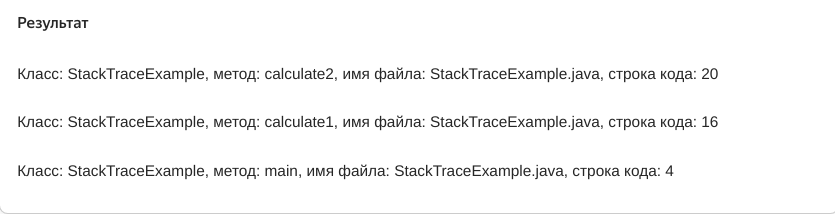

В итоге мы и обработали ошибки, и получили её стек-трейс. 
Вывод можно отформатировать как угодно, в том числе и аналогично стек-трейсу необработанного исключения.

</details>

<details>

<summary>Создаём своё исключение</summary>

## Создаём своё исключение

В стандартной библиотеке Java описано множество исключений — начиная от ошибок при работе 
с файлами и сетью и критических сбоев JVM и заканчивая невалидными аргументами. 
Но число проблемных ситуаций, с которыми разработчик может столкнуться 
в реальной практике ещё больше. Поэтому в Java есть возможность создания собственных исключений.


### Как написать своё исключение

Исключение создаётся точно так же, как и любой другой объект в `Java` — через класс.
Только класс исключения в обязательном порядке должен быть наследником `Throwable` или его потомков.
Например, создадим свой класс `InputException` для исключений при выборе 
пользователями некорректного формата ввода данных.

```java
public class InputException extends Exception {
}
```

Созданное нами исключение наследует от `Exception`, 
а его суперклассом будет `Throwable`. Значит, при генерации `InputException` 
будет выбрасываться проверяемая ошибка — в логике кода нужно обязательно предусмотреть её обработку. 

У суперкласса всех исключений Throwable четыре публичных конструктора. 
* `Throwable()` — без параметров,
* `Throwable(String message)` — с передачей короткого описания ошибки, 
* `Throwable(String message, Throwable cause)` — с передачей текста об ошибке и информации о её причине, 
* `Throwable(Throwable cause)` — только с информацией о причине.

Чтобы использовать 
их в вашем классе исключения, их нужно переопределить.

```java
public class InputException extends Exception {
    public InputException() {
    }

    public InputException(final String message) {
        super(message);
    }

    public InputException(final String message, final Throwable cause) {
        super(message, cause);
    }

    public InputException(final Throwable cause) {
        super(cause);
    }
}
```

Здесь для примера переопределены сразу все четыре конструктора — 
однако можно оставить только те, которые нужны для целей вашей программы, или добавить любые свои. 

### Ключевое слово throw

Только создать и описать исключение недостаточно — нужно сообщить о нём JVM. 
Для этого служит ключевое слово `throw` (англ. «бросать, выбрасывать») — оно позволяет 
сгенерировать исключение. Это происходит с помощью создания экземпляра класса исключения
с нужными параметрами.


```java
 throw new UserInputException("Ошибка ввода!"); // сгенерировали исключение
```

Если с помощью `throw` генерируется проверяемое исключение,
то нужно сразу настроить его обработку. Это будет выглядеть так. 

```java
try {
    if (...) { // если возникла определённая ситуация
        throw new ThrowableClass(parameters); // сгенерировали исключение   
    }
}
catch (ThrowableClass e) {
    // настроили обработку исключения, сгенерированного в try
}
```

При генерации исключения можно использовать любой доступный конструктор класса. 
Удобнее всего передавать
в качестве параметра сообщение об ошибке, которое `catch` потом
сможет вернуть с помощью метода `getMessage()`.

### Добавляем в код своё исключение и настраиваем его обработку

Разберём на примере, как добавить в код собственное исключение и настроить его обработку.
Допустим, есть метод `printRangeInteger(final String inputString, final int from, final int to)`. 
Он принимает на вход строку, которую должен преобразовать в целое число, а также диапазон значений 
от `from` до `to`, 
внутри чего должно быть это число. 
Сейчас в методе не настроена обработка исключений. Запустите его.

```java
public class Practicum {
    public static void main(String[] args) {
        printRangeInteger("10", 0, 100);
        printRangeInteger("-10", 0, 100);
        printRangeInteger("110", 0, 100);
        printRangeInteger("abc", 0, 100);
    }

    public static void printRangeInteger(final String inputString, final int from, final int to) {
        final int input = Integer.parseInt(inputString);
        System.out.println(input);
    }
}
```

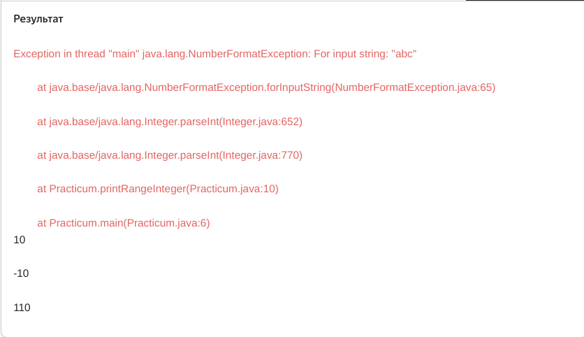

Из-за того, что в метод была передана строка с буквами вместо цифр, 
программа выбросила исключение `NumberFormatException`. 
Для начала нужно добавить его обработку.

```java
public class Practicum {
    public static void main(String[] args) {
        printRangeInteger("10", 0, 100);
        printRangeInteger("-10", 0, 100);
        printRangeInteger("110", 0, 100);
        printRangeInteger("abc", 0, 100);
    }

    public static void printRangeInteger(final String inputString, final int from, final int to) {
        try {
            final int input = Integer.parseInt(inputString);
            System.out.println(input);
        } catch (NumberFormatException exception) {
            System.out.println("Ошибка ввода - введено не число!");
        }
    }
}
```
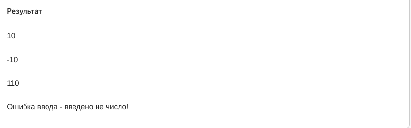

Теперь код не выбрасывает исключение, однако печатает числа за пределами диапазона. 
Как раз в таком случае нам понадобится собственное исключение. 

```java
class InputException extends Exception {
    public InputException() {
    }

    public InputException(final String message) {
        super(message);
    }
}
```

Теперь добавим его обработку. В случае если переданное число выходит за нижнюю границу диапазона, 
сгенерируем исключение с текстом `"Введённое число слишком маленькое!"`, а если 
за верхнюю — `"Введённое число слишком большое!"`. 
А также добавим второй блок `catch` с вызовом метода `getMessage()`.

```java
public class Practicum {
    public static void main(String[] args) {
        printRangeInteger("10", 0, 100);
        printRangeInteger("-10", 0, 100);
        printRangeInteger("110", 0, 100);
        printRangeInteger("abc", 0, 100);
    }

    public static void printRangeInteger(final String inputString, final int from, final int to) {
        try {
            final int input = Integer.parseInt(inputString);
            if (input < from) {
                throw new InputException("Введённое число слишком маленькое!");
            }
            if (input > to) {
                throw new InputException("Введённое число слишком большое!");
            }
            System.out.println(input);
        } catch (NumberFormatException exception) {
            System.out.println("Ошибка ввода - введено не число!");
        } catch (InputException exception) {
            System.out.println(exception.getMessage());
        }
    }
}

class InputException extends Exception {
    public InputException() {
    }

    public InputException(final String message) {
        super(message);
    }
}
```

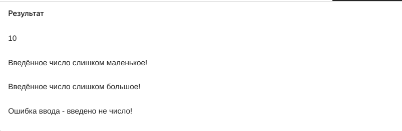

### Прокачиваем своё исключение

Не стоит забывать, что исключение — это обычный класс, в него можно добавлять любые другие методы, 
поля и конструкторы. Расширим класс `InputException`. 
Добавим в него новое поле для хранения неправильно введённого числа и метод `getDetailMessage()`,
который будет возвращать строку следующего формата: 
`сообщение, переданное в исключение` + `=` + в`веденное неверно число`. 
Код класса исключения получится таким:

```java
public class InputException extends Exception {
    private final int inputValue;

    public InputException(final String message, final int inputValue) {
        super(message);
        this.inputValue = inputValue;
    }

    public String getDetailMessage() {
        return getMessage() + " = " + inputValue;
    }
}
```

Теперь при исключении можно будет увидеть не только сообщение об ошибке,
но и то число, которое ввёл пользователь.

```java
public class Practicum {
    public static void main(String[] args) {
        printRangeInteger("10", 0, 100);
        printRangeInteger("-10", 0, 100);
        printRangeInteger("110", 0, 100);
        printRangeInteger("abc", 0, 100);
    }

    public static void printRangeInteger(final String inputString, final int from, final int to) {
        try {
            final int input = Integer.parseInt(inputString);
            if (input < from) {
                throw new InputException("Введённое число слишком маленькое!", input);
            }
            if (input > to) {
                throw new InputException("Введённое число слишком большое!", input);
            }
            System.out.println(input);
        } catch (NumberFormatException exception) {
            System.out.println("Ошибка ввода - введено не число!");
        } catch (InputException exception) {
            System.out.println(exception.getDetailMessage());
        }
    }
}

class InputException extends Exception {
    private final int inputValue;

    public InputException(final String message, final int inputValue) {
        super(message);
        this.inputValue = inputValue;
    }

    public String getDetailMessage() {
        return getMessage() + " = " + inputValue;
    }
}
```

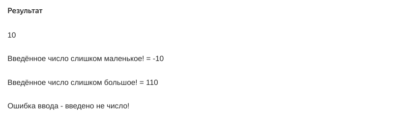

Можно добавить и любые другие параметры. Главное учесть, что работать с ними можно только тогда,
когда в коде настроена обработка созданного вами исключения.

</details>

<details>

<summary>Ключевое слово-предупреждение throws</summary>

## Ключевое слово-предупреждение throws

Чтобы сообщить компилятору, что метод или конструктор может сгенерировать исключение, 
в Java используется **ключевое слово** `throws`. Разберём, как с ним работать. 

Ключевое слово `throws` созвучно слову `throw`. Однако если `throw` даёт команду
сгенерировать исключение, то `throws` обозначает, что метод генерирует исключение 
— то есть внутри него как раз может быть использовано `throw`. 
Слова `throw` и `throws` — это один и тот же английский глагол ”кидать, выбрасывать”.

### throws в коде

`throws` указывают после круглых скобок метода, который может выбросить исключение.
После него через пробел идёт имя класса этого исключения. 

```java
public void methodWithException() throws FirstException {
     // какой-то код
    if (какое-то условие) {
        throw new FirstException(); // сгенерировать исключение
    }
    // какой-то код
}
```

Такая запись в коде означает, что метод `methodWithException()` 
может сгенерировать исключение `FirstException`. 

Конструктор класса — это тоже по сути метод, который инициализирует класс,
и он может вызывать методы, способные сгенерировать исключение.
Поэтому `throws` может использоваться и в конструкторах. 

```java
public class PositivePoints {
    private final int positionX;
    private final int positionY;
    
    public PositivePoints(final int positionX, final int positionY) throws IllegalArgumentException {
        if (positionX < 0 || positionY < 0) {
            throw new IllegalArgumentException();
        }
        this.positionX = positionX;
        this.positionY = positionY;
    }

    public int getPositionY() {
        return positionY;
    }

    public int getPositionX() {
        return positionX;
    }
}
```

### throws и обработка исключений

В первую очередь `throws` используют для указания проверяемых исключений, 
так как их обработка обязательна и является частью логики приложения. Когда 
мы вызываем метод, в котором есть указание на проверяемое исключение с 
помощью `throws`, есть два варианта, как действовать дальше:

* Обернуть этот метод в `try...catch` и добавить логику по обработке 
или выводу информации об ошибке.

* Переадресовать обработку исключения вызывающему методу или JVM. 
Для этого нужно добавить `throws` с указанием исключения, которое может произойти,
в тот метод, что вызывает метод с `throws`. В этом случае обработку 
этого исключения возьмёт на себя вызывающий метод или же JVM, 
если это точка запуска программы.

Разберём второй вариант на примере. Изучите код ниже.

```java
import java.util.Scanner;

class Practicum {
    // сообщаем JVM, что метод main вызывает метод, который может выбросить исключение
    public static void main(String[] args) throws NumberShouldBePositiveException {
        System.out.println(getPositiveInteger("10"));
        System.out.println(getPositiveInteger("-10"));
    }

    public static int getPositiveInteger(final String input) 
            throws NumberShouldBePositiveException { // метод выбрасывает исключение
        int value = Integer.parseInt(input);
        if (value < 0) {
            throw new NumberShouldBePositiveException();
        }
        return value;
    }
}

class NumberShouldBePositiveException extends Exception {
}
```

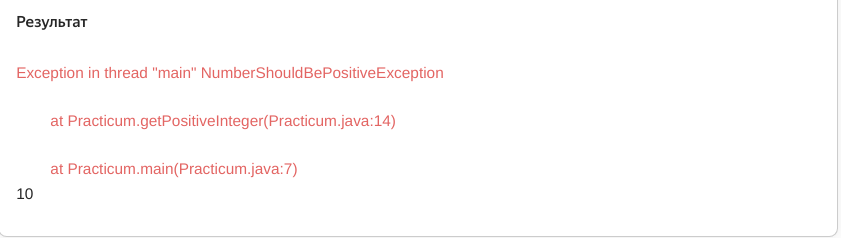

Метод main вызывает метод `getPositiveInteger()`, который может выбросить 
исключение `NumberShouldBePositiveException`. Поскольку мы не добавляем 
в код обработку этого исключения, то добавим указание на него в метод в main.
Обработку исключения в таком случае возьмёт на себя JVM.

Также синтаксис Java позволяет указать после throws несколько типов исключений через запятую, если код метода может их выбросить.

```java
class Practicum {
    public static void main(String[] args) {
        try {
            System.out.println(getPositiveInteger("10"));
            System.out.println(getPositiveInteger("abc"));
        } catch (NumberShouldBePositiveException e) {
            System.out.println("Число должно быть положительным");
        } catch (IncorrectInputStringException e) {
            System.out.println("Необходимо ввести число");
        }
    }

    public static int getPositiveInteger(final String input)
            // указываем исключения через запятую
            throws NumberShouldBePositiveException, IncorrectInputStringException {
        try {
            int value = Integer.parseInt(input);
            if (value < 0) {
                throw new NumberShouldBePositiveException();
            }
            return value;
        } catch (NumberFormatException exception) {
            throw new IncorrectInputStringException();
        }
    }
}

class NumberShouldBePositiveException extends Exception {
}

class IncorrectInputStringException extends Exception {
}
```

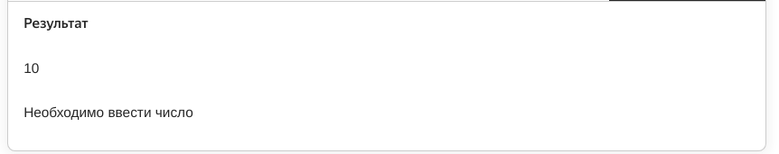

Если проверяемые исключения всегда должны быть отмечены с помощью `throws`, 
то для непроверяемых исключений это необязательно, так как они представляют 
собой ситуацию «у нас всё сломалось», которую невозможно предугадать.
Однако указание непроверяемых исключений 
с помощью `throws` является хорошим тоном, потому что помогает сразу определить их.

</details>

<details>

<summary>finally — продвинутая обработка исключений</summary>

## finally — продвинутая обработка исключений

При работе с исключениями может возникнуть ситуация, когда необходимо 
выполнить какое-то действие вне зависимости от того, произошло ли обрабатываемое 
исключение или нет. В этом случае к блокам `try` и `catch` добавляется блок 
с **ключевым словом** `finally` (от англ. «в заключение, напоследок»). 


### Принцип работы finally

Код в `finally` выполнится в любом из этих трёх случаев:

* если исключения не было;
* после того, как оно было отловлено в блоке `catch`;
* после того как исключение произошло, но не было отловлено в `catch`, 
так как там стоял другой тип.

То есть если в коде есть `finally`, то действие в нём выполнится почти всегда, 
кроме тех случаев, если в try были вызваны методы, которые инициируют остановку JVM(Это методы `System.exit()` и `Runtime.getRuntime().halt()`.).

```java
try {
    // действие, которое может вызвать ошибку
} catch (Exception exception) {
    // действие по обработке исключений
} finally {
    // действие, которое должно вызываться всегда
}
```

Блок `finally` выполнится даже в тех случаях, если в любом из блоков `catch` мы сгенерировали своё исключение.

Блок `finally` нужен при взаимодействии с объектами, 
которые требуют закрытия после того, как работа с ними завершена. 
К таким, например, относятся объекты `Scanner`, когда они не созданы от 
стандартных потоков ввода-вывода (как `System.in`). После завершения операций 
со `Scanner`, вне зависимости, прошли они успешно или нет, 
необходимо вызвать метод `.close()`. 
Как раз в этом случае и подойдёт использование `finally`.

```java
import java.io.ByteArrayInputStream;
import java.util.NoSuchElementException;
import java.util.Scanner;

class Practicum {
    public static void main(String[] args) {
        final Scanner scanner = new Scanner(new ByteArrayInputStream("hello\nworld".getBytes()));
        try {
            System.out.println("Первая линия: " + scanner.nextLine());
            System.out.println("Вторая линия: " + scanner.nextLine());
            // создано только две линии, следующее получение сгенерирует ошибку
            System.out.println("Третья линия: " + scanner.nextLine());
        } catch (NoSuchElementException exception) {
            System.out.println("Ошибка: линии закончились");
        } finally {
            System.out.println("Закрываем сканер");
            scanner.close();
        }
    }
}
```


### finally без catch

Теперь уберём блок `catch` из примера со `Scanner` и посмотрим, что получится.

```java
import java.io.ByteArrayInputStream;
import java.util.Scanner;

class Practicum {
    public static void main(String[] args) {
        final Scanner scanner = new Scanner(new ByteArrayInputStream("hello\nworld".getBytes()));
        try {
            System.out.println("Первая линия: " + scanner.nextLine());
            System.out.println("Вторая линия: " + scanner.nextLine());
            // создано только две линии, следующее получение сгенерирует ошибку
            System.out.println("Третья линия: " + scanner.nextLine());
        } finally {
            scanner.close();
            System.out.println("Закрываем сканер");
        }
    }
}
```

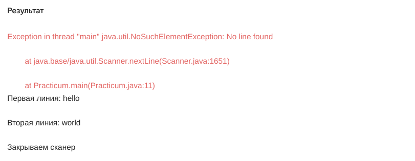

Поведение кода изменилось. finally всё так же выполняется, 
но теперь после него генерируется исключение, которое прерывает программу. 
Это происходит потому, что не настроена обработка ошибки NoSuchElementException 
при помощи catch. 

Однако блок finally можно использовать и при отсутствии блока catch. 
Например, в том случае, если вместо непроверяемого исключения будет брошено 
проверяемое и оно будет отражено в сигнатуре метода с помощью throws.
Тогда выполнение программы не будет прервано. Использование finally без catch 
может быть полезным, если нужно выполнить какие-то действия вне зависимости от того, 
произошло исключение или нет, но при этом его не требуется обрабатывать, 
так как оно может быть использовано дальше. 

`try — catch в finally`

Если в `finally` произошло исключение, 
то в терминале вы увидите именно его стек-трейс, 
а не сообщение об ошибке, обработанной ранее в блоке `catch`. 
Чтобы избежать подобного, нужно добавить дополнительный обработчик 
`try...catch` для опасного кода внутрь блока `finally`.

`finally и return`

В блоке `finally` может быть любой код, однако лучше не использовать 
в нём ключевое слово `return`. Сочетание `finally` и `return` приводит к тому, 
что нарушается логика программы. Запустите, например, такой код.

```java
public class Practicum {
    public static void main(String[] args) {
        System.out.println(returnFromFinally());
    }

    public static int returnFromFinally() {
        try {
            return calculate(10, 2);
        } catch (Exception e) {
            return 1;
        } finally {
            return 2;
        }
    }

    public static int calculate(int a, int b) {
        return a / b;
    }
}
```


Так как действие в блоке `finally` выполняется последним, из-за `return` метод
`returnFromFinally()` будет всегда возвращать одно и то же значение 
(точно так же, как и в проверочном задании в начале урока). 

Если же мы уберём `return` из `finally` (например, заменим на печать любого значения), 
то восстановится правильная логика — когда код выполнится успешно, 
то вернется результат вызова `calculate()`, если произошло исключение — то 1. 
Попробуйте сделать это: исправьте код в блоке `finally` — и оцените результат.

Блок `finally` будет полезен, если необходимо выполнить какое-то завершающее действие 
в конце вне зависимости, случилась исключительная ситуация или нет.
Однако используйте его 
внимательно — без `return` и предупреждая возможные сбои дополнительной обработкой!

</details>

<details>

<summary>Кратко по теме</summary>
Коротко повторим, что вы узнали:
* Исключения бывают:
    * проверяемые (checked), которые могут ожидаемо случиться и обработка которых обязательна;
    * непроверяемые (unchecked), которые не были предусмотрены логикой программы.

* Иерархия исключений от Throwable до TimeoutException:

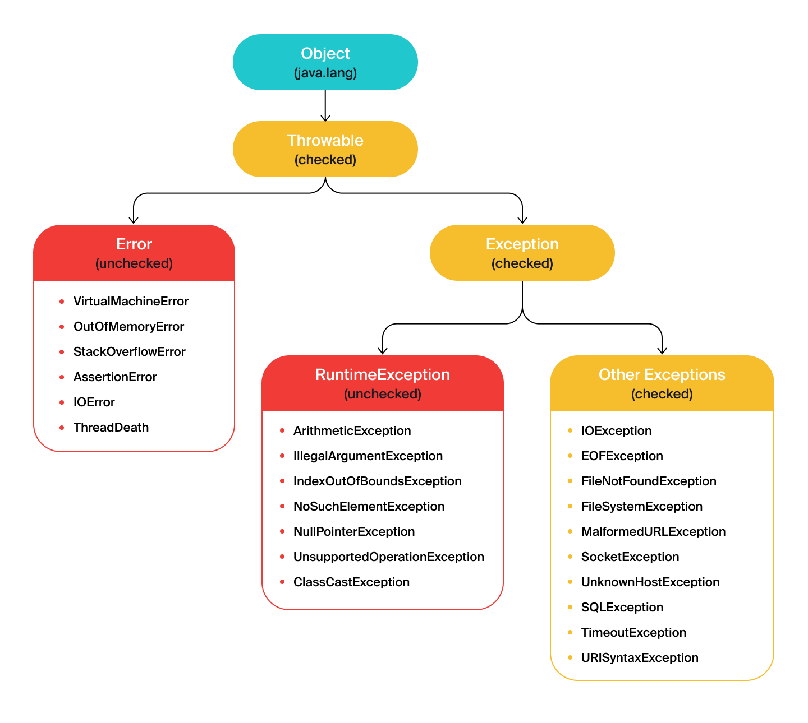

* С помощью стек-трейса — информации о возникшей ошибке — вы можете 
эффективно отлаживать свои программы и быстро находить причины возникших исключений.
* Работа с исключениями происходит так: 
вы ожидаете их появления в блоке `try` и обрабатываете с помощью `catch` и `finally`.
  * В блок `try` передаётся код, в котором могут произойти исключения. Он подготавливает программу к их корректной обработке.
  * Блок `catch` нужен для перехвата и обработки конкретных исключений, возникших в блоке `try`.
  * Блок `finally` нужен для выполнения кода после блоков `try` и `catch`. С ним код будет выполнен независимо от того, произошло исключение или нет.
* Чтобы найти ошибку и внести правки в код, нужно самостоятельно получить информацию об исключении.
Помогут следующие методы:
  * `printStackTrace()` выведет всю информацию об ошибке;
  * `getMessage()` позволит получить короткое сообщение с описанием ошибки;
  * `getStackTrace()` возвращает массив элементов, представленных классом `StackTraceElement`.
* Ловить все исключения как `Exception` — это плохая практика, которая усложняет обработку ошибок.
* Можно создать свои собственные исключения и выбрасывать их в нужных местах
с помощью `throw` для указания на конкретные проблемы в вашем коде.


</details>

<details>

<summary>Задание 1</summary> 

## Задание 1

Добавьте обработку исключений при преобразовании строки в URL в метод parseStringToURI(). 
При ошибке возвращайте значение null.

```java
import java.net.URI;

public class Practicum {
    public static void main(String[] args) {
        System.out.println(parseStringToURI("https://ya.ru"));
        System.out.println(parseStringToURI("\\\\"));
        System.out.println(parseStringToURI(null));
    }

    public static URI parseStringToURI(final String input) {
        return new URI(input);
    }
}


```

### Подсказки

* Оберните код метода `parseStringToURI()` в конструкцию `try...catch`.
* В качестве типа отлавливаемого исключения укажите `Throwable`.

</details>


<details>

<summary>Задание 2</summary> 

## Задание 2

Напишите класс исключений `UserInputException`. В нём переопределите конструктор
без параметров и конструктор с коротким текстом об ошибке. Класс должен быть наследником `Exception`.

```java
// допишите код UserInputException
 

} 
 public class Practicum {
     public static void main(final String[] args) {
        final UserInputException userInputException = new UserInputException("Ошибка ввода!");
        System.out.println(userInputException.getMessage());
     }
}


```

### Подсказки

* Проверьте, что родительским классом является `Exception` и не забыт конструктор без параметров.

</details>


<details>

<summary>Задание 3</summary> 

## Задание 3

Приложения часто должны обрабатывать и преобразовывать данные, 
которые поступили от пользователей. Важно уметь обрабатывать ошибки 
при вводе и уметь ограничивать количество попыток, в том числе и 
с помощью написания собственных классов-исключений. 

Перед вами программа-калькулятор сложных процентов. Допишите код классов-исключений 
`LimitException` (для ограничения количества попыток) и `InputException` 
(для ошибок при вводе), а также добавьте их обработку.

1. Исключение `LimitException` должно быть унаследовано от класса `RuntimeException`.
   Помимо текста исключения оно должно принимать количество попыток ввода `attempts` 
в виде целого числа.
2. Добавьте обработку `LimitException` в методе `main()`. При превышении лимита
   попыток предусмотрите вывод сообщения: `Превышен лимит ошибок ввода: n`,
   где `n` — количество реальных попыток.
3. Исключение `InputException` должно быть унаследовано от класса `Exception`. 
При обработке ошибки предусмотрите вывод для пользователей следующих сообщений:

* Введено отрицательное значение;
* Введено не число;
* Ошибка ввода: <подробное сообщение об ошибке>.

Сгенерируйте нужные исключения внутри класса `FinancialCalculatorException`.

`LimitException.java`

```java
public class LimitException {
}
```

`InputException.java`

```java
public class InputException {
}
```

`FinancialCalculatorException.java`

```java
import java.util.InputMismatchException;
import java.util.Scanner;

public class FinancialCalculatorException {
  	final static Scanner scanner = new Scanner(System.in);
    public static void main(String[] args) {
        calculate();
        // перехват исключения LimitException
    }

    public static double getInterest(final double rate, final int time, final double principal) {
        final double multiplier = Math.pow(1.0 + rate/100.0, time) - 1.0;
        return multiplier * principal;
    }

    public static int getIntLimited(String greeting, int attempts) {
        for (int counter = 0; counter < attempts; counter++) {
            try {
                System.out.println(greeting + " => ");
                try {
                    final int value = Integer.parseInt(scanner.nextLine());
                    // проверка на отрицательное значение
                    // сгенерируйте исключение "Введено отрицательное значение"
                    return value;
                } catch (NumberFormatException exception) {
                    // сгенерируйте исключение "Введено не число"
                }
            } catch (InputException exception) {
                // сгенерируйте вывод формата "Ошибка ввода: " + информация об исключении
            }
        }
        // сгенерируйте исключение LimitException с сообщением "Превышен лимит ошибок ввода"
    }

    public static double getDoubleLimited(String greeting, int attempts) {
        for (int counter = 0; counter < attempts; counter++) {
            try {
                System.out.println(greeting + " => ");
                // добавьте недостающий код
                try {
                    final double value = Double.parseDouble(scanner.nextLine());
                    // ...
                    // ...
                    return value;
                } catch (NumberFormatException exception) {
                    // ...
                }
            } catch (InputException exception) {
                // ...
            }
        }
        // сгенерируйте исключение LimitException
    }

    public static void calculate() {
        final double rate = getDoubleLimited("Введите ставку", 3);
        final double principal = getDoubleLimited("Введите размер вклада", 3);
        final int time = getIntLimited("Введите срок вклада в месяцах", 5);
        System.out.println("Ваша выгода = " + getInterest(rate, time, principal));
    }
}
```

### Подсказки

* Проверьте, что класс `InputException` унаследован от `Exception`, 
а класс `LimitException` от `RuntimeException`.
* Проверьте, что конструкторы классов-исключений позволяют принимать заданные параметры — сообщение об исключении и количество попыток.
* Обработайте непроверяемое исключение `LimitException` в методе `main()`.
* Убедитесь, что в методах `getDoubleLimited()` и `getIntLimited()` добавлена генерация нужных исключений.

</details>


<details>

<summary>Задание 4</summary> 

## Задание 4

Ваш коллега написал программу для хранилища пиццы, но она не работает. Кажется, в коде что-то пропущено — найдите и исправьте это.

```java
public class TooMuchPizzaException extends Exception {
}
```

```java
public class NotEnoughPizzaException extends Exception {
}
```

```java
public class IncorrectInputException extends Exception {
    public IncorrectInputException(String message) {
        super(message);
    }
}
```

```java
public class PizzaStorage {
    private final int maxVolume;
    private int pizzaCount = 0;

    public PizzaStorage(final int maxVolume) {
      this.maxVolume = maxVolume;
    }

    public int addPizza(final int count) {
      if (pizzaCount + count > maxVolume) {
        throw new TooMuchPizzaException();
      }
      pizzaCount += count;
      return pizzaCount;
    }

    public int takePizza(final int count) {
      if (pizzaCount - count < 0) {
        throw new NotEnoughPizzaException();
      }
      pizzaCount -= count;
      return pizzaCount;
    }

    public int getPizzaCount() {
      return pizzaCount;
    }
  }
```

```java
import java.util.InputMismatchException;
import java.util.Scanner;

class Practicum {

  private static final Scanner scanner = new Scanner(System.in);

  public static void main(String[] args) {
    final PizzaStorage storage = new PizzaStorage(10);
    printActionMenu();
    String action = scanner.nextLine();
    while (!"exit".equals(action)) {
      if ("show".equals(action)) {
        System.out.println("Количество пиццы на складе: " + storage.getPizzaCount());
      } else if ("add".equals(action)) {
        try {
          add(storage);
        } catch (TooMuchPizzaException e) {
          System.out.println("Невозможно добавить такое количество пиццы на склад");
        }
      } else if ("take".equals(action)) {
        try {
          take(storage);
        } catch (NotEnoughPizzaException e) {
          System.out.println("Недостаточное количество пиццы не складе");
        }
      }
      action = scanner.nextLine();
    }
  }

  public static void add(final PizzaStorage storage) {
    try {
      final int count = getPositiveNumber("Введите количество пиццы для добавления => ");
      storage.addPizza(count);
    } catch (IncorrectInputException exception) {
      System.out.println("Произошла ошибка: " + exception.getMessage());
    }
  }

  public static void take(final PizzaStorage storage) {
    try {
      final int count = getPositiveNumber("Введите количество пиццы для удаления => ");
      storage.takePizza(count);
    } catch (IncorrectInputException exception) {
      System.out.println("Произошла ошибка: " + exception.getMessage());
    }
  }

  public static int getPositiveNumber(final String hint) throws IncorrectInputException {
    System.out.println(hint);
    try {
      final int count = scanner.nextInt();
      if (count <= 0) {
        throw new IncorrectInputException("Число должно быть больше 0");
      }
      return count;
    } catch (InputMismatchException exception) {
      throw new IncorrectInputException("Введено не число");
    }
  }

  public static void printActionMenu() {
    System.out.println("add - добавить пиццу на склад");
    System.out.println("take - взять пиццу со склада");
    System.out.println("show - показать количество на складе");
    System.out.println("exit - выход");
    System.out.print("Введите действие => ");
  }

}
```

### Подсказки

* Добавьте `throws` в методы, которые генерируют 
исключения — `addPizza()`, `takePizza()`, `add()`, `take()`, `getPositiveNumber()`.

</details>


<details>

<summary>Задание 5</summary>

## Задание 5

Доработайте код приложения для хранения и обработки паролей пользователей. 

1. По аналогии с классом `ValidatePasswordException` для ошибок при вводе пароля 
допишите код класса `ValidateNameException` для ошибок при вводе имени пользователя. 
Оба класса должны наследовать от `ValidateException` и принимать короткое сообщение об ошибке.

2. В методах класса `PasswordMemoryStorage` пропущены предупреждения об исключении `IOException` —
добавьте их.

3. Допишите код класса `NameValidator` — он должен реализовывать интерфейс `Validator` и проверять, 
не передана ли пустая строка. В обратном случае — генерировать исключение `ValidateNameException` с сообщением «Имя не должно быть пустым».
4. Добавьте реализованный экземпляр класса `NameValidator` в список `nameValidators`.
5. Добавьте отлов исключений `ValidateNameException` и `ValidatePasswordException`
в методы класса Practicum. При этом выведите сообщения формата:
* Ошибка валидации имени: + короткое описание ошибки.
* Ошибка валидации пароля: + короткое описание ошибки.
6. Организуйте закрытие хранилища `storage` при помощи метода `close()` при 
любом развитии событий в методах `addUser()` и `showUserPassword()` класса `Practicum`.

`ValidateException.java`

```java
package exceptions;

public class ValidateException extends Exception {
    public ValidateException(final String message) {
        super(message);
    }
}
```

`ValidatePasswordException.java`

```java
package exceptions;

public class ValidatePasswordException extends ValidateException {
    public ValidatePasswordException(final String message) {
        super(message);
    }
}
```

`ValidateNameException.java`

```java
package exceptions;

public class ValidateNameException {
// допишите код класса
}
```

`PasswordStorage.java`

```java
package storage;

import java.io.IOException;

public interface PasswordStorage {
    void open() throws IOException;
    void store(String user, String password) throws IOException;
    String get(String user) throws IOException;
    void close();
}
```

`PasswordMemoryStorage.java`

```java
package storage;

import java.io.IOException;
import java.util.HashMap;
import java.util.Map;
import java.util.Random;

public class PasswordMemoryStorage implements PasswordStorage {
    private static final Map<String, String> passwords = new HashMap<>();
    private boolean wasOpened = false;

    private boolean shouldErrorBeGenerated() {
        Random random = new Random();
        return random.nextInt(100) == 0;
    }

    @Override
    public void open() {
        if (shouldErrorBeGenerated()) {
            throw new IOException("Произошла внезапная ошибка");
        }
        wasOpened = true;
    }
   
    @Override
    public void store(final String user, final String password) {
        if (!wasOpened) {
            throw new IOException("Хранилище не открыто");
        }
        if (shouldErrorBeGenerated()) {
            throw new IOException("Произошла внезапная ошибка");
        }
        passwords.put(user, password);
    }

    @Override
    public String get(final String user) {
        if (!wasOpened) {
            throw new IOException("Хранилище не открыто");
        }
        if (shouldErrorBeGenerated()) {
            throw new IOException("Произошла внезапная ошибка");
        }
        return passwords.get(user);
    }

    @Override
    public void close() {
        if (wasOpened) {
            System.out.println("close action");
        }
    }
}
```

`Validator.java`

```java
package validators;

import exceptions.ValidateException;

public interface Validator {
    void validate(String value) throws ValidateException;
}
```

`NameValidator.java`

```java
package validators;

public class NameValidator {
// допишите код класса
}
```

`PasswordLengthValidator.java`

```java
package validators;

import exceptions.ValidateException;
import exceptions.ValidatePasswordException;

public class PasswordLengthValidator implements Validator {
    private final int minLength;

    public PasswordLengthValidator(final int minLength) {
        this.minLength = minLength;
    }

    @Override
    public void validate(final String password) throws ValidateException {
        if (password == null || password.length() < minLength) {
            throw new ValidatePasswordException(
                String.format("Пароль должен быть больше %d символов", minLength)
            );
        }
    }
}
```

`PasswordStrengthValidator.java`

```java
package validators;

import exceptions.ValidateException;
import exceptions.ValidatePasswordException;

public class PasswordStrengthValidator implements Validator {

    private boolean hasNumber(final String password) {
        for (int counter = 0; counter < password.length(); counter++) {
            if (Character.isDigit(password.charAt(counter))) {
                return true;
            }
        }
        return false;
    }

    private boolean hasLetter(final String password) {
        for (int counter = 0; counter < password.length(); counter++) {
            if (Character.isLetter(password.charAt(counter))) {
                return true;
            }
        }
        return false;
    }

    @Override
    public void validate(final String password) throws ValidateException {
        if (!hasLetter(password) || !hasNumber(password)) {
            throw new ValidatePasswordException("Пароль должен содержать буквы и цифры");
        }
    }
}
```

`Practicum.java`

```java
import exceptions.ValidateException;
import storage.PasswordMemoryStorage;
import storage.PasswordStorage;
import validators.PasswordLengthValidator;
import validators.PasswordStrengthValidator;
import validators.Validator;

import java.io.IOException;
import java.util.List;
import java.util.Scanner;

class Practicum {

	private static final Scanner scanner = new Scanner(System.in);
	private static final List<Validator> passwordValidators = List.of(
		new PasswordLengthValidator(5), new PasswordStrengthValidator()
	);
	
	private static final List<Validator> nameValidators = List.of(); // поработайте со списком

	public static void main(String[] args) {
		loop();
	}

	public static void loop() {
		while (true) {
			final String action = getAction();
			if ("1".equals(action)) {
				addUser();
			} else if ("2".equals(action)) {
				showUserPassword();
			} else {
				break;
			}
		}
	}

	private static void checkValidatorRules(
		final List<Validator> validators, final String value
	) throws ValidateException {
		for (Validator validator: validators) {
			validator.validate(value);
		}
	}

	private static void addUser() {
		final PasswordStorage storage = new PasswordMemoryStorage();
		// добавьте отлов исключений ValidateNameException и ValidatePasswordException
		// закройте хранилище
		try {
			storage.open();
			System.out.println("Введите имя пользователя => ");
			final String name = scanner.nextLine();
			checkValidatorRules(nameValidators, name);
			System.out.println("Введите пароль пользователя => ");
			final String password = scanner.nextLine();
			checkValidatorRules(passwordValidators, password);
			storage.store(name, password);
		} catch (ValidateException e) {
			System.out.println("Ошибка валидации: " + e.getMessage());
		} catch (IOException e) {
			System.out.println("Ошибка работы с хранилищем: " + e.getMessage());
		}
	}

	private static void showUserPassword() {
		final PasswordStorage storage = new PasswordMemoryStorage();
		// добавьте отлов исключения ValidateNameException
		// закройте хранилище
		try {
			storage.open();
			System.out.println("Введите имя пользователя => ");
			final String name = scanner.nextLine();
			checkValidatorRules(nameValidators, name);
			final String password = storage.get(name);
			System.out.println(String.format("Пароль пользователя %s = %s", name, password));
		} catch (ValidateException e) {
			System.out.println("Ошибка валидации: " + e.getMessage());
		} catch (IOException e) {
			System.out.println("Ошибка работы с хранилищем: " + e.getMessage());
		}
	}

	private static String getAction() {
		System.out.println("1 - добавить пользователя с паролем");
		System.out.println("2 - отобразить пароль пользователя");
		System.out.println("другие символы - выход");
		System.out.println("Выберите действие => ");
		return scanner.nextLine();
	}
}
```
### Подсказки

* Класс `ValidateNameException` должен наследовать от `ValidateException` и переопределять его конструктор.
* В методах `open()`, `store()` и `get()` класса `PasswordMemoryStorage` 
нужно добавить указание на исключение `IOException` с помощью `throws`.
* В классе `NameValidator` нужно переопределить метод `validate()`, 
предупредить об исключении типа `ValidateException` и сгенерировать 
исключение `ValidateNameException`.
* Для генерации исключений используйте ключевое слово `throw`.
* Проверьте, передана ли реализация класса `NameValidator` в список.
* Для отлова исключений `ValidateNameException` и `ValidatePasswordException` в 
методах `addUser()` и `showUserPassword()` нужно использовать блоки `catch`.
* Получить короткое сообщение об ошибке поможет метод `getMessage()`.
* Используйте блок `finally` для закрытия хранилища.

</details>


   Предыдущее занятие   |         &nbsp;          |   Следующее занятие    
:----------------------:|:-----------------------:|:----------------------:
 [Урок 17](LESSON17.MD) | [Содержание](README.MD) | [Урок 19](LESSON19.MD) 