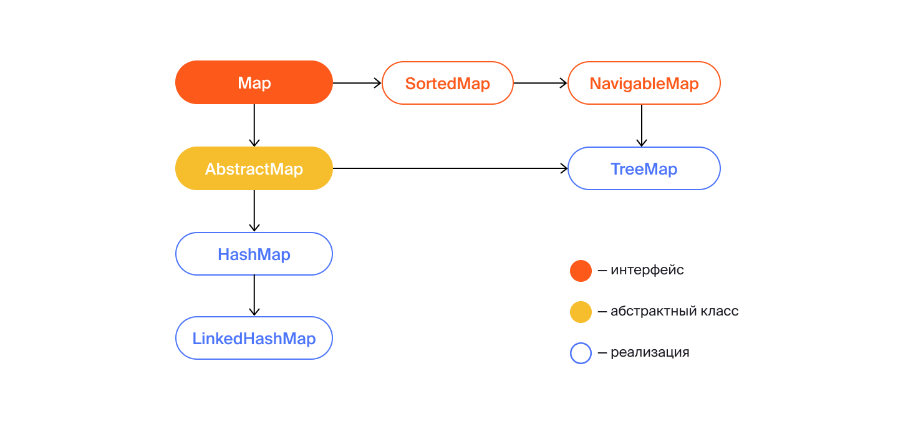
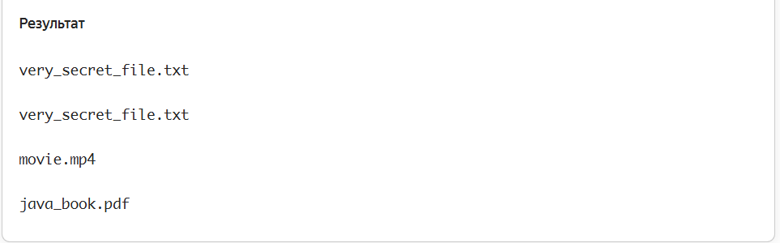
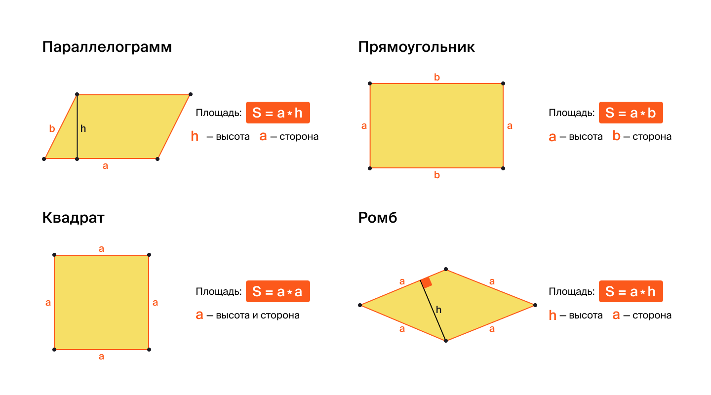
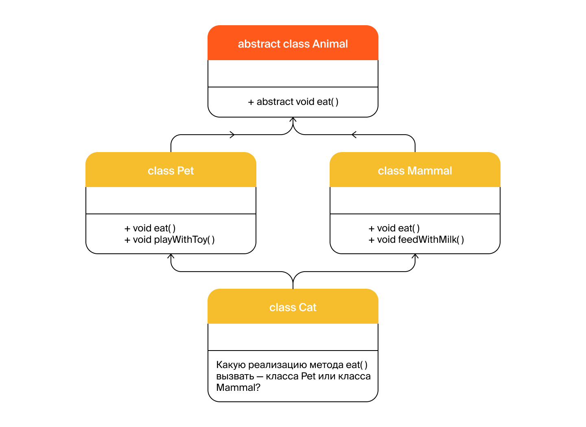
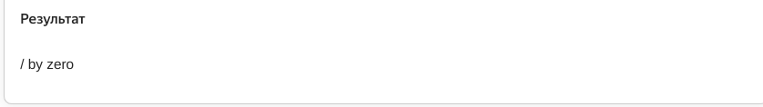
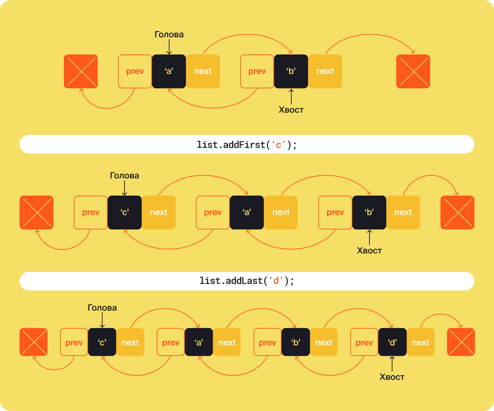
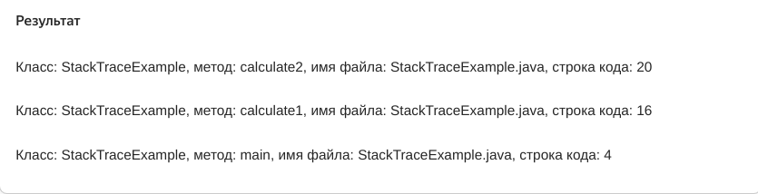

   Предыдущее занятие   |         &nbsp;          |   Следующее занятие    
:----------------------:|:-----------------------:|:----------------------:
 [Урок 19](LESSON19.MD) | [Содержание](README.MD) | [Урок 21](LESSON21.MD)


# Урок 20. Стримы и лямбда-функции

# Требования к сдаче работы

Задание выполняется в среде программирования Idea. Результат надо разместить в своем репозитории на GitHub.
Прислать в гугл-формы(размещенная на моем сайте) ссылку на репозиторий.

***Критерии оценивания***

* Оценка 5 - надо сделать все задания.
* Оценка 4 - надо сделать любое одно задание.
* Оценка 3 - надо сделать конспект по материалу урока.

## Оглавление

1. [Введение в тему](#введение-в-тему)

## Введение в тему

Эта тема посвящена новому для вас подходу к программированию — функциональному стилю. 
Функциональное программирование — это эффективный и выразительный способ написания кода. 
Он сделает ваши программы более лаконичными. А ещё их будет проще поддерживать.

В этой теме вы:

* узнаете больше о понятиях «функциональный стиль», «декларативный и императивный подходы»;
* познакомитесь с концепцией стримов — это способ обработки данных в Java, который позволяет сосредоточиться на логике, а не на деталях реализации;
* разберётесь, чем различаются терминальные и промежуточные операции в стримах и как они влияют на обработку данных;
* освоите базовые и продвинутые операции стримов, чтобы изменять используемые данные;
* изучите основы лямбда-выражений — это компактные средства представления функций в Java — и узнаете, как использовать их в коде;
* поработаете с тремя сами популярными функциональными интерфейсами;
* освоите работу с классом Optional — это современное решение для избежания ошибок, которые связаны с null-значениями.

<details>

<summary>
Стримы и операции с ними
</summary>

## Стримы и операции с ними

Java — сложный современный язык, который предоставляет множество инструментов для решения одних и тех же задач.
Их изучение — это непрерывный процесс, вы постоянно будете встречаться всё с новыми и новыми способами оптимизировать код. 
О некоторых из них пойдёт речь в этой теме. 

### Преобразование потока объектов

Возьмём распространённую задачу — получить список объектов и преобразовать каждый
из них по заданному правилу. В качестве объектов выступят строки с путями файлов в файловой системе.
Для каждого из путей нужно оставить только имя файла.
Вот как это можно сделать с помощью цикла.

```java
import java.nio.file.Paths;
import java.util.ArrayList;
import java.util.List;

public class FilePathProcessor {

    public List<String> processFilePaths(List<String> paths) {
        List<String> result = new ArrayList<>();

        //проходим циклом по всем путям файлов
        for (String path: paths) {
            //для каждого пути получаем имя файла и добавляем его в итоговый список
            String fileName = Paths.get(path).getFileName().toString();
            result.add(fileName);
        }

        return result;
    }

    public static void main(String[] args) {
        List<String> paths = new ArrayList<>();
        paths.add("/home/bigbrother/docs/hide.txt");
        paths.add("hide.txt");
        paths.add("file3.tmp");
        paths.add("/home/bigbrother/downloads/movie.mp4");
        paths.add("/home/bigbrother/downloads/java_book.pdf");

        FilePathProcessor processor = new FilePathProcessor();
        List<String> processedPaths = processor.processFilePaths(paths);
        for (String newPath: processedPaths) {
            System.out.println(newPath);
        }
    }
}
```


Но такие задачи имеют тенденцию усложняться! Представьте, что нужно дополнительно исключить из вывода все строки, 
имеющие `расширение .tmp`. Дополнительно требуется переименовать файлы с именем `hide` в `very_secret_file`. 

Для лучшей читаемости модификацию имени файла и проверку условия вынесем в отдельные методы. Вот что получится.

```java
import java.nio.file.Paths;
import java.util.ArrayList;
import java.util.List;

public class FilePathProcessor {

    public List<String> processFilePaths(List<String> paths) {
        List<String> result = new ArrayList<>();
        //проходим циклом по всем путям файлов
        for (String path: paths) {
            //проверяем, что файл не имеет расширения .tmp
            if (!isTempFile(path)) {
                //получаем имя файла из его пути
                String fileName = getFileName(path);
                //переименовываем файлы с именем hide
                fileName = renameSecretFiles(fileName);
                result.add(fileName);
            }
        }

        return result;
    }

    private String getFileName(String filePath) {
        return Paths.get(filePath).getFileName().toString();
    }

    private String renameSecretFiles(String fileName) {
        if (fileName.startsWith("hide")) {
            return fileName.replace("hide", "very_secret_file");
        } else {
            return fileName;
        }
    }

    private boolean isTempFile(String fileName) {
        return fileName.endsWith(".tmp");
    }

    public static void main(String[] args) {
        List<String> paths = new ArrayList<>();
        paths.add("/home/bigbrother/docs/hide.txt");
        paths.add("hide.txt");
        paths.add("file3.tmp");
        paths.add("/home/bigbrother/downloads/movie.mp4");
        paths.add("/home/bigbrother/downloads/java_book.pdf");

        FilePathProcessor processor = new FilePathProcessor();
        List<String> processedPaths = processor.processFilePaths(paths);
        for (String newPath: processedPaths) {
            System.out.println(newPath);
        }
    }
}
```


Хоть мы и пытались не усложнять код, он всё равно стал длиннее и запутаннее. Если потребуется добавить новые трансформации 
для имён файлов или новые условия, по которым нужно их отбирать, то работать с кодом станет совсем тяжело


### Стрим

Для реализации таких операций, как трансформация и фильтрация последовательности объектов (и других подобных), 
Java предоставляет более удобный способ, чем циклы, — использование **Stream API** (от англ. _stream_ — «поток»).

Смысл Stream API в том, что на основе входного списка объектов создаётся **стрим** — специальная последовательность данных и операций, 
которые будут с ними выполняться. При этом стрим — это непосредственно поток данных с операциями, а Stream API — набор классов Java для работы со стримами.

Стрим позволяет не проходить вручную циклом по элементам — он даёт декларативно описать, 
что нужно сделать с каждым элементом. В этой теме мы поговорим и про концепцию стримов, и про использование Stream API.

### Как работают стримы


Представьте кастинг в новое музыкальное телешоу. На входе в телецентр стоит длинная очередь
претендентов — музыкантов и артистов. Один за другим они заходят в здание телецентра. 

Каждый претендент последовательно проходит мимо нескольких стоек с представителями шоу.
На первой проверяют, есть ли он в списках предварительной записи, если нет — дальше не пропускают.
На второй выдают инструкцию с описанием порядка кастинга. На третьей — делают быстрый грим, 
на четвёртой — выдают микрофон, на пятой — случайным образом называют песню, которую нужно будет исполнить.
Готовых участников группами по пять человек впускают в комнату, где сидит жюри.

Примерно так и работают стримы — получают на вход поток элементов и над каждым из них выполняют 
операции, такие как трансформация, фильтрация, агрегация нескольких элементов в один или другие. 
То есть стрим — это не только поток желающих спеть в музыкальном шоу, но и весь процесс отбора целиком.


### Операции над стримами

Операции, которые можно выполнять над стримами, делятся на две группы — **промежуточные** и **терминальные**.

* **Промежуточные** (англ. _intermediate_) — задают правила изменения стрима и возвращают трансформированный поток исходных данных.
В процессе работы может быть выполнено несколько промежуточных операций.

В примере с кастингом промежуточными операциями будут все (проверка записи, выдача песни и другие), кроме выхода участников к жюри.

* **Терминальные** (англ. _terminal_) — к ним относятся конечные операции. Терминальная операция запускает 
выполнение всех промежуточных операций, выполняет своё целевое действие и завершает работу над стримом. 
Она может вызываться у стрима только один раз.

В примере с кастингом терминальной операцией будет действие, когда очередная пятёрка участников выходит к жюри.

Если создать стрим и указать набор промежуточных операций, но не указать ни одной терминальной, ничего сделано не будет. 
Если жюри не готово слушать и отбирать участников кастинга, то им нет необходимости проходить все промежуточные этапы.
Такой подход называется **ленивыми вычислениями** (англ. _lazy evaluation_).

Вычисления выполняются только когда происходит запрос на их результат. Это значительно повышает эффективность программ.



### Синтаксис стримов

На первый взгляд, стримы похожи на коллекции, но есть существенная разница.
Коллекции предназначены только для хранения данных, а стримы сочетают в себе и данные,
и набор преобразований, который должен быть над этими данными выполнен. 
При этом с помощью Stream API можно создать стрим на основе коллекции.

Вернёмся к коду с обработчиком путей файлов. Чтобы создать стрим на основе коллекции, у неё вызывается метод `stream()`.
Нам нужно реализовать трансформацию и фильтрацию данных. Для трансформации применяется метод `map`, а для фильтрации — метод `filter`:

* `map` — применяет к каждому элементу стрима некоторое преобразование (оно задаётся в аргументе `map`). 
В результате изначальный элемент стрима заменяется результатом преобразования. Мы будем использовать `map` для превращения пути файла 
в имя, а также для переименования секретных файлов.
* `filter` — проверяет каждый элемент стрима на соответствие условию (условие задаётся в аргументе) и исключает из стрима все элементы,
не соответствующие ему. Мы используем `filter`, чтобы отсеять файлы с расширением `tmp`.

```java
import java.nio.file.Paths;
import java.util.ArrayList;
import java.util.List;
import java.util.stream.Collectors;

public class FilePathProcessor {

    public List<String> processFilePaths(List<String> paths) {
        List<String> result = paths
                //создаём стрим на основе списка
                .stream()
                //отфильтровываем из стрима файлы с расширением tmp
                .filter(filePath -> !filePath.endsWith(".tmp"))
                //заменяем в стриме каждый путь на имя файла
                .map(filePath -> Paths.get(filePath).getFileName().toString())
                //если файл является секретным, заменяем его название в стриме на very_secret_file 
                .map(fileName -> {
                    if (fileName.startsWith("hide")) {
                        return fileName.replace("hide", "very_secret_file");
                    } else {
                        return fileName;
                    }
                })
                //преобразуем стрим обратно в список
                .collect(Collectors.toList());

        return result;
    }

    public static void main(String[] args) {
        List<String> paths = new ArrayList<>();
        paths.add("/home/bigbrother/docs/hide.txt");
        paths.add("hide.txt");
        paths.add("file3.tmp");
        paths.add("/home/bigbrother/downloads/movie.mp4");
        paths.add("/home/bigbrother/downloads/java_book.pdf");

        FilePathProcessor processor = new FilePathProcessor();
        List<String> processedPaths = processor.processFilePaths(paths);
        for (String newPath: processedPaths) {
            System.out.println(newPath);
        }
    }
}
```



Вот что происходит:

1. На основе входного списка `paths` с помощью функции `stream()` создаётся новый стрим.
2. Затем для стрима последовательно указываются промежуточные операции, которые нужно выполнить с его элементами,
— один раз `filter` и два раза `map`.
3. В `filter` и `map` передаётся специальная конструкция, она напоминает обычное тело функции. 
В этой конструкции задаётся логика преобразования (для `map`) либо логика проверки (для `filter`), но без создания класса 
и даже без указания имени для этой функции. Такая конструкция называется **лямбда-выражение** — более детально вы познакомитесь с 
лямбдами в следующем уроке.
4. И наконец, стрим завершается терминальной операцией — `collect(Collectors.toList())`. Метод `collect` означает, что стрим 
нужно преобразовать в какой-то тип данных — в данном случае в `List`. Класс `Collectors` является частью `Stream API` и содержит в себе набор стандартных классов 
для преобразования стрима в другие типы данных.




</details>

<details>

<summary>Лямбда-функции</summary>

## Лямбда-функции

Поддержка таких функций присутствует практически во всех современных языках программирования — и Java не исключение. 



### Что такое и зачем

Лямбда-функциями называют функции, у которых нет имени и которые не принадлежат явно ни к какому классу. 
Они позволяют сделать привычный код короче и удобнее, а кроме того, добавляют некоторые новые возможности в язык программирования. 

> Создателем понятий «лямбда-исчисление» и «лямбда-выражение» считается математик Алонзо Чёрч. Ещё до появления первых ЭВМ он построил теорию, основанную на функциях, не имеющих имени,
> и взаимодействии между ними. Именно такие функции были названы лямбда-функциями.

Вы уже видели, что лямбда-функции удобно использовать, чтобы задать операции над стримами. 
Однако это не единственное их применение. Лямбда-функцию можно использовать везде,
где требуется передать объект класса, реализующего интерфейс ровно с одним методом. 

### Например, компаратор

Возьмём для примера интерфейс `Comparator`, который содержит в себе один метод `int compare(T o1, T o2)`. Везде, где требуется объект 
компаратора, вместо него можно использовать лямбда-функцию. 
Для начала реализуем пример без использования лямбд. Создадим класс `Circle` с тремя полями — координатами центра `centerX` и `centerY`,
а также радиусом `radius`. Определим `Comparator` для объектов `Circle` — будем сравнивать окружности в соответствии с 
их радиусами. Созданный `Comparator` будем использовать для сортировки массива окружностей.

```java
import java.util.Arrays;
import java.util.Comparator;
import java.util.List;

class Circle {
    private int centerX;
    private int centerY;
    private int radius;

    public Circle(int centerX, int centerY, int radius) {
        this.centerX = centerX;
        this.centerY = centerY;
        this.radius = radius;
    }

    public int getRadius() {
        return radius;
    }

    @Override
    public String toString() {
        return "Радиус окружности: " + radius
                + ", координаты: "
                + centerX
                + ", "
                + centerY;
    }
}

// объявляем класс, реализующий интерфейс Comparator
class CircleComparator implements Comparator<Circle> {
    @Override
    public int compare(Circle o1, Circle o2) {
        return o1.getRadius() - o2.getRadius();
    }
}

public class ComparatorDemo {
    public static void main(String[] args) {
        List<Circle> circles = Arrays.asList(
                new Circle(3, 5, 12),
                new Circle(1, -2, 4),
                new Circle(8, 8, 8),
                new Circle(5, 1, 7)
        );

        // сортируем список окружностей, используя класс-компаратор
        circles.sort(new CircleComparator());

        for (Circle circle: circles) {
            System.out.println(circle);
        }
    }
}
```


Такой код вполне имеет право на существование, особенно в том случае, если созданный нами `CircleComparator`
будет в дальнейшем использоваться где-то ещё. 

Однако часто бывает так, что класс-компаратор используется ровно один раз — там же, где его создали. 
В таком случае получается много лишних действий — объявлять новый класс, придумывать ему имя, создавать объект
этого класса и передавать его. Именно здесь на помощь приходят лямбда-функции. Перепишем код с использованием лямбд.


```java
import java.util.Arrays;
import java.util.List;

class Circle {
    private int centerX;
    private int centerY;
    private int radius;

    public Circle(int centerX, int centerY, int radius) {
        this.centerX = centerX;
        this.centerY = centerY;
        this.radius = radius;
    }

    public int getRadius() {
        return radius;
    }

    @Override
    public String toString() {
        return "Радиус окружности: " + radius
                + ", координаты: "
                + centerX
                + ", "
                + centerY;
    }
}

public class ComparatorDemo {
    public static void main(String[] args) {
        List<Circle> circles = Arrays.asList(
                new Circle(3, 5, 12),
                new Circle(1, -2, 4),
                new Circle(8, 8, 8),
                new Circle(5, 1, 7)
        );

        // вместо компаратора используем лямбду
        circles.sort((Circle circle1, Circle circle2) -> {
            return circle1.getRadius() - circle2.getRadius();
        });

        for (Circle circle: circles) {
            System.out.println(circle);
        }
    }
}
```



Теперь вся логика по сравнению окружностей выглядит так. 

```java
(Circle circle1, Circle circle2) -> {
    return circle1.getRadius() - circle2.getRadius();
});
```


### Синтаксис лямбда-выражений

Разберём подробнее синтаксис блока кода с лямбдой — **лямбда-выражения**. Они состоят из двух частей, разделённых оператором `->`. 

```java
(список входных параметров) -> { блок реализации функции};

```

При этом работают следующие правила:

**Параметры**
* Параметры заключаются в круглые скобки и разделяются запятыми. Например, `(Circle circle1, Circle circle2)`.
* Параметров может не быть.
* Если параметров нет, нужно оставить пустые круглые скобки. Например, такая 
лямбда будет возвращать строку с информацией о том, открыт ли магазин: `() -> "магазин закрыт"`.


**Блок реализации функции**
* Тело функции помещается в фигурные скобки. После ключевого слова `return`
нужно указать возвращаемое значение — иначе типом возвращаемого значения будет `[void]()`.
* Тело лямбды может состоять из одного и более выражений. В примере с окружностями одно 
выражение — `return circle1.getRadius() - circle2.getRadius();`. 
Если мы хотим реализовать более сложную логику, то тело лямбды будет состоять из нескольких выражений. 
К примеру, чтобы окружности с радиусом 0 попадали в конец отсортированного списка (то есть всегда считались бы больше другой окружности), 
мы можем использовать такую лямбду.

```java
circles.sort((Circle circle1, Circle circle2) -> {
    if (circle1.getRadius() == 0) {
        return 1;
    }
    if (circle2.getRadius() == 0) {
        return -1;
    }
    return circle1.getRadius() - circle2.getRadius();
})
```

### Как упростить код лямбды

В некоторых случаях запись лямбда-выражений в Java можно укоротить и упростить. Для этого действуют такие правила:

* Если параметр всего один, то круглые скобки необязательны. Например: `name -> System.out.println(name)` — такая лямбда выводит 
на экран переданное имя.
* Можно не указывать тип параметра, если Java может **вывести**(_Вывод типа — это свойство компилятора понимать на основе контекстной информации, каким должен быть тип переменной, параметра или возвращаемого значения._) 
его самостоятельно. Для параметров лямбда-функций компилятор может вывести тип практически во всех случаях.
В итоге запись становится короче: вместо `(Circle circle1, Circle circle2)` получится `(circle1, circle2)`.
* Если тело лямбды состоит из одного выражения, его можно не заключать в фигурные скобки.
Возвращаемое значение в этом случае указывается без ключевого слова `return`. 
Например, такая лямбда вычисляет длину окружности: `radius -> 2 * Math.*PI* * radius`.

Если применить эти правила к изначальному коду сравнения окружностей, 
лямбду можно записать в виде `(circle1, circle2) -> circle1.getRadius() - circle2.getRadius()`.



</details>


<details>
<summary>Задание 1</summary>

## Задание 1

Измените код лямбда-функции сравнения окружностей. Сделайте так, что если у двух окружностей совпадает радиус, то большей считается та окружность,
у которой больше сумма координат центра окружности. Добавьте в код геттеры для получения координат центра.

```java
import java.util.Arrays;
import java.util.List;

public class Practicum {
    public static void main(String[] args) {
        List<Circle> circles = Arrays.asList(
                new Circle(3, 5, 12),
                new Circle(1, -2, 4),
                new Circle(8, 8, 8),
                new Circle(5, 1, 8)
        );

        circles.sort((Circle circle1, Circle circle2) -> {
            //вставьте код лямбды здесь
        });

        for (Circle circle: circles) {
            System.out.println(circle);
        }
    }
}

class Circle {
    private int centerX;
    private int centerY;
    private int radius;

    public Circle(int centerX, int centerY, int radius) {
        this.centerX = centerX;
        this.centerY = centerY;
        this.radius = radius;
    }

    public int getRadius() {
        return radius;
    }

    @Override
    public String toString() {
        return "Радиус окружности: " + radius
                + ", координаты: "
                + centerX
                + ", "
                + centerY;
    }
    
    //добавьте геттеры для координат центра
}


```

### Подсказки

* Представьте, как выглядел бы код `compare` обычного компаратора для решения этой задачи.
* Функция должна возвращать положительное число, если первый аргумент больше второго, 0 — если они равны, отрицательное число — если первый меньше второго.



</details>


<details>
<summary>Задание 2</summary>

## Задание 2

Перед вами класс `BookEditor`, который обрабатывает текст книги как набор строк.
Основной метод этого класса — `processText(List<String> sourceText)`. Этот метод возвращает преобразованный набор строк, 
соответствующий правилам форматирования книг, принятым в издательстве. 

Отдельно преобразуется заголовок, отдельно — каждая строка текста. В `BookEditor` хранятся специальные обработчики — за них отвечают 
объекты интерфейсов `HeaderDecorator` для форматирования заголовка и `LineProcessor` для строк. 

Мы определили реализацию каждого из обработчиков в обычных Java-классах — `ToUpperCaseHeaderDecorator` 
приводит название книги к верхнему регистру, а `CapitalizeFirstLetterProcessor` делает первую букву в каждой строке заглавной.

Ваша задача — переписать код с использованием лямбда-функций вместо классов `ToUpperCaseHeaderDecorator` и `CapitalizeFirstLetterProcessor`,
а также добавить новый обработчик строк, который будет добавлять в конец каждой строки символ переноса строки `\n`.


```java
import java.util.ArrayList;
import java.util.Arrays;
import java.util.List;

public class BookEditor {

    private HeaderDecorator headerDecorator;
    private List<LineProcessor> lineProcessors = new ArrayList<>();

    public static void main(String[] args) {
        BookEditor bookEditor = new BookEditor();

        bookEditor.setHeaderDecorator(new ToUpperCaseHeaderDecorator());
        bookEditor.addLineProcessor(new CapitalizeFirstLetterProcessor());

        List<String> content = Arrays.asList(
                "Приключения Java-программиста",
                "История началась рано утром, ",
                "когда программист вышел из дома, ",
                "решив выпить утренний кофе."
        );

        List<String> resultContent = bookEditor.processText(content);
        System.out.println(resultContent);
    }

    public List<String> processText(List<String> sourceText) {
        List<String> resultText = new ArrayList<>();

        String sourceHeader = sourceText.get(0);
        String decoratedHeader = headerDecorator.decorate(sourceHeader);
        resultText.add(decoratedHeader);

        for (int i=1; i<sourceText.size(); i++) {
            String currentLine = sourceText.get(i);
            for (LineProcessor processor: lineProcessors) {
                currentLine = processor.processLine(currentLine);
            }
            resultText.add(currentLine);
        }

        return resultText;
    }

    public void setHeaderDecorator(HeaderDecorator headerDecorator) {
        this.headerDecorator = headerDecorator;
    }

    public void addLineProcessor(LineProcessor lineProcessor) {
        this.lineProcessors.add(lineProcessor);
    }
}

interface HeaderDecorator {
    String decorate(String header);
}

interface LineProcessor {
    String processLine(String line);
}

class ToUpperCaseHeaderDecorator implements HeaderDecorator {
    @Override
    public String decorate(String header) {
        return header.toUpperCase() + "\n";
    }
}

class CapitalizeFirstLetterProcessor implements LineProcessor {
    @Override
    public String processLine(String line) {
        return line.substring(0, 1).toUpperCase() + line.substring(1);
    }
}
```


### Подсказки

* Перепишите функции `decorate` и `processLine` в формате лямбда-функций по образцу `(список входных параметров) -> { блок реализации функции}`.
* Создавать лямбда-функции можно в том же месте кода, где сейчас создаются конкретные объекты —
реализации интерфейсов `ToUpperCaseHeaderDecorator` и `CapitalizeFirstLetterProcessor`.
* Сами классы `ToUpperCaseHeaderDecorator` и `CapitalizeFirstLetterProcessor` вам больше не нужны — их можно удалить.

</details>


   Предыдущее занятие   |         &nbsp;          |   Следующее занятие    
:----------------------:|:-----------------------:|:----------------------:
 [Урок 19](LESSON19.MD) | [Содержание](README.MD) | [Урок 21](LESSON21.MD) 
