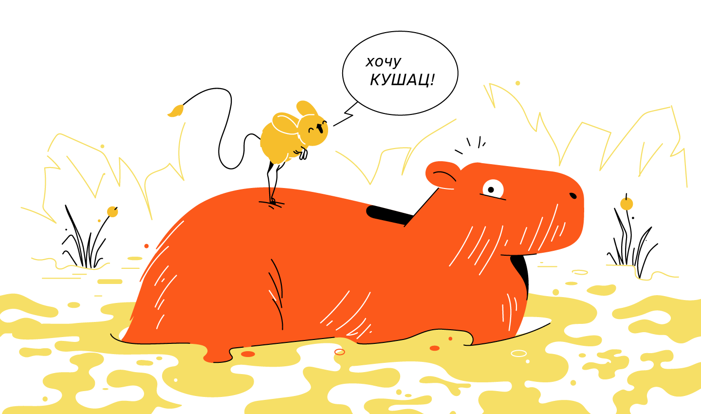
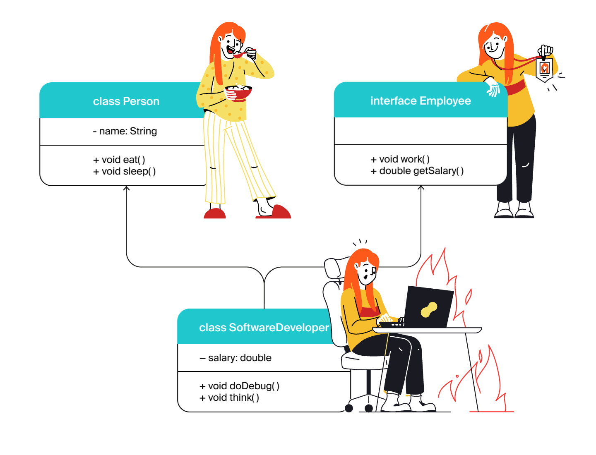

# Урок 9. Абстракция и полиморфизм


# Требования к сдаче работы
Задание выполняется в среде программирования Idea. Результат надо разместить в своем репозитории на GitHub.
Прислать в гугл-формы(размещенная на моем сайте) ссылку на репозиторий.


***Критерии оценивания***
* Оценка 5 - надо сделать все пять заданий.
* Оценка 4 - надо сделать любые три задания.
* Оценка 3 - надо сделать одно любое задание.

1. [Введение в тему](#введение-в-тему)
2. [Знакомимся с абстракцией](#знакомимся-с-абстракцией)
   * [Создаём абстрактный класс](#создаём-абстрактный-класс)
   * [Добавляем методы](#добавляем-методы)
     - [Обычные методы в абстрактном классе](#обычные-методы-в-абстрактном-классе)
     - [Абстрактные методы в абстрактном классе](#абстрактные-методы-в-абстрактном-классе)
   * [Создаём наследников абстрактного класса](#создаём-наследников-абстрактного-класса)
   * [Создаём объекты классов-наследников](#создаём-объекты-классов-наследников)
3. [Задание 1](#задание-1)
4. [Интерфейсы в Java](#интерфейсы-в-java)
    * [Что такое интерфейс](#что-такое-интерфейс)
    * [Объявляем и реализуем интерфейс](#объявляем-и-реализуем-интерфейс)
    * [Множественная реализация интерфейсов](#множественная-реализация-интерфейсов)
5. [Задание 2](#задание-2)
6. [Полиморфизм](#полиморфизм)
   * [Полиморфизм и интерфейсы](#полиморфизм-и-интерфейсы)
   * [Полиморфизм и наследование](#полиморфизм-и-наследование)
   * [Полиморфизм: объединяем вместе](#полиморфизм-объединяем-вместе)

<details>
<summary>Введение в тему</summary>

# Введение в тему

Вы уже знаете, что в основе объектно-ориентированного программирования (ООП) лежат четыре принципа: инкапсуляция, наследование, абстракция и полиморфизм. С первыми двумя вы познакомились в прошлом спринте. А в этой теме вы рассмотрите абстракцию и полиморфизм.

Вы научитесь создавать абстрактные классы и узнаете, как в Java решена проблема множественного наследования. Расширите свои знания о приведении типов и научитесь:

* реализовывать абстрактный класс из нескольких классов;
* реализовывать интерфейс из одного или нескольких классов;
* перегружать метод.

Ещё вы изучите, как концепция полиморфизма реализована в стандартной библиотеке Java, и поймёте разницу между автоматическим и явным приведением ссылочных типов.

Но обо всём по порядку! Начнём с абстракции.

</details>

<details>
<summary>Знакомимся с абстракцией</summary>

# Знакомимся с абстракцией

Абстракция (англ. abstraction, «отвлечение»), применительно к ООП, это принцип, при котором пользователю класса доступны только методы, описывающие основное поведение, а остальные детали скрыты внутри реализации. Одним из инструментов для достижения абстракции является инкапсуляция. Используя этот принцип, программист описывает, что делает класс, а не то как он это делает.

Например, когда вы спрашиваете у своей умной колонки «Какая завтра будет погода?», запускается примерно такая цепочка действий:

* голосовой помощник анализирует ваш вопрос;
* переводит его в машинный код, понятный компьютеру;
* отправляет запрос на сервер;
* получает данные о погоде;
* переводит их в голосовое представление;
* и наконец воспроизводит ответ.

Всё это выполняется молниеносно, совершенно незаметно для пользователя. Вам не нужно понимать, какие процессы происходят внутри колонки, чтобы взаимодействовать с ней. Достаточно знать, что она умеет отвечать на вопросы.

Таким образом, разработчики предоставили вам простой в использовании голосовой интерфейс и дали возможность **абстрагироваться** от деталей его реализации.


Именно принцип абстракции в ООП позволяет программисту работать с объектами и классами, даже если он не знает, как они устроены и какие алгоритмы скрыты в их реализации.

Например, для работы с объектами класса `ArrayList` вам не обязательно знать о том, что они хранят элементы в обычном массиве и создают новый, если в старом заканчивается свободное место. Вам достаточно знать, что они умеют хранить элементы и добавлять новые.

А вот ещё один пример абстракции. Вы работали с классом `Random`, 
когда изучали цикл `while`. Чтобы сгенерировать случайное число,
нужно вызвать метод `nextInt(int bound)`. 
А вот конкретный алгоритм, реализованный внутри этого класса и 
отвечающий за генерацию, знать совсем не обязательно.

## Создаём абстрактный класс

Абстрактный класс — это базовый класс, у которого не может быть экземпляров.
На его основе создаются обычные классы, объединённые общими чертами.

В абстрактном классе могут быть различные поля и даже конструкторы,
основное отличие заключается в методах. 
Наряду с конкретными методами он может содержать и абстрактные — заготовки 
методов без реализации (без тела метода), только с их описанием. 
То есть абстрактные заготовки с информацией о том, **что** сможет делать объект. 
А реализация методов, то есть то, **как** объект будет что-то делать, 
будет находиться в классах-наследниках этого абстрактного класса.

Рассмотрим, как устроены абстрактные классы и для чего они нужны, 
на примере жаб и лягушек. И те, и другие относятся к одному классу животных — амфибиям.
И действительно, у них много общих черт:
* строение тела (четыре конечности, голова и отсутствие хвоста),
* гастрономические предпочтения (они едят насекомых),
* способ размножения (откладывают икру) и прочее.

Но есть и различия. И те, и другие умеют передвигаться по суше и дышать,
правда, делают это разными способами:

* лягушки прыгают, а жабы ходят;
* лягушки дышат лёгкими и кожей, а жабы — только лёгкими.

Допустим, нам нужно написать программу, 
в которой будет два класса — `Frog` (англ. «лягушка») и `Toad` (англ. «жаба»). 
Если у этих классов не будет общего родителя, то, 
во-первых, у нас появится много повторяющегося кода, а во-вторых, 
не будет прослеживаться их сходство.

Удобнее будет создать общий для них класс `Amphibian` (англ. «амфибия») и 
перечислить в нём названия методов, которые относятся ко всем земноводным: 
есть, размножаться, передвигаться, дышать. 
Это и будет нашей заготовкой для будущих амфибий — абстрактный класс `Amphibian`! 
А `Frog` и `Toad` станут его классами-наследниками, 
в которых пропишем конкретную реализацию методов: прыгучесть для лягушек, 
ходьбу для жаб и так далее.


Пришло время объявить **абстрактный** класс. 
Для этого нужно указать специальное ключевое слово `abstract`:

```java
public abstract class Amphibian {
    
} 
```

Отлично! Получился абстрактный класс `Amphibian`, который будет описывать всех 
земноводных животных.

У абстрактных классов есть одна важная особенность: 
**у них не может быть объектов**.
В природе тоже из икры не может появиться какая-нибудь абстрактная амфибия — 
она всегда будет либо жабой, либо лягушкой (или другим конкретным представителем вида земноводных).

Создавать объекты, относящиеся к абстрактным классам, 
можно в классах-наследниках. Об этом расскажем дальше.


```java
public class Practicum {

    public static void main(String[] args) {
        Amphibian abstractAmphibian = new Amphibian();
    }
}

abstract class Amphibian {
    
}
```
```
Если же вы всё-таки попытаетесь в своей программе создать абстрактную амфибию, 
Java выдаст ошибку: “`Amphibian is abstract; cannot be instantiated`” 
(англ. «`Amphibian` — абстрактный класс; у него не может быть объектов»).

```

> 💡 В коде стандартной библиотеки Java есть много абстрактных классов. 
> Например, в классе AbstractList представлены заготовки методов, 
> которые реализованы в классе-наследнике ArrayList. 
> Коллекция LinkedList тоже наследуется от AbstractList, 
> поэтому набор её базовых методов такой же, как и у ArrayList, 
> но способ хранения данных внутри класса другой.


## Добавляем методы

Итак, вы объявили абстрактный класс `Amphibian`. 
Теперь добавим в него методы, которые в абстрактных классах могут быть двух видов:

* обычные (они пишутся с реализацией, которая будет общей для всех классов-наследников);
* и абстрактные (они указываются без реализации, потому что у каждого из классов-наследников она будет своя).

Рассмотрим каждый из них подробнее.

### Обычные методы в абстрактном классе
Если у группы разных объектов реализация какого-то действия совпадает, то её лучше написать сразу в абстрактном классе, внутри обычного метода. В таком случае не придётся дублировать один и тот же код во множестве классов.

Например, и лягушки, и жабы одинаковым образом реализуют метод `eat()` — и те, и другие с удовольствием едят насекомых. Поэтому можно сделать его общим. 
Для этого внутри абстрактного класса объявим обычный метод `eat()` и напишем его реализацию:

```java
public abstract class Amphibian {

    public void eat() { 
        System.out.println("Кушаю насекомых!");
    }
} 
```

Теперь метод `eat()` и его реализация будут общими для всех классов-наследников абстрактного класса `Amphibian`.

### Абстрактные методы в абстрактном классе

Как вы выяснили, у лягушек и жаб есть ещё и такие совпадающие 
действия — передвигаться по суше и дышать, но реализуют они их разными способами. 
Чтобы корректно отобразить это в программе, нам понадобятся **абстрактные методы**.

При объявлении абстрактного метода указывается только его 
сигнатура(_имя метода вместе с упорядоченным набором его параметров._) и 
тип возвращаемого значения, а тело не требуется.

Абстрактные методы дают информацию только о том, 
что сможет делать объект класса-наследника. Например, передвигаться по суше — `move()`. 
Информацию о том, как именно он будет это делать (прыгать или ходить),
будут содержать классы-наследники абстрактного класса `Amphibian` — `Frog` и `Toad`.

Чтобы объявить абстрактный метод, 
перед типом возвращаемого значения необходимо указать ключевое слово `abstract`. 
Тело метода при этом будет отсутствовать — вместо него ставится точка с запятой:

```java
public abstract class Amphibian {

    public void eat() { // обычный метод с реализацией
        System.out.println("Кушаю насекомых!");
    }

    public abstract void move(); // абстрактный метод без реализации
}
```

Метод `move()` будет общим для всех классов-наследников абстрактного класса `Amphibian`,
но реализовывать его они будут по-разному. Как именно — расскажем дальше.

Бывают случаи, когда разработчику нужно создать базовый класс с общей логикой. 
Тогда абстрактных методов в абстрактном классе может не быть.

Например, в математике есть фигура параллелограмм — четырёхугольник, 
у которого противоположные стороны попарно параллельны. 
Частные случаи параллелограмма — ромб, квадрат и прямоугольник.
У них есть два одинаковых свойства — высота и ширина, 
а также общий способ подсчёта площади фигуры.


В коде это можно представить следующим образом:

```java
public abstract class Parallelogram { // объявление абстрактного класса
    private double height; // высота
    private double width; // ширина

    // класс будет содержать только обычный метод
    // для нахождения площади
    public double getArea() { // 
        return height * width;
    }
}
```
Абстрактный класс, в котором есть только обычные методы, 
всё равно будет абстрактным. 
А вот если в обычном классе появится хотя бы один абстрактный метод — 
нужно будет этот класс объявить абстрактным, иначе возникнет ошибка.

### Создаём наследников абстрактного класса

Абстрактный класс — это только заготовка,
которая становится конкретной и реализуется в полной мере только в классах-наследниках.

Класс-наследник должен реализовать 
все унаследованные абстрактные методы, 
иначе при компиляции программы возникнет ошибка:
“`<Class name> is not abstract and does not override abstract method <method name> in 
<abstract class name`>” (англ. «[Класс] не является абстрактным и не переопределяет метод из [абстрактного класса]»).

От абстрактного класса `Amphibian` с помощью ключевого слова `extends` объявим 
два класса-наследника — `Frog` и `Toad`. 
И опишем в них реализацию абстрактного метода `move()`. 
Для этого укажем сигнатуру метода и напишем тело метода в фигурных скобках с 
аннотацией `@Override`:

`Frog.java`
```java
public class Frog extends Amphibian {

    @Override
    public void move() {
        System.out.println("Я передвигаюсь по суше прыжками.");
    }

}
```

`Toad.java`
```java
public class Toad extends Amphibian {

    @Override
    public void move() {
        System.out.println("Я важно хожу.");
    }

}
```

> Допустим, разработчик не хочет реализовывать в классе-наследнике 
> все абстрактные методы базового класса. 
> Тогда он обязательно должен объявить класс-наследник также абстрактным.


### Создаём объекты классов-наследников

У абстрактного класса не может быть объектов. 
Зато они могут быть у его классов-наследников.
И объявляются эти объекты через конструктор конкретного класса.

Например, чтобы создать экземпляр класса `Frog`, 
необходимо вызвать его конструктор `new Frog()`:

```java
public class Practicum {

    public static void main(String[] args) {
        Frog frog = new Frog();
        System.out.println("Привет! Я - зелёная лягушка.");
        frog.move();

        Toad toad = new Toad();
        System.out.println("Привет! Я - коричневая жаба.");
        toad.move();
    }

}
```

Обратите внимание, что при создании объектов в программе будет
вызван конструктор конкретного класса `Frog` или `Toad`, а не `Amphibian`.

Абстрактный класс содержит конструктор по умолчанию, 
но вы можете определить вместо него любые конструкторы с параметрами.

Например, создадим общую переменную `color` в абстрактном классе `Amphibian` и будем передавать в неё конкретный цвет из классов-наследников:

`Amphibian.java`
```java
public abstract class Amphibian {
    private String color;

    protected Amphibian(String color) {
        this.color = color;
    }

    public abstract void move();

    public abstract String getColor();

    public void eat() {
        System.out.println("Кушаю насекомых");
    }

}
```
У абстрактного класса `Amphibian` появился конструктор с параметром! 
До этого конструкторы по умолчанию классов-наследников обращались к
конструктору родителя без параметров. Но теперь его нет, поэтому возникнет ошибка.

Чтобы её исправить, необходимо доработать классы `Frog` и `Toad`. 
Они должны вызывать конструктор абстрактного класса с параметром `color`:

`Frog.java`

```java
public class Frog extends Amphibian {

    protected Frog() {
        super("зеленая");
    }

    @Override
    public void move() {
        System.out.println("Я передвигаюсь по суше прыжками.");
    }

    @Override
    public String getColor() {
        return color;
    }
}
```
`Toad.java`
```java
public class Toad extends Amphibian {

    protected Toad() {
        super("коричневая");
    }

    @Override
    public void move() {
        System.out.println("Я важно хожу.");
    }

    @Override
    public String getColor() {
        return color;
    }
}
```

Теперь, когда вы создаёте объекты классов `Frog` и `Toad`, 
вам не нужно указывать, зелёные они или коричневые.
Цвет находится внутри этих классов и одинаков для всех их объектов.

> Если у большинства классов-наследников 
> реализация какого-нибудь метода совпадает 
> — её можно перенести в абстрактный класс, чтобы избежать дублирования. 

Но при этом метод будет возвращать разное значение для разных классов: 
это будет зависеть от значения переменной color, переданной в конструктор.

Например, реализация метода `getColor()` у классов `Frog` и `Toad` получилась одинаковой.
Вынесем её в базовый класс `Amphibian`:

`Practicum.java`

```java
public class Practicum {

    public static void main(String[] args) {
        Frog frog = new Frog();
        System.out.println("Привет! Я - " + frog.getColor() + " лягушка.");
        frog.move();

        Toad toad = new Toad();
        System.out.println("Привет! Я - " + toad.getColor() + " жаба.");
        toad.move();
    }

}
```

`Amphibian.java`

```java
public abstract class Amphibian {
    protected String color;

    protected Amphibian(String color) {
        this.color = color;
    }

    public abstract void move();

    public String getColor() {
        return color;
    }

    public void eat() {
        System.out.println("Кушаю насекомых");
    }

}
```

`Frog.java`
```java
public class Frog extends Amphibian {

    protected Frog() {
        super("зеленая");
    }

    @Override
    public void move() {
        System.out.println("Я передвигаюсь по суше прыжками.");
    }

}
```
`Toad.java`
```java
public class Toad extends Amphibian {

    protected Toad() {
        super("коричневая");
    }

    @Override
    public void move() {
        System.out.println("Я важно хожу.");
    }

}
```
> Теперь классы-наследники могут использовать реализацию метода из родительского класса либо переопределить её.
</details>

<details>
<summary>Задание 1 </summary>

# Задание 1

В уроке вы столкнулись с задачей выбора методов будущего абстрактного класса. 
Такие решения лучше принимать до написания программы. 
Этот этап — проектирование будущего решения, отличает дилетантов от профессионалов. 
Теперь, опираясь на результаты этапа проектирования, 
вы можете реализовать свою иерархию классов для питомцев.

У любого домашнего питомца `Pet` есть несколько действий:

* спать `sleep()` (при вызове этого метода ваша программа должна выводить слово Сплю),
* играть `play()` (программа должна вывести Играю)
* издавать какой-то звук `giveVoice()`

а также свойство — количество лапок `pawsCount`.   

Дополнительно к базовым возможностям, 
кошка может поймать мышку `catchMouse()` (в этом случае выведите `Поймала мышку!`), 
хомяк — спрятать еду `hideFood()` (`Вся еда — в щёчках!`), 
а собака — принести палку `bringStick()` (`Принёс палочку, как хороший мальчик!`).

`Practicum.java`
```java
public class Practicum {

    public static void main(String[] args) {
        Cat cat = new Cat();
        cat.catchMouse();
        cat.giveVoice();

        Dog dog = new Dog();
        dog.bringStick();
        dog.play();

        Hamster hamster = new Hamster();
        hamster.hideFood();
        hamster.sleep();

        Fish fish = new Fish();
        fish.sleep();

        Spider spider = new Spider();
        System.out.println("У паука " + spider.getPawsCount() + " лапок.");
    }

}
```

`Pet.java`
```java
public class Pet {
}
```

`Fish.java`
```java
public class Fish {
}
```

`Spider.java`
```java
public class Spider {
}
```
`Dog.java`
```java
public class Dog {
}
```

`Cat.java`
```java
public class Cat {
}
```

`Hamster.java`
```java
public class Hamster {
}
```

# Подсказки

* Чтобы объявить абстрактный класс, используйте ключевое слово `abstract`
перед объявлением класса — `public abstract class Pet`.
* Чтобы указать, что классы наследуется от абстрактного, 
используйте ключевое слово `extends` и название абстрактного класса — 
`public class Cat extends Pet`.
* Реализации методов `sleep()`, `play()` 
у всех питомцев совпадают — эти методы можно вынести в абстрактный класс
в виде обычных, не абстрактных методов.

* Во всех классах есть метод с одинаковой сигнатурой `giveVoice()`,
но значение, которое возвращает метод, отличается. 
Это можно выразить с помощью добавления в класс `Pet` 
конструктора с параметром `Pet(String voice)` и перенести метод в абстрактный класс.

* Ключевое слово `super` позволяет вызвать метод или конструктор суперкласса, 
а также обратиться к его полям. (Вызов конструктора класса-родителя через `super`
должен быть первой строкой в конструкторе класса-наследника.)

* Геттеры и сеттеры нужны для работы с полями класса, закрытыми модификатором private.

</details>


<details>
<summary>Интерфейсы в Java</summary>

# Интерфейсы в Java

Механизм наследования в Java очень удобен, но у него есть важное ограничение 
— **наследоваться можно только от одного класса**. 
Этот запрет поставлен для того, чтобы предотвратить ситуацию конфликтного наследования,
которая называется **проблемой ромба, или алмаза** (англ. _diamond problem_) и может возникать в языках с множественным наследованием.

> Встречается и более устрашающее название: убийственный ромб (алмаз) смерти (англ. deadly diamond of death).

Предположим, у нас есть абстрактный класс `Animal` (англ. «животное») с
абстрактным методом `eat()` (англ. «есть»). От класса `Animal` наследуются класс `Pet` 
(англ. «домашнее животное») и класс `Mammal` (англ. «млекопитающее»).

В каждом из них метод `eat()` реализован по-своему:
* «Кушаю еду, которую даёт мне хозяин!» — в классе `Pet`;
* «Кушаю еду, которую раздобуду сам!» — в классе `Mammal`.

Кроме этого, и у `Pet`, и у `Mammal` есть уникальные методы:

* `playWithToy()` (англ. «играть с игрушкой»), актуальный для домашних питомцев,
* `feedWithMilk()` (англ. «кормить потомство молоком»), характерный для млекопитающих.

А теперь представьте, что нам нужно создать ещё один класс — `Cat` (англ. «кошка»).
Он должен описывать кошку, которая является и млекопитающим, 
и домашним животным. 

В языке с множественным наследованием было бы удобно унаследовать класс `Cat` и от `Pet`,
и от `Mammal`, потому что кошка совмещает в себе 
уникальные методы и домашних питомцев, и млекопитающих.

Но и у `Pet`, и у `Mammal` есть общий метод `eat()` — с разными реализациями. 
Какую же из них в таком случае должен использовать класс `Cat` при вызове метода `eat()` 
у своего объекта?


Это и есть проблема ромба. Из-за неё программа бы не смогла выполнить метод `eat()`
и завершила бы работу с ошибкой. Или ещё хуже: выполнила бы не ту реализацию, 
на которую рассчитывал разработчик.
Именно поэтому в `Java` и запрещено множественное наследование: 
ещё на стадии компиляции будет выдана ошибка.

И всё же в некоторых случаях сложная иерархия необходима. 
Например, чтобы обозначить, что кошка — это и млекопитающее,
и домашний питомец. Для этого используют **интерфейсы**. Рассмотрим подробнее, что это такое.


## Что такое интерфейс

Чтобы, с одной стороны, обойти ограничение множественного наследования,
а с другой — решить проблему ромба, в Java добавили **интерфейсы** (англ. interface — «взаимодействие»).

В обычной жизни вы не раз сталкивались с интерфейсами. 
Например, у любого автомобиля есть педаль газа, педаль тормоза и руль — это интерфейс, 
с помощью которого водитель взаимодействует с машиной. 
Интерфейс описывает общую концепцию функциональности (автомобиль умеет набирать и 
снижать скорость, менять направление движения), 
а её конкретная реализация (форма педалей, дизайн руля) зависит от производителя.

В программировании **интерфейс** (англ. _interface_)— это набор сигнатур методов, 
которые описывают функциональность объектов относящихся к интерфейсу, 
но не реализуют её. 
Интерфейс может быть имплементирован, или реализован (от англ. _implement_ — «реализовывать»), 
его классах-реализациях, которые наполняют методы конкретным поведением. 
Можно воспринимать интерфейс как контракт: класс, который реализует интерфейс,
обязуется выполнять методы, описанные в нём.

На основе интерфейса нельзя создавать объект: у него нет конструктора по умолчанию 
и в него нельзя добавить конструкторы с параметрами.

В чём-то интерфейсы похожи на абстрактные классы, но всё же между ними есть различия. И самое главное — концептуальное:
* Абстрактные классы нужны для того, чтобы у всех классов-наследников создавать 
и поддерживать общую _структуру_. 
Они как бы говорят: «Все мои наследники будут похожи на меня: и свойствами, и методами!».

* Интерфейсы нужны для обозначения, что класс-реализация обладает 
определённой функциональностью. Их девиз мог бы быть таким: «Объекты класса, 
который имплементирует меня, умеют делать кое-что определённое!».


Представим, что нам нужно написать приложение для орнитологов-любителей.
Первым делом создадим абстрактный класс `Bird`, который описывает птиц. 
А дальше нужно решить: если мы прямо внутри него создадим абстрактный метод `fly()`, 
то что делать с пингвинами, страусами и другими птицами, которые не летают?

Можно, конечно, вместо одного создать два абстрактных класса:
для летающих и для нелетающих птиц. Они будут различаться всего лишь одним параметром,
а в остальном — дублировать друг друга. Это явно не лучшее решение.

Правильнее будет функциональность полёта вынести в интерфейс 
`Flyable` (от англ. «способный летать») с относящимися к нему методами взлёта, 
посадки и так далее. Все классы-наследники абстрактного класса `Bird`, 
описывающие летающих птиц, будут реализовывать этот интерфейс.


Интерфейс лишь указывает, что класс, реализующий его, обладает функциональностью, 
которая описана в этом интерфейсе. В нашем примере это — способность летать.

При этом один и тот же интерфейс может реализовывать множество разных, 
ни чём больше не связанных друг с другом классов. 
И в то же время один и тот же класс может реализовывать множество разных интерфейсов. 
Таким образом, при необходимости можно применить этот же интерфейс `Flyable` не только к птицам, 
но и к летучим мышам, самолётам, летающим белкам или воздушным змеям!

## Объявляем и реализуем интерфейс

Предположим, у нас есть готовое приложение-календарь, которое реализовано в классе `CalendarApp`. 
И мы хотим добавить в него новую функцию — возможность создавать, редактировать и 
удалять заметки. Для решения этой задачи удобнее всего будет создать отдельный интерфейс
с нужным нам функционалом. Назовём его `NoteBook`.

> 💡 В Java названия интерфейсов как правило являются прилагательными и заканчиваются 
> на суффикс -able (например, Serializable, Clonable или Iterable).
> Но иногда разработчики отступают от этого правила даже в коде 
> стандартной библиотеки — например, когда интерфейс представляет 
> собой семейство классов. В этом случае интерфейсы называют именами существительными 
> (например, List и Map).


Объявление интерфейса похоже на объявление класса, только вместо `class` 
используется ключевое слово `interface`. 
Внутри указываются методы без реализации: все методы интерфейса являются абстрактными 
по умолчанию. Мы пока добавим только один из них:

```java
public interface NoteBook { // Объявление интерфейса
    void addNote(String note); // Сигнатура метода добавления заметки
}

```

Модификаторы доступа писать не нужно — все методы интерфейса по умолчанию являются публичными.

Итак, объявили интерфейс `NoteBook`. Теперь имплементируем его в классе `CalendarApp`.
Чтобы класс реализовывал интерфейс, необходимо после названия класса указать ключевое
слово `implements` и имя интерфейса, 
а над реализацией метода интерфейса указать аннотацию `@Override` :

```java
import java.util.ArrayList;
import java.util.List;

public class CalendarApp implements NoteBook {
    List<String> notes = new ArrayList<>();

    @Override
    public void addNote(String note) {
        notes.add(note);
        System.out.println("Заметка успешно добавлена!");
    }
}

```

> Класс обязательно должен либо реализовать все методы интерфейса, 
> либо объявить себя абстрактным — иначе при компиляции возникнет ошибка:
> “`<Class name> is not abstract and does not override abstract method <method name> 
> in <interface name>`” 
> (англ. «[Класс] не является абстрактным и не переопределяет метод из [интерфейса]»).

В интерфейс `NoteBook` был добавлен метод для удаления 
заметок — `deleteNote(int index)`. 

```java
import java.util.ArrayList;
import java.util.List;

interface NoteBook {
    void addNote(String note);

    void deleteNote(int index);
}

class CalendarApp implements NoteBook {
    List<String> notes = new ArrayList<>();

    @Override
    public void addNote(String note) {
        notes.add(note);
        System.out.println("Заметка успешно добавлена!");
    }
    @Override
    public void deleteNote(int index)
    {
        if (index >= 0 && index < notes.size() )
        {   notes.remove(index);
            System.out.println("Заметка успешно удалена!");
        }
        else {
            System.out.println("Неверный индекс для удаления заметки");
        }
    }
}

public class Practicum {

    public static void main(String[] args) {
        CalendarApp noteBook = new CalendarApp();
        noteBook.addNote("Зайти в магазин после работы.");
        noteBook.addNote("Позвонить маме.");

        noteBook.deleteNote(0);
    }

}
```

В интерфейсе можно объявить поля, но они всегда будут **статическими константами**(Поля интерфейсов по умолчанию будут иметь модификаторы `static final`). 
Поэтому в полях интерфейса сохраняют значения, которые нужно использовать 
в различных частях программы — их модификатор по умолчанию тоже будет `public`, как и у методов.


```java
interface Math {
    double PI = 3.141592653589793;
}

public class Practicum {

    public static void main(String[] args) {
       System.out.println("Значение числа Pi = " + Math.PI);
    }
}
```


## Множественная реализация интерфейсов

Один класс может реализовывать сразу несколько интерфейсов.

Вернёмся к примеру с птицами. Допустим, чайка в нашей программе реализует несколько интерфейсов:
`Flyable()` (от англ. «способность летать»), `Waterfowl()` (от англ. «способность плавать»),
`Hunter()` (от англ. «способность охотиться»). 
А утка только два: `Flyable()` и `Waterfowl()`.

В коде это можно описать следующим образом:
```java
public interface Flyable { // способность летать
    void fly(); //метод полёта
    void land(); //метод посадки
}

public interface Waterfowl { // способность плавать
    void swim(); // метод плаванья
}

public interface Hunter { // способность охотиться
    void hunt(); // метод охоты
}

public Seagull implements Flyable, Waterfowl, Hunter {

    @Override
    public void fly() {
        System.out.println("Парю над морем!"); 
    }

    @Override    
    public void land() {
        System.out.println("Мягкая посадка.");
    }

    @Override
    public void swim() {
        System.out.println("Качаюсь на волнах!");
    }

    @Override
    public void hunt() {
        System.out.println("Ловлю рыбку.");
    }
}

public Duck implements Flyable, Waterfowl {

    @Override
    public void fly() {
          System.out.println("Лечу над камышами!");
    }
    
    @Override
    public void land() {
        System.out.println("Смешно сажусь на воду.");
    }

    @Override
    public void swim() {
        System.out.println("Плаваю в пруду!");
    }
}

```

Возможность реализовывать несколько интерфейсов решает проблему ромба, 
которая описывалась в начале урока. Заменим классы `Animal`, `Pet` и `Mammal` на интерфейсы, 
а класс `Cat` будет их реализовывать.  
В результате получаем следующую иерархию:


В этом случае «проблемы ромба» уже не возникнет. 
Так как реализация метода `eat()` будет только одна — в классе `Cat`. 
Интерфейсы содержат только сигнатуру метода, поэтому неоднозначности, 
какую из реализаций метода вызвать, не возникнет.
Но теперь объект класса `Cat` можно использовать в качестве `Animal`, `Pet` или `Mammal`.

Начнём работать над этой схемой: дополним описание интерфейса `Pet` методом `eat() `
и добавим описание интерфейса `Mammal`:

`Mammal.java`
```java
public interface Mammal {
    // У интерфейса Mammal есть аналогичный метод
    void eat();
    void giveMilk();
}
```
`Pet.java`
```java
public interface Pet {
    int getPawsCount();
    void makeNoise();
    void play();
    //Добавляем метод eat()
    void eat();
} 
```

Чтобы указать, что класс `Cat` реализует оба интерфейса, 
необходимо перечислить их после ключевого слова implements через запятую и 
реализовать методы обоих интерфейсов. При этом «проблемы ромба» 
уже не возникнет — реализация метода `eat()` будет всего одна (в самом классе `Cat`):

```java
public class Cat implements Pet, Mammal {
    @Override
    public int getPawsCount() {
        return 4;
    }

    @Override
    public void makeNoise() {
        System.out.println("Мяу!");
    }

    @Override
    public void play() {
        System.out.println("Играю с мячиком.");
    }

    // Метод будет переопределять и метод из интерфейса Pet, и метод из интерфейса Mammal
    @Override
    public void eat() {
        System.out.println("Люблю покушать рыбку.");
    }

    @Override
    public void giveMilk() {
        System.out.println("Кормлю котят молоком.");
    }
}
```

Отлично, с множественной реализацией интерфейсов разобрались! 
Теперь объекты класса `Cat` можно использовать в программе,
указывая им любой из типов интерфейсов, которые имплементирует этот класс. 
Если нам необходимо в коде программы обращаться к кошке как к домашнему питомцу, 
мы укажем тип переменной `Pet`, а если как с млекопитающим — тип `Mammal`.


> Создайте проект и скопируйте в него код ниже и проверьте, что будут доступны только те методы, которые есть у указанного типа.

```java
public class Practicum {

    public static void main(String[] args) {
        Pet pet = new Cat();
        pet.play();
        pet.eat();
        // Такого метода в интерфейсе Pet нет - произойдет ошибка
        pet.giveMilk();

        Mammal mammal = new Cat();
        mammal.giveMilk();
        mammal.eat();
        // Такого метода в интерфейсе Mammal нет - произойдет ошибка
        mammal.play();
    }
}
class Cat implements Pet, Mammal {
    @Override
    public int getPawsCount() {
        return 4;
    }

    @Override
    public void makeNoise() {
        System.out.println("Мяу!");
    }

    @Override
    public void play() {
        System.out.println("Играю с мячиком.");
    }

    // Метод будет переопределять и метод из интерфейса Pet, и метод из интерфейса Mammal
    @Override
    public void eat() {
        System.out.println("Люблю покушать рыбку.");
    }

    @Override
    public void giveMilk() {
        System.out.println("Кормлю котят молоком.");
    }
}
interface Mammal {
    // У интерфейса Mammal есть аналогичный метод
    void eat();
    void giveMilk();
}
interface Pet {
    int getPawsCount();
    void makeNoise();
    void play();
    //Добавляем метод eat()
    void eat();
}
```

```dtd
submission/Practicum.java:8: error: cannot find symbol

        pet.giveMilk();

           ^

  symbol:   method giveMilk()

  location: variable pet of type Pet

submission/Practicum.java:14: error: cannot find symbol

        mammal.play();

              ^

  symbol:   method play()

  location: variable mammal of type Mammal

2 errors
```

Осталось совсем немного, чтобы закончить иерархию — давайте теперь унаследуем 
от `Animal` интерфейсы `Pet` и `Mammal`. 
Для того чтобы указать, что один интерфейс наследует другой,
в Java используется ключевое слово `extends`
(да, то самое, которое ранее мы использовали для наследования классов!):

```java
public interface Animal {
    int TYPES_OF_ANIMALS_COUNT = 1_600_000;

    void eat();
} 
```
```java
public interface Pet extends Animal {
    int getPawsCount();
    void makeNoise();
    void play();
    void eat();
}
```
```java
public interface Mammal extends Animal {
    void eat();
    void giveMilk();
}
```
Получается, теперь у нас кисулькены наследуют сразу три интерфейса! 
Использовать их в программе мы теперь можем,
указывая интерфейс `Animal`, который котики будут наследовать от интерфейсов `Pet` и `Mammal`:

```java
public class Practicum {

    public static void main(String[] args) {
        Pet pet = new Cat();
        pet.play();
        pet.eat();

        Mammal mammal = new Cat();
        mammal.giveMilk();
        mammal.eat();

        Animal animal = new Cat();
        animal.eat();
    }
}
class Cat implements Pet, Mammal {
    @Override
    public int getPawsCount() {
        return 4;
    }

    @Override
    public void makeNoise() {
        System.out.println("Мяу!");
    }

    @Override
    public void play() {
        System.out.println("Играю с мячиком.");
    }

    // Метод будет переопределять и метод из интерфейса Pet, и метод из интерфейса Mammal
    @Override
    public void eat() {
        System.out.println("Люблю покушать рыбку.");
    }

    @Override
    public void giveMilk() {
        System.out.println("Кормлю котят молоком.");
    }
}
interface Mammal extends Animal {
    void eat();
    void giveMilk();
}
interface Pet extends Animal {
    int getPawsCount();
    void makeNoise();
    void play();
    void eat();
}
interface Animal {
    int TYPES_OF_ANIMALS_COUNT = 1_600_000;

    void eat();
}

```

Подведём итоги. С помощью интерфейсов можно реализовать сложную иерархию сущностей, 
которую не получается сделать, используя классы.

Интерфейсы — это мощный механизм, который вы будете много использовать 
в своих программах. А
ещё они очень часто встречаются в коде стандартной библиотеки Java — например, 
уже знакомый вам класс `ArrayList` на самом деле реализует общий интерфейс 
для всех списков `List`, и в коде программы с `ArrayList`-ом можно работать, 
указывая переменной тип интерфейса, а не конкретного класса:

```java
import java.util.ArrayList;
import java.util.List;

public class Practicum {

    public static void main(String[] args) {
        List<Integer> fibonacciNumbers = new ArrayList<>();

        fibonacciNumbers.add(0);
        fibonacciNumbers.add(1);
        fibonacciNumbers.add(1);
        fibonacciNumbers.add(2);
        fibonacciNumbers.add(3);

        System.out.println("Первые 5 чисел Фибоначчи:");
        for (int i = 0; i < fibonacciNumbers.size(); i++) {
            System.out.println(fibonacciNumbers.get(i));
        }
    }

} 
```
</details>

<details>
<summary>Задание 2</summary>

# Задание 2

В этом задании вам необходимо применить полученные знания об интерфейсах и 
абстрактных классах так, чтобы связать все фигуры в единую иерархию и 
написать программу-калькулятор, вычисляющую площадь фигур: ромба, квадрата,
прямоугольника и круга. Перед тем как вы начнёте, изучите одно небольшое, но важное примечание.

### Примечание

В случае наследования интерфейсов следует быть осторожными.  
Соблюдайте логическую непротиворечивость и базовые принципы подстановки. 
Например, в этом тренажёре вам необходимо связать прямоугольник и квадрат 
в цепочку наследования. 
Если рассматривать вопрос с математической точки зрения, 
то сомнений не будет. Но с точки зрения логики методов, 
которые будут исполняться в  классах, может возникнуть парадокс.

Представьте, что у интерфейса `Прямоугольник` есть методы, 
устанавливающие ширину и высоту фигуры — `getWidth()/setWidth(int w)`
и `getHeight()/setHeight(int h)`.
А у интерфейса `Квадрат` может появиться метод `getSize()/setSize(int s)` — сторона квадрата.

В классе, который реализует интерфейс `Квадрат` вы будете вынуждены реализовать 
все три метода.  Таким образом, меняя сторону квадрата, 
вы будете неявно менять два значения: ширину и высоту фигуры. 
И такое поведение может быть неожиданным для того кода, который использует ваш объект, 
считая его `Прямоугольником`.

Чтобы избежать этого парадокса, нужно добавить в интерфейсы только общие методы.

### код 
```java
public class Practicum {

    public static void main(String[] args) {
        Rectangle rectangle = new Rectangle(4, 6);
        System.out.println("Площадь прямоугольника 4см*6см = " + rectangle.getArea());

        Square square = new Square(3);
        System.out.println("Площадь квадрата 3см*3см = " + square.getArea());

        Rhombus rhombus = new Rhombus(4, 3);
        System.out.println("Площадь ромба со стороной 4см и высотой 3см = " + rhombus.getArea());

        Circle circle = new Circle(2);
        System.out.println("Площадь круга с радиусом 2см = " + circle.getArea());
    }

}
```

```java
public class Circle {
    // Радиус круга
    private final double r;

    public Circle(double r) {
        this.r = r;
    }

    public double getArea() {
        return Math.PI * r * r;
    }
}
```

```java
// В качестве корня иерархии всех фигур необходимо использовать заготовку интерфейса Figure
public interface Figure {
    // Ниже напишите объявление метода/ов, которые будут общими для всей иерархии классов
    ...
}
```

```java
public ... Parallelogram ... {
}
```

```java
public class Rectangle {
    // Длины сторон прямоугольника
    private final double a;
    private final double b;

    public Rectangle(double a, double b) {
        this.a = a;
        this.b = b;
    }

    public double getArea() {
        return a * b;
    }
}
```

```java
public class Rhombus {
    // Длина стороны ромба
    private final double a;
    // Высота ромба
    private final double h;

    public Rhombus(double a, double h) {
        this.a = a;
        this.h = h;
    }

    public double getArea() {
        return a * h;
    }
}
```

```java
public class Square {
    // Длина стороны квадрата
    private final double a;

    public Square(double a) {
        this.a = a;
    }

    public double getArea() {
        return a * a;
    }
}
```

### Подсказки

* У классов `Square`, `Rhombus` и `Rectangle` совпадает реализация метода `double getArea()`. 
Такой метод можно вынести в абстрактный класс `Parallelogram`.
* У всех классов есть метод double `getArea()`. Поскольку сигнатура метода одинаковая,
а способ подсчёта площади фигуры внутри метода — разный, метод можно вынести в 
базовый интерфейс `Figure`.
* Классы `Square`, `Rhombus` и `Rectangle` используют одинаковый набор параметров, 
эти параметры можно вынести в абстрактный класс и создать конструктор с параметрами.
* Некоторые из фигур являются частными случаями других. 
Например, квадрат — это частный случай прямоугольника, 
а прямоугольник — частный случай параллелограмма.
Такие фигуры можно унаследовать друг от друга. 
Если затрудняетесь построить иерархию фигур, воспользуйтесь схемой:


</details>

<details>

<summary>Полиморфизм</summary>

# Полиморфизм

Пришло время познакомить вас с последним, четвёртым принципом объектно-ориентированного программирования — **полиморфизмом**.

**Полиморфизм** (в переводе с греческого означает «многообразный») — это способность принимать разные формы. 
Он встречается не только в программировании. Например, у бабочек-пестрокрыльниц весной крылья оранжевые с тёмными пятнами, а летом — тёмные с белыми полосами.

Один из ярких примеров полиморфизма в химии — модификации углерода. 
Он может принимать форму графита (и тогда его вставляют в карандаши) или форму алмаза (и тогда он отправляется на огранку к ювелиру).


### Полиморфизм и интерфейсы


В применении к языкам программирования **полиморфизм** означает способность кода, например, одного и того же метода, одинаково работать с данными разных типов.

Допустим, в программе есть интерфейс MailClient, который описывает функциональность отправки и получения писем:

```java
public interface MailClient {
    void send(String from, String to, String text);
    void recieve();
}
```

Этот интерфейс могут реализовывать разные классы: голубь, почтальон, электронная почта. 
С каждым из них программа будет работать одинаковым образом. 
Если же мы захотим отправить письмо с помощью телеграфа (или с помощью его улучшенного варианта - телетайпа), 
достаточно будет сделать так, чтобы он реализовывал интерфейс MailClient.

В коде это реализуется следующим образом:
```java
public class Dove implements MailClient {
    @Override
    public void send(String from, String to, String text) {
        System.out.println("Голубь полетел к " + to + " от " + from + " с письмом: " + text);
    }

    @Override
    public void recieve() {
        System.out.println("Голубь вернулся с ответным письмом!");
    }
}
```
```java
public class Telegraph implements MailClient {
    @Override
    public void send(String from, String to, String text) {
        System.out.println("Телеграф передал для " + to + " от " + from + " коды букв с посланием: " + text);
    }

    @Override
    public void recieve() {
        System.out.println("Телеграф напечатал ответное сообщение.");
    }
} 
```

Как вы уже знаете, на основе интерфейса нельзя создавать объекты. 
Но можно объявить переменную с типом интерфейса и присвоить ей в качестве значения объект любого класса, который реализует этот интерфейс.

```java
    MailClient mailClient; // объявили переменную с типом интерфейса MailClient
    
    if(currentCentury < 20) {
        // присваеваем переменной в качестве значения объект класса Dove
        mailClient = new Dove();
    } else {
        // присваеваем переменной в качестве значения объект класса Telegraph
        mailClient = new Telegraph();
    }
    
    // конкретный тип объекта не важен, если он реализует 
    // интерфейс MailClient, потому что у него есть метод send()
    mailClient.send();
```

Если коду требуется только функциональность, описанная в интерфейсе MailClient, 
то не важно, какой конкретный тип будет у объекта, способного отправить и получить почту. 
С телеграфом программа будет взаимодействовать так же, как с голубем — если у них одинаковый интерфейс.

Такой подход позволяет выбирать конкретную реализацию (голубь или телеграф) 
Например в зависимости от настроек программы, 

Дан интерфейс Openable, описывающий предметы, которые можно открыть, и два класса: `Can` и `Window`.
Доработаем классы таким образом, чтобы они реализовывали интерфейс Openable.

```java

class Can implements Openable {
    @Override
    public void open() {
        System.out.println("Чтобы открыть жестяную банку, нужно потянуть кольцо-ключ.");
    }
}

interface Openable {
    void open();
}

public class Practicum {

    public static void main(String[] args) {
        Openable can = new Can();
        can.open();

        Openable window = new Window();
        window.open();
    }
}

class Window implements Openable {
    @Override
    public void open() {
        System.out.println("Чтобы открыть окно, нужно повернуть ручку.");
    }
}
```

### Полиморфизм и наследование

Полиморфизм в программировании проявляется не только в особенностях работы с интерфейсами, но и в механизме наследования.
По аналогии с интерфейсами можно сохранять объект наследника в переменную с родительским типом.

Например, создадим класс, описывающий грызунов — `Rodent` (англ. «грызун»). Добавим в него методы, 
общие для всех его представителей: `crunch()` (англ. «грызть») и `sleep()` (англ. «спать»). 
Кроме них, у наследников класса `Rodent` будут и уникальные свойства:

* `dive()` (англ. «нырять») у класса `Capybara` (англ. «капибара»),
* `jump()` (англ. «прыгать») у класса `Jerboa` (англ. «тушканчик»).

Поскольку все тушканчики и капибары являются грызунами, а значит умеют спать и грызть, объекты этих классов можно сохранять в переменные с родительским типом:

```java
// тип переменной - абстрактный класс Rodent, тип присваемого объекта Capybara
Rodent a = new Capybara();
// тип переменной - абстрактный класс Rodent, тип присваемого объекта Jerboa
Rodent b = new Jerboa();
```

При этом, если вы попытаетесь, наоборот, в переменной с типом класса наследника сохранить объект с типом класса родителя, произойдёт ошибка.

```java
// нельзя присвоить объект родительского типа переменной с типом-наследником
Capybara c = new Rodent(); // Ошибка!
```

Так делать нельзя, потому что объект более общего класса `Rodent` не может полностью заменить объект расширенного класса `Capybara`.

Другими словами, капибары подходят и под общее понятие «грызун», и под частное — «капибара». 
Эти зверьки могут выступать в обеих ролях. Но общее понятие «грызун» нельзя просто так свести к частному понятию «капибара».
Объект типа `Rodent` ничего не знает про то, как нырять. И если попытаться вызвать метод `dive`, присущий капибарам, 
то объект не смог бы его выполнить. Ведь в нём нет информации об этом методе. Поэтому такое присваивание запрещено.

Запустите код .
```java
class Rodent {
    public void crunch() {
        System.out.println("Грызун грызёт что угодно.");
    }

    public void sleep() {
        System.out.println("Грызун уснул.");
    }
}

class Capybara extends Rodent {

    @Override
    public void crunch() {
        System.out.println("Капибара любит грызть кукурузу.");
    }

    @Override
    public void sleep() {
        System.out.println("Капибара крепко спит.");
    }

    public void dive() {
        System.out.println("Капибара умеет нырять.");
    }
}

public class Practicum {

    public static void main(String[] args) {
        Rodent capybara = new Capybara();
        capybara.crunch();
        capybara.sleep();
       
    }

}
```

При наследовании в Java классы связываются отношением **IS-A** (англ. «является»): 
один класс является подклассом другого. Все капибары — грызуны, но не все грызуны — капибары.



### Полиморфизм: объединяем вместе

А вот более сложный пример полиморфмизма: программистка Катя.

Да-да, полиморфизм применим и к ней тоже: дома Катя выступает в роли обычного человека, который спит и кушает, — это можно описать с помощью класса `Person`.
Но у Кати есть и дополнительная функциональность: на работе, как и любой другой наёмный сотрудник, 
она выполняет свои задачи и получает за это зарплату. Это лучше вынести в отдельный интерфейс — `Employee`, 
потому что не все люди работают. Кроме того, у Кати есть специфичные «методы», 
характерные для программистов: ей приходится часто и подолгу обдумывать решение своих задач и дебажить код.

Поэтому логично будет описать Катю как объект класса `SoftwareDeveloper`, который наследуется от класса `Person` и реализует интерфейс `Employee`.



В таких случаях говорят, что класс `SoftwareDeveloper` является **полиморфным**, потому что для него выполняется следующее условие: он связан отношением IS-A
с более чем одним типом (классом или интерфейсом).

Проверим это утверждение:
* Класс `SoftwareDeveloper` является подтипом типа `Employee` (A Software Developer IS-A Employee),
* Класс `SoftwareDeveloper` является подтипом типа `Person` (A Software Developer IS-A Person).

Но это ещё не всё! Класс `SoftwareDeveloper` также наследуется от базового класса `Object`, поэтому следующее утверждение тоже будет верным:
Класс `SoftwareDeveloper` является подтипом типа `Object` (A Software Developer IS-A Object).

> 💡 В Java все классы наследуются от класса Object. Поэтому все классы полиморфные.

> Способность одинаково работать с объектами разного типа — лишь один из видов полиморфизма. Об остальных вы узнаете дальше.

 
</details>
