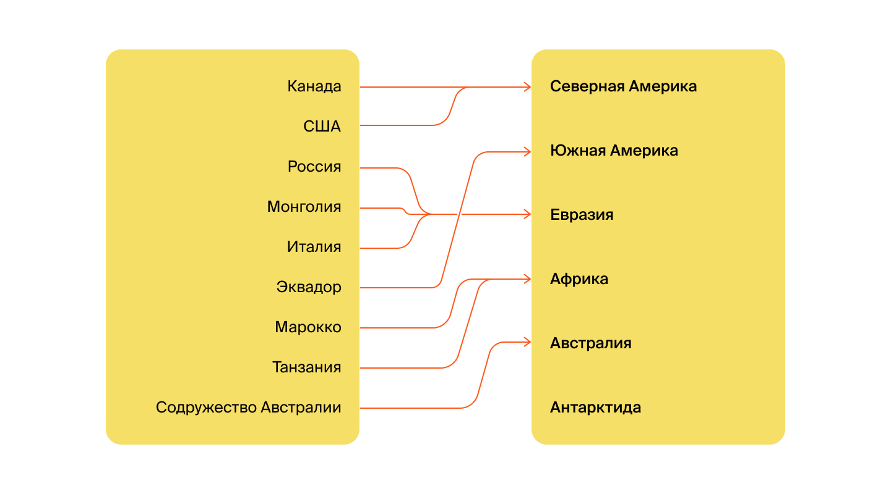
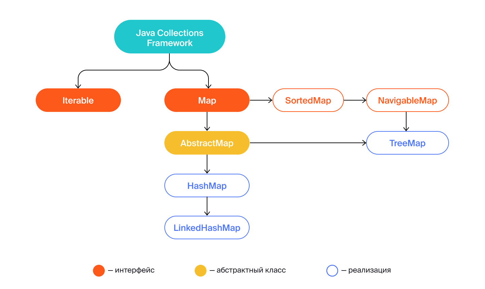
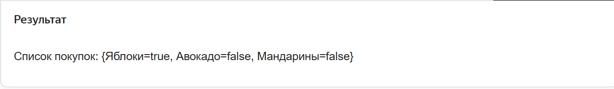
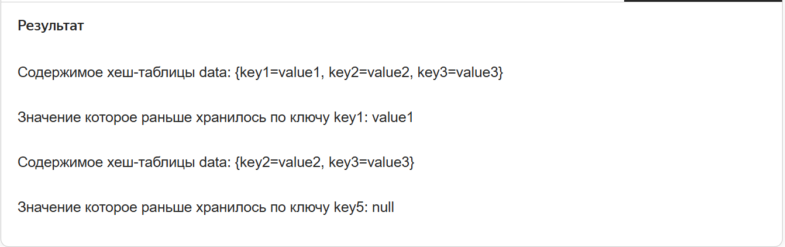
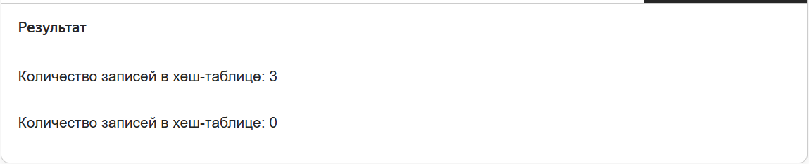
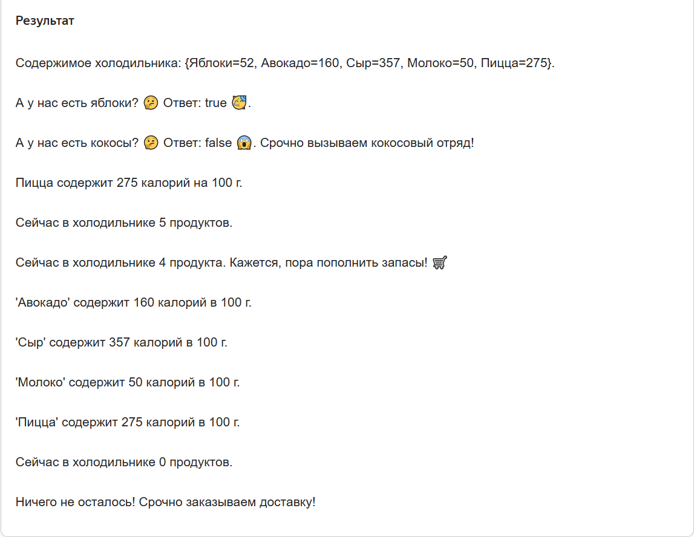
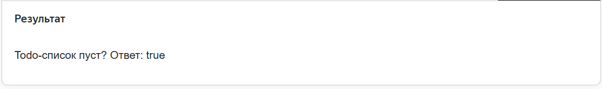

Предыдущее занятие |         &nbsp;          | Следующее занятие
:----------------:|:-----------------------:|:----------------:
[Урок 12](LESSON12.MD) | [Содержание](../README.MD) | [Урок 14](LESSON14.MD)

# Урок 13. Интерфейс Map

# Требования к сдаче работы

Задание выполняется в среде программирования Idea. Результат надо разместить в своем репозитории на GitHub.
Прислать в гугл-формы(размещенная на моем сайте) ссылку на репозиторий.

***Критерии оценивания***

* Оценка 5 - надо сделать все четыре задания.
* Оценка 4 - надо сделать любые три задания.
* Оценка 3 - надо сделать два любых задания.

<details>
<summary>
Оглавление
</summary>

# Оглавление

1. [Введение в тему](#введение-в-тему)
2. [Хеш-таблицы](#хеш-таблицы)
   * [Варианты реализации хеш-таблицы](#варианты-реализации-хеш-таблицы) 
   * [Методы интерфейса Map](#методы-интерфейса-map)
     * [put(K key, V value)](#putk-key-v-value)
     * [containsKey(Object key)](#containskeyobject-key)
     * [get(Object key)](#getobject-key)
     * [getOrDefault(Object key, V defaultValue)](#getordefaultobject-key-v-defaultvalue)
     * [size()](#size)
     * [remove(Object key) и clear()](#removeobject-key-и-clear)
     * [isEmpty()](#isempty)
     * [Задача 2](#задача-2)
     * [keySet(), values(), entrySet()](#keyset-values-entryset)
     * [Ключи бывают разные](#ключи-бывают-разные)
3. [Задание 1](#задание-1)
4. [Задание 2](#задание-2)
5. [Задание 3](#задание-3)
6. [Задание 4](#задание-4)
  

</details>

<details>
<summary>Введение в тему</summary>

# Введение в тему

Продолжаем изучать коллекции.
Вы уже познакомились с интерфейсом `Collection` и его наследниками: `List`, `ArrayList`, `LinkedList`. 
В этой теме отправимся в другие области иерархии Java Collections Framework.

Сначала остановимся на интерфейсе `Map` — базовом для хеш-таблиц.
Разберём подробнее, как они устроены и на каких алгоритмах работают.
Ещё вы узнаете об особенностях использования разных типов хеш-таблиц, которые есть в Java.

Затем перейдём к множествам (`Set`). Эта новая для вас структура данных незаменима, 
если нужно хранить уникальные элементы и при этом неважно, в каком порядке.

Вот основные пункты, которые мы подсветим:
    * какие процессы происходят внутри хеш-таблиц;
    * какие есть варианты реализации хеш-таблицы и чем они различаются;
    * какая сложность у операций с хеш-таблицами;
    * что такое множества и какие они бывают.

</details>

<details>

<summary>Хеш-таблицы</summary>

# Хеш-таблицы

[Оглавление](#оглавление)

Вы уже знакомы с хеш-таблицами. Напомним, 
что данные в них хранятся в формате `(ключ, значение)`.
В этом уроке вы изучите несколько важных понятий, которые помогут вам погрузиться
в технические нюансы устройства и работы хеш-таблиц.

## Отображение

В технической литературе и статьях хеш-таблицу иногда называют отображением. 
**Отображение** (англ. _map_) — такое сопоставление, при котором каждому объекту 
первого множества соответствует ровно один объект второго множества. Сейчас объясним.

Представьте, что у вас есть два списка: в одном — страны,
в другом — континенты. 
Нужно написать код, который будет узнавать по стране континент,
на котором она расположена. Каждой стране сопоставлен ровно один континент.
А вот на континент может указывать любое количество стран.



Перед вами отображение стран в континенты. 
В коде его можно записать в виде хеш-таблицы,
где страна будет ключом, а континент — значением:


```java
Map<String, String> countriesAndContinents = new HashMap<>();

countriesAndContinents.put("Марокко", "Африка");
countriesAndContinents.put("Танзания", "Африка");
countriesAndContinents.put("Россия", "Евразия");
countriesAndContinents.put("Италия", "Евразия");
countriesAndContinents.put("США", "Северная Америка");
countriesAndContinents.put("Франция", "Евразия");
countriesAndContinents.put("Содружество Австралии", "Австралия");
```

Или можно сделать отображение континентов в массивы стран:

```java
Map<String, String[]> continentsAndCountries = new HashMap<>();

continentsAndCountries.put("Африка", new String[] {"Марокко", "Танзания"});
continentsAndCountries.put("Евразия", new String[] {"Россия", "Италия", "Франция"});
continentsAndCountries.put("Северная Америка", new String[] {"США"});
continentsAndCountries.put("Австралия", new String[] {"Содружество Австралии"});
```

Каждому континенту-ключу соответствует ровно один массив-значение, 
содержащий в себе любое количество стран. 

У отображения, или хеш-таблицы, есть и другие имена:
**словарь** (англ. _dictionary_), **хеш** (англ. _hash_),
**ассоциативный массив** (англ. _associative array_).
А иногда программисты называют эту структуру данных **мапа** (от англ. _map_) или просто **таблица**.

В следующих уроках мы продолжим использовать слово «хеш-таблица»,
хотя с научной и математической точки зрения «отображение» является более корректным термином.

## Варианты реализации хеш-таблицы

Хеш-таблица входит в стандартную библиотеку и является частью Java Collections Framework.

Напомним, что `Collection` и `Map` — основа для всех коллекций в `Java`.
Вы уже знакомы с интерфейсом `Collection` и его наследниками: `List`, `ArrayList`, `LinkedList`.
Теперь мы подробнее расскажем про интерфейс `Map` — он базовый для всех хеш-таблиц. 



В интерфейсе `Map` описаны основные операции, которые можно выполнять с хеш-таблицей. 
`AbstractMap` — это абстрактный класс. Он содержит в себе базовую логику, 
которая является общей для всех других реализаций. `HashMap`,  `LinkedHashMap`, 
`TreeMap` — это разные реализации интерфейса Map из стандартной библиотеки `Java`.

> 💡 Обратите внимание: между `TreeMap` и `AbstractMap` есть интерфейсы `SortedMap` и `NavigableMap`. 
> В них описаны дополнительные операции, которые могут выполняться только в том случае,
> если ключи хранятся в отсортированном виде.

Реализация `HashMap` (англ. «хеш-таблица») наиболее универсальная. 
Она используется чаще всего. Ключи в ней хранятся без определённого порядка.
Обычно это не доставляет неудобств, потому что в большинстве случаев при работе 
с хеш-таблицей нужно просто узнавать значение. А для этой операции порядок ключей не важен.

Но для решения некоторых задач требуется, чтобы ключи в хеш-таблице хранились в том же порядке, 
в каком они в неё добавлялись. Например, комментарии на сайте должны отображаться 
в порядке их написания пользователями, а при перезагрузке страницы — оставаться на своих местах. 
В таком случае разработчику пригодится **связанная** (англ. _linked_) хеш-таблица —  `LinkedHashMap`. 

В других ситуациях нужны более сложные правила сортировки. Предположим, мы хотим, 
чтобы велосипеды на сайте магазина спортивных товаров были отсортированы по цвету.
Сначала должны идти красные, затем зелёные, дальше синие, а потом — все остальные.
Здесь не обойтись без упорядоченной хеш-таблицы `TreeMap`.

Кроме этих трёх существуют и другие реализации хеш-таблиц от сторонних разработчиков.
Несмотря на специфические различия, основное назначение у них всегда одно и то же — 
быстро возвращать значение, соответствующее ключу. 

Вы тоже сможете создать свою хеш-таблицу с нужными вам параметрами на основе интерфейса `Map`,
если это понадобится для решения конкретной задачи. Чуть позже мы покажем, как это делается.

## Методы интерфейса `Map`

Вы уже знакомы с основными операциями, которые есть у интерфейса Map.
Вспомним их и заодно изучим несколько новых.

Создать новую хеш-таблицу можно так: 

```java
Map<String, Boolean> shoppingList = new HashMap<>();
```
Хеш-таблица `shoppingList` (англ. «список покупок») в качестве ключа принимает строку `String` (название товара),
а в качестве значения — логический тип `boolean` (`true` — если товар уже куплен, `false` — если ещё не куплен). 

Обратите внимание: при объявлении хеш-таблицы слева мы указали `Map`, а справа — `HashMap`. 
Такой подход позволяет избежать жёсткой привязки переменной `shoppingList` 
к конкретной реализации интерфейса `Map`. 
Потом, если это потребуется, можно будет легко поменять реализацию хеш-таблицы,
всего лишь изменив код в этой строчке. 

### **`put(K key, V value)`**

Пара `(ключ, значение)` называется запись (англ. _entry_). 
Для добавления новой записи в хеш-таблицу, нужно вызвать метод `put(K key, V value)`,
где `key` — это ключ, а `value` —  значение. 

Попробуйте добавить в список покупок товар, который вы хотели бы купить.

```java
import java.util.HashMap;
import java.util.Map;

public class Practicum {
    public static void main(String[] args) {
       Map<String, Boolean> shoppingList = new HashMap<>();

       shoppingList.put("Яблоки", true); // этот товар уже куплен
       shoppingList.put("Авокадо", false); // этот товар ещё не куплен
       shoppingList.put("Мандарины", false); // этот товар тоже пока ещё не куплен

       System.out.println("Список покупок: " + shoppingList);
		}
}
```



Если при добавлении новой записи окажется, что такой ключ в хеш-таблице уже есть,
то соответствующее ему значение будет перезаписано. 

Представьте, что вы работаете в игровой студии и ваш коллега создаёт рейтинг 
всех игроков по количеству очков. Для решения этой задачи он выбрал хеш-таблицу,
где в ключе хранится имя игрока, а в значении — количество очков.
Но он не предусмотрел, что имена у игроков не уникальные: в игре может быть много Алексов, Денисов и Анджел.
Поэтому каждый новый игрок будет перезаписывать количество очков другого игрока с таким же именем. 

Будьте аккуратны и всегда выбирайте в качестве ключа что-то уникальное.
В случае с игрой это может быть ID игрока, который генерируется при регистрации.

### `containsKey(Object key)`

Чтобы избежать случайного изменения значения, можно сначала проверить,
содержится в хеш-таблице конкретный ключ или нет. Для этого используется метод `containsKey(Object key)`, 
где `Object` — это тип ключа, а `key` — сам ключ, который мы ищем. Метод возвращает булево значение.

### `get(Object key)`

Чтобы получить значение по ключу, нужно вызвать метод `get(Object key)`
и передать в него нужный ключ — это вы уже знаете. 
Но у этого метода есть важная особенность: **если в хеш-таблице по 
запрошенному ключу значения нет, то метод вернёт `null`.**
Поэтому часто Java-программисты ещё до вызова `get(Object key)` проверяют 
с помощью метода `containsKey(Object key)`, хранится искомый ключ в хеш-таблице или нет.

## `getOrDefault(Object key, V defaultValue)`

Этот метод часто используют для защиты от `NullPointerException`. 
В случае если искомого ключа `(Object key)` в хеш-таблице нет,
вернётся **значение по умолчанию** (англ. _default_), 
которое передаётся в метод вторым параметром `(V defaultValue)`. 

Посмотрим, как работает метод `getOrDefault(Object key, V defaultValue)`,
на примере задачи поиска почтового индекса по адресу. 
Если адреса в хеш-таблице нет, то будет возвращён почтовый индекс, указанный по умолчанию — `000000`: 

```java
String zip = zipCodesByStreet.getOrDefault("Московский проспект", "000000");
```

Эту задачу можно решить и с помощью метода `get`, 
но такой вариант менее удобен, потому что придётся написать больше кода:

```java
String zip = zipCodesByStreet.get("Московский проспект");
if (zip == null) {
    zip = "000000";
}
```

## `size()`

Чтобы узнать, сколько записей содержится в хеш-таблице, нужно вызвать метод `size()`. 
Возвращаемый тип этого метода — `int`. Его максимальное возможное значение — `2 147 483 647`.
Оно совпадает с максимальным количеством записей, которое можно хранить в хеш-таблице.

Перед вами хеш-таблица `citiesCoordinates`.
Она содержит название города (в ключе) и его координаты (в значении). 
Выведем в консоль количество городов, координаты которых занесены в программу:

```java
import java.util.HashMap;
import java.util.Map;

public class Practicum {
    public static void main(String[] args) {
        Map<String, String> citiesCoordinates = new HashMap<>();

        citiesCoordinates.put("Москва", "55.7558° N, 37.6173° E");
        citiesCoordinates.put("Новосибирск", "54.9833° N, 82.8964° E");
        citiesCoordinates.put("Париж", "48.8566° N, 2.3522° E");
        citiesCoordinates.put("Пекин", "39.9042° N, 116.4074° E");
        citiesCoordinates.put("Сидней", "33.8688° S, 151.2093° E");

        System.out.println("В программе есть информация о координатах " + citiesCoordinates.size() + " городов.");
    }
}
```


## `remove(Object key)` и `clear()`

Метод `remove(Object key)` возвращает значение, которое хранилось по этому ключу, 
и удаляет из хеш-таблицы соответствующую пару `(ключ, значение)`. 
Если по такому ключу ничего не хранилось, метод вернёт `null`.

Для удаления из хеш-таблицы всех данных разом есть отдельный метод — `clear()`.
Этот метод ничего не возвращает в ответ.

```java
import java.util.HashMap;
import java.util.Map;

public class Practicum {
    public static void main(String[] args) {
        Map<String, String> data = new HashMap<>();
        data.put("key1", "value1");
        data.put("key2", "value2");
        data.put("key3", "value3");

        System.out.println("Содержимое хеш-таблицы data: " + data);

        String key1Value = data.remove("key1");
        System.out.println("Значение которое раньше хранилось по ключу key1: " + key1Value);
       
        System.out.println("Содержимое хеш-таблицы data: " + data);

        String key5Value = data.remove("key5");
        System.out.println("Значение которое раньше хранилось по ключу key5: " + key5Value);
    }
}
```



Запустите код и убедитесь, что метод `clear()` удалил все данные из хеш-таблицы.

```java
import java.util.HashMap;
import java.util.Map;

public class Practicum {
    public static void main(String[] args) {
        Map<String, String> data = new HashMap<>();
        data.put("key1", "value1");
        data.put("key2", "value2");
        data.put("key3", "value3");

        System.out.println("Количество записей в хеш-таблице: " + data.size());

        data.clear();

        System.out.println("Количество записей в хеш-таблице: " + data.size());
    }
}
```



## `isEmpty()`

Метод `isEmpty()` проверяет, хранится ли что-то в хеш-таблице или она пока пустая.
Если в хеш-таблице пусто, вернётся `true`, а если хотя бы одна запись уже есть — `false`.

## `keySet()`, `values()`, `entrySet()`

Если вам нужно выполнить итерацию по данным, которые хранятся внутри хеш-таблицы, 
сделать это можно несколькими способами: 
* метод `keySet()` — итерирует по всем ключам;
* метод `values()` — итерирует по всем значениями;
* метод `entrySet()` — итерирует по всем записям. Этот вариант удобен, 
когда во время итерации нужно иметь доступ одновременно и к ключу, и к значению.

---

Перед вами программа, которая хранит информацию о калорийности разных продуктов (из расчёта на 100 грамм). Изучите её код и запустите его.
Ещё вы можете попробовать:
* добавить в холодильник свои любимые продукты (их калорийность можно посмотреть в интернете);
* изменить код таким образом, чтобы в терминале появилось сообщение «Всё в порядке!».

```java
import java.util.HashMap;
import java.util.Map;

public class Practicum {
    public static void main(String[] args) {
        Map<String, Integer> food = new HashMap<>();

        // добавим продукты
        food.put("Яблоки", 52);
        food.put("Авокадо", 160);
        food.put("Молоко", 50);
        food.put("Сыр", 357);
        food.put("Пицца", 275);

        // выведем содержимое в консоль
        System.out.println("Содержимое холодильника: " + food + ".");

        // проверим, что все любимые продукты на месте
        boolean hasApples = food.containsKey("Яблоки");
        System.out.println("А у нас есть яблоки? 🤔 Ответ: " + hasApples + " 🥳.");

        boolean hasCoconuts = food.containsKey("Кокос");
        System.out.println("А у нас есть кокосы? 🤔 Ответ: " + hasCoconuts + " 😱. Срочно вызываем кокосовый отряд!");

        // а сколько калорий в пицце? Давайте проверим ...
        int caloriesInPizza = food.get("Пицца");
        System.out.println("Пицца содержит " + caloriesInPizza + " калорий на 100 г.");

        // хм, а сколько продуктов в холодильнике? Сейчас посмотрим ...
        System.out.println("Сейчас в холодильнике " + food.size() + " продуктов.");

        // а не съесть ли яблоко? 
        food.remove("Яблоки");
        System.out.println("Сейчас в холодильнике " + food.size() + " продукта. Кажется, пора пополнить запасы! 🛒");

        // выведем содержимое холодильника в консоль
        for (Map.Entry<String, Integer> entry : food.entrySet()) {
            System.out.println("'" + entry.getKey() + "' содержит " + entry.getValue() + " калорий в 100 г.");
        }

        food.clear(); // удалим все записи из хеш-таблицы

        // когда в холодильнике пусто ...
        System.out.println("Сейчас в холодильнике " + food.size() + " продуктов.");

        if (food.isEmpty()) {
            System.out.println("Ничего не осталось! Срочно заказываем доставку!");
        } else {
            System.out.println("Всё в порядке!");
        }
    }
}
```


## Ключи бывают разные

В примерах кода выше в качестве ключа мы использовали типы, которые предоставляет Java, — строки и числа.
Однако ключом может стать объект любого типа. В том числе и тот, 
который вы как программист можете создать сами.

Например, во многих программах есть собственный класс `User`,
в котором хранится информация о пользователе. И если в коде 
нужно сопоставить пользователю какие-либо дополнительные данные 
(например, его почтовые адреса или приобретённые в интернет-магазине товары) — 
это можно сделать c помощью хеш-таблицы, используя в качестве ключа объект класса `User`.

Примеры объектов `User`:

```java
User { ID: 82384694727, name: Иван Петрович Ёлочкин, ... }
User { ID: 34709782136, name: Серафима Григорьевна Лесная, ... }
...
```
Но есть правило, 
которое нужно всегда соблюдать:

> если в качестве ключа используется объект собственного класса, 
> для него нужно переопределить методы `hashCode()` и equals()`.

Если этого не сделать, хеш-таблица будет работать неправильно. 
В следующих уроках мы разберём подробнее, почему для хеш-таблицы так важны эти методы.

Вот пример правильно реализованного класса `User`. 
У него переопределены методы `hashCode()` и `equals()`,
а значит, объекты этого класса можно смело использовать в качестве ключей в хеш-таблице.

```java
class User {
    Integer id;
    String name;
    String email;

    public User(Integer id, String name, String email) {
        this.id = id;
        this.name = name;
        this.email = email;
    }

    @Override
    public boolean equals(Object o) {
        if (this == o) return true;
        if (o == null || getClass() != o.getClass()) return false;

        User user = (User) o;

        return id.equals(user.id);
    }

    @Override
    public int hashCode() {
        return id.hashCode();
    }
}
```

Теперь рассмотрим несколько примеров хеш-таблиц с разными типами ключей.

Перед вами хеш-таблица, в которой хранится информация о количестве населения в разных странах. 
Это один из самых простых вариантов. Здесь ключом является строка, а значением — число:

```java
import java.util.HashMap;
import java.util.Map;

public class Practicum {
    public static void main(String[] args) {
        Map<String, Integer> population = new HashMap<>();

        population.put("Россия", 144_400_000);
        population.put("Франция", 67_060_000);
        population.put("Австралия", 25_360_000);

        System.out.println("Население стран: " + population);       
    }
}
```


Теперь чуть более сложный пример. Здесь ключом является дата, 
а в значении хранится список товаров, которые поступили на склад в этот день:

```java
import java.time.LocalDate;
import java.util.HashMap;
import java.util.Map;
import java.util.List;

public class Practicum {
    public static void main(String[] args) {
        // класс LocalDate позволяет удобно работать с датами
        Map<LocalDate, List<String>> incomingGoods = new HashMap<LocalDate, List<String>>();
        
        incomingGoods.put(LocalDate.of(2021, 9, 17), List.of("Бананы"));
        incomingGoods.put(LocalDate.of(2021, 9, 18), List.of("Яблоки", "Апельсины"));
        incomingGoods.put(LocalDate.of(2021, 9, 23), List.of("Груши"));
        System.out.println("Поступления на склад: " + incomingGoods);
    }
}
```

А вот часть кода интернет-магазина. 
В хеш-таблице `userOrders` хранятся все заказы с 
разбивкой по пользователям. 
Ключом являются объекты пользователей,
а значением — уникальные идентификаторы их заказов.
Напоминаем, что в этом случае нужно **обязательно переопределить для класса `User` методы `hashCode()` и `equals()`**!

Попробуйте переопределить для класса User метод toString().
Обратите внимание, как после этого изменится вывод на консоль — он станет более понятным.

```java
import java.util.HashMap;
import java.util.Map;
import java.util.List;

public class Practicum {
    public static void main(String[] args) {
        Map<User, List<String>> userOrders = new HashMap<User, List<String>>();

        userOrders.put(
                new User(97457, "Джо", "joe@black.com"),
                List.of("1928873467463")
        );
        userOrders.put(
                new User(29575, "Лиз", "liz@black.com"),
                List.of(
                        "9828674982082",
                        "7249804867520"
                )
        );
        userOrders.put(
                new User(57860, "Ян", "yan@black.com"),
                List.of("4758039927678")
        );

        System.out.println("Заказы: " + userOrders);
    }
}

class User {
    Integer id;
    String name;
    String email;

    public User(Integer id, String name, String email) {
        this.id = id;
        this.name = name;
        this.email = email;
    }

    @Override
    public boolean equals(Object o) {
        if (this == o) return true;
        if (o == null || getClass() != o.getClass()) return false;

        User user = (User) o;

        return id.equals(user.id);
    }

    @Override
    public int hashCode() {
        return id.hashCode();
    }
}
```

```
Результат:

Заказы: {User@17cb1=[1928873467463], User@e204=[4758039927678], User@7387=[9828674982082, 7249804867520]}
```

Программисты часто используют хеш-таблицы, и на это есть несколько причин:
* хеш-таблицы крайне универсальны и подходят для решения множества разных задач;
* ими просто пользоваться и код получается лаконичным, понятным и выразительным;
* хеш-таблицы очень быстрые. Это позволяет ускорить работу программ.

Теперь вы знаете, что есть несколько вариантов реализаций хеш-таблиц: 
`HashMap`,  `LinkedHashMap`, `TreeMap`. 
В этом уроке вы познакомились со всеми операциями, которые описаны в интерфейсе `Map`. 
И, конечно, попрактиковались в работе с ними. 

А ещё вы узнали, что при создании хеш-таблицы важно выбирать уникальные ключи. 
При этом в качестве ключа можно использовать объекты любого класса, в том числе вашего собственного.

</details>

<details>

<summary>Задание 1</summary>

## Задание 1

Перед вами программа, которая помогает спрогнозировать, 
какое количество жителей будет в крупных городах мира через год — из расчёта,
что в среднем это число увеличивается на 1% ежегодно.

Сейчас в программе есть информация далеко не обо всех городах. 
Если запустить её для неизвестного города, будет выброшено исключение.
Доработайте код таким образом, чтобы программа работала корректно даже в тех случаях,
когда информации по городу нет.

```java
import java.util.HashMap;
import java.util.Map;

public class Practicum {
    public static void main(String[] args) {
        // хеш-таблица содержит информацию о количестве жителей в разных городах
        Map<String, Integer> citiesPopulation = new HashMap<>();
        citiesPopulation.put("Москва", 12_655_050);
        citiesPopulation.put("Лондон", 8_961_989);
        citiesPopulation.put("Нью-Йорк", 8_804_190);

        // попытаемся узнать, каким будет население Парижа через год
        String city = "Париж";
        Integer cityPopulation = citiesPopulation.get(city);
        System.out.println("Через 1 год население города " + city + " будет: " + (int)(cityPopulation * 1.01));
    }
}
```
#### Подсказка

Прежде чем вызывать метод `get(Object key)`, нужно с помощью метода `containsKey(Object key) удостовериться`,
что такой город есть в хеш-таблице.

Работая с хеш-таблицами, обязательно делайте такие проверки,
чтобы сократить количество багов в вашей программе.
</details>

<details>

<summary>Задание 2</summary>

## Задание 2

Перед вами код программы для ведения списка задач. 
Сначала дополните код ответа в консоли: “Todo-список пуст? Ответ: …”.
Проверьте, как он работает. Затем очистите хеш-таблицу, чтобы в консоли появилось сообщение о том, 
что хеш-таблица пуста.

```java
import java.util.HashMap;
import java.util.Map;

public class Practicum {
    public static void main(String[] args) {
        // ключ — название задачи, значение — выполнена эта задача или ещё нет
        Map<String, Boolean> todos = new HashMap<>();

        todos.put("Выучить Java", true);
        todos.put("Найти классную работу", false);
				... // дополните код, чтобы очистить список задач

        System.out.println("Todo-список пуст? Ответ: "...// дополните кодом, который даст верный ответ
    }
}
```
#### Подсказки
* В строку с выводом ответа добавьте `todos.isEmpty()`.
* После строк, где в хеш-таблицу `todos` добавляются задачи, очистите её: `todos.clear()`

#### Ожидаемый результат



</details>


<details>
<summary>Задание 3</summary>

## Задание 3

У вас ответственное задание — нужно написать программу для авиакомпании, 
которая будет распределять пассажиров по местам в самолёте. Чтобы не усложнять,
будем считать, что места идут последовательно: 1, 2, 3, …, 50, 51, 52 и так далее.
Заполните хеш-таблицу таким образом, чтобы каждому пассажиру в ней соответствовало его место в самолёте.

```java
import java.util.HashMap;
import java.util.List;
import java.util.Map;

public class Practicum {
    // Пример списка пассажиров (на самом деле их больше)
    private static List<String> passengerNames = List.of(
            "Василий Петров",
            "Анна Ягирская",
            "Виктория Сотова",
            "Игорь Серов",
            "Людмила Ульянова"
    );

    public static void main(String[] args) {
        Map<String, Integer> seats = assignSeats(passengerNames);
        System.out.println("Места пассажиров: " + seats);
    }

    public static Map<String, Integer> assignSeats(List<String> passengerNames) {
        // Тут нужно написать код, который будет распределять места в самолёте ✈️
    }
}
```

### Подсказки

* Для начала создайте хеш-таблицу, которая будет хранить места пассажиров: 
`Map<String, Integer> seats = new HashMap<>();`.
* Чтобы у каждого следующего пассажира место было на одно больше от предыдущего,
нужна переменная-счётчик. Первое доступное место должно быть 1: `int seat = 1;`.
* Создайте цикл по всем пассажирам и в теле цикла назначьте каждому пассажиру своё место.
* Имя пассажира и назначенное место нужно сохранить в хеш-таблицу `seats`.
* После назначения места пассажиру нужно не забывать увеличивать переменную-счётчик на 1: `seat += 1;`.

</details>

<details>
<summary>Задание 4</summary>

## Задание 4

Ваш лучший друг решил открыть свою пиццерию и доставлять пиццу на дом. 
Он хочет автоматизировать все процессы, но для этого нужно собрать подробную аналитику по заказам. 
Давайте поможем ему в этом! Нужно найти самых активных клиентов — тех, кто заказывает пиццу чаще всего.

```java
import java.util.HashMap;
import java.util.Map;

public class Practicum {
    // Создадим хеш-таблицу для хранения заказов.
    // В качестве ключа будет имя клиента.
    // В качестве значения — количество заказов от этого клиента.
    private Map<String, Integer> orders = new HashMap<>();

    public static void main(String[] args) {
        Practicum pizzeria = new Practicum();
        pizzeria.openPizzeria();
        pizzeria.printStatistics();
    }

    // Начинаем принимать заказы! 🍕
    private void openPizzeria() {
        newOrder("Леонардо");
        newOrder("Донателло");
        newOrder("Рафаэль");
        newOrder("Леонардо");
        newOrder("Микеланджело");
        newOrder("Шреддер");
        newOrder("Донателло");
    }

    private void newOrder(String clientName) {
        // Сохраните новый заказ в хеш-таблицу. При обновлении счётчика заказов
        // не забудьте учесть заказы, которые уже были сделаны ранее.
    }

    private void printStatistics() {
        // Выведите собранную статистику в консоль и посчитайте общее количество заказов.
        //
        // Формат для вывода данных в консоль:
        //     Заказов от Микеланджело: 15
        //     Заказов от Леонардо: 4
        //     Всего заказов: 19
    }
}
```

### Подсказки

* Для того чтобы получить текущее количество заказов клиента, 
лучше всего подойдёт метод `getOrDefault(Object key, V defaultValue)`.
* Для добавления заказа используйте метод `put(K key, V value)`.
* Посчитать статистику проще всего в цикле, выполнив итерацию 
по всем записям. Для этого используйте метод `entrySet()`.

</details>


Предыдущее занятие |         &nbsp;          | Следующее занятие
:----------------:|:-----------------------:|:----------------:
[Урок 12](LESSON12.MD) | [Содержание](../README.MD) | [Урок 14](LESSON14.MD)