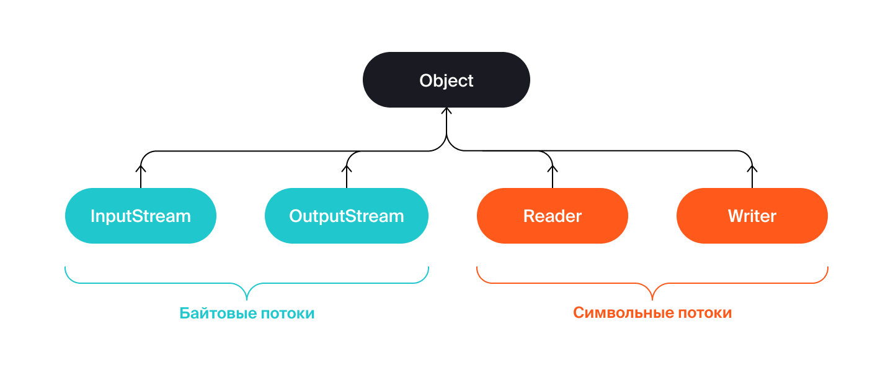
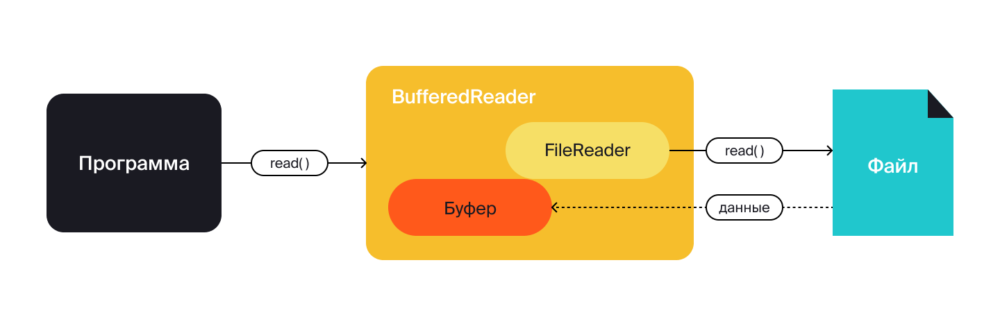
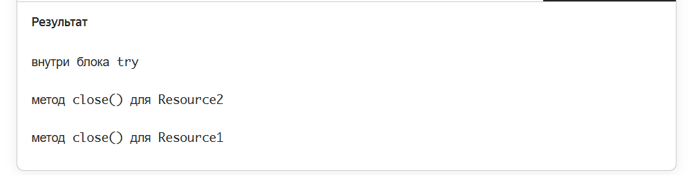

   Предыдущее занятие   |         &nbsp;          |   Следующее занятие    
:----------------------:|:-----------------------:|:----------------------:
 [Урок 18](LESSON18.MD) | [Содержание](../README.MD) | [Урок 20](LESSON20.MD) 

# Урок 19. Работа с файлами

# Требования к сдаче работы

Задание выполняется в среде программирования Idea. Результат надо разместить в своем репозитории на GitHub.
Прислать в гугл-формы(размещенная на моем сайте) ссылку на репозиторий.

***Критерии оценивания***

* Оценка 5 - надо сделать все задания.
* Оценка 4 - надо сделать любые два задания.
* Оценка 3 - надо сделать любое одно задание.

## Оглавление

1. [Введение в тему](#введение-в-тему)
2. [Основы работы с файлами](#основы-работы-с-файлами)
   * [Путь](#путь) 
   * [Класс File](#класс-file)
   * [Работа с файлами в 7-й версии Java и выше](#работа-с-файлами-в-7-й-версии-java-и-выше)
   * [Класс Paths](#класс-paths)
   * [Интерфейс Path](#интерфейс-path)
   * [Класс Files](#класс-files)
   * [Метод copy()](#метод-copy)
3. [Потоки ввода-вывода. Запись и чтение](#потоки-ввода-вывода-запись-и-чтение)
   * [Поток](#поток)
   * [Классы для работы с потоками](#классы-для-работы-с-потоками)
   * [Потоки и файлы](#потоки-и-файлы)
   * [Запись](#запись)
   * [Чтение](#чтение)
   * [Буферизация](#буферизация)
4. [Конструкция try-with-resources](#конструкция-try-with-resources)
5. [Кодировки и Юникод](#кодировки-и-юникод)
   * [ASCII, ISO 8859 и кодировки Windows](#ascii-iso-8859-и-кодировки-windows)
   * [Юникод](#юникод)
   * [Кодировки и Java](#кодировки-и-java)
   * [Кодировка по умолчанию](#кодировка-по-умолчанию)
   * [Кодировки для потоков](#кодировки-для-потоков)
   * [Кодировки и строки](#кодировки-и-строки)
6. [Задание 1](#задание-1)
7. [Задание 2](#задание-2)
8. [Задание 3](#задание-3)


## Введение в тему

В этой теме мы расскажем, как код на Java взаимодействует с файловой системой компьютера. 
А именно: как программа создаёт, читает и сохраняет файлы — эти операции выполняют многие реальные приложения.

Мы рассмотрим следующие моменты:

* как создавать и удалять файлы и директории;
* зачем нужны потоки ввода и вывода;
* как извлекать данные из файла и сохранять их обратно с помощью разных инструментов и методов;
* как работать с файлами безопасно и обработать возможные исключения;
* что такое кодировка и как правильно указать её тип в программе, чтобы корректно отобразить текст.

После завершения уроков вы узнаете больше о том, как Java общается с внешним миром, и сможете создавать более сложные и функциональные приложения.

<details>

<summary>Основы работы с файлами</summary>

## Основы работы с файлами

Особенности навигации и работы с файлами отличаются у разных операционных систем.
Так как Java — кроссплатформенный язык, в ней есть классы, которые координируют взаимодействие разработчика с любой файловой системой.

Для представления файлов в Java существует два класса:

* `java.io.File`, доступный с 1-й версии Java (1996);
* более новый API `java.nio.file.Path`, доступный с 7-й версии Java (2011).

Оба класса умеют выполнять все необходимые операции с файлами: чтение, запись, проверку состояния, удаление и многое другое. 
`File` появился гораздо раньше, но его всё ещё можно встретить в реальных проектах, которые были созданы до 2011 года.
В `Path` учли ошибки предыдущей реализации — что это за ошибки, расскажем подробнее далее в уроке. С момента возникновения класс `Path` стал использоваться для новых проектов.

### Путь


**Путь** (англ. path) — это набор символов, показывающий расположение файла или директории в файловой системе.
Вы уже встречались с понятием «путь», когда работали с командной строкой — команда `pwd` выводит путь к текущей директории.

```bash
$ pwd
/home/student
```

В операционных системах UNIX разделительным знаком для записи пути является `/`. В Windows — `\`. Эти знаки разделяют названия директорий, составляющих путь к файлу. Например:

```commandline
Linux, macOS: /home/username/docs/file.txt
Windows: C:\username\docs\file.txt
```

Есть два вида путей: 
* **Абсолютный (полный) путь** — указывает на одно и то же место в файловой системе вне зависимости от текущей директории. Полный путь всегда начинается с корневого каталога.
* **Относительный (сокращённый) путь** — указывает место относительно какой-либо отправной точки (другого файла, программы и так далее).

Например, абсолютный путь до файла `file.txt` всегда будет одинаковым — `C:\username\docs\file.txt`, а относительный зависит от того, в какой директории
находятся пользователь или программа, которые хотят обратиться к этому файлу. 
Допустим, пользователь находится в папке `C:\username\`, тогда относительный путь до нужного файла — `docs\file.txt`.

### Класс File

Объект класса `File` нужен для управления информацией о файлах и директориях.
Чтобы создать его, можно указать в строке **абсолютный** или **относительный** путь к файлу или каталогу, с которыми предполагается работа в коде.
Пример создания объекта `File` для директории `C:\\documents` в Windows:

```java
File dir = new File("C:\\documents");
```

Также есть следующие способы создать объект типа `File`: 
* `File(File parent, String child)` — указать путь к директории в виде объекта класса `File` и имя файла;
* `File(String parent, String child)` — указать путь к директории и имя файла.

```java
import java.io.File;

public class Practicum {

    public static void main(String[] args) {

        // создание объекта File для директории C:\\documents (для пользователей Windows)
        File dir = new File("C:\\documents");

        // создание объектов для файлов, которые находятся в директории
        File file1 = new File(dir, "lesson.txt"); // указываются путь к директории в виде объекта класса File и имя файла
        File file2 = new File("C:\\documents", "example.txt"); // указываются путь к директории и имя файла
    }
}
```

В классе `File` есть много методов и свойств для работы с файлами и директориями. 
При необходимости вы можете обратиться к [официальной документации](https://docs.oracle.com/en/java/javase/21/docs/api/java.base/java/io/File.html) и найти интересующее описание.
Мы приведём только самые популярные методы:

* `String getName()` — позволяет узнать краткое имя файла или директории;
* `boolean isFile()` — возвращает значение true, если по указанному пути находится файл;
* `boolean isDirectory()` — возвращает значение true, если по указанному пути находится директория;
* `String[] list()` — возвращает массив имён файлов и поддиректорий;
* `File[] listFiles()` — возвращает массив объектов файлов и поддиректорий.

Пройдёмся по содержимому директории с помощью перечисленных методов.

```java
import java.io.File;

public class Practicum {

    private static final String HOME = System.getProperty("user.home");

    public static void main(String[] args) {

        // создаём объект директории
        File dir = new File(HOME);

        // проверяем, является ли объект директорией
        if (dir.isDirectory()) {

            // получаем все вложенные объекты в директории
            for (File item : dir.listFiles()) {
                if (item.isDirectory()) {
                    System.out.println("Каталог: " + item.getName());
                } else {
                    System.out.println("Файл: " + item.getName());
                }
            }
        }
    }
}
```

Ещё несколько наиболее распространённых методов:
* `boolean mkdir()` — создаёт новую директорию. При успешном создании возвращает значение `true`.
* `boolean renameTo(File dest)` — переименовывает файл или директорию. В параметре указывается новое имя файла. Если переименовать не удалось, метод возвращает `false`.
* `boolean delete()` — удаляет или файл, или пустую директорию по пути, который передан в конструктор. При успешном удалении возвращает `true`.

Также в классе `File` существует константа `separator`. С помощью неё вводятся разделительные знаки `/` или `\`.

Пример кода, в котором есть описанные выше методы и константа:

```java
import java.io.File;

public class Practicum {

    private static final String HOME = System.getProperty("user.home");

    public static void main(String[] args) {

        // определение объекта для директории
        File dir = new File(HOME + File.separator + "NewDir");
        
        boolean created = dir.mkdir();
        if (created) {
            System.out.println("Директория создана.");
        }

        // присвоение нового имени директории
        File newDir = new File(HOME + File.separator + "NewDirRenamed");
        dir.renameTo(newDir);

        // удаление директории
        boolean deleted = newDir.delete();
        if (deleted) {
            System.out.println("Директория удалена.");
        }
    }
}

```

### Работа с файлами в 7-й версии Java и выше

У класса `File` имеется ряд недостатков. Например, в нём отсутствует метод, который позволяет скопировать файл
и переместить его в другое место. Кроме того, в этом классе много методов, возвращающих булево значение `false` в случае ошибки. С исключениями править код гораздо проще.

В 7-й версии Java создатели языка решили изменить работу с файлами и директориями. Вместо единого класса `java.io.File` появились три структуры:
* `Paths` — служебный класс, который предоставляет два метода для получения объекта типа `Path`.
* `Path` — доработанная версия `File`. Это интерфейс, у которого есть множество реализаций для конкретных файловых систем. Он делает всё, что может его предшественник, но эффективнее.
* `Files` — класс, состоящий из множества статических методов для работы с файлами.

### Класс Paths

`Paths` — небольшой класс с двумя статическими методами get, которые различаются только входными параметрами. Вот форматы этих методов:
* `Path get(String first, String... more)` — преобразует строку пути (параметр first) или последовательность строк (параметр more), образующих при соединении строку пути, в Path.
* `Path get(URI uri)` — преобразует заданный объект типа URI. Это символьная строка, позволяющая идентифицировать какой-либо ресурс:
документ, изображение, файл и так далее. 
Например, строка `file:\\\C:\books\dune.epub` идентифицирует файл электронной книги, расположенной по пути `C:\\books`, как объект `Path`.

Класс `Paths` создали для того, чтобы получить из переданной строки или `URI` объект типа `Path`. 
Другой функциональности у него нет. Пример работы этого класса:

```java
import java.nio.file.Path;
import java.nio.file.Paths;

public class Practicum {

    public static void main(String[] args) {

        // использован интерфейс Path, который позволяет описать путь к файлам и каталогам
        Path myFavouriteFilePath =
            Paths.get("C:\\users\\username\\desktop\\favouriteFile.txt");
    }
}
```


### Интерфейс Path

Объект типа `Path` содержит имена директорий и файлов, которые составляют полный путь к файлу или каталогу.
Он также содержит методы для добавления элементов пути, их извлечения и манипуляций с ними. 
Остальные методы для разных действий вынесены в статические методы класса `Files`.

Некоторые из методов `Path`:
* `Path getFileName()` — возвращает имя файла из пути;
* `Path getParent()` — возвращает «родительскую» директорию по отношению к текущему пути (ту, которая находится выше по дереву директорий);
* `Path getRoot()` — возвращает «корневую» директорию (ту, которая находится на вершине дерева директорий);
* `java.io.File toFile() `— метод для перехода между старым и новым средством работы с файлами;
* `Path resolve(String other)` — возвращает путь к вложенному элементу с именем `other` в папке (при этом исходный путь должен быть папкой — файлы не могут содержать вложенных элементов).
* 
С остальными методами интерфейса Path вы можете ознакомиться в [официальной документации](https://docs.oracle.com/en/java/javase/21/docs/api/java.base/java/nio/file/Path.html).

С помощью описанных выше методов можно получить минимальную информацию о расположении объекта типа Path. Например:
```java
import java.nio.file.Path;
import java.nio.file.Paths;

public class Practicum {

    private static final String HOME = System.getProperty("user.home");

    public static void main(String[] args) {

        // создаём объект Path с помощью статического метода get() класса Paths
        Path testFilePath = Paths.get(HOME, "test", "file.txt");

        // выводим информацию о файле
        System.out.println("Информация о файле: ");
        System.out.println(" - имя: " + testFilePath.getFileName());
        System.out.println(" - корневая директория: " + testFilePath.getRoot());
        System.out.println(" - родительская директория: " + testFilePath.getParent());

        // выводим элементы пути
        System.out.println("Элементы пути: ");
        for (Path element : testFilePath) {
            System.out.println(" - элемент пути: " + element);
        }
    }
}
```

### Класс Files

`Files` — это `final`-класс с `private`-конструктором. Он содержит только 
статические методы для выполнения различных действий. Его основные методы:
* `Path createFile(Path path, FileAttribute<?>... attrs)` — создаёт новый пустой файл. Выбрасывает исключение, если файл уже существует. Параметры метода: `path` — путь к файлу, который нужно создать, `attrs` — необязательный список атрибутов файла (в нём можно указать правила доступа к файлу, добавить информацию о создателе и так далее).
* `Path createDirectory(Path dir, FileAttribute<?>... attrs)` — создаёт новую директорию. Параметры метода: `dir` — директория, которую нужно создать, `attrs` — необязательный список атрибутов директории.
* `Path move(Path source, Path target, CopyOption. . . options)` — перемещает файл. Параметры метода: `source` — путь к файлу, который нужно переместить, `target` — путь к файлу назначения, `options` — необязательные параметры, определяющие, как нужно делать перемещение.
* `void delete(Path path)` — удаляет файл или директорию. Если удаляется директория, необходимо убедиться, что она пуста, иначе будет получено исключение `DirectoryNotEmptyException`. Если удаляется файл, необходимо убедиться, что он существует, иначе будет получено исключение `NoSuchFileException`. Параметры метода: `path` — путь к файлу или директории, которые нужно удалить.
* `boolean deleteIfExists(Path path)` — удаляет файл или директорию, если они существуют. Параметры метода: `path` — путь к файлу, который нужно удалить. Возвращаемое значение: `true` — если файл был удалён этим методом, `false` — если файл не может быть удалён, потому что не существует.

Остальные методы класса `Files` вы можете найти в [официальной документации](https://docs.oracle.com/en/java/javase/21/docs/api/java.base/java/nio/file/Files.html).

В примере ниже показана работа обозначенных методов:

```java
import java.io.IOException;
import java.nio.file.Files;
import java.nio.file.Path;
import java.nio.file.Paths;
import static java.nio.file.StandardCopyOption.REPLACE_EXISTING;

public class Practicum {

    private static final String HOME = System.getProperty("user.home");

    public static void main(String[] args) throws IOException {

        // создаём файл testFile
        Path testFile =
            Files.createFile(Paths.get(HOME, "testFile.txt"));

        if (Files.exists(Paths.get(HOME, "testFile.txt"))) {
            System.out.println("Файл успешно создан.");
        }

        // создаём директорию testDirectory
        Path testDirectory =
            Files.createDirectory(Paths.get(HOME, "testDirectory"));
        if (Files.exists(Paths.get(HOME, "testDirectory"))) {
            System.out.println("Директория успешно создана.");
        }

        // перемещаем файл testFile в директорию testDirectory
        testFile = Files.move(testFile,
            Paths.get(HOME, "testDirectory", "testFile.txt"),
            REPLACE_EXISTING);

        if (Files.exists(
            Paths.get(HOME, "testDirectory", "testFile.txt"))) {

            System.out.println("Файл перемещён в testDirectory.");
        }

        // удаляем файл
        Files.delete(testFile);
        if (!Files.exists(
            Paths.get(HOME, "testDirectory", "testFile.txt"))) {

            System.out.println("Тестовый файл удалён.");
        }

        // удаляем пустую директорию
        Files.delete(testDirectory);
        if (!Files.exists(Paths.get(HOME, "testDirectory"))) {
            System.out.println("Директория удалена.");
        }
    }
}
```

### Метод copy()
Теперь расскажем о методе, которого не хватало в `File`. Это метод копирования `Path copy(Path source, Path target, CopyOption... options)`.
Его параметры: `source` — путь к исходному файлу, `target` — путь к тому файлу, что будет создан в результате копирования (включая имя нового файла),
`options` — необязательные параметры копирования. Существует три таких параметра:
* `REPLACE_EXISTING` — указывает, что если в директории назначения уже есть такой файл, то нужно его заменить;
* `COPY_ATTRIBUTES` — указывает, что нужно скопировать атрибуты оригинального файла в его копию;
* `ATOMIC_MOVE` — указывает, что необходимо переместить файл атомарно. Это значит, что перемещение или выполнится целиком, или не выполнится вообще.
💡 Обратите внимание

>💡 Обратите внимание: при копировании директории содержащиеся в ней файлы и каталоги копироваться не будут.

В примере ниже сначала создаётся объект типа `Path` для исходного файла (`sourceFile`) и объект для директории назначения (`targetDir`). Далее с помощью метода resolve
(англ. «разрешить»), который умеет объединять два пути в один, создаётся объект `targetFile` для пути файла назначения. После этого выполняется метод `copy()`.

```java
import java.io.IOException;
import java.nio.file.FileAlreadyExistsException;
import java.nio.file.Files;
import java.nio.file.Path;
import java.nio.file.Paths;

public class Practicum {

    private static final String HOME = System.getProperty("user.home");

    public static void main(String[] args) {

        // исходный файл
        Path sourceFile = Paths.get(HOME, "test.txt");
        // директория назначения
        Path targetDir = Paths.get(HOME, "test");

        copyFile(sourceFile, targetDir);
    }

    public static void copyFile(Path sourceFile, Path targetDir) {
        Path targetFile = targetDir.resolve(sourceFile.getFileName());

        try {
            Files.copy(sourceFile, targetFile);
        } catch (FileAlreadyExistsException e) {
            System.out.format("Файл %s уже существует.", targetFile);
        } catch (IOException e) {
            System.err.format("Произошла ошибка во время копирования файла.");
        }
    }

}
```

</details>

<details>

<summary>Потоки ввода-вывода. Запись и чтение</summary>

## Потоки ввода-вывода. Запись и чтение

Большинство современных программ так или иначе взаимодействуют с внешним миром.
Например, загружают информацию, обмениваются ею с другими приложениями или читают файлы. 
Иными словами, программы непрерывно получают и отправляют данные — вводят их и выводят. 
Этот процесс так и называется **вводом-выводом** (англ. _input/output_). 
В Java, как и во многих других языках программирования, существует специальное понятие для работы с вводом-выводом.

### Поток

**Поток** (англ. _stream_) — это бесконечная последовательность данных. Представьте трубу, в которую вместо воды поступают упорядоченные символы или байты.
Такие трубы можно соединять друг с другом, ведь один поток способен передавать данные в другой, предварительно модифицируя их.


Поток подключён к источнику (англ. _source_) или получателю данных (англ. _destination_). По направлению потоки делятся следующим образом:
* **потоки ввода** (англ. _input streams_), из которых считываются данные;
* **потоки вывода** (англ. _output streams_), в которые записываются данные.

А по типу передаваемых данных так:

* **символьные потоки** (англ. _character streams_), которые содержат символы;


* **байтовые потоки** (англ. _byte streams_), которые содержат информацию в виде последовательности байтов.


### Классы для работы с потоками

В Java все необходимые классы для работы с потоками ввода-вывода находятся в пакете jаvа.io. 
Благодаря этим классам разработчику не нужно вникать в особенности низкоуровневой организации операционных систем. 

Для каждого из типов потоков Java предлагает отдельный базовый абстрактный класс:
* `InputStream` — представляет поток ввода для чтения байтов;
* `OutputStream` — представляет поток вывода для записи байтов;
* `Reader` — представляет поток ввода для чтения символов;
* `Writer` — представляет поток вывода для записи символов.



Также в пакете `java.io` содержится множество подклассов этих классов. Все они предназначены для различных целей.
Например, для доступа к файлам или к сети, для чтения и записи текста и так далее.

Среди прочих в этом пакете есть подкласс `PrintStream`, наследник `OutputStream`.
На самом деле вы уже знакомы с ним. Поле `out` класса `System`, которое вы множество раз использовали
для вывода информации в консоль, как раз этого типа. `PrintStream` — стандартный выходной поток,
который открыт во время выполнения программы и готов принимать выходные данные для вывода в терминал.

### Потоки и файлы

Файлы — самые распространённые источники или получатели данных в приложении. 
Для работы с файлами у каждого из четырёх абстрактных классов потоков есть своя реализация:
`FileInputStream` и `FileOutputStream`; `FileReader` и `FileWriter`.

Выбор между байтовыми и символьными потоками зависит от того, с каким типом файла предстоит работать.
Для бинарных файлов, таких как картинки, видео, pdf-файлы, нужен байтовый поток
(`FileInputStream` для чтения байтов и `FileOutputStream` для их записи). 
Для текстовых файлов лучше использовать символьный поток (`FileReader` для чтения символов и `FileWriter` для их записи), 
хотя можно применять и байтовые потоки.

> 💡 Общая схема работы с потоками и файлами в Java выглядит так:
1. Создаётся потоковый объект и ассоциируется с файлом на диске.
2. Данные читаются из потока или записываются в поток.
3. Поток закрывается.

### Запись

Чтобы сделать запись в файл с помощью `FileWriter`, 
нужно сначала создать объект `FileWriter`. Далее методом `write()`,
который есть у всех потоков вывода, можно добавить строки в новый файл. В конце необходимо закрыть поток методом `close()`.

```java
import java.io.FileWriter;
import java.io.IOException;
import java.io.Writer;

public class Practicum {

    public static void main(String[] args) throws IOException {
        Writer fileWriter = new FileWriter("filewriter.txt");

        fileWriter.write("новая запись в новый файл\n");
        fileWriter.write("добавляем текст");

        fileWriter.close();
    }
}
```


> 💡 С конструктором `FileWriter(String fileName)` содержимое файла будет создаваться заново при каждом запуске программы.
Чтобы добавить содержимое к уже существующему файлу, необходимо воспользоваться конструктором `FileWriter(String fileName, 
boolean append)` и передать в него значение `true` для флага `append` (англ. «присоединять»). 
Это специальный признак того, что новые данные будут записаны в конец файла.

Запустите код из примера выше с признаком `append = true` и посмотрите, как изменится создаваемый файл `filewriter.txt`.

### Чтение

Чтобы прочитать текстовый файл, необходимо сначала создать объект `FileReader`,
который подключается к файлу. `FileReader` считывает данные по одному символу за раз, 
пока не будет достигнут конец файла.

Метод `read()` возвращает значение типа `int`. А `int` содержит 
значение `char` прочитанного символа. Если метод `read()` возвращает `-1`, значит,
в `FileReader` больше нет данных для чтения и его можно закрыть с помощью метода `close()`.

```java
import java.io.FileReader;
import java.io.IOException;
import java.io.Reader;

public class Practicum {

    public static void main(String[] args) throws IOException {
        Reader fileReader = new FileReader("filereader.txt");

        int data = fileReader.read();
        while (data != -1) {
            System.out.print((char) data);
            data = fileReader.read();
        }

        fileReader.close();
    }
}
```


`filereader.txt`

```txt
Практикум
```

### Буферизация
В примере выше `FileReader` обращался за каждым символом напрямую к файлу.
То есть его содержимое считывалось посимвольно. Этот процесс можно ускорить, 
если применить **буферизацию** (от англ. _buffer_, «буфер»). **Буферизация** — способ ввода и вывода данных, 
при котором для их временного хранения используется область памяти — **буфер**.

Буфером может быть обычный массив. Данные по очереди попадают в него, накапливаются, 
а затем обрабатываются вместе. Если добавить буферизацию в рассмотренный нами выше код,
`FileReader` будет обращаться за символами не к файлу, а к буферу. Это увеличит производительность программы.

Буферизация используется не только для чтения файлов, но и для записи.
В таком случае новые символы будут сначала сохранены в буфере, а затем, 
когда он наполнится, одной порцией записаны в файл.

Мы покажем, как работать с буферизацией, на примере класса `BufferedReader`. `BufferedReader` — подкласс `Reader`,
а значит, он может использовать все те методы для чтения из потока,
которые определены в классе `Reader`. 
Например, `read()`. Также у него есть свой собственный метод `readLine()`, 
позволяющий считывать данные из потока построчно.



`BufferedReader` имеет следующие конструкторы:

```java
BufferedReader(Reader in)
BufferedReader(Reader in, int sz)
```

Обратите внимание, что в конструкторе `BufferedReader(Reader in, int sz)`, 
кроме потока ввода, из которого производится чтение, нужно также указать размер буфера,
в который будут считываться символы. Если не передать размер буфера в конструктор явно, 
программа использует значение по умолчанию — 8192 символа.

Пример кода чтения файла с буферизацией:

```java
import java.io.BufferedReader;
import java.io.FileReader;
import java.io.IOException;

public class Practicum {

    public static void main(String[] args) throws IOException {
        FileReader reader = new FileReader("bufferedreader.txt");
        BufferedReader br = new BufferedReader(reader);

        while (br.ready()) {
            String line = br.readLine();
            System.out.println(line);
        }

        br.close();
    }
}
```


`bufferedreader.txt`

```txt
первая строка
вторая строка
последняя строка 
```


</details>


<details>

<summary>Конструкция try-with-resources</summary>

## Конструкция try-with-resources

Операционная система контролирует совместный доступ разных программ к файлам. Например, если одна программа меняет какой-либо из них,
другая не может его удалить. Поэтому после завершения работы с файлом очень важно уведомить
операционную систему, что он вам больше не нужен. Мы уже рассказывали, как это сделать с помощью метода `close()`.

Это же правило применимо и к другим потокам — например, для доступа к сети, для ввода и вывода информации
в терминале и так далее. Если поток больше не нужен, то его необходимо закрыть методом `close()` вот так:

```java
FileOutputStream fos = new FileOutputStream("file.txt");
// что-то делаем с потоком
fos.close();
```

Важно помнить, что исключение может возникнуть до вызова метода `close()`. Тогда поток не будет закрыт. 
Можно вызвать `close()` в блоке finally. Однако это будет малоэффективно, если ошибка возникнет при создании потока.

До 7-й версии Java правильное закрытие потока выглядело так:

```java
import java.io.FileNotFoundException;
import java.io.FileReader;
import java.io.IOException;
import java.io.Reader;

public class Practicum {

    public static void main(String[] args) throws IOException {
        Reader fileReader = null;
        try {
            fileReader = new FileReader("file.txt");

            // что-то делаем с потоком

        } catch (FileNotFoundException e) {
            e.printStackTrace();
        } finally {
            if (fileReader != null) {
                fileReader.close();
            }
        }
    }
}
```

Подобное решение было громоздким и запутанным. Поэтому в 7-й версии Java появилась конструкция `try-with-resources`
(англ. «try с ресурсами»), которая позволяет закрывать один или несколько ресурсов без использования блока `finally`.

Под ресурсом понимается любой класс, наследуемый от интерфейсов `Closeable` или `AutoCloseable`. 
В этих интерфейсах объявлен метод `close()`, который необходимо реализовать. 

Закроем поток с помощью конструкции `try-with-resources`.

```java

import java.io.FileNotFoundException;
import java.io.FileReader;
import java.io.IOException;
import java.io.Reader;

public class Practicum {

    public static void main(String[] args) throws IOException {
        try (Reader fileReader = new FileReader("file.txt")) {

            // что-то делаем с потоком

        } catch (FileNotFoundException e) {
            e.printStackTrace();
        }
    }
}

```

Метод `close()` будет вызван автоматически, когда программа выйдет из блока `try-with-resources`.

В блоке `try-with-resources` можно объявить несколько ресурсов. 
Тогда их необходимо разделить точкой с запятой. При этом ресурсы, которые были определены первыми,
будут закрыты последними. 

В примере ниже мы создали два ресурса и переопределили в них метод `close()`:

```java
public class Practicum {

    public static void main(String[] args) {
        try (Resource1 resource1 = new Resource1(); Resource2 resource2 = new Resource2()) {
            System.out.println("внутри блока try");
        }
    }

}

class Resource1 implements AutoCloseable {

    @Override
    public void close() {
        System.out.println("метод close() для Resource1");
    }
}

class Resource2 implements AutoCloseable {

    @Override
    public void close() {
        System.out.println("метод close() для Resource2");
    }
}
```



> 💡 Обратите внимание: у try-with-resources, так же как и у обычного try, тоже могут быть блоки catch и finally.

Итак, чтобы преобразовать стандартный `try` в `try-with-resources`,
достаточно объявить необходимые ресурсы в круглых скобках после ключевого слова `try`, а остальное сделает Java.

</details>

<details>

<summary>Кодировки и Юникод</summary>

## Кодировки и Юникод

Компьютеры не умеют воспринимать понятный человеку текст. Каждому символу, который вы видите на экране, 
на самом деле соответствует последовательность нулей и единиц. 
Она может быть преобразована в десятичное число — некое числовое значение.
Набор таких числовых значений называют **кодировкой** (англ. _encoding_), или просто
**набором символов** (англ. _character set_, или _charset_).

Было бы проще, если бы существовала единая универсальная кодировка. Но в действительности есть множество 
стандартов, которые несовместимы друг с другом. Например, в одной кодировке символу русского алфавита 
А может соответствовать числовое значение 
192, а в других — 128 или 176.

Если программе не указать тип кодировки, она не сможет правильно отобразить текст
и выведет на экран бессмысленную последовательность символов. В этом уроке мы расскажем об основных кодировках,
а также о том, как взаимодействовать с ними в Java.

### ASCII, ISO 8859 и кодировки Windows

В 1963 году была разработана кодировка **ASCII** (от англ. _American Standard Code for Information Interchange_,
«Американский стандартный код для обмена информацией»). Она определяет
128 символов. Каждый из них сопоставляется с числовым значением от 0 до 127. Таблица начинается с 
32 невидимых управляющих символов и заканчивается символом DEL, тоже управляющим. Символы в диапазоне от 
32 до 
126 относятся к видимым — это пробел, знаки препинания, латинские буквы и цифры.


В Java можно определить символ по его числовому значению из таблицы ASCII. Запустите следующий код, а затем подставьте любое другое число в видимом диапазоне от 
32 до 126:

```java
public class Practicum {

    public static void main(String[] args) {
        System.out.println((char) 89);
    }
}

```


ASCII было достаточно для передачи информации на английском, но не на других языках. Поэтому в середине
1980-х годов были разработаны стандарты семейства кодировок **ISO** 8859. Эти кодировки обратно совместимы с ASCII, 
а также содержат 127 дополнительных символов. На данный момент существует 15 вариантов стандарта ISO 
8859 (от 8859-1 до 8859-15) для разных языков. Однако для каждого символа вне
ASCII-совместимого диапазона между этими стандартами возникают конфликты.

В начале 1990-х годов компания Microsoft разработала группу кодировок для операционной системы Windows.
Так появились наборы с названиями Windows-1251 и Windows-1252. Эти кодировки тоже совместимы с ASCII. Windows-
1251 — стандартная кодировка для русских версий Microsoft Windows до 10-й версии. Набор Windows-
1252 был предназначен для западноевропейских языков.

### Юникод

С распространением компьютеров понадобились новые стандарты кодирования, например,
для китайских иероглифов, арабской вязи, дополнительных типографских символов, а впоследствии даже для эмодзи.

Решением проблемы стало изобретение **Юникода** (англ. _Unicode_) — стандарта кодирования символов, 
охватывающего современные алфавиты, цифры, знаки препинания, математические, денежные, музыкальные символы и 
символы мёртвых языков. Юникод появился в 1991 году, но распространение получил позже и
в настоящее время является преобладающим стандартом в интернете.

Набор символов Юникода разбит на 17 плоскостей, содержащих по 65 536 числовых значений. 
Таким образом, максимально возможное число символов равно 1 114 112.
Юникод реализован несколькими способами, но самый распространённый —  UTF-8. 
(от англ. Unicode Transformation Format, 8-bit, «формат преобразования Юникода, 8-бит»). 
Перед вами пример строки, записанной с помощью UTF-8. Запустите код и посмотрите, что получится.

```java
public class Practicum {

    public static void main(String[] args) {
        System.out.println("\u041F\u0440\u0430\u043A\u0442\u0438\u043A\u0443\u043C");
    }
}
```


Кодировка UTF-8 универсальна и имеет значительный резерв для дальнейшего расширения. 
Так что в ближайшее время вряд ли возникнет необходимость в новом стандарте кодирования.

### Кодировки и Java

Задать кодировку для какого-либо класса можно с
помощью строки с её названием. Однако это неудобно: программист может не посмотреть сигнатуру метода 
и ввести любое произвольное значение. Поэтому для представления кодировок в Java существует специальный класс `Charset`,
а также класс `StandardCharsets` с константами для стандартных наборов символов. 

В классе `Charset` есть метод `static Charset forName(String charsetName)`, который возвращает объект кодировки по имени.
В качестве параметра `charsetName` может быть как стандартное имя кодировки, так и её псевдоним.
То есть значения `utf8`, `UTF-8`, `utf-8` будут распознаны одинаково.

В приведённом ниже коде объекты типа `Charset` создаются двумя разными способами — 
с помощью метода `forName` и класса `StandardCharsets`:

```java
import java.nio.charset.Charset;
import java.nio.charset.StandardCharsets;

public class Practicum {

    public static void main(String[] args) {
        Charset charset1 = Charset.forName("UTF8");
        System.out.println(charset1.name());

        Charset charset2 = StandardCharsets.US_ASCII;
        System.out.println(charset2);
    }
}
```


> 💡 Способ с использованием StandardCharsets предпочтительнее, но с его помощью можно создать объект только для самых популярных кодировок. В остальных случаях нужно использовать метод forName.


### Кодировка по умолчанию

В программах на Java часто встречаются места, 
где кодировка должна быть указана явно. Если этого не сделать, будет
использована **кодировка по умолчанию** (англ. _default charset_). Она определяется во время запуска
виртуальной машины и сохраняется в свойстве `file.encoding`. 
Значение зависит от выбранного языка и кодировки самой операционной системы.

Определить кодировку по умолчанию можно с помощью метода `defaultCharset()` класса `Charset`.

```java
import java.nio.charset.Charset;

public class Practicum {

    public static void main(String[] args) {
        System.out.println(Charset.defaultCharset().displayName());
    }
}
```


Кодировка по умолчанию — глобальный параметр. Нельзя установить для одних классов или функций одну кодировку,
а для других — другую. Кроме того, её нельзя изменить в процессе выполнения программы.
Но главное, разработчик может использовать функцию, которая будет работать по-разному в разном окружении, и не заметить этого. 

Предположим, вы сохранили файл у себя на компьютере через программу на Java,
а затем отправили своему коллеге в Чехию. При открытии файла коллега может столкнуться
с трудностями — даже если открывает его с помощью той же программы и использует аналогичную операционную систему.

Проблему кодировки по умолчанию решает запуск Java с параметром `-Dfile.encoding=UTF-8`. Например,
запуск программы из одного файла с классом `Practicum` будет выглядеть так:

```java
java -Dfile.encoding=UTF-8 Practicum
```

### Кодировки для потоков

Трудности с кодировкой могут возникать при использовании классов из пакета `java.io`.
Например, вы хотите прочитать текстовый файл в кодировке `Windows-1251`, 
но при создании объекта `InputStreamReader` указали неверную кодировку или положились на значение по умолчанию.

```java
InputStreamReader isr = new InputStreamReader(
    new FileInputStream("файл_в_кодировке_1251"), StandardCharsets.UTF_8);
```

В результате при чтении файла символы будут рассматриваться как принадлежащие кодировке UTF-8, а потому текст может 
оказаться нечитаемым.

Для основных классов потоков предусмотрен конструктор, в который, вместо того чтобы полагаться 
на значение по умолчанию, можно передать нужную кодировку. Например, `InputStreamReader(InputStream in, Charset cs)`,
`PrintStream(boolean autoFlush, OutputStream out, Charset charset)` и другие.

### Кодировки и строки

Многие методы, например, те, которые используются для сохранения информации в файл, 
для отправки файла по сети и других задач, могут работать только с массивом байтов. 
Для того чтобы превратить `String` в байтовый массив, в Java есть метод `getBytes()`.
А чтобы создать строку из массива байтов — конструктор `String(byte[] bytes)`.

Сложность в работе с этими преобразованиями в том, что в них применяется кодировка символов по умолчанию.
Поэтому мы рекомендуем использовать сигнатуры с указанием кодировки, такие как `byte[] getBytes(Charset charset)` 
и `String(byte[] bytes, String charsetName)`.

```java
// преобразование из строки в массив байтов
String s = "Обычная строка.";
byte[] buffer = s.getBytes(StandardCharsets.UTF_8);

// преобразование из массива байтов в строку
byte[] buffer = new byte[1000];
String s = new String(buffer, StandardCharsets.UTF_8);
```

Добавим кодировку в приведённый ниже код, чтобы он правильно выводил текст:

```java
import java.io.BufferedReader;
import java.io.ByteArrayInputStream;
import java.io.IOException;
import java.io.InputStreamReader;
import java.io.OutputStreamWriter;
import java.io.Writer;
import java.nio.charset.StandardCharsets;

public class Practicum {

    public static void main(String[] args) {

        try (Writer out = new OutputStreamWriter(System.out, StandardCharsets.UTF_8)) {
            out.write(decodeText(
                "Съешь ещё этих мягких французских булок да выпей же чаю"));

        } catch (IOException e) {
            // игнорируем
        }
    }

    static String decodeText(String input) throws IOException {
        return new BufferedReader(new InputStreamReader(
            new ByteArrayInputStream(input.getBytes(StandardCharsets.UTF_8)), StandardCharsets.UTF_8)).readLine();
    }
}
```


</details>

<details>

<summary>Кратко по теме</summary>

## Кратко по теме

* **Поток ввода-вывода** — это последовательность данных, которая передаётся от источника к приёмнику. 
В Java потоки представлены классами `InputStream/Reader` (для чтения данных) и `OutputStream/Writer `(для записи данных).
* Классы для работы с файлами в Java:
  * `Path` и `Files` — классы в Java, предназначенные для работы с файловой системой. С их помощью можно создавать,
  удалять, перемещать файлы.
    * Методы класса `Path`, такие как `getFileName()`, `getRoot()`, помогают получать информацию о пути файла.
    * Класс `Files` предоставляет набор утилитных методов для работы с файлами и директориями, например:
      * createFile() — создание файла;
      * createDirectory() — создание директории;
      * move() — перемещение файла или директории;
      * delete() — удаление файла или директории;
      * copy() — копирование файла или директории.
  * Классы `InputStream` и `OutputStream` — базовые классы для работы с потоками ввода-вывода в Java.
  * Классы `Reader` и `Writer` обеспечивают символьный доступ к данным, в то время как `InputStream` и `OutputStream` работают с байтами.
  * `FileInputStream` и `FileOutputStream` предназначены для чтения и записи байтовых потоков, а `FileReader` и `FileWriter` — для символьных потоков.
  * `BufferedReader`, `BufferedWriter` — инструменты для чтения и записи текстовых данных. Эти классы позволяют буферизировать данные для оптимизации ввода-вывода.
* Конструкция `try-with-resources` делает то же, что и обычный `try`, но требует меньше кода. 
Блок `try` позволяет автоматически закрывать ресурсы после использования. 
Независимо от того, было ли исключение в блоке `try` или нет, ресурсы будут закрыты. Это снижает риск их утечек и делает код более чистым и читаемым.
* **Кодировка** — система преобразования символов в байты и обратно. Именно кодировка определяет, какой набор байтов будет представлять определённый символ или текст.
* Один из стандартов кодирования символов — **Юникод**. Он охватывает большинство письменных языков мира, и в нём каждому символу соответствует уникальный номер.


</details>


<details>

<summary>Задание 1</summary>

## Задание 1

Вам нужно создать файловый менеджер. Приложение должно уметь:
* просматривать содержимое директории;
* создавать файлы и директории;
* переименовывать файлы или директории;
* полностью перемещать файлы или директории;
* удалять файлы или директории.

Пользователю необходимо выбрать, какую операцию он хочет выполнить с файлом или папкой, а затем ввести путь к нужному файлу.


```java
import java.io.IOException;
import java.nio.file.Files;
import java.nio.file.Path;
import java.nio.file.Paths;
import java.nio.file.StandardCopyOption;
import java.util.Scanner;

public class Practicum {

    public static void main(String[] args) {
        Scanner scanner = new Scanner(System.in);

        while (true) {
            printMenu();
            String command = scanner.nextLine();

            System.out.println("Введите путь к файлу/директории: ");
            String enteredPath = scanner.nextLine();
            Path path = ??? // создайте переменную пути
            if (!???) { // проверьте, не ошибся ли пользователь
                System.out.println("Введённый путь не существует.");
                break;
            }
            switch (command) {
                case "exit":
                    System.out.println("Выход.");
                    System.exit(0); // пользователь хочет найти выход, выход есть всегда
                    break;
                case "ls":
                    try {
                        for (String element : ? список элементов в path?) {
                            System.out.println(???);
                        }
                    } catch (Exception e) {
                        System.out.println("Произошла ошибка при запросе содержимого директории.");
                        e.printStackTrace();
                    }
                    break;

                case "mkdir":
                    try {
                        ???
                    } catch (IOException e) {
                        System.out.println("Произошла ошибка при создании директории.");
                        e.printStackTrace();
                    }
                    break;
                case "touch":
                    try {
                        ???
                    } catch (IOException e) {
                        System.out.println("Произошла ошибка при создании файла.");
                        e.printStackTrace();
                    }
                    break;
                case "rename":
                    System.out.println("Введите новое имя файла/директории: ");
                    String newName = scanner.nextLine();

                    try {
                        ??? // с помощью опции StandardCopyOption.REPLACE_EXISTING
                    } catch (IOException e) {
                        System.out.println("Произошла ошибка при переименовании файла/директории.");
                        e.printStackTrace();
                    }
                    break;
                case "rm_file":
                    try {
                        if (!???) {
                            ???
                        } else {
                            System.out.println("С помощью этой команды можно удалить только файл!");
                        }
                    } catch (IOException e) {
                        System.out.println("Произошла ошибка при удалении файла.");
                        e.printStackTrace();
                    }
                default:
                    System.out.println("Извините, такой команды пока нет.");
            }

        }
    }

    public static void printMenu() {
        System.out.println("Что вы хотите сделать? ");
        System.out.println("ls - посмотреть содержимое директории.");
        System.out.println("mkdir - создать директорию.");
        System.out.println("touch - создать файл.");
        System.out.println("rename - переименовать директорию/файл.");
        System.out.println("rm_file - удалить файл.");
        System.out.println("exit - выход.");
    }

}
```

### Подсказки

* Для объявления переменной `path` воспользуйтесь методом `Paths.get(enteredPath)`.
* Для перечисления всех файлов в директории воспользуйтесь вызовом `path.toFile().list()`.
* Для создания директории вам понадобится метод `Files.createDirectory(path)`.
* Создать файл можно с помощью метода `Files.createFile(path)`.
* Чтобы переименовать файл или директорию, удобно воспользоваться методом `Files.move`.
* Для удаления файла используйте метод `Files.deleteIfExists(path)`.

</details>

<details>

<summary>Задание 2</summary>

## Задание 2

В компании «Профессиональные программы» решили устроить голосование,
чтобы выбрать, чем заняться на летнем корпоративе. Варианты:

A — поехать на базу отдыха;

B — пойти в поход на байдарках;

C — отправиться на экскурсию в Дагестан;

D — устроить вечеринку в офисе.

Результаты голосования представлены в файле `result.txt`. 
Обработайте результат и выведите количество проголосовавших для каждого варианта.

`result.txt`

```txt
C
A
A
D
B
A
A
B
A
C
D
D
A
A
A
B
A
A
D
B
B
C
C
B
A
C
A
C
A
B
D
A
A
C
D
A
A
B
A
A
A
A
B
A
A
A
A
A
B
B
B
B
B
C
D
```

```java
import java.io.BufferedReader;
import java.io.FileReader;
import java.io.IOException;
import java.util.HashMap;
import java.util.Map;

public class Practicum {

    public static void main(String[] args) throws IOException {
        Map<String, Integer> frequencyMap = new HashMap<>();

        FileReader reader = new FileReader("result.txt");
        BufferedReader br = new BufferedReader(reader);

        // читайте файл построчно и сразу обновляйте frequencyMap.

        // выведите результат в формате "<буква>: <количество>".

    }
}
```

### Ожидаемый результат


### Подсказки

* Для чтения создайте цикл `while` с условием `br.ready()`.
* В цикле `while` для чтения очередной строки используйте метод `readLine()`.
* Не забудьте закрыть поток методом `close()`.


</details>

<details>

<summary>Задание 3</summary>

## Задание 3

Компания «Игры для всех» переносит популярные карточные игры в мета-пространство. 
На очереди любимец всех вечеринок — Алиас. В этой игре количество участников не ограничено. 
Участники должны объяснить членам своей команды слова, указанные на виртуальных карточках. 
Осталось написать модуль для распределения слов по карточкам. База всех слов для игры хранится в файле words.txt
— каждое слово записано на новой строке. Этот файл можно дополнить и обновить.
На вход приложение должно принимать количество участников, 
а на выходе генерировать файл-карточку для каждого участника со словами в случайном порядке.

`words.txt`

```txt
блендер
восхищение
тамада
краб
серфинг
сертификат
```

```java
import java.io.BufferedReader;
import java.io.FileReader;
import java.io.FileWriter;
import java.io.IOException;
import java.nio.charset.StandardCharsets;
import java.util.ArrayList;
import java.util.Collections;
import java.util.List;
import java.util.Scanner;

public class Practicum {

    public static void main(String[] args) {
        Scanner scanner = new Scanner(System.in);

        System.out.println("Введите количество участников: ");
        int playersNumber = scanner.nextInt();

        List<String> words = readWordsFromFile("words.txt");

        // если слов меньше, чем участников, то выведите сообщение:
        // "Недостаточно слов в файле. Добавьте слова и обновите файл."
        // и завершите выполнение программы

        // воспользуйтесь статическим методом Collections.shuffle(List<?> list),    
        // чтобы поменять порядок слов случайным образом

        int wordsNumber = words.size() / playersNumber;

        for (int i = 0; i < playersNumber; i++) {
            String filename = String.format("player%s.txt", i + 1);
            List<String> subList = words.subList(i * wordsNumber, (i + 1) * wordsNumber);

            writeListToFile(subList, filename);
        }

        System.out.println("Карточки готовы!");
    }

    private static List<String> readWordsFromFile(String filename) {
        // добавьте построчное чтение из файла с помощью BufferedReader
        // в случае ошибки выведите сообщение: "Произошла ошибка во время чтения файла."
    }

    private static void writeListToFile(List<String> list, String filename) {
        // добавьте запись слов в файл с помощью FileWriter
        // в случае ошибки выведите сообщение: "Произошла ошибка во время записи файла."
    }
}
```

### Подсказки

* Не забудьте указать кодировку при создании объекта `FileReader` и `FileWriter`.
* Воспользуйтесь конструкцией `try-with-resources` при работе с потоками ввода-вывода.
* Для чтения файла используйте метод `readLine()` в цикле. Условие цикла — вызов метода `ready()`.
* Для записи в файл воспользуйтесь методом `write(String str)`.
* Для переноса записи на новую строку используйте символ `\n`.

</details>


   Предыдущее занятие   |         &nbsp;          |   Следующее занятие    
:----------------------:|:-----------------------:|:----------------------:
 [Урок 18](LESSON18.MD) | [Содержание](../README.MD) | [Урок 20](LESSON20.MD) 