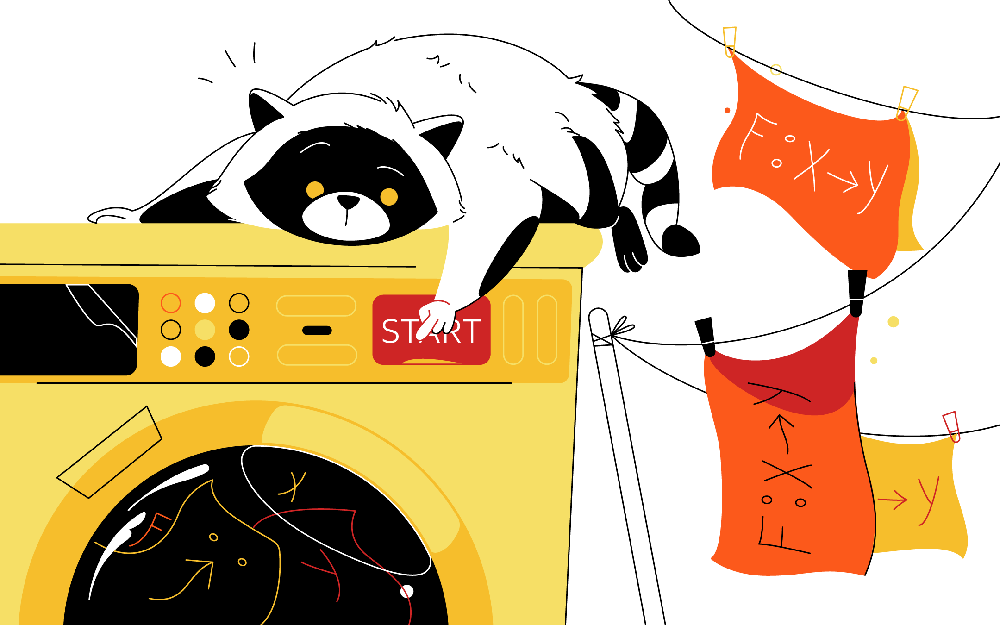
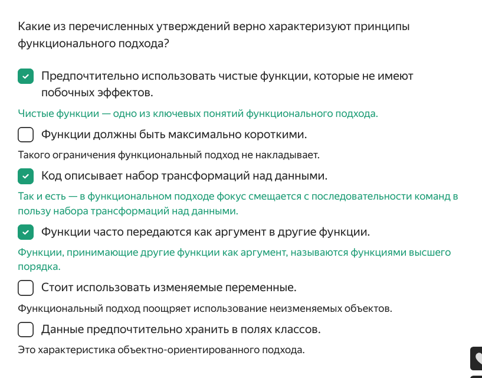
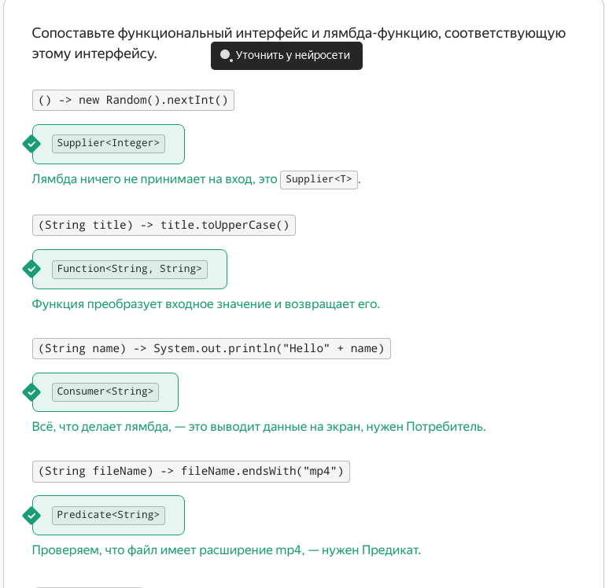
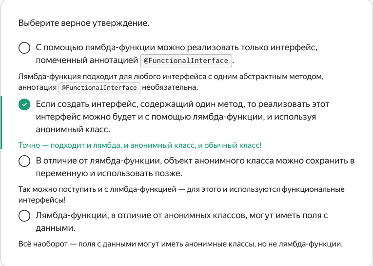

   Предыдущее занятие   |         &nbsp;          |   Следующее занятие    
:----------------------:|:-----------------------:|:----------------------:
 [Урок 20](LESSON20.MD) | [Содержание](../README.MD) | [Урок 22](LESSON21.MD)

# Урок 21. Основы функционального программирования

# Требования к сдаче работы

Задание выполняется в среде программирования Idea. Результат надо разместить в своем репозитории на GitHub.
Прислать в гугл-формы(размещенная на моем сайте) ссылку на репозиторий.

***Критерии оценивания***

* Оценка 5 - надо сделать все задания.
* Оценка 4 - надо сделать любые два задания.
* Оценка 3 - надо сделать любое одно задание.

## Оглавление
1. [Концепция ФП](#концепция-фп)
   * [Понятие функции в ФП](#понятие-функции-в-фп)
   * [Детерминированность](#детерминированность)
   * [Отсутствие побочных эффектов](#отсутствие-побочных-эффектов)
   * [Чистые функции](#чистые-функции)
   * [Функции высшего порядка](#функции-высшего-порядка)
   * [Функция в качестве возвращаемого значения](#функция-в-качестве-возвращаемого-значения)
   * [Неизменяемость объектов](#неизменяемость-объектов)
    
2. [Функциональные интерфейсы](#функциональные-интерфейсы)
   * [Понятие функционального интерфейса](#понятие-функционального-интерфейса)
   * [Аннотация @FunctionalInterface](#аннотация-functionalinterface)
   * [Лямбда как реализация функционального интерфейса](#лямбда-как-реализация-функционального-интерфейса)
   * [Функциональные интерфейсы в стандартной библиотеке](#функциональные-интерфейсы-в-стандартной-библиотеке)
   * [Анонимные классы](#анонимные-классы)
   * [Как написать реализацию анонимного класса для несложного интерфейса](#как-написать-реализацию-анонимного-класса-для-несложного-интерфейса)
3. [Задание 1](#задание-1)
4. [Задание 2](#задание-2)
5. [Задание 3](#задание-3)

<details>

<summary>Концепция ФП</summary>

## Концепция ФП

Вспомним пример кода-обработчика набора путей файлов из первого урока. 
Этот код был написан в традиционном
объектно-ориентированном стиле с использованием цикла и выглядел так. 

```java
 public List<String> processFilePaths(List<String> paths) {
        List<String> result = new ArrayList<>();
        for (String path: paths) {
            if (!isTempFile(path)) {
                String fileName = getFileName(path);
                fileName = renameSecretFiles(fileName);
                result.add(fileName);
            }
        }

        return result;
    }

```

Затем мы переписали этот код с использованием стримов.

```java

public List<String> processFilePaths(List<String> paths) {
        List<String> result = paths
                .stream()
                .filter(filePath -> !filePath.endsWith(".tmp"))
                .map(filePath -> Paths.get(filePath).getFileName().toString())
                .map(fileName -> {
                    if (fileName.startsWith("hide")) {
                        return fileName.replace("hide", "very_secret_file");
                    } else {
                        return fileName;
                    }
                })
                .collect(Collectors.toList());

        return result;
    }
```

В первой версии кода построчно описывается каждая команда, которую нужно выполнить. 
В итоге одна за другой команды складываются в линейную последовательность инструкций,
которые компьютер последовательно выполняет. 

Во второй версии вместо последовательности команд даётся **набор 
трансформаций над данными**. Мы оставляем языку возможность самому 
применить эти трансформации наиболее оптимальным способом. 
Например, мы не указываем, каким образом внутри себя выполняется операция `map` 
и в каком порядке она применяется к данным. Главное, чтобы переданная в `map` лямбда-функция
была применена к каждому элементу стрима. 

То есть в первом случае акцент на том, как сделать требуемое,
а во втором — что именно нужно сделать. На втором принципе и строится 
**концепция функционального программирования**. ФП описывает программу как набор преобразований, 
аналогичных математическим формулам.

Благодаря применению функционального программирования код становится более декларативным 
и простым, а также меньше подвержен ошибкам. Принцип работы стримов — 
берём данные и преобразуем их — одно из ярких проявлений концепции 
функционального программирования. 


### Понятие функции в ФП

В функциональном программировании важной единицей языка считается **функция** —
с её помощью задаются преобразования. Понятие функции с точки зрения функционального подхода 
несколько отличается от привычной вам функции (или метода) в Java 
и находится ближе к математическому определению функции. 

Под функцией понимается правило, согласно которому каждому элементу 
из множества входных значений X сопоставляется объект из области выходных значений Y.
В символическом виде это можно записать как f: X→Y. С точки зрения 
программирования это значит, что функция принимает набор аргументов 
и для каждого набора возвращает итоговое значение. 

Из определения функции следуют два важных свойства:
* результат работы функции должен зависеть только от её входных аргументов;
* функция не должна иметь побочных эффектов.

Рассмотрим их более подробно. 

### Детерминированность

В объектно-ориентированной парадигме принято, 
что объекты классов инкапсулируют внутри себя данные 
и методы для работы с ними. При вызове метода объекта 
он использует в первую очередь данные из полей этого же объекта. 
При этом в качестве аргументов в методы передаётся только небольшая часть 
дополнительных данных, зависящих от окружения объекта.

В противоположность этому в функциональной парадигме все необходимые данные 
для работы функции должны передаваться ей в виде аргументов. 
Таким образом, результат работы функции не зависит от объекта, 
внутри которого она вызывается.

Таким образом, функция стремится **возвращать одинаковые значения 
при одинаковых входных аргументах**. Это свойство функции называется **детерминированностью**. 
Большой плюс детерминированности в предсказуемости работы функций и 
упрощении их тестирования. Каждая функция представляет собой полностью изолированный 
фрагмент логики.

### Отсутствие побочных эффектов

Побочным эффектом функции считается любое изменение состояния программы за пределами 
контекста этой функции. То есть если функция во время вычисления результата что-то делает
с данными, которые используются в других частях программы (за пределами этой функции). 
Например, побочным эффектом функции может быть вывод текста на экран,
запись данных в файл либо изменение данных объекта, переданного в неё в качестве аргумента.

В Java методы с побочными эффектами встречаются повсеместно. Вспомните, 
например, метод Arrays.sort для сортировки массивов из стандартной библиотеки, 
который меняет исходный массив вместо того, чтобы вернуть новую, отсортированную 
версию массива. С точки зрения функционального подхода такое поведение крайне нежелательно 
— это усложняет тестирование функций и значительно увеличивает вероятность возникновения ошибок.

### Чистые функции

Функции, которые соответствуют обоим критериям — детерминированности и отсутствию 
побочных эффектов, — называют **чистыми функциями** (англ. _pure functions_). 
В мире функционального программирования стремятся к работе именно с чистыми функциями. 



> 🔥 В условиях реального мира практически всем программам требуется какой-то побочный эффект, 
> например вывод данных на экран. Поэтому в функциональном программировании 
> существуют специальные инструменты, 
> позволяющие реализовать подобные действия, сохраняя «чистоту» функций.

### Функции высшего порядка

Функции настолько важны в функциональном подходе, что становятся одной из основных 
сущностей языка — такой же, как, например, строки и числа. 
Это значит, что функцию можно сохранить в переменную, передать в качестве аргумента в другую
функцию или даже вернуть из функции в качестве результата. 

Функции, которые работают с другими функциями — принимают их в качестве аргумента 
либо возвращают в качестве результата, — называются **функциями высшего порядка** 
(англ. _higher order functions_). 


### Функция в качестве возвращаемого значения

Примеры того, как функцию можно передавать в качестве аргумента, вы уже видели — например, 
операция map в стриме принимает на вход функцию. Рассмотрим теперь,
как функцию можно использовать в качестве возвращаемого значения.


```java
import java.util.function.BiFunction;

public class ArithmeticOperationExample {

    public static void main(String[] args) {
        //Попробуйте выбрать другое значение операции из набора "+", "-", "*", "/"
        String operation = "-";
        //получаем лямбда-функцию, реализующую требуемую операцию
        BiFunction<Integer, Integer, Integer> arithmeticOperation = getOperation(operation);
        //Попробуйте изменить аргументы
        int arg1 = 7;
        int arg2 = 3;

        //вызываем полученную лямбда-функцию с заданными аргументами
        int result = arithmeticOperation.apply(arg1, arg2);
        System.out.println(result);
    }

    //функция, которая в зависимости от аргумента возвращает лямбда-функцию, вычисляющую соответствующую операцию
    private static BiFunction<Integer, Integer, Integer> getOperation(String sign) {
        switch (sign) {
            case "+": return (value1, value2) -> value1 + value2;
            case "-": return (value1, value2) -> value1 - value2;
            case "*": return (value1, value2) -> value1 * value2;
            case "/": return (value1, value2) -> value1 / value2;
            default:
                throw new IllegalArgumentException("Неизвестная операция");
        }

    }
}
```


Что происходит в коде:

* В коде задаются три аргумента — знак арифметической операции и два числа. 
В ответ выводится результат применения этой операции к числам.
* Метод `getOperation` на основе переданного пользователем знака создаёт лямбда-функцию
и возвращает её — то есть этот метод является функцией высшего порядка.
* В переменной `arithmeticOperation` хранится лямбда-функция, которую можно 
вызвать в любой момент, когда это понадобится. При этом вызывать функцию можно как один, 
так и несколько раз, с разными аргументами.
* Для вызова лямбда-функции используется метод `apply` — для него указываются аргументы, 
с которыми нужно вызвать функцию. Таким образом, применение метода `apply` 
к лямбда-функции аналогично вызову обычной функции.

Обратите внимание на переменную `arithmeticOperation`. 
Для хранения лямбда-функции используем **тип данных** `BiFunction` — это специальный интерфейс,
представляющий функцию с двумя аргументами. В стандартной библиотеке Java существует 
несколько подобных интерфейсов, предназначенных для хранения лямбда-функций разных 
типов — более подробно нюансы их использования вы изучите чуть позже. 

### Неизменяемость объектов

В основе функционального программирования лежит стремление минимизировать число ошибок.
Практика показывает, что чаще всего ошибки возникают, если функции меняют состояние объектов.
В этом случае мы никогда не можем быть уверены, в каком состоянии находится объект в тот момент,
когда он нам нужен. 

Возьмём простой пример — в поле объекта другая часть программы установила `null` вместо нужного 
значения. Чтобы это понять, потребуется изучить весь код на пути, который прошёл 
объект от момента создания до искомой точки. Это потребует времени и ресурсов. 

Ещё больше проблем, когда объект может
одновременно изменяться двумя разными программами (такая возможность тоже существует). 
Поэтому функциональное программирование декларирует, что **объекты должны 
быть по возможности неизменяемыми — не должны меняться после создания.** 

Согласно принципу неизменяемости, если в объект требуется внести изменения,
то должен быть создан новый объект, содержащий нужные изменения. Такой подход позволяет
сделать код более предсказуемым и надёжным, но в то же время заставляет 
существенно изменить подход к написанию логики программ.

> 📌 Чтобы поддерживать неизменяемость объектов, в
> функциональном программировании используются специальные приёмы. Так, например, 
> в качестве замены циклам (которые требуют изменения как минимум переменной-счётчика цикла) 
> используются рекурсивные вызовы функций. Рекурсивный вызов означает, что внутри 
> функции вызывается эта же функция, обычно с другими аргументами. Суть в том, 
> что на каждом шаге задача упрощается — до тех пор, пока мы не дойдём до 
> тривиальной задачи, ответ для которой очевиден.




</details>


<details>

<summary>Функциональные интерфейсы</summary>

## Функциональные интерфейсы

Функциональный подход несёт в себе возможность создавать функции высшего порядка. 
Такие функции принимают другие функции в
качестве аргумента или возвращают в качестве результата. При этом саму функцию можно 
сохранить в переменную и вызывать позже при необходимости. 

В Java основная работа с функциями в функциональном стиле происходит 
с помощью лямбда-функций. Но возникает вопрос — в объект какого типа 
данных можно сохранить лямбда-функцию. Ответ — в этом уроке. 

### Понятие функционального интерфейса

Мы сохраняли лямбда-функцию в переменную во втором уроке — когда создавали класс 
для генерации электронных писем. Это выглядело так. 

```java
public class GreetingEmailManager {

    public static void main(String[] args) {
        String fullName = "Николай";

        // для реализации интерфейса GreetingGenerator используем лямбда-функцию
        // лямбда сохранена в переменную gg и будет использована позже
        GreetingGenerator gg = login -> "Приветствуем вас, "
                + fullName
                + " (" + login + ")"
                + "!\n";

        EmailCreator emailCreator = new EmailCreator(gg);
        System.out.println(emailCreator.createEmail("mr_Dark", "Рады видеть вас в нашем приложении"));

    }
}
```

Лямбда-функция, генерирующая приветственный текст, 
сохраняется в переменную `gg`. Переменная `gg` имеет тип `GreetingGenerator` — это интерфейс,
имеющий один абстрактный метод generateGreeting.

```java

@FunctionalInterface
interface GreetingGenerator {
    String generateGreeting(String login);
}
```

> В Java интерфейсы, где ровно один абстрактный метод, 
называются **функциональными интерфейсами**. А сам метод при этом называют **функциональным методом**. 


### Аннотация @FunctionalInterface

Функциональные интерфейсы принято помечать аннотацией `@FunctionalInterface`.
Эта аннотация носит информативный характер, она сообщает, 
что помеченный интерфейс задумывался как функциональный. 
Такая информация будет полезна для программиста, 
который планирует использовать этот интерфейс. 

Аннотация `@FunctionalInterface` не обязательна, 
но она дополнительно обязывает компилятор проверить,
что у данного интерфейса только один абстрактный метод. 
Если окажется, что класс, помеченный `@FunctionalInterface`, содержит 
более одного абстрактного метода, то произойдёт ошибка компиляции. 

> 💡 Работу аннотации `@FunctionalInterface` можно сравнить с аннотацией `@Override` — 
> она не обязательна, но облегчает чтение кода и добавляет полезную проверку компилятора.

### Лямбда как реализация функционального интерфейса

В начале урока мы задались вопросом, в объект какого типа данных можно 
сохранить лямбда-функцию. 
Ответ на него — лямбда сохраняется в переменную типа функционального интерфейса.

Рассмотрим пример. Создадим функциональный интерфейс `FileNameTransformer` 
с методом `getFileName`, который из пути файла получает его имя.

```java
@FunctionalInterface
interface FileNameTransformer {
    String getFileName(String filePath);
}
```

С помощью лямбда-функции создадим реализацию этого интерфейса. Лямбду сохраним в переменную.

```java
// создаём реализацию FileNameTransformer с помощью лямбда-функции 
FileNameTransformer transformer = filePath -> Paths.get(filePath).getFileName().toString();
// вызываем сохранённый экземпляр лямбда-функции
transformer.getFileName("/home/bigbrother/downloads/movie.mp4");
```

### Функциональные интерфейсы в стандартной библиотеке

Каждый раз создавать новый функциональный интерфейс — долго и неудобно. 
Кроме того, часто такие интерфейсы используются только один раз. 
При этом по функциональности они похожи.

Например, несмотря на то, что смысловое наполнение `GreetingGenerator` и `FileNameTransformer` 
различается, метод в них обоих получает на вход строку и возвращает строку. 
Поэтому в стандартной библиотеке Java основные типы функциональных интерфейсов уже реализованы.

Все функциональные интерфейсы стандартной библиотеки располагаются в пакете `java.util.function`. 
Остановимся на тех, которые используются чаще всего. 

* `Function<T, R>` с методом `R apply(T t)`;

    Так, `GreetingGenerator` и `FileNameTransformer` можно заменить интерфейсом 
`Function` (от англ. «функция»). Его единственный метод описывается как `R apply(T t)` — применить функцию 
к аргументу с типом `T` и вернуть значение типа `R`. При создании лямбды вместо
параметров типа `T` и `R` будут подставлены типы аргумента и возвращаемого значения. 

```java
  Function<Integer, String> intToString = num -> String.valueOf(num);
  
  System.out.println(intToString.apply(1000_0000));
  
```

* `Predicate<T>` с методом `boolean test(T t)`;

    Для операций фильтрации в стримах может понадобиться интерфейс, 
принимающий на вход какой-то объект (элемент стрима) и возвращающий логическое значение — 
`true` или `false`. Здесь подойдёт стандартный интерфейс 
`Predicate<T> `(от англ. «предикат»), его метод bo`olean test(T t)`
принимает один аргумент типа `T` и возвращает результат типа `boolean`. 

```java
  Predicate<Integer> isEven = num -> num % 2 == 0;
  
  if (isEven.test(12345)) {
      System.out.println("Число чётное");
  } else {
      System.out.println("Число нечётное");
  }
  
```

* `Consumer<T>` с методом `void accept(T t)`;

    Функция `Consumer<T>` (от англ. «потребитель») принимает один аргумент типа `T` и 
не возвращает результат (`void`). Этот интерфейс подойдёт для тех случаев, 
когда нужно выполнить какие-то действия ради их побочных эффектов, 
то есть нет какого-то конкретного результата выполнения функции, 
который можно вернуть в качестве конечного. 

```java
  Consumer<Double> outputDoubleConsumer =
          num -> System.out.println(String.format("Передано число %.2f", num));
  
  outputDoubleConsumer.accept(1234.5678);
  
```

> 💡 У всех трёх интерфейсов `Function<T, R>`, `Predicate<T>` и `Consumer<T>` есть также версия, 
> которая принимает два аргумента вместо одного. Название такой версии начинается 
> с `Bi`: `BiFunction`, `BiPredicate`, `BiConsumer`. Названия функциональных методов 
> этих интерфейсов соответствуют их одноаргументным аналогам. Например, 
> сигнатура функционального метода интерфейса `BiFunction` такая — `R apply(T t, U u)`. 
> Название метода `apply` такое же, как и у `Function`, но параметров теперь два. 
> С методами других функциональных интерфейсов можно познакомиться в [документации](https://docs.oracle.com/en/java/javase/21/docs/api/java.base/java/util/function/package-summary.html.

* `Supplier<T>` с методом `T get()`.
  
    Функция `Supplier<T>` (от англ. «поставщик») не принимает аргументов и возвращает значение 
типа `T`. У метода такая сигнатура `T get()`. Этот интерфейс пригодится в тех случаях, 
когда функция должна генерировать данные не на основе входных аргументов, а, 
к примеру, на основе внешней среды. 

```java
  Supplier<LocalDateTime> currentDateTimeSupplier = () -> LocalDateTime.now();
  
  System.out.println("Текущая дата и время: " + currentDateTimeSupplier.get());
  
```

> 🔧 В профессиональной литературе названия функциональных интерфейсов используются в сленговом виде — Функция, Предикат, Потребитель и так далее.




### Анонимные классы

Ещё один способ реализации интерфейса, кроме обычного класса и лямбда-выражения, — анонимные
классы. **Анонимный класс** — это класс, который, как и лямбда-выражение,
не имеет имени и описывается в момент его использования. 

В отличие от лямбд, анонимный класс не имеет ограничения по количеству 
методов и может, кроме методов, содержать поля и хранить в них значения. 
С помощью анонимных классов можно не только реализовывать интерфейсы, 
но и создавать наследников для абстрактных или даже обычных классов.

> 💡 Во внутренней кухне Java лямбда-выражения реализованы именно с
использованием анонимных классов с некоторыми нюансами.

До появления в Java лямбд анонимные классы были единственным 
способом создать класс в момент его использования и поэтому использовались достаточно часто.
Однако в сравнении с лямбдами анонимные классы менее удобны — у них более сложный 
и многословный синтаксис, а также есть ряд нюансов при взаимодействии 
с внешним окружением, которые нужно учитывать.

### Как написать реализацию анонимного класса для несложного интерфейса

В некоторых случаях, например, если требуется сохранять промежуточные значения в полях класса, 
анонимные классы могут оказаться полезными. Поэтому остановимся чуть подробнее на том, 
как их создавать. Если хотите — этот раздел можно пропустить. 

Для создания анонимного класса используется оператор new с именем интерфейса, 
реализацию которого нужно создать. Сразу после new в фигурных скобках описывается 
тело класса. Реализуем интерфейс GreetingGenerator с помощью анонимного класса.

```java
import java.util.HashSet;
import java.util.Set;

public class GreetingEmailManager {

    public static void main(String[] args) {
        String fullName = "Николай";

        //создаём анонимный класс, реализующий интерфейс GreetingGenerator
        GreetingGenerator gg = new GreetingGenerator() {
            //поле с набором всех логинов, с которыми вызывался метод generateGreeting
            Set<String> processedLogins = new HashSet<>();

            @Override
            public String generateGreeting(String login) {
                //вступительная часть приветствия зависит от того,
                //первый раз или нет обрабатывается данный логин
                String introString;
                if (processedLogins.contains(login)) {
                    introString = "Снова приветствуем вас, ";
                } else {
                    introString = "Приветствуем вас, ";
                }
                //добавляем текущий логин к обработанным
                processedLogins.add(login);

                return introString
                        + fullName
                        + " (" + login + ")"
                        + "!\n";
            }
        };

        EmailCreator emailCreator = new EmailCreator(gg);
        System.out.println(emailCreator.createEmail("mr_Dark", "Рады видеть вас в нашем приложении"));
        //второе письмо к пользователю mr_Dark будет содержать новое приветствие
        System.out.println(emailCreator.createEmail("mr_Dark", "Рады видеть вас в нашем приложении"));

    }
}

@FunctionalInterface
interface GreetingGenerator {
    String generateGreeting(String login);
}

class EmailCreator {
    //объект GreetingGenerator используется для генерации приветствия в письме
    private GreetingGenerator greetingCreator;

    public EmailCreator(GreetingGenerator greetingCreator) {
        this.greetingCreator = greetingCreator;
    }

    public String createEmail(String login, String text) {
        return greetingCreator.generateGreeting(login) + text;
    }
}
```


Здесь видно, что в анонимных классах, в отличие от лямбда-функций, могут быть поля с данными. 
Мы сохраняем в поле processedLogins логины всех пользователей, которым уже отправлялось письмо.
Данные в полях сохраняются между обращениями к объекту анонимного класса, 
также как и для любого обычного класса. Для сохранённых пользователей приветствие 
будет начинаться со слов «Снова приветствуем вас».




</details>


<details>

<summary> Задание 1</summary>

## Задание 1

Допишите код с использованием лямбда-функций так, чтобы кроме знаков арифметических 
операций он умел обрабатывать операции min и max. Первая операция 
должна возвращать минимальный из двух аргументов, а вторая, соответственно, максимальный.

```java
import java.util.function.BiFunction;

public class ArithmeticOperationExample {

    public static void main(String[] args) {
        BiFunction<Integer, Integer, Integer> plusOperation = getOperation("+");
        BiFunction<Integer, Integer, Integer> divideOperation = getOperation("/");
        BiFunction<Integer, Integer, Integer> minOperation = getOperation("min");
        BiFunction<Integer, Integer, Integer> maxOperation = getOperation("max");

        System.out.println(plusOperation.apply(5, 11));
        System.out.println(divideOperation.apply(12, 3));
        System.out.println(minOperation.apply(15, 7));
        System.out.println(maxOperation.apply(15, 7));
    }

    private static BiFunction<Integer, Integer, Integer> getOperation(String sign) {
        switch (sign) {
            case "+": return (value1, value2) -> value1 + value2;
            case "-": return (value1, value2) -> value1 - value2;
            case "*": return (value1, value2) -> value1 * value2;
            case "/": return (value1, value2) -> value1 / value2;
             //вставьте код здесь
            
            default:
                throw new IllegalArgumentException("Неизвестная операция");
        }

    }
}
```

### Подсказки

Для нахождения максимума и минимума используйте функции `Math.max` и `Math.min`

</details>

<details>

<summary> Задание 2</summary>

## Задание 2

Реализуйте функциональный интерфейс самостоятельно. Допишите код лямбды и сохраните её в объект нужного типа.

```java
... //добавьте аннотацию
interface Summator {
    int sum(int n1, int n2);
}

public class Practicum {

    public static void main(String[] args) {
        // сохраните лямбду в переменную
        // лямбда должна складывать два целых числа
        ... summator = (n1, n2) -> ...;
        // допишите код, использующий лямбду
        System.out.println("Сумма 23 и 65 равна " + ...);
    }
}


```

### Подсказки

Лямбду нужно сохранить в переменную `Summator summator`, а затем вызвать у неё метод `sum` с аргументами 23 и 65.n`

</details>


<details>

<summary> Задание 3</summary>

## Задание 3

Немного попрактикуемся в работе с функциональными интерфейсами из стандартной библиотеки.
Добавьте пропущенный код. Проверьте, является ли число простым, с помощью лямбда-функций (простое число — это число, которое имеет ровно два делителя: 1 и само это число.

```java
import java.util.concurrent.ThreadLocalRandom;
import java.util.function.BiConsumer;

public class PrimeNumbers {

    public static void main(String[] args) {
        // Лямбда, возвращающая целое число в интервале от 1 до 100
        // Укажите правильный тип данных для переменной randomInt
        ... randomInt = () -> ThreadLocalRandom.current().nextInt(0,100);
        // Лямбда, проверяющая, является ли число простым
        // Укажите правильный тип данных для переменной isPrime
        ... isPrime = number -> {
            int count = 0;
            for (int i = 1; i <= number; i++) {
                if (number % i == 0) {
                    count++;
                }
            }
            return count == 2;
        };
        // Лямбда, принимающая два аргумента (целое число и строку) и выводящая сообщение
        // укажите правильные параметры типа для BiConsumer
        BiConsumer ... outputConsumer =
                (num, str) -> System.out.println("Число " + num + " " + str);

        // Используем созданные лямбды
        for (int i = 0; i < 10; i++) {
            Integer number = // получаем случайное целое число

            if (/* проверяем, что число простое */) {
                // используйте нужный функциональный метод
                outputConsumer ... (number, "является простым.");
            } else {
                // используйте нужный функциональный метод
                outputConsumer ... (number, "не является простым.");
            }
        }
    }
}
```


```java

```

### Подсказки

* В программе должны использоваться функциональные интерфейсы `BiConsumer`, `Predicate` и `Supplier`. 
Подумайте, для какой из лямбд какой больше подойдёт.
* Вспомните, как называются методы каждого из этих функциональных интерфейсов, —
они пригодятся вам, чтобы корректно заполнить тело цикла. Вызовите эти методы
у соответствующих объектов.

</details>


   Предыдущее занятие   |         &nbsp;          |   Следующее занятие    
:----------------------:|:-----------------------:|:----------------------:
 [Урок 20](LESSON20.MD) | [Содержание](../README.MD) | [Урок 22](LESSON21.MD) 