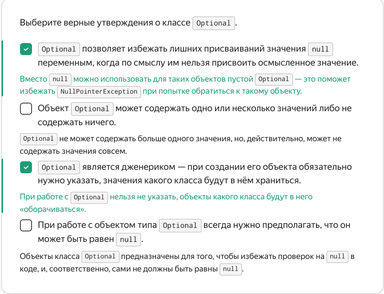
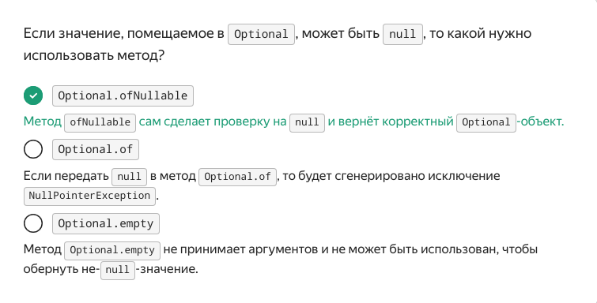
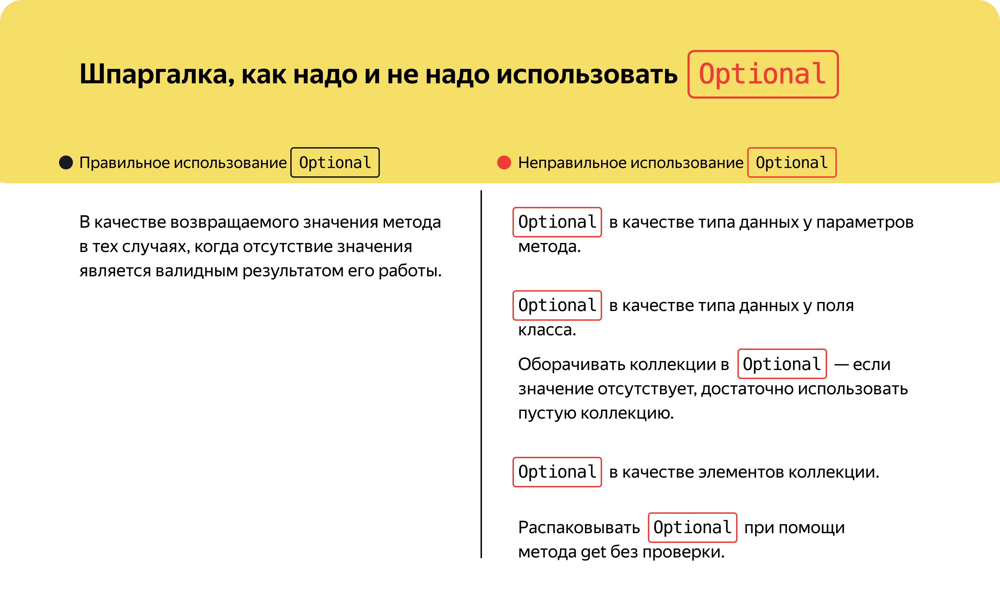

   Предыдущее занятие   |         &nbsp;          |   Следующее занятие    
:----------------------:|:-----------------------:|:----------------------:
 [Урок 21](LESSON21.MD) | [Содержание](../README.MD) | [Урок 23](LESSON23.MD)

# Урок 22. Класс Optional

# Требования к сдаче работы

Задание выполняется в среде программирования Idea. Результат надо разместить в своем репозитории на GitHub.
Прислать в гугл-формы(размещенная на моем сайте) ссылку на репозиторий.

***Критерии оценивания***

* Оценка 5 - надо сделать все задания.
* Оценка 4 - надо сделать любые два задания.
* Оценка 3 - надо сделать любое одно задание.

## Оглавление

1. [Optional](#optional)
   * [Что, если метод не может вернуть значение](#что-если-метод-не-может-вернуть-значение)
   * [Класс Optional](#класс-optional)
   * [Методы для создания Optional-объекта](#методы-для-создания-optional-объекта)
   * [Методы для чтения Optional](#методы-для-чтения-optional)
   * [Стримы и Optional](#стримы-и-optional)
   * [Optional не для всего](#optional-не-для-всего)
2. [Краткий конспект уроков 20-22](#краткий-конспект-уроков-20-22)
3. [Задание 1](#задание-1)
4. [Задание 2](#задание-2)
5. [Задание 3](#задание-3)
<details>
<summary>Optional</summary>

## Optional

Помимо стримов и лямбда-функций, в Java 8
8 добавился ещё один полезный инструмент — тип `Optional`.


### Что, если метод не может вернуть значение

В программировании часто возникает ситуация, когда метод
не может вернуть никакого значения. Например, метод поиска конфеты
по наименованию может как вернуть конфету, если нашёл её, так и не вернуть, если конфеты с 
указанным названием нет. Возникает вопрос: что должен возвращать метод, если нужного значения нет?

До определённого момента в Java было только два варианта, 
как поступить в таком случае. Первый — выбросить исключение («Конфета не найдена!»), 
второй — вернуть `null`, то есть показать отсутствие значения. Оба варианта, однако, 
имеют свои недостатки.

Выбрасывание исключения само по себе означает, что в коде возникла какая-то неправильная, 
некорректная ситуация. Однако то, что значение не найдено, — вполне валидный результат: 
пользователь не может знать, какие значения есть в программе. 

Второй вариант, который до недавнего времени использовался чаще всего, — возврат `null`. 
Однако он накладывает ограничения на вызывающий код — после вызова нашего 
метода нужно обязательно проверить, не равно ли найденное значение `null`. 
Только после такой проверки значение можно использовать дальше. 
На практике про такую проверку легко забыть. 

Кроме того, не всегда очевидно, может ли метод, который мы вызываем,
при каких-то условиях вернуть `null`. Именно поэтому ошибка `NullPointerException` 
(возникает, когда мы пытаемся вызвать метод или обратиться к полю `null`-объекта) 
является одной из самых частых в Java-программах. 


### Класс Optional

Решить проблемы, связанные с тем, что метод не может вернуть нужное значение, 
призван тип `Optional`.

> `Optional<T>` — это специальный класс-обёртка,
объект которого может содержать значение класса T либо не содержать ничего. 

Объект `Optional` можно создать на основе любого другого объекта в Java, в том 
числе объекта самого класса `Optional` (такие конструкции иногда встречаются).

К примеру, метод поиска конфеты будет возвращать вместо объекта `Candy` объект `Optional<Candy>`,
который будет содержать либо конфету, либо пустое значение. Использование обёртки `Optional` 
информирует вызывающий код, что нужного значения может не быть и эту 
ситуацию нужно отдельно обработать.




### Методы для создания Optional-объекта

Чтобы создать объект класса `Optional`, нужно воспользоваться одним из трёх статических методов. 

* Метод `Optional.of`

    `Optional.of` принимает в качестве аргумента значение любого типа. При этом важно, 
чтобы передаваемое значение не равнялось `null`, — иначе будет сгенерировано исключение. 
Этот метод полезен, когда нужно вернуть значение, обёрнутое в `Optional`, 
и заранее известно, что оно не равно null. Например, если оборачивается константа.

```java
Optional<Integer> optionalNumber = Optional.of(123);
```

* Метод `Optional.ofNullable`

    `Optional.ofNullable` принимает в качестве аргумента значение любого типа, 
при этом оно может быть равно `null`. Это полезно, когда заранее неизвестно, 
равно ли оборачиваемое значение `null` или нет. Например, если значение было получено 
из другого метода или содержится в переменной. Если значение равно `null`, 
будет создан пустой `Optional`.

```java
String someString = ...; // значение может прийти из другого метода и равняться null
Optional<String> optionalString = Optional.ofNullable(someString);
```

* Метод `Optional.empty`
    
    `Optional.empty` не принимает аргументов и создаёт объект класса `Optional`,
не содержащий значения (англ. **empty** — «пустой»). Этот метод используется, 
когда нужно вернуть `Optional` без значения. Так можно обозначить, 
что требуемый результат не может быть получен (например, не найден).

```java
public Optional<Integer> findFirstGreaterThan(int n, Collection<Integer> numbers) {
    for (Integer num : numbers) {
        if(num > n) return Optional.of(num); // число больше n найдено
    }
    return Optional.empty(); // в переданных числах, нет числа больше чем n
}
```

Все три метода — `Optional.of`, `Optional.ofNullable` и `Optional.empty` — применяются на стороне, возвращающей опциональное значение.



### Методы для чтения Optional

У класса `Optional` также есть много методов, которые применяются на стороне, 
получающей опциональное значение. Они нужны для обработки ситуаций, когда `Optional` 
содержит или не содержит значений. Это следующие методы.

* `isPresent` и `isEmpty`

    Используются для проверки, содержит ли объект типа `Optional` значение, или он пуст.

```java
Optional<Double> optionalPrice = Optional.of(123.4);
System.out.println(optionalPrice.isPresent()); // вернёт true
System.out.println(optionalPrice.isEmpty()); // вернёт false
```
*  `get`

    Используется для получения результата, содержащегося в `Optional`.
Однако если объект Optional не содержит значения, то вызов этого метода приведёт 
к генерации исключения `NoSuchElementException`. Поэтому, прежде чем вызывать метод `get`,
нужно предварительно убедиться, что `Optional` не пуст. 

```java
Optional<Integer> optNumber = findFirstGreaterThan(5, Set.of(1, 2, 3, 4));
if(optNumber.isPresent()) { // проверяем, что объект класса Optional содержит значение
    // вызываем метод get, чтобы получить значение, содержащееся в Optional
    System.out.println("Найденное число равно: " + optNumber.get());
}
```

* `orElseThrow`, `orElse` и `orElseGet`

    Эти три метода позволяют либо получить содержащееся в `Optional` значение, 
    либо задать поведение в случае, если объект класса `Optional` пуст. 
    
    Метод `orElseThrow` в качестве аргумента принимает лямбду, возвращающую исключение, 
    которое нужно выбросить, если `Optional` пуст. Этот метод используется, 
    если для логики программы отсутствие значения критично и работа не может быть продолжена. 
    
    Метод `orElse` позволяет задать значение по умолчанию. В качестве аргумента 
    он принимает значение того же типа, что и значение внутри `Optional`.
    Именно оно будет возвращено, если `Optional` окажется пустым. 
    
    Метод `orElseGet` похож на `orElse`, но в качестве аргумента принимает лямбду 
    типа `Supplier`. Этот метод нужно использовать, когда вычисление значения 
    по умолчанию является дорогой операцией и его выполнение нужно отложить. 
    До того момента, пока не будет точно известно, что `Optional` пуст.

```java
// Вызываем метод, возвращающий Optional<Integer>, и затем распаковываем его
// Если Optional пуст, выкидываем специально созданное исключение,
// не обобщённое NoSuchElementException, которое генерируется при использовании get
Integer number = findFirstGreaterThan(5, Set.of(1, 2, 3, 4))
        .orElseThrow(() -> new NumberNotFoundException("Число больше 5 не найдено"));

// Вызываем метод, возвращающий Optional<Integer> и затем распаковываем его
// Если Optional пуст, возвращаем значение по умолчанию
Integer number = findFirstGreaterThan(5, Set.of(1, 2, 3, 4))
        .orElse(100500);

// Вызываем метод, возвращающий Optional<Integer> и затем распаковываем его
// Если Optional пуст, то будет вычислено значение по умолчанию в методе 
// someHeavyComputation(), но мы не хотим, чтобы этот метод запустился сразу (что
// произошло бы, если бы использовался orElse), а только если Optional пуст
// Оборачиваем его в лямбду, которая будет вызвана только после проверки
Integer number = findFirstGreaterThan(5, Set.of(1, 2, 3, 4))
        .orElseGet(() -> someHeavyComputation());
```

* `ifPresent`

    Позволяет выполнить действие со значением внутри `Optional`.
    Этот метод полезен, если значение внутри `Optional` нам нужно разово, 
    при этом для логики программы не принципиально, если значение отсутствует вовсе. 
    В качестве аргумента данный метод принимает лямбду типа `Consumer`. 

```java
// Вызываем метод, возвращающий Optional<Integer>, и передаём лямбду
// Лямбду нужно выполнить, если Optional содержит значение
// В качестве лямбды используем ссылку на метод, который выводит значение на экран
findFirstGreaterThan(5, Set.of(1, 2, 3, 4))
        .ifPresent(System.out::println);
```

* `ifPresentOrElse`

    Позволяет указать, какие нужно выполнить действия в ситуации, 
    когда внутри `Optional` есть значение, и в ситуации, когда нет. 
    В качестве аргументов принимает две лямбды типа `Consumer` и `Runnable`.

    > `Runnable` — это функциональный интерфейс, описывающий функцию, 
  > не принимающую никаких аргументов и не возвращающую никакого значения.

```java
// Вызываем метод, возвращающий Optional<Integer>, и передаём две лямбды
// Первая выполнится в случае, если Optional не пуст,
//  вторая — если пуст
findFirstGreaterThan(5, Set.of(1, 2, 3, 4))
        .ifPresentOrElse(
                number -> System.out.println("Найденное число равно " + number),
                () -> System.out.println("Число не найдено")
        );
```

### Стримы и Optional

Некоторые из терминальных операций стримов возвращают объект типа `Optional`.
Например, операция `findFirst()` возвращает первый элемент стрима, 
но стрим может не содержать элементов, поэтому возвращаемое значение имеет тип `Optional`. 
В случае пустого стрима он будет пустым.

К примеру, с помощью стрима найдём и получим из списка первую конфету производства 
«Главной шоколадной фабрики». В исходном списке таких конфет нет, 
поэтому `Optional` окажется пустым — это можно проверить с помощью метода `isPresent`. 
Чтобы `isPresent()` вернул `true`, раскомментируйте строчку 
с добавлением конфеты «Шоколадный полёт» от «Главной шоколадной фабрики». 
Тогда можно будет получить конфету и выполнять с ней любые операции.
В данном случае — вывести название на экран.

```java
import java.util.ArrayList;
import java.util.List;
import java.util.Set;
import java.util.Collection;
import java.util.Optional;

public class CandyStore {

    public static void main(String[] args) {
        Candy candy1 = new Candy("Мишка на севере", "Первая кондитерская фабрика", 28, 4, Set.of("Мишка косолапый", "Мишка"));
        Candy candy2 = new Candy("Мишка в лесу", "Триумф", 32, 2, Set.of("Мишка косолапый"));
        
        List<Candy> candies = new ArrayList<>();
        candies.add(candy1);
        candies.add(candy2);

        //добавляем конфету фабрики Главная шоколадная фабрика
        //раскомментируйте строчку, чтобы Optional стал не пустым
        candies.add(new Candy("Шоколадный полет", "Главная шоколадная фабрика", 84, 0, Set.of("ШОКОЛАДНЫЙ ПОЛЕТ")));

        Optional<Candy> maybeChokoCandy = candies.stream()
                //выбираем только конфеты Главной шоколадной фабрики
                .filter(candy -> candy.producer.equals("Главная шоколадная фабрика"))
                //получаем первую из них
                .findFirst();
        //если такая конфета существует, выводим ее название
        if (maybeChokoCandy.isPresent()) {
            Candy chokoCandy = maybeChokoCandy.get();
            System.out.println(chokoCandy.name);
        } else {
            System.out.println("Такой конфеты не существует");
        }
    }
}

class Candy {
    final String name;
    final String producer;
    final int price;
    final int amountSold;
    final Set<String> alternateNames;

    public Candy(String name, String producer, int price, int amountSold, Collection<String> alternateNames) {
        this.name = name;
        this.producer = producer;
        this.price = price;
        this.amountSold = amountSold;
        this.alternateNames = Set.copyOf(alternateNames);
    }

}
```
С использованием метода `ifPresentOrElse` часть кода по работе с `Optional` можно переписать. 

```java
maybeChokoCandy.ifPresentOrElse(
    // если Optional не пуст
    candy -> System.out.println(candy.name),
    // если Optional пуст
    () -> System.out.println("Такой конфеты не существует")
);
```

Плюс использования варианта с `ifPresentOrElse` — можно не сохранять результат,
содержащий `Optional`, в промежуточную переменную `maybeChokoCandy`.
То есть сразу продолжить цепочку вызовов. Стрим тогда будет выглядеть так.

```java
candies.stream()
    // выбираем только конфеты «Главной шоколадной фабрики»
    .filter(candy -> candy.producer.equals("Главная шоколадная фабрика"))
    // получаем первую из них
    .findFirst()
    .ifPresentOrElse(
        // если Optional не пуст
        candy -> System.out.println(candy.name),
        // если Optional пуст
        () -> System.out.println("Такой конфеты не существует")
    );
```

### Optional не для всего

Может сложиться впечатление, что `Optional` стоит использовать везде,
где предполагается опциональность чего-либо, — например,
если метод имеет необязательный параметр. Это не так: тип `Optional` в Java предназначен 
только для использования в качестве возвращаемого значения метода в тех случаях, 
когда отсутствие значения является валидным результатом его работы.




</details>

<details>

<summary>Краткий конспект уроков 20-22</summary>

## Краткий конспект уроков 20-22


* **Функциональное программирование** — парадигма, в которой вычисления основаны на функциях и их взаимодействиях.
* Существуют **декларативный** и **императивный** подходы. Декларативный стиль фокусируется на «что делать», а не «как делать», в отличие от императивного стиля, который акцентирует внимание на деталях реализации.
* Инструмент ё — это новый способ обработки данных, который вводит концепцию функционального программирования в Java. Он позволяет обрабатывать коллекции данных в высокоуровневом стиле и при этом сосредоточиться на операциях, а не на деталях их реализации.
* Операции, которые совершают над стримами, бывают **промежуточные** и **терминальные**:
  * промежуточные операции задают правила изменения стрима и возвращают трансформированный поток исходных данных;
  * терминальные операции завершают обработку стрима и возвращают результат.
* Основные функциональные операции — `map` и `filter`. Эти методы позволяют трансформировать, фильтровать и объединять данные в стриме. С ними ваш код станет более декларативным.
* **Лямбда-выражение** — компактное представление функций. Теперь вы знаете, 
как использовать лямбды в своём коде. Например, `(a, b) -> a + b` — это лямбда-выражение, которое описывает функцию сложения двух чисел.
* **Механизм замыкания** — важная особенность лямбда-выражений. 
Даже если переменная не была явно объявлена как `final`, она считается `effectively final`, если после инициализации её значение больше не меняется. Такие переменные можно безопасно использовать в лямбда-выражениях, потому что они не будут изменены.
* **Побочный эффект** в программировании — это ситуация, когда функция во время вычисления результата что-то делает с данными, используемыми в других частях программы (за пределами этой функции). Например, изменяет глобальную переменную или выводит данные на экран.
* **Чистые функции** — это функции, которые не имеют побочных эффектов и всегда возвращают одинаковый результат для одних и тех же входных данных. Они не зависят от внешнего состояния и не меняют его.
* Самые популярные **функциональные интерфейсы** стандартной библиотеки:
  * **Function<T, R>**: интерфейс, представляющий функцию, которая принимает один аргумент типа 
  `T` и возвращает результат типа `R`. Основной метод: `R apply(T t)`.
  * **Predicate<T>**: функциональный интерфейс, представляющий предикат (условие),
  который принимает один аргумент типа `T` и возвращает `boolean`. Основной метод: `boolean test(T t)`.
  * **Consumer<T>**: функциональный интерфейс, представляющий операцию, 
  которая принимает один входной аргумент и не возвращает результат. 
  Основной метод: `void accept(T t)`.
  
* Класс `Optional` представляет собой контейнер объекта. 
Он может содержать или не содержать значение и позволяет избежать ошибок, 
связанных с `null`-значениями. Работать с этим классом позволяют специальные методы.

### методы класса `Optional` из уроков

* `orElseThrow` — позволяет генерировать исключение, если значение отсутствует;
* `orElse` — позволяет предоставить альтернативное значение для `Optional`, если оно отсутствует;
* `orElseGet` — похож на `orElse`, но вместо значения принимает лямбду типа `Supplier`, которая будет вызвана для получения альтернативного значения;
* `isPresent` — возвращает `true`, если в `Optional` есть значение, и `false` в противном случае;
* `isEmpty` — возвращает `true`, если в `Optional` нет значения, и false в противном случае;
* `ifPresent` — принимает `Consumer` и выполняет его, если в `Optional` есть значение;
* `ifPresentOrElse` — принимает два аргумента: `Consumer` (если значение присутствует) и `Runnable` (если значение отсутствует).

</details>


<details>

<summary>Задание 1</summary>

## Задание 1

Метод `requestUserName` запрашивает у пользователя его имя 
(пока мы оставили за кадром эту часть логики и предполагаем, что полученное имя попало в 
переменную username). Затем имя пользователя отображается на экране.
Но мы допускаем, что пользователь хочет сохранить своё имя в тайне, — и поэтому метод 
`requestUserName` возвращает тип `Optional`. 
Ваша задача — реализовать недостающий код по работе с `Optional`-значениями.

```java
import java.util.Optional;

public class OptionalNameDemo {

    static Optional<String> requestUserName() {
        //Здесь должен быть запрос к пользователю, но пока его не реализовали
        //Поместите в переменную username имя пользователя или оставьте ее пустой, если имя скрыто
        String username = "";

        if (username.isBlank()) {
            //вставьте код здесь
        } else {
            //вставьте код здесь
        }
    }

    public static void main(String[] args) {
        Optional<String> maybeName = requestUserName();
        if (/*вставьте код здесь*/) {
            //вставьте код здесь
            System.out.println("Привет, " + name + "!");
        } else {
            System.out.println("Ваше право не называть имя!");
        }
    }
}

```

### Подсказки

* В методе `requestUserName` используйте методы `Optional.of` и `Optional.empty`, 
чтобы «обернуть» прочитанное имя пользователя в `Optional`.
* Извлечь имя из `Optional` помогут методы `isPresent()` и `get()`.


</details>

<details>

<summary>Задание 2</summary>

## Задание 2

Доработайте код, который выводит на экран первое чётное число из списка. 
Если чётные числа в списке отсутствуют, он должен выводить строку "Чётное число не найдено".

```java

import java.util.stream.Stream;

public class OptionalInStreams {

    public static void main(String[] args) {
        Stream.of(1, 2, 3, 4, 5)
                .filter(number -> number % 2 == 0)
                .//выбрать первый отфильтрованный элемент
                .//вывести на экран найденное число либо строку "Чётное число не найдено"
    }
}


```

### Подсказки

* Чтобы задать поведение для случаев,
когда число найдено и не найдено, используйте метод `ifPresentOrElse`.


</details>


<details>

<summary>Задание 3</summary>

## Задание 3

Магазин конфет просит вас доработать их программную систему. На
сайте магазина должен появиться поиск конфет по названию. Код поиска должен 
быть организован по такому алгоритму:
* Сначала нужно проверить, есть ли искомая конфета на складе магазина. Если конфета найдена, то возвращается информация о ней.
* Если на складе магазина конфета отсутствует — нужно проверить наличие у поставщиков. Если конфеты были найдены, то возвращается информация о них.
* Если конфета не была найдена, вернуть пустой результат.

За поиск конфет на складе магазина отвечает класс `Warehouse`, за поиск конфет 
на складах поставщиков — класс `SRM`. Класс `SRM` поставляется с SRM-системой 
(SRM сокр. от англ. Supplier Relationship Management System — система управления 
взаимодействием с поставщиками) — у вас нет возможности повлиять на реализацию этого класса. 
Но можно использовать два его метода:
1. `listSuppliers` — чтобы получить набор доступных поставщиков;
2. `getProduct` — чтобы получить информацию о конфете по её названию и поставщику. 
Но если поставщик или товар отсутствуют, этот метод вернёт `null`.

Класс `SearchService` будет содержать в себе общий алгоритм поиска и обращаться 
к классам `Warehouse` и `SRM`. Действуйте пошагово:
* Реализуйте метод `search` в классе `Warehouse` — для поиска конфеты на складе магазина.
* Реализуйте вспомогательный метод `supplierSearch` в классе `SearchService` для поиска конфеты на складах поставщиков с использованием объекта класса SRM. Из всех найденных конфет нужно выбрать конфету с наименьшей ценой. Для этого пригодится метод `min` из `Stream API`. Он находит минимальный элемент стрима при помощи объекта типа `Comparator`.
* Реализуйте метод search в классе `SearchService` для поиска конфеты на складе магазина или на складах поставщиков, если на складе магазина она отсутствует. Этот метод будет использоваться как входной для запуска поиска.
* Доработайте метод `main` класса `Practicum`, чтобы на экран выводилась нужная информация:
  * Если конфеты найдены: `Товар "[название_конфет]" доступен в количестве [количество] кг по цене [цена] руб за кг"` (в квадратных скобках должны быть значения найденного товара).
  * Если конфеты не найдены: `Данный товар не найден`.

`Candy`

```java
import java.util.Collection;
import java.util.HashSet;
import java.util.Set;

public class Candy {
    // название
    final String name;
    // цена
    final double price;
    //проданное количество
    final int amount;
    // другие варианты названия
    final Set<String> alternativeNames;

    public Candy(String name, double price, int amount, Collection<String> alternativeNames) {
        this.name = name;
        this.price = price;
        this.amount = amount;
        this.alternativeNames = Set.copyOf(alternativeNames);
    }

    public Candy(String name, double price, int amount) {
        this.name = name;
        this.price = price;
        this.amount = amount;
        this.alternativeNames = new HashSet<>();
    }
}
```

`SRM`

```java
import java.util.*;

//содержимое этого класса не нужно менять
public class SRM {
    private final Map<String, List<Candy>> suppliersProducts = new HashMap<>();

    public SRM() {
        suppliersProducts.put("Первая кондитерская фабрика", List.of(
                new Candy("Мишка на севере", 34.4, 100, Set.of("Мишка косолапый", "Мишка")),
                new Candy("Победа",56, 35, Set.of("Победа вкуса")),
                new Candy("Два верблюда",20, 47, Set.of("Каракум", "Африка")),
                new Candy("Красная шапочка",35, 3, Set.of("КРАСНАЯ ШАПОЧКА"))
        ));

        suppliersProducts.put("Триумф", List.of(
                new Candy("Мишка в лесу", 34.2, 63, Set.of("Мишка косолапый")),
                new Candy("Трюфель",21, 25, Set.of("Трюфель классический", "Трюфель шоколадный"))
        ));

        suppliersProducts.put("Сладости Везде", List.of(
                new Candy("Шоколадный восторг",33.98, 257, Collections.emptySet()),
                new Candy("Африка",25, 114, Set.of("Каракум"))
        ));
        suppliersProducts.put("ООО Дом Шоколада", List.of(
                new Candy("ШокоБомб",20, 1, Set.of("Шоко_бомб")),
                new Candy("Трюфель классический",35, 94, Set.of("Трюфель шоколадный"))
        ));

    }

    // Возвращает название всех поставщиков
    public Set<String> listSuppliers() {
        // Создаём новую коллекцию на основе множества имеющихся поставщиков
        // Создание новой коллекции необходимо, чтобы клиентский код не смог
        // повлиять на содержимое, хранящееся в Map
        return new HashSet<>(suppliersProducts.keySet());
    }

    // Возвращает информацию о товаре на складе поставщика
    // Если поставщик или товар не найден, возвращает null
    public Candy getProduct(String supplierName, String candyName) {
        List<Candy> candies = suppliersProducts.get(supplierName);
        if(candies != null) {
            for (Candy candy : candies) {
                if(candy.name.equals(candyName)
                        || candy.alternativeNames.contains(candyName)) {
                    return candy;
                }
            }
        }
        return null;
    }
}
```

`Warehouse`

```java
import java.util.List;
import java.util.Optional;
import java.util.Set;

public class Warehouse {
    private List<Candy> candies;

    public Warehouse() {
        this.candies = List.of(
                new Candy("Мишка в лесу", 32, 2, Set.of("Мишка косолапый")),
                new Candy("Трюфель", 44, 5, Set.of("Трюфель классический", "Трюфель шоколадный")));
    }

    // Ищет конфеты на складе по их названию
    // Возвращает пустой Optional, если конфеты отсутствуют
    // или в обратном случае Optional, содержащий соответствующие конфеты 
    public Optional<Candy> search(String name) {
        // Реализуйте данный метод с использованием Stream API
    }
}
```

`SearchService`

```java
import java.util.Comparator;
import java.util.Optional;

public class SearchService {
    // Создаём объект класса, отвечающий за склад магазина
    private final Warehouse warehouse = new Warehouse();
    // Создаём объект класса, отвечающий за работу с поставщиками
    public final SRM srm = new SRM();

    // Основной метод поиска
    // Проверяет наличие товара с указанным именем на складе магазина
    // Если товар отсутствует, то проверяются склады поставщиков,
    // предпочтение отдаётся тому поставщику, у которого наименьшая цена товара.
    // Для поиска товара на складе поставщиков используется метод supplierSearch
    // Если товар нигде не найден, то возвращается пустой Optional
    public Optional<Candy> search(String candyName) {
        // Реализуйте данный метод, с использованием методов Optional
    }

    // Ищет товар с указанным именем на складах поставщиков
    // Возвращает Optional с самым дешевым вариантом товара среди всех
    // поставщиков или пустой Optional, если товар не найден
    private Optional<Candy> supplierSearch(String candyName) {
        // Реализуйте данный метод при помощи Stream API и Optional,
        // используйте метод min из Stream API для нахождения товара с наименьшей ценой
    }
}
```

`Practicum`


```java
public class Practicum {
    public static void main(String[] args) {
        // Доработайте данный метод, чтобы на экран выводилось 
        // сообщение в соответствии с заданием

        SearchService searchService = new SearchService();

        searchService.search("Африка")
    }
}
```

### Подсказки

* В методе `search` класса `Warehouse` конвертируйте коллекцию конфет в `Stream` и 
отфильтруйте по названию (не забывайте, что у конфеты могут быть альтернативные названия).
* Вернуть результат обработки потока можно методом `findFirst`.
* В методе `supplierSearch` класса `SearchService` необходимо получить стрим, 
содержащий всех поставщиков и для каждого поставщика попытаться найти искомую конфету.
* Не забывайте, что метод `getProduct` класса `SRM` может вернуть `null`. 
Результат этого метода нужно обернуть в `Optional`. Затем можно использовать методы `Stream`, 
чтобы отфильтровать пустые результаты и получить только имеющиеся товары — `.filter(Optional::isPresent)/.map(Optional::get)`.
* Чтобы получить товар с наименьшей ценой, воспользуйтесь 
терминальным методом `min` из `Stream API`, он вернет `Optional` с
минимальным элементом в потоке, или пустой `Optional`, если в потоке
нет элементов — `.min(Comparator.comparing(candy -> candy.price)`.

</details>


   Предыдущее занятие   |         &nbsp;          |   Следующее занятие    
:----------------------:|:-----------------------:|:----------------------:
 [Урок 21](LESSON21.MD) | [Содержание](../README.MD) | [Урок 23](LESSON23.MD) 