   Предыдущее занятие   |         &nbsp;          |   Следующее занятие    
:----------------------:|:-----------------------:|:----------------------:
 [Урок 22](LESSON22.MD) | [Содержание](../README.MD) | [Урок 24](LESSON24.MD)

# Урок 23. Дата и время

# Требования к сдаче работы

Задание выполняется в среде программирования Idea. Результат надо разместить в своем репозитории на GitHub.
Прислать в гугл-формы(размещенная на моем сайте) ссылку на репозиторий.

***Критерии оценивания***

* Оценка 5 - надо сделать все задания.
* Оценка 4 - надо сделать любые четыре задания.
* Оценка 3 - надо сделать любые три задания.

## Оглавление
1. [Unix-время. Класс Instant](#unix-время-класс-instant)
   * [Unix-эпоха](#unix-эпоха)
   * [Класс Instant и его методы](#класс-instant-и-его-методы)
     * [now()](#метод-now)
     * [toString()](#метод-tostring)
     * [toEpochMilli()](#метод-toepochmilli)
     * [ofEpochSecond(long epochSecond), ofEpochMilli(long epochMilli) и ofEpochSecond(long epochSecond, long nanoAdjustment)](#методы-ofepochsecondlong-epochsecond-ofepochmillilong-epochmilli-и-ofepochsecondlong-epochsecond-long-nanoadjustment)
   * [Работа с экземплярами класса Instant](#работа-с-экземплярами-класса-instant)
2. [LocalDateTime, LocalDate и LocalTime](#классы-localdatetime-localdate-и-localtime)
   * [Класс LocalDateTime](#класс-localdatetime)
   * [Методы LocalDateTime](#методы-localdatetime)
   * [LocalDateTime и текст](#localdatetime-и-текст)
   * [LocalDateTime = LocalDate + LocalTime](#localdatetime--localdate--localtime)
3. [Задание 1](#задание-1)
4. [Задание 2](#задание-2)
5. [Задание 3](#задание-3)
6. [Задание 4](#задание-4)
7. [Задание 5](#задание-5)

<details>

<summary>Unix-время. Класс Instant</summary>

## Unix-время. Класс Instant

В этой теме мы расскажем о том, как Java взаимодействует с временем внутри кода. 
Вам пригодятся эти знания для корректной работы программы в самых разных случаях:
* например, будильник, поставленный на 8:00, не должен прозвенеть в 5:00 — этого не случится, 
если время в приложении будет совпадать с временем пользователя;
* или доступное время доставки на сайте должно быть идентично значениям, хранящимся на сервере,
— для этого необходимо настроить синхронизацию времени между разными сервисами;
* а видеоконференция, запланированная на 10:30 по московскому времени,
в Перми начнётся вовремя — в 12:30, если ваша программа умеет учитывать часовые пояса.


### Unix-эпоха
В Java время хранится в виде целого числа — количества **миллисекунд**, прошедших с 0 часов
**0 минут 0 секунд 1 января 1970 года**. Такая точка отсчёта была выбрана 
разработчиками операционной системы `Unix`, «бабушки» большинства современных систем.
Почему именно этот день? Всё просто: на тот момент это была ближайшая круглая дата.

Точку начала, 0 часов 0 минут 0 секунд 1 января 1970 года, 
называют **Unix Epoch** (англ. «Unix-эпоха»), 
а саму систему представления времени — **Unix time** (англ. «Unix-время»).

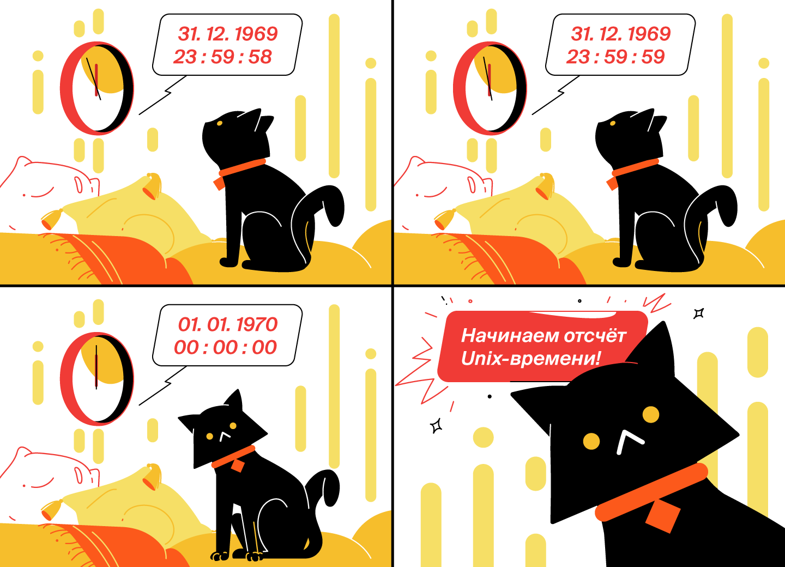

Существует несколько стандартов измерения и записи времени. 
Вот два основных:
* **GMT** (англ. _Greenwich Mean Time_, «среднее время по гринвичскому меридиану») — момент, 
когда солнце находится в своей наивысшей точке точно над лондонским районом Гринвич, 
соответствует 12:00 дня GMT. 
Но так как вращение Земли неравномерно, то, согласно GMT, в каком-то году секунды будут 
«длиннее», в каком-то — наоборот, «короче». Этот стандарт времени принимался до 
1972 года.
* **UTC** (англ. _Coordinated Universal Time_, «всемирное координированное время») 
пришёл на смену гринвичскому среднему времени. В стандарте UTC все секунды постоянны
и отсчитываются с помощью специальных атомных часов.
В зависимости от местоположения и зимнего/летнего времени (если оно есть) к 
UTC добавляют или убавляют дополнительное время — это называется 
**смещением относительно UTC**. Например, время в Москве смещено на +3 часа относительно UTC, 
что обозначается как UTC+3.
> 💡 Unix-время соответствует времени UTC без какого-либо смещения — 
> его ещё иногда обозначают как UTC0.
 
Любой момент в системе Unix-времени представлен в виде целого числа — это количество миллисекунд от эпохи Unix. Например, 
1609416000000. Давайте посчитаем, что это за дата в конкретном часовом поясе. 
Допустим, в Москве. Для этого нужно:
* Посчитать, сколько в этом числе миллисекунд содержится полных дней, часов, минут и секунд, — 
18627 дней, 12 часов, 0 минут.
* Прибавить полученные значения к Unix-эпохе (
00:00:00 01.01.1970), получится дата и время в UTC0 — 12:00 31 декабря 2020 года.
* Добавить ещё 3 часа (смещение московского времени: UTC+3). Получим указанный момент Unix-времени, пересчитанный на московское время, —
15:00 31 декабря 2020 года.

Количество времени в миллисекундах от Unix-эпохи ещё называют **timestamp** (англ. «_метка времени_»). 
Метки времени — универсальный и общепринятый способ описания момента во времени в виде целого 
числа. Такое представление удобно и практично для передачи по сети или хранения в базе данных. 

Например, банки могут обрабатывать тысячи транзакций в секунду — и для каждой нужно сохранить 
точное время её открытия и закрытия. Если с каждой транзакцией передавать 
отдельными полями часы, минуты, секунды, миллисекунды, год, месяц, день, 
часовой пояс — это сильно увеличит объём данных. 
Эффективнее использовать метки времени: временная зона жёстко задана как UTC0, 
дата отсчёта известна, поэтому всё, что нужно передать, — 
это количество миллисекунд, прошедших с Unix-эпохи до возникновения события 
(например, исполнения транзакции). 


### Класс Instant и его методы

В Java есть класс, который представляет метки времени, — `Instant` (англ. «мгновение»). 
Он хранит не только количество миллисекунд от эпохи Unix, но и количество наносекунд(1 миллисекунда = 1 000 000 наносекунд.). 

`Instant` предоставляет много удобных статических методов.

#### Метод now()

Чтобы получить текущую метку времени, можно воспользоваться методом `now()`:

```java
Instant currentTimestamp = Instant.now(); 
```

В момент вызова метода `now()` создаётся экземпляр класса `Instant`, 
в котором будет храниться количество милли- и наносекунд Unix-времени. 

#### Метод toString()
Если у экземпляра `Instant` вызвать метод `toString()` (например, передав экземпляр
в System.out.println()), то дата и время будут выведены в формате
ISO 8601: год-месяц-деньTчасы:минуты:секундыZ. Например, 
12:45:50.123456 23 ноября 2021 года будет выглядеть как 2021-11-23T12:45:50.123456Z:

```java
import java.time.Instant;

class Practicum {
    public static void main(String[] args) {
        Instant currentTimestamp = Instant.now();
        System.out.println(currentTimestamp); 
    }
}
```

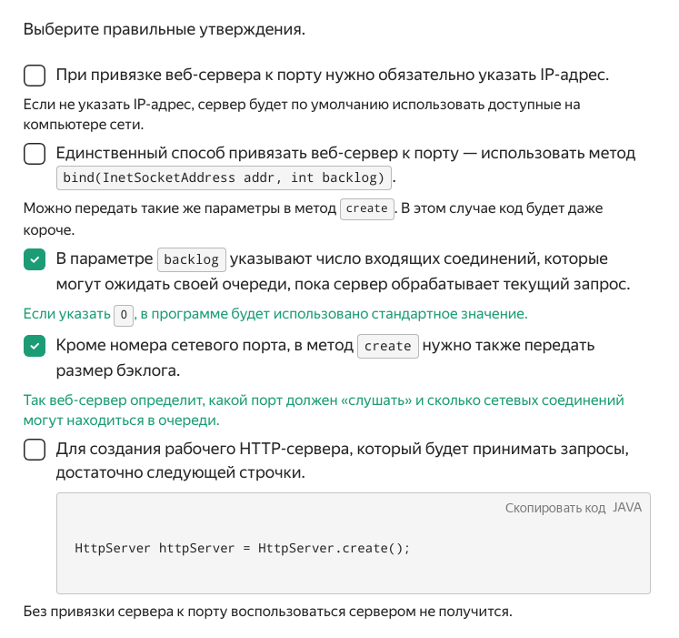

#### Метод toEpochMilli()

Посчитать количество миллисекунд с Unix-эпохи до конкретной метки времени можно 
с помощью метода `toEpochMilli()`:

```java
import java.time.Instant;

public class Practicum {
    public static void main(String[] args) {
        Instant currentTimestamp = Instant.now();
        long milliseconds = currentTimestamp.toEpochMilli();
        System.out.println(milliseconds);
    }
}
```


#### Методы ofEpochSecond(long epochSecond), ofEpochMilli(long epochMilli) и ofEpochSecond(long epochSecond, long nanoAdjustment)

Зная количество секунд от момента события до эпохи Unix, 
можно создать экземпляр класса `Instant` с помощью статического 
метода `ofEpochSecond(long epochSecond)`. Или `ofEpochMilli(long epochMilli)` — если 
известно количество миллисекунд. Если же нужен момент времени с точностью до наносекунд, 
можно воспользоваться методом `ofEpochSecond(long epochSecond, long nanoAdjustment)`:
передаётся количество секунд и отдельным числом — количество наносекунд.

Чтобы получить время до Unix-эпохи (так тоже можно!), нужно передать отрицательное число. 

Например, вывести на экран время запуска первого искусственного 
спутника Земли можно следующим образом:


```java
import java.time.Instant;

public class Practicum {
    public static void main(String[] args) {
        // передаём количество секунд с запуска спутника до Unix-эпохи
        Instant satelliteLaunchFromSec = Instant.ofEpochSecond(-386310686L);
        // или делаем то же самое в миллисекундах
        Instant satelliteLaunchFromMillis = Instant.ofEpochMilli(-386310686000L);
        
        System.out.println(satelliteLaunchFromSec + " — время запуска, заданное через секунды.");
        System.out.println(satelliteLaunchFromMillis + " — время запуска, заданное через миллисекунды.");
    }
}
```


В обоих случаях вывод будет одинаковым: `1957-10-04T19:28:34Z`.

Как и у многих других типов данных, у `Instant` есть ограничения на то, 
какой диапазон дат можно хранить в экземпляре класса. Верхняя граница 
содержится в константе `Instant.MAX`, нижняя — в `Instant.MIN`:

```java
import java.time.Instant;

class Practicum {
    public static void main(String[] args) {
        System.out.println(Instant.MIN);
        System.out.println(Instant.MAX);
    }
}
```

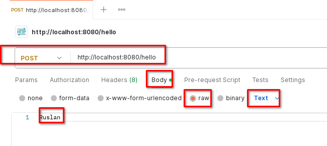

Да-да, `Instant` позволяет хранить даты от миллиарда лет до нашей эры 
и до миллиарда лет и одного года — нашей.

В секундах Unix-времени эти границы выглядят так:

```java

import java.time.Instant;

class Practicum {
    public static void main(String[] args) {
        System.out.println(Instant.ofEpochSecond(-3_155_701_416_721_920L));
        System.out.println(Instant.ofEpochSecond(31_556_889_864_403_199L, 999_999_999));
    }
} 
```

### Работа с экземплярами класса Instant

Экземпляры класса Instant — неизменямые. Это значит, что у уже существующего 
экземпляра нельзя поменять время: например, перевести его на час вперёд. 
Однако можно воспользоваться специальными методами для создания нового 
экземпляра на основе старого, но с другим временем:
* `plusSeconds(long secondsToAdd)` — создаёт экземпляр класса `Instant`, который будет отличаться от текущего на secondsToAdd секунд в бóльшую сторону;
* `plusMillis(long millisToAdd)` — на `millisToAdd` миллисекунд в бóльшую сторону;
* `plusNanos(long nanosToAdd)` — на `nanosToAdd` наносекунд в бóльшую сторону.

Аналогичные методы, но с изменениями в меньшую сторону:

* `minusSeconds(long secondsToSubtract)` — на `secondsToSubtract` секунд;
* `minusMillis(long millisToSubtract)` — на `millisToSubtract` миллисекунд;
* `minusNanos(long nanosToSubtract)` — на `nanosToSubtract` наносекунд.

Таким образом можно определить момент времени, который настанет через какое-то 
количество секунд. Например, этот код позволяет узнать, когда разогреется пицца в микроволновке:

```java
import java.time.Instant;

class Practicum {
    public static void main(String[] args) {
        //Пицца разогревается 180 секунд - это 3 минуты
        long seconds = 180;

        Instant currentMoment = Instant.now();
        System.out.println("Сейчас " + currentMoment);
        Instant futureMoment = currentMoment.plusSeconds(seconds);
        System.out.println("А через " + seconds + " секунд будет " + futureMoment 
                + " и пицца будет готова!");
    }
}
```

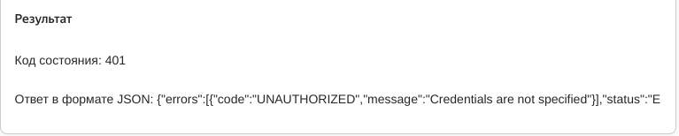


Что было раньше — курица или яйцо? Если и то и другое — экземпляры Instant, 
мы можем ответить на этот вопрос. Определить, как два момента времени расположены 
относительно друг друга на временной оси, можно с помощью следующих методов:

* `isAfter(Instant otherInstant)` — возвращает `true`, если время в экземпляре `Instant`, у которого вызывается метод, находится на временной шкале позже, чем `otherInstant`; и `false` — в противоположном случае;
* `isBefore(Instant otherInstant)` — возвращает `true`, если время в экземпляре `Instant`, у которого вызывается метод, находится на временной шкале раньше, чем `otherInstant`; и `false` — в противоположном случае;
* `equals(Object otherInstant)` — возвращает `true`, если оба экземпляра указывают на один и тот же момент во времени.

```java
import java.time.Instant;
import java.util.Random;

class Practicum {
    public static void main(String[] args) {
        int chickenUnixSecond = new Random().nextInt(1000000000);
        Instant chickenMoment = Instant.ofEpochSecond(chickenUnixSecond);

        int eggUnixSecond = new Random().nextInt(1000000000);
        Instant eggMoment = Instant.ofEpochSecond(eggUnixSecond);

        System.out.println("Курица появилась в " + chickenMoment);
        System.out.println("Яйцо появилось в " + eggMoment);

        if (chickenMoment.isBefore(eggMoment)) {
            System.out.println("Первой была курица!");
        }
        if (chickenMoment.isAfter(eggMoment)) {
            System.out.println("Первым было яйцо!");
        }
        if (chickenMoment.equals(eggMoment)) {
            System.out.println("Яйцо было одновременно с курицей ¯\\_(ツ)_/¯)!");
        }
    }
}
```

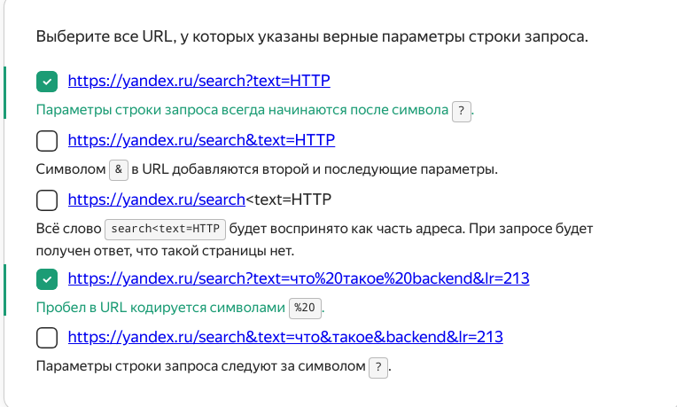

</details>


<details>

<summary>Классы LocalDateTime, LocalDate и LocalTime</summary>

## Классы LocalDateTime, LocalDate и LocalTime

### Класс LocalDateTime

Сохранить текущую дату и время можно с помощью специального класса `LocalDateTime` 
(англ. «местные **локальные** дата и время») и его метода `now()`:

```java
import java.time.LocalDateTime;

class Practicum {
    public static void main(String[] args) {
        // сохраняем в currentMoment текущее время и дату устройства,
        // на котором запускается код
        LocalDateTime currentMoment = LocalDateTime.now();
        System.out.println(currentMoment);
    }
}
```

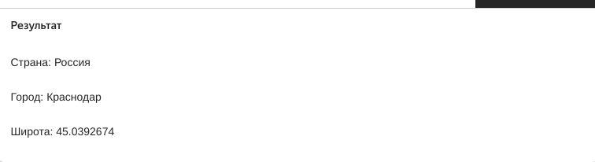

Информацию о текущем времени программа берёт из устройства, на котором она запущена. 
Поэтому если на нём установлено неправильное время, 
то при вызове метода `now()` именно оно и будет сохранено в экземпляр класса `LocalDateTime`. 

> 💡 В этом заключается особенность этого класса: если часы на телефоне пользователя
> намеренно спешат на полчаса, потому что ему так удобно,
> и он ставит будильник, учитывая это смещение, — значит, так тому и быть.


Чтобы создать экземпляр класса `LocalDateTime`, нужно воспользоваться его статическим 
методом `of(...)`. Аргументы идут в порядке уменьшения точности: год, месяц, день месяца, 
часы, минуты, секунды, наносекунды. При этом наносекунды и секунды можно отбросить, 
а месяц удобнее задавать не через порядковый номер, а с помощью констант перечисления 
`java.time.Month`.

Запустите код и проверьте, что данные на выходе отображаются корректно.
Попробуйте создать свои экземпляры класса `LocalDateTime`:

```java
import java.time.LocalDateTime;

import static java.time.Month.FEBRUARY;

class Practicum {
    public static void main(String[] args) {
        // передаём все единицы времени
        // год, месяц, день, часы, минуты, секунды, наносекунды
        LocalDateTime newMillennium = LocalDateTime.of(2000, 1, 1, 0, 0, 0, 0);
        System.out.println(newMillennium);
        // не передаём секунды и наносекунды
        LocalDateTime alsoNewMillennium = LocalDateTime.of(2000, 1, 1, 0, 0);
        System.out.println(alsoNewMillennium);

        // используем месяц из констант перечисления java.time.Month
        LocalDateTime dateTimeOfTwos = LocalDateTime.of(2222, FEBRUARY, 2, 22, 22);
        System.out.println(dateTimeOfTwos);
    }
}
```

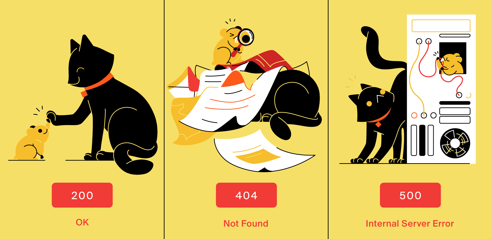


### Методы LocalDateTime

Аналогично классу `Instant`, у `LocalDateTime` есть методы для получения новых экземпляров 
на основе уже имеющихся значений:

* `plusYears(long years)`/`minusYears(long years)` — создаёт новый экземпляр даты и времени с прибавлением/вычитанием указанного количества лет;
* `plusMonths(long months)`/`minusMonths(long months)` — новый экземпляр с прибавлением/вычитанием количества месяцев;
* `plusWeeks(long weeks)`/`minusWeeks(long weeks)` — количества недель;
* `plusDays(long days)`/`minusDays(long days)` — дней;
* `plusHours(long hoursToAdd)`/`minusHours(long hoursToSubtract) `— часов;
* `plusMinutes(long minutesToAdd)`/`minusMinutes(long minutesToSubtract)` — минут;
* `plusSeconds(long secondstoAdd)`/`minusSeconds(long secondsToSubtract)` — секунд;
* `plusNanos(long nanosToAdd)`/`minusNanos(long nanosToSubtract)` — наносекунд.

Каждый вызов метода возвращает новый экземпляр класса:

```java
import java.time.LocalDateTime;

class Practicum {
    public static void main(String[] args) {
        LocalDateTime currentDateTime = LocalDateTime.now();
        System.out.println("Сейчас " + currentDateTime);

        LocalDateTime twoWeeksAgo = currentDateTime.minusWeeks(2);
        System.out.println("Две недели назад было " + twoWeeksAgo);

    }
}
```


А можно «цепочкой» вызвать сразу несколько методов:

```java
import java.time.LocalDateTime;

class Practicum {
    public static void main(String[] args) {
        LocalDateTime currentDateTime = LocalDateTime.now();
        System.out.println("Сейчас " + currentDateTime);

        LocalDateTime newDateTime = currentDateTime.plusMonths(3).plusWeeks(2);
        System.out.println("Через три с половиной месяца будет " + newDateTime);

    }
}
```

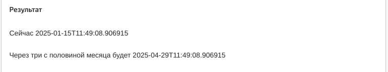

Экземпляры класса `LocalDateTime` можно сравнивать друг с другом с помощью следующих методов:
* `isBefore(LocalDateTime otherMoment)` — проверяет, находятся ли дата и время на временной
шкале раньше, чем дата и время, переданные в качестве параметра. 
Например, `lastYear.isBefore(nextYear)` вернёт `true`, если `lastYear` находится на 
временной шкале раньше, чем `nextYear`.
* `isAfter(LocalDateTime otherMoment)` — проверяет, находятся ли дата и время на временной 
шкале позже, чем дата и время, переданные в качестве параметра.
Например, `nextYear.isAfter(lastYear)` вернёт `true`, если `nextYear` находится на 
временной шкале позже, чем `lastYear`.
* `equals(LocalDateTime otherMoment)` — проверяет, равны ли две даты и их время. 
Например, `LocalDateTime.now().equals(newYear)` вернёт `true`, если текущие дата 
и время будут равны `newYear`.

```java
import java.time.LocalDateTime;

import static java.time.Month.JANUARY;

class Practicum {
    public static void main(String[] args) {
        LocalDateTime newYear = LocalDateTime.of(2022, JANUARY, 1, 0, 0);
        LocalDateTime now = LocalDateTime.now();
        System.out.println("Сейчас " + now);
        if (now.isBefore(newYear)) {
            System.out.println("С наступающим!");
        }
        if (now.isAfter(newYear)) {
            System.out.println("С прошедшим!");
        }
        if (now.equals(newYear)) {
            System.out.println("С Новым годом!");
        }
    }
}
```

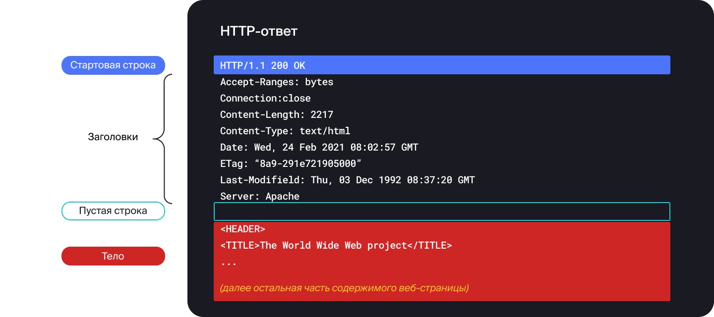

### LocalDateTime и текст

Если сконвертировать экземпляр `LocalDateTime` в текст, то получится не самая
читаемая строка в формате ISO 8601:

```java
    2021-12-21T21:21:21.121212
``` 

Но формат можно изменить! Для этого в Java есть класс `DateTimeFormatter`. 
В его экземплярах описывается нужный формат вывода с помощью метода `ofPattern(String pattern)`
и специальных символов. Вот самые популярные из них:
* `dd` — день;
* `MM` — месяц;
* `yyyy` — год;
* `HH` — час;
* `mm` — минуты;
* `ss` — секунды;
* `SSS` — дробная часть секунд.

С этими символами существует множество конфигураций. Каких именно — читайте в документации. 
Так, например, можно вместо `yyyy` использовать `yy` для сокращённого написания года. 
Или воспользоваться паттерном `"dd.MM.yyyy, HH:mm"`, чтобы вывести дату в более 
привычном формате:

```java
import java.time.LocalDateTime;
import java.time.format.DateTimeFormatter;

class Practicum {
    public static void main(String[] args) {
        LocalDateTime now = LocalDateTime.now();
        System.out.println("Было: " + now);
        
        DateTimeFormatter formatter = DateTimeFormatter.ofPattern("dd.MM.yyyy, HH:mm");
        String formatDateTime = now.format(formatter);
        System.out.println("Стало: " + formatDateTime);
    }
}
```

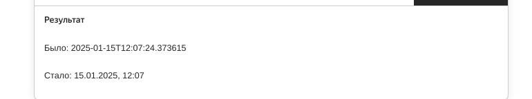

Аналогично можно произвести обратное действие — с помощью статического метода `parse(..)` 
из строки получить экземпляр `LocalDateTime`. Если передать только строку, то конвертация 
произойдёт в формате ISO 8601. А если в дополнение 
к строке передать `DateTimeFormatter`, то конвертация будет выполнена из указанного паттерна:

```java
import java.time.LocalDateTime;
import java.time.format.DateTimeFormatter;

class Practicum {
    public static void main(String[] args) {
        LocalDateTime dateTime = LocalDateTime.parse("2021-12-21T21:21:21");
        System.out.println(dateTime);

        DateTimeFormatter formatter = DateTimeFormatter.ofPattern("dd.MM.yyyy, HH:mm");

        LocalDateTime anotherDateTime = LocalDateTime.parse("22.02.2022, 22:22", formatter);
        System.out.println(anotherDateTime);

        System.out.println(dateTime.isAfter(anotherDateTime));
    }
}
```

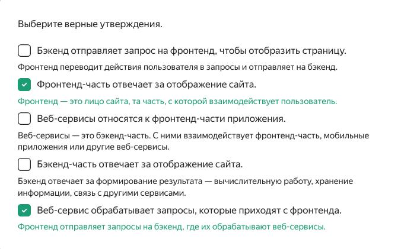

### LocalDateTime = LocalDate + LocalTime

Иногда время может понадобиться без даты, и наоборот: в некоторых задачах нужна дата, 
но не время. Для этих случаев есть классы `LocalDate` (англ. «местная **[локальная]** дата») 
и `LocalTime` (англ. «местное **[локальное]** время»). 
Их поведение аналогично поведению `LocalDateTime`, только с тем отличием, что:

* `LocalDate` оперирует годом, месяцем и днём;
* `LocalTime` — часами, минутами, секундами и наносекундами.

Для создания экземпляров `LocalTime` и `LocalDate` можно использовать метод `of(..)`.

Для `LocalTime` в качестве аргументов необходимо передать часы, минуты, 
секунды, наносекунды. Как и в `LocalDateTime`, наносекунды и секунды можно отбросить:

```java
LocalTime someTime = LocalTime.of(12, 15, 35, 999);
LocalTime anotherTime = LocalTime.of(12, 15);
```

Для `LocalDate` необходимо передать год, месяц и день:

```java
LocalDate someDate = LocalDate.of(2000, JANUARY, 1);
```

Также экземпляр `LocalDate` можно создать с помощью метода `ofYearDay(int year, int dayOfYear)`, 
передав год и порядковый номер дня в этом году:

```java
// создаём экземпляр LocalDate, в котором будет храниться 32-й день в году
LocalDate someDate = LocalDate.ofYearDay(2000, 32);
// это 1 февраля 2000 года
```

Методы `LocalDateTime` можно применять и для экземпляров `LocalDate` и `LocalTime`. Например, так:

```java
import java.time.LocalDate;
import java.time.LocalTime;

class Practicum {
    public static void main(String[] args) {
        LocalTime currentTime = LocalTime.now();
        System.out.println(currentTime);

        // проверяем, больше ли местное время 10:50 
        System.out.println(currentTime.isAfter(LocalTime.of(10, 50)));
      
      
        // создаём экземпляр LocalDate, в котором будет храниться дата 25 мая 2005 года
        LocalDate someDate = LocalDate.of(2005, 5, 25);
        System.out.println(someDate);

        // добавляем к 25 мая 2005 года 5 месяцев
        System.out.println(someDate.plusMonths(5));

    }
}
```

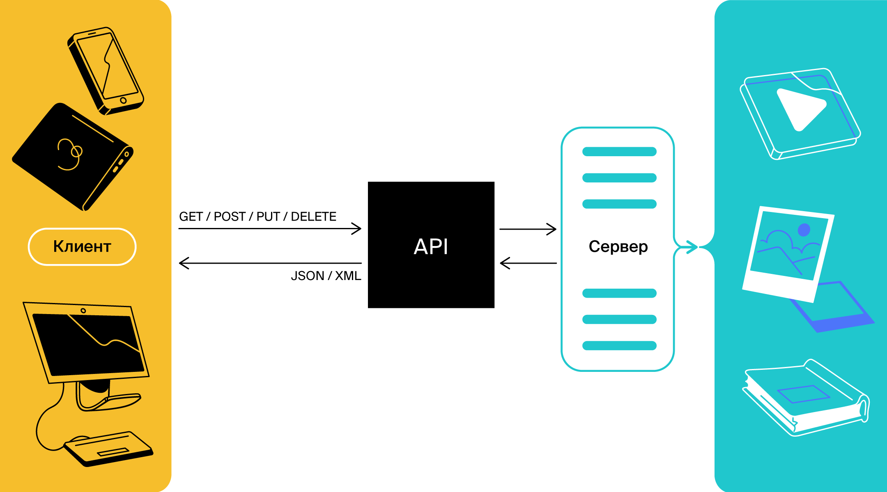

А ещё `LocalDate` и LocalTime можно извлечь из `LocalDateTime`:

```java
import java.time.LocalDate;
import java.time.LocalDateTime;
import java.time.LocalTime;

class Practicum {
    public static void main(String[] args) {
        LocalDateTime dateTime = LocalDateTime.now();

        // извлечём время
        LocalTime time = dateTime.toLocalTime();
        System.out.println(time);

        // извлечём дату
        LocalDate date = dateTime.toLocalDate();
        System.out.println(date);
    }
}
```

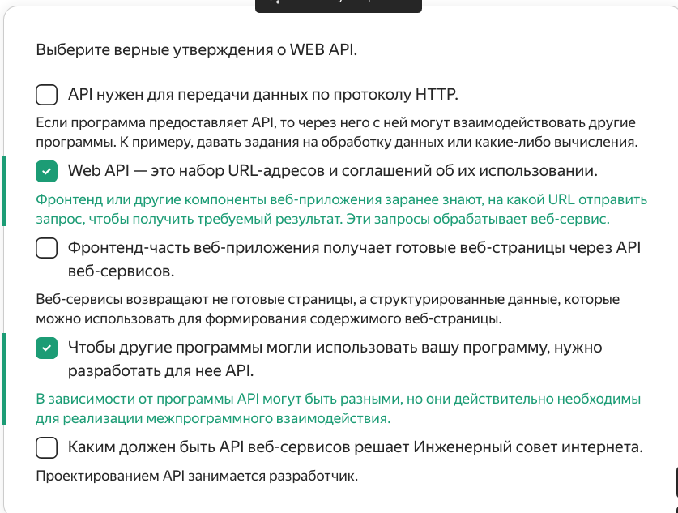

И собрать обратно:

```java
import java.time.LocalDate;
import java.time.LocalDateTime;
import java.time.LocalTime;

class Practicum {
    public static void main(String[] args) {
        // создадим по отдельности дату и время
        LocalTime time = LocalTime.now();
        LocalDate date = LocalDate.now();
        
        // соберём их вместе — в экземпляр LocalDateTime
        LocalDateTime newDateTime = LocalDateTime.of(date, time);
        System.out.println(newDateTime);
    }
}
```

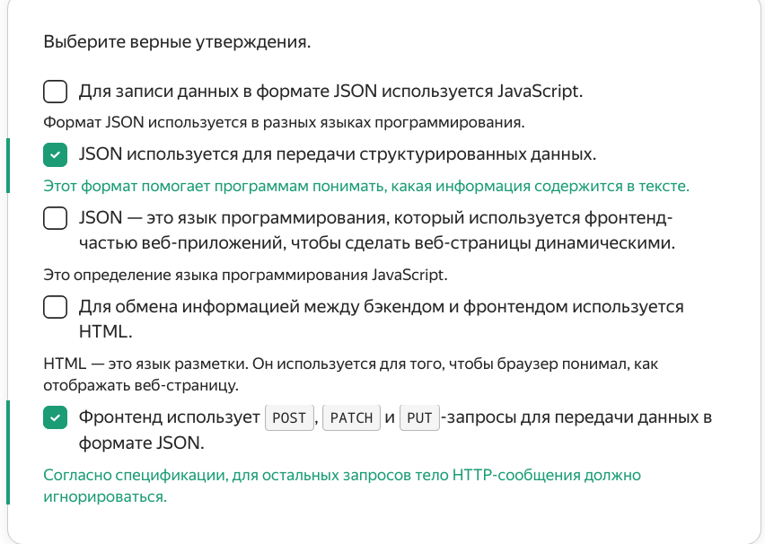

Из `LocalDateTime`, `LocalDate` и `LocalTime` можно извлечь нужные единицы времени 
с помощью методов:
* `getYear()` — возвращает год;
* `getMonth()` — константу месяца;
* `getMonthValue()` — номер месяца;
* `getDayOfMonth()` — день месяца;
* `getHour()` — часы;
* `getMinute()` — минуты;
* `getSecond()` — секунды;
* `getNano()` — наносекунды.

Кроме этого, у `LocalDateTime` и `LocalDate` есть ещё два полезных метода:
* `getDayOfYear()` — возвращает порядковый номер дня в году,
* `getDayOfWeek()` — возвращает день недели — константу `java.time.DayOfWeek`.
* 
День программиста отмечается в 256-й день года. С помощью 
этих методов можно легко узнать, в какой именно:

```java
import java.time.LocalDate;

class Practicum {

    public static final int PROGRAMMER_YEAR_DAY = 256;

    public static void main(String[] args) {
        System.out.println("День программиста отмечается в " + PROGRAMMER_YEAR_DAY + "-й день в году.");
        LocalDate today = LocalDate.now();
        int currentYear = today.getYear();
        System.out.println("Сейчас " + currentYear + " год.");

        LocalDate programmerDay = LocalDate.ofYearDay(currentYear, PROGRAMMER_YEAR_DAY);
        System.out.println("Значит, в этом году день программиста — " + programmerDay.getDayOfMonth() +
                " " + programmerDay.getMonth());
        System.out.println("День недели — " + programmerDay.getDayOfWeek());
    }
}
```

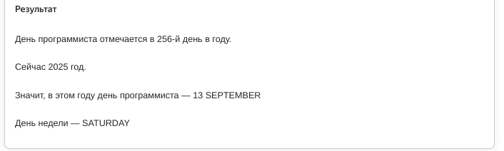


</details>


<details>

<summary>Задание 1</summary>

## Задание 1

Допишите код так, чтобы на экран выводились две даты, 
отдалённые от Unix-эпохи на одинаковое количество миллисекунд

```java
import java.time.Instant;

public class Practicum {
    public static void main(String[] args) {
        long millis = 9_000_000_000L; // количество миллисекунд

        System.out.println(...); // дата millis миллисекунд после Unix-эпохи
        System.out.println(...); // дата millis миллисекунд до Unix-эпохи
    }
}
```

### Подсказки

* Воспользуйтесь методом `ofEpochMilli(long epochMilli)`.


</details>


<details>

<summary>Задание 2</summary>

## Задание 2

Фотограф Лёша большой романтик. Он любит встречать и провожать Солнце, наблюдая за ним через объектив камеры. Но у Лёши никак не получается подойти к окну вовремя. 

В сети Интернет он нашёл сложные формулы по расчёту времени рассвета и заката для разных точек на карте. Помогите Лёше сделать расписание на неделю, чтобы ничего не пропустить.

```java
import java.time.Instant;
import java.time.temporal.ChronoUnit;
import java.util.Scanner;

public class Practicum {

    // запросите у пользователя его координаты (долгота и широта) и затем
    // выведите расписание рассветов и закатов на сегодня
    // и ближайшую неделю в формате РАССВЕТ - ЗАКАТ
    public static void main(String[] args){
        Scanner scanner = new Scanner(System.in);
        System.out.println("Введите широту:");
        double userLatitude = scanner.nextDouble();

        System.out.println("Введите долготу: ");
        double userLongtitude = scanner.nextDouble();

        System.out.println("Введите вашу временную зону: ");
        int userTimezone = scanner.nextInt();

        System.out.println("Введите текущий год в формате unix (10 цифр): ");
        long startOfYear = scanner.nextLong();

        // нам нужно знать, когда начался этот год
        Instant startOfYearMoment = ...

        // и текущую дату
        Instant thisMoment = ...

        // и конечную дату нашего графика рассветов и закатов (плюс семь дней)
        Instant lastMoment = ...

        System.out.println("Рассвет - Закат, график на неделю:");
        do {
            int day = dayOfYearFromInstant(startOfYearMoment, thisMoment);

            // эти вычисления нужны для расчёта времени рассвета и заката,
            // но вы можете изучить их позже, когда освоите класс Instant
            int noonMinutes = localNoonMinutes(day, userTimezone, userLongtitude);
            double hourDelta = sunsetTimeHours(day, userLatitude);
            double noonHour = 12 + (noonMinutes / 60.0);
            double sunriseHour = noonHour - hourDelta;
            double sunsetHour = noonHour + hourDelta;

            System.out.printf("%s - %s\n", hhmmFromDouble(sunriseHour), hhmmFromDouble(sunsetHour));

            // эта конструкция позволит вам высчитать следующий день
            thisMoment = thisMoment.plus(1, ChronoUnit.DAYS);
        } while ( ... ); // вам нужно вывести график на семь дней

    }

    // эта функция высчитывает текущий день года по заданному моменту начала года и по заданному текущему времени
    private static int dayOfYearFromInstant(Instant startOfYear, Instant time) {
        long fromStartOfYear = ...
        return ... fromStartOfYear ...
    }

    // все формулы ниже вы можете просто использовать как есть
    
    // эта супер-сложная формула возвращает длительность половины
    // светового дня (от рассвета до полудня или от полудня до заката)
    static double sunsetTimeHours(int dayOfYear, double latitude){
        double rad = (Math.PI / 180);
        double factor = -1 * Math.tan(rad * latitude) * Math.tan(23.44 * rad * Math.sin(rad * (360 / 365.0) * (dayOfYear + 284.0)));
        if(factor <= -1 || factor >= 1){
            return 0.0;
        }
        return Math.abs(Math.acos(factor)) / (rad * 15);
    }

    // эта сложная формула является уравнением времени и возвращает поправку на несовершенство орбиты Земли
    static int equationOfTimeMinutes(int dayOfYear){
        return (int) Math.round(-7.655 * Math.sin(2 * Math.PI * dayOfYear / 365) + 9.873 * Math.sin(4 * Math.PI * dayOfYear / 365 + 3.588));
    }

    // эта не очень сложная формула возвращает поправку на истинный полдень (время, когда Солнце в зените)
    static int localNoonMinutes(int dayOfYear, int timeZone, double longtitude){
        return (int) Math.round(4.0 * (longtitude - (15 * (timeZone - 1)))) - equationOfTimeMinutes(dayOfYear);
    }

    // эта функция поможет превратить вещественное значение часа в привычный формат чч:мм
    static String hhmmFromDouble(double hour){
        return String.format("%d:%02d", (int) Math.floor(hour), (int) Math.round(60 * (hour - Math.floor(hour))));
    }

}
```

```java

```


### Подсказки

* Время в формате Unix для 2023 года — 1672520400, время в формате Unix для 2024 года – 1704067200, широта и долгота Москвы: 37.4, 55.4; временная зона: +3 часа.
* Выбирайте правильные методы преобразования `Instant` — в секунды или в миллисекунды.
* Учтите високосный год и периоды на границе двух годов, эти случаи сложнее обычных.
* В этом тренажёре нужно использовать свои знания о временных интервалах (минута, час, день).

</details>


<details>

<summary>Задание 3</summary>

## Задание 3

У индонезийской службы доставки JavaDelivery горячий сезон: она работает круглосуточно 
и ей срочно нужна программа для составления графика работы курьеров. 
Вам необходимо реализовать метод, который будет выводить на экран график в таком формате: 

```
Расписание смен:
Cмена 1. Начало: 2025-06-01T08:30, конец: 2025-06-01T13:30
Cмена 2. Начало: 2025-06-01T13:30, конец: 2025-06-01T18:30
Cмена 3. Начало: 2025-06-01T18:30, конец: 2025-06-01T23:30
Cмена 4. Начало: 2025-06-01T23:30, конец: 2025-06-02T04:30
Cмена 5. Начало: 2025-06-02T04:30, конец: 2025-06-02T09:30
```
Входные данные для этого метода:
* время начала рабочей смены (часы, минуты);
* продолжительность смены в часах;
* количество смен в графике.

Для теста выбрана дата 1 июня 2025 года. Добавьте проверку на то, что продолжительность 
одной смены — не более 8 часов.

```java

import java.time.LocalDateTime;

import static java.time.Month.JUNE;

class Practicum {

    public static final int START_YEAR = 2025;
    public static final int START_DAY = 1;
    public static final int MAX_SHIFT = 8;

    public static void main(String[] args) {
        printWorkHours(8, 30, 5, 5);
    }

    private static void printWorkHours(
            int startHours, // час, с которого начинается рабочая смена
            int startMinutes, // минута, с которой начинается рабочая смена
            int shiftContinuation, // продолжительность смены в часах
            int shiftAmount // количество смен
    ) {
        if (...) { // продолжительность смены не должна быть больше MAX_SHIFT часов
            System.out.println("Выбрано слишком большое время для рабочей смены!");
        }
        System.out.println("Расписание смен:");
        // создайте экземпляр класса: 
        // сформируйте дату и время начала первой смены. 
        // год и месяц уже заданы в константах.
        LocalDateTime startTime = ...
        LocalDateTime endTime;
        for (...) { // цикл должен начинаться с 1, а количество итераций должно быть равно количеству смен
            endTime = ... // вычислите дату и время окончания смены
            System.out.println("Cмена " + i + ". Начало: " + startTime + ", конец: " + endTime);
            ... // обновите переменную startTime
        }
    }
}

```

### Подсказки

* Создать переменную с датой и временем начала смены можно с помощью
`LocalDateTime.of(START_YEAR, JUNE, START_DAY, startHours, startMinutes)`.
* Чтобы вычислить дату и время окончания смены, необходимо воспользоваться методом 
`plusHours(shiftContinuation)`.

</details>

<details>
<summary>Задание 4</summary>

## Задание 4

Внешний API магазина присылает время оплаты в странном формате. 
С помощью методов `LocalDateTime` и `DateTimeFormatter` приведите его к корректному виду.
Входные данные:

```
14 часов 09 минут. Месяц: 02, День: 14, Год: 1966.
```
 
Выходные данные должны быть такими:

```
14_02_1966|14:09 
```

```java
import java.time.LocalDateTime;
import java.time.format.DateTimeFormatter;

class Practicum {
    public static void main(String[] args) {
        String input = "14 часов 09 минут. Месяц: 02, День: 14, Год: 1966.";

        printCorrectDateTime(input);
    }

    private static void printCorrectDateTime(String input) {
        DateTimeFormatter inputFormatter = ... // определите входной формат
        LocalDateTime dateTime = ... // сконвертируйте исходную строку в LocalDateTime

        DateTimeFormatter outputFormatter = ... // определите выходной формат
        System.out.println(...); // выведите результат на экран
    } 
}

```

### Подсказки

* Проверьте, что паттерн входных данных — `"HH часов mm минут. Месяц: MM, День: dd, Год: yyyy."`.
* Убедитесь, что патерн выходных данных — `"dd_MM_yyyy|HH:mm"`.


</details>


<details>
<summary>Задание 5</summary>

## Задание 5

Игорь придумал «Шифр Игоря» — это как шифр Цезаря, только Игоря.
И без букв. В его шифре числа кодируются с помощью даты и времени. 
Игорь написал метод по декодированию, но случайно стёр его и теперь 
не может восстановить пароль от архива с домашней работой. 
К счастью, входные данные у него сохранились. Помогите Игорю восстановить пароль 
от важного архива!

Инструкция по декодированию:
* Объединить экземпляр даты и экземпляр времени в экземпляр `LocalDateTime`.
* От полученного момента времени вычесть 2 месяца, 25 дней и 100 минут.
* В полученном результате перемножить порядковый номер дня в году и число часов.


```
import java.time.LocalDate;
import java.time.LocalDateTime;
import java.time.LocalTime;


class Practicum {
    public static void main(String[] args) {
        LocalDate secretDate = LocalDate.of(2020, 1, 10);
        LocalTime secretTime = LocalTime.of(12, 30);

        int result = decode(secretDate, secretTime);
        System.out.println(result);
    }

    private static int decode(LocalDate secretDate, LocalTime secretTime) {
        // объедините secretDate и secretTime
        ... newTime = ...

        // вычтите 2 месяца, 25 дней и 100 минут
        ... secretMoment = ...
        // найдите произведение порядкового номера дня в году и часов из secretMoment 
        return ... * ...;
    }
}


```

### Подсказки

* Объединить `LocalDate` и `LocalTime` можно с помощью метода `LocalDateTime.of(...)`.
* Вычесть необходимое количество месяцев поможет метод `minusMonths(...)`,
дней — `minusDays(...)`, минут — `minusMinutes(...)`.
* Порядковый номер дня в году и часы вернут методы `getDayOfYear()` и `getHour()` соответственно.

</details>


   Предыдущее занятие   |         &nbsp;          |   Следующее занятие    
:----------------------:|:-----------------------:|:----------------------:
 [Урок 22](LESSON22.MD) | [Содержание](../README.MD) | [Урок 24](LESSON24.MD) 