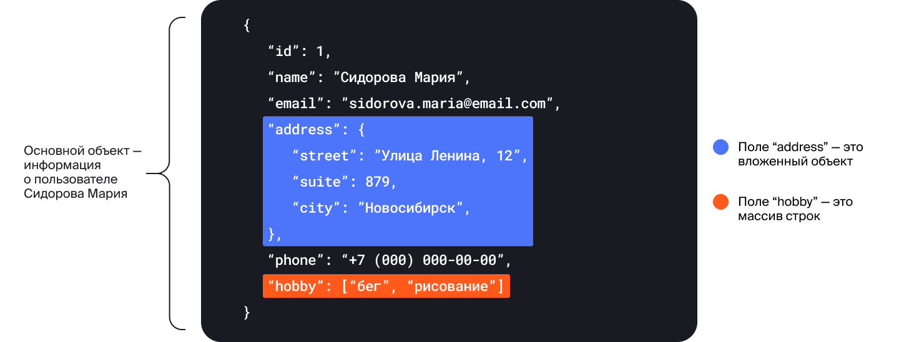
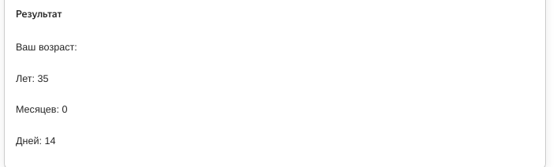
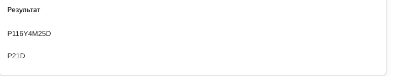
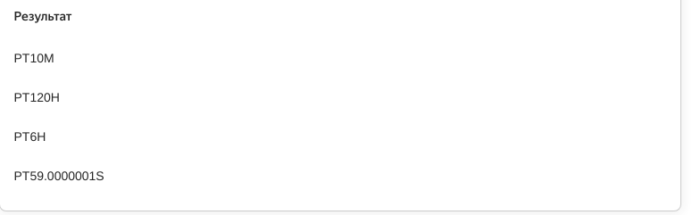
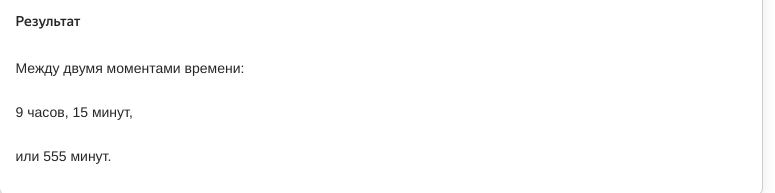
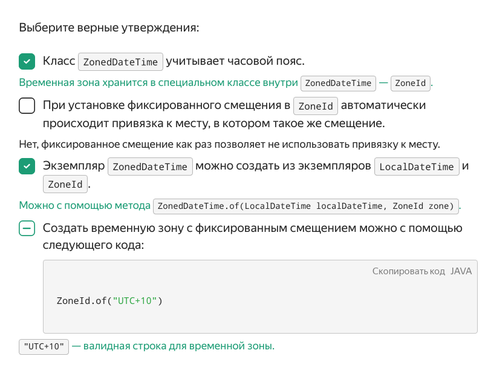
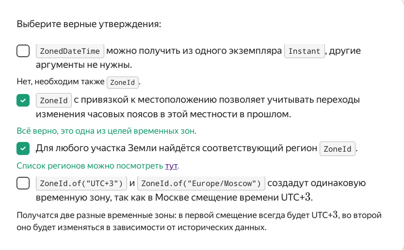
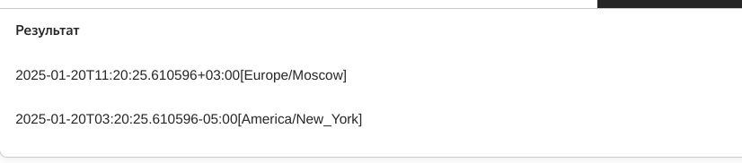
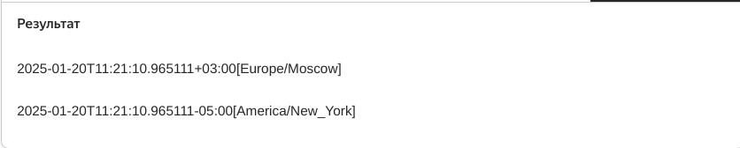
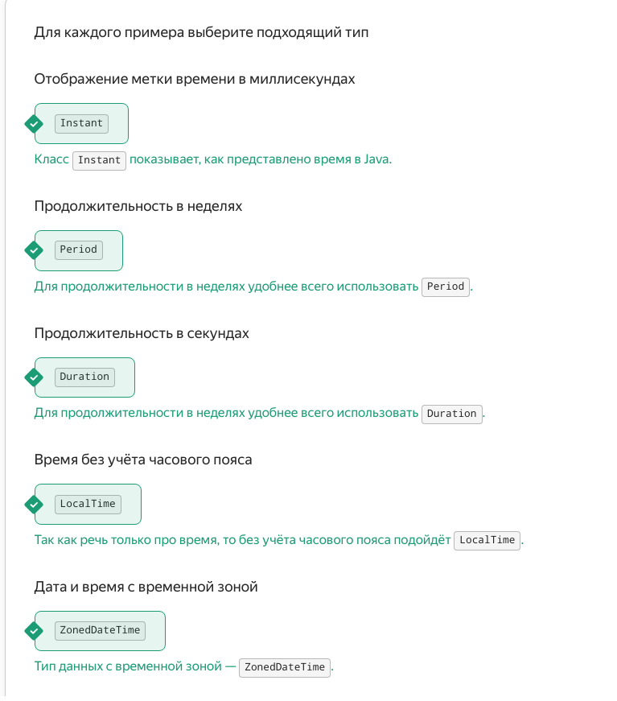

   Предыдущее занятие   |         &nbsp;          |   Следующее занятие    
:----------------------:|:-----------------------:|:----------------------:
 [Урок 23](LESSON23.MD) | [Содержание](../README.MD) | [Урок 25](LESSON25.MD)

# Урок 25. Period и Duration

# Требования к сдаче работы

Задание выполняется в среде программирования Idea. Результат надо разместить в своем репозитории на GitHub.
Прислать в гугл-формы(размещенная на моем сайте) ссылку на репозиторий.

***Критерии оценивания***

* Оценка 5 - надо сделать все задания.
* Оценка 4 - надо сделать любые четыре задания.
* Оценка 3 - надо сделать любые три задания.

## Оглавление
1. [Классы Period и Duration](#классы-period-и-duration)
   * [Класс `Period`](#класс-period)

3. [Задание 1](#задание-1)
4. [Задание 2](#задание-2)
5. [Задание 3](#задание-3)
6. [Задание 4](#задание-4)
7. [Задание 5](#задание-5)

<details>

<summary>Классы Period и Duration</summary>

## Классы Period и Duration

При работе со временем нам часто бывает нужна информация
не о конкретных моментах, а о длительности промежутка между ними. 
Например, если нам необходимо узнать, сколько минут займёт поездка от одной
станции метро до другой, или определить возраст пользователя нашего приложения.

Для этого в Java есть два специальных класса: `Period` (англ. «период, срок») 
и `Duration` (англ. «продолжительность, длительность»). О них и пойдёт речь
в этом уроке.

### Класс `Period`
Используется для вычисления срока **между двумя датами**. В экземпляре класса 
есть три поля: 
* продолжительность в годах (можно получить с помощью метода `getYears()`);
* месяцах (`getMonths()`);
* днях (`getDays()`).

Самый простой способ узнать продолжительность — вызвать статический 
метод `between(LocalDate startDateInclusive, LocalDate endDateExclusive)`, 
который вычисляет период с даты `startDateInclusive` 
по дату `endDateExclusive`. День, обозначенный датой `endDateExclusive`,
в расчёте не учитывается. 

Например, результатом метода `Period.between(LocalDate.of(2021, 11, 15),
LocalDate.of(2021, 11, 19))` будет промежуток в 4 дня:



Один из популярных примеров работы класса `Period` — программа для подсчёта возраста:

```java
import java.time.LocalDate;
import java.time.Period;

import static java.time.Month.JANUARY;

class Practicum {
    public static void main(String[] args) {
        LocalDate today = LocalDate.now();
        // напишите здесь свою дату рождения
        LocalDate birthday = LocalDate.of(1990, JANUARY, 1);

        Period age = Period.between(birthday, today);
        System.out.println("Ваш возраст:");
        System.out.println("Лет: " + age.getYears());
        System.out.println("Месяцев: " + age.getMonths());
        System.out.println("Дней: " + age.getDays());
   
```




### Класс Duration
В отличие от класса `Period`, класс `Duration` хранит продолжительность времени
с точностью до наносекунд и используется для вычисления длительности 
времени между двумя моментами. 
Сделать это можно с помощью метода `between(...)`:

```java
import java.time.Duration;
import java.time.LocalDateTime;
import java.time.Month;

import static java.time.Month.JANUARY;

class Practicum {
    public static void main(String[] args) {
        LocalDateTime now = LocalDateTime.now();
        // напишите здесь свою дату рождения с точностью до часов и минут
        int yearOfBirth = 1990;
        Month monthOfBirth = JANUARY;
        int dayOfMonth = 1;
        int hourOfBirth = 9;
        int minuteOfBirth = 0;
        LocalDateTime birthday = LocalDateTime.of(yearOfBirth, monthOfBirth, dayOfMonth, hourOfBirth, minuteOfBirth);

        Duration duration = Duration.between(birthday, now);

        System.out.println("На момент запуска кода вы прожили " + duration.getSeconds()
                + " секунд и " + duration.getNano() + " наносекунд.");
    }
}
```


Кроме того, у `Instant`, `LocalDateTime`, `LocalDate` и `LocalTime` есть 
метод `plus(TemporalAmount amountToAdd)`, где `TemporalAmount` (англ. «временно́е количество») 
—  интерфейс, представляющий продолжительность времени, который как раз и реализуют 
классы `Duration` и `Period`. А значит их значения можно передать в качестве параметра 
этого метода. Таким образом, `plus(TemporalAmount amountToAdd)` можно использовать и 
для вычисления момента времени, который произойдёт спустя промежуток, хранящийся в 
`Duration` или `Period`.

Например, если в переменной `ninetyMinutes` хранится промежуток продолжительностью в
90 минут, то при добавлении его к какому-либо моменту времени можно получить новый, но на
90 минут позже:

```java
import java.time.Duration;
import java.time.LocalTime;


class Practicum {
    public static void main(String[] args) {
        LocalTime start = LocalTime.of(0, 0);
        LocalTime finish = LocalTime.of(1, 30);

        // находим продолжительность между двумя единицами времени
        Duration ninetyMinutes = Duration.between(start, finish);

        LocalTime noon = LocalTime.of(12, 0);
        System.out.println("Старый момент времени: " + noon);
        // прибавляем к созданному моменту вычисленную продолжительность
        LocalTime newTime = noon.plus(ninetyMinutes);

        System.out.println("Новый момент времени: " + newTime);
    }
}
```


### Создание объектов Duration и Period

Создать объект с промежутком времени можно и вручную:
1. Перечислить все составляющие промежутка: года, месяцы и дни для `Period`:

```java
// промежуток длиной 100 лет, 10 месяцев, 1 день
Period longTime = Period.of(100, 10, 1);
```
 
2.  Воспользоваться методами по созданию промежутка из конкретной величины. Для `Period`:
   * `ofDays(int days)` — создаёт экземпляр Period длительностью `days` дней,
   * `ofWeeks(int weeks)` — длительностью `weeks` недель,
   * `ofMonths(int months)` — длительностью `months` месяцев,
   * `ofYears(int years)` — длительностью `years` лет.

 
Метод `toString()` у класса `Period` выводит продолжительность в формате 
`P[количество лет]Y[количество месяцев]M[количество дней]D`.
Если какая-то составляющая (например, количество месяцев) равна нулю, то она опускается.

Например, промежуток в 3 года, 4 месяца и 5 дней будет выглядеть как `P3Y4M5D`; 
1 год и 10 дней — `P1Y10D`, 14 дней — `P14D`.

Например, продолжительность столетней войны 
(которая на самом деле длилась больше ста лет) будет выведена на экран как `P116Y4M25D`,
а период из 3 недель — `P21D`.

```java
import java.time.Period;

class Practicum {
    public static void main(String[] args) {
        Period theHundredYearsWarPeriod = Period.of(116, 4, 25);
        System.out.println(theHundredYearsWarPeriod);

        Period threeWeeks = Period.ofWeeks(3);
        System.out.println(threeWeeks);
    }
}
```



А вот методы, с помощью которых можно создать экземпляр класса `Duration`:
* `ofSeconds(long seconds)` — создаёт экземпляр `Duration` длительностью `seconds` секунд,
* `ofSeconds(long seconds, long nanoAdjustment)`— длительностью `seconds` секунд и `nanoAdjustment` наносекунд,
* `ofMinutes(long minutes)` — длительностью `minutes` минут,
* `ofHours(long hours)` — длительностью `hours` часов,
* `ofDays(long days)` — длительностью `days` дней.

Как и в случае с классом `Period`, метод `toString()` у класса `Duration` выводит 
продолжительность в формате 
`PT[количество часов]H[количество минут]M[количество секунд]S`. 
Единица времени, равная нулю, также будет опущена. 
Промежуток в 7 часов, 10 минут, 15 секунд будет выглядеть как `PT7H10M15S`. 
Специальных обозначений для милли- и наносекунд нет — они будут переведены в секунды. Например, 
1 час, 30 секунд и 7 наносекунд — будут выглядеть как `PT1H30M0.000000007S`.


```java
import java.time.Duration;

class Practicum {
    public static void main(String[] args) {
        Duration tenMinutes = Duration.ofMinutes(10);
        System.out.println(tenMinutes);

        Duration fiveDays = Duration.ofDays(5);
        System.out.println(fiveDays);

        Duration sixHours = Duration.ofHours(6);
        System.out.println(sixHours);

        Duration someTime = Duration.ofSeconds(59, 100);
        System.out.println(someTime);
    }
}
```



### Методы класса Duration

Так как `Duration` предоставляет больше возможностей по использованию, 
промежутки времени чаще всего вычисляют именно с помощью него. 

У этого класса есть два поля, которые и отражают продолжительность: 
количество секунд и дробная часть секунды — в наносекундах. Получить значения 
этих полей можно с помощью методов `getSeconds()` и `getNano()`.
Например, таким образом можно вычислить, сколько по времени выполнялся участок кода:

```java
import java.time.Duration;
import java.time.LocalDateTime;
import java.util.Random;

class Practicum {
    public static void main(String[] args) throws InterruptedException {
        Random random = new Random();

        // фиксируем начало выполнения кода
        LocalDateTime start = LocalDateTime.now();

        // производим действия, время исполнения которых хотим замерить
        int num = random.nextInt(5000);
        Thread.sleep(num); // останавливаем выполнение кода на произвольное время

        // фиксируем конец выполнения кода
        LocalDateTime finish = LocalDateTime.now();

        // находим продолжительность между двумя моментами
        Duration duration = Duration.between(start, finish);

        // выводим результат
        System.out.println("Код выполнился за " + duration.getSeconds() + "." + duration.getNano() + "с.");
    }
}
```


Так как выводить время в секундах далеко не всегда удобно, 
то у `Duration` есть методы, приводящие продолжительность в другие единицы времени:

* `toDays()` — возвращает целое число дней в промежутке;
* `toHours()` — целое число часов;
* `toMinutes()` — целое число минут;
* `toMillis()` — целое число миллисекунд;
* `toNanos()` — целое число наносекунд;
* `toHoursPart()` — возвращает количество часов от неполного дня;
* `toMinutesPart()` — количество минут от неполного часа;
* `toSecondsPart()` — количество секунд от неполной минуты;
* `toMillisPart()` — количество миллисекунд от неполной секунды.

Например, если промежуток времени исчисляется часами, 
можно воспользоваться методами `toHours()`, `toMinutesPart()` и `toMinutes()`

```java
import java.time.Duration;
import java.time.LocalTime;

class Practicum {
    public static void main(String[] args) {
        LocalTime secondTime = LocalTime.of(23, 40);
        LocalTime firstTime = LocalTime.of(14, 25);

        Duration duration = Duration.between(firstTime, secondTime);

        System.out.println("Между двумя моментами времени:");
        System.out.println(duration.toHours() + " часов, " + duration.toMinutesPart() + " минут,");
        System.out.println("или " + duration.toMinutes() + " минут.");
    }
}
```



</details>


<details>

<summary>Часовые пояса: класс ZonedDateTime</summary>

## Часовые пояса: класс ZonedDateTime

Интернет объединяет устройства, которые находятся по всему миру — в разных часовых поясах. 
Поэтому разработчику важно уметь обращаться с временными зонами. 
Например, в билете на самолёт всегда должно указываться местное время, 
и если не учитывать пояса, то проблем с расписанием не избежать. 

За всё разнообразие мирового времени отвечает класс `ZonedDateTime` 
(англ. «дата и время временной зоны») — это уже знакомый вам `LocalDateTime`, 
но с добавлением `ZoneId` — временной зоны. Работать с `ZoneId` можно
двумя способами: с фиксированным смещением относительно UTC и с 
привязкой к конкретному региону на Земле. 

### Фиксированное смещение

Представьте, что серверы системы, с которой вы работаете, распределены по всему миру.
Удобнее всего будет установить на них одинаковое смещение — например, `UTC0`, — чтобы не 
зависеть от перехода на зимнее/летнее время. При этом местоположение серверов не будет иметь 
значения: в США, в Китае или в Новой Зеландии время на них будет одинаковым. 

Чтобы создать экземпляр `ZoneId` с фиксированным смещением, необходимо 
воспользоваться методом `of(String offset)`, передав ему смещение в формате `UTC[+/-]hh:mm`:

```java
ZoneId zoneUtc = ZoneId.of("UTC-03:45");
```

Если же смещение задано только в часах, то его можно записать короче — `UTC[+/-]h`:

```java
// запись аналогична ZoneId.of("UTC-03:00");
ZoneId zoneUtc = ZoneId.of("UTC-3");
```

Из экземпляров `LocalDateTime` и `ZoneId` можно «собрать» `ZonedDateTime`:

```java
import java.time.LocalDateTime;
import java.time.ZoneId;
import java.time.ZonedDateTime;

class Practicum {
    public static void main(String[] args) {
        // создаём экземпляр местного времени и даты
        LocalDateTime dateTime = LocalDateTime.now();
        System.out.println(dateTime);

        // создаём экземпляр временной зоны
        ZoneId zone = ZoneId.of("UTC+3");
        System.out.println(zone);

        // создаём экземпляр ZonedDateTime
        ZonedDateTime zonedDateTime = ZonedDateTime.of(dateTime, zone);
        System.out.println(zonedDateTime);
    }
}
```

Особенности такого подхода:
* точная привязка к мировому времени: использование Unix-времени аналогично `Instant`,
но с выбранным программистом смещением;
* отсутствие привязки к месту.

Если событие привязано к какому-то месту в прошлом, можно допустить ошибку. 
Например, в коде программы считается, что она запускается на сервере, расположенном в Москве,
и поэтому установлено смещение UTC+3. 
Из внешней системы было получено время в виде `Москва, 12.02.2013, 14:15`, 
которое было конвертировано в `2013-02-12T11:15 UTC`. Однако в эту дату в Москве 
был часовой пояс UTC+4, так что правильно было сконвертировать Москва, 12.02.2013,
14:15 в 2013-02-12T**10**:15 UTC.



Чтобы избежать проблем с историческим изменением часовых поясов 
в конкретном месте, в Java есть второй вариант хранения времени. 
Он позволяет привязаться к конкретному региону.

### Временные зоны
Привязка `ZoneId` к региону позволяет учитывать переход с зимнего на летнее время и
историю изменений часовых поясов в разных странах. Например, программа будет знать, что в 
2011 году в России отменили зимнее и летнее время, а в 2014 — изменили часовой пояс для 
большинства регионов.

Создать экземпляр `ZoneId` с привязкой к региону можно с помощью метода `of(...)` 
и названием этого региона:

```java
ZoneId zoneId = ZoneId.of("Europe/Moscow");
```

Вот некоторые из регионов:
* Europe/Moscow — Москва,
* Asia/Yekaterinburg — Екатеринбург, Пермь,
* Asia/Vladivostok — Владивосток,
* America/New_York — Нью-Йорк,
* America/Toronto — Торонто,
* Japan — Япония.

Полный список регионов покрывает всю нашу планету, его можно посмотреть [здесь](https://en.wikipedia.org/wiki/List_of_tz_database_time_zones).


Создать `ZonedDateTime` можно с помощью метода `of(LocalDateTime localDateTime, ZoneId zone)`:

```java
import java.time.LocalDateTime;
import java.time.ZoneId;
import java.time.ZonedDateTime;

class Practicum {
    public static void main(String[] args) {
        LocalDateTime dateTime = LocalDateTime.now();
        ZoneId zone = ZoneId.of("Europe/Moscow");
        ZonedDateTime zonedDateTime = ZonedDateTime.of(dateTime, zone);

        System.out.println(zonedDateTime);
    }
}
```

Так как `LocalDateTime` — дата и время на каком-то конкретном устройстве, 
перевести его без экземпляра `ZoneId` в `ZonedDateTime` не получится: 
нам не хватит информации для привязки к общемировому времени. Представьте, 
что какой-то человек оказался в неизвестной комнате без окон, в которой 
на стене висят часы и календарь с текущими для этого места датой и временем. 
Скорее всего, он не сможет сказать, когда наступит Новый год в Москве, 
потому что не будет знать, как соотносится время часов на стене с временем в Москве. 

На конкретный момент времени указывает класс `Instant`. 
Значит, получив от внешней системы временную метку, можно перевести её в 
экземпляр `ZonedDateTime` с конкретной временной зоной 
— с помощью статического метода `ofInstant(Instant instant, ZoneId zone)`:

```java

import java.time.Instant;
import java.time.ZoneId;
import java.time.ZonedDateTime;

class Practicum {
    public static void main(String[] args) {
        // сохраняем временную отметку запуска первого искусственного спутника
        Instant moment = Instant.ofEpochSecond(-386310686L);
        System.out.println("Timestamp: " + moment);

        // сохраняем её как московское время:
        ZoneId zone = ZoneId.of("Europe/Moscow");
        ZonedDateTime zonedDateTime = ZonedDateTime.ofInstant(moment, zone);

        System.out.println(zonedDateTime);
    }
}
```



### Методы ZonedDateTime

Методы в `ZonedDateTime` такие же, как и в `LocalDateTime`. Например, `plusDays(long days)` 
создаёт новый экземпляр времени с прибавлением указанного количества дней, 
а `isBefore(ZonedDateTime dateTime)` вернёт `true`, если экземпляр, 
у которого вызывается метод, находится на временной шкале раньше, чем `dateTime`.

Попробуйте применить методы из урока про локальные дату и время, но теперь для `ZonedDateTime`:

```java
import java.time.ZonedDateTime;

class Practicum {
    public static void main(String[] args) {
        ZonedDateTime currentDateTime = ZonedDateTime.now();
        System.out.println("Сейчас " + currentDateTime);

        ZonedDateTime twoWeeksAgo = currentDateTime.minusDays(3).minusHours(3);
        System.out.println("Три дня и три часа назад было " + twoWeeksAgo);
    }
}
```

 Для создания экземпляра с изменением временной зоны есть два метода.

`withZoneSameInstant(ZoneId zone)` — метод, аналогичный переводу часов: 
момент времени, на который указывает экземпляр, остаётся неизменным,
меняется `LocalDateTime` и `ZoneId`. Например, 
если при путешествии из Москвы в Нью-Йорк изменить время на 
телефоне на местное, онлайн-встреча, которая раньше в календаре отображалась 
как «15 октября 07:00», теперь будет отображаться как «15 октября 00:00»
(часовой пояс Москвы — UTC+3, Нью-Йорка — UTC-4. 
Когда в Москве 15 октября 07:00, в Нью-Йорке на 7 часов меньше — 
15 октября 00:00).

```java
import java.time.Instant;
import java.time.ZoneId;
import java.time.ZonedDateTime;

class Practicum {
    public static void main(String[] args) {
        Instant now = Instant.now();

        // сохраняем московское время:
        ZoneId moscowZone = ZoneId.of("Europe/Moscow");
        ZonedDateTime moscowDateTime = ZonedDateTime.ofInstant(now, moscowZone);

        // узнаём время в Нью-Йорке:
        ZoneId newYorkZone = ZoneId.of("America/New_York");
        ZonedDateTime newYorkDateTime = moscowDateTime.withZoneSameInstant(newYorkZone);

        System.out.println(moscowDateTime);
        System.out.println(newYorkDateTime);
    }
}
```



`withZoneSameLocal(ZoneId zone)` — метод, аналогичный выбору другого 
часового пояса при настройке телефона: часы будут показывать то же самое время,
но зона будет другой. Например, электронная рассылка должна прийти 
пользователям по всему миру в одно и то же время, но по местному часовому поясу.
Для этого:
* сначала нужно рассчитать время и дату с часовым поясом, который установлен на сервере рассылки,
* а затем, меняя часовые пояса, можно будет определить, в какое именно время нужно отправлять письма адресатам из разных регионов.

```java
import java.time.Instant;
import java.time.ZoneId;
import java.time.ZonedDateTime;

class Practicum {
    public static void main(String[] args) {
        Instant now = Instant.now();

        // сохраняем московское время:
        ZoneId moscowZone = ZoneId.of("Europe/Moscow");
        ZonedDateTime moscowDateTime = ZonedDateTime.ofInstant(now, moscowZone);

        // меняем регион на Нью-Йорк
        ZoneId newYorkZone = ZoneId.of("America/New_York");
        ZonedDateTime newYorkDateTime = moscowDateTime.withZoneSameLocal(newYorkZone);

        System.out.println(moscowDateTime);
        System.out.println(newYorkDateTime);
    }
}
```



### Форматирование

Форматирование для `ZonedDateTime` идентично `LocalDateTime`, с той лишь разницей, 
что можно отобразить:
* `VV` — название временной зоны,
* `ZZZZZ` — смещение в формате +03:00.

```java
import java.time.Instant;
import java.time.ZoneId;
import java.time.ZonedDateTime;
import java.time.format.DateTimeFormatter;

class Practicum {
    public static void main(String[] args) {
        Instant now = Instant.now();

        DateTimeFormatter formatter = DateTimeFormatter.ofPattern("Время: HH:mm:ss. Регион: VV, смещение: ZZZZZ");
        
        ZoneId zone = ZoneId.of("Asia/Dubai");
        ZonedDateTime dateTime = ZonedDateTime.ofInstant(now, zone);

        System.out.println(dateTime.format(formatter));
    }
}
```




</details>


<details>
<summary>Задание 1</summary>

## Задание 1

В компании ООО «Ретроградный Меркурий» для улучшения планирования решили 
использовать ретроанализ: определять, сколько по времени будет в
ыполняться задача, если известно, во сколько она была начата и 
закончена в прошлый раз. Восстановите пропущенные участки кода. 
Воспользуйтесь классом `DateTimeFormatter`,
чтобы выводить время в формате `часы:минуты` (например, `12:34`).


```
import java.time.Duration;
import java.time.LocalTime;
import java.time.format.DateTimeFormatter;


class Practicum {
    public static void main(String[] args) {
        // время начала работы над задачей — 9:00
        LocalTime taskStart = LocalTime.of(...);
        // время окончания работы над задачей — 11:30
        LocalTime taskFinish = LocalTime.of(...);

        // опишите формат вывода в виде часы:минуты
        DateTimeFormatter formatter = ...

        // найдите продолжительность между двумя единицами времени
        Duration duration = ...
        
        // taskStart должен быть выведен в указанном формате
        System.out.println("В прошлый раз задача была начата в " + ... + ",");
        // taskFinish должен быть выведен в указанном формате
        System.out.println("а закончена в " + ... + ".");
        
        LocalTime now = LocalTime.now();
        // now должен быть выведен в указанном формате
        System.out.println("Сейчас " + ... + ".");

        // прибавьте к текущему моменту вычисленную продолжительность
        LocalTime finishTime = ...;

        // finishTime должен быть выведен в указанном формате
        System.out.println("Значит, задача будет выполнена к " + ... + ".");
    }
}


```

### Подсказки

* Создать правильный формат можно с помощью` DateTimeFormatter.ofPattern("HH:mm")`.
* Вывести время в нужном формате поможет метод `format(formatter)`.
* Вычислить время спустя промежуток `duration` можно с помощью метода `plus(duration)`


</details>


<details>
<summary>Задание 2</summary>

## Задание 2

Для космических перелётов в 
2099 году используются прыжки сквозь гиперпространство. 
Бортовому компьютеру необходимо знать: или прыжок будет коротким (меньше суток), 
и тогда продолжительность прыжка нужно выводить в минутах, или долгим, и тогда е
го продолжительность нужно выводить в днях. 

Для вывода временных меток используйте паттерн `"dd.MM.yyyy, HH:mm"`. 
Итоговый ответ должен выглядеть так:

```
Вход в гиперпространство:
10.10.2099, 12:05
Выход из гиперпространства:
10.10.2099, 14:15
Минут на гиперпрыжок: 130

Вход в гиперпространство:
10.10.2099, 12:00
Выход из гиперпространства:
11.10.2099, 15:30
Дней на гиперпрыжок: 1

Вход в гиперпространство:
10.10.2099, 23:10
Выход из гиперпространства:
11.10.2099, 10:25
Минут на гиперпрыжок: 675
```


```
import java.time.Duration;
import java.time.LocalDateTime;
import java.time.Period;
import java.time.format.DateTimeFormatter;


class Practicum {
    public static final int SECONDS_IN_DAY = 60 * 60 * 24;

    public static void main(String[] args) {
        LocalDateTime firstStart = LocalDateTime.of(2099, 10, 10, 12, 5);
        LocalDateTime firstFinish = LocalDateTime.of(2099, 10, 10, 14, 15);

        LocalDateTime secondStart = LocalDateTime.of(2099, 10, 10, 12, 0);
        LocalDateTime secondFinish = LocalDateTime.of(2099, 10, 11, 15, 30);

        LocalDateTime thirdStart = LocalDateTime.of(2099, 10, 10, 23, 10);
        LocalDateTime thirdFinish = LocalDateTime.of(2099, 10, 11, 10, 25);


        printGap(firstStart, firstFinish);
        printGap(secondStart, secondFinish);
        printGap(thirdStart, thirdFinish);
    }

    private static void printGap(LocalDateTime start, LocalDateTime finish) {
        // используйте паттерн "dd.MM.yyyy, HH:mm"
        DateTimeFormatter formatter = ...;

        System.out.println("Вход в гиперпространство:");
        // вывод должен быть в корректном формате
        System.out.println(...);
        System.out.println("Выход из гиперпространства:");
        // вывод должен быть в корректном формате
        System.out.println(...);
        // найдите продолжительность
        Duration duration = ...;

        // сравните продолжительность в секундах с количеством секунд в сутках
        // воспользуйтесь константой SECONDS_IN_DAY
        if (...) {
            // выведите продолжительность в днях
            System.out.println("Дней на гиперпрыжок: " + ...);
        } else {
            // выведите продолжительность в минутах
            System.out.println("Минут на гиперпрыжок: " + ...);
        }
        System.out.println();
    }
}


```
Ожидаемый результат

```
Результат

Вход в гиперпространство:

10.10.2099, 12:05

Выход из гиперпространства:

10.10.2099, 14:15

Минут на гиперпрыжок: 130


Вход в гиперпространство:

10.10.2099, 12:00

Выход из гиперпространства:

11.10.2099, 15:30

Дней на гиперпрыжок: 1


Вход в гиперпространство:

10.10.2099, 23:10

Выход из гиперпространства:

11.10.2099, 10:25

Минут на гиперпрыжок: 675


```

### Подсказки

* Создать правильный формат можно с помощью `DateTimeFormatter.ofPattern("dd.MM.yyyy, HH:mm")`.
* Вывести время в необходимом формате поможет метод `format(formatter)`.
* Чтобы получить продолжительность в нужных единицах времени, 
воспользуйтесь методами `getSeconds()`, `toDays()`, `toMinutes()`.


</details>

<details>

<summary>Задание 2</summary>

## Задание 2

Для космических перелётов в 2099 году используются прыжки сквозь гиперпространство.
Бортовому компьютеру необходимо знать: или прыжок будет коротким (меньше суток), 
и тогда продолжительность прыжка нужно выводить в минутах, или долгим, и тогда его 
продолжительность нужно выводить в днях. 

Для вывода временных меток используйте паттерн "dd.MM.yyyy, HH:mm". 
Итоговый ответ должен выглядеть так:

```
Вход в гиперпространство:
10.10.2099, 12:05
Выход из гиперпространства:
10.10.2099, 14:15
Минут на гиперпрыжок: 130

Вход в гиперпространство:
10.10.2099, 12:00
Выход из гиперпространства:
11.10.2099, 15:30
Дней на гиперпрыжок: 1

Вход в гиперпространство:
10.10.2099, 23:10
Выход из гиперпространства:
11.10.2099, 10:25
Минут на гиперпрыжок: 675
```

```java
import java.time.Duration;
import java.time.LocalDateTime;
import java.time.Period;
import java.time.format.DateTimeFormatter;


class Practicum {
    public static final int SECONDS_IN_DAY = 60 * 60 * 24;

    public static void main(String[] args) {
        LocalDateTime firstStart = LocalDateTime.of(2099, 10, 10, 12, 5);
        LocalDateTime firstFinish = LocalDateTime.of(2099, 10, 10, 14, 15);

        LocalDateTime secondStart = LocalDateTime.of(2099, 10, 10, 12, 0);
        LocalDateTime secondFinish = LocalDateTime.of(2099, 10, 11, 15, 30);

        LocalDateTime thirdStart = LocalDateTime.of(2099, 10, 10, 23, 10);
        LocalDateTime thirdFinish = LocalDateTime.of(2099, 10, 11, 10, 25);


        printGap(firstStart, firstFinish);
        printGap(secondStart, secondFinish);
        printGap(thirdStart, thirdFinish);
    }

    private static void printGap(LocalDateTime start, LocalDateTime finish) {
        // используйте паттерн "dd.MM.yyyy, HH:mm"
        DateTimeFormatter formatter = ...;

        System.out.println("Вход в гиперпространство:");
        // вывод должен быть в корректном формате
        System.out.println(...);
        System.out.println("Выход из гиперпространства:");
        // вывод должен быть в корректном формате
        System.out.println(...);
        // найдите продолжительность
        Duration duration = ...;

        // сравните продолжительность в секундах с количеством секунд в сутках
        // воспользуйтесь константой SECONDS_IN_DAY
        if (...) {
            // выведите продолжительность в днях
            System.out.println("Дней на гиперпрыжок: " + ...);
        } else {
            // выведите продолжительность в минутах
            System.out.println("Минут на гиперпрыжок: " + ...);
        }
        System.out.println();
    }
}

```

### Подсказки

* Создать правильный формат можно с помощью `DateTimeFormatter.ofPattern("dd.MM.yyyy, HH:mm")`.
* Вывести время в необходимом формате поможет метод `format(formatter)`.
* Чтобы получить продолжительность в нужных единицах времени, 
воспользуйтесь методами `getSeconds()`, `toDays()`, `toMinutes()`.


</details>

<details>

<summary>Задание 3</summary>

## Задание 3

Компания по производству часов ОАО «Счастливые» попросила вас написать 
серверную составляющую для их новой модели. В ней должно быть пять кнопок:
* Меняющая временную зону на следующую по списку (список должен проходиться по кругу).
* Сдвигающая время на 10 часов вперёд.
* Сдвигающая время на 1 час вперёд.
* Сдвигающая время на 10 минут вперёд.
* Сдвигающая время на 1 минуту вперёд.

Реализуйте указанные методы и выставьте с помощью них следующее время: 
18 часов, 26 минут, московский часовой пояс.

```java


import java.time.LocalDateTime;
import java.time.ZoneId;
import java.time.ZonedDateTime;
import java.util.Arrays;
import java.util.List;

class Watch {
    private ZonedDateTime currentTime;
    private int numOfZone;
    private final List<String> zones = Arrays.asList("America/New_York", "Asia/Vladivostok", "Europe/Moscow");

    public Watch() {
        numOfZone = 0;
        ZoneId zone = ZoneId.of(zones.get(numOfZone));
        LocalDateTime dateTime = LocalDateTime.of(2021, 1, 26, 0, 0);
        currentTime = ZonedDateTime.of(dateTime, zone);
    }

    public void changeTimeZone() {
        numOfZone = ...;
        ZoneId newZone = ZoneId.of(zones.get(numOfZone));
        // смените временную зону (время должно остаться прежним)
        ...
    }

    public void addTenHours() {
        // увеличьте текущее время на 10 часов
        ...
    }

    public void addHour() {
        // увеличьте текущее время на 1 час
        ...
    }

    public void addTenMinutes() {
        // увеличьте текущее время на 10 минут
        ...
    }

    public void addMinute() {
        // увеличьте текущее время на 1 минуту
        ...
    }

    public ZonedDateTime getCurrentTime() {
        // верните текущее время
        ...
    }
}

class Practicum {
    public static void main(String[] args) {
        Watch watch = new Watch();

        // настройка часов

        System.out.println(watch.getCurrentTime());
    }
}

```

### Подсказки

* Увеличивать порядковый номер временной зоны по кругу можно с помощью
`numOfZone = (numOfZone + 1) % 3` или `numOfZone = (numOfZone + 1) % zones.size()`.
* Для изменения временной зоны воспользуйтесь методом `withZoneSameLocal(newZone)`.

</details>

<details>

<summary>Задание 4</summary>

## Задание 4

Международный аэропорт имени Ады Лавлейс обратился к вам за помощью. 
Реализуйте метод, который будет выводить на информационное 
табло текущие дату и время в указанных городах в следующем формате:

```
Москва:
05.10.2021; 04:18:41. +03:00
Осло:
05.10.2021; 03:18:41. +02:00
Чикаго:
04.10.2021; 20:18:41. -05:00
Шанхай:
05.10.2021; 09:18:41. +08:00
Аддис-Абеба:
05.10.2021; 04:18:41. +03:00
```


```java


import java.time.Instant;
import java.time.ZoneId;
import java.time.ZonedDateTime;
import java.time.format.DateTimeFormatter;

class Practicum {
    public static void main(String[] args) {
        Instant now = Instant.now();

        // укажите корректный формат вывода даты
        DateTimeFormatter formatter = DateTimeFormatter.ofPattern(...);

        // создайте экземпляр ZoneId для Москвы
        ZoneId moscowZone = ...
        ZonedDateTime moscowDateTime = ...

        printTime(formatter, moscowDateTime, "Москва");

        convertAndPrintTime(formatter, moscowDateTime, "Осло", "Europe/Oslo");
        convertAndPrintTime(formatter, moscowDateTime, "Чикаго", "America/Chicago");
        convertAndPrintTime(formatter, moscowDateTime, "Шанхай", "Asia/Shanghai");
        convertAndPrintTime(formatter, moscowDateTime, "Аддис-Абеба", "Africa/Addis_Ababa");
    }

    private static void convertAndPrintTime(DateTimeFormatter formatter, ZonedDateTime moscowDateTime, String cityName, String region) {
        ZoneId newZone = ... // создайте ZoneId из region
        ZonedDateTime newDateTime = ... // измените временную зону у moscowDateTime

        printTime(formatter, newDateTime, cityName);
    }

    private static void printTime(DateTimeFormatter formatter, ZonedDateTime dateTime, String cityName) {
        System.out.println(cityName + ":");
        // выведите dateTime в указанном в formatter формате
        System.out.println(...);
    }
}

```

### Подсказки
* Используйте паттерн форматирования `"dd.MM.yyyy; HH:mm:ss. ZZZZZ"`.
* Изменить временную зону можно с помощью метода `withZoneSameInstant(newZone)`.


</details>


<details>

<summary>Задание 5</summary>

## Задание 5

Сервис по продаже авиабилетов LeTumbler просит вас помочь дописать метод по выводу информации о рейсе. 

Входные параметры:
* Время и дата вылета в виде строки 12:30 25.12.21
* Код аэропорта вылета
* Код аэропорта прибытия
* Количество минут, на которое задерживается рейс
* Продолжительность полёта:
  * Отдельно часы
  * Отдельно минуты

По указанным параметрам необходимо вычислить актуальное время 
вылета рейса и время его прибытия с учётом задержки. 
Вычисленные значения необходимо передать в метод `printTickets(...)`.

Также необходимо с помощью оператора `switch-case` 
дополнить метод `getAirportByCode(String airportCode)`. 
Для неверного кода аэропорта выбросить 
исключение `IllegalStateException` с текстом 
«Неизвестный код аэропорта: `[переданный код]`». 
Данное исключение необходимо обработать в коде: выполнение 
программы не должно на нём прерываться.

`Practicum.java`

```java

import java.time.Duration;
import java.time.LocalDateTime;
import java.time.ZoneId;
import java.time.ZonedDateTime;
import java.time.format.DateTimeFormatter;

class Practicum {
    // Задайте форматирование для времени и даты в формате часы:минуты день.месяц.год
    // Пример - 12:15 02.11.21
    public static final DateTimeFormatter DATE_TIME_FORMATTER = ...
    // Задайте форматирование для времени в формате часы:минуты
    public static final DateTimeFormatter TIME_FORMATTER = ...

    public static void main(String[] args) {
        System.out.println("Тест №1:");
        printFlightInformation(
                "12:15 02.11.21",
                "VKO",
                "LED",
                30,
                1,
                55
        );

        System.out.println("\nТест №2:");
        printFlightInformation(
                "14:00 03.10.21",
                "SVX",
                "VVO",
                0,
                9,
                5
        );

        System.out.println("\nТест №3:");
        printFlightInformation(
                "06:00 12.12.21",
                "DME",
                "VVO",
                0,
                12,
                0
        );

        System.out.println("\nТест №4:");
        printFlightInformation(
                "23:00 29.03.22",
                "LED",
                "SVX",
                0,
                2,
                55
        );


    }

    private static void printFlightInformation(
            String formattedDepartureTime,
            String departureAirportCode,
            String arrivalAirportCode,
            int delay,
            int flightDurationHours,
            int flightDurationMinutes
    ) {
        Airport departureAirport;
        Airport arrivalAirport;
        // С помощью класса AirportDatabase получите данные об аэропортах вылета и посадки.
        // При получении исключения выведите сообщение исключения.
        ...

        // Создайте экземпляр ZonedDateTime с помощью formattedDepartureTime и зоны аэропорта вылета.
        ZonedDateTime departure = ...

        // Выведите информацию о том, между какими городами будет перелёт.
        System.out.println("Ваш билет на рейс " + ... + " - " + ... + ": ");

        // Найдите продолжительность полёта.
        Duration flightDuration = ...
        // Найдите время прибытия с учётом зоны прилёта.
        ZonedDateTime arrival = ...

        // Заполните данные для передачи в метод печати билета.
        // Город вылета
        String departureCity = ...
        // Город прилёта
        String arrivalCity = ...
        // Отформатированное время прилёта
        String formattedArrivalTime = ...
        // Только время вылета
        String departureTimeOnly = ...

        printTicket(
                formattedDepartureTime,
                departureAirportCode,
                arrivalAirportCode,
                departureCity,
                arrivalCity,
                formattedArrivalTime,
                departureTimeOnly
        );

        // Добавьте проверку на случай задержки.
        if (delay > 0) {
            // Определите продолжительность задержки.
            Duration delayDuration = ...
            // Вычислите время вылета с учётом задержки.
            ZonedDateTime departureWithDelay = ...
            // Вычислите время прилёта с учётом задержки.
            ZonedDateTime arrivalWithDelay = ...

            System.out.println("Ваш вылет задерживается.");
            // Выведите продолжительность задержки в формате часы:минуты
            System.out.println("Задержка: " + ...);
            // Выведите отформатированное время вылета с учётом задержки.
            System.out.println("Обновлённое время вылета: " + ...);
            // Выведите отформатированное время прилёта с учётом задержки.
            System.out.println("Обновлённое время прилёта: " + ...);
        } else {
            System.out.println("Удачного полёта!");
        }
    }

    private static void printTicket(
            String departureTime,
            String departureAirportCode,
            String arrivalAirportCode,
            String departureCity,
            String arrivalCity,
            String arrivalTime,
            String departureTimeOnly
    ) {
        System.out.println(
                " _______________________________________________________\n" +
                        "|                                            |          |\n" +
                        "|  " + departureCity + "|" + departureAirportCode + "      "
                        + departureTime + "  |   " + departureAirportCode + "    |\n" +
                        "|  " + arrivalCity + "|" + arrivalAirportCode + "      "
                        + arrivalTime + "  |   " + arrivalAirportCode + "    |\n" +
                        "|                                            |          |\n" +
                        "|  BOARDING TIME   --:--      SEAT  1A       |   " + departureTimeOnly + "  |\n" +
                        "|  GATE  23                                  |   1A     |\n" +
                        "|____________________________________________|__________|");
    }
}

```

`Airport.java`

```java
class Airport {
    private final String name;
    private final String city;
    private final String cityForTicket;
    private final String zoneName;

    public String getName() {
        return name;
    }

    public String getCity() {
        return city;
    }

    public String getCityForTicket() {
        return cityForTicket;
    }

    public String getZone() {
        return zoneName;
    }

    public Airport(String name, String city, String cityForTicket, String zoneName) {
        this.name = name;
        this.city = city;
        this.cityForTicket = cityForTicket;
        this.zoneName = zoneName;
    }
}
```

`AirportDatabase.java`

```java

class AirportDatabase {
    private static Airport vnukovo = new Airport(
            "Внуково",
            "Москва",
            "MOSCOW          ",
            "Europe/Moscow"
    );

    private static Airport pulkovo = new Airport(
            "Пулково",
            "Санкт-Петербург",
            "SAINT-PETERSBURG",
            "Europe/Moscow"
    );

    private static Airport vladivostok = new Airport(
            "Владивосток",
            "Владивосток",
            "VLADIVOSTOK     ",
            "Asia/Vladivostok"
    );

    private static Airport koltsovo = new Airport(
            "Кольцово",
            "Екатеринбург",
            "YEKATERINBURG   ",
            "Asia/Yekaterinburg"
    );

public static Airport getAirportByCode(String airportCode) {
        /* С помощью оператора switch case верните правильный аэропорт по его коду:
         * VKO - vnukovo
         * LED - pulkovo
         * SVX - koltsovo
         * VVO - vladivostok
         * Для неверного кода пробросьте исключение.
         */
        ...
    }
   
}

```


### Подсказки

* Необходимый формат времени и даты можно получить с помощью метода 
`DateTimeFormatter.ofPattern("HH:mm dd.MM.yy")`.
* Необходимый формат времени можно получить с помощью `DateTimeFormatter.ofPattern("HH:mm")`.
* Чтобы обработать исключение, необходимо получение данных обернуть в `try catch`:

   ```java
  
  try {
     // исполняемый код
  } catch (IllegalStateException e) {
     System.out.println(e.getMessage());
     return;
  }
  ```
  
* Собрать экземпляр `ZonedDateTime` можно из `LocalDateTime` и `ZoneId` с помощью 
метода `ZonedDateTime.of(...)`.
* Получить `LocalDateTime` из входной строки можно с помощью 
метода L`ocalDateTime.parse(formattedDepartureTime, DATE_TIME_FORMATTER)`.
* Получить `ZoneId` можно с помощью метода `ZoneId.of(departureAirport.getZone())`.
* Создать экземпляр класса `Duration` можно из 
переменных `flightDurationHours` и 
`flightDurationMinutes: Duration.ofHours(flightDurationHours).plusMinutes(flightDurationMinutes)`.
* Найти время прибытия в нужной временной зоне можно с помощью 
методов `departure.plus(flightDuration).withZoneSameInstant(arrivalZoneId)`.
* Вывести продолжительность полёта
в формате часы:минуты можно с помощью `flightDuration.toHours() + ":" + flightDuration.toMinutesPart()`.


</details>


   Предыдущее занятие   |         &nbsp;          |   Следующее занятие    
:----------------------:|:-----------------------:|:----------------------:
 [Урок 23](LESSON23.MD) | [Содержание](../README.MD) | [Урок 25](LESSON25.MD) 