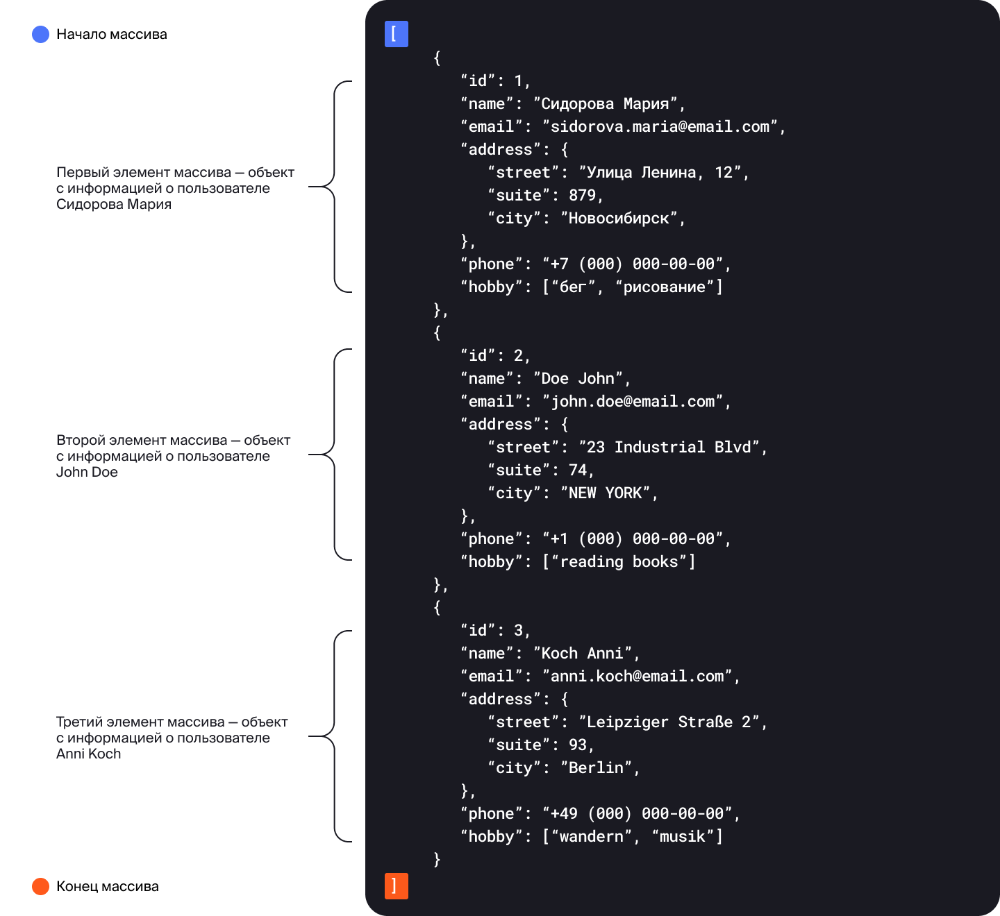

   Предыдущее занятие   |         &nbsp;          |   Следующее занятие    
:----------------------:|:-----------------------:|:----------------------:
 [Урок 23](LESSON23.MD) | [Содержание](../README.MD) | [Урок 25](LESSON25.MD)

# Урок 25. Period и Duration

# Требования к сдаче работы

Задание выполняется в среде программирования Idea. Результат надо разместить в своем репозитории на GitHub.
Прислать в гугл-формы(размещенная на моем сайте) ссылку на репозиторий.

***Критерии оценивания***

* Оценка 5 - надо сделать все задания.
* Оценка 4 - надо сделать любые четыре задания.
* Оценка 3 - надо сделать любые три задания.

## Оглавление
1. [Классы Period и Duration](#классы-period-и-duration)
   * [Класс `Period`](#класс-period)

3. [Задание 1](#задание-1)
4. [Задание 2](#задание-2)
5. [Задание 3](#задание-3)
6. [Задание 4](#задание-4)
7. [Задание 5](#задание-5)

<details>

<summary>Классы Period и Duration</summary>

## Классы Period и Duration

При работе со временем нам часто бывает нужна информация
не о конкретных моментах, а о длительности промежутка между ними. 
Например, если нам необходимо узнать, сколько минут займёт поездка от одной
станции метро до другой, или определить возраст пользователя нашего приложения.

Для этого в Java есть два специальных класса: `Period` (англ. «период, срок») 
и `Duration` (англ. «продолжительность, длительность»). О них и пойдёт речь
в этом уроке.

### Класс `Period`
Используется для вычисления срока **между двумя датами**. В экземпляре класса 
есть три поля: 
* продолжительность в годах (можно получить с помощью метода `getYears()`);
* месяцах (`getMonths()`);
* днях (`getDays()`).

Самый простой способ узнать продолжительность — вызвать статический 
метод `between(LocalDate startDateInclusive, LocalDate endDateExclusive)`, 
который вычисляет период с даты `startDateInclusive` 
по дату `endDateExclusive`. День, обозначенный датой `endDateExclusive`,
в расчёте не учитывается. 

Например, результатом метода `Period.between(LocalDate.of(2021, 11, 15),
LocalDate.of(2021, 11, 19))` будет промежуток в 4 дня:


Один из популярных примеров работы класса `Period` — программа для подсчёта возраста:

```java
import java.time.LocalDate;
import java.time.Period;

import static java.time.Month.JANUARY;

class Practicum {
    public static void main(String[] args) {
        LocalDate today = LocalDate.now();
        // напишите здесь свою дату рождения
        LocalDate birthday = LocalDate.of(1990, JANUARY, 1);

        Period age = Period.between(birthday, today);
        System.out.println("Ваш возраст:");
        System.out.println("Лет: " + age.getYears());
        System.out.println("Месяцев: " + age.getMonths());
        System.out.println("Дней: " + age.getDays());
   
```




### Класс Duration
В отличие от класса `Period`, класс `Duration` хранит продолжительность времени
с точностью до наносекунд и используется для вычисления длительности 
времени между двумя моментами. 
Сделать это можно с помощью метода `between(...)`:

```java
import java.time.Duration;
import java.time.LocalDateTime;
import java.time.Month;

import static java.time.Month.JANUARY;

class Practicum {
    public static void main(String[] args) {
        LocalDateTime now = LocalDateTime.now();
        // напишите здесь свою дату рождения с точностью до часов и минут
        int yearOfBirth = 1990;
        Month monthOfBirth = JANUARY;
        int dayOfMonth = 1;
        int hourOfBirth = 9;
        int minuteOfBirth = 0;
        LocalDateTime birthday = LocalDateTime.of(yearOfBirth, monthOfBirth, dayOfMonth, hourOfBirth, minuteOfBirth);

        Duration duration = Duration.between(birthday, now);

        System.out.println("На момент запуска кода вы прожили " + duration.getSeconds()
                + " секунд и " + duration.getNano() + " наносекунд.");
    }
}
```


Кроме того, у `Instant`, `LocalDateTime`, `LocalDate` и `LocalTime` есть 
метод `plus(TemporalAmount amountToAdd)`, где `TemporalAmount` (англ. «временно́е количество») 
—  интерфейс, представляющий продолжительность времени, который как раз и реализуют 
классы `Duration` и `Period`. А значит их значения можно передать в качестве параметра 
этого метода. Таким образом, `plus(TemporalAmount amountToAdd)` можно использовать и 
для вычисления момента времени, который произойдёт спустя промежуток, хранящийся в 
`Duration` или `Period`.

Например, если в переменной `ninetyMinutes` хранится промежуток продолжительностью в
90 минут, то при добавлении его к какому-либо моменту времени можно получить новый, но на
90 минут позже:

```java
import java.time.Duration;
import java.time.LocalTime;


class Practicum {
    public static void main(String[] args) {
        LocalTime start = LocalTime.of(0, 0);
        LocalTime finish = LocalTime.of(1, 30);

        // находим продолжительность между двумя единицами времени
        Duration ninetyMinutes = Duration.between(start, finish);

        LocalTime noon = LocalTime.of(12, 0);
        System.out.println("Старый момент времени: " + noon);
        // прибавляем к созданному моменту вычисленную продолжительность
        LocalTime newTime = noon.plus(ninetyMinutes);

        System.out.println("Новый момент времени: " + newTime);
    }
}
```


### Создание объектов Duration и Period

Создать объект с промежутком времени можно и вручную:
1. Перечислить все составляющие промежутка: года, месяцы и дни для `Period`:

```java
// промежуток длиной 100 лет, 10 месяцев, 1 день
Period longTime = Period.of(100, 10, 1);
```
 
2.  Воспользоваться методами по созданию промежутка из конкретной величины. Для `Period`:
   * `ofDays(int days)` — создаёт экземпляр Period длительностью `days` дней,
   * `ofWeeks(int weeks)` — длительностью `weeks` недель,
   * `ofMonths(int months)` — длительностью `months` месяцев,
   * `ofYears(int years)` — длительностью `years` лет.

 
Метод `toString()` у класса `Period` выводит продолжительность в формате 
`P[количество лет]Y[количество месяцев]M[количество дней]D`.
Если какая-то составляющая (например, количество месяцев) равна нулю, то она опускается.

Например, промежуток в 3 года, 4 месяца и 5 дней будет выглядеть как `P3Y4M5D`; 
1 год и 10 дней — `P1Y10D`, 14 дней — `P14D`.

Например, продолжительность столетней войны 
(которая на самом деле длилась больше ста лет) будет выведена на экран как `P116Y4M25D`,
а период из 3 недель — `P21D`.

```java
import java.time.Period;

class Practicum {
    public static void main(String[] args) {
        Period theHundredYearsWarPeriod = Period.of(116, 4, 25);
        System.out.println(theHundredYearsWarPeriod);

        Period threeWeeks = Period.ofWeeks(3);
        System.out.println(threeWeeks);
    }
}
```


А вот методы, с помощью которых можно создать экземпляр класса `Duration`:
* `ofSeconds(long seconds)` — создаёт экземпляр `Duration` длительностью `seconds` секунд,
* `ofSeconds(long seconds, long nanoAdjustment)`— длительностью `seconds` секунд и `nanoAdjustment` наносекунд,
* `ofMinutes(long minutes)` — длительностью `minutes` минут,
* `ofHours(long hours)` — длительностью `hours` часов,
* `ofDays(long days)` — длительностью `days` дней.

Как и в случае с классом `Period`, метод `toString()` у класса `Duration` выводит 
продолжительность в формате 
`PT[количество часов]H[количество минут]M[количество секунд]S`. 
Единица времени, равная нулю, также будет опущена. 
Промежуток в 7 часов, 10 минут, 15 секунд будет выглядеть как `PT7H10M15S`. 
Специальных обозначений для милли- и наносекунд нет — они будут переведены в секунды. Например, 
1 час, 30 секунд и 7 наносекунд — будут выглядеть как `PT1H30M0.000000007S`.


```java
import java.time.Duration;

class Practicum {
    public static void main(String[] args) {
        Duration tenMinutes = Duration.ofMinutes(10);
        System.out.println(tenMinutes);

        Duration fiveDays = Duration.ofDays(5);
        System.out.println(fiveDays);

        Duration sixHours = Duration.ofHours(6);
        System.out.println(sixHours);

        Duration someTime = Duration.ofSeconds(59, 100);
        System.out.println(someTime);
    }
}
```


### Методы класса Duration

Так как `Duration` предоставляет больше возможностей по использованию, 
промежутки времени чаще всего вычисляют именно с помощью него. 

У этого класса есть два поля, которые и отражают продолжительность: 
количество секунд и дробная часть секунды — в наносекундах. Получить значения 
этих полей можно с помощью методов `getSeconds()` и `getNano()`.
Например, таким образом можно вычислить, сколько по времени выполнялся участок кода:

```java
import java.time.Duration;
import java.time.LocalDateTime;
import java.util.Random;

class Practicum {
    public static void main(String[] args) throws InterruptedException {
        Random random = new Random();

        // фиксируем начало выполнения кода
        LocalDateTime start = LocalDateTime.now();

        // производим действия, время исполнения которых хотим замерить
        int num = random.nextInt(5000);
        Thread.sleep(num); // останавливаем выполнение кода на произвольное время

        // фиксируем конец выполнения кода
        LocalDateTime finish = LocalDateTime.now();

        // находим продолжительность между двумя моментами
        Duration duration = Duration.between(start, finish);

        // выводим результат
        System.out.println("Код выполнился за " + duration.getSeconds() + "." + duration.getNano() + "с.");
    }
}
```


Так как выводить время в секундах далеко не всегда удобно, 
то у `Duration` есть методы, приводящие продолжительность в другие единицы времени:

* `toDays()` — возвращает целое число дней в промежутке;
* `toHours()` — целое число часов;
* `toMinutes()` — целое число минут;
* `toMillis()` — целое число миллисекунд;
* `toNanos()` — целое число наносекунд;
* `toHoursPart()` — возвращает количество часов от неполного дня;
* `toMinutesPart()` — количество минут от неполного часа;
* `toSecondsPart()` — количество секунд от неполной минуты;
* `toMillisPart()` — количество миллисекунд от неполной секунды.

Например, если промежуток времени исчисляется часами, 
можно воспользоваться методами `toHours()`, `toMinutesPart()` и `toMinutes()`

```java
import java.time.Duration;
import java.time.LocalTime;

class Practicum {
    public static void main(String[] args) {
        LocalTime secondTime = LocalTime.of(23, 40);
        LocalTime firstTime = LocalTime.of(14, 25);

        Duration duration = Duration.between(firstTime, secondTime);

        System.out.println("Между двумя моментами времени:");
        System.out.println(duration.toHours() + " часов, " + duration.toMinutesPart() + " минут,");
        System.out.println("или " + duration.toMinutes() + " минут.");
    }
}
```


</details>


<details>
<summary>Задание 1</summary>

## Задание 1

В компании ООО «Ретроградный Меркурий» для улучшения планирования решили 
использовать ретроанализ: определять, сколько по времени будет в
ыполняться задача, если известно, во сколько она была начата и 
закончена в прошлый раз. Восстановите пропущенные участки кода. 
Воспользуйтесь классом `DateTimeFormatter`,
чтобы выводить время в формате `часы:минуты` (например, `12:34`).


```
import java.time.Duration;
import java.time.LocalTime;
import java.time.format.DateTimeFormatter;


class Practicum {
    public static void main(String[] args) {
        // время начала работы над задачей — 9:00
        LocalTime taskStart = LocalTime.of(...);
        // время окончания работы над задачей — 11:30
        LocalTime taskFinish = LocalTime.of(...);

        // опишите формат вывода в виде часы:минуты
        DateTimeFormatter formatter = ...

        // найдите продолжительность между двумя единицами времени
        Duration duration = ...
        
        // taskStart должен быть выведен в указанном формате
        System.out.println("В прошлый раз задача была начата в " + ... + ",");
        // taskFinish должен быть выведен в указанном формате
        System.out.println("а закончена в " + ... + ".");
        
        LocalTime now = LocalTime.now();
        // now должен быть выведен в указанном формате
        System.out.println("Сейчас " + ... + ".");

        // прибавьте к текущему моменту вычисленную продолжительность
        LocalTime finishTime = ...;

        // finishTime должен быть выведен в указанном формате
        System.out.println("Значит, задача будет выполнена к " + ... + ".");
    }
}


```

### Подсказки

* Создать правильный формат можно с помощью` DateTimeFormatter.ofPattern("HH:mm")`.
* Вывести время в нужном формате поможет метод `format(formatter)`.
* Вычислить время спустя промежуток `duration` можно с помощью метода `plus(duration)`


</details>


<details>
<summary>Задание 2</summary>

## Задание 2

Для космических перелётов в 
2099 году используются прыжки сквозь гиперпространство. 
Бортовому компьютеру необходимо знать: или прыжок будет коротким (меньше суток), 
и тогда продолжительность прыжка нужно выводить в минутах, или долгим, и тогда е
го продолжительность нужно выводить в днях. 

Для вывода временных меток используйте паттерн `"dd.MM.yyyy, HH:mm"`. 
Итоговый ответ должен выглядеть так:

```
Вход в гиперпространство:
10.10.2099, 12:05
Выход из гиперпространства:
10.10.2099, 14:15
Минут на гиперпрыжок: 130

Вход в гиперпространство:
10.10.2099, 12:00
Выход из гиперпространства:
11.10.2099, 15:30
Дней на гиперпрыжок: 1

Вход в гиперпространство:
10.10.2099, 23:10
Выход из гиперпространства:
11.10.2099, 10:25
Минут на гиперпрыжок: 675
```


```
import java.time.Duration;
import java.time.LocalDateTime;
import java.time.Period;
import java.time.format.DateTimeFormatter;


class Practicum {
    public static final int SECONDS_IN_DAY = 60 * 60 * 24;

    public static void main(String[] args) {
        LocalDateTime firstStart = LocalDateTime.of(2099, 10, 10, 12, 5);
        LocalDateTime firstFinish = LocalDateTime.of(2099, 10, 10, 14, 15);

        LocalDateTime secondStart = LocalDateTime.of(2099, 10, 10, 12, 0);
        LocalDateTime secondFinish = LocalDateTime.of(2099, 10, 11, 15, 30);

        LocalDateTime thirdStart = LocalDateTime.of(2099, 10, 10, 23, 10);
        LocalDateTime thirdFinish = LocalDateTime.of(2099, 10, 11, 10, 25);


        printGap(firstStart, firstFinish);
        printGap(secondStart, secondFinish);
        printGap(thirdStart, thirdFinish);
    }

    private static void printGap(LocalDateTime start, LocalDateTime finish) {
        // используйте паттерн "dd.MM.yyyy, HH:mm"
        DateTimeFormatter formatter = ...;

        System.out.println("Вход в гиперпространство:");
        // вывод должен быть в корректном формате
        System.out.println(...);
        System.out.println("Выход из гиперпространства:");
        // вывод должен быть в корректном формате
        System.out.println(...);
        // найдите продолжительность
        Duration duration = ...;

        // сравните продолжительность в секундах с количеством секунд в сутках
        // воспользуйтесь константой SECONDS_IN_DAY
        if (...) {
            // выведите продолжительность в днях
            System.out.println("Дней на гиперпрыжок: " + ...);
        } else {
            // выведите продолжительность в минутах
            System.out.println("Минут на гиперпрыжок: " + ...);
        }
        System.out.println();
    }
}


```
Ожидаемый результат

```
Результат

Вход в гиперпространство:

10.10.2099, 12:05

Выход из гиперпространства:

10.10.2099, 14:15

Минут на гиперпрыжок: 130


Вход в гиперпространство:

10.10.2099, 12:00

Выход из гиперпространства:

11.10.2099, 15:30

Дней на гиперпрыжок: 1


Вход в гиперпространство:

10.10.2099, 23:10

Выход из гиперпространства:

11.10.2099, 10:25

Минут на гиперпрыжок: 675


```

### Подсказки

* Создать правильный формат можно с помощью `DateTimeFormatter.ofPattern("dd.MM.yyyy, HH:mm")`.
* Вывести время в необходимом формате поможет метод `format(formatter)`.
* Чтобы получить продолжительность в нужных единицах времени, 
воспользуйтесь методами `getSeconds()`, `toDays()`, `toMinutes()`.


</details>


   Предыдущее занятие   |         &nbsp;          |   Следующее занятие    
:----------------------:|:-----------------------:|:----------------------:
 [Урок 23](LESSON23.MD) | [Содержание](../README.MD) | [Урок 25](LESSON25.MD) 