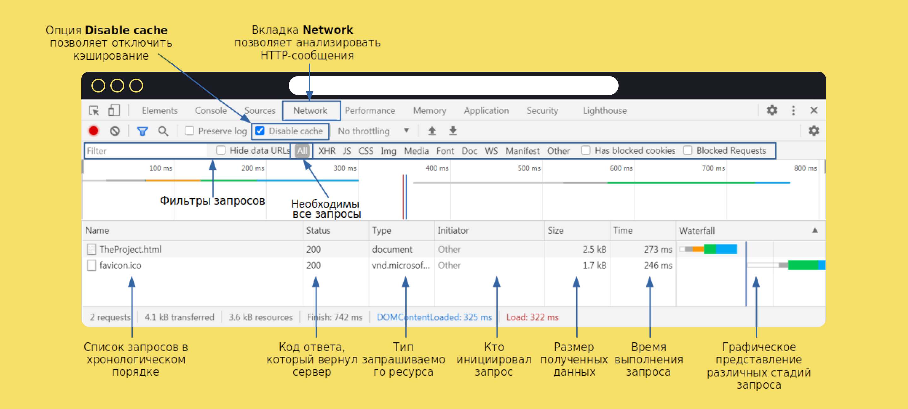

   Предыдущее занятие   |           &nbsp;           |   Следующее занятие    
:----------------------:|:--------------------------:|:----------------------:
 [Урок 24](LESSON24.MD) | [Содержание](../README.MD) | [Урок 26](LESSON26.MD) 

# Урок 25. Internet, HTTP, JSON

## Оглавление

1. [Интернет. Модель клиент-сервер и сетевые протоколы](#интернет-модель-клиент-сервер-и-сетевые-протоколы)
   * [Что такое интернет](#что-такое-интернет)
   * [Клиент и сервер](#клиент-и-сервер)
   * [Сетевые протоколы](#сетевые-протоколы)
2. [URL и HTML](#url-и-html)
   * [URL-адрес](#url-адрес)
   * [Просматриваем HTML-код веб-страницы](#просматриваем-html-код-веб-страницы)
3. [Структура HTTP-сообщения](#структура-http-сообщения)
   * [Стартовая строка](#стартовая-строка)
   * [HTTP-методы](#http-методы)
   * [Код ответа](#код-ответа)
   * [Заголовки](#заголовки-)
   * [Тело](#тело)
4. [Инструменты разработчика в браузере](#инструменты-разработчика-в-браузере)
   * [Инструменты разработчика в браузере Google Chrome](#инструменты-разработчика-в-браузере-google-chrome)
5. [Веб-сервисы и WEB API](#веб-сервисы-и-web-api)
   * [Веб-приложения и веб-сервисы](#веб-приложения-и-веб-сервисы)
   * [Web API](#web-api)
6. [Формат данных JSON](#формат-данных-json)
   * [Синтаксис JSON](#синтаксис-json)
   * [Просматриваем данные в формате JSON](#просматриваем-данные-в-формате-json)
7. [Краткий конспект](#краткий-конспект)


<details>

<summary>Интернет. Модель клиент-сервер и сетевые протоколы</summary>

## Интернет. Модель клиент-сервер и сетевые протоколы

Нелегко представить современную жизнь без интернета.
Он помогает общаться и путешествовать, учиться и программировать. Интернет повсюду,
поэтому так важно знать, как он устроен.

В этом уроке вы начнёте знакомиться с интернетом и основными концепциями,
которые важны для понимания его работы.

### Что такое интернет

Название **интернет** возникло в результате соединения слов **inter** (англ. «между») и ***net**work
(англ. «сеть»), так что буквально его можно перевести как «межсетевой».

В 1980-х в США разные организации решили объединить компьютеры внутри своих офисов.
Это помогло ускорить коммуникации и наладить совместное использование ресурсов, например
общих файлов или устройств. Скоро стало понятно, что связывать можно не только
отдельные компьютеры, но и целые сети. Причём совершенно неважно,
на каком расстоянии они находятся друг от друга.

Сегодня с помощью проводов и радиосигналов интернет объединил компьютеры по всему миру.
Обмен данными стал практически моментальным. При этом сеть сохраняет работоспособность,
даже если какая-то её часть вдруг становится недоступной.


### Клиент и сервер

Все **компьютеры**(Смартфон, электронная книга, умная кофеварка — это тоже компьютеры.) в сети можно условно разделить
на два типа — серверы и клиенты.

**Сервер** (англ. _server_) — компьютер, который предоставляет информацию другим компьютерам.
**Клиент** (англ. _client_) — компьютер, который запрашивает информацию у сервера. Такой информацией могут быть,
например:

* хранящиеся на сервере данные (медиафайлы, показания датчиков, сведения из базы данных);
* результаты каких-либо вычислений (перевод денег, стриминг видео, действия персонажей онлайн-игры);
* результаты работы подключённых устройств (принтеров, сканеров, станков ЧПУ и других).

Устройство может быть сервером для одних устройств и клиентом для других.
Например, сервер может вычислять что-то сам и одновременно запрашивать информацию у других
серверов в качестве клиента.

Чтобы предоставлять качественные услуги большому количеству клиентов,
обычно используются устройства с мощными процессорами и огромными объёмами памяти.
Тем не менее серверу совсем необязательно быть дорогим и производительным компьютером.
Существует множество компактных устройств, которые имеют ограниченные вычислительные способности,
но при этом выступают в роли сервера.

Программы, например интернет-браузер и веб-сервер,
тоже могут взаимодействовать по клиент-серверной модели. Клиент (интернет-браузер)
отправляет веб-серверу сообщение с просьбой сделать что-либо, например предоставить доступ
к странице сайта. Такое сообщение называется **запросом** (англ. _request_). Веб-сервер реагирует
на запрос и отправляет ответное сообщение, например содержимое запрошенной страницы.
Такое сообщение называется **ответом** (англ. _response_).

### Сетевые протоколы

Когда две страны ведут переговоры, правительства этих стран следуют набору общепринятых правил
— дипломатическому протоколу.
У компьютеров, которые обмениваются данными по сети, тоже есть свои наборы общепринятых
правил общения. Они называются **сетевыми протоколами** (англ. _network protocols_).


Разные протоколы регламентируют разные процессы, например подготовку и доставку данных,
приём данных и их дальнейшую обработку.
В соответствии с этим они выстраиваются в иерархию — **стек протоколов** (англ. _protocol stack_).

Стек делится на уровни. Задачи каждого уровня выполняются одним или несколькими протоколами.
При этом протоколы более высокого уровня используют нижележащие и дополняют
их собственными функциональностями.

Существуют десятки сетевых протоколов. Среди самых распространённых можно выделить:

* **Internet Protocol** (англ. «межсетевой протокол»), или IP

  Регламентирует подготовку данных к передаче и их доставку адресату. У каждого компьютера в сети есть уникальный
  IP-адрес. Он записывается в виде четырёх десятичных чисел, разделённых точками, например 192.168.0.9.
  По этому адресу устройства находят друг друга и обмениваются информацией.
* Transmission Control Protocol (англ. «протокол управления передачей»), или TCP

  Регламентирует доставку и проверяет, что IP передал все данные адресату. Если нет,
  они запрашиваются и отправляются повторно. В пределах одного IP-адреса может работать
  множество программ. TCP указывает, какой из них предназначаются полученные данные.
  Найти её протоколу помогает **сетевой порт** (англ. _port_) — целое неотрицательное число,
  которое закрепляется за конкретной программой.

* HyperText Transfer Protocol (англ. «протокол передачи гипертекста»), или HTTP

  Использует протоколы TCP и IP, а также вводит понятия клиента и сервера и описывает правила
  их взаимодействия. Этот протокол применяется браузером, когда вы, например,
  просматриваете сайты, слушаете музыку или смотрите видеоролики. Программисты
  называют браузер и другие программы, отправляющие HTTP-запросы, **HTTP-клиентом**.
  А программу-сервер, обрабатывающую такие запросы, — **HTTP-сервером**.


</details>

<details>

<summary>URL и HTML</summary>

## URL и HTML

Пришло время познакомиться с базовыми компонентами URL-адреса,
а также научиться просматривать HTML-код веб-страницы. Поехали!

### URL-адрес

Чтобы перейти на любой сайт в интернете, нужно знать его адрес.
Вы можете найти его в адресной строке браузера.


Адреса сайтов записываются в формате **Uniform Resource Locator** (англ. «унифицированный указатель ресурса») или
коротко — **URL**. Часто их называют гиперссылками или просто ссылками.

URL указывает, где именно в глобальной сети находится запрашиваемый ресурс. Ресурсом может быть не только страница
сайта, но и аудиофайл, изображение, информация из базы данных и так далее.

Разберём базовые компоненты URL на примере адреса первого в истории сайта:

> На самом деле, это архивная копия первого сайта в сети, опубликованного британским ученым Тимом Бернерсом-Ли в
> 1991 году. Вместе со своими коллегами по Европейскому центру ядерных исследований (CERN) он придумал и реализовал
> концепцию World Wide Web (WWW). Она определила современный облик интернета.


* **http** — протокол

Указывается в начале адреса и описывает правила доступа к ресурсу.
Современные браузеры, например Google Chrome, Mozilla Firefox, Apple Safari,
по умолчанию скрывают протокол в адресной строке.

Протоколы могут быть разными, но HTTP и HTTPS(Это более безопасная версия протокола HTTP.
S означает **Secure** и говорит о том, что все запросы и ответы на них шифруются.) — самые распространённые.

* **info.cern.ch** — имя сервера, которому отправляется запрос

HTTP использует протоколы IP и TCP. Значит, для получения доступа к ресурсу необходимо
указывать IP-адрес и сетевой порт сервера. Но обращаться к серверам
с помощью этих чисел было бы очень неудобно. Представьте, если бы люди называли друг друга
не по имени и фамилии, а по серии и номеру паспорта. Жизнь точно стала бы намного сложнее!

Чтобы упростить адресацию, была придумана система **доменных имён**
(англ. _**D**omain **N**ame **S**ystem_, или _DNS_). Доменное имя привязывается к IP-адресу
и применяется вместо него. Длинная цепочка чисел превращается в понятные слова
вроде `info.cern.ch` или `practicum.yandex.ru`.

Также HTTP-серверы практически всегда используют порт с номером 80.
Браузеры подставляют его автоматически, поэтому в адресной строке он опускается.

* **hypertext/WWW/TheProject.html** — местоположение ресурса на сервере

В данном случае содержимое запрашиваемой страницы хранится
в файле `TheProject.html`, а сам файл находится в папке `WWW` — подпапке `hypertext`.

[КАК РАБОТАЕТ ИНТЕРНЕТ](#https://drive.google.com/file/d/15EFq-6x8smC0YFgU9wrAH_g12bdMCyYe/view?usp=sharing)

### Просматриваем HTML-код веб-страницы

Имя файла `TheProject.html` в URL-адресе, который мы разбирали выше,
состоит из двух частей. Это название — `TheProject` и расширение — `.html`.
Такое расширение сообщает, что файл является веб-страницей.

**HTML** — аббревиатура от HyperText Markup Language (англ. «язык гипертекстовой разметки»).
Этот язык используется для создания сайтов и позволяет оставлять в тексте метки —
**теги** (англ. tag, «метка»).

Теги записываются в угловых скобках (<>). Браузер считывает их и понимает,
как отображать страницу. Затем он преобразует разметку в привычный для пользователя вид.

Вы можете посмотреть, как выглядело содержимое любой веб-страницы до обработки браузером.
Есть два способа:

* Кликните правой кнопкой мыши в области веб-страницы, свободной от текста и других элементов.
  Появится контекстное меню. В нём, в зависимости от вашего браузера,
  выберите соответствующий
  пункт. [Как это сделать, в трёх популярных браузерах](https://drive.google.com/file/d/1s3FWo0QCFYoKKJ7aYl791ys3W-bMFBF6/view?usp=sharing)

* Нажмите следующее сочетание клавиш:

  | Операционная система | Сочетание клавиш |
              :--------------------:|:----------------:
  |       Windows        |      Ctrl+U      |
  |        Linux         |      Ctrl+U      |
  |        macOS         |   Cmd+Option+U   |

</details>

<details>

<summary>Структура HTTP-сообщения</summary>

## Структура HTTP-сообщения

В прошлом уроке вы посетили первый в истории сайт, а значит,
ваш браузер обменялся с его сервером HTTP-сообщениями. Выглядят они так:


В этом уроке подробно разберём, зачем нужен каждый из элементов HTTP-сообщения. Вперёд!

### Стартовая строка

**Стартовая строка** (англ. _start-line_) начинает HTTP-сообщение и передаёт его суть.

В стартовой строке запроса используются методы (англ. methods).
Они описывают действие, которое сервер должен выполнить с запрашиваемым ресурсом.

> Напомним, что ресурсом может быть содержимое веб-страницы, аудиофайл, информация о пользователе, данные маршрута и так
> далее.

В стартовой строке ответа клиенту возвращается **код ответа** (англ. status code).

> Он ещё называется «кодом состояния».

По нему можно определить, обработан ли запрос успешно или возникла проблема.

Также в стартовой строке и запроса, и ответа указывается версия протокола
HTTP. HTTP/1.1 говорит о том, что используется протокол HTTP с версией 1.1.

### HTTP-методы

Рассмотрим основные методы, применяемые в HTTP-запросах:

* `POST` - Используется для создания на сервере нового ресурса. Например, если нужно
  добавить нового пользователя в базу сайта, пользовательские данные будут передаваться
  в HTTP-сообщении вместе с `POST`-запросом. Но если такой пользователь уже существует,
  то сервер вернёт ошибку.
* `GET` - Используется для получения ресурса. Например, чтобы получить информацию
  о созданном пользователе. В ответ на `GET`-запрос сервер вернёт пользовательские данные.
* `PUT` - Используется, как и `POST`, для передачи данных серверу. Разница в том,
  что `PUT`-запрос заменяет существующие данные или при их отсутствии создаёт новый ресурс.
  Например, если с `PUT`-запросом передать данные об уже созданном пользователе,
  то информация на сервере будет обновлена. Если же такого пользователя на сервере нет,
  то он будет добавлен.
* `PATCH` - Используется для частичного обновления данных ресурса.
  Например, чтобы изменить только телефон или адрес существующего пользователя.
* `DELETE` - Используется для удаления ресурса. Например, информации о пользователе.

В стартовой строке запроса из нашего примера применяется метод GET:


### Код ответа

Код ответа состоит из трёхзначного числа и названия.
Таких кодов много и их необязательно знать все, но важно понимать,
к какой категории относится тот или иной код. В этом поможет его первая цифра.


* **Коды успеха** — числа, начинающиеся с двойки, то есть с 200 по 299.
  Они сообщают, что запрос был понят и успешно обработан.
  Самые часто используемые коды из этой категории:

| Код |  Название  |                                                         Описание                                                         |
|:---:|:----------:|:------------------------------------------------------------------------------------------------------------------------:|
| 200 |     OK     |                              Запрос успешно обработан, и результат возвращён в теле ответа.                              |
| 201 |  Created   |                            На сервере были успешно созданы один или несколько новых ресурсов.                            |
| 204 | No content | Запрос успешно обработан и нет никаких данных для возврата. Тело ответа проверять не нужно: оно обязательно будет пустым |

* **Коды клиентских ошибок** — числа, начинающиеся с четвёрки, то есть с 400 по 499.
  Они указывают, что запрос был сформулирован клиентом некорректно,
  например, содержит неверные данные или не может быть выполнен.
  Чаще всего можно встретить следующие коды из этой категории:

| Код |   Название   |                                                         Описание                                                          |
|:---:|:------------:|:-------------------------------------------------------------------------------------------------------------------------:|
| 400 | Bad Request  | Сервер не понимает запрос или пытается его обработать, но не может выполнить из-за того, что какой-то его аспект неверен. |
| 401 | Unauthorized |        Для выполнения запроса нужна аутентификация, но вместе с запросом не были переданы авторизационные данные.         |
| 404 |  Not found   |                                        Сервер не может найти запрашиваемый ресурс.                                        |

* **Коды серверных ошибок** — числа, начинающиеся с пятёрки, то есть с 500 по 599.
  Если такое число встретилось в ответе, это значит, что сервер не смог
  обработать запрос в связи с какими-то внутренними проблемами.
  Самые распространённые коды из этой категории:

| Код |       Название        |                                              Описание                                              |
|:---:|:---------------------:|:--------------------------------------------------------------------------------------------------:|
| 500 | Internal Server Error | У сервера возникла проблема, с которой он не справился, а потому произошёл сбой обработки запроса. |
| 501 |    Not Implemented    |   Серверу неизвестен HTTP-метод, использованный в запросе, поэтому запрос невозможно обработать.   |
| 503 |  Service Unavailable  | Сервер не может сейчас обработать запрос, поскольку сильно загружен, отключён или перезагружается. |

В стартовой строке ответа из нашего примера указан код успеха — `200`:


### Заголовки 

Стартовая строка HTTP-сообщения содержит ограниченное количество элементов. 
Их недостаточно для передачи всей служебной информации. 
Дополнительную информацию передают **заголовки** (англ. _headers_). 
Каждый заголовок записывается на отдельной строке и состоит из **названия** 
и отделённого от него двоеточием **значения**. Например:


* `Accept`

  Указывает серверу список типов данных, которые клиент может от него принять 
  и корректно обработать. Значение `*/* `говорит о том, что HTTP-клиент 
  готов принять данные любого типа. В качестве значения могут быть также указаны, 
  например, `text/html` (клиент ожидает данные в формате HTML), 
  `image/png` (ожидается изображение в формате PNG) и другие форматы. 
  Заголовок используется только в запросах.

* `Host`

  Указывает адрес сервера, которому нужно отправить запрос, 
  например, `info.cern.ch`. 
  Заголовок встречается только в запросах.

* `Content-Length`

  Указывает размер тела сообщения в байтах. Например, значение 2217 определяет, 
  что всё содержимое веб-страницы занимает 2217 байт. 
  Заголовок используется как в запросах, так и в ответах.

* `Content-Type`

Указывает тип передаваемых данных. Например, значение `text/html` сообщает, 
что данные, которые возвращает сервер, имеют текстовый тип и содержат HTML-код. 
С помощью этого заголовка клиент или сервер выбирают правильный способ 
интерпретации поступающей информации. Заголовок встречается как в запросах, так и в ответах.

Более подробно о методах, кодах и заголовках 
можно прочитать [в сетевой документации компании Mozilla](https://developer.mozilla.org/ru/docs/Web/HTTP)
и [спецификации протокола HTTP](https://www.rfc-editor.org/rfc/rfc7231.html).

### Тело

Иногда вместе с запросом или ответом необходимо передать какие-либо данные. 
Например, содержимое запрошенной веб-страницы или текст сообщения для размещения 
в социальной сети. Такие данные помещаются в **тело** (англ. _body_) HTTP-сообщения.
Оно следует за стартовой строкой и заголовками и отделяется от них пустой строкой.


У запросов и ответов одинаковая структура, однако не все элементы являются обязательными. Например, тело сообщения может отсутствовать как в запросе, так и в ответе, а некоторые заголовки предназначены только для запросов или только для ответов. 
Но без чего не обойтись любому HTTP-сообщению — так это без стартовой строки.

</details>

<details>

<summary>Инструменты разработчика в браузере</summary>

## Инструменты разработчика в браузере

В прошлом уроке мы рассказали о структуре HTTP-сообщений.
Разберём, какие инструменты предлагают браузеры для их анализа. 
Начнём с Google Chrome, а далее в уроке покажем то же самое ещё для двух браузеров 
— Mozilla Firefox и Apple Safari.

### Инструменты разработчика в браузере Google Chrome

Откройте панель инструментов с помощью клавиши `F12`, сочетания клавиш `Ctrl+Shift+I` 
или меню браузера.

[ВИДЕО](https://drive.google.com/file/d/1AbXoLnLpcHG2IopxLqvYAaI4rUAszJ14/view?usp=sharing)

Самые полезные для бэкенд-разработчика инструменты находятся на
вкладке **Network** (англ. «сеть»). Переходите на неё. Здесь можно анализировать 
запросы к серверу и ответы на них.



Чтобы браузер отправлял все запросы, отключите использование кэша. 
Поставьте галочку около опции **Disable cache** (англ. «отключить кэш»).

Убедитесь, что в области фильтров запросов выделена опция **All** (англ. «все»).
Она отвечает за отображение всех типов запросов.

[ВИДЕО](https://drive.google.com/file/d/1sA0HoqRDH3Cyhmq_kI1YLxzWyzlKKMrK/view?usp=sharing)

Загрузите интересующую веб-страницу, например, первый в истории сайт, 
который вы посетили в прошлых уроках. Если на момент открытия панели инструментов 
страница уже была загружена, обновите её с 
помощью клавиши `F5`, сочетания клавиш `Ctrl+R` или кнопки обновления страницы в браузере. 

[ВИДЕО](https://drive.google.com/file/d/1oJhjQ74aO1wu0_AcPTRwKMkyU82nmObS/view?usp=sharing)

На вкладке **Network** представлены основные сведения о запросах браузера. 
Например, имя запрашиваемого ресурса, его тип, код ответа сервера и так далее. 
Чтобы проанализировать конкретный запрос, кликните по нему левой кнопкой мыши.
В правой части появится панель с информацией о выбранном запросе и о результате 
его обработки сервером.
Обратите внимание на первые три вкладки этой панели: **Headers**, **Preview** и **Response**.

[ВИДЕО](https://drive.google.com/file/d/1KNW50rZKLbeKOJ8xZLNulVzcnIesghSF/view?usp=sharing)

* Вкладка **Headers** (англ. «заголовки») содержит служебную информацию о запросе браузера и ответе сервера. Она разделена на три категории:
  * **General** (англ. «общая») — общая информация о запросе и ответе. Здесь есть IP-адрес сервера, которому отправлял запрос браузер, URL-адрес запрашиваемого ресурса, HTTP-метод, использованный браузером, и код ответа сервера.
  * **Response Headers** (англ. «заголовки ответа») — список всех заголовков, которые сервер указал в ответе на запрос браузера.
  * **Request Headers** (англ. «заголовки запроса») — список всех заголовков, которые отправил браузер в запросе.
* Вкладка **Preview** (англ. «предпросмотр») позволяет посмотреть переданные сервером данные в удобном для пользователя виде. Вы анализируете запрос на получение веб-страницы. На этой вкладке она отразится такой, какую её видит пользователь в основном окне браузера. Если бы вы анализировали, например, запрос на получение изображения, то увидели бы здесь само изображение. А если бы сервер в ответ на запрос не передавал никаких данных, то вкладка была бы пуста.
* Вкладка **Response** (англ. «ответ») по смыслу похожа на вкладку **Preview**. Она отображает данные, которые сервер передал в ответ на запрос. Разница в том, что здесь их можно посмотреть в исходном виде. Например, если вы анализируете запрос на получение веб-страницы, будет показан её HTML-код.


Хотя все современные браузеры предлагают схожий набор инструментов, детали их использования могут отличаться. 


</details>

<details>

<summary>Веб-сервисы и WEB API</summary>

## Веб-сервисы и WEB API

Теперь вы знаете, как взаимодействуют клиент и сервер по протоколу HTTP.
Ваш браузер отправляет запрос, сервер возвращает ответ, а вы получаете доступ к первому в 
истории сайту. Это простой и понятный пример: чтобы браузер отобразил веб-страницу,
серверу нужно просто передать содержимое её HTML-файла.

Такие сайты существуют до сих пор. Среди них можно назвать сайты-визитки, 
сайты-резюме и другие. Они состоят из нескольких страниц со статическим текстом, 
картинками и так далее. Однако большинство современных ресурсов всё же устроены сложнее.
Разберём, как именно.


### Веб-приложения и веб-сервисы

С развитием интернета возникли веб-сайты, которые состоят из динамических страниц и
предоставляют возможности интерактивного взаимодействия. Такие сайты называются **веб-приложениями** 
(англ. _web applications_). К ним относятся социальные сети, сайты электронной почты, 
онлайн-карты и многие другие.

Например, на странице пользователя в социальной сети отображаются количество 
непрочитанных сообщений, список друзей и комментариев. Эта информация нестатична.
Пользователь может в любой момент получить ещё одно сообщение, добавить нового друга 
или опубликовать очередной комментарий. Было бы трудно хранить все эти данные в HTML-файле 
и всякий раз редактировать их вручную, когда что-то меняется.

Чтобы веб-приложение отображалось и работало, браузер загружает с сервера программу 
— фронтенд-часть сайта. Она функционирует на устройстве пользователя и 
обеспечивает динамичность и интерактивность веб-приложения, 
но обычно не выполняет сложных вычислений.

Для загрузки, сохранения или обработки информации фронтенд отправляет 
запросы бэкенду. На бэкенде их обрабатывают один или несколько серверов. 
Серверы, обрабатывающие запросы фронтенда веб-приложения, называются **веб-сервисами**, 
или **веб-службами** (англ. _web services_).

Веб-сервисы могут делать расчёты, выполнять сложные алгоритмы, 
а также работать с другими сервисами. Они возвращают не статическую, 
а динамическую информацию — список новостей, данные о профиле пользователя,
отправленные ему сообщения и так далее. Эта информация может быть получена из базы данных, 
в результате вычислений или от других веб-сервисов. Фронтенд-часть веб-приложения решает,
как отобразить данные в браузере, а также вовремя обновляет их.


### Web API

Чтобы получить нужную информацию, фронтенд обращается к конкретному URL,
а веб-сервис обрабатывает этот запрос. Набор таких URL и совокупность соглашений о том, 
как именно работать с ними другим программам, называется **Web API** (**Web A**pplication 
**P**rogramming **I**nterface, англ. «программный интерфейс веб-приложения») или просто API.

API необходимы для того, чтобы одни программы могли использовать другие 
по принципу чёрного ящика, то есть ничего не зная об их реализации. 
При таком подходе внутреннее устройство и механизм работы программы неважны или неизвестны,
а значение имеет лишь то, что подаётся на вход, и сам результат.


Например, в разработке современных игр часто применяются готовые движки. 
Чтобы их использовать, необязательно разбираться в тонкостях реализации. 
Достаточно уметь работать с API — набором структур и функций, предназначенных 
для взаимодействия с движком игры.

Другой пример — API Windows, Linux и так далее. Эти API помогают 
разработчикам писать программы, которые напрямую работают с операционной системой.

API позволяет взаимодействовать с веб-сервисами с помощью HTTP-запросов и
получать в ответ структурированные данные, а не готовую страницу.
Эти данные могут применяться для формирования динамической веб-страницы 
или результата в другом веб-сервисе, а также для отображения в мобильном приложении. 
Например, просмотреть новостную ленту в социальной сети можно и через браузер, 
и через приложение в смартфоне. Обе программы используют один и тот же сервис через его API.

API бывают открытыми (публичными) и закрытыми (частными). Частный API 
доступен разработчикам, связанным с предоставляющей его организацией. 
Публичные доступны любому заинтересованному разработчику. Примером публичных являются 
API онлайн-карт, социальных сетей, стриминговых сервисов и так далее.

Каким будет API веб-приложения, решает его разработчик. 
API может меняться со временем, и тогда необходимо дорабатывать 
программы, которые его используют.


</details>

<details>

<summary>Формат данных JSON</summary>

## Формат данных JSON

Чтобы фронтенд и бэкенд могли понимать друг друга, 
данные должны передаваться в определённом формате. 
Одним из таких форматов является **JSON** (от англ. _**J**ava**S**cript **O**bject **N**otation_,
«синтаксис объекта JavaScript»). 

> 📌 **JavaScript** — язык программирования, который используется на фронтенде 
> для реализации интерактивности веб-приложений.
> Несмотря на то, что названия JavaScript и Java похожи, это разные языки.

JSON позаимствовал из JavaScript типы данных и правила записи объектов и массивов. 
Но применять этот формат можно в программах, написанных на разных языках программирования.

Фронтенд использует JSON, чтобы передавать данные на сервер в теле `POST`, `PUT` и `PATCH`-запросов,
например, если нужно создать новый заказ в интернет-магазине.

Бэкенд использует JSON в теле ответов, например, в ответ на `GET`-запрос 
на получение списка товаров или на `PUT`-запрос на обновление цены товара.


### Синтаксис JSON
JSON поддерживает шесть типов данных. Их аналоги есть в большинстве языков программирования, в том числе и в Java.
* Примитивные типы данных:
  * строки: "строка";
  * числа: 42;
  * логические значения: false или true;
  * отсутствующее значение: null.
* Сложные типы данных:
  * массивы: [1,2,3,4];
  * объекты: { "value": 42 }(Примерным аналогом для JSON-объекта в Java будет тип данных `Map`.).

В JSON значения примитивных типов не могут использоваться сами по себе.
Они обязательно должны входить в состав объекта или массива. Разберём эти понятия.

* JSON-объект
 
Объект в JSON — это набор пар `ключ: значение`. Эти пары ещё называют **полями** объекта. 
Объект записывается в фигурных скобках. Между скобками перечисляются поля —
через запятую и в произвольном порядке.

Название поля всегда указывается в двойных кавычках и
отделяется от значения двоеточием. Строковые значения тоже записываются 
в двойных кавычках. Названия полей в объекте не должны повторяться.


Фигурные скобки и поля объекта необязательно записывать на отдельных строках. 
Обычно данные в формате JSON передаются в максимально сжатом виде,
а все пробелы и переносы строк удаляются. Пробелы удаляются между полями и значениями, но не в самих значениях. Это позволяет уменьшать размер сообщения.

```json
{"name":"Глафира Харитонова","age":22,"married":true,"children":null,"entertainments":["Танцы","Фанты","Лото"]}
```

* JSON-массив

Массив в JSON похож на массив в Java. Это упорядоченный набор значений, 
заключённый в квадратные скобки. Его элементы отделяются друг от друга запятой. 
Вот пример массива из трёх строковых элементов:

```json
["Танцы","Фанты","Лото"]
```

JSON-объекты и JSON-массивы могут содержать другие объекты и массивы. 
Например, информацию о пользователе можно организовать так:


Допустим, нужно передать информацию не об одном пользователе, а о нескольких. Для этого можно использовать массив. Каждый его элемент будет объектом с информацией о конкретном пользователе.


### Просматриваем данные в формате JSON

Мы покажем, как просмотреть данные в формате JSON, на примере одного из публичных API. 
Следуйте нашим инструкциям в зависимости от типа вашего браузера. 
Вам понадобятся инструменты разработчика.

Откройте панель инструментов разработчика на вкладке Network.
Перейдите [на этот сайт](https://openlibrary.org/authors/OL23919A.json). Затем выберите выполненный запрос в списке.

[ВИДЕО](https://drive.google.com/file/d/1bRn__9RB9fYUv9o6r4tanptEONZos2Fz/view?usp=sharing)

Обратите внимание на заголовок ответа `Content-Type`. С его помощью сервер указывает 
тип передаваемых данных. Сейчас этот заголовок имеет значение `application/json`. 
То есть сервер передал данные в формате JSON. Их можно просмотреть на вкладке **Preview**.

В ответ на запрос сервер вернул объект, описывающий автора книг. 
Браузер считал полученный JSON и отформатировал его, чтобы с ним было удобно работать. 
Например, отобразил каждый элемент массива `alternate_names` в виде строки 
с порядковым номером. Так будет проще найти и развернуть нужный, 
если понадобится подробная информация о полях объекта.

[ВИДЕО](https://drive.google.com/file/d/1R4Nlfhr0T2P-wuOzMB9T5wScGugi6Iin/view?usp=sharing)

</details>

<details>

<summary>Краткий конспект</summary>

## Краткий конспект


В этой теме вы получили много новых знаний о работе интернета! 
Напомним основные факты:
* Работа в сети основана на модели «клиент-сервер». **Сервер** — компьютер, 
который предоставляет информацию другим компьютерам. 
**Клиент** — компьютер, который запрашивает информацию у сервера. 
Их взаимодействие происходит так: клиент отправляет серверу запрос, 
и сервер возвращает клиенту ответ. При этом устройство может быть сервером 
для одних устройств и клиентом для других.

* **Сетевые протоколы** — набор общепринятых правил взаимодействия компьютеров по сети. 
Протоколы выстраиваются в иерархию — стек протоколов.
Протоколы более высокого уровня используют нижележащие и дополняют их.
  * Протокол **IP** регламентирует подготовку данных к передаче и их доставку адресату. 
  Для этого используется **IP-адрес** — набор из четырёх десятичных чисел, разделённых точками. IP-адрес применяется для адресации устройства в сети.
  * Протокол **TCP** регламентирует и контролирует доставку данных по протоколу IP. 
  В этом ему помогает **сетевой порт** — целое неотрицательное число.
  Оно закрепляется за конкретной программой на устройстве 
  и позволяет обратиться к ней по сети.
  * Протокол **HTTP** вводит понятия клиента и сервера и описывает их взаимодействие.
  Используется, например, браузером при обращении к сети. 
  Программа, отправляющая HTTP-запросы, называется HTTP-клиентом,
  а программа, обрабатывающая такие запросы, — HTTP-сервером.

* Адреса сайтов в интернете описываются с помощью **URL**. **URL** состоит из протокола,
имени или адреса сервера и местоположения нужного ресурса на сервере.
Например: `http://info.cern.ch/hypertext/WWW/TheProject.html`.
* **Доменное имя** — это строка, которая заменяет IP-адрес и может быть прочитана 
человеком. Например: `practicum.yandex.ru`.
* Для создания сайтов используют язык **HTML**. Он основан на системе вложенных друг в 
друга тегов, с помощью которых описывается разметка страницы.
* Структура HTTP-сообщения:
  * Начинается со **стартовой строки**. Стартовая строка запроса содержит метод и 
  версию HTTP-протокола. Стартовая строка ответа — версию протокола и код ответа.
    * **Метод** описывает действие, которое сервер должен выполнить с запрашиваемым ресурсом. 
    Основные HTTP-методы: `GET` (получение), `POST` (создание), `PUT` (изменение или добавление), 
    `PATCH` (частичное изменение), `DELETE` (удаление).
    * **Код ответа** — трёхзначное число, которое указывает, был ли запрос корректно обработан.
    Коды успеха начинаются с 2. Коды, начинающиеся с 
    4, сигнализируют о некорректном запросе, а с 5 — об ошибке сервера при обработке запроса.

  * Дополнительная служебная информация передаётся в виде заголовков. 
  Каждый заголовок записывается на отдельной строке и состоит из названия 
  и отделённого от него двоеточием значения. Например: `Content-Type: text/html`.
  * Основные данные — например, содержимое веб-страницы — передаются в **теле** запроса или ответа.

* Увидеть выполняемые HTTP-запросы и другие происходящие 
на веб-странице события можно с помощью панели инструментов разработчика в браузере.
* Современные динамические веб-страницы называют **веб-приложениями**. 
Веб-приложения имеют **фронтенд**-часть, которая работает на устройстве пользователя, 
и **бэкенд**-часть, работающую на сервере (такие серверы также называют веб-сервисами). 
Фронтенд и бэкенд обмениваются сообщениями с помощью HTTP-запросов.
* Набор URL, предоставляемый веб-сервером, и соглашение о том, как с ними работать, 
— это **Web API** сервиса. API бывает публичным (доступным всем) и закрытым (доступным, допустим, разработчикам проекта). Один Web API могут использовать разные реализации фронтенда — например, при обращении из веб-сайта или из мобильного приложения.
* Стандартный формат для передачи данных между клиентом и сервером — **JSON**. 
В нём применяются две основные структуры данных — объекты (набор пар `ключ: значение`) и массивы, которые могут быть как угодно вложены и скомбинированы между собой.


</details>


   Предыдущее занятие   |           &nbsp;           |    Следующее занятие    
:----------------------:|:--------------------------:|:-----------------------:
 [Урок 24](LESSON24.MD) | [Содержание](../README.MD) | [Урок 26](LESSON26.MD)) 