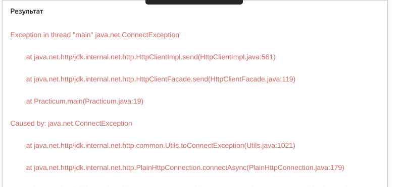
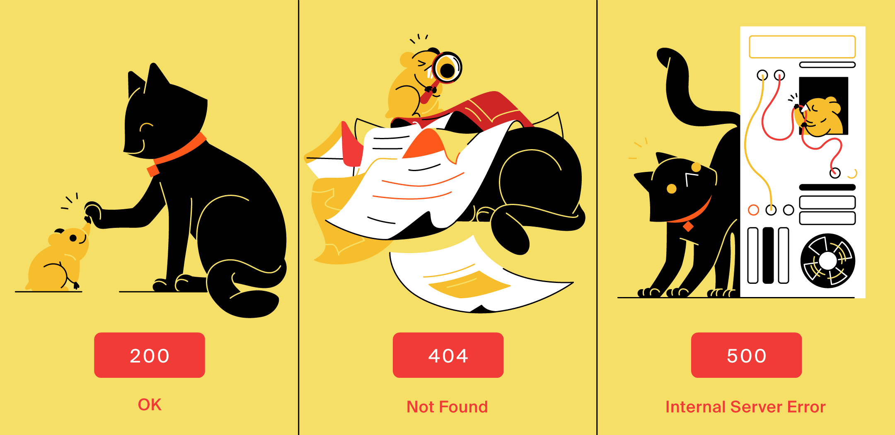

   Предыдущее занятие   |           &nbsp;           |   Следующее занятие    
:----------------------:|:--------------------------:|:----------------------:
 [Урок 24](LESSON24.MD) | [Содержание](../README.MD) | [Урок 26](LESSON26.MD) 

# Урок 25. Internet, HTTP, JSON

# Требования к сдаче работы

Задание выполняется в среде программирования Idea. Результат надо разместить в своем репозитории на GitHub.
Прислать в гугл-формы(размещенная на моем сайте) ссылку на репозиторий.

***Критерии оценивания***

* Оценка 5 - надо сделать все задания.
* Оценка 4 - надо сделать любые четыре задания.
* Оценка 3 - надо сделать любые три задания.

## Оглавление

1. [Интернет. Модель клиент-сервер и сетевые протоколы](#интернет-модель-клиент-сервер-и-сетевые-протоколы)

<details>

<summary>Интернет. Модель клиент-сервер и сетевые протоколы</summary>

## Интернет. Модель клиент-сервер и сетевые протоколы

Нелегко представить современную жизнь без интернета.
Он помогает общаться и путешествовать, учиться и программировать. Интернет повсюду,
поэтому так важно знать, как он устроен.

В этом уроке вы начнёте знакомиться с интернетом и основными концепциями,
которые важны для понимания его работы.

### Что такое интернет

Название **интернет** возникло в результате соединения слов **inter** (англ. «между») и ***net**work
(англ. «сеть»), так что буквально его можно перевести как «межсетевой».

В 1980-х в США разные организации решили объединить компьютеры внутри своих офисов.
Это помогло ускорить коммуникации и наладить совместное использование ресурсов, например
общих файлов или устройств. Скоро стало понятно, что связывать можно не только
отдельные компьютеры, но и целые сети. Причём совершенно неважно,
на каком расстоянии они находятся друг от друга.

Сегодня с помощью проводов и радиосигналов интернет объединил компьютеры по всему миру.
Обмен данными стал практически моментальным. При этом сеть сохраняет работоспособность,
даже если какая-то её часть вдруг становится недоступной.


### Клиент и сервер

Все **компьютеры**(Смартфон, электронная книга, умная кофеварка — это тоже компьютеры.) в сети можно условно разделить
на два типа — серверы и клиенты.

**Сервер** (англ. _server_) — компьютер, который предоставляет информацию другим компьютерам.
**Клиент** (англ. _client_) — компьютер, который запрашивает информацию у сервера. Такой информацией могут быть,
например:

* хранящиеся на сервере данные (медиафайлы, показания датчиков, сведения из базы данных);
* результаты каких-либо вычислений (перевод денег, стриминг видео, действия персонажей онлайн-игры);
* результаты работы подключённых устройств (принтеров, сканеров, станков ЧПУ и других).

Устройство может быть сервером для одних устройств и клиентом для других.
Например, сервер может вычислять что-то сам и одновременно запрашивать информацию у других
серверов в качестве клиента.

Чтобы предоставлять качественные услуги большому количеству клиентов,
обычно используются устройства с мощными процессорами и огромными объёмами памяти.
Тем не менее серверу совсем необязательно быть дорогим и производительным компьютером.
Существует множество компактных устройств, которые имеют ограниченные вычислительные способности,
но при этом выступают в роли сервера.

Программы, например интернет-браузер и веб-сервер,
тоже могут взаимодействовать по клиент-серверной модели. Клиент (интернет-браузер)
отправляет веб-серверу сообщение с просьбой сделать что-либо, например предоставить доступ
к странице сайта. Такое сообщение называется **запросом** (англ. _request_). Веб-сервер реагирует
на запрос и отправляет ответное сообщение, например содержимое запрошенной страницы.
Такое сообщение называется **ответом** (англ. _response_).

### Сетевые протоколы

Когда две страны ведут переговоры, правительства этих стран следуют набору общепринятых правил
— дипломатическому протоколу.
У компьютеров, которые обмениваются данными по сети, тоже есть свои наборы общепринятых
правил общения. Они называются **сетевыми протоколами** (англ. _network protocols_).


Разные протоколы регламентируют разные процессы, например подготовку и доставку данных,
приём данных и их дальнейшую обработку.
В соответствии с этим они выстраиваются в иерархию — **стек протоколов** (англ. _protocol stack_).

Стек делится на уровни. Задачи каждого уровня выполняются одним или несколькими протоколами.
При этом протоколы более высокого уровня используют нижележащие и дополняют
их собственными функциональностями.

Существуют десятки сетевых протоколов. Среди самых распространённых можно выделить:

* **Internet Protocol** (англ. «межсетевой протокол»), или IP

  Регламентирует подготовку данных к передаче и их доставку адресату. У каждого компьютера в сети есть уникальный
  IP-адрес. Он записывается в виде четырёх десятичных чисел, разделённых точками, например 192.168.0.9.
  По этому адресу устройства находят друг друга и обмениваются информацией.
* Transmission Control Protocol (англ. «протокол управления передачей»), или TCP

  Регламентирует доставку и проверяет, что IP передал все данные адресату. Если нет,
  они запрашиваются и отправляются повторно. В пределах одного IP-адреса может работать
  множество программ. TCP указывает, какой из них предназначаются полученные данные.
  Найти её протоколу помогает **сетевой порт** (англ. _port_) — целое неотрицательное число,
  которое закрепляется за конкретной программой.

* HyperText Transfer Protocol (англ. «протокол передачи гипертекста»), или HTTP

  Использует протоколы TCP и IP, а также вводит понятия клиента и сервера и описывает правила
  их взаимодействия. Этот протокол применяется браузером, когда вы, например,
  просматриваете сайты, слушаете музыку или смотрите видеоролики. Программисты
  называют браузер и другие программы, отправляющие HTTP-запросы, **HTTP-клиентом**.
  А программу-сервер, обрабатывающую такие запросы, — **HTTP-сервером**.




</details>

<details>

<summary>URL и HTML</summary>

## URL и HTML

Пришло время познакомиться с базовыми компонентами URL-адреса,
а также научиться просматривать HTML-код веб-страницы. Поехали!

### URL-адрес

Чтобы перейти на любой сайт в интернете, нужно знать его адрес.
Вы можете найти его в адресной строке браузера.


Адреса сайтов записываются в формате **Uniform Resource Locator** (англ. «унифицированный указатель ресурса») или
коротко — **URL**. Часто их называют гиперссылками или просто ссылками.

URL указывает, где именно в глобальной сети находится запрашиваемый ресурс. Ресурсом может быть не только страница
сайта, но и аудиофайл, изображение, информация из базы данных и так далее.

Разберём базовые компоненты URL на примере адреса первого в истории сайта:

> На самом деле, это архивная копия первого сайта в сети, опубликованного британским ученым Тимом Бернерсом-Ли в
> 1991 году. Вместе со своими коллегами по Европейскому центру ядерных исследований (CERN) он придумал и реализовал
> концепцию World Wide Web (WWW). Она определила современный облик интернета.


* **http** — протокол

Указывается в начале адреса и описывает правила доступа к ресурсу.
Современные браузеры, например Google Chrome, Mozilla Firefox, Apple Safari,
по умолчанию скрывают протокол в адресной строке.

Протоколы могут быть разными, но HTTP и HTTPS(Это более безопасная версия протокола HTTP.
S означает **Secure** и говорит о том, что все запросы и ответы на них шифруются.) — самые распространённые.

* **info.cern.ch** — имя сервера, которому отправляется запрос

HTTP использует протоколы IP и TCP. Значит, для получения доступа к ресурсу необходимо
указывать IP-адрес и сетевой порт сервера. Но обращаться к серверам
с помощью этих чисел было бы очень неудобно. Представьте, если бы люди называли друг друга
не по имени и фамилии, а по серии и номеру паспорта. Жизнь точно стала бы намного сложнее!

Чтобы упростить адресацию, была придумана система **доменных имён**
(англ. _**D**omain **N**ame **S**ystem_, или _DNS_). Доменное имя привязывается к IP-адресу
и применяется вместо него. Длинная цепочка чисел превращается в понятные слова
вроде `info.cern.ch` или `practicum.yandex.ru`.

Также HTTP-серверы практически всегда используют порт с номером 80.
Браузеры подставляют его автоматически, поэтому в адресной строке он опускается.

* **hypertext/WWW/TheProject.html** — местоположение ресурса на сервере

В данном случае содержимое запрашиваемой страницы хранится
в файле `TheProject.html`, а сам файл находится в папке `WWW` — подпапке `hypertext`.

[КАК РАБОТАЕТ ИНТЕРНЕТ](#https://drive.google.com/file/d/15EFq-6x8smC0YFgU9wrAH_g12bdMCyYe/view?usp=sharing)

### Просматриваем HTML-код веб-страницы

Имя файла `TheProject.html` в URL-адресе, который мы разбирали выше,
состоит из двух частей. Это название — `TheProject` и расширение — `.html`.
Такое расширение сообщает, что файл является веб-страницей.

**HTML** — аббревиатура от HyperText Markup Language (англ. «язык гипертекстовой разметки»).
Этот язык используется для создания сайтов и позволяет оставлять в тексте метки —
**теги** (англ. tag, «метка»).

Теги записываются в угловых скобках (<>). Браузер считывает их и понимает,
как отображать страницу. Затем он преобразует разметку в привычный для пользователя вид.

Вы можете посмотреть, как выглядело содержимое любой веб-страницы до обработки браузером.
Есть два способа:

* Кликните правой кнопкой мыши в области веб-страницы, свободной от текста и других элементов.
  Появится контекстное меню. В нём, в зависимости от вашего браузера,
  выберите соответствующий пункт. [Как это сделать, в трёх популярных браузерах](https://drive.google.com/file/d/1s3FWo0QCFYoKKJ7aYl791ys3W-bMFBF6/view?usp=sharing)

* Нажмите следующее сочетание клавиш:

  | Операционная система | Сочетание клавиш |
      :--------------------:|:----------------:
  |       Windows        |      Ctrl+U      |
  |        Linux         |      Ctrl+U      |
  |        macOS         |   Cmd+Option+U   |

</details>

<details>

<summary>Структура HTTP-сообщения</summary>

## Структура HTTP-сообщения

В прошлом уроке вы посетили первый в истории сайт, а значит,
ваш браузер обменялся с его сервером HTTP-сообщениями. Выглядят они так:


В этом уроке подробно разберём, зачем нужен каждый из элементов HTTP-сообщения. Вперёд!

### Стартовая строка

**Стартовая строка** (англ. _start-line_) начинает HTTP-сообщение и передаёт его суть.

В стартовой строке запроса используются методы (англ. methods). 
Они описывают действие, которое сервер должен выполнить с запрашиваемым ресурсом.

> Напомним, что ресурсом может быть содержимое веб-страницы, аудиофайл, информация о пользователе, данные маршрута и так далее.

В стартовой строке ответа клиенту возвращается **код ответа** (англ. status code).

> Он ещё называется «кодом состояния».

По нему можно определить, обработан ли запрос успешно или возникла проблема.

Также в стартовой строке и запроса, и ответа указывается версия протокола 
HTTP. HTTP/1.1 говорит о том, что используется протокол HTTP с версией 1.1.

### HTTP-методы

Рассмотрим основные методы, применяемые в HTTP-запросах:

* `POST` - Используется для создания на сервере нового ресурса. Например, если нужно 
добавить нового пользователя в базу сайта, пользовательские данные будут передаваться 
в HTTP-сообщении вместе с `POST`-запросом. Но если такой пользователь уже существует, 
то сервер вернёт ошибку.
* `GET` - Используется для получения ресурса. Например, чтобы получить информацию 
о созданном пользователе. В ответ на `GET`-запрос сервер вернёт пользовательские данные.
* `PUT` - Используется, как и `POST`, для передачи данных серверу. Разница в том, 
что `PUT`-запрос заменяет существующие данные или при их отсутствии создаёт новый ресурс. 
Например, если с `PUT`-запросом передать данные об уже созданном пользователе, 
то информация на сервере будет обновлена. Если же такого пользователя на сервере нет, 
то он будет добавлен.
* `PATCH` - Используется для частичного обновления данных ресурса. 
Например, чтобы изменить только телефон или адрес существующего пользователя.
* `DELETE` - Используется для удаления ресурса. Например, информации о пользователе.

В стартовой строке запроса из нашего примера применяется метод GET:


### Код ответа

Код ответа состоит из трёхзначного числа и названия. 
Таких кодов много и их необязательно знать все, но важно понимать,
к какой категории относится тот или иной код. В этом поможет его первая цифра. 



* **Коды успеха** — числа, начинающиеся с двойки, то есть с 200 по 299. 
Они сообщают, что запрос был понят и успешно обработан. 
Самые часто используемые коды из этой категории:


</details>

<details>

<summary>Задание 1</summary>

## Задание 1

Соберите правильный URL из частей адреса.

```java

public class Practicum {
    public static void main(String[] args) {
				String resource = "/profile/java-developer";
				String protocol = "https://";
				String server = "practicum.yandex.ru";
			
				/* Подставьте вместо многоточий
				   переменные в правильном порядке,
				   чтобы получился корректный URL-адрес. */
				String url = protocol + server + resource ;
				
				System.out.println(url);
		}
}

```


</details>

   Предыдущее занятие   |           &nbsp;           |    Следующее занятие    
:----------------------:|:--------------------------:|:-----------------------:
 [Урок 24](LESSON24.MD) | [Содержание](../README.MD) | [Урок 26](LESSON26.MD)) 