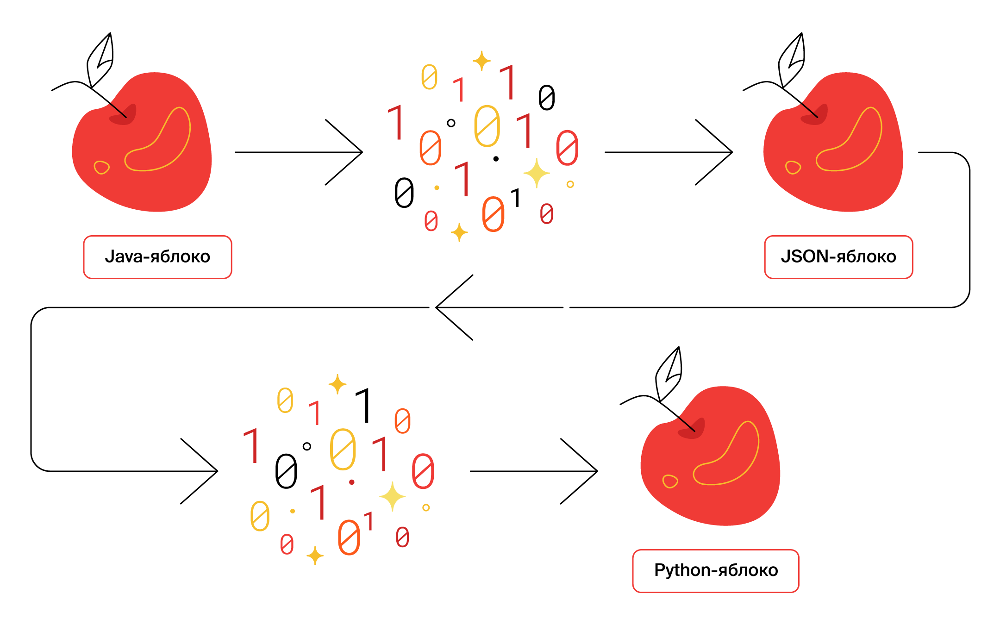
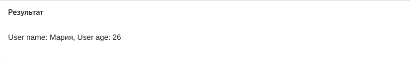

   Предыдущее занятие   |           &nbsp;           |   Следующее занятие    
:----------------------:|:--------------------------:|:----------------------:
 [Урок 26](LESSON26.MD) | [Содержание](../README.MD) | [Урок 28](LESSON28.MD) 

# Урок 27. JSON

# Требования к сдаче работы

Задание выполняется в среде программирования Idea. Результат надо разместить в своем репозитории на GitHub.
Прислать в гугл-формы(размещенная на моем сайте) ссылку на репозиторий.

***Критерии оценивания***

* Оценка 5 - надо сделать все задания.
* Оценка 4 - надо сделать любые два задания.
* Оценка 3 - надо сделать любое задание.


## Оглавление
1. [Сериализуем и десериализуем объекты](#сериализуем-и-десериализуем-объекты)
   * [Описание объектов API](#описание-объектов-api)
   * [Сериализация и десериализация](#сериализация-и-десериализация)
   * [Gson](#gson)
2. [Изучаем другие возможности Gson](#изучаем-другие-возможности-gson)
   * [prettyPrinting](#prettyprinting)
   * [serializeNulls](#serializenulls)
   * [registerTypeAdapter](#registertypeadapter)
   * [Метод write](#метод-write)
   * [Метод read](#метод-read)
3. [Десериализуем коллекцию объектов и создаём редактор субтитров](#десериализуем-коллекцию-объектов-и-создаём-редактор-субтитров)
   * [Как десериализовать коллекцию объектов](#как-десериализовать-коллекцию-объектов)
4. [Краткий конспект](#краткий-конспект)
5. [Задание 1](#задание-1)
6. [Задание 2](#задание-2)
7. [Задание 3](#задание-3)


<details>

<summary>Сериализуем и десериализуем объекты</summary>

### Сериализуем и десериализуем объекты

В прошлой теме вы реализовали обработку запроса на добавление комментария.
Для простоты вы использовали придуманный формат: первая строка — это имя пользователя, 
а всё остальное — текст комментария.

Подобный подход может работать для простых структур данных. 
Однако в реальных проектах эндпоинты обычно возвращают не строку или число,
а большие объёмы информации и сложные структуры данных. Если в вашей программе
будут более сложные объекты, то поддерживать обработку такого формата и писать клиентскую 
часть для API станет сложно.

В этом уроке разберём, как преобразовывать Java-объекты в формат JSON для передачи клиентам.

### Описание объектов API

Снова обратимся к примеру социальной сети. Неотъемлемая часть такого проекта — лента постов.
Каждый пост включает фотографию и дополнительные атрибуты — подпись, имя автора, 
количество лайков.

Чтобы отобразить ленту, HTTP-клиент — например,
браузер или мобильное приложение — запрашивает новые посты у сервера через API.
Класс `UserPost` описывает структуру данных, которую сервер вернёт в ответ на запрос клиента.

```java
public class UserPost {
    // URL-адрес, по которому можно скачать фото
    private String photoUrl;

    // уникальный идентификатор автора поста
    private int userId;

    // текстовой комментарий к фото
    private String description;

    // сколько людей поставило лайк этому посту
    private int likesQuantity;

    
    // геттеры и сеттеры для обращения к данным
    // ...
}
```

Когда приложение-клиент получит эту структуру данных, оно выведет на экран всё необходимое:
фотографию поста, его описание, количество лайков и прочее.

Объекты таких классов, как `UserPost`, ещё называют **POJO** (от англ. _**P**lain **O**ld **J**ava **O**bject_ 
— «простой классический Java-объект»). Слово «простой» здесь означает, 
что эти классы не наследуют поведение от классов сторонних библиотек и 
являются просто носителями данных.

В проектах часто есть класс, который описывает данные, хранящиеся в базе данных, 
и несколько POJO, которые по-разному компонуют эти данные для ответов на запросы к API.

### Сериализация и десериализация

У каждого Java-объекта можно вызвать метод `toString`, который превратит его в строку. 
В теории этого достаточно, чтобы передать объект по сети с помощью протокола HTTP. 
Однако `toString` можно переопределить самыми разными способами. 
Поэтому перед отправкой данных Java-объекта их нужно привести к одному из общепринятых форматов,
которые поддерживаются всеми устройствами, операционными системами и языками программирования.

Процесс трансформации Java-объекта в какой-то другой формат называется 
**сериализация** (англ. _serialization_). Обратный процесс — **десериализация** (англ. _deserialization_).
Эти термины произошли от слова «серия». Точно так же как телесериалы разбиваются
на серии, данные,
передаваемые по сети, тоже разбиваются на серию или последовательность бит — нолей и единиц.



> 💡 Термины «сериализация» и «десериализация» используют не только Java-программисты. Их применяют разработчики и на других языках.

Есть несколько популярных форматов, в которые можно сериализовать данные, например, JSON, XML,
Protobuf, YAML и другие. JSON является наиболее распространённым из них — 
его структура схожа со структурами большинства языков программирования, 
а также его удобно читать человеку. Мы будем работать именно с этим форматом.

### Gson

В Java есть несколько библиотек для сериализации и десериализации объектов, например, `Gson`. Эта простая и удобная библиотека, 
позволяющая трансформировать Java-объекты в JSON, создана компанией Google.

Перед тем как начать использовать Gson в коде, нужно импортировать библиотеку в IntelliJ IDEA.
Сделайте это точно так же, как в случае с `JUnit`: [json](https://central.sonatype.com/namespace/com.google.code.gson).

Теперь можно импортировать библиотеку в класс: import com.google.gson.Gson. А затем создать объект типа Gson.

```java

import com.google.gson.Gson;

class Practicum {
    public static void main(String[] args) {
        Gson gson = new Gson();
    }
} 
```

С помощью экземпляра класса Gson можно сериализовать и десериализовать объекты.
Например, чтобы конвертировать POJO в его JSON-представление, 
то есть сериализовать объект, необходимо вызвать метод toJson(Object src).

Создайте свой объект и запустите код.

```java
import com.google.gson.Gson;

class Practicum {
    public static void main(String[] args) {
        // создайте экземпляр класса Owner (владелец)
        Owner owner = new Owner("Александр","Пушкин");

        // создайте экземпляр класса Dog (собака)
        Dog dog = new Dog("Бобик", owner, 2);

        Gson gson = new Gson();

        // сериализуйте объект класса Dog в JSON
        String jsonString = gson.toJson(dog);

        System.out.println(jsonString);
    }
}


class Dog {
    private String name;
    private Owner owner;
    private int age;

    public Dog(String name, Owner owner, int age) {
        this.name = name;
        this.owner = owner;
        this.age = age;
    }

    public String getName() {
        return name;
    }

    public void setName(String name) {
        this.name = name;
    }

    public Owner getOwner() {
        return owner;
    }

    public void setOwner(Owner owner) {
        this.owner = owner;
    }

    public int getAge() {
        return age;
    }

    public void setAge(int age) {
        this.age = age;
    }
}

class Owner {
    private String name;
    private String surname;

    public Owner(String name, String surname) {
        this.name = name;
        this.surname = surname;
    }

    public String getName() {
        return name;
    }

    public void setName(String name) {
        this.name = name;
    }

    public String getSurname() {
        return surname;
    }

    public void setSurname(String surname) {
        this.surname = surname;
    }
}
```

Чтобы превратить JSON-объект обратно в POJO, то есть десериализовать объект, 
нужно вызвать метод `fromJson(String json, Class<T> classOfT)`. Метод принимает два параметра: 
строку, где содержится JSON, и тип класса, в который нужно превратить эту строку.


```java
import com.google.gson.Gson;

class Practicum {
    public static void main(String[] args) {
        String jsonString = "{\"name\":\"Тузик\",\"owner\":{\"name\":\"Игорь\",\"surname\":\"Петров\"},\"age\":3}";
        Gson gson = new Gson();

        // получаем объект из JSON-строки (десереализуем)
        Dog dog = gson.fromJson(jsonString, Dog.class);

        // выводим значения полей десериализованного объекта
        System.out.println("Собака:");
        System.out.println("Кличка: " + dog.getName());
        System.out.println("Возраст: " + dog.getAge());
        System.out.println("Владелец:");
        Owner owner = dog.getOwner();
        System.out.println("Имя: " + owner.getName());
        System.out.println("Фамилия: " + owner.getSurname());
    }
}


class Dog {
    private String name;
    private Owner owner;
    private int age;

    public Dog(String name, Owner owner, int age) {
        this.name = name;
        this.owner = owner;
        this.age = age;
    }

    public String getName() {
        return name;
    }

    public void setName(String name) {
        this.name = name;
    }

    public Owner getOwner() {
        return owner;
    }

    public void setOwner(Owner owner) {
        this.owner = owner;
    }

    public int getAge() {
        return age;
    }

    public void setAge(int age) {
        this.age = age;
    }
}

class Owner {
    private String name;
    private String surname;

    public Owner(String name, String surname) {
        this.name = name;
        this.surname = surname;
    }

    public String getName() {
        return name;
    }

    public void setName(String name) {
        this.name = name;
    }

    public String getSurname() {
        return surname;
    }

    public void setSurname(String surname) {
        this.surname = surname;
    }
}
```

</details>

<details>

<summary>Изучаем другие возможности Gson</summary>

## Изучаем другие возможности Gson

Иногда нужно указать дополнительные настройки сериализации или десериализации. 
Их может быть много, и не все они обязательны. Перечислять их для передачи 
в метод или конструктор сложно. Поэтому программисты используют класс-строитель, 
который обеспечивает удобное построение объектов других классов.
Этот класс так и называется — `GsonBuilder` (от англ. builder — «строитель»).

```java
GsonBuilder gsonBuilder = new GsonBuilder();

// тут можно поменять настройки, вызывая разные методы у объекта gsonBuilder
// ...
// после всех настроек вызываем метод для создания настроенного экземпляра
Gson gson = gsonBuilder.create();
```

Рассмотрим несколько полезных настроек и возможностей библиотеки Gson — они сделают работу с API ещё удобнее.

### prettyPrinting

Настройка `prettyPrinting` (от англ. «красивая печать») определяет форматирование
JSON-объекта — в коротком виде в одну строку или в длинном, но более удобном для чтения.

По умолчанию настройка `prettyPrinting` выключена и Gson 
генерирует короткую версию JSON — без пробелов, переносов строк и отступов.
Такой JSON неудобно читать человеку.

```json
{"photoUrl":"https://new-social-network.site/images/928476864.jpg","publicationDate":{"year":2020,"month":12,"day":25},"userId":97748,"description":"Классное фото!","likesQuantity":753}
```

Значение по умолчанию выбрано не случайно. Короткая строка занимает меньше места в памяти компьютера, сокращает количество данных, передаваемых по сети, и ускоряет работу систем. Такая экономия особенно существенна, если речь идёт о загруженных серверах, которые обрабатывают тысячи запросов в секунду.

Теперь включим настройку `prettyPrinting`.

```java
GsonBuilder gsonBuilder = new GsonBuilder();
gsonBuilder.setPrettyPrinting();
Gson gson = gsonBuilder.create();
```

JSON из нашего примера станет более удобным для чтения.

```json
{
  "photoUrl": "https://new-social-network.site/images/928476864.jpg",
  "publicationDate": {
    "year": 2020,
    "month": 12,
    "day": 25
  },
  "userId": 97748,
  "description": "Классное фото!",
  "likesQuantity": 753
}

```

Включать `prettyPrinting` рекомендуется, когда важна читаемость — например,
при выводе данных в формате JSON в консоль приложения или при ручной обработке ответов от API.

Запустите этот код. JSON будет отображаться в удобном для чтения виде.

```java
import com.google.gson.Gson;
import com.google.gson.GsonBuilder;

public class Practicum {
    public static void main(String[] args) {
        UserPost post = new UserPost();
        post.setPhotoUrl("https://new-social-network.site/images/928476864.jpg");
        post.setUserId(97_748);
        post.setDescription("Классное фото!");
        post.setLikesQuantity(753);

        GsonBuilder gsonBuilder = new GsonBuilder();
        gsonBuilder.setPrettyPrinting();
        Gson gson = gsonBuilder.create();

        String postSerialized = gson.toJson(post);
        System.out.println(postSerialized);
    }
}


class UserPost {
    // URL-адрес, по которому можно скачать фото
    private String photoUrl;

    // уникальный идентификатор автора поста
    private int userId;

    // текстовой комментарий к фото
    private String description;

    // сколько пользователей поставило лайк этому посту
    private int likesQuantity;


    public String getPhotoUrl() {
        return photoUrl;
    }

    public void setPhotoUrl(String photoUrl) {
        this.photoUrl = photoUrl;
    }

    public int getUserId() {
        return userId;
    }

    public void setUserId(int userId) {
        this.userId = userId;
    }

    public String getDescription() {
        return description;
    }

    public void setDescription(String description) {
        this.description = description;
    }

    public int getLikesQuantity() {
        return likesQuantity;
    }

    public void setLikesQuantity(int likesQuantity) {
        this.likesQuantity = likesQuantity;
    }
}
```

Теперь попробуйте удалить строку `gsonBuilder.setPrettyPrinting()` и запустить код ещё раз.
Вы увидите в консоли компактную, без форматирования, версию данных в формате JSON.

### serializeNulls

Если у Java-объекта какое-либо поле равно `null`, то по умолчанию такие поля не попадут в JSON. 
Это поведение можно поменять настройкой `serializeNulls` (от англ. «сериализовать `null`»).

```java
GsonBuilder gsonBuilder = new GsonBuilder();
gsonBuilder.serializeNulls();
Gson gson = gsonBuilder.create(); 
```

Как и предыдущую, эту настройку обычно оставляют выключенной, 
чтобы не передавать по сети лишние данные. Если в объекте много полей 
и они часто бывают равны `null`, то при выключенной настройке эти поля не попадут 
в итоговый JSON, а при включенной настройке они будут добавлены со значениями `null`.

>  В некоторых случаях необходимо явно показывать, что поле пустое. 
> Например, некоторые API вернут ошибку, если поле не будет передано вовсе,
> но корректно обработают вариант с `null`.

Попробуйте запустить этот код. Обратите внимание, 
что в ответе есть поля `photoUrl` и `description` со значениями `null`.

```java
import com.google.gson.Gson;
import com.google.gson.GsonBuilder;

class Practicum {
    public static void main(String[] args) {
        UserPost post = new UserPost();
        post.setUserId(97_748);
        post.setLikesQuantity(753);

        GsonBuilder gsonBuilder = new GsonBuilder();
        gsonBuilder.serializeNulls();
        gsonBuilder.setPrettyPrinting();
        Gson gson = gsonBuilder.create();

        String postSerialized = gson.toJson(post);
        System.out.println(postSerialized);
    }
}


class UserPost {
    // URL-адрес, по которому можно скачать фото
    private String photoUrl;

    // уникальный идентификатор автора поста
    private int userId;

    // текстовой комментарий к фото
    private String description;

    // сколько пользователей поставило лайк этому посту
    private int likesQuantity;


    public String getPhotoUrl() {
        return photoUrl;
    }

    public void setPhotoUrl(String photoUrl) {
        this.photoUrl = photoUrl;
    }

    public int getUserId() {
        return userId;
    }

    public void setUserId(int userId) {
        this.userId = userId;
    }

    public String getDescription() {
        return description;
    }

    public void setDescription(String description) {
        this.description = description;
    }

    public int getLikesQuantity() {
        return likesQuantity;
    }

    public void setLikesQuantity(int likesQuantity) {
        this.likesQuantity = likesQuantity;
    }
}
```

Теперь удалите настройку `serializeNulls` — поля `photoUrl` и `description` не попадут в
итоговый JSON.

### registerTypeAdapter

Добавим в класс `UserPost` ещё одно поле с типом `LocalDate`. Оно будет содержать дату публикации поста.

```java
class UserPost {
    // URL-адрес, по которому можно скачать фото
    private String photoUrl;

    // уникальный идентификатор автора поста
    private int userId;

    // текстовой комментарий к фото
    private String description;

    // сколько пользователей поставило лайк этому посту
    private int likesQuantity;
    
    private LocalDate publishDate;

    public String getPhotoUrl() {
        return photoUrl;
    }

    public void setPhotoUrl(String photoUrl) {
        this.photoUrl = photoUrl;
    }

    public int getUserId() {
        return userId;
    }

    public void setUserId(int userId) {
        this.userId = userId;
    }

    public String getDescription() {
        return description;
    }

    public void setDescription(String description) {
        this.description = description;
    }

    public int getLikesQuantity() {
        return likesQuantity;
    }

    public void setLikesQuantity(int likesQuantity) {
        this.likesQuantity = likesQuantity;
    }

    public LocalDate getPublishDate() {
        return publishDate;
    }

    public void setPublishDate(LocalDate publishDate) {
        this.publishDate = publishDate;
    }
```

Gson сериализует тип `LocalDate` как JSON-объект.

```json
"publishDate": {
    "year": 2020,
    "month": 12,
    "day": 25
  }

```

Этот код удобно читать, но в некоторых случаях может понадобиться 
возвращать или принимать дату в другом формате.

Реализовать сериализатор или десериализатор с заданными параметрами поможет 
метод `registerTypeAdapter(Type type, Object typeAdapter)`. Он позволяет зарегистрировать 
свой класс для обработки сериализации и десериализации любого типа данных. 
Метод принимает в качестве аргументов класс, который нужно конвертировать, 
а также `typeAdapter` (англ. «адаптер типа») — правила его конвертации.

Чтобы написать свой конвертер, необходимо наследовать от абстрактного класса 
`TypeAdapter`, передав ему в качестве параметра типа класс, для которого
требуется изменить логику сериализации. А затем переопределить методы `write(...)` и `read(...)`.

### Метод write

Метод `write(...)` принимает два параметра. Первый — объект класса `JsonWriter`. 
Это специальный класс из библиотеки `Gson`, отвечающий за формирование JSON-представления объекта.
Второй — экземпляр класса, который необходимо конвертировать в строку.

Метод `jsonWriter.value(...)` принимает на вход тот формат, 
в котором он должен появиться в итоговом JSON, — например, 
`boolean`, `double` или, как в нашем случае, `String`. Конвертировать экземпляр `LocalDate`
можно с помощью `DateTimeFormatter`.

```java
import com.google.gson.TypeAdapter;
import com.google.gson.stream.JsonWriter;

import java.io.IOException;
import java.time.LocalDate;
import java.time.format.DateTimeFormatter;

class LocalDateAdapter extends TypeAdapter<LocalDate> {
    // задаём формат выходных данных: "dd-MM-yyyy"
    private static final DateTimeFormatter dtf = DateTimeFormatter.ofPattern("dd-MM-yyyy");
    
    @Override
    public void write(final JsonWriter jsonWriter, final LocalDate localDate) throws IOException {
        // приводим localDate к необходимому формату
        jsonWriter.value(localDate.format(dtf));
    }

    // здесь реализация метода read(...)
    ...
}
```

### Метод read

Схожим образом работает метод `read(...)`, но в обратную сторону.
С помощью экземпляра `JsonReader` он считывает указанный тип файла, 
который можно впоследствии обработать. 

В нашем примере можно считать строку методом `jsonReader.nextString()` 
и конвертировать её в экземпляр `LocalDate` с помощью `DateTimeFormatter` 
и метода `LocalDate.parse(...)`.


```java
import com.google.gson.TypeAdapter;
import com.google.gson.stream.JsonReader;

import java.time.LocalDate;
import java.time.format.DateTimeFormatter;

class LocalDateAdapter extends TypeAdapter<LocalDate> {
    private static final DateTimeFormatter dtf = DateTimeFormatter.ofPattern("dd.MM.yyyy");
    
    // здесь реализация метода write(...)
    ...

    @Override
    public LocalDate read(final JsonReader jsonReader) throws IOException {
        return LocalDate.parse(jsonReader.nextString(), dtf);
    }
}
```

В итоге `LocalDateAdapter` будет выглядеть так.


```java
import com.google.gson.TypeAdapter;
import com.google.gson.stream.JsonReader;
import com.google.gson.stream.JsonWriter;

import java.io.IOException;
import java.time.LocalDate;
import java.time.format.DateTimeFormatter;

class LocalDateAdapter extends TypeAdapter<LocalDate> {
    private static final DateTimeFormatter dtf = DateTimeFormatter.ofPattern("dd.MM.yyyy");

    @Override
    public void write(final JsonWriter jsonWriter, final LocalDate localDate) throws IOException {
        jsonWriter.value(localDate.format(dtf));
    }

    @Override
    public LocalDate read(final JsonReader jsonReader) throws IOException {
        return LocalDate.parse(jsonReader.nextString(), dtf);
    }
}
```

Осталось совсем немного — зарегистрировать написанный 
`TypeAdapter` с помощью метода `registerTypeAdapter`.

```java
GsonBuilder gsonBuilder = new GsonBuilder();
gsonBuilder.registerTypeAdapter(LocalDate.class, new LocalDateAdapter());
Gson gson = gsonBuilder.create();
```

💡 Часто при использовании билдеров не создают отдельные переменные для хранения промежуточных
стадий построения объекта. 
Каждый метод билдера возвращает тот же самый билдер, но с применёнными изменениями.

```java
Gson gson = new GsonBuilder()
        .serializeNulls();
        .setPrettyPrinting();
        .registerTypeAdapter(LocalDate.class, new LocalDateAdapter())
        // любые другие методы билдера
        .create(); // завершаем построение объекта
```

Такой способ выглядит более лаконично и позволяет универсально описать цепочку построения объекта.

В коде ниже объект `LocalDate` с помощью `TypeAdapter` сериализуется не в JSON-объект, 
а в строку в формате `dd-MM-yyyy` и также корректно десериализуется обратно 
в объект `LocalDate`. Вы можете потренироваться и описать свои форматы ввода и вывода.

```java
import com.google.gson.Gson;
import com.google.gson.GsonBuilder;
import com.google.gson.TypeAdapter;
import com.google.gson.stream.JsonReader;
import com.google.gson.stream.JsonWriter;

import java.io.IOException;
import java.time.LocalDate;
import java.time.format.DateTimeFormatter;

public class Practicum {
    public static void main(String[] args) {
        UserPost post = new UserPost();
        post.setPhotoUrl("https://new-social-network.site/images/928476864.jpg");
        post.setUserId(97_748);
        post.setDescription("Классное фото!");
        post.setLikesQuantity(753);
        LocalDate publicationDate = LocalDate.of(2020, 12, 25);
        post.setPublishDate(publicationDate);

        Gson gson = new GsonBuilder()
                .setPrettyPrinting()
                .registerTypeAdapter(LocalDate.class, new LocalDateAdapter())
                .create();

        // сериализуем объект в JSON
        String postSerialized = gson.toJson(post);
        // Дата теперь отображается как 25--12--2020
        System.out.println("Serialized post:\n" + postSerialized);

        // заменим дату в JSON на другой формат
        String jsonWithAnotherDateFormat = postSerialized.replace("25--12--2020", "25.12.2020");

        System.out.println("New json:\n" + jsonWithAnotherDateFormat);

        // сконвертируем дату в формате 25.12.2020 в объект LocalDate
        UserPost postDeserialized = gson.fromJson(jsonWithAnotherDateFormat, UserPost.class);
        System.out.println("Deserialized post:\n" + postDeserialized);
    }
}

// правила конвертации, описанные в TypeAdapter для класса LocalDate
class LocalDateAdapter extends TypeAdapter<LocalDate> {
    private static final DateTimeFormatter dtf = DateTimeFormatter.ofPattern("dd.MM.yyyy");

    @Override
    public void write(final JsonWriter jsonWriter, final LocalDate localDate) throws IOException {
        jsonWriter.value(localDate.format(dtf));
    }

    @Override
    public LocalDate read(final JsonReader jsonReader) throws IOException {
        return LocalDate.parse(jsonReader.nextString(), dtf);
    }
}


class UserPost {
    // URL-адрес, по которому можно скачать фото
    private String photoUrl;

    // дата публикации
    private LocalDate publishDate;

    // уникальный идентификатор автора поста
    private int userId;

    // текстовой комментарий к фото
    private String description;

    // сколько пользователей поставило лайк этому посту
    private int likesQuantity;


    public String getPhotoUrl() {
        return photoUrl;
    }

    public void setPhotoUrl(String photoUrl) {
        this.photoUrl = photoUrl;
    }

    public LocalDate getPublishDate() {
        return publishDate;
    }

    public void setPublishDate(LocalDate publishDate) {
        this.publishDate = publishDate;
    }

    public int getUserId() {
        return userId;
    }

    public void setUserId(int userId) {
        this.userId = userId;
    }

    public String getDescription() {
        return description;
    }

    public void setDescription(String description) {
        this.description = description;
    }

    public int getLikesQuantity() {
        return likesQuantity;
    }

    public void setLikesQuantity(int likesQuantity) {
        this.likesQuantity = likesQuantity;
    }

    @Override
    public String toString() {
        return "UserPost{" +
                "photoUrl='" + photoUrl + '\'' +
                ", publishDate=" + publishDate +
                ", userId=" + userId +
                ", description='" + description + '\'' +
                ", likesQuantity=" + likesQuantity +
                '}';
    }
}
```

В Gson есть множество других полезных функций, в том числе и другие способы 
сериализации и десериализации.
Подробнее об этом вы можете прочитать на [официальной странице библиотеки на Github](https://github.com/google/gson/blob/main/UserGuide.md).

</details>

<details>

<summary>Десериализуем коллекцию объектов и создаём редактор субтитров</summary>

## Десериализуем коллекцию объектов и создаём редактор субтитров

Часто нужно сериализовать и десериализовать не отдельные объекты, 
а их список. Процесс сериализации в этом случае не отличается 
от того, что уже вам знаком. В метод toJson передаётся 
список объектов — в ответ возвращается строка с данными в JSON-формате.
А вот с десериализацией всё немного иначе.


### Как десериализовать коллекцию объектов
Для корректной десериализации коллекции библиотеке Gson нужно 
указать тип итогового объекта. В случае со списком объектов (например, List<User>) 
неясно, какой именно тип указывать — User.class, List.class или даже ArrayList.class.

Изучите код ниже. Попробуйте раскомментировать последнюю строчку метода main в нём.

```java
import com.google.gson.Gson;
import com.google.gson.GsonBuilder;

import java.util.List;

class User {
    private String name;
    private int age;

    public User() {
    }

    public User(String name, int age) {
        this.name = name;
        this.age = age;
    }

    public String getName() {
        return name;
    }

    public void setName(String name) {
        this.name = name;
    }

    public int getAge() {
        return age;
    }

    public void setAge(int age) {
        this.age = age;
    }

    @Override
    public String toString() {
        return "User{" +
                "name='" + name + '\'' +
                ", age=" + age +
                '}';
    }
}

@SuppressWarnings("unchecked") // нужно для демонстрации примера
public class Practicum {

    public static void main(String[] args) {
        List<User> users = List.of(
                new User("Мария", 26),
                new User("Иван", 41),
                new User("Григорий", 16)
        );

        Gson gson = new GsonBuilder()
                .setPrettyPrinting()
                .create();

        String usersArrayJson = gson.toJson(users);

        /* Если указать класс коллекции в качестве типа данных, то
          Gson десериализует JSON-массив, но элементы в коллекции будут
          приведены к типу Object. Тогда при обращении к методам, которых
          нет в классе Object, во время выполнения программы возникнет ошибка. */
        List<User> usersList = gson.fromJson(usersArrayJson, List.class);

        /* Можно вывести список объектов, потому что при этом будет вызываться
           метод toString — он есть у всех объектов (наследуется из Object). */
        System.out.println(usersList.get(0));

        // но если попробовать обратиться к полю класса User,
        // возникнет исключение ClassCastException; при этом
        // ошибка будет только во время выполнения программы,
        // а не во время компиляции
        // System.out.println(usersList.get(0).getName());
    }
}
```

Если скомпилировать этот код, то компилятор не выдаст никаких ошибок. Но во время выполнения 
программы в последней строчке будет сгенерировано исключение — `ClassCastException`. 
Такие ошибки трудно находить, и они часто проявляются уже при работе пользователя с программой.

Дело в том, что при десериализации мы указали только класс коллекции,
но не тип её элементов, так что библиотека Gson привела их к базовому типу `Object`.

Чтобы корректно десериализовать JSON-массив, содержащий JSON-объекты,
библиотека должна понимать:
* какую коллекцию Java использовать для преобразования массива;
* какой класс применить для преобразования элементов в объекты Java.

Для этого в Gson есть вспомогательный класс `TypeToken<T>` и его метод `getType`. 
`TypeToken<T> `используют в качестве базового класса, а вместо параметра типа подставляют
нужную коллекцию с типом элементов. Дополнительные методы реализовывать не нужно.

```java
class UserListTypeToken extends TypeToken<List<User>> {
    // здесь ничего не нужно реализовывать
}
```

В дальнейшем полученный класс можно использовать для создания объекта. Вызов метода `getType` у этого объекта вернёт тип данных, который нужен для корректной десериализации.

```java
// используем ранее объявленный класс UserListTypeToken и метод getType
gson.fromJson(usersArrayJson, new UserListTypeToken().getType());
```

Применим вспомогательный класс TypeToken, 
чтобы корректно десериализовать коллекцию объектов из нашего примера.

```java
import com.google.gson.Gson;
import com.google.gson.GsonBuilder;
import com.google.gson.reflect.TypeToken;

import java.util.List;

class User {
    private String name;
    private int age;

    public User() {
    }

    public User(String name, int age) {
        this.name = name;
        this.age = age;
    }

    public String getName() {
        return name;
    }

    public void setName(String name) {
        this.name = name;
    }

    public int getAge() {
        return age;
    }

    public void setAge(int age) {
        this.age = age;
    }

    @Override
    public String toString() {
        return "User{" +
                "name='" + name + '\'' +
                ", age=" + age +
                '}';
    }
}


// вспомогательный класс для определения типа коллекции и типа её элементов
class UserListTypeToken extends TypeToken<List<User>> {
    // здесь ничего не нужно реализовывать
}

public class Practicum {

    public static void main(String[] args) {
        List<User> users = List.of(
                new User("Мария", 26),
                new User("Иван", 41),
                new User("Григорий", 16)
        );

        Gson gson = new GsonBuilder()
                .setPrettyPrinting()
                .create();

        String usersArrayJson = gson.toJson(users);

        // используем TypeToken для указания правильного типа
        List<User> usersList = gson.fromJson(usersArrayJson, new UserListTypeToken().getType());
        
        // используем методы класса User у элементов списка пользователей
        System.out.println("User name: " + usersList.get(0).getName() + ", User age: " + usersList.get(0).getAge());
    }
}
```



</details>

<details>

<summary>Краткий коспект</summary>

## Краткий конспект

Коротко опишем подход к работе с JSON в Java:
* Для передачи данных между клиентом и сервером обычно используют один из 
стандартных форматов (JSON, XML, Protobuf, YAML). Самый популярный из них — **JSON**.
* Процесс трансформации Java-объекта в другой формат называют **сериализацией**, 
а обратный процесс — **десериализацией**.
* **POJO** — это классы — носители данных, которые часто используют 
для сериализации данных в JSON и обратно. Для одного и того же класса, описывающего данные в базе данных, может быть несколько POJO, которые по-разному компонуют эти данные для ответов на запросы к API.
* **Gson** — это простая и удобная библиотека для работы с JSON в Java [pkg:maven/com.google.code.gson/gson@2.11.0](https://central.sonatype.com/artifact/com.google.code.gson/gson).
* Для сериализации объекта (его конвертации из POJO в JSON) в Gson используют метод `toJson`, 
а для десериализации (из JSON в POJO) — метод `fromJson`.
* Для передачи дополнительных настроек сериализации или десериализации используют
класс `GsonBuilder`. С помощью него можно, например, выбрать стиль форматирования 
JSON-объекта или указать, как обрабатывать `null`-значения.
* Параметризованный класс `TypeAdapter` позволяет реализовать собственную логику
конвертации для полей отдельных типов — например, для дат.
Для этого нужно создать наследник класса `TypeAdapter`, передав в качестве параметра 
типа нужный тип, и реализовать в нём методы `write` и `read`. Чтобы приложение 
начало использовать новый конвертер, необходимо передать его в метод 
`registerTypeAdapter` класса `GsonBuilder`.
* Для корректной десериализации коллекций (и других параметризованных классов) в
библиотеке `Gson` есть параметризованный класс `TypeToken`. Следует создать его наследник,
передав в качестве параметра типа нужную коллекцию вместе с типом её элементов: 
`class UserListTypeToken extends TypeToken<List<User>>`.
Тогда при десериализации коллекций в качестве типа возвращаемого значения 
нужно указать `new UserListTypeToken().getType()`.

</details>


<details>

<summary>Задание 1</summary>

## Задание 1

Допишите программу так, чтобы она сериализовала POJO поста в JSON-объект, 
а потом десериализовала JSON обратно в POJO.

```java
import com.google.gson.Gson;

class Practicum {
    public static void main(String[] args) {
         UserPost post = new UserPost();
        post.setPhotoUrl("https://new-social-network.site/images/928476864.jpg");
        post.setUserId(97_748);
        post.setDescription("Классное фото!");
        post.setLikesQuantity(753);
        // создайте экземпляр Gson
        Gson gson = ...;
        // сериализуйте объект
        String postSerialized = ...;
        System.out.println("Serialized post: " + postSerialized);

        // десериализуйте объект
        UserPost postDeserialized = ...;
        System.out.println("Deserialized post: " + postDeserialized);
       
    }
}


class UserPost {
    // URL-адрес, по которому можно скачать фото
    private String photoUrl;

    // уникальный идентификатор автора поста
    private int userId;

    // текстовой комментарий к фото
    private String description;

    // сколько пользователей поставило лайк этому посту
    private int likesQuantity;


    public String getPhotoUrl() {
        return photoUrl;
    }

    public void setPhotoUrl(String photoUrl) {
        this.photoUrl = photoUrl;
    }

    public int getUserId() {
        return userId;
    }

    public void setUserId(int userId) {
        this.userId = userId;
    }

    public String getDescription() {
        return description;
    }

    public void setDescription(String description) {
        this.description = description;
    }

    public int getLikesQuantity() {
        return likesQuantity;
    }

    public void setLikesQuantity(int likesQuantity) {
        this.likesQuantity = likesQuantity;
    }


    @Override
    public String toString() {
        return "UserPost{" +
                "photoUrl='" + photoUrl + '\'' +
                ", userId=" + userId +
                ", description='" + description + '\'' +
                ", likesQuantity=" + likesQuantity +
                '}';
    }
}
```

### Подсказки

* Создайте новый объект `Gson: Gson gson = new Gson();`.
* Сериализуйте POJO в JSON: `String postSerialized = gson.toJson(post);`.
* Десериализуйте JSON обратно в POJO: `UserPost postDeserialized = gson.fromJson(postSerialized, UserPost.class);`.

</details>

<details>

<summary>Задание 2</summary>

## Задание 2

Перед вами структура класса социальной сети, описывающего сведения о посте. 
В объекте этого класса содержится информация о том, лайкнул ли пост сам автор, 
массив лайков, количество репостов, а также информация о последнем лайке.
В каждой ячейке массива хранятся данные об одном лайке — имя и ссылка на фотографию профиля.

В заготовке есть объект класса. Дозаполните его данными,
десериализовав информацию о последнем лайке — она представлена в виде текста `String`.
Сериализуйте полученный объект информации о лайках в текст и выведите на экран.

```java

import com.google.gson.Gson;

import java.io.IOException;

class LastLikeInfo {
	// ваш код
}

public class Practicum {

    public static void main(String[] args) throws IOException {
				String lastLikeInfoStr = "{ \"user\": \"Алексей\", \"hours\": 12, \"minutes\": 30}";
				
				// код для десериализации
				...
				LastLikeInfo lastLikeInfo = ...

        LikesInfo likesInfo = new LikesInfo();
        likesInfo.setRepostsCount(10);
        likesInfo.setHasOwnerLiked(true);
        likesInfo.setLikes(new Like[]{
                new Like("Алексей", "http://example.com/avatars/aleksey.jpg"),
                new Like("Елена", "http://example.com/avatars/elena.jpg"),
                new Like("Света", "http://example.com/avatars/sveta.jpg"),
        });

				likesInfo.setLastLikeInfo(...);

        // код сериализации и вывода на экран
    }
}

class LikesInfo {
    private boolean hasOwnerLiked;
    private Like[] likes;
    private int repostsCount;
    private LastLikeInfo lastLikeInfo;

    public boolean isHasOwnerLiked() {
        return hasOwnerLiked;
    }

    public void setHasOwnerLiked(boolean hasOwnerLiked) {
        this.hasOwnerLiked = hasOwnerLiked;
    }

    public Like[] getLikes() {
        return likes;
    }

    public void setLikes(Like[] likes) {
        this.likes = likes;
    }

    public int getRepostsCount() {
        return repostsCount;
    }

    public void setRepostsCount(int repostsCount) {
        this.repostsCount = repostsCount;
    }

    public LastLikeInfo getLastLikeInfo() {
        return lastLikeInfo;
    }

    public void setLastLikeInfo(LastLikeInfo info) {
        this.lastLikeInfo = info;
    }
}

class Like {
    private String name;
    private String avatarUrl;

    public Like() {}

    public Like(String name, String avatarUrl) {
        this.name = name;
        this.avatarUrl = avatarUrl;
    }

    public String getName() {
        return name;
    }

    public void setName(String name) {
        this.name = name;
    }

    public String getAvatarUrl() {
        return avatarUrl;
    }

    public void setAvatarUrl(String avatarUrl) {
        this.avatarUrl = avatarUrl;
    }
}

```

### Подсказки

* Для сериализации используйте объект класса `Gson`.
* После получения сериализованного объекта в виде текста выведите его на экран.
* Заполните объект класса информации о последнем лайке и десериализуйте 
из значения типа `String` через методы объекта класса `Gson`.

</details>


<details>

<summary>Задание 3</summary>

## Задание 3

Вам нужно реализовать программу, которая будет читать и записывать в JSON субтитры к фильмам, сериалам и роликам.

Субтитры представляют собой список записей с текстом на разных языках и временны́ми метками. 
Эти метки указывают на начало и окончание отображения фразы на экране.

Чтобы субтитры было удобно читать и редактировать человеку, учтите следующее:
* время начала и окончания можно будет задавать в JSON 
в привычном формате — `чч:мм:сс.мсек` (`часы:минуты:секунды.миллисекунды`);
* язык фразы можно будет задавать двумя буквами (например, `ru`, `en`, `cn` и так далее);
* JSON будет записан в удобном для чтения формате с отступами и переносами строк.

Мы сделали заготовку короткого диалога в виде переменной-списка в Java. Вам нужно:
1. Восстановить структуру класса.
2. Подготовить адаптеры и конвертер `Gson`.
3. Реализовать простую проверку получившегося конвертера с помощью `equals`/`hashCode`.


```java

import com.google.gson.Gson;
import com.google.gson.GsonBuilder;
import com.google.gson.TypeAdapter;
import com.google.gson.reflect.TypeToken;
import com.google.gson.stream.JsonReader;
import com.google.gson.stream.JsonWriter;

import java.io.IOException;
import java.time.LocalTime;
import java.time.format.DateTimeFormatter;
import java.util.*;


??? SubtitleLanguage {

}

class SubtitleItem {
    ... values = new HashMap<>();

    ... begin;

    ... end;

		// геттеры и сеттеры

    @Override
    public boolean equals(Object o) {
       ...
    }

    @Override
    public int hashCode() {
       ...
    }
    
    public SubtitleItem(...) {
			...
    }
}

class SubtitleListTypeToken extends ??? {

}

class LocalTimeTypeAdapter extends ??? {
    private final DateTimeFormatter timeFormatter = ???

    @Override
    public void write(???) throws IOException {

    }

    @Override
    public LocalTime read(???) throws IOException {

    }
}

public class Practicum {

    public static void main(String[] args) {
        List<SubtitleItem> subtitles = Arrays.asList(
                new SubtitleItem(Map.of(SubtitleLanguage.ru, "Здравствуйте!",
                        SubtitleLanguage.en, "Hello!",
                        SubtitleLanguage.cn, "Ni hao"),
                        LocalTime.of(0, 0, 15),
                        LocalTime.of(0, 0, 17)
                ),
                new SubtitleItem(Map.of(SubtitleLanguage.ru, "Привет!",
                        SubtitleLanguage.en, "Hi!",
                        SubtitleLanguage.cn, "Ni hao"),
                        LocalTime.of(0, 0, 21),
                        LocalTime.of(0, 0, 24)
                ),
                new SubtitleItem(Map.of(SubtitleLanguage.ru, "Как дела?",
                        SubtitleLanguage.en, "How are you?",
                        SubtitleLanguage.cn, "Ni hao ma"),
                        LocalTime.of(0, 0, 28),
                        LocalTime.of(0, 0, 31)
                ),
                new SubtitleItem(Map.of(SubtitleLanguage.ru, "Всё хорошо, спасибо!",
                        SubtitleLanguage.en, "I'm fine, thank you!",
                        SubtitleLanguage.cn, "Wo hen hao, xie xie"),
                        LocalTime.of(0, 0, 34),
                        LocalTime.of(0, 0, 37)
                )
        );
        
        // адаптер для преобразования типа LocalTime в String в формате субтитров
        ??? localTimeTypeAdapter = ???
        
        GsonBuilder gsonBuilder = new GsonBuilder();
        gsonBuilder.???
        Gson gson = gsonBuilder.???

        String subtitlesJson = gson.toJson(???);
        System.out.println(subtitlesJson);

        List<SubtitleItem> parsed = gson.fromJson(???, ???);
        if(parsed.equals(subtitles)) {
            System.out.println("Субтитры десериализованы корректно.");
        } else {
            System.out.println("Произошла ошибка при десериализации.");
        }
    }
}

import com.google.gson.Gson;
import com.google.gson.GsonBuilder;
import com.google.gson.TypeAdapter;
import com.google.gson.reflect.TypeToken;
import com.google.gson.stream.JsonReader;
import com.google.gson.stream.JsonWriter;

import java.io.IOException;
import java.time.LocalTime;
import java.time.format.DateTimeFormatter;
import java.util.*;


enum SubtitleLanguage {
    ru,
    en,
    cn
}

class SubtitleItem {
    Map<SubtitleLanguage, String> values = new HashMap<>();

    LocalTime begin;

    LocalTime end;

    // геттеры и сеттеры

    public SubtitleItem(Map<SubtitleLanguage, String> values, LocalTime begin, LocalTime end) {
        this.values = values;
        this.begin = begin;
        this.end = end;

    }

    @Override
    public boolean equals(Object o) {
        if (this == o) return true;
        if (o == null || getClass() != o.getClass()) return false;
        SubtitleItem that = (SubtitleItem) o;
        return Objects.equals(values, that.values) && Objects.equals(begin, that.begin) && Objects.equals(end, that.end);
    }

    @Override
    public int hashCode() {
        return Objects.hash(values, begin, end);
    }
}

class SubtitleListTypeToken extends TypeToken<List<SubtitleItem>> {
}

class LocalTimeTypeAdapter extends TypeAdapter<LocalTime> {
    private final DateTimeFormatter timeFormatter = DateTimeFormatter.ofPattern("HH:mm:ss.SSS");

    @Override
    public void write(final JsonWriter jsonWriter, final LocalTime localTime) throws IOException {
        jsonWriter.value(localTime.format(timeFormatter));
    }

    @Override
    public LocalTime read(final JsonReader jsonReader) throws IOException {
        return LocalTime.parse(jsonReader.nextString(), timeFormatter);
    }
}

public class Practicum {

    public static void main(String[] args) {
        List<SubtitleItem> subtitles = Arrays.asList(
                new SubtitleItem(Map.of(SubtitleLanguage.ru, "Здравствуйте!",
                        SubtitleLanguage.en, "Hello!",
                        SubtitleLanguage.cn, "Ni hao"),
                        LocalTime.of(0, 0, 15),
                        LocalTime.of(0, 0, 17)
                ),
                new SubtitleItem(Map.of(SubtitleLanguage.ru, "Привет!",
                        SubtitleLanguage.en, "Hi!",
                        SubtitleLanguage.cn, "Ni hao"),
                        LocalTime.of(0, 0, 21),
                        LocalTime.of(0, 0, 24)
                ),
                new SubtitleItem(Map.of(SubtitleLanguage.ru, "Как дела?",
                        SubtitleLanguage.en, "How are you?",
                        SubtitleLanguage.cn, "Ni hao ma"),
                        LocalTime.of(0, 0, 28),
                        LocalTime.of(0, 0, 31)
                ),
                new SubtitleItem(Map.of(SubtitleLanguage.ru, "Всё хорошо, спасибо!",
                        SubtitleLanguage.en, "I'm fine, thank you!",
                        SubtitleLanguage.cn, "Wo hen hao, xie xie"),
                        LocalTime.of(0, 0, 34),
                        LocalTime.of(0, 0, 37)
                )
        );

        // адаптер для преобразования типа LocalTime в String в формате субтитров
       // ???localTimeTypeAdapter = ???

        GsonBuilder gsonBuilder = new GsonBuilder();
        gsonBuilder.setPrettyPrinting();
        gsonBuilder.registerTypeAdapter(LocalTime.class, new LocalTimeTypeAdapter());
        Gson gson = gsonBuilder.create();

        String subtitlesJson = gson.toJson(subtitles);
        System.out.println(subtitlesJson);

        List<SubtitleItem> parsed = gson.fromJson(subtitlesJson, new SubtitleListTypeToken().getType());
        if (parsed.equals(subtitles)) {
            System.out.println("Субтитры десериализованы корректно.");
        } else {
            System.out.println("Произошла ошибка при десериализации.");
        }
    }
}


```

### Подсказки

* Имплементация `TypeAdapter<Т>` позволяет преобразовать значения типа Т в нужный формат.
* Чтобы настроить конвертер `Gson`, пригодится `GsonBuilder`.
* `equals`/`hashCode` нужно реализовать для класса `SubtitleItem`.
* Тип результата можно указать через метод `getType()` экземпляра класса `TypeToken`.

</details>

   Предыдущее занятие   |           &nbsp;           |    Следующее занятие    
:----------------------:|:--------------------------:|:-----------------------:
 [Урок 26](LESSON26.MD) | [Содержание](../README.MD) | [Урок 28](LESSON28.MD)
