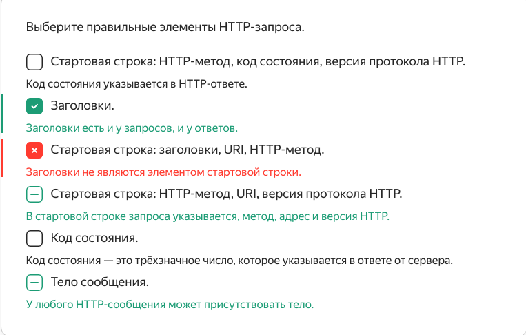
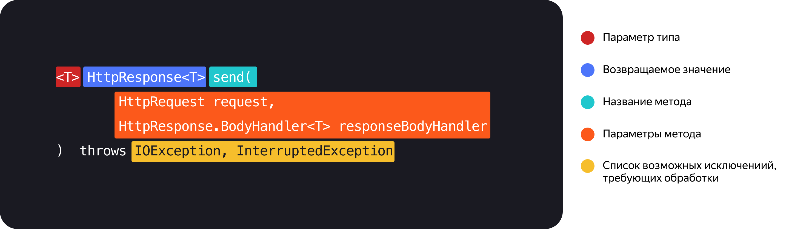
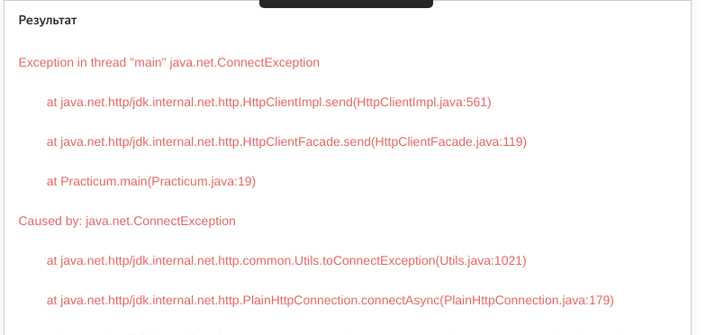
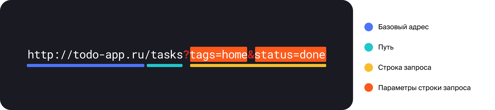
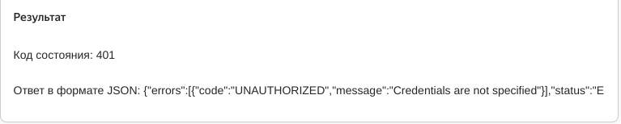

   Предыдущее занятие   |           &nbsp;           |   Следующее занятие    
:----------------------:|:--------------------------:|:----------------------:
 [Урок 27](LESSON26.MD) | [Содержание](../README.MD) | [Урок 29](LESSON28.MD) 

# Урок 28. Сетевые запросы

# Требования к сдаче работы

Задание выполняется в среде программирования Idea. Результат надо разместить в своем репозитории на GitHub.
Прислать в гугл-формы(размещенная на моем сайте) ссылку на репозиторий.

***Критерии оценивания***

* Оценка 5 - надо сделать все задания.
* Оценка 4 - надо сделать любые пять заданий.
* Оценка 3 - надо сделать любые три задания.


## Оглавление
1. [Создаём HTTP-клиент](#создаём-http-клиент)
   * [Описываем адрес ресурса с помощью URI](#описываем-адрес-ресурса-с-помощью-uri)
   * [Описываем запрос с помощью HttpRequest](#описываем-запрос-с-помощью-httprequest)
   * [Создаём HTTP-клиент с помощью HttpClient](#создаём-http-клиент-с-помощью-httpclient)
   * [Отправляем запрос и обрабатываем ответ](#отправляем-запрос-и-обрабатываем-ответ)
2. [Обрабатываем ошибки](#обрабатываем-ошибки)
   * [Обработка ошибок HTTP-запросов](#обработка-ошибок-http-запросов)
   * [Обработка HTTP-ответов с кодами состояния ошибки](#обработка-http-ответов-с-кодами-состояния-ошибки)
3. [Добавляем параметры строки запроса и HTTP-заголовки](#добавляем-параметры-строки-запроса-и-http-заголовки)
   * [Параметры строки запроса](#параметры-строки-запроса)
   * [Кодирование URL](#кодирование-url)
   * [Заголовки запроса](#заголовки-запроса)
4. [Обрабатываем JSON в ответах сервисов](#обрабатываем-json-в-ответах-сервисов)
5. [Краткий конспект](#краткий-конспект)
6. [Задание 1](#задание-1)
7. [Задание 2](#задание-2)
8. [Задание 3](#задание-3)
9. [Задание 4](#задание-4)
10. [Задание 5](#задание-5)
11. [Задание 6](#задание-6)


<details>

<summary>Создаём HTTP-клиент</summary>


## Создаём HTTP-клиент

Вы познакомились с протоколом HTTP и клиент-серверным взаимодействием и даже создали свой 
HTTP-сервер. Пришло время побывать на клиентской стороне! В этом уроке покажем, 
как написать программу — HTTP-клиент.

В качестве примера мы будем работать с сайтом Википедии. 
[Эта страница](https://ru.wikipedia.org/wiki/%D0%A1%D0%BF%D0%B8%D1%81%D0%BE%D0%BA_%D0%BA%D0%BE%D0%B4%D0%BE%D0%B2_%D1%81%D0%BE%D1%81%D1%82%D0%BE%D1%8F%D0%BD%D0%B8%D1%8F_HTTP) содержит информацию о кодах ответа в протоколе HTTP. 
Если перейти на неё, произойдёт следующее: 

1. Браузер отправит запрос на получение страницы HTTP-серверу сайта.
2. HTTP-сервер обработает запрос, сформирует ответ и вернёт браузеру.
3. Браузер обработает полученный ответ и отобразит переданную сервером страницу сайта.

Отправлять запросы и обрабатывать ответы умеют не только браузеры. 
Вы можете написать на Java свою программу, которая будет взаимодействовать с HTTP-серверами.
Чтобы это сделать, понадобятся вспомогательные классы

* Класс java.net.URI — описывает адрес нужного ресурса.
* Несколько классов из пакета `java.net.http`:
  * `HttpRequest` — описывает HTTP-запрос к серверу. Экземпляры этого класса создаёт разработчик программы HTTP-клиента.
  * `HttpResponse` — описывает HTTP-ответ сервера. Экземпляры этого класса возвращаются в ответ на отправленные программой запросы.
  * `HttpClient` — реализует коммуникацию с сервером по протоколу HTTP. Отправляет 
  запросы, описанные разработчиком в виде экземпляров `HttpRequest`, а также получает 
  ответы и преобразует их в экземпляры `HttpResponse`.

### Описываем адрес ресурса с помощью URI

Сначала необходимо создать экземпляр класса `URI`. Для этого можно воспользоваться одним 
из его конструкторов, а также удобным статическим методом `create(String)`.

```java
// создаём экземпляр URI, содержащий адрес нужного ресурса
URI uri = URI.create("https://ru.wikipedia.org/wiki/Список_кодов_состояния_HTTP");
```

Метод принимает адрес в виде строки и конструирует URI-объект. 
При этом проверяется соответствие строки формату URI.

### Описываем запрос с помощью HttpRequest

Можно приступить к описанию запроса и создать экземпляр класса HttpRequest.
Но прежде вспомните, из чего состоит HTTP-запрос.




Элементов много, и не все они обязательны. Перечислять их для передачи в метод или конструктор сложно. Поэтому можно воспользоваться билдером.

```java
// создаём экземпляр URI, содержащий адрес нужного ресурса
URI uri = URI.create("https://ru.wikipedia.org/wiki/Список_кодов_состояния_HTTP");

// получаем экземпляр класса-строителя
HttpRequest.Builder requestBuilder = HttpRequest.newBuilder();

// создаём объект, описывающий HTTP-запрос
HttpRequest request = requestBuilder
        .GET()    // указываем HTTP-метод запроса
        .uri(uri) // указываем адрес ресурса
        .version(HttpClient.Version.HTTP_1_1) // указываем версию протокола HTTP
        .header("Accept", "text/html") // указываем заголовок Accept
        .build(); // заканчиваем настройку и создаём ("строим") HTTP-запрос
```

В этом коде сначала получаем экземпляр билдера. Затем с помощью его методов 
задаём нужные элементы запроса. В конце вызываем метод `build()`, который конструирует 
итоговый объект по указанным параметрам.


### Создаём HTTP-клиент с помощью HttpClient

Для создания экземпляра `HttpClient` тоже можно использовать билдер.

```java
HttpClient client = HttpClient.newBuilder() // получаем экземпляр билдера
        .connectTimeout(Duration.ofSeconds(5)) // указываем максимальное время ожидания соединения с сервером
        .build(); // заканчиваем настройку и создаём ("строим") HTTP-клиент
```

Однако чаще всего настраивать отдельные параметры HTTP-клиента нет необходимости:
значения по умолчанию подходят для большинства ситуаций.

Статический метод `newHttpClient()` возвращает HTTP-клиент с настройками по умолчанию.

```java
// HTTP-клиент с настройками по умолчанию
HttpClient client = HttpClient.newHttpClient();
```

### Отправляем запрос и обрабатываем ответ

Чтобы отправить запрос, понадобится метод send. Рассмотрим 
его **контракт**(Контракт метода — это его сигнатура (имя, число и типы параметров) в
сочетании с возвращаемым значением.):



Разберём элементы этого контракта:
* `<T>` — параметр типа, указывающий, что `send` — обобщённый метод.
* `HttpResponse<T>` — возвращаемое значение. Описывает HTTP-ответ:
код состояния, заголовки, тело. Часто в теле ответа сервер отправляет какие-либо данные. 
Это могут быть обычный текст, HTML-код, JSON-документ и так далее. 
`HttpResponse` содержит параметр типа T. Впоследствии он заменяется на класс, который представляет в Java содержимое тела конкретного HTTP-ответа.
* `HttpRequest` — класс, описывающий запрос, который необходимо отправить.
* `HttpResponse.BodyHandler<T>` (от англ. body, «тело» и handler, «обработчик») — интерфейс,
который помогает HTTP-клиенту преобразовать тело ответа из набора байтов в Java-объект.
В Java имеются готовые реализации этого интерфейса. 
Они доступны в классе `HttpResponse.BodyHandlers`. 
Например, `HttpResponse.BodyHandlers.ofString()` возвращает обработчик,
позволяющий преобразовать тело ответа из набора байтов в строку.
* `IOException`, `InterruptedException` — список исключений, которые могут 
возникнуть в результате отправки запроса или обработки ответа.


Реализуем метод в коде. Сначала используем статический метод `ofString` 
класса `HttpResponse.BodyHandlers`. С помощью него можно получить стандартный обработчик, 
конвертирующий тело ответа в строку. Затем отправим запрос.

```java
// получаем стандартный обработчик тела ответа с конвертацией содержимого в строку
HttpResponse.BodyHandler<String> handler = HttpResponse.BodyHandlers.ofString();

// отправляем запрос и получаем ответ от сервера
HttpResponse<String> response = client.send(request, handler);
```

Метод `send` возвращает объект, описывающий HTTP-ответ.
Этот объект содержит тело ответа в виде строки и код состояния, а 
также дополнительную информацию, которую присылает сервер.

Получить тело и код ответа можно с помощью методов `body` и `statusCode`. Выведем их в консоль.

```java
// выводим код состояния и тело ответа
System.out.println("Код ответа: " + response.statusCode());
System.out.println("Тело ответа: " + response.body());
```

Если собрать все части кода, он будет выглядеть так.

```java
import java.io.IOException;
import java.net.URI;
import java.net.http.HttpClient;
import java.net.http.HttpRequest;
import java.net.http.HttpResponse;

public class Practicum {

    public static void main(String[] args) throws IOException, InterruptedException {
        // создаём экземпляр URI, содержащий адрес нужного ресурса
        URI uri = URI.create("https://ru.wikipedia.org/wiki/Список_кодов_состояния_HTTP");

        // создаём объект, описывающий HTTP-запрос
        HttpRequest request = HttpRequest.newBuilder() // получаем экземпляр билдера
                .GET()    // указываем HTTP-метод запроса
                .uri(uri) // указываем адрес ресурса
                .version(HttpClient.Version.HTTP_1_1) // указываем версию протокола
                .header("Accept", "text/html") // указываем заголовок Accept
                .build(); // заканчиваем настройку и создаём ("строим") http-запрос

        // HTTP-клиент с настройками по умолчанию
        HttpClient client = HttpClient.newHttpClient();

        // получаем стандартный обработчик тела запроса с конвертацией содержимого в строку
        HttpResponse.BodyHandler<String> handler = HttpResponse.BodyHandlers.ofString();

        // отправляем запрос и получаем ответ от сервера
        HttpResponse<String> response = client.send(request, handler);

        // выводим код состояния и тело ответа
        System.out.println("Код ответа: " + response.statusCode());
        System.out.println("Тело ответа: " + response.body());
    }
```

Просмотрите исходный код [этой страницы](https://ru.wikipedia.org/wiki/%D0%A1%D0%BF%D0%B8%D1%81%D0%BE%D0%BA_%D0%BA%D0%BE%D0%B4%D0%BE%D0%B2_%D1%81%D0%BE%D1%81%D1%82%D0%BE%D1%8F%D0%BD%D0%B8%D1%8F_HTTP) с помощью инструментов разработчика в браузере. Сравните его с тем, что вывела программа. Результаты идентичны!

А теперь попробуйте подставить в реализованный выше HTTP-клиент URL-адрес вашего любимого сайта.

Итак, мы показали, как запросить веб-страницу и получить HTTP-ответ от сервера через программу на Java, а не через браузер. Прежде чем двигаться дальше, потренируйтесь в написании собственного HTTP-клиента.


</details>

<details>

<summary>Обрабатываем ошибки</summary>

## Обрабатываем ошибки

В процессе сетевой коммуникации часто возникают нештатные ситуации: оборвалась сеть, 
сервер оказался перегружен либо не смог выполнить действие по каким-то внутренним причинам,
клиент отправил запрос, не соответствующий ожиданиям сервера, и так далее. 
В этом уроке мы расскажем, как обрабатывать подобные ошибки,
чтобы программа функционировала стабильно.

### Обработка ошибок HTTP-запросов

В блоке `throws` метода `send` перечислены исключения `IOException` и `InterruptedException`.
В прошлом уроке мы вынесли их в блок `throws` метода `main`, чтобы сосредоточиться на
логике отправки запроса и обработки ответа. Однако если в такой программе произойдёт ошибка, 
пользователю будет показан длинный и запутанный стек-трейс.
Попробуем, например, обратиться к несуществующему адресу.

```java
import java.io.IOException;
import java.net.URI;
import java.net.http.HttpClient;
import java.net.http.HttpRequest;
import java.net.http.HttpResponse;

public class Practicum {
    public static void main(String[] args) throws IOException, InterruptedException {
        // создаём запрос
        HttpRequest request = HttpRequest.newBuilder()
                .GET()
                .uri(URI.create("https://nichego-tut.net"))
                .build();

        // создаём HTTP-клиент
        HttpClient client = HttpClient.newHttpClient();

        // отправляем запрос
        HttpResponse<String> response = client.send(request, HttpResponse.BodyHandlers.ofString());
    }
}
```



Произошло исключение `ConnectException` — наследник `IOException`, указанного в блоке `throws`.

`ConnectException` и другие исключения, наследуемые от `IOException`, возникают из-за проблем с 
сетевой коммуникацией. Например, когда сервер перегружен и неожиданно 
обрывает соединение, или когда использован несуществующий адрес и клиент не может
установить соединение с сервером.
В подобных ситуациях лучше повторить запрос либо попросить пользователя проверить 
корректность URL-адреса.

Второй тип исключений `InterruptedException` может возникнуть при долгом 
ожидании ответа от сервера, когда запрос обрывается на стороне клиента. 
Конкретные способы обработки таких ошибок зависят от целей использования HTTP-клиента. 
Важно дать пользователю информацию о том, какие шаги предпринять в случае возникновения проблемы.

### Обработка HTTP-ответов с кодами состояния ошибки

Напомним, что код ответа типа 2хх свидетельствует об успешной обработке запроса. 
Если сервер возвращает код в формате 4хх или 5хх, произошла ошибка. 
Такой ответ необходимо обработать.

Воспользуемся сервисом `httpbin.org`. Он возвращает ответы с указанным в URL кодом состояния.
Например, если отправить запрос по адресу `http://httpbin.org/status/500`, сервер вернёт ответ 
с кодом состояния `500`. Таким образом можно эмулировать ответы от сервера 
с нужным кодом состояния.

Запустите код ниже. Затем поэкспериментируйте с разными кодами состояния:
попробуйте поменять значение переменной `requestedStatus`.


```java
import java.io.IOException;
import java.net.URI;
import java.net.http.HttpClient;
import java.net.http.HttpRequest;
import java.net.http.HttpResponse;

class Practicum {
    public static void main(String[] args) {
        /* Попробуйте заменить код статуса на какой-либо другой
           и посмотреть на реакцию вашего HTTP-клиента. */
        int requestedStatus = 201;
        // указываем код состояния как часть URL-адреса
        URI uri = URI.create("http://httpbin.org/status/" + requestedStatus);
        HttpRequest request = HttpRequest.newBuilder().GET().uri(uri).build();

        HttpClient client = HttpClient.newHttpClient();

        try {
            HttpResponse<String> response = client.send(request, HttpResponse.BodyHandlers.ofString());

            int status = response.statusCode();
            // обрабатываем коды успешного состояния
            if(status >= 200 && status <= 299) {
                System.out.println("Сервер успешно обработал запрос. Код состояния: " + status);
                return;
            }
            // обрабатываем коды состояния, сообщающие об ошибке на стороне клиента
            if(status >= 400 && status <= 499) {
                System.out.println("Сервер сообщил о проблеме с запросом. Код состояния: " + status);
                return;
            }
            // обрабатываем коды состояния, сообщающие об ошибке на стороне сервера
            if(status >= 500 && status <= 599) {
                System.out.println("Сервер сообщил о внутренней проблеме и невозможности обработать запрос." +
                        " Код состояния: " + status);
            } else { // обрабатываем остальные коды состояния
                System.out.println("Что-то пошло не так. Сервер вернул код состояния: " + status);
            }
        } catch (IOException | InterruptedException e) { // обрабатываем ошибки отправки запроса
            System.out.println("Во время выполнения запроса ресурса по url-адресу: '" + uri + "' возникла ошибка.\n" +
                    "Проверьте, пожалуйста, адрес и повторите попытку.");
        }
    }
}
```

</details>

<details>

<summary>Добавляем параметры строки запроса и HTTP-заголовки</summary>

## Добавляем параметры строки запроса и HTTP-заголовки

В этом уроке расскажем о том, как добавить в код клиента параметры строки запроса и HTTP-заголовки.

### Параметры строки запроса

Для передачи данных на сервер используется не только тело запроса.
Есть ещё один механизм — **строка запроса** (англ. _query string_).

> **строка запроса** - В спецификации URL этот компонент называется Query (англ. «запрос»). Вне спецификации чаще всего употребляется термин «строка запроса». 

Это дополнительный компонент URL-адреса, позволяющий указать список параметров и их значений.
Параметры помогают серверу понять, какие данные нужны клиенту.

Строка запроса находится в конце URL и отделяется от пути знаком вопроса (`?`). 
После него можно указать пары в формате `параметр=значение`. 
Они отделяются друг от друга символом `&`. Например:



В нашем примере в URL-адресе указаны два параметра строки запроса:
* параметр `tags` со значением `home`;
* параметр `status` со значением `done`.

По этим параметрам сервер веб-приложения `todo-app`, обрабатывающий запрос к пути `/tasks`, 
понимает следующее: клиент хочет получить список выполненных задач (`status=done`), 
у которых установлен тег `home` (`tags=home`).


### Кодирование URL

Согласно спецификации URL, адрес может содержать только латинские буквы,
цифры и отдельные знаки пунктуации. Все недопустимые символы в значениях параметров 
должны быть преобразованы и записаны в специальном формате. 
Для этого используется **процентное кодирование** (англ. _percent-encoding_) 
или **URL-кодирование** (англ. _URL-encoding_).

В процессе URL-кодирования все небезопасные символы заменяются на знак процента `%`, 
за которым следуют **две шестнадцатеричные цифры**. Например, 
каждый пробел заменяется на последовательность `%20`, а 
открывающая и закрывающая круглые скобки (`(`,`)`) — на `%28` и `%29` соответственно.


Чтобы указать параметры запроса в коде, не потребуются новые классы или методы.
Достаточно добавить строку запроса к строке URL-адреса.

В примере ниже мы воспользуемся сервисом `agify.io`.
Он предоставляет простой API для предсказания возраста реального человека 
или персонажа по переданному имени. Параметр запроса будет один — `name`.


```java
import java.io.IOException;
import java.net.URI;
import java.net.http.HttpClient;
import java.net.http.HttpRequest;
import java.net.http.HttpResponse;

public class Practicum {

    public static void main(String[] args) {
        HttpClient client = HttpClient.newHttpClient();

        // делаем запрос с параметром name
        URI url = URI.create("https://api.agify.io/?name=Pixel");
        HttpRequest request = HttpRequest.newBuilder().uri(url).GET().build();

        try {
            HttpResponse<String> response = client.send(request, HttpResponse.BodyHandlers.ofString());

            System.out.println("Код состояния: " + response.statusCode());
            // в ответе будет содержаться предсказанный сервисом возраст
            System.out.println("Ответ: " + response.body());
        } catch (IOException | InterruptedException e) { // обрабатываем ошибки отправки запроса
            System.out.println("Во время выполнения запроса ресурса по url-адресу: '" + url + "', возникла ошибка.\n" +
                    "Проверьте, пожалуйста, адрес и повторите попытку.");
        }
    }
}
```
### Заголовки запроса

Кроме параметров строки запроса, в код клиента также можно добавить HTTP-заголовки. 

Добавим заголовки запроса в код. Для этого потребуется помощь билдера. 
У билдера есть параметр `header(String name, String value)`, 
принимающий название заголовка и его значение. Укажем в коде клиента заголовок `Accept`.
Он сообщает серверу формат ответа, который клиент готов получить. 
Например, чтобы получить ответ в формате `JSON`,
в качестве значения заголовка `Accept` нужно указать `application/json`.

```java
import java.io.IOException;
import java.net.URI;
import java.net.http.HttpClient;
import java.net.http.HttpRequest;
import java.net.http.HttpResponse;

public class Practicum {

    public static void main(String[] args) {
        HttpClient client = HttpClient.newHttpClient();

        // получаем ответ в формате JSON с помощью заголовка
        URI url = URI.create("https://api.partner.market.yandex.ru/v2/regions");
        // сообщаем серверу, что готовы принять ответ в формате JSON
        HttpRequest request = HttpRequest.newBuilder()
                .uri(url)
                .header("Accept", "application/json")
                .GET()
                .build();

        try {
            HttpResponse<String> response = client.send(request, HttpResponse.BodyHandlers.ofString());
            System.out.println("Код состояния: " + response.statusCode());
            System.out.println("Ответ в формате JSON: " + response.body());
        } catch (IOException | InterruptedException e) { // обрабатываем ошибки отправки запроса
            System.out.println("Во время выполнения запроса ресурса по URL-адресу: '" + url + "', возникла ошибка.\n" +
                    "Проверьте, пожалуйста, адрес и повторите попытку.");
        }
    }
}
```




Сервер может возвращать ответ и в других форматах. Например, 
в ещё одном распространённом формате — XML. Он похож на HTML, 
но используется для передачи данных, а не для их отображения.
Чтобы сервер понял, что клиент ожидает ответ в формате XML,
нужно установить соответствующее значение заголовка `Accept`:

```java
HttpRequest request = HttpRequest.newBuilder()
                .uri(url)
                .header("Accept", "application/xml")
                .GET()
                .build();
```

В зависимости от переданного значения заголовка `Accept` изменяется тип содержимого, 
возвращаемого сервером.

</details>

<details>

<summary>Обрабатываем JSON в ответах сервисов</summary>

## Обрабатываем JSON в ответах сервисов

В этом уроке мы покажем, как работать с API, возвращающим данные в формате JSON. 
Для этого потребуется библиотека GSON. 
Сперва следует импортировать необходимые классы. Они хранятся в пакете `com.google.gson`.

```java
import com.google.gson.JsonArray; // описывает JSON-массив
import com.google.gson.JsonElement; // описывает любой тип данных JSON
import com.google.gson.JsonObject; // описывает JSON-объект
import com.google.gson.JsonParser; // разбирает JSON-документ на элементы
```

Чтобы получить доступ к элементам JSON-документа, понадобится метод `parseString(String json)` 
класса `JsonParser`. В качестве параметра в метод передаётся текст в формате JSON 
— в нашем случае это будет тело ответа сервера. 
`JsonParser` разбирает текст на составные элементы и возвращает объект класса `JsonElement`. 

```java
JsonElement jsonElement = JsonParser.parseString(response.body()); 
```

`JsonElement` может представлять любой из типов данных JSON. Мы говорили, 
что примитивные типы не используются в этом формате сами по себе.
Они входят в состав объекта или массива. API возвращает одну из этих структур,
содержащую искомые значения.

Чтобы убедиться, что полученный `JsonElement` — объект, нужен метод `isObject`. 
Чтобы преобразовать `JsonElement` в объект или массив, 
понадобятся методы `getAsJsonObject` и `getAsJsonArray`.

```java
if(jsonElement.isJsonObject()) { // проверяем, является ли элемент JSON-объектом
    // преобразуем в JSON-объект
    JsonObject jsonObject = jsonElement.getAsJsonObject();
} else {
    // преобразуем в JSON-массив
    JsonArray jsonArray = jsonElement.getAsJsonArray();
}
```

Для работы с полями JSON-объекта используется метод `get(String)`.
Он принимает название поля и возвращает его значение в виде JsonElement. У JsonElement 
есть набор методов, позволяющих приводить его к одному из типов Java. Вот некоторые из них:
* `getAsString` — преобразует JSON-элемент в строку;
* `getAsLong` — преобразует JSON-элемент в число;
* `getAsBoolean` — преобразует JSON-элемент в логическое значение.

Теперь можно поработать с конкретным API. Сервис `https://ipwhois.io/` позволяет 
узнать географическое положение по IP-адресу.

Из [документации](https://ipwhois.io/ru/documentation) следует, что для этого нужно 
отправить GET-запрос по адресу `http://ipwhois.app/json/{IP}`, где вместо `{IP}` 
следует подставить интересующий IP-адрес. Характеристики ответа настраиваются 
с помощью параметров строки запроса. Например, параметр lang поможет настроить 
локализацию некоторых полей. В документации сервиса также указаны поля и значения,
которые возвращает API.

Отправим запрос по адресу `https://ipwhois.app/json/46.226.227.20?lang=ru` и выведем значения полей:
* `country` — название страны;
* `city` — город;
* `latitude` — широта.

Вот что получится:

```java
import java.io.IOException;
import java.net.URI;
import java.net.http.HttpClient;
import java.net.http.HttpRequest;
import java.net.http.HttpResponse;

import com.google.gson.JsonElement;
import com.google.gson.JsonObject;
import com.google.gson.JsonParser;

class Practicum {

    public static void main(String[] args) {
        HttpClient client = HttpClient.newHttpClient();

        URI url = URI.create("https://ipwhois.app/json/46.226.227.20?lang=ru");
        HttpRequest request = HttpRequest.newBuilder()
                .uri(url)
                .GET()
                .build();

        try {
            HttpResponse<String> response = client.send(request, HttpResponse.BodyHandlers.ofString());
            // проверяем, успешно ли обработан запрос
            if (response.statusCode() == 200) {
                // передаем парсеру тело ответа в виде строки, содержащей данные в формате JSON
                JsonElement jsonElement = JsonParser.parseString(response.body());
                if(!jsonElement.isJsonObject()) { // проверяем, точно ли мы получили JSON-объект
                    System.out.println("Ответ от сервера не соответствует ожидаемому.");
                    return;
                }
                // преобразуем результат разбора текста в JSON-объект
                JsonObject jsonObject = jsonElement.getAsJsonObject();

                // получаем название страны
                String country = jsonObject.get("country").getAsString();
                // получаем название города
                String city = jsonObject.get("city").getAsString();
                // получаем значение широты
                double latitude = jsonObject.get("latitude").getAsDouble();

                System.out.println("Страна: " + country);
                System.out.println("Город: " + city);
                System.out.println("Широта: " + latitude);
            } else {
                System.out.println("Что-то пошло не так. Сервер вернул код состояния: " + response.statusCode());
            }
        } catch (IOException | InterruptedException e) { // обрабатываем ошибки отправки запроса
            System.out.println("Во время выполнения запроса возникла ошибка.\n" +
                    "Проверьте, пожалуйста, адрес и повторите попытку.");
        }
    }
}
```


Программа выводит значения нужных полей. С такими данными проще работать. 

</details>

<details>

<summary>Краткий коспект</summary>

## Краткий конспект

Напомним, что вы узнали:
* Отправлять HTTP-запросы может не только браузер — такой запрос можно выполнить прямо из Java-приложения.
* Для выполнения запросов к HTTP-серверу используют класс `HttpClient`. 
Запрос описывают с помощью объекта класса `HttpRequest`. Ответ содержится в объекте `HttpResponse`.
* Чтобы создать новый экземпляр `HttpClient` с настройками по умолчанию, 
можно использовать метод `HttpClient.newHttpClient()`.
* Адрес нужного ресурса описывают с помощью объекта класса `java.net.URI`. 
Для его создания можно использовать один из конструкторов или статический метод create. 
На вход методу передаётся адрес в виде строки.
* Чтобы создать новый экземпляр `HttpRequest`, нужен билдер — класс `HttpRequest.Builder`. 
В него передают метод запроса, его URI, версию протокола HTTP и, если нужно, 
заголовки запроса. Затем запрос «собирают» с помощью вызова метода `build`.
* Чтобы добавить запросу заголовок, у билдера следует вызвать 
метод `header(String name, String value)`.
* Заголовок `Accept` определяет формат данных, которые клиент ожидает получить.
Например, чтобы получить ответ в формате JSON, в качестве значения заголовка `Accept` 
нужно указать `application/json`.
* Для отправки готового запроса у `HttpClient` вызывают метод `send`. 
Он возвращает объект `HttpResponse`, содержащий ответ сервера.
Получить тело и код ответа из `HttpResponse` можно с помощью методов `body` и `statusCode`.
* В случае возникновения проблем с HTTP-запросом метод `send` может выбросить одно 
из двух исключений: `ConnectException` — если возникли проблемы с сетевой коммуникацией, 
`InterruptedException` — если сервер слишком долго не отвечает.
* Отдельно нужно обработать ситуацию, в которой сервер вернул статус, отличающийся от 
2хх, — это сигнализирует, что при обработке запроса возникла ошибка.
* Для передачи данных на сервер используют не только тело запроса, но и **строку запроса**. 
Этот дополнительный компонент URL-адреса позволяет указать список параметров 
и их значений. Строка запроса находится в конце URL и отделяется от пути знаком вопроса (`?`).
После него указываются пары в формате `параметр=значение` и отделяются друг 
от друга символом `&`. Например: `http://todo-app.ru/tasks?tags=home&status=done`.
* По спецификации URL может содержать только латинские буквы, 
цифры и отдельные знаки пунктуации. Все недопустимые символы должны быть преобразованы 
и записаны в специальном формате. Для этого используется **процентное кодирование** —
небезопасные символы заменяются на знак процента (`%`), 
за которым следуют две шестнадцатеричные цифры.
* С помощью метода библиотеки `Gson JsonParser.parseString` из JSON-строки можно получить 
объект `JsonElement`, соответствующий структуре JSON.
* `JsonElement` — это произвольный элемент JSON-объекта. 
Он может соответствовать значению одного из типов данных, 
которые используются в JSON: объекту, массиву, примитиву (строке, числу,
логическому выражению) либо значению `null`.

### наиболее часто используемые методы класса JsonElement

* `isJsonObject` — проверяет, что `JsonElement` является объектом.
* `isJsonArray` — проверяет, что `JsonElement` является массивом.
* `isJsonPrimitive` — проверяет, что `JsonElement` хранит примитивное значение.
* `isJsonNull` — проверяет, что `JsonElement` хранит null.
* `getAsJsonObject` — конвертирует `JsonElement`, являющийся объектом, в экземпляр класса `JsonObject`. У полученного экземпляра `JsonObject` можно вызвать метод `get(String)`, который позволяет получить значение отдельного поля по его имени. 
Метод `get` снова возвращает объект `JsonElement`.
* `getAsJsonArray` — конвертирует `JsonElement` в экземпляр класса `JsonArray`.
* `getAsString`, `getAsLong`, `getAsBoolean` — извлекают из JsonElement, хранящего примитивное значение, значение соответствующего типа данных в Java.

</details>


<details>

<summary>Задание 1</summary>

## Задание 1

Откройте в браузере страницу https://ya.ru/white. С помощью инструментов разработчика посмотрите её код. 
Затем напишите HTTP-клиент и сделайте аналогичный запрос. Сравните результаты.

```java


import java.io.IOException;
import java.net.URI;
import java.net.http.HttpClient;
import java.net.http.HttpRequest;
import java.net.http.HttpResponse;

class Practicum {

    public static void main(String[] args) throws IOException, InterruptedException {
        // укажите URL-адрес ресурса
        URI uri = ... ;

        // создайте объект, описывающий HTTP-запрос
        HttpRequest request = ... ;

        // создайте HTTP-клиент с настройками по умолчанию
        HttpClient client = ... ;

        // получите стандартный обработчик тела запроса 
        // с конвертацией содержимого в строку
        HttpResponse.BodyHandler<String> handler = ... ;

        // отправьте запрос
        HttpResponse<String> response = ... ;

        // выведите код состояния и тело ответа
    }
}
```

### Подсказки

* Создайте HTTP-клиент с помощью метода `HttpClient.newHttpClient()`.
* Чтобы задать адрес страницы, используйте метод `URI.create("https://ya.ru/white")`.
* Для создания запроса воспользуйтесь конструкцией `HttpRequest.newBuilder().uri(uri).GET().build()`.
* Чтобы отправить запрос, используйте метод `send(HttpRequest request, BodyHandler responseBodyHandler)`.
* Для получения HTTP-кода воспользуйтесь методом `statusCode()`.
</details>

<details>

<summary>Задание 2</summary>

## Задание 2

Добавьте в код `try...catch` блок, обрабатывающий исключения:
* `IOException` и `InterruptedException`. Пользователю должно выводиться следующее сообщение: 
`Во время выполнения запроса возникла ошибка. Проверьте, пожалуйста, URL-адрес и повторите 
попытку.`
* `IllegalArgumentException`. Это исключение может возникнуть, если пользователь
ввёл не соответствующий спецификации URL-адрес. Добавьте сообщение для пользователя: 
`Введённый вами адрес не соответствует формату URL. Попробуйте, пожалуйста, снова`.

```java

import java.io.IOException;
import java.net.URI;
import java.net.http.HttpClient;
import java.net.http.HttpRequest;
import java.net.http.HttpResponse;

public class Practicum {
    public static void main(String[] args) {
        String url = "https://www.ya.ru/";

        // добавьте отлов и обработку исключений вокруг кода ниже
            URI uri = URI.create(url);

            // создаём запрос
            HttpRequest request = HttpRequest.newBuilder().GET().uri(uri).build();

            // создаём HTTP-клиент
            HttpClient client = HttpClient.newHttpClient();

            // отправляем запрос
            HttpResponse<String> response = client.send(request, HttpResponse.BodyHandlers.ofString());

            // выводим код состояния и тело ответа
            System.out.println("Код состояния: " + response.statusCode());
            System.out.println("Тело ответа: " + response.body());
        
    }
}


```

### Подсказки

* Для исключений `IOException` и `InterruptedException` выводится одинаковое сообщение, 
поэтому их можно объединить в один блок `catch`: `catch (IOException | InterruptedException)`.

</details>


<details>

<summary>Задание 3</summary>

## Задание 3

Доработайте программу и добавьте обработку кодов состояния.
Вот список кодов и сообщений пользователю:
* `400` — `В запросе содержится ошибка. Проверьте параметры и повторите запрос.`;
* `404` — `По указанному адресу нет ресурса. Проверьте URL-адрес ресурса и повторите запрос.`;
* `500` — `На стороне сервера произошла непредвиденная ошибка.`;
* `503` — `Сервер временно недоступен. Попробуйте повторить запрос позже.`.

Во всех остальных случаях программа должна вывести код и тело ответа.


```java


import java.io.IOException;
import java.net.URI;
import java.net.http.HttpClient;
import java.net.http.HttpRequest;
import java.net.http.HttpResponse;

public class Practicum {
    public static void main(String[] args) {
        int requestedStatus = 200;
        // используем код состояния как часть URL-адреса
        URI uri = URI.create("http://httpbin.org/status/" + requestedStatus);
        HttpRequest request = HttpRequest.newBuilder().GET().uri(uri).build();

        HttpClient client = HttpClient.newHttpClient();

        try {
            HttpResponse<String> response = client.send(request, HttpResponse.BodyHandlers.ofString());

            // обработайте указанные в задании коды состояния
            // используйте конструкцию switch...case
            
        } catch (IOException | InterruptedException e) { // обрабатываем ошибки отправки запроса
            System.out.println("Во время выполнения запроса ресурса по url-адресу: '" + uri + "' возникла ошибка.\n" +
                    "Проверьте, пожалуйста, адрес и повторите попытку.");
        }
    }
}

```

### Подсказки

* Статус ошибки можно определить с помощью метода `response.statusCode`.
* Воспользуйтесь конструкцией `switch...case`, чтобы обработать коды состояния ошибки.

</details>

<details>

<summary>Задание 4</summary>

## Задание 4

Напишите HTTP-клиент, который будет работать с API с адресом `functions.yandexcloud.net` и получать от него курсы валют.

Клиент должен отправлять GET-запрос по адресу `https://functions.yandexcloud.net/d4ed1i6t3f80hf0p7mer`.
Необходимо добавить два параметра: 
* `base` — параметр, указывающий базовую валюту для конвертации;
* `symbols` — параметр, в котором через запятую перечислены все необходимые валюты для конвертации.

Параметр `base` должен быть равен `RUB`, а параметр `symbols` — `USD,EUR`. Ответ от сервера нужен в формате JSON.

```java
import java.io.IOException;
import java.net.URI;
import java.net.http.HttpClient;
import java.net.http.HttpRequest;
import java.net.http.HttpResponse;

public class Practicum {

    public static void main(String[] args) {
        HttpClient client = HttpClient.newHttpClient();

        // укажите URL запроса, включая его параметры
        URI url = ...;

        // создайте объект, описывающий запрос с необходимой информацией
        HttpRequest request = ...;

        try {
            HttpResponse<String> response = client.send(request, HttpResponse.BodyHandlers.ofString());
            System.out.println("Код статуса: " + response.statusCode());
            System.out.println("Ответ: " + response.body());
        } catch (IOException | InterruptedException e) { // обработка ошибки отправки запроса
            System.out.println("Во время выполнения запроса ресурса по URL-адресу: '" + url + "' возникла ошибка.\n" +
                    "Проверьте, пожалуйста, адрес и повторите попытку.");
        }
    }
}
```


### Подсказки

* Чтобы задать адрес, используйте метод `URI.create(String str)`.
* Добавить заголовок к запросу можно с помощью метода `header(String name, String value)`.
* Для получения ответа от сервера в формате JSON укажите 
в запросе заголовок `Accept` со значением `application/json`.


</details>

<details>

<summary>Задание 5</summary>

## Задание 5

Доработайте программу. Выведите информацию об IP-адресе `213.186.33.69`. 
Дополнительно выведите следующие поля:
* `longitude` — долгота;
* `country_neighbours` — соседние страны;
* `country_phone` — телефонный код страны.

В качестве языка локализации укажите французский (`fr`).

```java

import java.io.IOException;
import java.net.URI;
import java.net.http.HttpClient;
import java.net.http.HttpRequest;
import java.net.http.HttpResponse;

import com.google.gson.JsonElement;
import com.google.gson.JsonObject;
import com.google.gson.JsonParser;

class Practicum {

    public static void main(String[] args) {
        HttpClient client = HttpClient.newHttpClient();

        // сформируйте правильный URL-адрес
        U URI url = URI.create("https://ipwhois.app/json/213.186.33.69?lang=fr");
        HttpRequest request = HttpRequest.newBuilder()
                .uri(url)
                .GET()
                .build();

        try {
            HttpResponse<String> response = client.send(request, HttpResponse.BodyHandlers.ofString());
            // проверяем, успешно ли обработан запрос
            if (response.statusCode() == 200) {
                // передаем парсеру тело ответа в виде строки, содержащей данные в формате JSON
                JsonElement jsonElement = JsonParser.parseString(response.body());
                if(!jsonElement.isJsonObject()) { // проверяем, точно ли мы получили JSON-объект
                    System.out.println("Ответ от сервера не соответствует ожидаемому.");
                    return;
                }
                // преобразуем результат разбора текста в JSON-объект
                JsonObject jsonObject = jsonElement.getAsJsonObject();

                // получаем название страны
                String country = jsonObject.get("country").getAsString();
                // получаем название города
                String city = jsonObject.get("city").getAsString();
                // получаем значение широты
                double latitude = jsonObject.get("latitude").getAsDouble();

                // получите значения полей из задания
                double longitude = ...
                String countryNeighbours = ...
                int countryPhone = ...

                System.out.println("Страна: " + country);
                System.out.println("Город: " + city);
                System.out.println("Широта: " + latitude);
                System.out.println("Долгота: " + longitude);
                System.out.println("Соседние страны: " + countryNeighbours);
                System.out.println("Телефонный код страны: " + countryPhone);
            } else {
                System.out.println("Что-то пошло не так. Сервер вернул код состояния: " + response.statusCode());
            }
        } catch (IOException | InterruptedException e) { // обрабатываем ошибки отправки запроса
            System.out.println("Во время выполнения запроса возникла ошибка.\n" +
                    "Проверьте, пожалуйста, адрес и повторите попытку.");
        }
    }
}

```

### Подсказки

* Для получения значения поля воспользуйтесь методом `get(String memberName)`.
* Для преобразования `JsonElement` в строковое значение используйте метод `getAsString()`, 
а в числовое — `getAsDouble()` или `getAsInt()`.

</details>


<details>

<summary>Задание 6</summary>

## Задание 6

Доработайте код клиента для получения курса валют из прошлого урока.
Извлеките из ответа сервера текущие курсы рубля к доллару и к евро. 
Запишите их в переменные `rateUSD` и `rateEUR` и выведите на экран. 
Сервер возвращает JSON-данные со следующей структурой: 
```json
{"rates": {"<название_валюты1>": <курс_валюты1>, "название_валюты2": <курс_валюты2>}}
```


```java

import java.io.IOException;
import java.net.URI;
import java.net.http.HttpClient;
import java.net.http.HttpRequest;
import java.net.http.HttpResponse;

import com.google.gson.JsonElement;
import com.google.gson.JsonObject;
import com.google.gson.JsonParser;

public class Practicum {
    public static void main(String[] args) {
        HttpClient client = HttpClient.newHttpClient();

        URI url = URI.create("https://functions.yandexcloud.net/d4ed1i6t3f80hf0p7mer?base=RUB&symbols=USD,EUR");
        HttpRequest request = HttpRequest.newBuilder()
                .uri(url)
                .GET()
                .build();

        try {
            HttpResponse<String> response = client.send(request, HttpResponse.BodyHandlers.ofString());
            // проверяем, успешно ли обработан запрос
            if (response.statusCode() == 200) {
                JsonElement jsonElement = JsonParser.parseString(response.body());
                if(!jsonElement.isJsonObject()) { // проверяем, точно ли мы получили JSON-объект
                    System.out.println("Ответ от сервера не соответствует ожидаемому.");
                    return;
                }
                // получите курс доллара и евро и запишите в переменные rateUSD и rateEUR
                . . .

                System.out.println("Стоимость рубля в долларах: " + rateUSD + " USD");
                System.out.println("Стоимость рубля в евро: " + rateEUR + " EUR");
            } else {
                System.out.println("Что-то пошло не так. Сервер вернул код состояния: " + response.statusCode());
            }
        } catch (IOException | InterruptedException e) { // обрабатываем ошибки отправки запроса
            System.out.println("Во время выполнения запроса возникла ошибка.\n" +
                    "Проверьте, пожалуйста, адрес и повторите попытку.");
        }
    }
}


```

### Подсказки

* Чтобы разобрать строку в формате JSON на элементы, необходимо
* воспользоваться методом `parseString(String json)`.
* Валюты хранятся внутри JSON-объекта `rates`.
Названия полей курса доллара и евро внутри JSON — `USD` и `EUR` соответственно.

</details>


   Предыдущее занятие   |           &nbsp;           |    Следующее занятие    
:----------------------:|:--------------------------:|:-----------------------:
 [Урок 26](LESSON26.MD) | [Содержание](../README.MD) | [Урок 28](LESSON28.MD)
