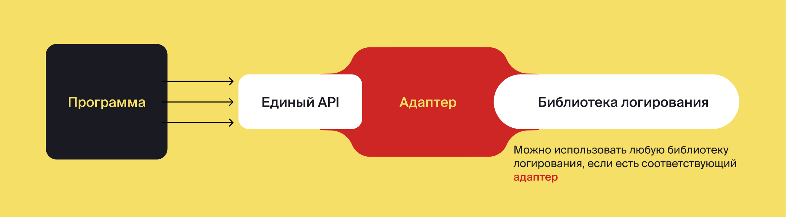
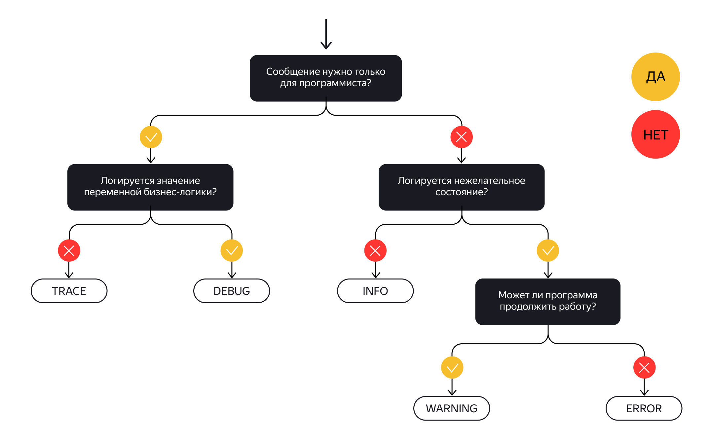
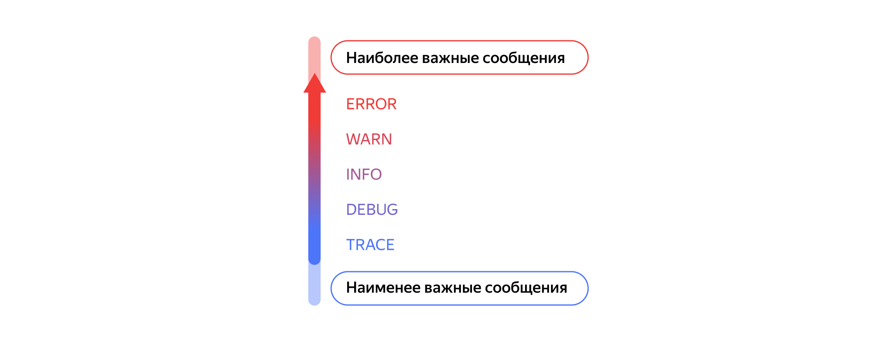

   Предыдущее занятие   |           &nbsp;           |   Следующее занятие    
:----------------------:|:--------------------------:|:----------------------:
 [Урок 28](LESSON28.MD) | [Содержание](../README.MD) | [Урок 30](LESSON30.MD) 

# Урок 29. Логирование SLF4J

## 📋 Требования к сдаче работы

**Задание выполняется в среде программирования IntelliJ IDEA.** Результат размещается в вашем репозитории на GitHub. Прислать в Google-формы (размещенная на сайте преподавателя) ссылку на репозиторий.

### 🎯 Критерии оценивания практического задания

| Критерий | Максимальный балл | Описание |
|----------|-------------------|----------|
| **Полная замена System.out** | 2 балла | Все `System.out.println()` заменены на методы логгера |
| **Правильное использование уровней** | 2 балла | Сообщения распределены по уровням TRACE/DEBUG/INFO/WARN/ERROR |
| **Оптимизация производительности** | 2 балла | Использованы шаблоны `{}`, проверки `isXxxEnabled()` |
| **Корректная настройка зависимостей** | 1 балл | В `pom.xml` добавлены SLF4J и Logback |
| **Работоспособность программы** | 1 балл | Программа запускается и работает корректно |
| **Читаемость кода** | 1 балл | Код хорошо отформатирован, логи понятны |
| **Настройка уровней логирования** | 1 балл | Реализована возможность изменения уровня логирования |

**Итого:** 10 баллов

**Шкала оценивания:**
- **5 (отлично):** 9-10 баллов
- **4 (хорошо):** 7-8 баллов
- **3 (удовлетворительно):** 5-6 баллов
- **2 (неудовлетворительно):** 0-4 баллов

---

## 📖 Оглавление

1. [🔍 Введение в логирование](#-введение-в-логирование)
2. [📘 Что такое логирование и для чего оно нужно](#-что-такое-логирование-и-для-чего-оно-нужно)
3. [🏗️ Анатомия фреймворков логирования](#-анатомия-фреймворков-логирования)
4. [🎚️ Уровни важности в логировании](#-уровни-важности-в-логировании)
5. [🎯 Практическое задание: Логируем сообщения правильно](#-практическое-задание-логируем-сообщения-правильно)
6. [📚 Что вы узнали](#-что-вы-узнали)


---

<details>

<summary>🔍 Введение в логирование</summary>

## 🔍 Введение в логирование

В этой теме вы узнаете больше о логировании. От привычного **System.out** вы перейдёте к фреймворкам логирования. 
Узнаете, почему они необходимы в современной разработке и в чём их преимущества.
Принципы правильного и эффективного логирования вы разберёте, используя библиотеку **SLF4J**.

Вы подробно рассмотрите:
* фреймворки логирования;
* уровни важности логирования;
* настройку логеров в конкретных классах и в проектах в целом.
* 
Полученные знания вы примените на практике. В конце темы вам предстоит поработать над программой, 
которая раскрывает секреты майнинга и высоконагруженных приложений.

</details>


<details>

<summary>📘 Что такое логирование и для чего оно нужно</summary>

## 📘 Что такое логирование и для чего оно нужно

### 🤔 Что такое логирование?

Каждый разработчик сталкивается с ситуациями, когда:
- Приложение отказывается обрабатывать информацию
- Выдаёт некорректный результат
- Ведёт себя неожиданным образом

Обычно мы узнаём об ошибках **только после того**, как они произошли. И тогда начинается детективная работа: нужно понять, что пошло не так и почему.

#### 🎭 Живые примеры из практики

**Сценарий 1:** Пользователь не смог купить билет на концерт
- 🐛 **Проблема:** не заполнил обязательное поле, которое не было отмечено как обязательное
- ✅ **Решение:** добавить дополнительную проверку в новой версии

**Сценарий 2:** Платеж не проходит
- 🐛 **Проблема:** сторонний сервис обработки платежей временно недоступен
- ✅ **Решение:** связаться со службой поддержки сервиса

**Решение:** Чтобы тратить меньше времени на поиск ошибок, программисты ведут **журнал ключевых событий** программы.

### 📚 Что такое лог?

**Лог** (от англ. log — "бревно", "журнал регистрации") — это набор записей о происходящих в программе событиях:
- 🚨 Ошибках
- 👤 Действиях пользователя
- ⚙️ Системных событиях
- 🕒 Временных метках

**Пример записи:**
```
21 декабря 2021 года в 21:48:10.004 — Приложение запущено
21 декабря 2021 года в 21:55:32.132 — Приложение закрыто
```

#### 🏴‍☠️ Историческая справка: почему "log"?

Интересный факт! 📖 Сотни лет назад моряки измеряли скорость корабля с помощью **chip log** ("щепа от бревна") — треугольного куска дерева с верёвкой и узлами. Результаты записывали в **log book** (бортовой журнал).

Отсюда и происходят слова:
- 📝 **Blog** = web log (интернет-дневник)
- 🎥 **Vlog** = video blog (видео-дневник)

### 🔧 Что такое логирование?

**Логирование** — процесс добавления записей в журнал событий.

**Ключевые характеристики:**
- ⏰ У каждого события есть точная метка даты и времени
- 📊 Записи упорядочены хронологически
- 💾 Хранятся в файлах, на консоли или в централизованном хранилище

### 🎯 Зачем нужно логирование? 5 главных причин

#### 1. 🔍 **Диагностика ошибок**
Что можно узнать:
- Тип ошибки
- Место возникновения
- События, которые к ней привели
- Контекст выполнения

#### 2. 📊 **Анализ производительности**
Что логируется:
- Время обработки HTTP-запросов
- Длительность выполнения SQL-запросов
- Время выполнения операций

**Результат:** понимание, какие действия требуют оптимизации.

#### 3. 🛡️ **Безопасность и мониторинг**
Что помогает обнаружить:
- Подбор паролей к аккаунтам
- Необычные паттерны поведения
- Попытки взлома
- Злоумышленные действия

#### 4. 🖥️ **Информация об окружении**
Что можно узнать из логов:
- Версию Java
- Имя компьютера пользователя
- Настройки параметров приложения
- Номер сетевого порта
- Конфигурацию системы

#### 5. ⚙️ **Мониторинг инфраструктуры**
Что можно обнаружить:
- Поломку сетевого оборудования
- Нехватку оперативной памяти
- Проблемы с дисковым пространством
- Сбои внешних сервисов

### 🚀 Логирование в Java



#### 📜 Эволюция подхода

**Было:** Хаос и несовместимость 🎪
- Каждый фреймворк логировал по-своему
- Логи разбрасывались по разным файлам
- Настройка занимала много времени

**Стало:** Единый стандарт 🏗️
- Появился единый API для логирования
- Адаптеры для старых фреймворков
- Упрощение настройки и использования

#### 🛠️ Современный стек: SLF4J + Logback

##### **SLF4J** (Simple Logging Facade for Java)
- 🎭 **Фасад** — предоставляет единый интерфейс
- 🔌 **Абстракция** — скрывает конкретную реализацию
- ♻️ **Гибкость** — позволяет легко менять фреймворки

##### **Logback**
- ⚡ **Производительность** — оптимизирован для больших объёмов данных
- ⚙️ **Гибкость настройки** — автоматическое удаление, архивация, фильтрация
- 🤝 **Нативная совместимость** — разработан специально для SLF4J

#### 🏆 Почему именно эта связка?

1. **🚀 Высокая производительность** — критично при больших объёмах логов
2. **🎛️ Удобные методы записи** — упрощают код разработчика
3. **🔧 Гибкая настройка** — можно настроить под любые требования
4. **🔄 Лёгкая замена** — благодаря абстракции SLF4J

#### 💡 Реальная польза на практике

**История из 2021 года:** В фреймворке Log4j обнаружили критическую уязвимость. Проекты, использовавшие SLF4J + Log4j, смогли **быстро заменить Log4j на Logback**, не меняя код приложения!

**Мораль:** Правильная архитектура логирования экономит время и нервы. 💪

### 📋 Ключевые выводы

✅ **Логирование — это не роскошь, а необходимость** для любого серьёзного приложения

✅ **Логи — это глаза и уши вашего приложения** в production-среде

✅ **SLF4J + Logback — золотой стандарт** для Java-разработки

✅ **Хорошие логи экономят часы отладки** и делают поддержку проще

---

💡 **Совет от профессионалов:** Начинайте добавлять логи с самого начала разработки. Лучше иметь "лишние" логи, чем столкнуться с проблемой, которую невозможно отладить!

🚀 **Помните:** Хорошо настроенная система логирования — это ваш надёжный помощник в мире сложной разработки!

</details>


<details>

<summary>🏗️ Анатомия фреймворков логирования</summary>

## 🏗️ Анатомия фреймворков логирования

### 📐 Общая архитектура фреймворков

Все Java-фреймворки логирования имеют **общую структуру**, несмотря на различия в названиях компонентов. Сегодня мы разберём архитектуру на примере **Logback** — одного из самых популярных фреймворков.

#### 🧩 Три ключевых компонента

Каждый фреймворк логирования состоит из трёх основных частей:

---

### 🔵 **Logger (Логгер)**

**Что делает:** 🎤 Преобразует логируемое событие во внутренний объект и передаёт его другим компонентам

**Ключевые особенности:**
- Это специальный класс в системе логирования
- Работает как "привратник" — решает, какие сообщения пропускать дальше
- Каждый логгер имеет уникальное имя

**Как получить логгер:**
```java
import org.slf4j.Logger;
import org.slf4j.LoggerFactory;

public class MyClass {
    // 📝 Рекомендуемый стиль объявления
    private static final Logger log = LoggerFactory.getLogger(MyClass.class);
}
```

**Важные моменты:**
- ✅ **`private static final`** — стандартные модификаторы
- 🐫 **`log` или `logger`** — принятые имена переменных (lowerCamelCase)
- 📦 **Имя = полное имя класса** — лучшая практика
- 🔠 **Регистрозависимость** — `"Practicum"`, `"practicum"` и `"PracTicuM"` — разные логгеры!

---

### 🚀 **Appender (Аппендер)**

**Что делает:** 📥 Добавляет объект, полученный от логгера, непосредственно в лог

**Ключевая особенность:** Записи всегда добавляются **в конец** лога (append-only)

#### 🎯 Типичные реализации в Logback:

| Тип | Назначение | Иконка |
|-----|------------|--------|
| **ConsoleAppender** | Вывод записей в консоль | 💻 |
| **FileAppender** | Сохранение записей в файл | 📁 |
| **RollingFileAppender** | Автоматическое создание новых файлов при достижении лимита | 🔄 |

**Пример работы RollingFileAppender:**
```
log.txt (10MB) → log1.txt (10MB) → log2.txt → ...
```
Когда файл достигает заданного лимита, автоматически создаётся новый!

---

### 🎨 **Layout (Лэйаут)**

**Что делает:** 🖌️ Преобразует информацию от логгера в строку нужного формата

**Самый популярный тип:** **PatternLayout** — позволяет гибко настраивать формат вывода

#### 📝 Пример шаблона:
```java
**%d{HH:mm:ss}: %message%n**
```

**Расшифровка элементов:**
- `%d{HH:mm:ss}` — дата и время в указанном формате
- `%message` — текст самого сообщения
- `%n` — перенос строки

**Результат:**
```
14:06:49: Событие 1
14:27:53: Событие 2
...
```

---

### 🎯 Краткая шпаргалка

| Компонент | Роль | Аналоги в других фреймворках |
|-----------|------|------------------------------|
| **Logger** | 🎤 Преобразует события в объекты | Log4j: Logger |
| **Appender** | 📥 Отправляет логи в хранилище | Log4j: Appender<br>java.util.logging: Handler |
| **Layout** | 🎨 Форматирует вывод | Log4j: Layout<br>java.util.logging: Formatter |

---

### 💡 Практические советы

#### Для **Logger**:
```java
// ✅ Правильно
private static final Logger log = LoggerFactory.getLogger(MyClass.class);

// ❌ Избегайте
private static final Logger LOGGER = LoggerFactory.getLogger("ПроизвольноеИмя");
```

#### Для **Appender**:
- 🎯 **ConsoleAppender** — для разработки и отладки
- 🏗️ **FileAppender** — для production-среды
- 📈 **RollingFileAppender** — для долгосрочного хранения

#### Для **Layout**:
- 🎨 Используйте **PatternLayout** для гибкой настройки
- ⏰ Добавляйте временные метки — это критично для анализа
- 🔍 Включайте имя класса и метода для удобства отладки

</details>

---

<details>

<summary>🎚️ Уровни важности в логировании</summary>

## 🎚️ Уровни важности в логировании

### 🎯 Зачем нужны уровни важности?

Чаще всего программисты ищут в логах записи **об ошибках**. Остальную информацию изучают, чтобы понять, какие шаги могли к этим ошибкам привести.

**Проблема:** Большие объёмы записей сложно анализировать.

**Решение:** Уровни важности позволяют:
- 🔍 Автоматически фильтровать сообщения
- 🔎 Удобно искать по логам
- 📊 Собирать статистику о частоте ошибок
- 🎯 Фокусироваться на нужной информации

---


### 📊 5 уровней важности в SLF4J


#### 1. 🐜 **TRACE** (Трассировка)
**Для чего:** Очень подробная информация о процессах
**Что логировать:**
- Выбор ветки в условии `if-else`
- Значения параметров внутри циклов
- Каждый шаг алгоритма
- Детальное поведение системы

**Характеристика:** Много записей, максимальная подробность

#### 2. 🔍 **DEBUG** (Отладка)
**Для чего:** Анализ некорректного поведения программы
**Что логировать:**
- Значения переменных бизнес-логики
- Состояния объектов
- Промежуточные результаты вычислений
- Параметры вызовов методов

**Когда использовать:** Во время разработки и отладки

#### 3. ℹ️ **INFO** (Информация)
**Для чего:** Понимание текущего состояния программы
**Что логировать:**
- Статус обработки запросов
- Результат авторизации пользователя
- IP-адрес и порт запуска приложения
- Старт/остановка сервисов
- Ключевые бизнес-события

**Характеристика:** "Что сейчас делает программа?"

#### 4. ⚠️ **WARN** (Предупреждение)
**Для чего:** Сигнализация о потенциальных проблемах
**Что логировать:**
- Неожиданные, но обрабатываемые ситуации
- Данные в неверном формате
- Медленные запросы
- Ресурсы на грани исчерпания
- Некритичные исключения

**Важно:** Программа может продолжить работу!

#### 5. 🚨 **ERROR** (Ошибка)
**Для чего:** Критические ошибки, требующие вмешательства
**Что логировать:**
- Нехватка ресурсов
- Невозможность подключиться к БД
- Фатальные исключения
- Сбои внешних сервисов
- Ситуации, когда программа не может работать

**Требуется:** Срочное вмешательство!

---



### 🎨 Визуализация выбора уровня

**Процесс принятия решения:**
```
🧐 Нужна максимальная детализация? → TRACE
🔍 Отладка бизнес-логики? → DEBUG
📋 Общая информация о работе? → INFO
⚠️ Что-то пошло не так, но работает? → WARN
🚨 Критическая проблема! → ERROR
```

---

### 💻 Использование в коде

#### Базовые методы логирования:

```java
import org.slf4j.Logger;
import org.slf4j.LoggerFactory;

public class MyClass {
    private static final Logger log = LoggerFactory.getLogger(MyClass.class);
    
    public void myMethod() {
        // Простое сообщение
        log.info("Метод myMethod вызван");
        
        // Сообщение с подстановкой
        log.debug("Пользователь {} выполнил действие {}", userId, action);
        
        // Сообщение с исключением
        log.error("Ошибка при обработке запроса", exception);
    }
}
```

#### 📝 Форматы параметров:

| Формат | Пример | Результат |
|--------|---------|-----------|
| `String msg` | `log.info("Запуск приложения")` | `Запуск приложения` |
| `String format, Object... args` | `log.debug("Пользователь {} сменил статус", "Иван")` | `Пользователь Иван сменил статус` |
| `String msg, Throwable t` | `log.error("Ошибка БД", exception)` | Сообщение + стектрейс |

---

### 🎮 Практический пример

```java
import java.time.LocalTime;
import org.slf4j.Logger;
import org.slf4j.LoggerFactory;

public class HotelCheckIn {
    private static final Logger log = LoggerFactory.getLogger(HotelCheckIn.class);
    public static final LocalTime CHECK_IN_TIME = LocalTime.of(14, 0);

    public static void main(String[] args) {
        LocalTime start = LocalTime.of(14, 0);
        LocalTime finish = LocalTime.of(12, 0);

        // ℹ️ Информация о действии пользователя
        log.info("Пользователь выбрал интервал заселения {}-{}.", start, finish);

        try {
            confirmCheckInTime(start, finish);
        } catch (IllegalArgumentException e) {
            // 🚨 Критическая ошибка: неверные данные
            log.error("Выбран неправильный интервал.", e);
        }
    }

    public static void confirmCheckInTime(LocalTime start, LocalTime finish) {
        if (start.isAfter(finish)) {
            // ⚠️ Предупреждение о логической ошибке
            log.warn("Начало интервала позже завершения: {}-{}", start, finish);
            throw new IllegalArgumentException("Неверный интервал");
        }

        // 🔍 Отладочная информация
        log.debug("Проверка времени заселения: {}, время отеля: {}", start, CHECK_IN_TIME);
        
        if (CHECK_IN_TIME.isBefore(start) || CHECK_IN_TIME.equals(start)) {
            log.info("Время заселения подтверждено.");
        } else {
            log.info("Заселение возможно после {}.", CHECK_IN_TIME);
        }
    }
}
```

---

### ⚙️ Настройка уровня логгера

#### Уровни упорядочены по важности:
```
🐜 TRACE < 🔍 DEBUG < ℹ️ INFO < ⚠️ WARN < 🚨 ERROR
       (OFF) - полное отключение
```




#### Как это работает:
- **Логгер с уровнем INFO** → пропускает: `INFO, WARN, ERROR`
- **Логгер с уровнем WARN** → пропускает: `WARN, ERROR`
- **Логгер с уровнем TRACE** → пропускает: **ВСЕ** сообщения

#### 🔄 Жизненный цикл уровней:

| Этап | Рекомендуемый уровень | Причина |
|------|-----------------------|---------|
| **Разработка** | DEBUG | Максимальная информация для отладки |
| **Тестирование** | INFO | Баланс между подробностью и читаемостью |
| **Production** | WARN | Только важные события и ошибки |
| **Мониторинг** | ERROR | Только критические проблемы |

#### ⚡ Изменение уровня в Logback:

```java
import ch.qos.logback.classic.Level;
import ch.qos.logback.classic.Logger;
import org.slf4j.LoggerFactory;

public class LevelDemo {
    private final static Logger log = (Logger) LoggerFactory.getLogger(LevelDemo.class);
    
    public static void main(String[] args) {
        // Устанавливаем уровень TRACE для получения всех сообщений
        log.setLevel(Level.TRACE);
        
        // Тестируем вывод
        log.trace("Трассировочное сообщение");   // 👈 Будет выведено
        log.debug("Отладочное сообщение");       // 👈 Будет выведено
        log.info("Информационное сообщение");    // 👈 Будет выведено
        log.warn("Предупреждающее сообщение");   // 👈 Будет выведено
        log.error("Сообщение об ошибке");        // 👈 Будет выведено
    }
}
```

---

### 🚫 Уровень OFF

В Logback существует дополнительный уровень:
- **OFF** — полное отключение логирования

**Когда использовать:**
- 🏎️ Для максимальной производительности
- 🧪 В тестовых средах, где логи не нужны
- 🔒 В продакшене для неважных компонентов

---

### 📚 Ключевые правила

#### ✅ Правильно:
```java
// Информация о запуске
log.info("Приложение запущено на порту {}", port);

// Ошибка с исключением
log.error("Не удалось подключиться к БД", connectionException);

// Отладочная информация
log.debug("Получены данные пользователя: {}", userData);

// Предупреждение
log.warn("Медленный запрос: {} мс", executionTime);
```

#### ❌ Избегать:
```java
// ❌ Слишком много TRACE
log.trace("Цикл итерация #" + i);

// ❌ ERROR для незначительных проблем
log.error("Пользователь не найдён в кэше");

// ❌ INFO для технических деталей
log.info("Значение переменной x = " + x);

// ❌ WARN для ожидаемых ситуаций
log.warn("Файл конфигурации не найден, используются значения по умолчанию");
```

---

### 🎯 Стратегия использования

#### Для **разработчиков**:
- 🔍 DEBUG/TRACE — для отладки
- ℹ️ INFO — для мониторинга ключевых событий

#### Для **операторов**:
- ⚠️ WARN — что требует внимания
- 🚨 ERROR — что требует немедленного вмешательства

#### Для **бизнеса**:
- ℹ️ INFO — ключевые бизнес-события
- 📊 Статистика использования

---

### 💎 Главное запомнить

1. **Уровни — это фильтры**, а не категории
2. **DEBUG** — для разработки, **WARN/ERROR** — для продакшена
3. **Контекст важен** — логируйте то, что поможет понять проблему
4. **Качество > количество** — лучше меньше, но информативнее
5. **Исключения всегда с ERROR** — и обязательно со стектрейсом

---

🎯 **Итог:** Правильное использование уровней важности превращает логи из кучи текста в ценный инструмент для поддержки и развития вашего приложения!

</details>


<details>

<summary>🎯 Практическое задание: Логируем сообщения правильно</summary>

## 🎯 Практическое задание: Логируем сообщения правильно

Вы изучили базовые принципы логирования с помощью библиотеки SLF4J. 
Теперь пришло время **применить знания на практике** и увидеть разницу между 
правильным и неправильным подходом!

---

## 🕰️ Проблема: Логирование «по старинке»

Представьте, что вы работаете над системой майнинга криптовалюты JREcoin. В современном приложении одновременно работают **сотни процессов**, каждый из которых пытается что-то записать в консоль.

### 🎮 Что у нас есть:

**Концепция проекта:**
- 🔗 **Блокчейн** с системой майнеров
- ⛏️ **Интенсивные вычисления** в циклах
- 🔄 **Тысячи операций** в секунду
- 💰 **Вознаграждение** за успешный майнинг

**Текущая проблема:** Вся система логирует через `System.out.println()`

### 👀 Посмотрите, что происходит:

#### Miner.java

```java
package ru.practicum;

import info.schnatterer.mobynamesgenerator.MobyNamesGenerator;

import java.util.*;

public class Miner {

  private static final int CANDIDATES_COUNT = 345;

  private static final int MINING_CYCLES_COUNT = 54321;

  public static void main(String[] args) {
    System.out.println("Starting a new JRE coin mining session!");
    Blockchain blockchain = new Blockchain();
    System.out.println("Created a blockchain");
    List<Candidate> candidateList = initCandidateList(blockchain, CANDIDATES_COUNT);
    System.out.println("Created list of candidates");

    System.out.println("Running a mining cycle");
    Map<String, Integer> rewards = new HashMap<>();

    for (int cycle = 0; cycle < MINING_CYCLES_COUNT; cycle++){
      System.out.println("Starting mining cycle "+cycle);
      for (Candidate candidate : candidateList) {
        System.out.println("Starting candidate try "+candidate.getName());
        int[] candidateHeader = candidate.getHeader();
        Optional<Blockchain.Block> maybeBlock = blockchain.checkHeader(candidate.getName(), candidateHeader);
        if(maybeBlock.isPresent()){
          Blockchain.Block block = maybeBlock.get();
          rewards.put(candidate.getName(), block.getReward() + rewards.getOrDefault(candidate.getName(), 0));
          System.out.println("Candidate "+ candidate.getName()+"win a reward");
        } else {
          System.out.println("Candidate "+ candidate.getName()+" did not win");
        }
      }
    }

    rewards.entrySet().stream().sorted(Map.Entry.comparingByValue(Comparator.reverseOrder())).forEach(winner -> {
      System.out.println("Winner is "+winner.getKey()+" with reward "+winner.getValue());
    });
  }

  private static List<Candidate> initCandidateList(Blockchain blockchain, int count) {
    List<Candidate> list = new ArrayList<>();
    for(int idx = 0; idx < count; idx++){
      list.add(new Candidate(blockchain));
    }
    return list;
  }
}

class Candidate {
  private final Blockchain blockchain;
  private final String name;

  public Candidate(Blockchain blockchain){
    this.name = MobyNamesGenerator.getRandomName();
    this.blockchain = blockchain;
  }

  public int[] getHeader(){
    int[] header = new int[Blockchain.HEADER_LENGTH];
    for (int idx = 0; idx < header.length; idx++){
      int next = (int) Math.min(Math.max(0, Math.round(Math.random() * 10)), 9);
      header[idx] = next;
      System.out.print("..." + next);
    }
    System.out.println(";");
    return header;
  }

  public String getName() {
    return name;
  }
}

```

#### Blockchain.java

```java
package ru.practicum;

import java.math.BigDecimal;
import java.math.MathContext;
import java.util.Arrays;
import java.util.LinkedList;
import java.util.Objects;
import java.util.Optional;

public class Blockchain {

    public static final int HEADER_LENGTH = 6;

    private int nextShift = HEADER_LENGTH;

    private final int[] nextHeader = new int[HEADER_LENGTH];

    private LinkedList<Block> blocks = new LinkedList<>();

    public Blockchain(){
        System.out.println("Created a blockchain structure.");
        Block initialBlock = new Block();
        initialBlock.header = new int[HEADER_LENGTH];
        initialBlock.previousHashCode = 0;
        initialBlock.reward = 0;
        initialBlock.winner = "practicum";
        System.out.println("Created initial block "+initialBlock.hashCode());
        blocks.add(initialBlock);
        System.out.println("Added initial block");
        prepareNextHeader();
    }

    public void prepareNextHeader(){
        nextShift += (int) Math.round(Math.random() * 10) + 1;
        System.out.println("Next shift is "+nextShift);
        for(int n = nextShift; n < nextShift + HEADER_LENGTH; n++){
            nextHeader[n - nextShift] = calculatePhiNthDigit(n);
        }
        System.out.println("next header is " + Arrays.toString(nextHeader));
    }

    public Optional<Block> checkHeader(String nameCandidate, int[] headerCandidate){
        System.out.println("Candidate "+ nameCandidate + " wants to check block header " + Arrays.toString(headerCandidate));
        if(Objects.deepEquals(headerCandidate, nextHeader)) {
            System.out.println("Candidate " + nameCandidate + " is a winner");
            Block nextBlock = new Block();
            nextBlock.reward = 1;
            nextBlock.winner = nameCandidate;
            nextBlock.previousHashCode = blocks.getLast().hashCode();
            nextBlock.header = nextHeader;
            blocks.add(nextBlock);
            System.out.println("Created next block "+nextBlock.hashCode());
            prepareNextHeader();
            return Optional.of(nextBlock);
        } else {
            System.out.println("Candidate " + nameCandidate + " was wrong: "+Arrays.toString(headerCandidate) + " != "+Arrays.toString(nextHeader));
            return Optional.empty();
        }
    }

    public static class Block {
        private int[] header;

        private int previousHashCode;

        private int reward;

        private String winner;

        public int getReward() {
            return reward;
        }

        public String getWinner() {
            return winner;
        }

        @Override
        public boolean equals(Object o) {
            if (this == o) return true;
            if (o == null || getClass() != o.getClass()) return false;
            Block block = (Block) o;
            return previousHashCode == block.previousHashCode && reward == block.reward && Arrays.equals(header, block.header) && Objects.equals(winner, block.winner);
        }

        @Override
        public int hashCode() {
            int result = Objects.hash(previousHashCode, reward, winner);
            result = 31 * result + Arrays.hashCode(header);
            return result;
        }
    }

    // Это алгоритм, вычисляющий n-й знак одной знаменитой
    // математической константы, которая известна как "золотое сечение"
    private static int calculatePhiNthDigit(int n) {
        MathContext mc = new MathContext(n + 2);
        BigDecimal a = BigDecimal.ZERO;
        BigDecimal b = BigDecimal.ONE;
        BigDecimal phiApprox;

        for (int i = 0; i < n * n; i++) {
            BigDecimal nextFib = a.add(b);
            a = b;
            b = nextFib;
        }
        phiApprox = b.divide(a, mc);

        BigDecimal tenPowerN = BigDecimal.TEN.pow(n);
        phiApprox = phiApprox.multiply(tenPowerN);

        String phiString = phiApprox.toPlainString();
        int decimalIndex = phiString.indexOf('.');
        int nthIndex = decimalIndex - 1;
        char nthDigitChar = phiString.charAt(nthIndex);
        return Character.getNumericValue(nthDigitChar);
    }

}

```

#### pom.xml

```xml

<?xml version="1.0" encoding="UTF-8"?>
<project xmlns="http://maven.apache.org/POM/4.0.0"
         xmlns:xsi="http://www.w3.org/2001/XMLSchema-instance"
         xsi:schemaLocation="http://maven.apache.org/POM/4.0.0 http://maven.apache.org/xsd/maven-4.0.0.xsd">
    <modelVersion>4.0.0</modelVersion>

    <groupId>ru.practicum</groupId>
    <artifactId>hlp4j</artifactId>
    <version>1.0-SNAPSHOT</version>

    <properties>
        <maven.compiler.source>21</maven.compiler.source>
        <maven.compiler.target>21</maven.compiler.target>
        <project.build.sourceEncoding>UTF-8</project.build.sourceEncoding>
    </properties>

    <dependencies>
        <dependency>
            <groupId>info.schnatterer.moby-names-generator</groupId>
            <artifactId>moby-names-generator</artifactId>
            <version>20.10.0-r0</version>
        </dependency>

    </dependencies>

</project>
```

**Результат:** Консоль превращается в **бесконечный поток нечитаемых данных**! 📈

---

## 🎯 Ваша задача

Вам предстоит **исправить эту систему** и внедрить профессиональное логирование.

### 📋 Что нужно сделать:

1. **📦 Добавить SLF4J + Logback** в проект через Maven
2. **🔧 Заменить все `System.out.println()`** на соответствующие методы логгера
3. **🎚️ Применить уровни важности** (TRACE, DEBUG, INFO, WARN, ERROR)
4. **🔄 Использовать шаблоны** `{}` вместо конкатенации строк
5. **⚙️ Настроить разные режимы** логирования для разработки и продакшена

---

## 🛠️ Инструменты для работы

### Шаг 1: Клонируем проект

> Папку с проектом можно найти [здесь](https://github.com/RuslanRinatovich/minersl4j) 

```bash
git clone https://github.com/RuslanRinatovich/minersl4j
cd minersl4j
```

### Шаг 2: Изучаем структуру проекта
```
minersl4j/
├── src/
│   └── main/
│       ├── Miner.java        # Главный класс майнера
│       ├── Candidate.java    # Класс кандидата-майнера
│       └── Blockchain.java   # Блокчейн система
├── pom.xml                   # Конфигурация Maven
└── README.md
```

### Шаг 3: Добавляем зависимости в `pom.xml`

Вам понадобятся:
- `slf4j-api` — интерфейсы логирования
- `logback-core` и `logback-classic` — реализация

---

## 🔍 Что искать в коде

### Основные файлы для изменения:

**1. `Miner.java`:**
- Запуск майнинга сессии
- Основные циклы вычислений
- Вывод результатов

**2. `Candidate.java`:**
- Генерация хедеров для майнинга
- Очень шумный вывод в цикле
- Информация о кандидатах

**3. `Blockchain.java`:**
- Проверка хедеров
- Создание блоков
- Логика награждения

---

## 🎯 Критерии успеха

### ✅ Правильно выполнено:
- Все `System.out` заменены на методы логгера
- Используются разные уровни логирования
- Для отладочной информации — `DEBUG`/`TRACE`
- Для важных событий — `INFO`
- Для ошибок — `ERROR`
- Используются шаблоны `{}` вместо конкатенации

### 📊 Как проверить:

1. **Запустите с уровнем TRACE** — увидите ВСЕ сообщения
2. **Запустите с уровнем INFO** — увидите только важные события
3. **Запустите с уровнем ERROR** — почти полная тишина
4. **Измерьте скорость** — логирование не должно сильно тормозить

---

## 💡 Советы по выполнению

### 🎚️ **Как выбрать уровень:**
- **`TRACE`** — для циклических операций, детальных шагов
- **`DEBUG`** — для значений переменных, промежуточных результатов
- **`INFO`** — для ключевых событий (старт, финиш, награды)
- **`WARN`** — для нестандартных, но обрабатываемых ситуаций
- **`ERROR`** — для критических проблем

### 🔧 **Технические моменты:**
```java
// Вместо этого:
System.out.println("Cycle " + i + " started");

// Делайте так:
log.debug("Cycle {} started", i);

// Для очень шумных операций:
if (log.isTraceEnabled()) {
    log.trace("Processing element: {}", element);
}
```

### ⚡ **Оптимизация:**
- Избегайте конкатенации строк в параметрах логгера
- Используйте проверки `isXxxEnabled()` для ресурсоемких операций
- Настройте `logback.xml` для ротации логов

---

## 🧪 Эксперимент: Измерьте производительность

Попробуйте запустить программу с разными уровнями логирования:

```java
// Установите разные уровни и замерьте время
log.setLevel(Level.TRACE);  // 🐌 Самый медленный
log.setLevel(Level.INFO);   // 🐢 Нормально для разработки  
log.setLevel(Level.ERROR);  // 🚀 Максимальная скорость
```

**Вопрос для размышления:** Насколько влияет логирование на скорость работы программы?


## 🛠️ Краткие подсказки по заданию

### 📦 Зависимости для `pom.xml`

```xml
<!-- API логирования -->
<dependency>
    <groupId>org.slf4j</groupId>
    <artifactId>slf4j-api</artifactId>
    <version>2.0.7</version>
</dependency>

<!-- Реализация Logback -->
<dependency>
    <groupId>ch.qos.logback</groupId>
    <artifactId>logback-core</artifactId>
    <version>1.4.8</version>
</dependency>
<dependency>
    <groupId>ch.qos.logback</groupId>
    <artifactId>logback-classic</artifactId>
    <version>1.4.8</version>
</dependency>
```

---

### 🎯 Стратегия замены System.out

#### Уровни логирования:
- **TRACE** → Циклы, итерации, детали (самое шумное)
- **DEBUG** → Значения переменных, промежуточные результаты
- **INFO** → Старт/финиш, ключевые события (по умолчанию)
- **WARN/ERROR** → Проблемы и ошибки

#### Правило:
Чем чаще выводится сообщение → ниже уровень (TRACE/DEBUG)

---

### 🔧 Технические моменты

#### 1. Создаем логгер в каждом классе:
```java
private static final Logger log = LoggerFactory.getLogger(ИмяКласса.class);
```

#### 2. Заменяем System.out:
```java
// Было:
System.out.println("Текст " + переменная);

// Стало:
log.info("Текст {}", переменная); // INFO для важного
log.debug("Текст {}", переменная); // DEBUG для отладки
```

#### 3. Для циклических операций:
```java
if (log.isTraceEnabled()) {
    log.trace("Детали: {}", дорогаяОперация());
}
```

---

### ⚙️ Настройка уровня в коде

```java
import ch.qos.logback.classic.Level;
import ch.qos.logback.classic.Logger;

public class Miner {
    public static void main(String[] args) {
        // Установка уровня
        Logger root = (Logger) LoggerFactory.getLogger(org.slf4j.Logger.ROOT_LOGGER_NAME);
        root.setLevel(Level.INFO); // Поставьте INFO для проверки
        
        // ... ваш код
    }
}
```

#### Эксперимент:
1. Запустите с `Level.TRACE` → замерьте время
2. Запустите с `Level.ERROR` → замерьте время
3. Сравните результаты

---

### ✅ Финальные требования

1. **Все** `System.out` заменены на методы логгера
2. **Уровень по умолчанию:** INFO
3. **Циклы и детали:** TRACE/DEBUG
4. **Ключевые события:** INFO
5. **Используются шаблоны** `{}` вместо конкатенации

---

### ⚡ Быстрый чек-лист

- [ ] Добавлены зависимости в pom.xml
- [ ] В каждом классе создан логгер
- [ ] System.out → log.xxx()
- [ ] Циклические операции на TRACE/DEBUG
- [ ] Ключевые события на INFO
- [ ] Уровень по умолчанию: INFO
- [ ] Проверена работа на разных уровнях

---

🎯 **Финальная цель:** При уровне INFO видно только начало, конец и важные события программы.


---

### 📝 Чеклист выполнения

- [ ] Проект склонирован из репозитория
- [ ] Добавлены зависимости SLF4J и Logback
- [ ] Создан логгер в каждом классе
- [ ] Все `System.out` заменены на методы логгера
- [ ] Используются правильные уровни важности
- [ ] Применены шаблоны `{}` для форматирования
- [ ] Настроен `logback.xml` для вывода в файл
- [ ] Программа работает в разных режимах (TRACE/INFO/ERROR)

---


</details>

<details>
<summary>📚 Что вы узнали</summary>

## 📚 Что вы узнали

В этой теме вы узнали, что такое логирование и как его принято выполнять в современных Java-приложениях. Давайте ещё раз перечислим основные моменты:

---

## 🔧 Ключевые инструменты

### 📦 **Фреймворки логирования**
- 🚫 **Консольное логирование уходит в прошлое** — почти всегда используются специализированные фреймворки
- 🎭 **Единый API** позволяет вести журнал независимо от конкретного фреймворка
- 🔌 **Адаптеры** позволяют использовать любую библиотеку логирования

### 🛠️ **Популярные технологии:**
- **SLF4J** — единый API для логирования (фасад)
- **Logback** — имплементация SLF4J, простая в установке и использовании

---

## 🎚️ Уровни важности сообщений

Приложения записывают в лог сообщения **разной степени важности**. Уровни позволяют:
- 🔍 Фильтровать большой объём сообщений
- 🎯 Быстро находить нужную информацию
- ⚙️ Настраивать детализацию под разные задачи

### 📊 5 уровней в SLF4J:

| Уровень | Назначение | Когда использовать |
|---------|------------|-------------------|
| **DEBUG** 🔍 | Отладочная информация | При разработке и отладке |
| **INFO** ℹ️ | Информация о состоянии | Когда приложение на сервере |
| **TRACE** 🐜 | Детальная трассировка | Для отслеживания каждого шага алгоритма |
| **WARN** ⚠️ | Предупреждения | Для проблем, не влияющих на работу |
| **ERROR** 🚨 | Критические ошибки | Когда нужны только сообщения об ошибках |

---

## 🎯 Почему это важно?

### Правильно настроенная система логирования помогает:
1. 🔎 **Быстро находить ошибки** — меньше времени на отладку
2. 📊 **Анализировать производительность** — понимать узкие места
3. 🛡️ **Мониторить безопасность** — обнаруживать подозрительную активность
4. 📈 **Масштабировать приложение** — легче поддерживать большие системы
5. 🎯 **Фокусироваться на важном** — не тонуть в информационном шуме

---

## 💡 Главные принципы

### ✅ **Что делать:**
- Настраивать логирование **с самого начала** разработки
- Использовать **соответствующие уровни** для разных сообщений
- Применять **шаблоны** вместо конкатенации строк
- Настраивать **ротацию логов** для долгосрочного хранения

### ❌ **Чего избегать:**
- Логирования через `System.out.println()`
- Засорения логов лишними сообщениями
- Хранения всех логов на одном уровне детализации
- Игнорирования производительности логирования

---

## 🚀 Практические навыки

Теперь вы умеете:
1. 📦 **Подключать** SLF4J и Logback к проекту
2. 🔧 **Создавать** и настраивать логгеры
3. 🎚️ **Применять** разные уровни логирования
4. 🔄 **Заменять** `System.out` на профессиональное логирование
5. ⚡ **Оптимизировать** производительность логирования

---

## 🌟 Заключение

Хорошая система логирования — это **инвестиция в будущее** вашего приложения. Она экономит время при отладке, помогает понимать поведение системы в production и делает поддержку проще и эффективнее.

**Помните:** Правильно настроенное логирование на старте разработки сэкономит вам часы и дни работы в будущем! 🎯

</details>


   Предыдущее занятие   |           &nbsp;           |    Следующее занятие    
:----------------------:|:--------------------------:|:-----------------------:
 [Урок 28](LESSON28.MD) | [Содержание](../README.MD) | [Урок 30](LESSON30.MD) 
